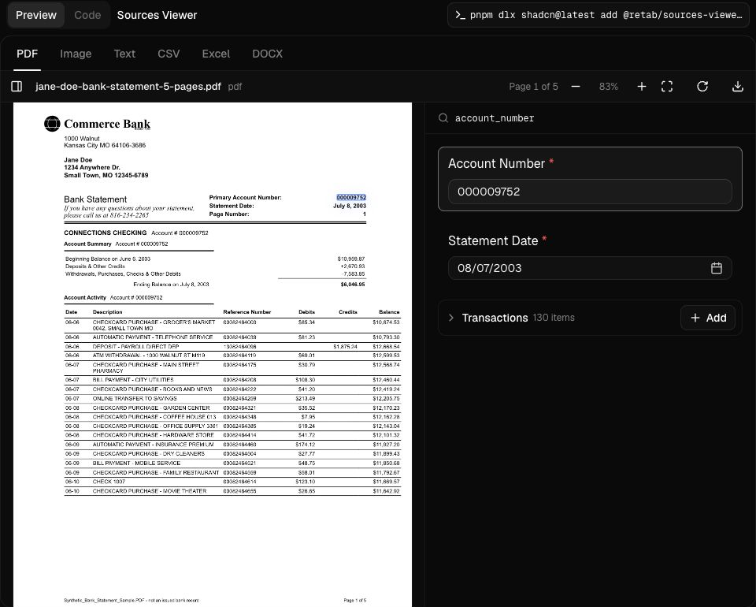
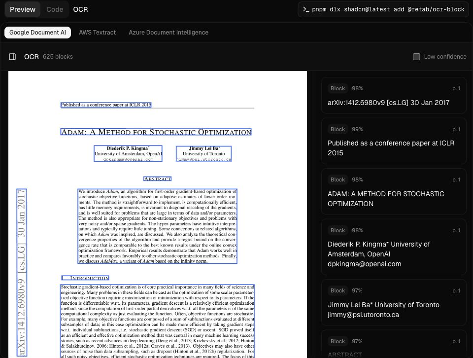
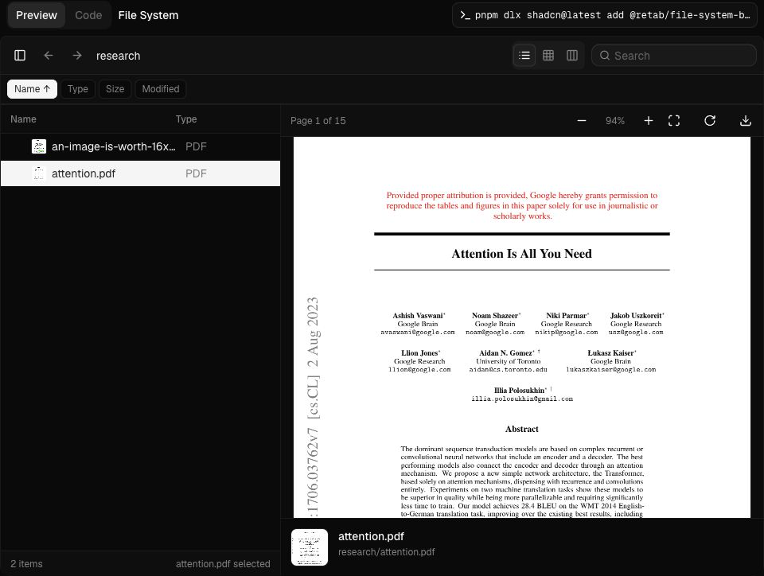
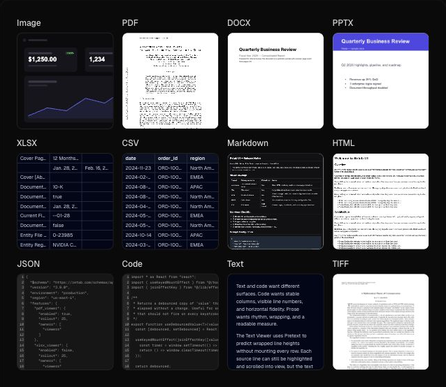

# Retab UI

[Retab UI](https://ui.retab.com) is a shadcn registry for products where files,
schemas, citations, and extracted data need to live in the same interface.
Install the pieces you need as local React and Tailwind source, then adapt them
inside your own design system.

The library focuses on the awkward surfaces generic UI kits usually skip:
multi-format file rendering, OCR layout review, source-backed JSON fields,
upload intake, thumbnail generation, schema editing, and workflow blocks for
parse, extract, split, and partition results.

## Project Map

- Documentation: [https://ui.retab.com/docs](https://ui.retab.com/docs)
- Components: [https://ui.retab.com/docs/components](https://ui.retab.com/docs/components)
- Examples: [https://ui.retab.com/examples](https://ui.retab.com/examples)
- GitHub: [retab-dev/retab-ui](https://github.com/retab-dev/retab-ui)
- Registry namespace: `@retab/*`

## Install One Surface

Add a registry item with the shadcn CLI:

```bash
npx shadcn@latest add @retab/file-viewer
```

Render the generated component from your app:

```tsx
import { FileViewerPreview } from "@/components/ui/file-viewer";

export default function Page() {
  return (
    <FileViewerPreview
      className="h-[720px]"
      source={{
        kind: "url",
        url: "/documents/statement.pdf",
        fileName: "statement.pdf",
        mimeType: "application/pdf",
      }}
    />
  );
}
```

The install writes source files into your repository. Keep the generated code as
part of your app, and adjust aliases such as `@/components/ui/file-viewer` or
`@/components/blocks/ocr-block` if your project uses a different layout.

## Component Snapshots

### Sources Viewer

Put extracted fields beside their evidence. PDF, image, text, CSV, Excel, and
Word sources all use the same interaction model: focus a value, reveal the
region, line, cell, or span behind it.



```bash
pnpm dlx shadcn@latest add @retab/sources-viewer-block
```

```tsx
import { SourcesViewerBlock } from "@/components/blocks/sources-viewer-block";

export default function Page() {
  return <SourcesViewerBlock />;
}
```

### OCR

Inspect OCR output as a document, not as raw provider JSON. The block pairs the
page image with normalized text blocks, confidence metadata, and provider
switching for Google Document AI, AWS Textract, and Azure Document Intelligence.



```bash
pnpm dlx shadcn@latest add @retab/ocr-block
```

```tsx
import { OcrBlock } from "@/components/blocks/ocr-block";

export default function Page() {
  return <OcrBlock />;
}
```

### File System

A document workspace over object-store manifests. List, grid, and column views
share selection, lazy folders, generated thumbnails, and a persistent
`FileViewer` preview.



```bash
pnpm dlx shadcn@latest add @retab/file-system-block
```

```tsx
import { FileSystemBlock } from "@/components/blocks/file-system-block";

export default function Page() {
  return <FileSystemBlock />;
}
```

### File Thumbnail

Preview files before users open them. The thumbnail frame accepts files, URLs,
blobs, inline text, generated preview images, and custom preview content.



```bash
npx shadcn@latest add @retab/file-thumbnail
```

```tsx
import { FileThumbnail } from "@/components/ui/file-thumbnail";

export function InvoiceThumbnail() {
  return (
    <FileThumbnail
      thumbnailShape="square"
      thumbnailSize="md"
      source={{
        kind: "url",
        url: "/documents/invoice.pdf",
        fileName: "invoice.pdf",
        mimeType: "application/pdf",
      }}
    />
  );
}
```

## Core Registry Items

```bash
npx shadcn@latest add @retab/file-viewer
npx shadcn@latest add @retab/pdf-viewer
npx shadcn@latest add @retab/docx-viewer
npx shadcn@latest add @retab/xlsx-viewer
npx shadcn@latest add @retab/file-thumbnail
npx shadcn@latest add @retab/dropzone
npx shadcn@latest add @retab/schema-builder
npx shadcn@latest add @retab/data-cell
```

## Workflow Blocks

```bash
pnpm dlx shadcn@latest add @retab/sources-viewer-block
pnpm dlx shadcn@latest add @retab/ocr-block
pnpm dlx shadcn@latest add @retab/file-system-block
pnpm dlx shadcn@latest add @retab/parse-viewer-block
pnpm dlx shadcn@latest add @retab/split-viewer-block
pnpm dlx shadcn@latest add @retab/partition-viewer-block
pnpm dlx shadcn@latest add @retab/pdf-thumbnails-block
```

## Run Locally

```bash
pnpm install
pnpm dev
pnpm registry:build
pnpm test
pnpm typecheck
```

The docs app runs at `http://localhost:3100`.

## Maintainers

Retab UI is built by [Retab](https://retab.com).

## License

Licensed under the [MIT license](LICENSE.md).
