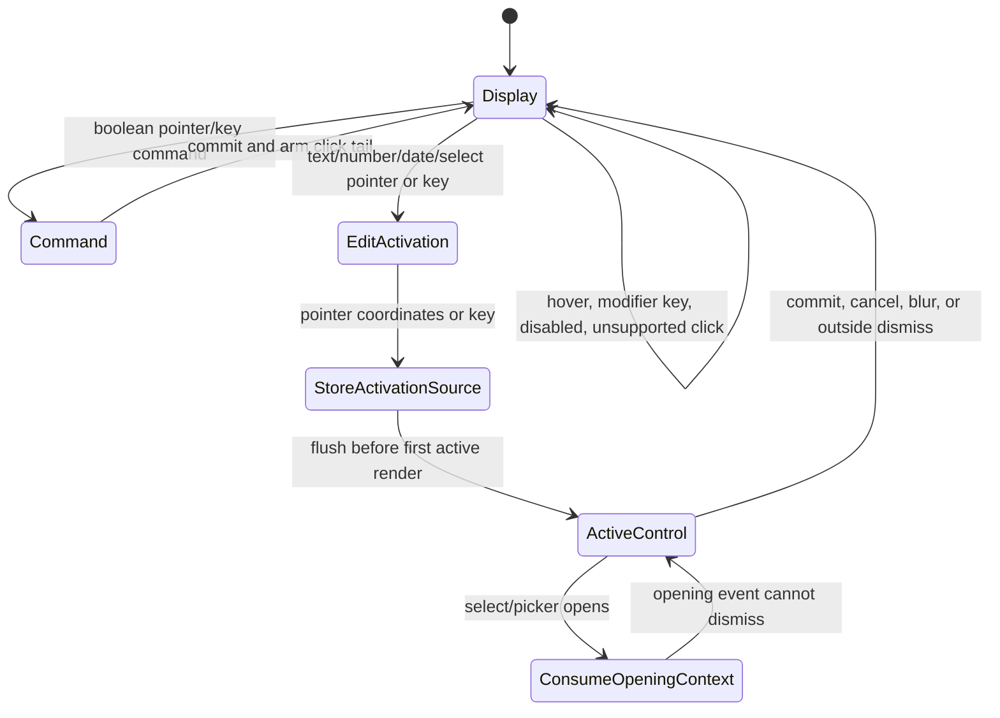

# JSON Table and DataCell Architecture

## Essence

JSON table owns document structure, schema interpretation, virtualization, and
the identity of the active cell. DataCell owns primitive display and primitive
controls. JSON table has only two editing paths: DataCell-backed primitive
cells and structured object/array cells.

```txt
document + schema
  -> projection
  -> visible rows and columns
  -> display cells
  -> one active primitive identity or one structured session
  -> one primitive control
  -> one commit path
```

Anything outside that line must justify itself.

## Current Documents

Read these documents in this order:

1. `components/json-table/ARCHITECTURE.md`: current runtime ownership and
   verification contract.
2. `design/data-cell-json-table-platonic-issues-blueprint.md`: current issue
   ledger. Older JSON-table blueprints are historical unless this ledger points
   back to them.
3. `design/data-cell-json-table-current-platonic-gap-blueprint.md`: current
   implementation blueprint for the remaining non-platonic gaps.
4. `design/data-cell-json-table-style-invalidation-findings.md`: current
   style/layout attribution notes for select and picker performance.
5. `components/json-table/json-table-performance-budget.json`: checked
   performance budgets.
6. `scripts/profile-json-table-primitive-interactions.mjs`: profiler that
   produces saved and fresh JSON-table interaction reports.
7. `scripts/verify-json-table-performance-budget.mjs` and
   `scripts/verify-json-table-performance-budget-fresh.mjs`: saved and fresh
   budget gates.

## State Glossary

- `sourceDocument` is the latest document received from parent props.
- `projectionDocument` is the document identity used to project visible rows.
- `confirmedDocumentData` is the authoritative data base used for outgoing
  document patches.
- A parent echo is a same-document-id source update caused by a table commit.
- A primitive pending value is a scalar value owned by
  `JsonTablePrimitiveEditStore` until the parent echo confirms it.
- A structured pending value is an object or array value owned by
  `useJsonTableStructuredCellController` until projection catches up.
- `JsonTableCellCommit.visibleThrough` names which local owner keeps a committed
  value visible before the parent echo is reconciled.

## Ownership

### JSON Table

JSON table owns:

- projected rows, visible columns, and field paths
- schema metadata and active-cell selection
- `JsonTablePrimitiveActiveCell` identity for DataCell-backed cells
- `JsonTableStructuredEditSession` state for object/array popovers
- document mutation through the table commit boundary
- shell activation from table chrome and keyboard focus

JSON table does not own:

- primitive input rendering
- checkbox semantics
- date/time popup geometry
- primitive draft state
- primitive picker-open state
- primitive value formatting/parsing

### DataCell

DataCell owns:

- inert display rendering
- text input focus, caret placement, draft, and blur commit
- number/integer input attributes and numeric parse metadata
- boolean checkbox semantics
- date/time/date-time trigger, popup, and picker commit
- primitive formatting/parsing helpers

DataCell does not own:

- table active-cell identity
- document mutation
- schema traversal
- structured object/array popovers
- hover-to-edit behavior

## Runtime Files

```txt
registry/new-york-v4/ui/data-cell.tsx
registry/new-york-v4/ui/data-cell-types.ts
registry/new-york-v4/ui/data-cell-format.ts
registry/new-york-v4/ui/data-cell-classes.ts
registry/new-york-v4/ui/data-cell-display.tsx
registry/new-york-v4/ui/data-cell-input-control.tsx
registry/new-york-v4/ui/data-cell-boolean-control.tsx
registry/new-york-v4/ui/data-cell-picker-control.tsx
registry/new-york-v4/ui/data-cell-picker-position.ts
```

`data-cell.tsx` is only the public router and barrel. It contains no rendering
mechanics. The focused files each have one reason to change.

## Active State Contract

Primitive cells receive only active identity. The table does not store their
draft values or overlay state.

```ts
type JsonTablePrimitiveActiveCell = {
  cellId: JsonTableCellId
  docId: string
  fieldPath: string
}
```

Structured object/array editors keep a table-owned session because their
popover lifecycle is table-specific.

```ts
type JsonTableStructuredEditSession = {
  id: number
  cellId: JsonTableCellId
  docId: string
  fieldPath: string
  intent: JsonTableActivationIntent
  isOverlayOpen: boolean
}
```

There are no compatibility aliases. Primitive identity, primitive draft,
overlay state, and structured popover state are separate concepts.

## Cell Prop Ownership

`JsonTableCellProps` is grouped by owner, not by call-site convenience:

- `cellProjection` carries the logical cell: column, projected cell, schema,
  document identity, editability, and accessibility coordinates.
- `primitiveEditing` carries primitive active identity and primitive pending
  value storage.
- `structuredEditing` carries the structured object/array session lifecycle.
- `commit` carries the single cell commit boundary.
- `hover` carries optional hover measurement callbacks.

Rows create stable shared group objects for primitive editing, structured
editing, commit, and hover. Each mounted cell receives its own `cellProjection`
because projected cell, rendered column, and absolute column index are
cell-specific. Cell memoization compares the meaningful fields inside each
group; it does not depend on group object churn.

## Table Runtime Ownership

`SingleFileVirtualizedTable` composes table runtime state. It should not own the
row patcher or raw fixed-grid virtualization details directly.

- `useJsonTableEditSessionCoordinator` owns primitive active identity and
  structured edit-session state.
- `useJsonTableRowPolicy` owns the editable/read-only row update strategy. It
  installs the read-only DOM patcher only for read-only tables and exposes the
  row scroll strategy plus row invalidation callback to the table.
- `useJsonTableViewportModel` owns fixed-grid virtualization, total table width,
  total row size, and translation from fixed-grid column items into the
  `JsonTableRenderedColumnWindow`.
- `useJsonTableRenderedColumnWindow` owns the editable/read-only column-window
  rule: editable tables receive the mounted body column window; read-only tables
  receive the full schema-visible column window.

## Interaction Contract

- Hover never mounts an active control.
- Pointer activation mounts the active control for the clicked cell only.
- Text cells focus and accept typing on the first click.
- Typeable keys start text editing.
- Boolean cells toggle on the first click and close the edit session.
- Enum cells open on the first click.
- Date cells open the picker on the first click.
- Text blur commits once and closes the primitive active cell.
- Escape cancels scalar drafts and closes the primitive active cell.
- Only one primitive active cell or structured session exists at a time.
- Only DataCell receives primitive draft updates.
- Switching cells synchronously finishes the previous primitive DataCell before
  the next cell action runs.

### DataCell Activation State Machine

DataCell activation has one policy owner: `data-cell.tsx` chooses whether a
primitive action is a command, an edit activation, or no action. Select and
picker controls consume the activation source and opening context; they do not
recreate activation policy.



Activation invariants:

- Pointer activation stores pointer coordinates and arms a one-shot click tail
  so the native click following `pointerdown` cannot immediately dismiss the
  popup it opened.
- Keyboard activation stores a keyboard source and never arms a pointer click
  tail.
- Boolean activation is a command: it commits directly and does not mount an
  editor.
- Modifier-key keyboard events do not activate editing.
- `storeDataCellActivationSource()` is the only DataCell `flushSync` boundary
  because the activation source must exist on the first active control render.
- Select and picker controls use `useDataCellOpeningContext()` and
  `shouldCancelDismiss()` to consume the opening event. They do not own timeout
  or next-tick dismissal hacks.

## Commit Path

`visibleThrough` is the final commit-lifecycle field name. It names which local
owner keeps a committed value visible until the parent echo is reconciled.

```txt
primitive control
  -> active control commitValue
  -> EditableJsonTableCell formatValueForCommit
  -> useJsonTablePrimitiveCommitController
  -> JsonTablePrimitiveEditStore
  -> JsonTableCellCommit(visibleThrough: "primitivePendingValue")
  -> useSingleFileTableDocumentModel
  -> onUpdateDocument
```

Structured object and array editors use their own document-data controller:

```txt
structured editor
  -> formatValueForCommit
  -> useJsonTableStructuredCellController
  -> JsonTableCellCommit(visibleThrough: "projectedDocumentValue")
  -> useSingleFileTableDocumentModel
  -> onUpdateDocument
```

No active control writes to the document directly, and structured commits do not
enter primitive pending/confirmed/stale lifecycle.

### Structured Pending Policy

Structured pending state is local to `useJsonTableStructuredCellController`
because object and array editors are a single mounted popover, not many hot
scalar controls spread across the grid.

The controller stores:

- `value`: the committed structured value to keep visible locally.
- `projectedValueAtCommit`: the projected document value at the moment of the
  commit.

The rules are exact:

- If the projected value still equals `projectedValueAtCommit`, the parent has
  not echoed the structured commit yet, so the local structured pending value
  remains visible.
- If the projected value equals the structured pending value, the parent echo
  has arrived. The pending value is cleared, including cloned object/array
  echoes.
- If the projected value differs from both `projectedValueAtCommit` and the
  structured pending value, the parent has produced a divergent same-field
  value. The parent value wins and pending state is cleared.

Horizontal virtualization does not cancel a structured session. If the active
object/array cell scrolls out of the column window, the popover DOM unmounts
with that cell. The table-owned `JsonTableStructuredEditSession` remains, and
when the cell remounts it reopens with the same active session.

## Document Lifecycle

`SingleFileTableView` is only the public adapter. `useSingleFileTableDocumentModel`
owns the document state machine:

- `sourceDocument` is the latest parent prop.
- `projectionDocument` is the document used to project rows.
- `confirmedDocumentData` is the latest data used to build outgoing patches.
- `JsonTablePrimitiveEditStore` owns primitive `pending`, `confirmed`, and
  `stale` cell snapshots.

The rules are exact:

- A new document id resets the primitive edit store and immediately projects the
  new source document.
- A same-id parent echo confirms primitive edit-store state and does not replace
  the projection document.
- A same-id external parent change replaces the projection document.
- Every cell commit crosses the same `JsonTableCellCommit` boundary. Primitive
  cells mark `visibleThrough: "primitivePendingValue"`; structured cells mark
  `visibleThrough: "projectedDocumentValue"`.

The document model is the only place where these concerns are allowed to meet:

- source-document identity and parent echoes
- `projectionDocument` selection for row projection
- `confirmedDocumentData` for outgoing patches
- primitive echo recording and reconciliation
- `onUpdateDocument` patch emission

Every other JSON-table module receives the result of that state machine. The
runtime, virtualized table, rows, cells, and primitive/structured controllers may
carry `onCellCommit`, but they do not patch document data, reconcile source
documents, or record primitive echoes.

Visible values resolve in one priority order:

| Priority | Source                   | Owner                                  | Meaning                                                                           |
| -------- | ------------------------ | -------------------------------------- | --------------------------------------------------------------------------------- |
| 1        | Primitive pending value  | `JsonTablePrimitiveEditStore`          | Scalar edit committed locally before the parent echo confirms it.                 |
| 2        | Structured pending value | `useJsonTableStructuredCellController` | Object/array editor commit shown locally until the projected document catches up. |
| 3        | Projected document value | `useSingleFileTableDocumentModel`      | Last document identity chosen for row projection.                                 |
| 4        | Source document value    | parent props                           | Authoritative input before any local projection state exists.                     |

## Performance Contract

Inactive cells are cheap because they render inert display only. Hover is cheap
because it does not mount inputs, selects, calendars, popovers, or local draft
state. Editing is localized because the table has exactly one primitive active
identity or one structured session at a time.

The protected measurements are:

- hover sweep active-control mounts
- click-to-input focus latency
- first keypress latency
- checkbox toggle latency
- enum open latency
- date picker open latency
- scroll with no active control
- scroll with one active overlay

The refreshed profile shows that large-table select and picker opens are no
longer dominated by React rendering. They render the active editable cell only,
but browser style recalculation still scales with the large virtualized table
surface. The budget records that cost honestly: it protects against structural
regressions such as sibling-cell rerenders, extra document patches, unbounded
rect reads, or unexpected overlay mounts, while keeping the remaining style
duration visible for future CSS/DOM invalidation work.

### Editable And Read-Only Row Policies

Editable tables use the React row policy:

- default row overscan is `0`
- row updates flow through React
- primitive controls, focus, popup ownership, and pending values stay inside the
  normal component tree
- the read-only DOM patcher is not used, because editable rows can contain
  active controls and local edit state that must not be rewritten imperatively

Read-only tables use the DOM row patch policy:

- default row overscan is larger for scroll continuity
- jump-scroll row updates may be handled by `useReadOnlyJsonRowPatcher`
- the patcher is limited to scalar/boolean read-only rows with stable DOM shape
- unsupported shapes fall back to the normal React virtualization path
- every patch attempt emits a `read-only-row-patcher` profiler mark with a
  fallback reason or the handled `rowsPatched` count
- the saved performance budget includes `read-only-scroll-jump`: scalar
  read-only rows must patch with zero fallbacks, while large read-only rows with
  object/array cells must emit a diagnosed fallback reason

## Regression Guards

`tests/json-table-row-render.test.tsx` protects the user-facing interaction
contract. `tests/json-table-architecture.test.ts` protects the hard-cutover
architecture by rejecting legacy names and deleted compatibility files.

## Verification Contract

Architecture-only changes should at minimum run:

```sh
pnpm test tests/json-table-architecture.test.ts
```

Before declaring the JSON table runtime complete, run the focused ownership
tests, the broad JSON-table interaction suite, and the fresh browser verifiers
through the canonical gate:

```sh
pnpm verify:json-table
```

The canonical gate runs:

```sh
pnpm test:json-table
pnpm verify:json-table-performance
PROFILE_SERVER_MODE=auto PROFILE_DEV_SERVER_TIMEOUT_MS=90000 JSON_TABLE_PROFILE_WARMUP=1 pnpm verify:json-table-performance:fresh
PROFILE_SERVER_MODE=auto PROFILE_DEV_SERVER_TIMEOUT_MS=90000 pnpm verify:json-table-accessibility:fresh
```

`PROFILE_SERVER_MODE=auto` reuses a healthy existing profile route, starts a
managed dev server when no route is reachable, and fails with diagnostics when a
route responds with the wrong page. Forced `managed` mode is useful only when no
other Next dev server for this repository is running; Next 16 allows one dev
server per repository, even on different ports.

Run `pnpm typecheck` before claiming repository-wide TypeScript health; it is
kept outside `verify:json-table` because the full app typecheck also covers
unrelated viewers and registry work.

If the change touches DataCell artifacts, extend acceptance:

- `registry/new-york-v4/ui/data-cell*`: run `pnpm verify:data-cell-registry`.
- `components/ui/data-cell.tsx`: run `pnpm verify:data-cell`.
- `public/r/data-cell.json` or `registry.json`: run
  `pnpm verify:data-cell-registry`.

`pnpm verify:data-cell` is a primitive browser certificate. It targets the
isolated `/data-cell-parity` harness by default so DataCell proof does not
depend on docs navigation, MDX pages, viewer wrappers, or JSON-table demos. The
docs page may still render DataCell as a consumer, but it is not the canonical
primitive verifier.

JSON-table tests should import DataCell through `components/ui/data-cell`
unless a test is intentionally proving a DataCell internal boundary.

The browser accessibility verifier also checks the virtualized column geometry:
large-profile header and body cells with the same absolute `aria-colindex` must
align at left, middle, and far horizontal scroll positions. The same verifier
checks keyboard-only far-column enum, date, and text flows: focused far cells
open from Enter, close from Escape with focus returned to the cell, and commit
text from keyboard input. It also opens a far dynamic structured object cell,
asserts that its typed dynamic `reviewer` and `priority` controls render in the
dialog, verifies the structured session survives horizontal unmount/remount in
the browser, and checks keyboard Enter/Escape focus return for that structured
cell.

The saved performance verifier reads the checked-in profile fixture and guards
React work, DOM reads, document patches, and measured interaction budgets. It
accepts flat scenario budgets and explicit `hard`, `latency`, and `diagnostic`
budget sections so structural invariants can stay separate from style/layout
diagnostics. It is not a universal latency guarantee. The fresh verifier writes
`tmp/json-table-primitive-interactions-profile.fresh.json` by default, verifies
that fresh artifact against the same budgets, and must fail with setup
instructions that make a missing local server/page explicit. The profiler closes
Chrome profile targets after each target run, retries verified editable-mode
activation during setup, waits for actionable calendar day buttons before date
commit profiling, and reports profile-page diagnostics when the editable table
does not mount.

Every profiled scenario records a mounted-surface snapshot before and after the
interaction. The snapshot includes header cells/nodes, body editable
cells/nodes, popup roots/nodes, active and hovered editable cell counts,
stylesheet counts, and focused-element metadata. The saved verifier prints
those fields as `surface=`, `nodes=`, `css=`, `active=`, `hover=`, `focus=`,
and `owner=` so a style or latency failure points to the likely mounted surface
instead of only reporting a number.

For style-invalidation work, run the profiler with
`JSON_TABLE_STYLE_EXPERIMENTS=1` or `--style-experiments`. This adds large-table
row-count, extra-column-count, and overscan variants and prints a compact
`open-enum`, `open-date`, and `switch-dirty-cell` style-cost table. It also
profiles inert popup shells for an empty portal, select popup, and picker popup
so overlay CSS cost can be separated from JSON table edit logic. Those
experiment profiles are diagnostic; the normal verifier still gates the stable
`default` and `large` profiles.

Use `JSON_TABLE_PROFILE_TRACE=1` or `--trace` when a style budget needs root
cause evidence. Trace mode records per-scenario Chrome trace summaries with
top timed events, style/layout/script buckets, and invalidation events when
Chrome reports them. It is opt-in because it makes browser profiling heavier.

Use `JSON_TABLE_STYLE_CLASS_EXPERIMENTS=disable-row-hover,...` or
`--style-class-experiments disable-row-hover,...` for profiler-only CSS
experiments. Available toggles are `disable-row-hover`,
`disable-active-cell-overlay`, `disable-focus-visible-ring`, and
`disable-portal-shadow`. They inject a temporary style tag into the profiled
page so style/layout costs can be compared without changing production classes
or interaction semantics.

Use `JSON_TABLE_PROFILE_TARGETS=large` / `--targets large` and
`JSON_TABLE_PROFILE_SCENARIOS=open-enum,open-date,...` / `--scenarios ...` for
focused diagnostic trace runs and targeted repeated-profile gates. Target and
scenario filters are safe with profiler assertion: unfiltered assertion covers
the full scenario matrix, while filtered assertion validates the selected
scenarios with their scenario-specific invariants. Filtered reports record
`targetFilter` and `scenarioFilter` and fail if a requested scenario name is
never measured.

Repeated profiles report median, p90, and worst. The canonical gate validates a
single warmed measured run for fast local feedback. If repeated-run gating is
added, use p90 for latency/style budgets and worst for hard structural
invariants such as React fanout, document patches, rect reads, and mounted
surface counts. Median is trend evidence, not a pass/fail aggregate.

The checked large-profile budget uses repeated p90 evidence for the critical
near/far select, date, dirty-switch, and far text paths. Those scenarios keep
`maxStyleDurationMs <= 120` in
`components/json-table/json-table-performance-budget.json`. The tracked saved
profile fixture must be refreshed when those budgets are intentionally
tightened, otherwise saved-budget verification proves an obsolete baseline.

Editable tables default to zero row overscan because profiling showed mounted
row surface contributes directly to select/picker style recalculation. Read-only
tables keep a larger default overscan because they use row patching for scroll
continuity and do not mount primitive editors.
