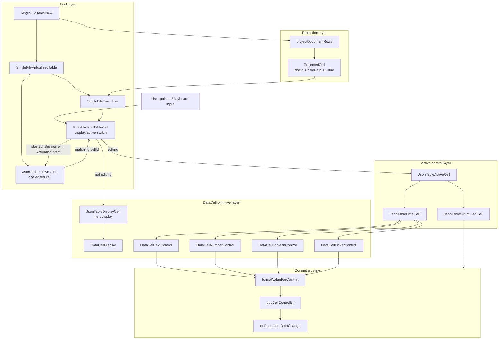
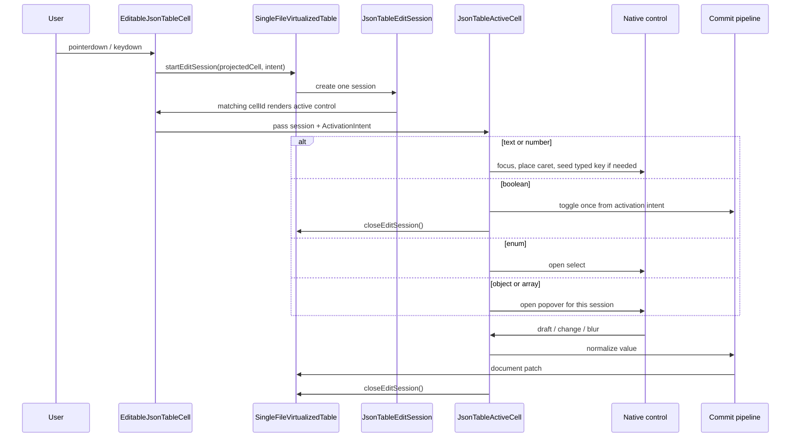
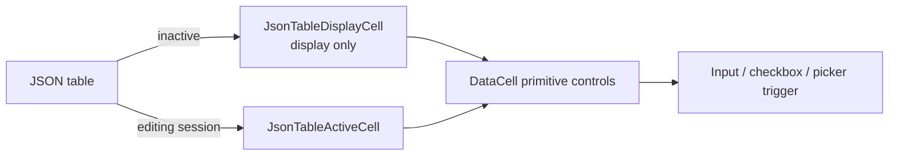
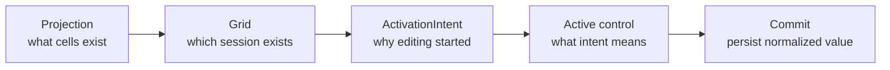

# JSON Table and DataCell Architecture

## Implemented Editing Architecture

## Session Interaction Flow

## DataCell Boundary

The JSON table uses inert display cells until a table-owned edit session exists.
The active control renders exactly one primitive control from the DataCell layer.

## Ownership Rule

The table owns session identity. Active controls own native interaction
semantics.
