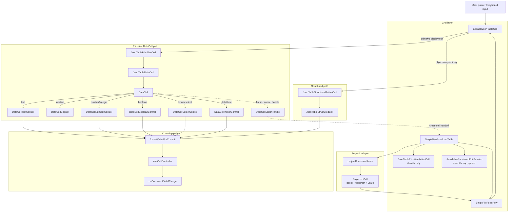
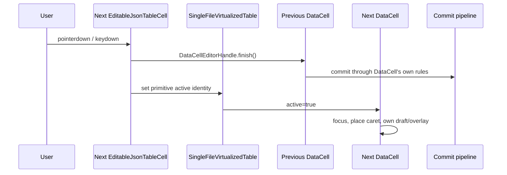
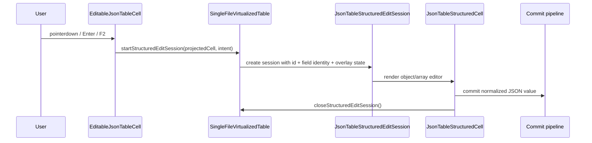
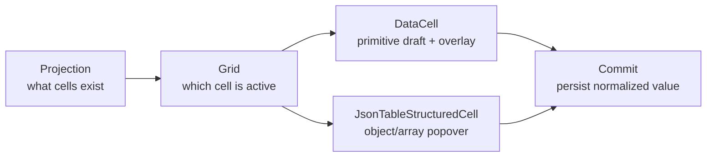

# JSON Table and DataCell Architecture

## Implemented Layers

## Primitive Handoff

## Structured Session

## Ownership Rule

The table owns identity and document commits. DataCell owns primitive editing
mechanics. Structured cells keep the richer table-owned popover state because
they are not primitive controls.
