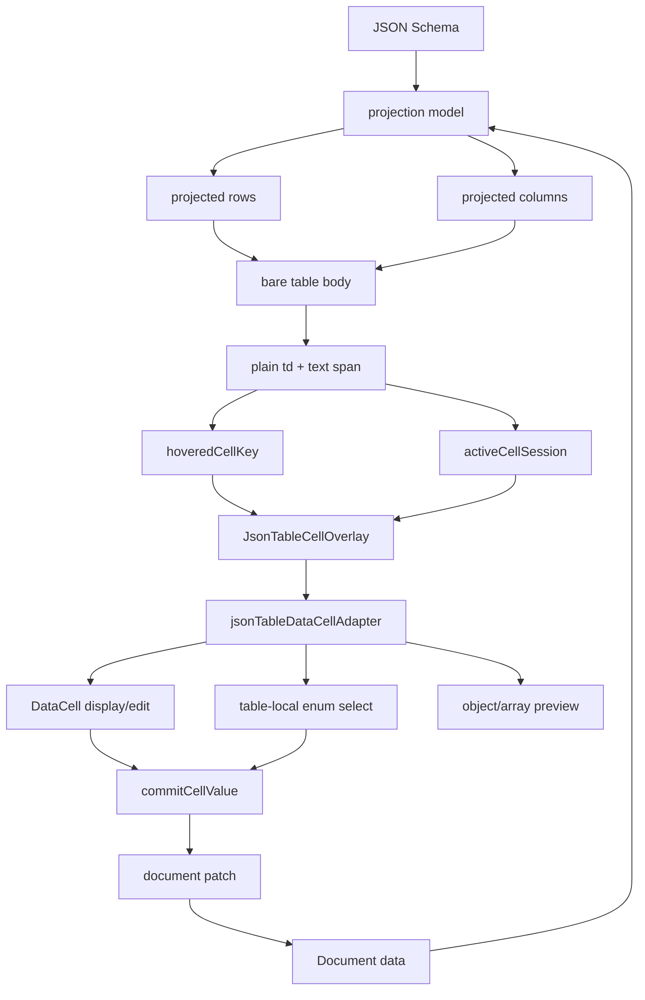

# DataCell and JSON Table Bare-Metal Blueprint

## Verdict

The current JSON table is not at the ideal architecture.

`DataCell` is close. It has a direct contract:

- `display` renders formatted inert content.
- `edit` renders the native-ish control for the kind.
- parsing, formatting, draft changes, commit, and picker open state have one
  obvious path.

JSON table should be just as direct. It is not. It currently spreads cell
interaction across table cells, edit sessions, per-kind editor wrappers,
display wrappers, row elevation, overlay booleans, draft coercion, special
cases, and memo comparators. That is why small interaction fixes keep feeling
like they miss the underlying problem.

The rebuild should not make JSON table "use DataCell more" by mounting one
`DataCell` in every table cell. That is still too much React on the hot path.

The pure architecture is:

```txt
The table renders plain cells.
A single DataCell-shaped overlay appears over the hovered or active cell.
The overlay is display-only on hover and edit-mode on activation.
Commits patch document data and the overlay disappears.
```

This makes `DataCell` a trompe-l'oeil: visually it looks like the cell, but it
is an overlay owned by the table interaction layer, not the table body itself.

## Design Standard

The target implementation must be:

- simple: one projection path, one active cell, one overlay component
- fast: no per-cell controls, no hover-mounted editors, no per-cell React churn
- complete: text, number, integer, boolean, date, time, date-time, enum, object,
  array, keyboard, pointer, blur, commit, cancel, virtualization
- bare-bones: table cells are inert DOM until one cell is hovered or active
- modular: table owns grid mechanics, DataCell owns scalar cell behavior
- consistent: the same concepts keep the same names everywhere

## First Principles

### What A Table Cell Is

A JSON table body cell is a coordinate:

```ts
type JsonTableCellKey = {
  docId: string
  fieldPath: string
}
```

It is not an editor. It is not a state owner. It is not a DataCell instance.
It is an addressable rectangle with a formatted value.

### What DataCell Is

`DataCell` is the scalar cell primitive. It knows how to:

- display scalar values
- focus text and number inputs
- position a text caret from pointer intent
- toggle booleans
- open date/time pickers
- parse primitive input
- commit primitive values

It must not know:

- JSON Schema
- document paths
- rows or columns
- virtualization
- selected cell identity
- source citations
- table hover state

### What JSON Table Is

JSON table knows how to:

- project schema and document data into rows and columns
- virtualize rows and columns
- format display strings for inert cells
- track hovered cell identity
- track one active edit identity
- convert a projected cell into DataCell props
- patch committed values back into document data

It must not know:

- input caret math
- checkbox internals
- date picker internals
- text/number DOM control behavior
- popup control behavior beyond active overlay placement

## Runtime Architecture



## The Hot Path

The table body renders this and almost nothing else:

```tsx
<td
  data-cell-id={cellId}
  data-field-path={fieldPath}
  data-json-table-cell
>
  <span>{displayText}</span>
</td>
```

Allowed hot-path responsibilities:

- stable `data-*` identity
- width and height
- alignment
- background confidence color
- selected/hovered CSS attribute
- pointer and keyboard event delegation
- formatted text

Forbidden hot-path responsibilities:

- `DataCell`
- `DataCellDisplay`
- inputs
- select triggers
- date pickers
- per-cell editor dispatch
- per-cell draft state
- per-cell overlay state
- per-cell `useEffect`
- per-cell `useLayoutEffect`

This is the main performance win. The table becomes a grid of inert cells, and
React only mounts interactive UI for the one cell the user is touching.

## Overlay Architecture

There is one overlay layer per table viewport:

```tsx
<JsonTableCellOverlayLayer
  hoveredCell={hoveredCell}
  activeSession={activeSession}
  viewportRef={viewportRef}
  commitCellValue={commitCellValue}
  closeActiveSession={closeActiveSession}
/>
```

The overlay layer renders nothing when there is no hovered or active cell.

It renders display mode when a cell is hovered:

```tsx
<DataCell mode="display" {...adapter.displayProps} />
```

It renders edit mode when a cell is active:

```tsx
<DataCell mode="edit" {...adapter.editProps} />
```

For enum it renders one table-local select, using the same visual density as
DataCell. `DataCell` should not be bloated with enum until enum becomes a
general primitive needed outside JSON table.

For object and array it renders a display preview plus the existing nested
viewer/editor only on activation. Object/array are not DataCell primitives.

## Overlay Rects

The overlay rect is read from the real table cell:

```ts
type JsonTableCellRect = {
  top: number
  left: number
  width: number
  height: number
}
```

The table stores identity, not rectangles. Rects are measured at the boundary:

- pointer enter
- pointer move only when the hovered cell identity changes or the viewport
  scrolls
- active session start
- viewport scroll
- column resize
- row virtualization change

The overlay should use `position: fixed` or viewport-local absolute positioning,
never change table layout, and never force the row to grow.

## State Model

The table needs only this state:

```ts
type JsonTableCellKey = {
  docId: string
  fieldPath: string
}

type JsonTableActivationIntent =
  | { type: "pointer"; clientX: number; clientY: number; detail: number }
  | { type: "keyboard"; key: string }
  | { type: "programmatic" }

type JsonTableActiveSession = {
  id: number
  cellKey: JsonTableCellKey
  intent: JsonTableActivationIntent
  initialValue: unknown
  draftValue: string
  isPopupOpen: boolean
}

type JsonTableInteractionState = {
  hoveredCellKey: JsonTableCellKey | null
  activeSession: JsonTableActiveSession | null
}
```

Remove:

- `status: "editing" | "committing" | "closing"`
- separate overlay state names
- editor-specific session shapes
- session fields that duplicate `cellKey`
- draft values typed as `unknown`

Drafts are strings because DOM controls edit strings. Boolean and enum can
commit directly and do not need long-lived drafts.

## Naming

Use these names everywhere:

- `cellKey`: stable `{ docId, fieldPath }`
- `cellId`: serialized key for DOM and maps
- `fieldPath`: materialized document path
- `fieldMetadata`: schema-derived metadata for one field
- `displayValue`: formatted display string or React node
- `draftValue`: raw input string
- `activeSession`: the one editing session
- `isPopupOpen`: select/date/time popup state
- `activationIntent`: pointer, keyboard, or programmatic activation
- `commitCellValue`: table-level document patch entry point

Do not use parallel names like `editSession`, `overlayOpen`,
`isSelectOpen`, `textDraft`, `materializedFieldPath` in the interaction layer.
`materializedFieldPath` may exist inside projection code only.

## Module Shape

```txt
components/json-table/
  json-table.tsx
  json-table-body.tsx
  json-table-cell.tsx
  json-table-overlay-layer.tsx
  json-table-overlay.tsx
  json-table-data-cell-adapter.ts
  json-table-interaction-state.ts
  json-table-value-commit.ts
  json-table-display-value.ts
  json-table-enum-select.tsx
  json-table-nested-overlay.tsx

components/json-table/lib/
  document-projection.ts
  document-patches.ts
  schema-field-metadata.ts
  value-normalization.ts
```

Delete after cutover:

```txt
components/json-table/cell-editors/
components/json-table/editable-json-table-cell.tsx
components/json-table/read-only-json-table-cell.tsx
components/json-table/json-table-display-cell.tsx
components/json-table/json-table-data-cell.tsx
components/json-table/use-cell-controller.ts
components/json-table/use-elevated-virtual-row.ts
```

If a deleted module still contains useful logic, move the logic into one of the
new modules. Do not keep wrapper modules as compatibility shims.

## DataCell Adapter

The adapter is the only place that knows both JSON Schema metadata and
`DataCell` props.

```ts
type JsonTableDataCellAdapter = {
  kind: "data-cell"
  displayProps: DataCellProps
  editProps: DataCellProps
}

type JsonTableEnumAdapter = {
  kind: "enum"
  value: string | null
  options: JsonTableEnumOption[]
}

type JsonTableNestedAdapter = {
  kind: "nested"
  value: unknown
  preview: string
}
```

Adapter rules:

- string -> `DataCell kind="text"`
- number -> `DataCell kind="number"`
- integer -> `DataCell kind="integer"`
- boolean -> `DataCell kind="boolean"`
- date -> `DataCell kind="date"`
- time -> `DataCell kind="time"`
- date-time -> `DataCell kind="date-time"`
- enum -> `JsonTableEnumSelect`
- object -> `JsonTableNestedOverlay`
- array -> `JsonTableNestedOverlay`
- unknown scalar -> `DataCell kind="text"`
- unknown object/array -> nested preview

Value conversion rules:

- `null` and `undefined` display as empty placeholder
- numbers stay numbers until a DOM draft is needed
- invalid number drafts stay in `draftValue` and do not patch the document
- dates preserve the table's existing date parsing policy
- enum options keep their original JSON value, not their display string
- object/array commits replace the value at `fieldPath`

## Interaction Contract

### Hover

Hover does:

- set `hoveredCellKey`
- measure the hovered cell rect
- render one display overlay
- optionally show source/citation affordances

Hover does not:

- create `activeSession`
- mount an input
- focus anything
- open a popup
- create a draft
- patch document data

This satisfies the trompe-l'oeil model. The user sees a DataCell-shaped cell on
hover, but the table body remains inert.

### Pointer Down

Pointer down on an editable plain cell:

1. Commit the previous active session if it has a valid dirty draft.
2. Close the previous active session.
3. Create a new `activeSession`.
4. Measure the cell rect.
5. Render the overlay in edit mode.
6. Let `DataCell` focus/control itself from `activationIntent`.

Pointer down must not depend on double click.

### Text Editing

Text cell pointer activation:

- opens edit overlay on the first click
- focuses the input
- places the caret based on pointer x
- typing immediately edits the input

Text cell keyboard activation:

- printable key opens edit overlay
- printable key seeds `draftValue`
- Enter or F2 opens edit overlay without replacing content

Text commit:

- blur commits
- Enter commits by blurring
- switching cells commits before the next session starts

Text cancel:

- Escape should close without committing the current dirty draft
- if `DataCell` currently blurs and commits on Escape, JSON table must intercept
  Escape at the overlay boundary before blur commit

### Number Editing

Number editing follows text editing, with parsing:

- valid number commits a number
- valid integer commits an integer
- empty nullable number commits `null`
- empty required number keeps previous value or rejects commit
- invalid number draft remains visible while active
- invalid number blur closes without patching or leaves the session active with
  invalid state, but it must never patch invalid data

The preferred simplest behavior is: invalid blur closes and reverts.

### Boolean Editing

Pointer activation on a boolean cell:

- creates active session
- renders boolean edit overlay
- toggles exactly once
- commits immediately
- closes immediately

Keyboard activation:

- Space toggles exactly once
- Enter toggles exactly once

There should be no hidden first click consumed by mounting.

### Enum Editing

Pointer activation on enum:

- creates active session
- renders table-local select overlay
- opens select immediately
- first option click commits
- close without selection closes without patching

Keyboard activation:

- Enter opens select
- Space opens select
- Arrow keys may open/select according to select behavior
- Escape closes without patching

The select close event must never be able to unmount before value commit. The
enum overlay owns the ordering:

```txt
value selection wins over popup close
popup close without value closes session
```

### Date, Time, Date-Time Editing

Pointer activation:

- renders `DataCell` picker control in edit mode
- opens picker immediately
- first click on picker control must not close the popup opened by activation

Commit:

- date selection commits date and closes
- time selection commits time and may stay open if the control needs it
- date-time commits each valid selected piece
- outside pointer closes and commits only already selected valid values

### Object And Array

Hover:

- display preview only

Activation:

- render nested overlay
- no nested editor in the table body
- nested overlay patches through `commitCellValue`

Object/array must not participate in DataCell scalar parsing.

### Virtualization

If the hovered cell scrolls out:

- clear `hoveredCellKey`
- unmount hover overlay

If the active cell scrolls out:

- keep active session while the overlay can remain anchored to a measured rect,
  or close and commit on virtualization detach

The simplest rule is:

```txt
active cell leaving the mounted range commits valid draft and closes
```

That avoids floating editors disconnected from real rows.

## Event Delegation

The table body should use delegated handlers at the row group or viewport level
where practical:

```tsx
<tbody
  onPointerMove={handleBodyPointerMove}
  onPointerLeave={handleBodyPointerLeave}
  onPointerDown={handleBodyPointerDown}
  onKeyDown={handleBodyKeyDown}
/>
```

Handlers find the closest `[data-json-table-cell]`.

This removes per-cell callback allocation and makes behavior easier to reason
about. If React event delegation is not enough for scroll/resize measurement,
use one viewport listener, not one listener per cell.

## Commit Pipeline

There is exactly one commit function:

```ts
function commitCellValue(args: {
  cellKey: JsonTableCellKey
  fieldMetadata: FieldMetadata
  value: unknown
}): void
```

Pipeline:

```txt
overlay value
  -> normalize for JSON Schema
  -> compare with current value
  -> patch document
  -> close active session
```

Rules:

- no patch if normalized value is equal to current value
- no patch for invalid drafts
- no patch for cancel
- no patch from hover
- no per-editor document patch logic

## Performance Budget

For a visible viewport with N cells:

- mounted table cells: N plain `td`
- mounted DataCell displays: 0 or 1
- mounted DataCell controls: 0 or 1
- mounted enum selects: 0 or 1
- mounted object/array editors: 0 or 1
- active React effects per idle table: zero cell-level effects

Scrolling should not mount controls.
Hovering should mount at most one display overlay.
Editing should mount at most one control overlay.

## Accessibility

Plain table cells keep grid/table semantics:

- `td`
- `tabIndex={0}` only when editable/focusable
- `aria-selected` for active coordinate if needed
- `aria-readonly` for read-only mode

Overlay controls own control semantics:

- text/number input semantics come from `DataCell`
- boolean checkbox semantics come from `DataCell`
- picker dialog semantics come from `DataCell`
- enum select semantics come from table-local select

The overlay should be labelled by the column header and row identity when
available.

## Testing Contract

Integration tests should assert behavior, not implementation details:

- hover shows display overlay without mounting input/select/picker
- moving hover moves one overlay, not many
- text first click focuses input and typing edits immediately
- text blur commits
- text Enter commits
- text Escape cancels
- switching from dirty text to another cell commits once
- number invalid draft does not patch
- boolean first click toggles once
- enum first click opens options
- enum option click commits once
- enum outside click closes without patch
- date first click opens picker
- date selection commits once
- popup first click is not eaten by activation
- active cell virtualized out commits valid draft and closes
- read-only cells never create active sessions
- scroll performance does not mount per-cell controls

Architecture tests should assert:

- table body cells do not render `data-slot="data-cell"` in idle state
- idle table has no inputs, comboboxes, or picker popups
- hover state renders at most one `data-slot="data-cell"`
- active state renders at most one control
- scalar editors do not exist as per-kind JSON table components

## Cutover Plan

1. Add `json-table-interaction-state.ts`.
2. Add `json-table-display-value.ts`.
3. Add `json-table-data-cell-adapter.ts`.
4. Add `json-table-overlay-layer.tsx`.
5. Add `json-table-overlay.tsx`.
6. Add `json-table-enum-select.tsx`.
7. Replace body cells with plain `JsonTableCell`.
8. Move interaction handlers to the viewport/body boundary.
9. Wire active sessions to the overlay.
10. Delete `cell-editors/` and old editable/read-only cell wrappers.
11. Replace tests that assert old editor internals with overlay behavior tests.
12. Profile idle render, hover, edit activation, and scroll.

No compatibility adapter. No old path kept alive.

## The Ideal End State

The table body is boring. It is just projected data in table cells.

The interaction layer is small. It knows hovered cell, active cell, rect, and
commit.

The overlay is the only place where a cell becomes a DataCell.

`DataCell` stays pure. JSON table stays close to the metal.

That is the architecture that matches the component at
`/docs/components/data-cell` instead of rebuilding it badly inside every table
cell.
