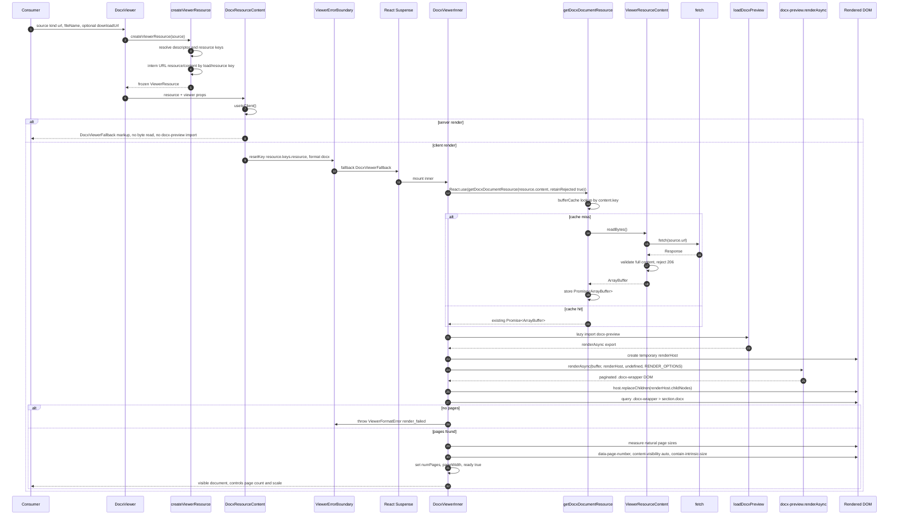
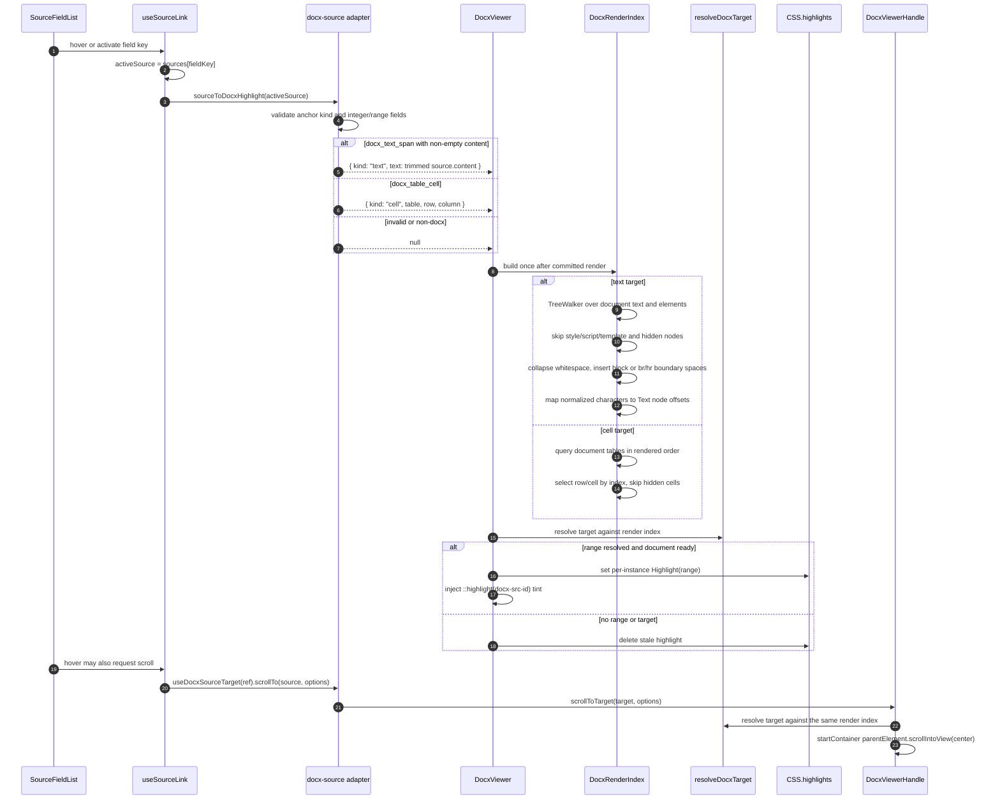
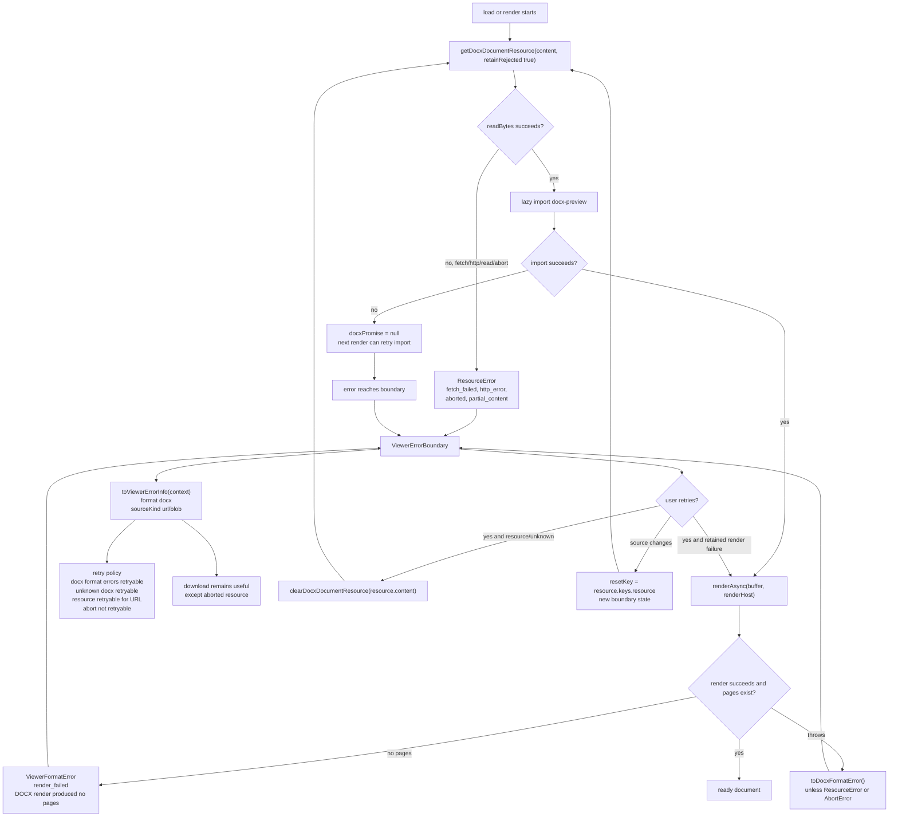
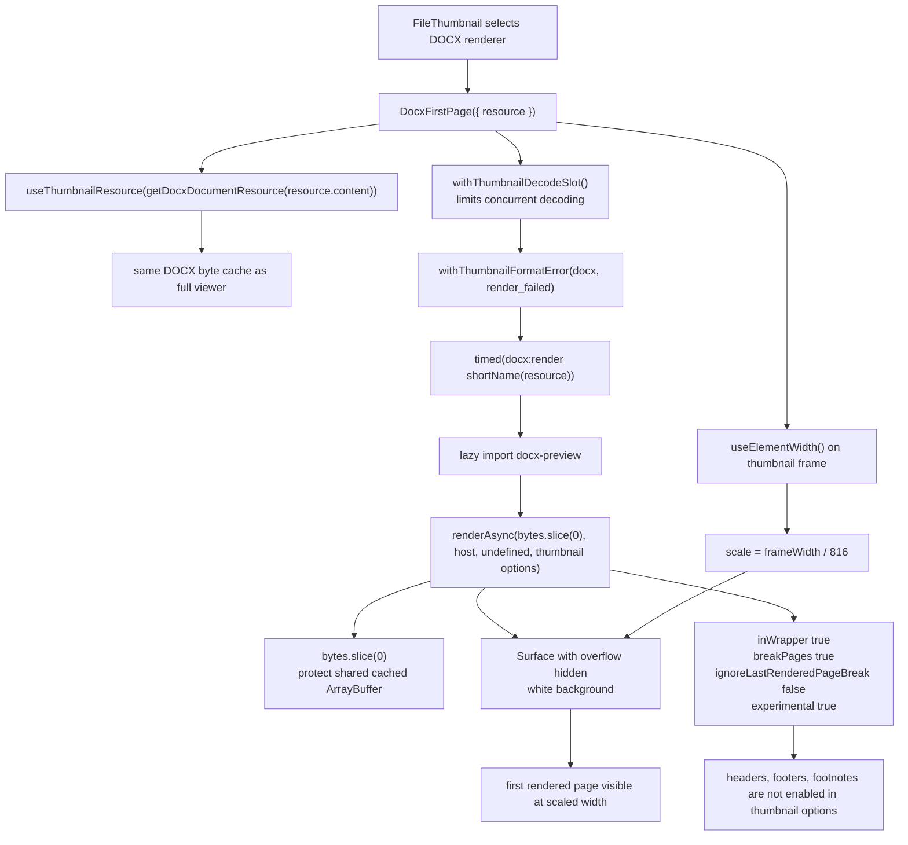
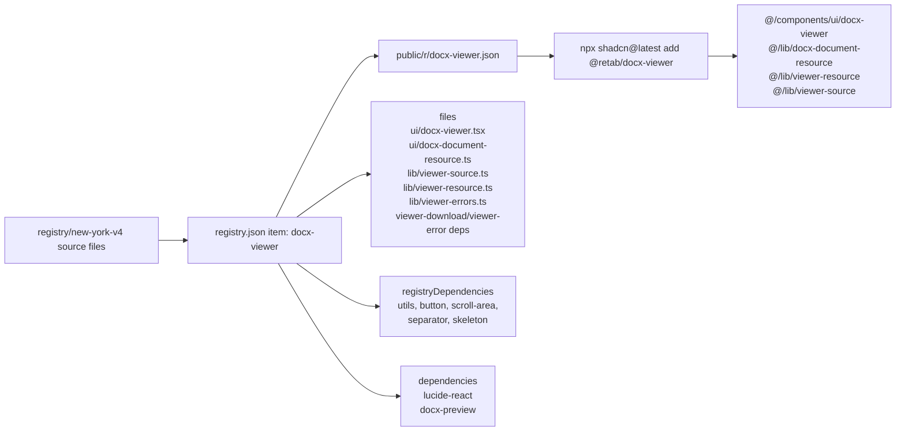

# DOCX Viewer System

This document maps the DOCX viewer as implemented in `registry/new-york-v4/ui/docx-viewer.tsx` and exported through `components/ui/docx-viewer.tsx`. It covers the public API, shared resource layer, DOCX byte cache, client-only render lifecycle, source-link highlighting, thumbnails, registry distribution, and tests.

## Whole-System Topology

```mermaid
flowchart TB
  subgraph "Consumers"
    Docs["content/docs/components/file-viewer/docx-viewer.mdx"]
    Demo["components/docx-viewer-demo.tsx"]
    Scrollbench["app/(view)/scrollbench/scrollbench-client.tsx"]
    SkeletonVerifier["app/(view)/viewer-skeleton-verifier/[viewer]/viewer-skeleton-verifier-client.tsx"]
    SourcesBlock["registry/new-york-v4/blocks/docx-sources-block.tsx"]
    ThumbnailConsumer["document thumbnail pipeline"]
  end

  subgraph "Published local entrypoints"
    UiDocxViewer["components/ui/docx-viewer.tsx\nre-export"]
    UiDocxSource["components/ui/docx-source.tsx\nre-export"]
  end

  subgraph "Registry implementation"
    DocxViewerFile["registry/new-york-v4/ui/docx-viewer.tsx"]
    DocxResourceFile["registry/new-york-v4/lib/docx-document-resource.ts"]
    DocxSourceFile["registry/new-york-v4/ui/docx-source.tsx"]
  end

  subgraph "DOCX viewer public API"
    DocxViewer["DocxViewer\nsource -> ViewerResource"]
    DocxResourceContent["DocxResourceContent\npre-created ViewerResource"]
    DocxViewerInner["DocxViewerInner\nSuspense body"]
    DocxHandle["DocxViewerHandle\nscrollToTarget()\ngetViewportElement()"]
    DocxProps["DocxViewerProps\nsource, scale/defaultScale,\ntoolbar, highlight, callbacks,\nbare, slots"]
    DocxTarget["DocxTarget\ntext target or cell target"]
  end

  subgraph "Shared viewer resource system"
    ViewerSource["ViewerSource\nurl, blob, text"]
    ViewerDescriptor["resolveViewerDescriptor()\ncategory, identityKey,\ndisplayName, fileName, mimeType"]
    ResourceKeys["viewerResourceKeys()\nload key + presentation key\nresource key"]
    ResourceRegistries["resource registries\nurl Map max 128\ntext Map max 64\nblob WeakMap"]
    ViewerResource["ViewerResource\ncontent + originalDownload"]
    ResourceContent["ViewerResourceContent\nreadBlob/readBytes/readText\nreadStream/readRange"]
    UrlRead["URL content\nfetch -> validate full response\narrayBuffer/blob/text/stream/range"]
    BlobRead["Blob content\nblob.arrayBuffer()\nblob.stream()\nblob.slice()"]
    DownloadActions["viewer-download actions\nhref download\nblob object URL\ntext download"]
  end

  subgraph "DOCX byte and library caching"
    DocxByteCache["bufferCache\nMap loadKey -> Promise<ArrayBuffer>"]
    GetDocxResource["getDocxDocumentResource(content)\ndedup readBytes()"]
    ClearDocxResource["clearDocxDocumentResource(content)\ndelete retained failure/cache"]
    DocxPreviewPromise["docxPromise\nlazy import docx-preview\nreset on import failure"]
    DocxPreview["docx-preview + jszip\nbrowser-only"]
  end

  subgraph "Client gate, loading, and errors"
    UseIsClient["useIsClient()\nSSR false, hydrated true"]
    Fallback["DocxViewerFallback\nsame shell + controls skeleton\npage skeleton"]
    Suspense["React Suspense\nfallback while bytes/library/render body suspend"]
    ErrorBoundary["ViewerErrorBoundary\nformat docx\nretry/download UI"]
    ViewerErrors["viewer-errors\nResourceError\nViewerFormatError\nretryability\nuser messages"]
  end

  subgraph "Rendering and layout"
    RenderOptions["RENDER_OPTIONS\ninWrapper, breakPages,\nheaders, footers,\nfootnotes, experimental"]
    RenderHost["temporary renderHost div"]
    RenderAsync["renderAsync(buffer, renderHost,\nundefined, RENDER_OPTIONS)"]
    Host["hostRef div\nReact-owned empty host\nimperative child replacement"]
    Pages[".docx-wrapper > section.docx\npaginated DOM pages"]
    PageTagging["page tagging\ndata-page-number"]
    PageMeasure["measure natural page size\ngetBoundingClientRect()/scale"]
    PageVirtualization["content-visibility: auto\ncontain-intrinsic-size"]
    ScopedStyles["SCOPED_STYLES\ntransparent wrapper\npage border/shadow"]
  end

  subgraph "Zoom, resize, and scroll state"
    ResizeObserverNode["ResizeObserver on container\ncoalesced with requestAnimationFrame"]
    ScaleState["scale state\nfixed scale or fit width\nmanualScale nullable"]
    ScaleClamp["normalizeScale()/clamp()\n0.25 to 5\nNaN -> 1"]
    FitWidth["fitScale = (containerWidth - 32) / pageWidth"]
    CssZoom["CSS zoom on host\ncheap scale after layout"]
    ScrollArea["ScrollArea viewport"]
    ScrollMeasure["measureScroll()\nprogress = scrollTop / scrollable\ncurrent page at 20% marker"]
    ScrollCallbacks["onVisiblePageChange(page)\nonScrollProgressChange(progress)"]
    Controls["controls\npage count\nzoom out/in\nfit width\ndownload"]
  end

  subgraph "Source linking and target resolution"
    SourceTypes["document Source anchors\ndocx_text_span\ndocx_table_cell"]
    SourceAdapter["docxAnchorToTarget()\nvalidate anchor fields"]
    UseDocxSourceTarget["useDocxSourceTarget(ref)\nSourceTarget.scrollTo(source)"]
    SourceHighlight["sourceToDocxHighlight(activeSource)"]
    SourceLinkHook["useSourceLink()\nactiveSource + activePath\nfield hover/click state"]
    RenderIndex["buildDocxRenderIndex(root)\ntext positions + table cells\nbuilt once per committed render"]
    ResolveTarget["resolveDocxTarget(index, target)"]
    TextRange["text index\nTreeWalker text+elements\ncollapse whitespace\nmap normalized chars to DOM offsets"]
    CellRange["cell index\ndocument tables by index\nrow/cell lookup"]
    VisibilityFilter["visibility filtering\nhidden, aria-hidden,\ndisplay none, visibility hidden/collapse,\ncontent-visibility hidden"]
    CssHighlight["CSS Custom Highlight API\nper-instance highlight name\n::highlight tint"]
    ImperativeScroll["scrollIntoView()\nblock center\nreveals content-visibility pages"]
  end

  subgraph "DOCX sources block"
    SampleSources["components/viewers/sample-data/docx-sources.json"]
    Fields["FIELDS + SOURCES map\nhintFor paragraph/table cell"]
    SourceFieldList["SourceFieldList"]
    SourceIndicator["SourceIndicator"]
  end

  subgraph "Thumbnail system"
    DocxFirstPage["components/file-thumbnail/renderers/docx-thumbnail.tsx\nDocxFirstPage"]
    ThumbnailResource["useThumbnailResource(getDocxDocumentResource())"]
    ThumbnailSlot["withThumbnailDecodeSlot()"]
    ThumbnailErrors["withThumbnailFormatError(docx, render_failed)"]
    ThumbnailRender["docx-preview renderAsync(bytes.slice(0))\nwrapper true, pages true,\nno headers/footer options"]
    ThumbnailScale["useElementWidth()\nscale frame / 816\ntransform scale()"]
  end

  subgraph "Registry and docs distribution"
    RegistryJson["registry.json\nitem docx-viewer"]
    PublicRegistry["public/r/docx-viewer.json\ngenerated registry item"]
    RegistryDeps["registry dependencies\nutils, button, scroll-area,\nseparator, skeleton"]
    NpmDeps["package dependencies\nlucide-react\ndocx-preview"]
    InstallCommand["npx shadcn@latest add @retab/docx-viewer"]
  end

  subgraph "Verification"
    ViewerTests["tests/docx-viewer.test.tsx\nrender, SSR, cache, zoom,\nscroll, highlight, errors, retry"]
    EdgeTests["tests/docx-viewer-edge-cases.test.tsx\nboundary behavior"]
    ResourceTests["tests/docx-viewer-resource.test.ts\nbyte cache behavior"]
    SourceTests["tests/docx-source.test.tsx\nanchor validation and adapter"]
    ImportTests["tests/docx-viewer-import.test.tsx\nlazy import retry"]
    ThumbnailTests["tests/docx-thumbnail.test.tsx\nfirst page and buffer copy"]
  end

  Docs --> Demo
  Demo --> UiDocxViewer
  Scrollbench --> UiDocxViewer
  SkeletonVerifier --> UiDocxViewer
  SourcesBlock --> UiDocxViewer
  SourcesBlock --> UiDocxSource
  ThumbnailConsumer --> DocxFirstPage

  UiDocxViewer --> DocxViewerFile
  UiDocxSource --> DocxSourceFile
  DocxViewerFile --> DocxViewer
  DocxViewerFile --> DocxResourceContent
  DocxViewerFile --> DocxViewerInner
  DocxViewerFile --> DocxHandle
  DocxViewerFile --> DocxProps
  DocxViewerFile --> DocxTarget
  DocxViewerFile --> DocxResourceFile
  DocxSourceFile --> DocxTarget
  DocxSourceFile --> DocxHandle

  DocxViewer --> ViewerSource
  DocxViewer --> ViewerDescriptor
  ViewerDescriptor --> ResourceKeys
  ResourceKeys --> ResourceRegistries
  ResourceRegistries --> ViewerResource
  ViewerResource --> ResourceContent
  ResourceContent --> UrlRead
  ResourceContent --> BlobRead
  ViewerResource --> DownloadActions
  ViewerResource --> DocxResourceContent

  DocxResourceContent --> UseIsClient
  UseIsClient --> Fallback
  UseIsClient --> ErrorBoundary
  ErrorBoundary --> Suspense
  ErrorBoundary --> ViewerErrors
  ErrorBoundary --> ClearDocxResource
  Suspense --> Fallback
  Suspense --> DocxViewerInner

  DocxViewerInner --> GetDocxResource
  GetDocxResource --> DocxByteCache
  DocxByteCache --> ResourceContent
  ResourceContent --> GetDocxResource
  DocxViewerInner --> DocxPreviewPromise
  DocxPreviewPromise --> DocxPreview
  DocxViewerInner --> RenderOptions
  RenderOptions --> RenderAsync
  DocxPreview --> RenderAsync
  RenderAsync --> RenderHost
  RenderHost --> Host
  Host --> Pages
  Pages --> PageTagging
  Pages --> PageMeasure
  PageMeasure --> PageVirtualization
  PageMeasure --> FitWidth
  ScopedStyles --> Pages

  ResizeObserverNode --> ScaleState
  ScaleState --> ScaleClamp
  ScaleState --> FitWidth
  FitWidth --> CssZoom
  CssZoom --> Host
  ScrollArea --> ScrollMeasure
  ScrollMeasure --> ScrollCallbacks
  Controls --> ScaleState
  Controls --> DownloadActions

  SourceTypes --> SourceAdapter
  SourceAdapter --> UseDocxSourceTarget
  SourceAdapter --> SourceHighlight
  UseDocxSourceTarget --> SourceLinkHook
  SourceLinkHook --> SourceHighlight
  SourceHighlight --> DocxViewer
  DocxViewerInner --> TargetRange
  TargetRange --> TextRange
  TargetRange --> CellRange
  TextRange --> VisibilityFilter
  CellRange --> VisibilityFilter
  TargetRange --> CssHighlight
  TargetRange --> ImperativeScroll
  DocxHandle --> ImperativeScroll

  SampleSources --> Fields
  Fields --> SourceFieldList
  Fields --> SourceLinkHook
  SourceLinkHook --> SourceIndicator

  DocxFirstPage --> ThumbnailResource
  ThumbnailResource --> GetDocxResource
  DocxFirstPage --> ThumbnailSlot
  ThumbnailSlot --> ThumbnailErrors
  ThumbnailErrors --> ThumbnailRender
  ThumbnailRender --> DocxPreview
  ThumbnailRender --> ThumbnailScale

  RegistryJson --> PublicRegistry
  RegistryJson --> RegistryDeps
  RegistryJson --> NpmDeps
  PublicRegistry --> InstallCommand

  ViewerTests --> DocxViewerFile
  EdgeTests --> DocxViewerFile
  ResourceTests --> DocxResourceFile
  SourceTests --> DocxSourceFile
  ImportTests --> DocxPreviewPromise
  ThumbnailTests --> DocxFirstPage
```

## URL Render Lifecycle

## Source Link, Highlight, And Scroll

## Retry And Failure Paths

## Thumbnail Render Path

## Distribution And Generated Registry Item

## Important Contracts

- `DocxViewer` accepts only URL and Blob sources through `DocxDocumentSource`; the shared resource layer supports text too, but DOCX rendering is byte-oriented.
- `DocxViewer` creates a resource internally. `DocxResourceContent` accepts a pre-created `ViewerResource`, which is useful when a parent already resolved the file descriptor or shares resource state with another viewer surface.
- `resource.keys.load` is the byte identity. Metadata-only presentation changes can update names or download information without re-reading the same bytes.
- `resource.keys.resource` is the boundary reset identity. Changing it resets `ViewerErrorBoundary` state.
- URL resources fetch `source.url`; downloads use `source.downloadUrl ?? source.url`.
- Blob resources read directly from `blob.arrayBuffer()` and download either through `downloadUrl` or an object URL.
- `getDocxDocumentResource()` caches the `readBytes()` promise by `content.key`. By default it removes rejected promises; `DocxViewerInner` passes `retainRejected: true` so Suspense error boundaries can display and retry consistently.
- `ViewerErrorBoundary` calls `clearDocxDocumentResource()` on retry for resource errors and non-viewer-format errors, giving failed byte reads another chance.
- `docx-preview` is imported only on the client. The type import is erased at compile time; `useIsClient()` renders fallback markup during SSR.
- A transient `docx-preview` chunk import failure clears `docxPromise` so the next render can import again.
- `renderAsync()` writes to a temporary host first. Only after successful rendering are child nodes moved into the live `hostRef`, avoiding partial DOM commits.
- The viewer treats a render with zero `.docx-wrapper > section.docx` pages as a DOCX format error.
- Page dimensions are measured in natural, unzoomed units by dividing measured bounds by the current scale ref.
- Every page gets `data-page-number` for current-page tracking.
- Every page gets `content-visibility: auto` and `contain-intrinsic-size` for browser-managed off-screen page skipping with stable scroll height.
- Zoom is CSS `zoom` on the rendered host. It does not re-run `docx-preview`.
- Uncontrolled scale starts as fit-to-width. Manual zoom stores `manualScale`; fit width clears `manualScale` back to `null`.
- Controlled `scale` is normalized to `[0.25, 5]`; `NaN` becomes `1`. Controls zoom actions are inert while scale is controlled.
- Fit width subtracts the container padding (`32px`) from the measured container width before dividing by page width.
- Resize work and scroll work are coalesced with `requestAnimationFrame`.
- Scroll progress is clamped to `[0, 1]`; a non-scrollable viewport reports `0`.
- Current page is the last page whose top is above the marker at 20% of the scroll viewport height.
- Header and aside slots are rendered in the fallback and the final viewer so loading does not remove surrounding UI.
- The controls skeleton mirrors the final controls shape: page count and zoom percent are skeletons, controls are disabled placeholders.
- Highlighting is an enhancement. If `CSS.highlights` or `Highlight` is unavailable or throws, the document still renders.
- Text targets are case-sensitive and whitespace-normalized. The first match wins.
- Text target resolution skips non-document text, style/script/template content, hidden nodes, aria-hidden nodes, and nodes hidden through display, visibility, or content-visibility.
- Inline runs are concatenated without separators. Block boundaries and visible `br`/`hr` boundaries insert one normalized space.
- Table cell targets index tables in rendered document order under `.docx-wrapper > section.docx`; nested tables count as their own table under the current contract.
- Imperative scrolling resolves the target at call time and calls `scrollIntoView()`, which also forces browser revelation of pages hidden by `content-visibility: auto`.
- The DOCX thumbnail renderer shares the byte cache with the full viewer but passes `bytes.slice(0)` to `docx-preview` to protect the shared buffer from mutation.

## Test Coverage Map

- `tests/docx-viewer.test.tsx` covers SSR fallback, loading, render options, URL versus download URL, Blob sources, byte sharing, metadata-only updates, resource viewer usage, zoom control, resize behavior, scroll progress, page reporting, source highlight behavior, imperative scrolling, stale async render/load protection, error states, retry behavior, and text/table target edge cases.
- `tests/docx-viewer-edge-cases.test.tsx` covers zoom clamps, controlled `NaN` and zero scale, current-page marker boundaries, pre-render handle calls, viewport exposure during render, equal target highlight stability, bare/className forwarding, and Blob-sourced highlighting.
- `tests/docx-viewer-resource.test.ts` covers promise deduplication, shared load keys, rejected-promise eviction, retained rejected promises, explicit cache clearing, and Blob source reads without fetch.
- `tests/docx-source.test.tsx` covers docx anchor validation, text target trimming, table cell target creation, invalid ranges, non-docx rejection, stable `SourceTarget`, and forwarding scroll options into the viewer handle.
- `tests/docx-viewer-import.test.tsx` covers retry after transient `docx-preview` import failure.
- `tests/docx-thumbnail.test.tsx` covers first-page rendering, passing a copied buffer, thumbnail-specific render options, frame scaling, and render failure conversion into a DOCX `ViewerFormatError`.
