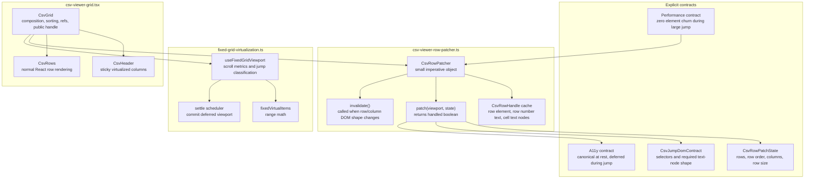
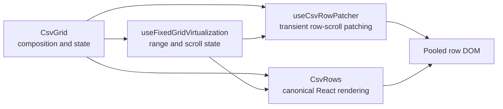

# CSV Grid Platonic Blueprint

This blueprint defines the path from the current high-performance CSV grid to
the platonic version of the component: simple, fast, complete, modular, and free
of accidental complexity.

The current implementation is good but not final. It has proven the performance
model: fixed-size virtualization, row pooling, and an imperative jump-scroll path
can keep the 20k-row CSV benchmark at the frame-rate ceiling. The next work is
to make that model feel inevitable instead of exceptional.

## Goal

Build the CSV grid as a small set of precise modules:

- React owns canonical state and declarative rendering.
- A dedicated row patcher owns transient scroll-time DOM patching.
- Fixed-grid infrastructure owns scroll measurement and range math.
- Accessibility state is correct at rest and intentionally bounded during fast
  scroll.
- Profiling is repeatable from the repo, not re-created from shell snippets.

The target is not just lower frame time. The target is code that reads like the
only reasonable way to build this grid.

## Current State

The current CSV grid has these strengths:

- Fixed row height and fixed column width.
- Row and column virtualization.
- Jump overscan set to zero.
- Stable row-pool slots across vertical scrolling.
- CSV-specific `minimumRenderedRows: 1`.
- Imperative row-scroll path that avoids immediate React viewport commits.
- Cached row/cell handles.
- Text-node updates instead of child-list churn.
- React settle after vertical scrolling quiets.
- Focused tests for fixed-grid infrastructure and CSV viewer behavior.

The current weaknesses:

- `CsvGrid` owns too many responsibilities.
- The fast path is isolated behind `useCsvRowPatcher`.
- DOM shape assumptions are implicit.
- `rowScrollStrategy` is the shared infrastructure strategy.
- Accessibility deferral during fast scroll is implicit.
- Profiling is not yet a first-class script.
- Naming is not yet precise enough.

## Target Architecture



## Module Boundaries

### `csv-viewer-grid.tsx`

Responsibilities:

- Compose the CSV table.
- Own sort state.
- Compute `rowOrder`.
- Wire `CsvViewerHandle`.
- Pass canonical state to normal row rendering.
- Create and invalidate the row patcher.

Non-responsibilities:

- No direct text-node mutation.
- No DOM handle cache internals.
- No query selectors for row/cell internals.
- No profiling-specific logic.

Ideal shape:

```ts
const rowPatcher = useCsvRowPatcher({
  rowWindowRef,
  getState: () => ({
    sourceRows,
    rowOrder,
    columnItems,
    rowHeight,
    activeCell,
  }),
})

const virtualization = useFixedGridVirtualization({
  ...
  minimumRenderedRows: 1,
  rowScrollStrategy: { handleViewport: rowPatcher.patch },
})

useLayoutEffect(() => rowPatcher.invalidate(), [virtualRows, columnItems])
```

### `csv-viewer-row-patcher.ts`

Responsibilities:

- Read row DOM handles.
- Validate that the DOM shape matches the fast-path contract.
- Compute the jump visible range.
- Patch row transforms.
- Patch hidden state only when changed.
- Patch row number and cell text nodes.
- Skip cell work when the pooled row already shows the target source row.
- Decline handling when active cell, horizontal scroll, missing DOM, or shape
  mismatch makes the fast path unsafe.

Non-responsibilities:

- No sort computation.
- No CSV parsing.
- No React state updates.
- No scroll listener setup.

Target exported API:

```ts
export interface CsvRowPatcher {
  patch: (viewport: FixedGridViewport) => "handled" | "pass"
  invalidate: () => void
}

export function useCsvRowPatcher(options: {
  rowWindowRef: React.RefObject<HTMLDivElement | null>
  getState: () => CsvRowPatchState
}): CsvRowPatcher
```

### `fixed-grid-virtualization.ts`

Responsibilities:

- Resolve the scroll element.
- Read viewport metrics in `requestAnimationFrame`.
- Classify jumping rows/columns.
- Compute row and column virtual windows.
- Defer React viewport commits only when a row-scroll strategy handles the viewport.
- Commit the final viewport after scroll quiets.

Ideal API refinement:

```ts
rowScrollStrategy?: {
  settleAfterMs?: number
  handleViewport: (viewport: FixedGridViewport) => "handled" | "pass"
}
```

The string return is more explicit than `boolean`, and the strategy object makes
deferred row scrolling discoverable.

Potential event shape:

```ts
interface FixedGridJumpViewportEvent {
  viewport: FixedGridViewport
  previous: FixedGridViewport
  rowDelta: number
  columnDelta: number
  settleAfterMs: number
}
```

Do not add this shape unless the extra information removes real ambiguity.

## Naming Pass

Current names that should be improved:

| Current                 | Proposed              | Why                                                |
| ----------------------- | --------------------- | -------------------------------------------------- |
| `renderJumpRows`        | `patchJumpRows`       | It mutates existing DOM; it does not render React. |
| `jumpRenderStateRef`    | `jumpStateRef`        | Shorter and still precise once module-local.       |
| `jumpRowHandleCacheRef` | `rowHandleCacheRef`   | The module name already says jump.                 |
| `onJumpRowsViewport`    | `rowScrollStrategy`   | Names the deferred row-scroll strategy explicitly. |
| `minimumRowWindow`      | `minimumRenderedRows` | Closer to user-visible behavior.                   |

Naming principle:

- Use `render` only for React/JSX output.
- Use `patch` for imperative DOM mutation.
- Use `handle` for event-like callbacks.
- Use `state` for data model.
- Use `handle` for DOM references only when the surrounding type says DOM.

## Accessibility Contract

The current fast path stops writing `aria-rowindex` during jump frames. This is
acceptable only because React restores canonical ARIA on settle.

Make that explicit:

- During fast jump:
  - Visible text must match the visual row.
  - Row position may be transiently stale.
  - Focus/active-cell states must force fallback to React path.
- After settle:
  - `aria-rowindex` must match the displayed row.
  - `aria-colindex` must match the displayed columns.
  - Active cell highlights must be canonical.

Add targeted tests:

- Fast path declines when `activeCell` is present.
- Fast path does not write `aria-rowindex` during jump.
- After settle, React restores the final `aria-rowindex`.

## Performance Contract

The fast path should preserve these large-jump properties on the 20k x 18 CSV
fixture:

| Metric               |                    Target |
| -------------------- | ------------------------: |
| Added elements       |                         0 |
| Removed elements     |                         0 |
| Child-list mutations |                         0 |
| Script duration      | <100ms dev, lower in prod |
| Max frame            |                     <33ms |
| FPS                  |   Display refresh ceiling |

These numbers are development-mode targets. Production profiling should become
the source of truth before more invasive optimization.

## Profiling Script

Create a committed script:

```text
scripts/profile-csv-scrollbench.mjs
```

It should:

- Load `http://localhost:3100/scrollbench?viewer=csv`.
- Run small and large scenarios.
- Collect:
  - ScrollBench results.
  - Mutation counts.
  - Chrome Performance metrics.
  - Optional CPU profile.
- Write:
  - `tmp/csv-scrollbench-profile.json`.
- Print a compact before/after-friendly summary.

Do not make profiling depend on ad hoc Python snippets. The repo should have one
repeatable command.

## Test Plan

Add or keep tests for:

- Fixed-grid virtual window math.
- Jump viewport handling and settle.
- CSV jump renderer DOM contract.
- Fast path fallback when:
  - row window is missing,
  - row pool is too small,
  - cell pool shape is wrong,
  - active cell is present,
  - horizontal scroll is non-zero,
  - rows are not virtualized.
- React settle restores canonical row attributes.
- Header-aware scrollbar thumb offset uses transform.

## Implementation Plan

### Phase 1: Extract Jump Renderer

Move the scroll-time row patching code from `csv-viewer-grid.tsx` into
`csv-viewer-row-patcher.ts`.

Acceptance:

- `csv-viewer-grid.tsx` no longer contains DOM selectors for cells/rows.
- Tests pass.
- Profile is no worse than current.

### Phase 2: Name Cleanup

Rename callback and local concepts for precision.

Acceptance:

- No `render` naming for imperative DOM patching.
- Shared hook API reads as an event handler.
- Variable names align across hook, renderer, and tests.

### Phase 3: Accessibility Tests

Codify the deferred-ARIA contract.

Acceptance:

- Fast path behavior is explicitly tested.
- React settle restores canonical ARIA.
- Active cell forces fallback.

### Phase 4: Committed Profiler

Add `scripts/profile-csv-scrollbench.mjs`.

Acceptance:

- One command produces a repeatable profile artifact.
- Output includes headline metrics and mutation counters.
- The script works against the existing dev server.

### Phase 5: Production Profile

Run the same profiling script against a production build or production-like
server.

Acceptance:

- We know whether the remaining cost matters outside dev mode.
- Further optimization is based on production evidence.

## Do Not Do

- Do not introduce Shadow DOM for performance unless profiling proves global CSS
  selectors are the bottleneck.
- Do not move CSV parsing into the grid.
- Do not make the fixed-grid hook CSV-aware.
- Do not let the imperative path become the canonical renderer.
- Do not add compatibility shims around old behavior.
- Do not add broad abstractions for hypothetical variable-size rows.

## End State

The ideal CSV grid should read like this:



At rest, React owns everything. During a large jump, the jump renderer patches
only the visible row pool. After the jump settles, React catches up and restores
the canonical DOM. The module boundaries make that truth obvious.
