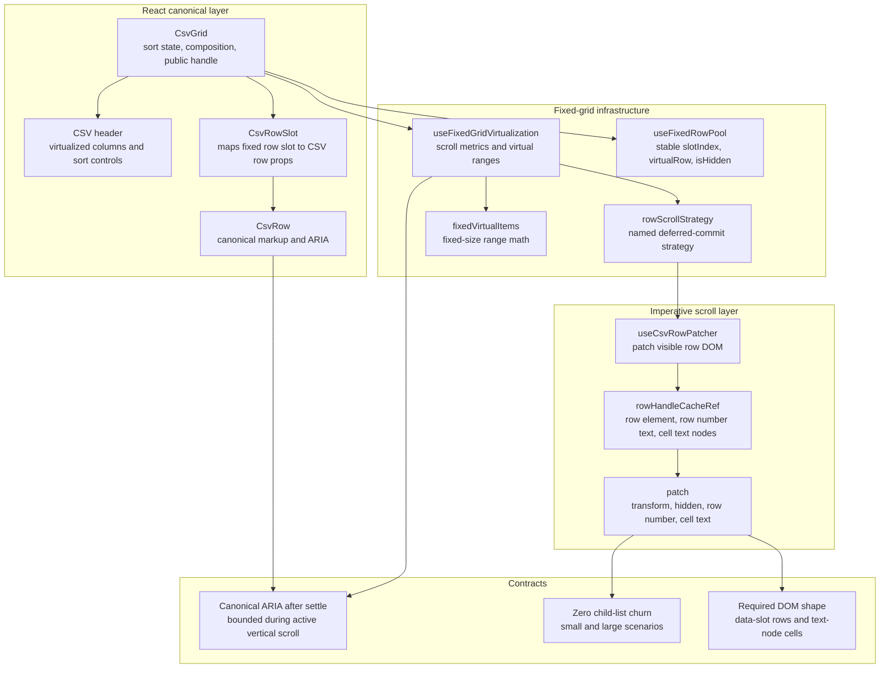

# CSV Grid Platonic Design Note

This note records the current shape of the CSV grid after the row-pool and
row-scroll strategy pass.

The component is now much closer to the ideal version of itself. The main
previous defects were:

- small scroll churned DOM through normal React virtualization;
- `CsvGrid` owned row-pool policy;
- the imperative path was named and shaped like a jump-only exception.

Those are now addressed.

## Current Truth

The CSV grid has one row lifecycle for virtualized rows:

- fixed-grid infrastructure computes virtual row ranges;
- `useFixedRowPool` turns those ranges into stable row slots;
- `CsvGrid` maps slots to CSV row data;
- `useCsvRowPatcher` imperatively patches visible row text and transforms while
  vertical scrolling is active;
- React commits the canonical viewport after scrolling quiets.

React still owns canonical state. It does not reconcile every row and cell on
each scroll frame.

## Current Profile

The current desktop ScrollBench profile uses the 20k x 18 CSV fixture at
1440 x 900:

| Metric               | Small Scroll | Large Jump |
| -------------------- | -----------: | ---------: |
| FPS                  |       119.74 |     119.76 |
| Average frame        |       8.35ms |     8.35ms |
| p95 frame            |        9.5ms |      9.6ms |
| Max frame            |       10.9ms |     10.3ms |
| Frames over 16ms     |            0 |          0 |
| Frames over 33ms     |            0 |          0 |
| Child-list mutations |            0 |          0 |
| Added elements       |            0 |          0 |
| Removed elements     |            0 |          0 |
| Long tasks           |            0 |          0 |
| Script duration      |       75.7ms |     68.7ms |
| Style duration       |       51.9ms |     48.3ms |
| Layout duration      |      178.7ms |    151.0ms |
| Task duration        |      531.4ms |    475.5ms |

The important change is not only frame rate. Small scroll now has the same zero
element churn contract as large jump.

## Architecture



## Module Boundaries

### `csv-viewer-grid.tsx`

Owns CSV-specific composition:

- sort state;
- row-order derivation;
- column header rendering;
- public `scrollToCell` handle;
- mapping `FixedGridRowPoolSlot` to `CsvRow` props.

It does not own:

- row-pool sizing policy;
- DOM handle caches;
- text-node mutation;
- scroll measurement.

### `fixed-grid-virtualization.ts`

Owns shared fixed-grid mechanics:

- viewport measurement;
- row and column range math;
- row-scroll strategy scheduling;
- deferred React viewport commit;
- stable row-pool slots.

The row-pool API is deliberately small:

```ts
interface FixedGridRowPoolSlot {
  slotIndex: number
  virtualRow: FixedGridVirtualItem | null
  isHidden: boolean
}
```

### `csv-viewer-row-patcher.ts`

Owns the only imperative CSV row mutation path:

- reads row handles from the current row window;
- validates the DOM shape;
- computes visible rows for the active viewport;
- patches transforms, hidden state, row numbers, and cell text;
- declines when active-cell or horizontal-scroll state makes patching unsafe.

The patcher is not a renderer. It does not own canonical state.

## Why Shadow DOM Is Still Not The Lever

Shadow DOM may help style isolation. It does not solve the hot path:

- row identity;
- text-node mutation;
- React reconciliation;
- scroll measurement;
- layout after transform changes.

The current architecture attacks those costs directly. Moving the same row pool
inside a shadow root would add boundary complexity without changing the core
performance model.

## Enforced Contract

The profiler is now both descriptive and assertive:

```bash
node scripts/profile-csv-scrollbench.mjs --assert
```

The assertion mode fails if either small or large ScrollBench violates:

- `childList === 0`;
- `addedElements === 0`;
- `removedElements === 0`;
- `longTasks === 0`;
- p95 frame budget;
- max frame budget.

This is intentionally heavier than Vitest because it needs Chrome and a running
ScrollBench route.

## Remaining Non-Ideal Pieces

The component is close, but not metaphysically perfect.

Remaining friction:

- `CsvRowSlot` is a small adapter in `CsvGrid`; this is acceptable because it
  maps CSV row data, but it is still one more local component.
- The row patcher depends on a strict text-node DOM shape. Tests cover this, but
  it is still a contract humans must preserve when editing row markup.
- Active-cell state forces fallback to React-owned behavior. That is correct,
  but it means the fastest path is intentionally unavailable during selection.
- The profiler assertion is not wired into CI here; it is a command, not yet a
  required gate.

## Verdict

The previous big imperfections are gone:

- small scroll no longer churns row DOM;
- row pooling is fixed-grid infrastructure;
- the imperative path is a named row patcher;
- the deferred scroll behavior is a named strategy;
- the performance contract is executable.

This is near the platonic shape for this component. The next improvements are
not broad rewrites. They are maintenance constraints: keep names precise, keep
the row DOM contract tested, and run the profiler assertion before changing the
scroll pipeline.
