# CSV ScrollBench System

This document maps the CSV viewer performance system end to end: the generated
benchmark data, the ScrollBench harness, the CSV viewer stack, fixed-grid
virtualization, normal React rendering, the fast row-scroll path, profiling, and
the verification surface.

## Scope

This diagram is centered on the CSV ScrollBench path:

- `app/(view)/scrollbench/*`
- `registry/new-york-v4/ui/csv-viewer.tsx`
- `registry/new-york-v4/ui/csv-viewer-grid.tsx`
- `registry/new-york-v4/ui/fixed-grid-virtualization.ts`
- `registry/new-york-v4/ui/header-aware-scrollbar.tsx`
- `tests/fixed-grid-infrastructure.test.ts`
- `tests/csv-viewer.test.tsx`

It does not describe the entire Retab application. It describes the complete
runtime and profiling system involved when ScrollBench measures the CSV table.

## Full System Diagram

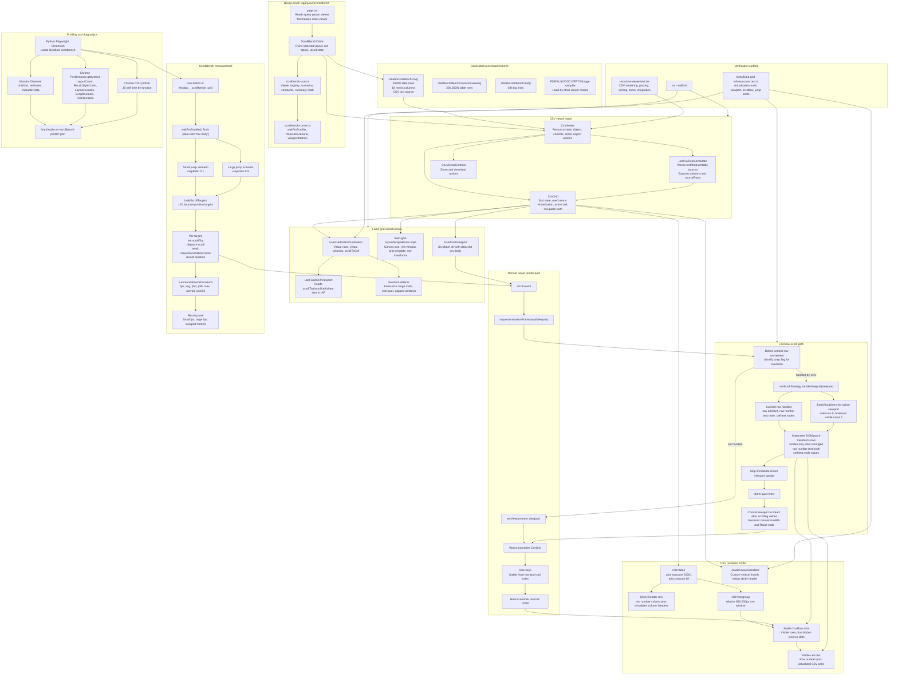

## ScrollBench Runtime Sequence

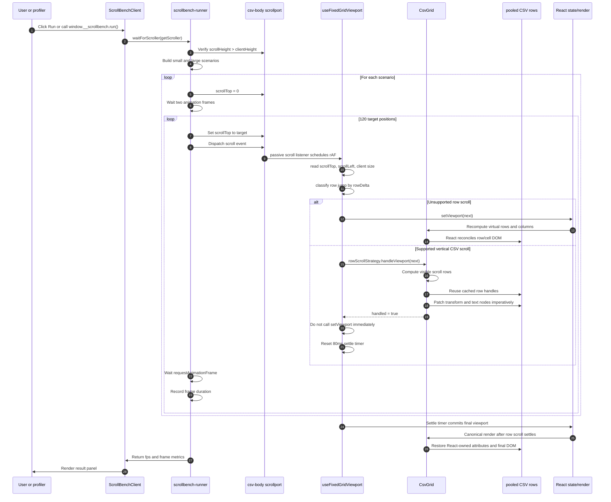

## State Ownership

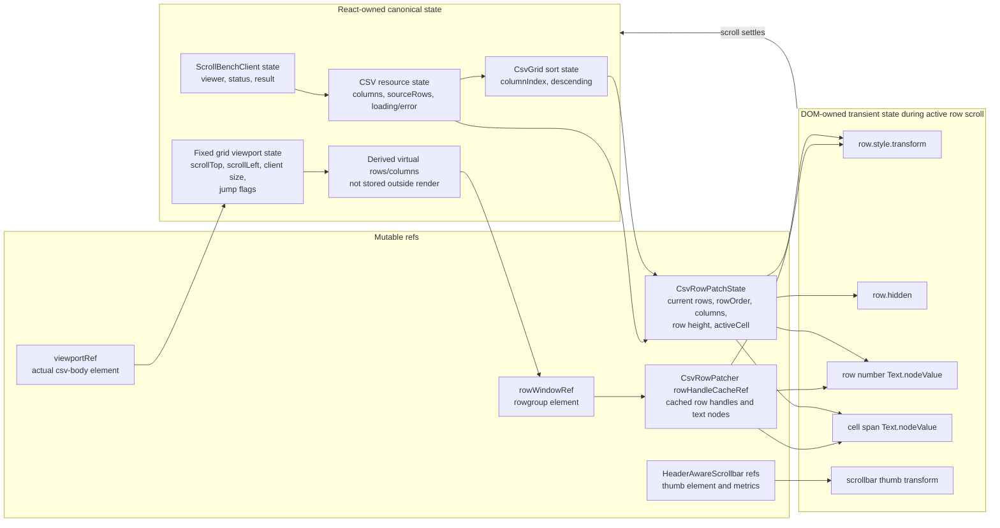

## React Path Versus Row Patch Path

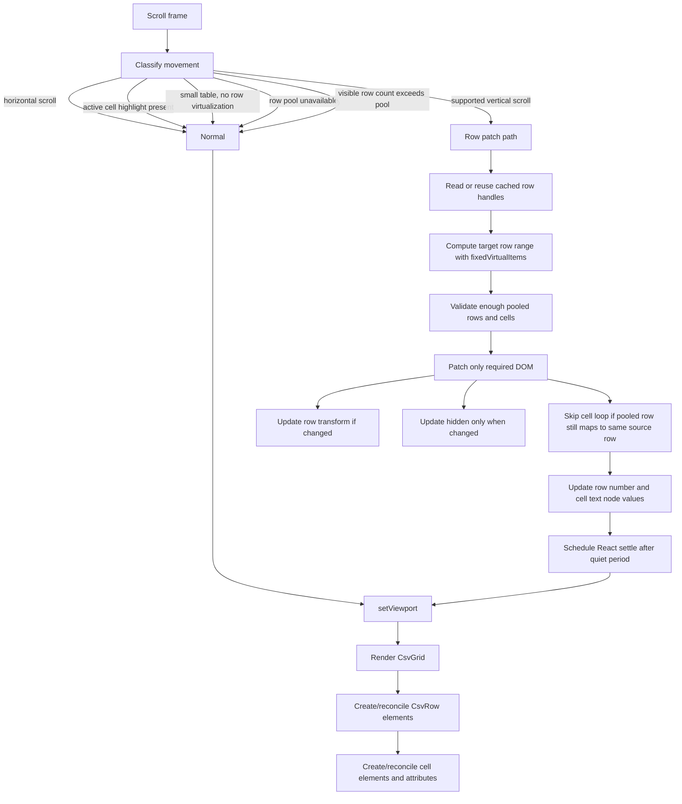

## Rendered DOM Shape

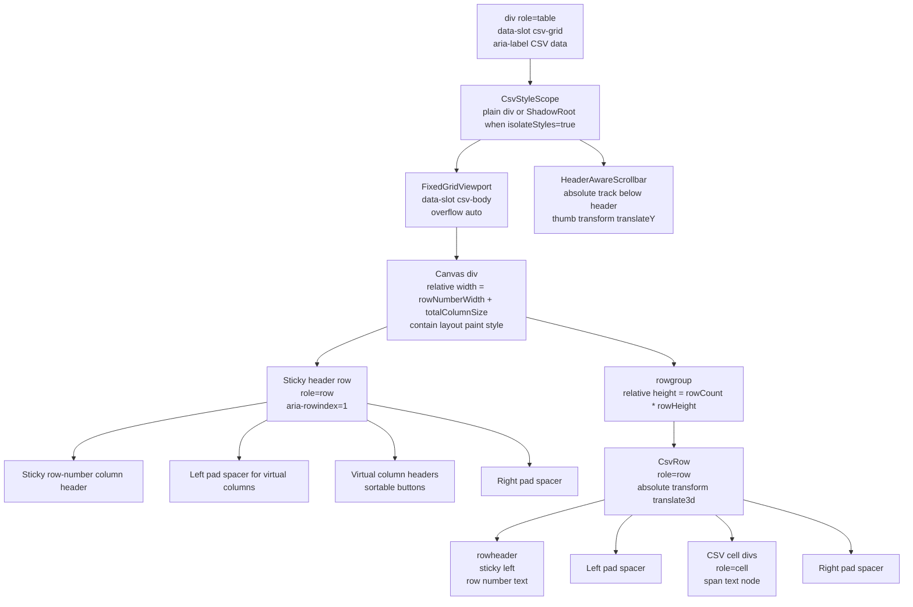

## Profiling Stack

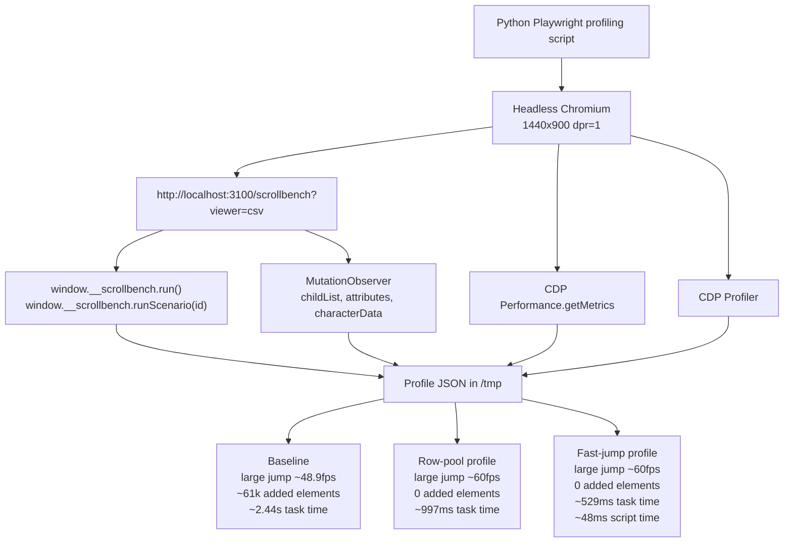

## Performance Evolution

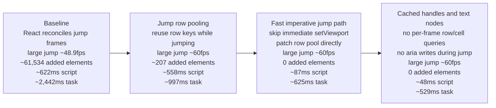

## Important Invariants

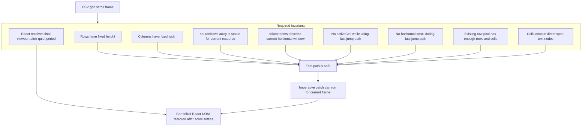

## Why Shadow DOM Is Not The Primary Performance Lever

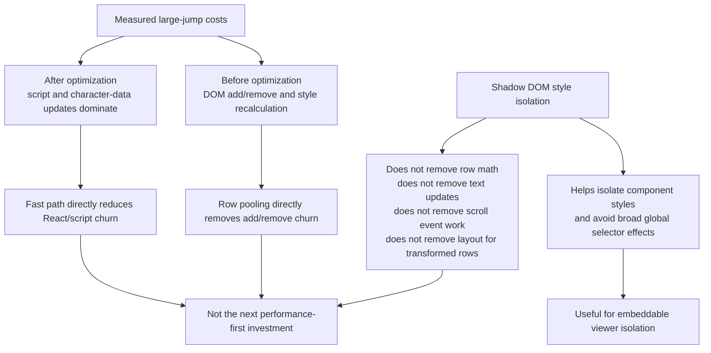

## Failure And Fallback Paths

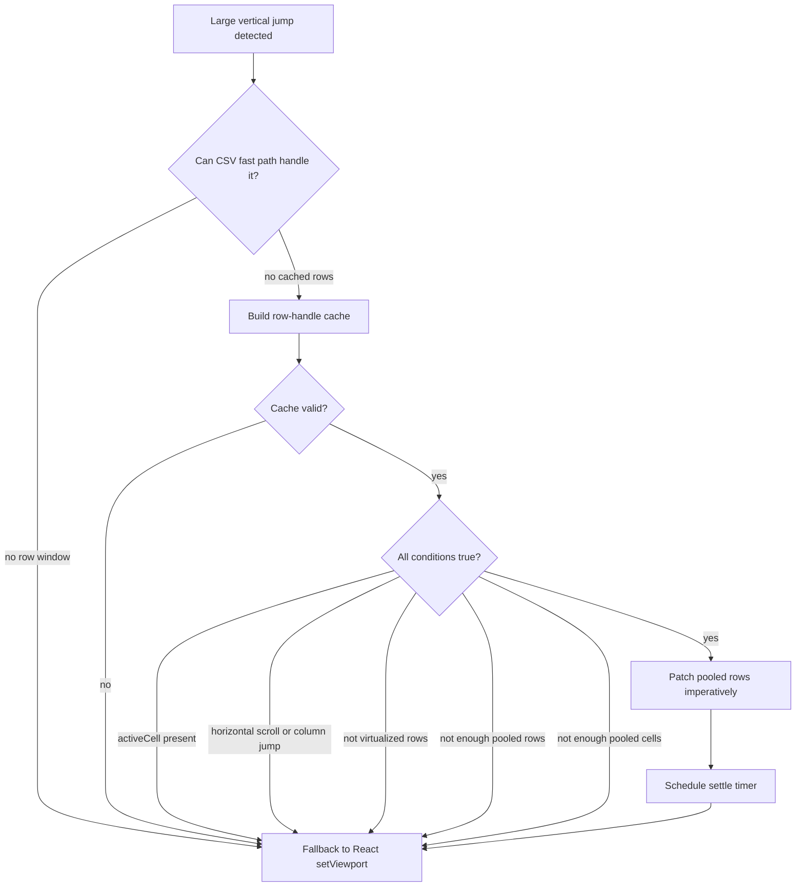

## Test Coverage Map

```mermaid
flowchart TB
  FixedInfra["tests/fixed-grid-infrastructure.test.ts"]
  CsvViewerTests["tests/csv-viewer.test.tsx"]
  TypeScript["tsc --noEmit"]

  FixedInfra --> PublicEntrypoints["Public re-export wiring"]
  FixedInfra --> VirtualMath["fixedVirtualItems and fixedScrollOffset"]
  FixedInfra --> ViewportSwitch["Scroll element replacement and cleanup"]
  FixedInfra --> JumpOverscan["Jump overscan behavior"]
  FixedInfra --> FastSettle["Handled jump-row viewport skips immediate React update and settles later"]
  FixedInfra --> ScrollbarTests["Header-aware scrollbar geometry and transform offset"]
  FixedInfra --> ScrollBenchRunner["Scroller discovery, waitForScroller, measureScenario"]

  CsvViewerTests --> ParseRender["CSV parse/render states"]
  CsvViewerTests --> Sort["Sorting and row order"]
  CsvViewerTests --> Zoom["Zoom controls and row size scaling"]
  CsvViewerTests --> Export["Download/export behavior"]
  CsvViewerTests --> EdgeCases["Empty/error/worker/resource edge cases"]

  TypeScript --> ApiShape["Fixed-grid hook API and CSV fast-path types"]
```

## Operational Notes

- The ScrollBench route is a development and profiling surface, not a public
  product page.
- The CSV fixture is generated in memory and passed as a text source.
- The benchmark drives the actual scrollport by setting `scrollTop`; it does not
  synthesize wheel events.
- Each scenario records 120 frame durations.
- The CSV large-jump path now has two layers:
  - React row pooling through jump row keys.
  - An imperative fast path that skips immediate React viewport commits.
- The fast path is intentionally conservative. It declines to handle cases that
  involve active-cell highlighting, horizontal movement, missing row pool state,
  or unexpected DOM shape.
- React remains the canonical owner. The imperative path is a transient
  frame-level optimization; the settle timer returns control to React after
  jump scrolling quiets.
- The custom scrollbar thumb uses `transform` for vertical motion to avoid
  layout-position writes on every scroll frame.

## Current Performance Snapshot

The latest headless Chromium profile at 1440x900 showed this large-jump shape:

| Metric                 | Current fast path |
| ---------------------- | ----------------: |
| FPS                    |            ~59.93 |
| Added elements         |                 0 |
| Removed elements       |                 0 |
| Child-list mutations   |                 0 |
| Attribute changes      |            ~3,459 |
| Character-data changes |           ~39,936 |
| Script duration        |           ~47.6ms |
| Layout duration        |          ~217.9ms |
| Recalc style duration  |           ~27.7ms |
| Task duration          |          ~528.6ms |
| Max frame              |           ~18.8ms |

The latest profile artifact was written to:

```text
/tmp/retab-csv-scrollbench-profile-fast-jump-cached.json
```
