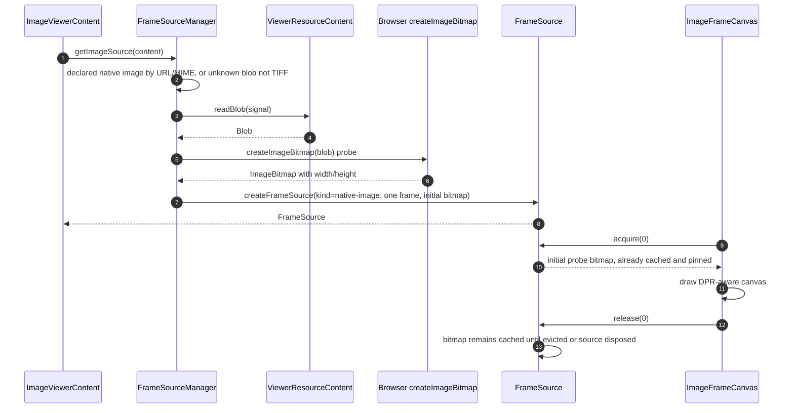
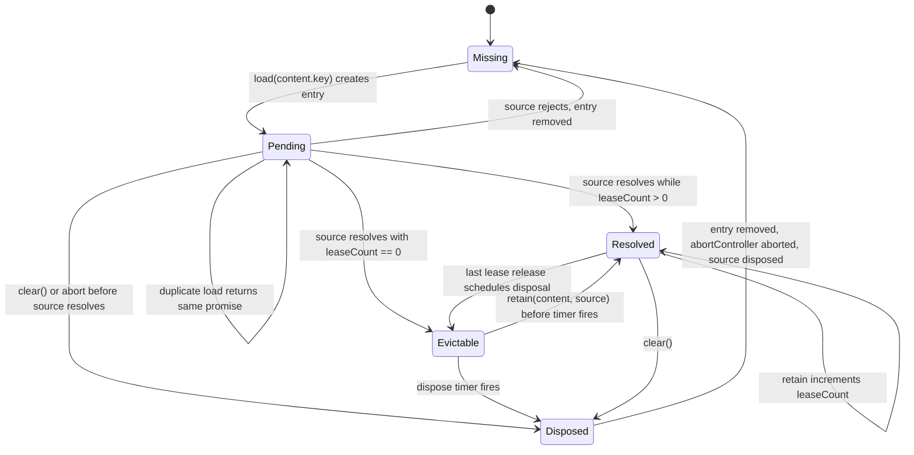
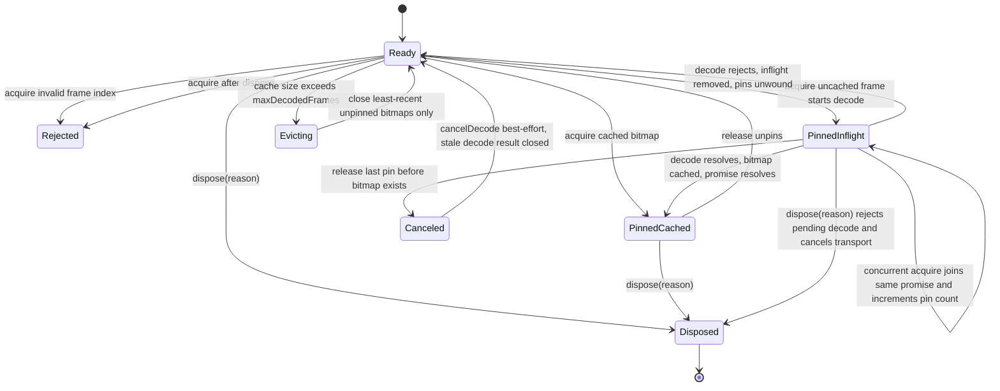
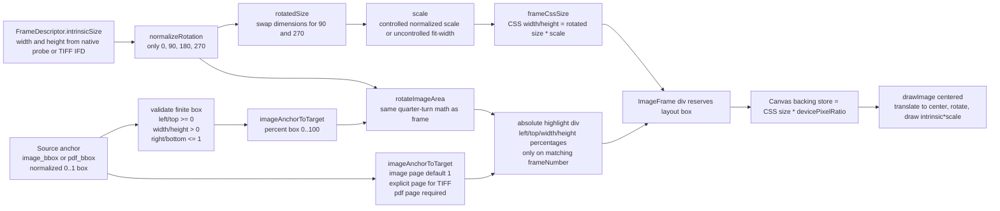

# Image Viewer System

This is the end-to-end system map for `image-viewer`: registry package surface,
runtime source/resource identity, native and TIFF decode paths, cache lifetimes,
frame rendering, controls, source-link overlays, FileViewer integration, docs,
demos, and test coverage.

## Whole System Flow

```mermaid
flowchart TD
  subgraph PublicSurface["Public and install surface"]
    Registry["registry.json entry: image-viewer\n- title and description\n- deps: lucide-react, utif@3.1.0\n- registry deps: utils, button, scroll-area, separator, skeleton\n- files copied into @ui and @lib targets"]
    PublicRegistry["public/r/image-viewer.json and public/r/registry.json\npublished registry payloads"]
    Docs["content/docs/viewers/image-viewer.mdx\n- install command\n- usage example\n- performance model\n- props table"]
    Demo["components/image-viewer-demo.tsx\nrenders /samples/entropy.tiff\nfallback size 1275 x 1650"]
    Shims["components/ui/image-viewer*.tsx and lib/image-*.ts\nthin re-export shims to registry/new-york-v4"]
    SourceShim["components/ui/image-source.tsx\nre-export source adapter"]
  end

  subgraph EntryPoints["Runtime entry points"]
    ImageViewer["ImageViewer(props, ref)\nsource: URL or Blob\ncreates ViewerResource with useMemo"]
    ImageResourceContent["ImageResourceContent(resource, ref)\nresource-first entry for FileViewer\nSSR/client gate with useSyncExternalStore"]
    FileViewer["FileViewer route\nresolves file category image\nlazy loads ImageResourceContent\npasses resource, className, bare"]
    Blocks["ImageSourcesBlock and SourcesViewerBlock ImageTab\nfield list + useSourceLink + ImageViewer ref"]
    Scrollbench["scrollbench and verifier surfaces\nexercise viewport handle and skeleton behavior"]
  end

  subgraph ResourceIdentity["Viewer resource identity and bytes"]
    ViewerSource["ViewerSource\nurl: url, fileName, mimeType, downloadUrl, identityKey\nblob: blob, identityKey, fileName, mimeType, downloadUrl\ntext exists globally but ImageViewer accepts URL or Blob"]
    Descriptor["resolveViewerDescriptor\n- detects category by extension then MIME\n- image extensions include png, jpg, jpeg, gif, webp, avif, bmp, svg, ico, tif, tiff\n- image MIME: image/*"]
    Keys["viewerResourceKeys\nload key: source kind + identityKey + mime + direct URL + payload key\npresentation key: category + displayName + fileName + mime + download URL\nresource key: load + presentation"]
    Interning["createViewerResource intern registries\n- URL Map capped at 128\n- text Map capped at 64 for shared infrastructure\n- Blob WeakMap keyed by Blob object\nreturns frozen ViewerResource"]
    Content["ViewerResourceContent\nkey, sourceKind, directUrl, mimeType, payload\nreadBlob, readBytes, readText, readStream, readRange"]
    Download["originalDownload\nURL -> href action\nBlob -> blob action or href downloadUrl\nText infra -> text action"]
    FetchRead["URL content read\nfetchResource with abort support\nvalidates full response for full reads\nsupports range requests for shared viewer infra"]
    BlobRead["Blob content read\nreturns existing Blob\narrayBuffer, stream, bounded text, byte range from slice"]
  end

  subgraph ClientBoundary["Client, Suspense, and error boundary"]
    IsClient["useIsClient\nserver render returns fallback skeleton\nclient render enables Suspense content"]
    Fallback["ImageViewerFallback\nsame shell data-slot=image-viewer\noptional toolbar skeleton\nframe skeleton from fallbackFrameSize and scale"]
    ErrorBoundary["ViewerErrorBoundary\nformat=image\nresetKey=resource.keys.resource\ndownload=resource.originalDownload\nsourceKind=resource.sourceKind"]
    Suspense["React.Suspense\nfallback=ImageViewerFallback"]
    ContentComponent["ImageViewerContent\nReact.use(getImageSource(resource.content))\nretains loaded source with callback-ref lease"]
  end

  subgraph SourceManager["FrameSourceManager and image source loading"]
    GetImageSource["getImageSource(content)\nimageFrameSourceManager.load(content, createTiffWorker)"]
    ManagerEntry["FrameSourceEntry\nstate: pending, resolved, evictable, disposed\nabortController\npromise\nsource\nleaseCount\ndisposeTimer"]
    LoadShare["load key sharing\nsame content.key shares pending/resolved load\npresentation-only changes reuse decoded source"]
    RetainLease["retain(content, source)\ncallback ref increments leaseCount\ncancels dispose timer\nrelease decrements and schedules disposal"]
    ClearTests["resetImageSourceCacheForTests -> manager.clear()\naborts pending loads and disposes resolved sources"]
    RouteDecision["createSource decision\n1. declared TIFF by ext or MIME -> readBytes -> TIFF\n2. declared native image -> readBlob -> native\n3. unknown -> readBlob -> sniff first 4 bytes -> TIFF or native"]
    TiffDetect["TIFF detection\n- .tif or .tiff URL\n- image/tiff or image/x-tiff MIME\n- magic bytes II*0 or MM0*"]
    NativeDetect["native detection\n- extensions png, jpg, jpeg, webp, gif, avif, bmp, ico\n- MIME image/png, image/jpeg, image/webp, image/gif, image/avif, image/bmp, image/x-icon, image/vnd.microsoft.icon\n- deliberately excludes TIFF and SVG"]
  end

  subgraph NativePath["Native image decode path"]
    NativeCreate["createNativeImageFrameSourceFromBlob(blob)\nprobe = createImageBitmap(blob)"]
    NativeFrames["single FrameDescriptor\nintrinsicSize from probe width and height"]
    NativeFrameSource["createFrameSource(kind=native-image)\ninitialBitmaps includes probe for frame 0\ndecode creates another ImageBitmap from same Blob when needed"]
  end

  subgraph TiffPath["TIFF worker decode path"]
    TiffCreate["createTiffFrameSource(buffer, createWorker, maxDecodedFrames, signal)"]
    WorkerFactory["createTiffWorker\nnew Worker(new URL('./image-viewer.worker', import.meta.url), type=module)"]
    WorkerClient["TiffWorkerClient\nowns Worker\ninit promise\ndecode request map\nrequest ids\nonerror and messageerror fail all pending work"]
    WorkerInit["post init with transferred ArrayBuffer\nworker decodes IFD metadata with UTIF.decode\nreturns frame descriptors without decoding pixels"]
    WorkerDecode["decode(frameIndex)\npost decodeFrame requestId + frameIndex\ncancelDecode sends cancelDecode requestId\nlate unmatched bitmaps are closed"]
    WorkerScript["image-viewer.worker.ts\nUTIF.decodeImage per requested frame\nUTIF.toRGBA8 -> ImageData -> createImageBitmap\npost decodeFrameOk with transferred ImageBitmap\ndelete ifd.data after decode"]
    TiffFrameSource["createFrameSource(kind=tiff)\nframes from worker init\ndecode delegates to client.decode\ncancelDecode delegates to client.cancelDecode\nonDispose terminates worker"]
  end

  subgraph FrameSource["FrameSource and BitmapCache"]
    CreateFrameSource["createFrameSource\nvalidates non-empty frames and positive finite dimensions\ncloses invalid initial bitmaps on failure"]
    FrameSourceApi["FrameSource API\nkind: native-image or tiff\nframes: descriptors\nacquire(frameIndex)\nrelease(frameIndex)\ndispose(reason)"]
    BitmapCache["BitmapCache\nMap frameIndex -> ImageBitmap\npinnedFrameCounts\nframeRecency LRU\nmaxDecodedFrames default 16"]
    Acquire["acquire(frameIndex)\nrejects disposed or invalid index\npins frame\nreturns cached bitmap if present\nshares one in-flight decode per frame"]
    Inflight["InflightFrameDecode\npromise, reject, pinCount\nlate stale decode is closed and rejected as disposed"]
    Release["release(frameIndex)\nno-op for invalid/disposed\nunpins bitmap\nif last pin and bitmap absent, rejects in-flight decode and calls cancelDecode"]
    Evict["evict()\nwhile cache size over cap\nclose least-recent unpinned bitmap\nnever closes pinned frames"]
    DisposeSource["dispose(reason)\nidempotent\ncloses cached bitmaps\nrejects pending decodes\ncalls cancelDecode for each in-flight frame\nruns onDispose"]
    FormatErrors["image errors\nImageLoadError\nImageDecodeError\nImageSourceDisposedError\nImageFrameIndexError\nTiffWorkerError\nmapped to ViewerFormatError format=image"]
  end

  subgraph ContentLayout["ImageViewerContent layout and state"]
    FrameListWidth["useFrameListWidth\ncallback ref reads clientWidth\nResizeObserver updates frameListWidth"]
    ScaleHook["useImageViewerScale\ncontrolled if scale prop is defined\nuncontrolled scale null means fit-width\nreset rotation and uncontrolled zoom on source change\nscale clamped 0.25 to 5"]
    FitWidth["fit-width scale\nwidest rotated frame width\n(frameListWidth - 32px horizontal padding) / widestFrameWidth\nthen clamp 0.25 to 5"]
    Rotation["rotation\nrawRotation increments by 90\nnormalizeRotation -> 0, 90, 180, 270"]
    VisibleHook["useVisibleFrame\nstate currentFrameNumber\nreset to frame 1 on source change\non scroll reports progress 0..1\nfinds frame at viewport marker y=20%, x=center"]
    VisibleFallback["visible frame fallback\nuses elementsFromPoint first\nthen frame bounding boxes if unavailable\noverlay spoofing ignored via closest data-slot=image-frame"]
    ImperativeHandle["useImageViewerHandle\nscrollToFrameArea(frameNumber, area, options)\nnormalizes top percent 0..100\nscrolls viewport to frame top + area top - 48px\ngetViewportElement returns viewport"]
    Shell["viewer shell\nflex column\nbare -> h-full bg-muted/20\nframed -> rounded-xl border bg-muted/30\ndata-slot=image-viewer"]
    Toolbar["ImageViewerToolbar\ncount label\nzoom out, zoom in, fit width, rotate, download\ncontrolled scale disables zoom and fit buttons"]
    Slots["slots\nheader full-width strip below toolbar\naside left rail beside scroll viewport"]
    ScrollAreaNode["ScrollArea viewport\nviewportRef=scrollViewportRef\nonScroll=handleScroll\nframe list centered with gap and padding"]
  end

  subgraph FrameRender["Per-frame rendering"]
    FrameMap["frameSource.frames.map -> ImageFrame\nkey=frameIndex\nframeIndex is 0-based\nframeNumber is 1-based"]
    FrameGeometry["frameCssSize\nrotatedSize swaps width/height for 90/270\nCSS size = rotated intrinsic size * scale"]
    FrameBox["ImageFrame outer div\nposition relative\nshadow and border ring\nstyle width/height from frameRect\ndata-slot=image-frame\ndata-frame-number=frameNumber"]
    Intersection["IntersectionObserver callback ref\nroot = closest scroll-area viewport\nrootMargin = 150% vertical\nisNearViewport gates canvas mount"]
    SkeletonFrame["far frame -> Skeleton fills reserved frame box\nscroll height stays stable before decode"]
    CanvasMount["near frame -> ImageFrameCanvas\ncanvas ref callback draws and cleans up without useEffect"]
    CanvasSizing["canvas bitmap size\nCSS width/height = frameRect\nbacking width/height = floor(frameRect * devicePixelRatio)\nminimum 1px"]
    CanvasDraw["draw path\nsource.acquire(frameIndex)\nctx.save\nscale by DPR\ntranslate to center\nrotate by radians\nimageSmoothingQuality=high\ndrawImage centered at intrinsicSize * scale\nctx.restore in finally"]
    CanvasCleanup["cleanup\ncancelled=true\nsource.release(frameIndex)\nImageSourceDisposedError during teardown is ignored\nother decode/draw failures are thrown to boundary"]
    OverlaySlot["renderOverlay wrapper\nabsolute inset overlay\npointer-events-none\nreceives frameNumber, frameRect, scale, rotation"]
  end

  subgraph SourceLink["Document source-link integration"]
    DocumentSource["document source model\nSourceMap keyed by field path\nanchors include image_bbox and pdf_bbox with normalized geometry"]
    AnchorArea["imageAnchorToTarget\nvalid image_bbox/pdf_bbox -> frame + percent area\nrequires finite left/top/width/height\nleft/top >= 0, width/height > 0, right/bottom <= 1"]
    AnchorFrame["imageAnchorToTarget\nimage_bbox page defaults to 1\nexplicit page supports multi-frame TIFF\npdf_bbox uses page\nmust be positive integer"]
    RotateArea["rotateImageArea\nnormalizes rotation\nuses rotateNormalizedBox\nreturns rounded percentages to avoid float noise"]
    ImageTarget["useImageSourceTarget(viewerRef)\nSourceTarget.scrollTo(source, options)\nvalid bbox + frame -> viewerRef.current.scrollToFrameArea"]
    SourceOverlay["renderImageSourceOverlay(activeSource)\nreturns per-frame overlay function\nonly paints active source on matching frame\nrotates area to rendered frame coordinates"]
    Highlight["highlight div\nabsolute\nborder primary/70\nbg primary/12\nrounded 2px\nz-index 10\npointer-events none"]
    FieldList["SourceFieldList and SourceIndicator\nhover/focus/click drive useSourceLink active source\nmissing sources do not scroll"]
  end

  subgraph DownloadAndErrors["Download and failure UX"]
    DownloadControl["ViewerDownloadControl\nreceives originalDownload action\nhref/blob/text payloads handled by shared viewer download UI"]
    ErrorFallback["ViewerErrorBoundary fallback\nkeeps download access where possible\nreset on resource key change"]
    DecodeFailure["frame decode failure\nImageFrameCanvas setDrawError\nthrow during render\nviewer-level boundary tears down sibling frames"]
    DisposalFailure["source-disposal failures\nignored during frame teardown\nprevents unmount races from surfacing to users"]
  end

  subgraph Tests["Verified behavior"]
    TestsMain["tests/image-viewer.test.tsx\nresource interning, TIFF detection, source lifecycle, manager lifecycle, worker client, frame lifecycle, scale, interactions, error fallback, overlay geometry"]
    TestsEdges["tests/image-viewer-edge-cases.test.tsx\nrotation math, bbox conversion, TIFF/native detection, BitmapCache, toolbar edges"]
    TestsProbes["tests/image-viewer-probes.test.tsx\nacquire/release accounting, eviction leak invariants, disposal, validation, overlay gating, source target, fit-width clamping, multi-frame failures, document swaps"]
    TestsSources["tests/sources.test.tsx\nsource adapters, image bridge to imperative target, useSourceLink hover/pin/async target behavior"]
    TestsFileViewer["tests/file-viewer.test.tsx\nFileViewer category detection and lazy resource routing"]
  end

  Registry --> PublicRegistry
  Registry --> Shims
  Registry --> Docs
  Docs --> Demo
  Shims --> ImageViewer
  Shims --> ImageResourceContent
  SourceShim --> SourceLink
  Demo --> ImageViewer
  FileViewer --> ImageResourceContent
  Blocks --> ImageViewer
  Blocks --> SourceLink
  Scrollbench --> ImageViewer

  ImageViewer --> ViewerSource
  ViewerSource --> Descriptor
  Descriptor --> Keys
  Keys --> Interning
  Interning --> Content
  Interning --> Download
  Content --> FetchRead
  Content --> BlobRead
  ImageViewer --> ImageResourceContent
  ImageResourceContent --> IsClient
  IsClient -- "server or pre-hydration" --> Fallback
  IsClient -- "client" --> ErrorBoundary
  ErrorBoundary --> Suspense
  Suspense -- "pending" --> Fallback
  Suspense -- "resolved" --> ContentComponent
  ContentComponent --> GetImageSource
  ContentComponent --> FrameListWidth
  ContentComponent --> ScaleHook
  ContentComponent --> VisibleHook
  ContentComponent --> ImperativeHandle
  ContentComponent --> Shell

  GetImageSource --> ManagerEntry
  ManagerEntry --> LoadShare
  ManagerEntry --> RouteDecision
  ManagerEntry --> RetainLease
  ClearTests --> ManagerEntry
  RouteDecision --> TiffDetect
  RouteDecision --> NativeDetect
  NativeDetect --> NativeCreate
  TiffDetect --> TiffCreate
  RouteDecision -- "unknown blob sniff says native" --> NativeCreate
  RouteDecision -- "unknown blob sniff says TIFF" --> TiffCreate

  NativeCreate --> NativeFrames
  NativeFrames --> NativeFrameSource
  NativeFrameSource --> CreateFrameSource

  TiffCreate --> WorkerFactory
  WorkerFactory --> WorkerClient
  WorkerClient --> WorkerInit
  WorkerClient --> WorkerDecode
  WorkerInit --> WorkerScript
  WorkerDecode --> WorkerScript
  WorkerScript --> WorkerClient
  WorkerClient --> TiffFrameSource
  TiffFrameSource --> CreateFrameSource

  CreateFrameSource --> FrameSourceApi
  FrameSourceApi --> BitmapCache
  FrameSourceApi --> Acquire
  Acquire --> Inflight
  Acquire --> BitmapCache
  FrameSourceApi --> Release
  Release --> Inflight
  Release --> BitmapCache
  BitmapCache --> Evict
  FrameSourceApi --> DisposeSource
  DisposeSource --> BitmapCache
  DisposeSource --> Inflight
  FormatErrors --> ErrorBoundary

  RetainLease --> FrameSourceApi
  ContentComponent --> RetainLease
  ScaleHook --> FitWidth
  ScaleHook --> Rotation
  FrameListWidth --> FitWidth
  Shell --> Toolbar
  Shell --> Slots
  Shell --> ScrollAreaNode
  ScrollAreaNode --> FrameMap
  VisibleHook --> VisibleFallback
  VisibleHook --> ScrollAreaNode
  ImperativeHandle --> ScrollAreaNode
  FrameMap --> FrameGeometry
  FrameGeometry --> FrameBox
  FrameBox --> Intersection
  Intersection -- "not near viewport" --> SkeletonFrame
  Intersection -- "near viewport" --> CanvasMount
  CanvasMount --> CanvasSizing
  CanvasMount --> CanvasDraw
  CanvasDraw --> FrameSourceApi
  CanvasMount --> CanvasCleanup
  CanvasCleanup --> FrameSourceApi
  FrameBox --> OverlaySlot

  DocumentSource --> AnchorArea
  DocumentSource --> AnchorFrame
  AnchorArea --> ImageTarget
  AnchorFrame --> ImageTarget
  ImageTarget --> ImperativeHandle
  AnchorArea --> SourceOverlay
  AnchorFrame --> SourceOverlay
  SourceOverlay --> RotateArea
  RotateArea --> Highlight
  Highlight --> OverlaySlot
  FieldList --> SourceOverlay
  FieldList --> ImageTarget

  Toolbar --> DownloadControl
  Download --> DownloadControl
  ErrorBoundary --> ErrorFallback
  DecodeFailure --> ErrorBoundary
  CanvasDraw --> DecodeFailure
  CanvasCleanup --> DisposalFailure

  TestsMain -.-> ResourceIdentity
  TestsMain -.-> SourceManager
  TestsMain -.-> TiffPath
  TestsMain -.-> FrameRender
  TestsMain -.-> ContentLayout
  TestsEdges -.-> FrameSource
  TestsEdges -.-> SourceLink
  TestsProbes -.-> FrameSource
  TestsProbes -.-> SourceManager
  TestsProbes -.-> ContentLayout
  TestsSources -.-> SourceLink
  TestsFileViewer -.-> FileViewer
```

## TIFF Lazy Decode Sequence

```mermaid
sequenceDiagram
  autonumber
  participant App as App or FileViewer
  participant IV as ImageViewer or ImageResourceContent
  participant VR as ViewerResource
  participant EB as ViewerErrorBoundary and Suspense
  participant IVC as ImageViewerContent
  participant FSM as FrameSourceManager
  participant TWC as TiffWorkerClient
  participant WW as image-viewer.worker.ts
  participant FS as FrameSource and BitmapCache
  participant Frame as ImageFrame
  participant Canvas as ImageFrameCanvas
  participant UI as Toolbar, overlay, callbacks

  App->>IV: render with URL or Blob source
  IV->>VR: createViewerResource(source)
  VR-->>IV: frozen resource with keys, content readers, download action
  IV->>EB: wrap ImageViewerContent with resetKey resource.keys.resource
  EB->>IVC: render in Suspense
  IVC->>FSM: React.use(getImageSource(resource.content))
  FSM->>FSM: reuse entry by content.key or create pending entry
  FSM->>VR: readBytes(signal) for declared TIFF or sniffed TIFF
  VR-->>FSM: ArrayBuffer
  FSM->>TWC: createTiffFrameSource(buffer, worker factory, maxDecodedFrames, signal)
  TWC->>WW: postMessage init with transferred ArrayBuffer
  WW->>WW: UTIF.decode(buffer) to IFD metadata
  WW-->>TWC: initOk with FrameDescriptor list
  TWC-->>FSM: FrameSource(kind=tiff, frames=N)
  FSM-->>IVC: resolve shared FrameSource promise
  IVC->>FSM: retain(content, source) through callback ref
  FSM->>FSM: leaseCount += 1, state resolved, cancel dispose timer
  IVC->>UI: render toolbar count label and controls
  IVC->>Frame: map every descriptor to an ImageFrame
  Frame->>Frame: reserve CSS box from intrinsic size, scale, rotation
  Frame->>Frame: observe with IntersectionObserver rootMargin 150%
  alt frame is far from viewport
    Frame-->>App: render skeleton inside reserved box
  else frame is near viewport
    Frame->>Canvas: mount canvas
    Canvas->>Canvas: size backing store by CSS size * DPR
    Canvas->>FS: acquire(frameIndex)
    FS->>FS: pin frame and check BitmapCache
    alt bitmap cached
      FS-->>Canvas: cached ImageBitmap
    else no cached bitmap
      FS->>TWC: decode(frameIndex) or join existing in-flight decode
      TWC->>WW: postMessage decodeFrame requestId
      WW->>WW: UTIF.decodeImage(buffer, ifd)
      WW->>WW: UTIF.toRGBA8 -> ImageData -> createImageBitmap
      WW-->>TWC: decodeFrameOk with transferred ImageBitmap
      TWC-->>FS: resolve matching request
      FS->>FS: cache bitmap, touch recency, evict unpinned frames over cap
      FS-->>Canvas: ImageBitmap
    end
    Canvas->>Canvas: save, scale DPR, translate center, rotate, drawImage, restore
    Canvas-->>UI: overlay slot paints active bbox if frame matches
  end
  UI->>IVC: scroll event
  IVC->>UI: report progress 0..1 and visible frame nearest marker
  App->>UI: hover or select sourced field
  UI->>IVC: useImageSourceTarget calls ref.scrollToFrameArea(frame, percent area)
  IVC->>UI: scroll viewport to frame area with 48px headroom
  App->>IV: unmount or source changes
  Canvas->>FS: release(frameIndex)
  FS->>FS: unpin; cancel decode if no pins and no bitmap
  IVC->>FSM: release lease
  FSM->>FSM: leaseCount 0 -> evictable -> schedule disposal
  FSM->>FS: dispose reason when timer fires or clear is called
  FS->>TWC: cancel in-flight decodes and dispose worker
  TWC->>WW: terminate
```

## Native Image Sequence



## FrameSourceManager State



## FrameSource Acquire, Release, and Eviction



## Render Geometry and Source Overlay Mapping



## File and Responsibility Index

| Area               | Files                                                                                                       | Responsibility                                                                                                                             |
| ------------------ | ----------------------------------------------------------------------------------------------------------- | ------------------------------------------------------------------------------------------------------------------------------------------ |
| Public viewer API  | `registry/new-york-v4/ui/image-viewer.tsx`, `image-viewer-types.ts`                                         | `ImageViewer`, `ImageResourceContent`, public props, handle, test helpers, client/Suspense/error boundary entry.                            |
| Content shell      | `registry/new-york-v4/ui/image-viewer-content.tsx`                                                          | Loads `FrameSource`, retains source lease, renders toolbar, header, aside, scroll area, frames, and source cache helpers.                  |
| Hooks              | `registry/new-york-v4/ui/image-viewer-hooks.ts`                                                             | Fit-width scale, controlled/uncontrolled zoom, rotation reset, visible frame detection, scroll progress, imperative handle.                |
| Frame rendering    | `registry/new-york-v4/ui/image-viewer-frame.tsx`                                                            | Lazy frame observation, skeleton/canvas switch, DPR canvas sizing, acquire/draw/release lifecycle, overlay mount.                          |
| Toolbar/fallback   | `registry/new-york-v4/ui/image-viewer-chrome.tsx`                                                           | Toolbar controls, download control, skeleton toolbar, fallback frame sizing.                                                               |
| Geometry           | `registry/new-york-v4/lib/image-geometry.ts`                                                                | Quarter-turn normalization, rotated sizes, frame CSS size, bbox rotation, frame index/number conversion.                                   |
| Frame source       | `registry/new-york-v4/lib/image-frame-source.ts`                                                            | FrameSource abstraction, BitmapCache, acquire/release/dispose semantics, native image source, TIFF/native detection helpers, image errors. |
| Source cache       | `registry/new-york-v4/lib/image-source-cache.ts`                                                            | Shared load cache keyed by resource content, source lifetime leases, disposal timers, source route selection.                              |
| TIFF client        | `registry/new-york-v4/lib/image-tiff-source.ts`                                                             | Main-thread worker client, init/decode/cancel protocol, malformed message handling, worker termination.                                    |
| TIFF worker        | `registry/new-york-v4/ui/image-viewer.worker.ts`                                                            | UTIF metadata parse, serialized decode queue, cancellation set, RGBA conversion, ImageBitmap transfer.                                     |
| Resource infra     | `registry/new-york-v4/lib/viewer-source.ts`, `viewer-resource.ts`, `viewer-download.ts`, `viewer-errors.ts` | Source descriptors, stable keys, interned resources, readers, download actions, shared error shapes.                                       |
| Source adapter     | `registry/new-york-v4/ui/image-source.tsx`                                                                  | Converts source anchors to frame/area, rotates highlight geometry, bridges `useSourceLink` to the image viewer handle.                     |
| Integration blocks | `registry/new-york-v4/blocks/image-sources-block.tsx`, `sources-viewer-block.tsx`                        | Real field/source UI demonstrating hover/click source linking into image overlays and scrolling.                                           |
| Re-export shims    | `components/ui/image-viewer*.tsx`, `components/ui/image-source.tsx`, `lib/image-*.ts`                       | Local import surface that points at the registry implementation.                                                                           |
| Docs and demo      | `content/docs/viewers/image-viewer.mdx`, `components/image-viewer-demo.tsx`                                 | User-facing install, usage, performance explanation, prop table, and TIFF sample.                                                          |
| Tests              | `tests/image-viewer*.test.tsx`, `tests/sources.test.tsx`, `tests/file-viewer.test.tsx`                      | Lifecycle, cache, worker, rendering, geometry, integration, and routing coverage.                                                          |

## Key Invariants

- The UI thread never decodes TIFF pixels directly; TIFF bytes move to the
  worker once, and decoded `ImageBitmap` objects are transferred back.
- Every frame reserves its layout box from metadata before pixels decode, so
  scroll height stays stable during lazy loading.
- Decoded bitmap memory is bounded by `maxDecodedFrames` and protected by pin
  counts while canvases are mounted.
- Presentation metadata changes can update filenames/download labels without
  forcing a new image load when the load key is unchanged.
- Source leases keep a loaded `FrameSource` alive only while a mounted viewer
  claims it; released or never-claimed sources are disposed by timers.
- Controlled `scale` disables toolbar zoom and fit-width changes; uncontrolled
  scale resets to fit-width when the source changes.
- Rotation is always a normalized quarter turn, and overlay geometry uses the
  same rotation math as frame rendering.
- Imperative scrolling only targets real `data-slot="image-frame"` elements and
  clamps area percentages before calculating scroll position.
- Disposal errors from normal teardown are ignored in frame canvases; decode and
  draw errors that indicate real failure surface through the viewer boundary.
- Test helpers can clear resource/source caches and create synthetic frame
  sources without bypassing the production acquire/release machinery.
