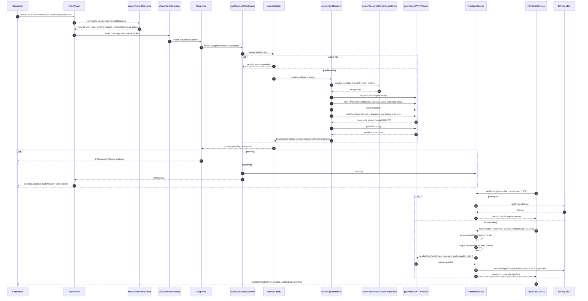
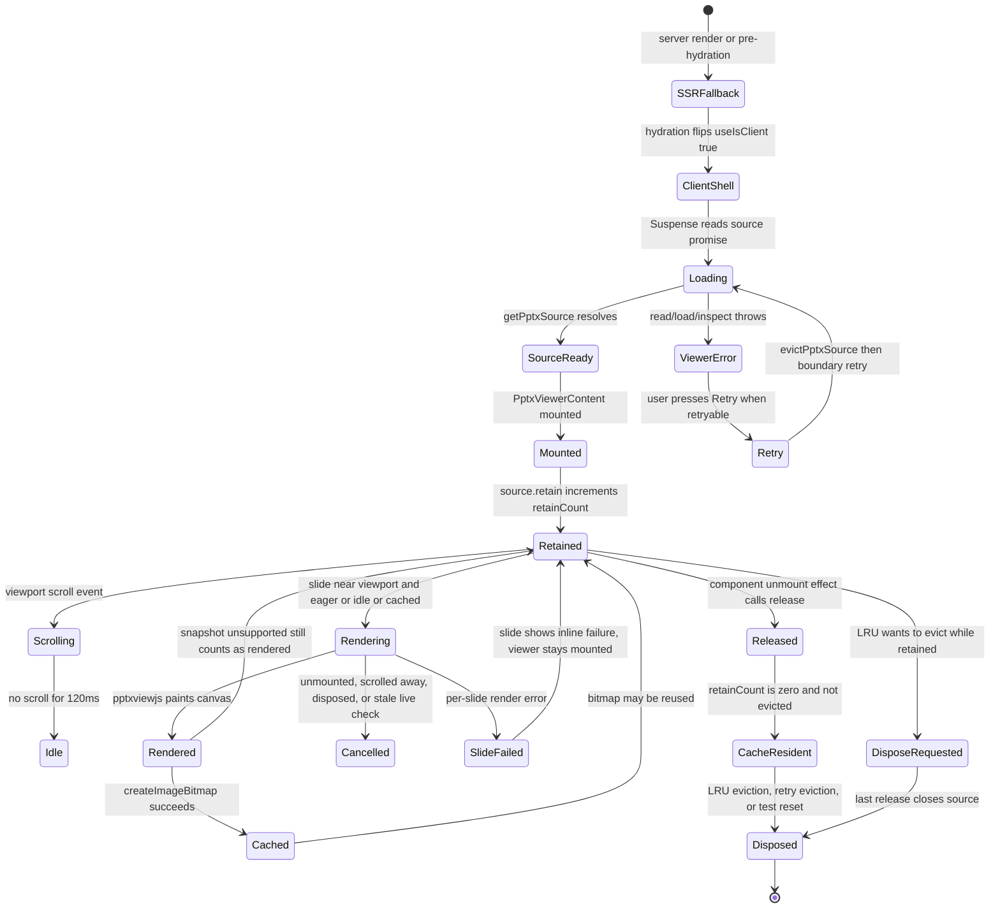
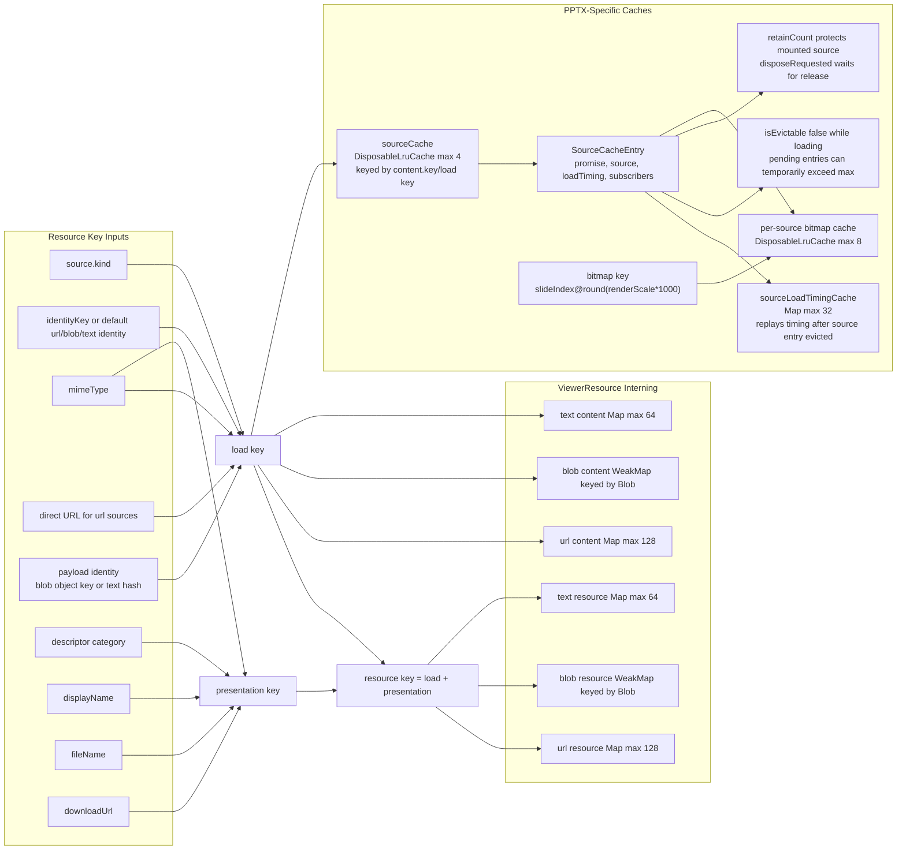
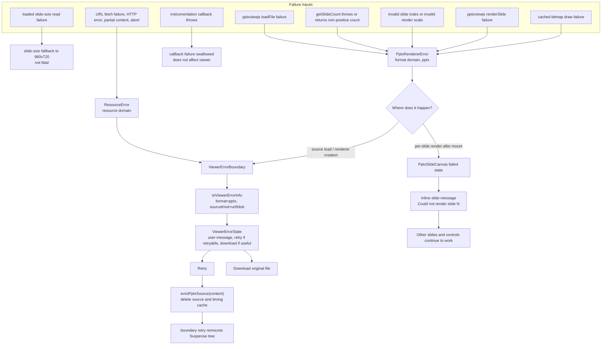
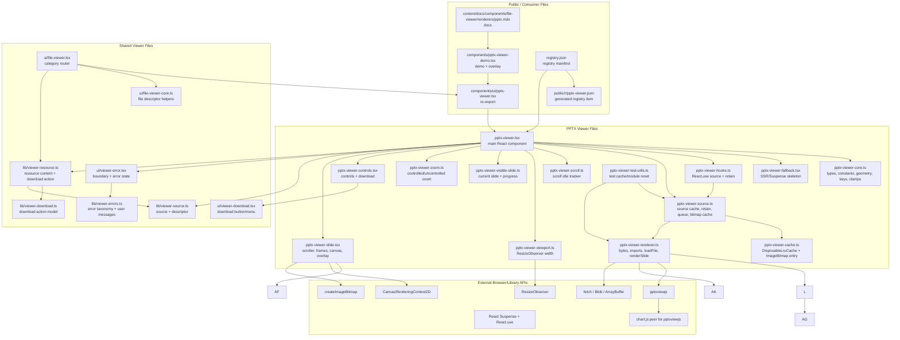

# PPTX Viewer System Diagram

This maps the PPTX viewer as implemented by the public wrapper in
`components/ui/pptx-viewer.tsx` and the registry source in
`registry/new-york-v4/ui/pptx-viewer*.{ts,tsx}`. The registry implementation is
the source of truth; `components/ui/pptx-viewer.tsx` only re-exports it.

## Whole-System Architecture

```mermaid
flowchart TB
  %% External surfaces
  subgraph Surfaces["Consumer Surfaces"]
    Direct["Direct usage<br/>PptxViewer(source, props)"]
    ResourceUsage["Resource usage<br/>PptxResourceContent(resource, props)"]
    FileViewer["FileViewer<br/>category route"]
    Demo["components/pptx-viewer-demo.tsx<br/>sample deck + overlay example"]
    Docs["content/docs/components/file-viewer/renderers/pptx.mdx<br/>install, props, behavior"]
    Registry["registry.json + public/r/pptx-viewer.json<br/>shadcn registry item"]
    ScrollBench["scrollbench pptx target<br/>[data-slot=pptx-viewer] viewport"]
    Tests["tests/pptx-viewer*.test.tsx<br/>unit, integration, cache, edge cases"]
    Thumbnail["PptxFirstSlide thumbnail renderer<br/>shared PptxSource first-slide render"]
  end

  %% Registry/package surface
  subgraph Package["Published Component Boundary"]
    Wrapper["components/ui/pptx-viewer.tsx<br/>export * from registry implementation"]
    Main["registry/new-york-v4/ui/pptx-viewer.tsx<br/>PptxViewer + PptxResourceContent + content shell"]
    RegistryDeps["Registry deps<br/>lucide-react, pptxviewjs@1.1.9, chart.js<br/>button, scroll-area, separator, skeleton, utils"]
  end

  Direct --> Wrapper --> Main
  ResourceUsage --> Main
  FileViewer -->|"lazy imports @/components/ui/pptx-viewer"| Wrapper
  Demo --> Direct
  Docs --> Demo
  Registry --> Wrapper
  ScrollBench --> Main
  Tests --> Main
  Thumbnail -->|"getPptxSource(content).retain()"| SourceCache

  %% Resource system
  subgraph ResourceSystem["Shared Viewer Resource System"]
    ViewerSource["viewer-source.ts<br/>UrlViewerSource, BlobViewerSource, TextSource<br/>detectCategory(.pptx or presentation mime)<br/>resolveViewerDescriptor"]
    ResourceFactory["viewer-resource.ts<br/>createViewerResource(source, category?)"]
    ResourceKeys["ViewerResourceKeys<br/>load = source identity + direct/payload<br/>presentation = category/display/file/mime/download<br/>resource = load + presentation"]
    ResourceContent["ViewerResourceContent<br/>key, sourceKind, directUrl, mimeType, payload<br/>readBlob, readBytes, readText, readStream, readRange"]
    ResourceIntern["Resource interning<br/>url Map max 128<br/>text Map max 64<br/>blob WeakMap keyed by Blob object"]
    OriginalDownload["originalDownload action<br/>url -> href(downloadUrl or url)<br/>blob -> href(downloadUrl) or blob<br/>text -> text"]
    FetchRead["URL byte read<br/>fetch -> validate full response -> ArrayBuffer<br/>ResourceError on fetch/http/partial/abort"]
    BlobRead["Blob byte read<br/>blob.arrayBuffer()"]
  end

  Main -->|"PptxViewer memoizes"| ResourceFactory
  FileViewer --> ResourceFactory
  ResourceFactory --> ViewerSource
  ResourceFactory --> ResourceKeys
  ResourceFactory --> ResourceIntern
  ResourceFactory --> ResourceContent
  ResourceFactory --> OriginalDownload
  ResourceContent --> FetchRead
  ResourceContent --> BlobRead

  %% Top-level viewer lifecycle
  subgraph ViewerLifecycle["PPTX Viewer Lifecycle"]
    ClientGate["useIsClient()<br/>useSyncExternalStore<br/>SSR=false, hydrated=true"]
    Fallback["PptxViewerFallback<br/>controls skeleton + first slide skeleton<br/>uses fallbackSlideSize or 960x720"]
    ErrorBoundary["ViewerErrorBoundary<br/>format=pptx sourceKind=resource.sourceKind<br/>download=originalDownload<br/>resetKey=resource + scale/defaultScale + eager"]
    Suspense["React.Suspense<br/>fallback=PptxViewerFallback"]
    Content["PptxViewerContent<br/>source retention, controls, layout, scroller"]
    Retry["Retry button path<br/>onRetry -> evictPptxSource(resource.content)<br/>clears source cache + load timing"]
  end

  Main --> ClientGate
  ClientGate -->|"not hydrated"| Fallback
  ClientGate -->|"hydrated"| ErrorBoundary
  ErrorBoundary --> Suspense
  Suspense -->|"React.use(sourcePromise) pending"| Fallback
  Suspense -->|"resolved source"| Content
  ErrorBoundary -->|"caught load/render setup error"| Retry
  Retry --> SourceCacheDelete["sourceCache.delete(content.key)<br/>sourceLoadTimingCache.delete(content.key)"]

  %% Source acquisition and renderer creation
  subgraph SourceSystem["PPTX Source + Renderer System"]
    RetainedHook["useRetainedPptxSource(content)<br/>memo getPptxSource(content)<br/>React.use(promise)<br/>effect source.retain()"]
    TimingSub["subscribePptxSourceLoadTiming(content)<br/>entry subscriber or timing cache replay"]
    SourceCache["sourceCache<br/>DisposableLruCache keyed by content key<br/>max 4 source entries"]
    TimingCache["sourceLoadTimingCache<br/>Map keyed by content key<br/>max 32 timing entries"]
    SourceEntry["SourceCacheEntry<br/>promise, source?, loadTiming?<br/>settled flag, disposed flag<br/>loadTimingSubscribers"]
    PendingPin["Pending entry is not evictable<br/>prevents renderer leaks while loadFile is unresolved"]
    CreateRenderer["createPptxRenderer(content, onLoadTiming)"]
    ReadBytes["readPptxBytes(content)<br/>content.readBytes()"]
    ImportPptx["dynamic import('pptxviewjs')<br/>module promise cached"]
    PptxViewerLib["new PPTXViewer({ canvas: offscreen, slideSizeMode: actual, autoExposeGlobals: false, autoChartRerenderDelayMs: 0, enableThumbnails: false })"]
    LoadFile["viewer.loadFile(buffer)<br/>parse OOXML deck"]
    ReadSlideSize["readLoadedSlideSize(viewer)<br/>getSlideDimensions / processor presentation<br/>EMU / 9525 -> CSS px<br/>fallback 960x720"]
    InspectSlides["viewer.getSlideCount()<br/>must be positive integer"]
    Renderer["PptxRenderer<br/>slideCount, baseSize<br/>renderSlide(input)<br/>dispose()"]
    LoadTiming["PptxSourceLoadTiming<br/>byteLength, slideCount, totalMs<br/>readBytesMs, importPptxMs, readSlideSizeMs, loadFileMs, inspectMs"]
    RendererSource["RendererSource implements PptxSource<br/>slideCount, baseSize, renderSlide, hasBitmap, retain"]
  end

  Content --> RetainedHook
  Main -->|"optional onSourceLoadTiming effect"| TimingSub
  RetainedHook --> SourceCache
  SourceCache -->|"hit"| SourceEntry
  SourceCache -->|"miss"| CreateRenderer
  CreateRenderer --> ReadBytes
  CreateRenderer --> ImportPptx --> PptxViewerLib
  PptxViewerLib --> LoadFile --> ReadSlideSize --> InspectSlides --> Renderer
  Renderer --> RendererSource
  RendererSource --> SourceEntry
  SourceEntry --> SourceCache
  SourceEntry --> PendingPin
  CreateRenderer --> LoadTiming --> TimingCache
  CreateRenderer --> LoadTiming --> SourceEntry
  TimingSub --> SourceEntry
  TimingSub --> TimingCache

  %% Rendering model
  subgraph RenderModel["Slide Layout + Rendering Model"]
    Core["pptx-viewer-core.ts<br/>DEFAULT 960x720<br/>fit scale, reset key, bitmap key<br/>scale/rotation geometry + clamp"]
    ViewportWidth["usePptxViewportWidth<br/>containerRef + ResizeObserver<br/>viewportWidth"]
    FitScale["getPptxFitScale(viewportWidth, baseWidth)<br/>(width - 32) / baseWidth<br/>clamp 0.1..5, fallback 1"]
    ZoomHook["usePptxZoom<br/>controlled scale or uncontrolled fit/manual<br/>normalize 0.25..5<br/>setViewerScale(null) = fit width"]
    Rotation["rotation state<br/>controls increments +90 modulo 360"]
    VisibleHook["usePptxVisibleSlide<br/>scroll viewport ref<br/>progress = scrollTop / scrollable<br/>visible slide marker at 20% viewport height"]
    ScrollActivity["createPptxScrollActivity<br/>idle after 120ms<br/>only used to defer uncached renders when eager=false"]
    Controls["PptxToolbar<br/>Slide current/count<br/>minus, percent, plus, fit, rotate, download"]
    Layout["Viewer shell<br/>optional aside left rail<br/>optional header below controls<br/>PptxSlideScroller fills remaining space"]
    Scroller["PptxSlideScroller<br/>native scroll viewport<br/>math-based virtual slide window"]
    Frame["PptxSlideFrame<br/>current/viewport priority<br/>skeleton until rendered"]
    SizeMath["Frame sizing<br/>slideSize = baseSize * zoomScale<br/>visibleSize = rotated slide size<br/>outer frame sized to visibleSize<br/>inner canvas container rotated around center"]
    Canvas["PptxSlideCanvas<br/>renderScale = zoomScale * capped pixelRatio<br/>canvas CSS size = slideSize<br/>state idle/rendering/rendered/failed"]
    Overlay["PptxSlideOverlay<br/>pointer-events none<br/>renderSlideOverlay({ slideNumber, width, height, scale, rotation })"]
    SlideTiming["onSlideRenderTiming<br/>slideNumber, durationMs, renderScale, pixelRatio, cached, status"]
  end

  Content --> Core
  Content --> ViewportWidth --> FitScale --> ZoomHook
  Content --> VisibleHook
  Content --> ScrollActivity
  Content --> Controls
  Content --> Layout --> Scroller --> Frame --> Canvas
  Content --> Rotation --> SizeMath
  ZoomHook --> SizeMath
  RendererSource --> Scroller
  Core --> FitScale
  Core --> SizeMath
  Frame --> Overlay
  Canvas --> SlideTiming
  Controls -->|"zoom out/in"| ZoomHook
  Controls -->|"fit width"| ZoomHook
  Controls -->|"rotate"| Rotation
  Controls -->|"download"| DownloadUI["ViewerDownloadControl"]

  %% Bitmap cache and render queue
  subgraph RenderQueueCache["Serialized Render Queue + Bitmap Cache"]
    HasBitmap["source.hasBitmap(slideIndex, renderScale)<br/>key = slideIndex@round(renderScale*1000)"]
    BitmapCache["RendererSource.bitmaps<br/>DisposableLruCache keyed by bitmap key<br/>max 8 bitmaps and 24M pixels per source"]
    BitmapEntry["PptxBitmapEntry<br/>ImageBitmap + pixelCount<br/>dispose() closes bitmap"]
    Queue["RendererSource.queue<br/>priority queue serializes renderSlide calls<br/>current slide, viewport, reading-marker distance, sequence"]
    LiveCheck["isLive callback<br/>returns false after canvas unmount/cancel"]
    DrawCached["drawCachedBitmap<br/>sets canvas.width/height to bitmap size<br/>2d drawImage"]
    RenderSlideLib["PptxRenderer.renderSlide<br/>validates disposed, slide bounds, positive finite scale<br/>viewer.renderSlide(slideIndex, canvas, { scale, quality: high })"]
    Snapshot["createImageBitmap(canvas)<br/>async snapshot after render resolves<br/>shared by duplicate requests<br/>snapshot failure does not fail rendered slide"]
    RenderResult["PptxRenderResult<br/>rendered | cancelled | failed(PptxRendererError)"]
    SlideFailure["Slide-level render failure UI<br/>Could not render slide N<br/>does not trip whole-viewer boundary"]
  end

  Canvas --> HasBitmap --> BitmapCache
  BitmapCache -->|"hit and live"| DrawCached --> RenderResult
  BitmapCache -->|"miss"| Queue
  Canvas --> LiveCheck
  Queue --> LiveCheck
  Queue --> RenderSlideLib --> Snapshot --> BitmapEntry --> BitmapCache
  Queue --> RenderResult
  RenderResult -->|"failed"| SlideFailure
  Renderer --> RenderSlideLib

  %% Error and download systems
  subgraph ErrorDownload["Error + Download System"]
    RendererError["PptxRendererError extends ViewerFormatError<br/>format=pptx<br/>kind bounds, disposed, index_out_of_range, load_failed, render_failed"]
    ErrorInfo["toViewerErrorInfo(format=pptx)<br/>render_failed -> Could not render this slide<br/>other pptx -> Could not load this presentation<br/>url source usually retryable"]
    ErrorState["ViewerErrorState<br/>role=alert<br/>Retry and/or Download buttons"]
    DownloadAction["ViewerDownloadAction<br/>id, label, fileName, origin, isDisabled, getPayload"]
    DownloadControl["ViewerDownloadControl/Button/Menu<br/>synchronous href path uses anchor<br/>blob/text path creates object URL then revokes"]
    AbortDownload["useViewerDownloadTrigger<br/>AbortController per action<br/>aborts on reset/unmount"]
  end

  CreateRenderer -->|"load/inspect errors"| RendererError
  RenderSlideLib -->|"render errors"| RendererError
  ErrorBoundary --> ErrorInfo --> ErrorState
  OriginalDownload --> DownloadAction --> DownloadControl
  DownloadUI --> DownloadControl
  DownloadControl --> AbortDownload

  %% Test and reset
  subgraph TestReset["Test Support"]
    ResetTests["resetPptxViewerForTests()"]
    DisposeSourceCache["disposePptxSourceCache()<br/>disposeWhenResolved for pending<br/>clear source + timing cache"]
    ResetModules["resetPptxRendererModules()<br/>clear dynamic import promises"]
    UnitCoverage["Unit coverage<br/>geometry, fit scale, XML size parse, LRU, scroll idle, fallback, visible slide, zoom"]
    IntegrationCoverage["Integration coverage<br/>SSR/client fallback, lazy slides, render queue, bitmap cache, retry, download, callbacks, controlled scale, rotation, retention, pending eviction"]
  end

  Tests --> ResetTests
  ResetTests --> DisposeSourceCache
  ResetTests --> ResetModules
  Tests --> UnitCoverage
  Tests --> IntegrationCoverage
```

## Load, Cache, and Render Sequence

## State and Ownership Model

## Source and Bitmap Cache Details

## Error Boundaries and Failure Containment

## File Map

