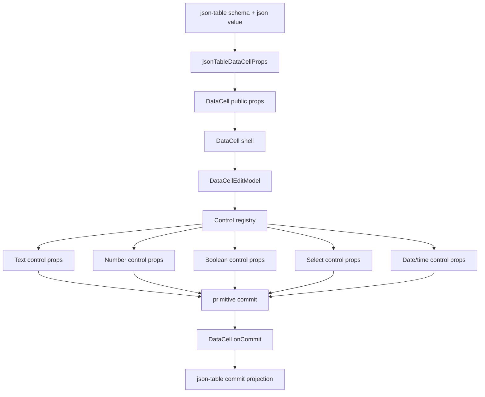
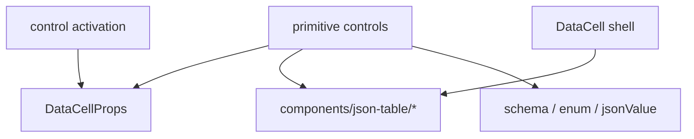

# DataCell Absolute Primitive Boundary Blueprint

## Verdict

Not yet platonic.

The total primitive contract pass made the primitive controls exact. That was
necessary, but not sufficient.

The remaining impurity is not inside the controls anymore. It is one layer
above them: `DataCellControl` and the registry still use public `DataCellProps`
as the object that crosses the internal primitive boundary. That means the
public API has stopped leaking into controls, but it has not stopped leaking
into the control system.

That object still means too many things:

- public consumer API
- edit-session state
- kind-specific control props
- control activation input
- primitive commit boundary

The perfect version has one boundary per concept. Public props enter once at
the shell, become a small internal model, and never appear below that shell.

## One-Sentence Target

`DataCell` should be a trompe-l'oeil primitive whose public props are projected
once into an exact edit model, then delegated to tiny kind-specific controls
that know nothing about tables, JSON, schemas, or unused public props.

## Current Remaining Gaps

### 1. `DataCellControl` Still Accepts Public Props

Current shape:

```txt
DataCellProps -> DataCellControl -> registry projection -> exact control props
```

Platonic shape:

```txt
DataCellProps -> DataCellEditModel -> DataCellControl -> exact control props
```

The public API should not be the internal edit protocol. `DataCellProps` is for
callers. `DataCellEditModel` is for the primitive.

### 2. Registry Projection Is Still Negative

The registry currently knows what to throw away:

```ts
active: _active
editable: _editable
mode: _mode
onActiveChange: _onActiveChange
```

That is better than letting controls receive those props, but it is still not
perfect. A pure projection should construct from a model that never contained
those fields.

Target:

```ts
function dataCellTextControlProps(
  model: DataCellTextEditModel
): DataCellTextControlProps
```

No ignored aliases. No broad destructuring. No negative vocabulary.

### 3. Activation Model Is Derived Too Late

Activation already uses `activationModel`, but `DataCell` still creates it from
public props at each event site.

Target:

```txt
DataCellProps -> DataCellEditModel.activation -> control action
```

The shell should derive primitive edit facts once, then reuse them.

### 4. Type Casts Still Mark Boundary Friction

These casts are symptoms:

- broad commit handler cast for boolean command actions
- `as DataCellControlActivationModel`
- input parse casts for text/number commit

Some cast may remain at the public commit boundary because public handlers are a
union. But every internal cast should be treated as debt until proven
unavoidable.

### 5. Dispatch Is Correct But Repetitive

The control registry repeats the same kind switch for pointer, click, key, and
rendering. This is not a behavior bug, but it is entropy loss: multiple
structures encode the same `kind -> adapter` relation.

The ideal registry has one adapter table and small typed accessors. If TypeScript
requires branch narrowing, the branch should be isolated in one helper, not
repeated across every action.

## Non-Negotiable Principles

1. `DataCell` owns primitive interaction.
2. `json-table` owns JSON projection and patch reconstruction.
3. The public `DataCellProps` API stops at the primitive shell.
4. The control registry owns kind dispatch and prop projection.
5. Each primitive control receives only the props it reads.
6. Activation receives only the value and DOM facts needed to choose an action.
7. Overlay controls use the same `open` / `onOpenChange` vocabulary.
8. No control imports `components/json-table/*`.
9. No control imports or extends `DataCellProps`.
10. No compatibility shims, legacy aliases, or fallback paths.
11. No ignored prop aliases anywhere below the shell.
12. No public prop object crosses into `DataCellControl`.
13. No table word appears in primitive runtime code.
14. No repeated lifecycle vocabulary for the same concept.

## Ideal Layer Graph



Forbidden edges:



## Pure Responsibilities

### `json-table`

Owns meaning:

- schema inspection
- JSON value normalization
- enum identity preservation
- nullable sentinel handling
- row and column identity
- document patch construction
- table focus policy
- virtualization coordination

Does not own primitive behavior:

- text caret placement
- checkbox toggling
- select popup lifecycle
- date/time picker opening
- outside-click survival
- keyboard navigation inside primitive controls

Its only primitive contract is:

```txt
json value -> DataCellProps -> primitive commit -> json value -> patch
```

### `DataCell`

Owns the trompe-l'oeil:

- display surface while inactive
- editor surface while active
- controlled and uncontrolled active state
- activation from pointer, click, keyboard, and shell
- one activation source for the edit session
- command actions that commit without mounting an editor
- edit-session end
- primitive commit forwarding

Does not own kind-specific DOM behavior:

- text selection math
- numeric parsing rules beyond public format helpers
- checkbox input mechanics
- select option navigation
- date/time picker internals

### Control Registry

Owns the only conversion from edit model to primitive control props:

```txt
DataCellEditModel -> exact kind props
```

It also owns kind activation policy:

```txt
activation model + event facts -> none | edit | command
```

The registry is allowed to import:

- `DataCellEditModel`
- exact primitive control prop types
- primitive controls
- primitive activation helpers

The registry is not allowed to import:

- `components/json-table/*`
- schema or table types
- table-specific enum helpers
- `DataCellProps`

### Primitive Controls

Own native behavior:

- focused DOM element
- input, button, combobox, or picker mechanics
- draft editing
- popup open state when uncontrolled
- primitive value commit
- cancel and finish behavior
- ARIA for the concrete control

Primitive controls do not receive broad public props. If a prop is destructured
and ignored, it should not exist.

## Final Runtime Shape

The implementation should read like this:

```txt
DataCell
  builds DataCellEditModel
  asks registry for ControlAction on activation
  mounts DataCellControl while active

DataCellControl
  receives DataCellEditModel
  switches on editModel.kind through one adapter table
  calls the matching projection function
  renders the exact primitive control

Primitive control
  receives exact props
  uses browser-native behavior wherever possible
  commits a primitive value
```

No primitive control should need to know why the value exists.

## Target Types

### Public Props

`DataCellProps` remains the external API. It is optimized for consumers, not
for internals.

It may include cross-kind convenience fields, but those fields must be projected
away before reaching a primitive control.

### Edit Model

The shell should derive one internal model. It should contain only facts that
are meaningful while a primitive cell is mounted or about to mount.

```ts
type DataCellEditModel =
  | DataCellTextEditModel
  | DataCellNumberEditModel
  | DataCellIntegerEditModel
  | DataCellBooleanEditModel
  | DataCellSelectEditModel
  | DataCellPickerEditModel

type DataCellEditModelBase<Kind extends DataCellKind, Value> = {
  kind: Kind
  value?: Value
  disabled: boolean
  name?: string
  className?: string
  autoFocus?: boolean
  activationSource?: DataCellActivationSource
  onEditingEnd?: () => void
  onEditorHandleChange?: (handle: DataCellEditorHandle | null) => void
  nativeProps: DataCellNativePropsByKind[Kind]
}

type DataCellTextEditModel = DataCellEditModelBase<"text", string | null> & {
  placeholder?: string
  draftValue?: string
  onDraftValueChange?: DataCellTextDraftHandler
  onCommit?: DataCellTextCommitHandler
}

type DataCellNumberEditModel = DataCellEditModelBase<
  "number",
  number | string | null
> & {
  placeholder?: string
  draftValue?: string
  onDraftValueChange?: DataCellNumberDraftHandler
  onCommit?: DataCellNumberCommitHandler
}

type DataCellIntegerEditModel = DataCellEditModelBase<
  "integer",
  number | string | null
> & {
  placeholder?: string
  draftValue?: string
  onDraftValueChange?: DataCellNumberDraftHandler
  onCommit?: DataCellNumberCommitHandler
}

type DataCellBooleanEditModel = DataCellEditModelBase<
  "boolean",
  boolean | null
> & {
  onCommit?: DataCellBooleanCommitHandler
}

type DataCellSelectEditModel = DataCellEditModelBase<
  "select",
  string | null
> & {
  placeholder?: string
  formatValue?: DataCellSelectFormatValue
  open?: boolean
  options: DataCellSelectOption[]
  onOpenChange?: (open: boolean) => void
  onCommit?: DataCellSelectCommitHandler
}

type DataCellPickerEditModel = DataCellEditModelBase<
  "date" | "time" | "date-time",
  string | null
> & {
  placeholder?: string
  dateTimeZone?: DataCellDateTimeZone
  showPickerIcon?: boolean
  formatValue?: DataCellPickerFormatValue
  draftValue?: string
  open?: boolean
  onDraftValueChange?: DataCellPickerDraftHandler
  onOpenChange?: (open: boolean) => void
  onCommit?: DataCellPickerCommitHandler
}
```

This model is internal. It is not exported as the public API.

It must not contain:

- `editable`
- `active`
- `mode`
- `onActiveChange`
- display-only formatting for non-edit surfaces
- select fields on non-select models
- picker fields on non-picker models

### Control Props

Each control gets a precise type:

```ts
type DataCellControlPropsByKind = {
  text: DataCellTextControlProps
  number: DataCellNumberControlProps
  integer: DataCellNumberControlProps
  boolean: DataCellBooleanControlProps
  select: DataCellSelectControlProps
  date: DataCellPickerControlProps
  time: DataCellPickerControlProps
  "date-time": DataCellPickerControlProps
}
```

No member of that map may extend `DataCellProps`.

## Exact Control Contracts

### Text

Receives:

- `kind: "text"`
- `value: string | null | undefined`
- `disabled`
- `name`
- `placeholder`
- `className`
- `draftValue`
- `autoFocus`
- `activationSource`
- `onDraftValueChange`
- `onCommit`
- `onEditingEnd`
- `onEditorHandleChange`
- input DOM props that are actually forwarded

Does not receive:

- select options
- picker open state
- boolean state
- table metadata
- ignored public props

### Number And Integer

Receive the text input contract plus numeric kind and numeric commit semantics.

Do not receive:

- select options
- picker open state
- table metadata

### Boolean

Receives:

- `kind: "boolean"`
- `value: boolean | null | undefined`
- `disabled`
- `name`
- `className`
- `autoFocus`
- `onCommit`
- `onEditingEnd`
- `onEditorHandleChange`
- button DOM props that are actually forwarded

Does not receive:

- draft values
- placeholder
- formatter
- select options
- picker props

### Select

Receives:

- `kind: "select"`
- `value: string | null | undefined`
- `options: DataCellSelectOption[]`
- `disabled`
- `name`
- `placeholder`
- `className`
- `autoFocus`
- `activationSource`
- `open`
- `onOpenChange`
- `onCommit`
- `onEditingEnd`
- `onEditorHandleChange`
- trigger DOM props that are actually forwarded

Does not receive:

- JSON enum objects
- nullable sentinels
- schema metadata
- picker-specific names

### Date / Time / Date-Time

Receive:

- `kind: "date" | "time" | "date-time"`
- `value: string | null | undefined`
- `dateTimeZone`
- `disabled`
- `name`
- `placeholder`
- `className`
- `autoFocus`
- `activationSource`
- `open`
- `onOpenChange`
- `onCommit`
- `onEditingEnd`
- `onEditorHandleChange`
- input DOM props that are actually forwarded

Does not receive:

- select options
- JSON metadata
- table lifecycle props

## Activation Contract

Activation should not receive `DataCellProps`.

It should receive:

```ts
type DataCellActivationModelByKind = {
  text: { kind: "text"; value?: string | null; disabled: boolean }
  number: { kind: "number"; value?: number | string | null; disabled: boolean }
  integer: {
    kind: "integer"
    value?: number | string | null
    disabled: boolean
  }
  boolean: { kind: "boolean"; value?: boolean | null; disabled: boolean }
  select: { kind: "select"; value?: string | null; disabled: boolean }
  date: { kind: "date"; value?: string | null; disabled: boolean }
  time: { kind: "time"; value?: string | null; disabled: boolean }
  "date-time": { kind: "date-time"; value?: string | null; disabled: boolean }
}

type DataCellControlActivationModel =
  | { kind: "text"; value?: string | null; disabled: boolean }
  | { kind: "number"; value?: number | string | null; disabled: boolean }
  | { kind: "integer"; value?: number | string | null; disabled: boolean }
  | { kind: "boolean"; value?: boolean | null; disabled: boolean }
  | { kind: "select"; value?: string | null; disabled: boolean }
  | { kind: "date"; value?: string | null; disabled: boolean }
  | { kind: "time"; value?: string | null; disabled: boolean }
  | { kind: "date-time"; value?: string | null; disabled: boolean }
```

Pointer activation receives DOM facts:

- `clientX`
- `clientY`
- `detail`
- `displayElement`
- `event`

Keyboard activation receives:

- `key`

This keeps activation close to the metal. It answers one question: what should
this primitive do with this user action?

The activation model should be a field on `DataCellEditModel`, not a function
that repeatedly re-reads public props.

## Registry Shape

The registry should be table-driven first and branch-driven only where TypeScript
requires narrowing.

Target:

```ts
type DataCellControlAdapter<Kind extends DataCellKind> = {
  Control: React.ComponentType<DataCellControlPropsByKind[Kind]>
  controlProps: (
    model: DataCellEditModelByKind[Kind]
  ) => DataCellControlPropsByKind[Kind]
  pointerAction: (
    args: DataCellPointerActionArgs<Kind>
  ) => DataCellControlAction
  clickAction: (args: DataCellPointerActionArgs<Kind>) => DataCellControlAction
  keyAction: (args: DataCellKeyActionArgs<Kind>) => DataCellControlAction
  canActivateFromKey: (key: string) => boolean
}
```

The public render path should read:

```tsx
export function DataCellControl({ model }: { model: DataCellEditModel }) {
  return renderDataCellControl(model)
}
```

The forbidden render path is:

```tsx
export function DataCellControl(props: DataCellProps) {}
```

## Projection Rules

Projection functions must be positive, not negative.

Allowed:

```ts
function dataCellSelectControlProps(
  model: DataCellSelectEditModel
): DataCellSelectControlProps {
  return {
    kind: model.kind,
    value: model.value,
    disabled: model.disabled,
    options: model.options,
    open: model.open,
    onOpenChange: model.onOpenChange,
  }
}
```

Forbidden:

```ts
const {
  active: _active,
  editable: _editable,
  mode: _mode,
  ...controlProps
} = props
```

If a field has to be discarded, it belongs above the model boundary.

## Cast Policy

Every cast should be classified before implementation ends.

Allowed casts:

- public commit handler union narrowed at the shell boundary, if TypeScript
  cannot express the public discriminated union without damaging the API
- DOM event casts required by browser APIs

Forbidden casts:

- `as DataCellControlActivationModel`
- `as DataCellTextControlProps`
- `as DataCellNumberControlProps`
- `as DataCellBooleanControlProps`
- `as DataCellSelectControlProps`
- `as DataCellPickerControlProps`
- broad `as never` at JSON-table/DataCell call sites

The target is not zero casts at any cost. The target is that every remaining
cast marks a real TypeScript limitation at a public boundary, not imprecise
internal modeling.

## Public Overlay Naming

Use only:

- `open`
- `onOpenChange`

Do not use:

- `isPickerOpen`
- `onPickerOpenChange`

The public API should not describe select through picker vocabulary, and picker
should not force its name onto other overlays.

## Implementation Plan

1. Add `data-cell-edit-model.ts`.
2. Define `DataCellEditModelByKind` and `DataCellEditModel`.
3. Define `createDataCellEditModel(props, shellState)`.
4. Move `activationModel` derivation into the edit model.
5. Make `DataCellControl` accept `{ model: DataCellEditModel }`.
6. Replace registry `controlProps(props)` with `controlProps(model)`.
7. Replace all negative projection destructures with positive object
   construction.
8. Remove `DataCellPublicPropsByKind` if the registry no longer needs public
   props.
9. Remove `DataCellProps` import from the control registry unless it is only
   needed by public helper APIs.
10. Compress pointer/click/key dispatch through one adapter lookup or one
    isolated narrowing helper.
11. Reclassify every remaining cast and delete internal casts.
12. Strengthen architecture tests for the new boundary.
13. Rebuild and validate registry output.

## Architecture Tests

Add tests that assert:

- primitive controls do not import `DataCellProps`
- primitive controls do not contain `DataCellProps &`
- primitive controls do not import `components/json-table/*`
- primitive controls do not mention `JsonTable`, `jsonValue`, `schema`, or
  `sentinel`
- primitive controls do not destructure ignored underscore props
- primitive controls do not use `isPickerOpen` or `onPickerOpenChange`
- `DataCellControl` does not spread public props directly into controls
- every control adapter defines `controlProps`
- activation action args do not contain `props: DataCellProps`
- `DataCellControl` does not accept `DataCellProps`
- the control registry does not import `DataCellProps`
- no registry projection contains ignored underscore aliases
- no registry projection destructures `active`, `editable`, `mode`, or
  `onActiveChange`
- no internal projection casts to exact control prop types
- activation model is read from `DataCellEditModel`
- JSON-table enum rendering goes through `DataCell kind="select"`
- no `EnumEditor` path owns primitive select interaction

## Verification Gates

Run these before considering the pass complete:

```sh
pnpm exec vitest run tests/json-table-architecture.test.ts --reporter=dot
pnpm exec vitest run tests/data-cell.test.tsx tests/data-cell-control-lifecycle.test.tsx --reporter=dot
pnpm exec vitest run tests/data-cell-select-activation.test.tsx tests/data-cell-select-keyboard.test.tsx tests/data-cell-select-state.test.tsx --reporter=dot
pnpm exec vitest run $(rg --files tests | rg 'json-table.*\.test\.(ts|tsx)$' | tr '\n' ' ') --reporter=dot
pnpm exec tsc --noEmit --pretty false --skipLibCheck
pnpm run verify:data-cell
pnpm exec playwright test e2e/data-cell-caret.spec.ts
pnpm exec shadcn build --output public/r
git diff --check
```

## Platonic Acceptance Criteria

The component reaches the target only when all of this is true:

- A reader can understand `DataCell` without knowing JSON-table exists.
- A reader can understand each primitive control without reading `DataCellProps`.
- `DataCell` is the only place where public props become primitive edit state.
- The registry maps edit models to exact control props.
- Select, picker, text, number, and boolean share the same lifecycle vocabulary.
- The enum path is just JSON-table projection into primitive select props.
- Click, type, checkbox, select, date, and caret behavior pass integration tests.
- There are no unused compatibility names left in runtime code.
- The final code has fewer concepts than the previous code.
- There are no ignored prop aliases below `DataCell`.
- Every remaining cast has a documented public-boundary reason.

That is the pure boundary: public API once, internal model once, exact controls
forever.
