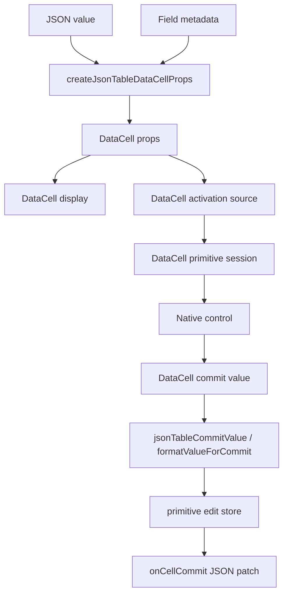
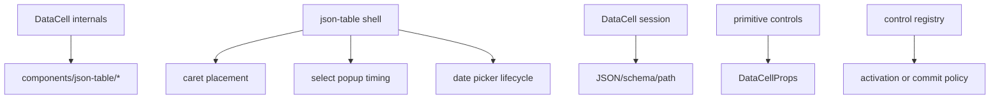
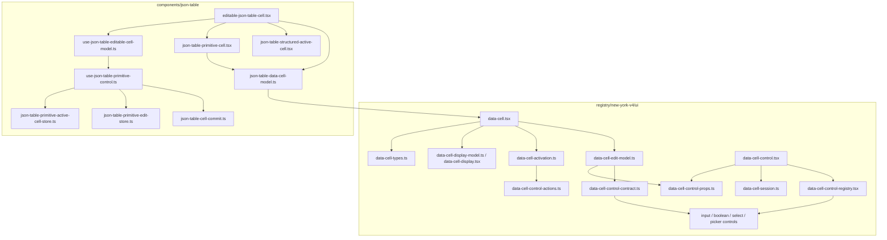

# DataCell JSON Table Bare-Metal Primitive Blueprint

## Verdict

Against the concrete DataCell/json-table boundary gates in this blueprint:
nearly yes.

Against the absolute meaning of "platonic ideal": not yet. The code is now
close to the right shape, but the proof is still impure because one DataCell
verification gate depends on a broad docs route that can fail for unrelated
viewer-wrapper reasons. A component cannot be called architecturally perfect
while its proof harness crosses unrelated product surfaces.

Keep treating the ideal as a ratchet, not a trophy. The current architecture is
the cleanest verified shape we have reached, but the proof must stay local to
this component until the whole dirty worktree is type-clean again:

- `DataCell` is the primitive trompe-l'oeil.
- json-table is the JSON/schema adapter.
- primitive browser behavior belongs to `DataCell`.
- JSON identity, table identity, optimistic table commits, and document patches
  belong to json-table.
- enum values now go through `DataCell` instead of a special table editor.
- `DataCell` imports no `components/json-table/*`.
- json-table calls one public primitive boundary:
  `createJsonTableDataCellProps`.
- text, number, and integer now share one native input-control path instead of
  separate wrapper controls.
- hover does not mount controls.
- activation is intentional and carries pointer or keyboard intent.

The remaining work is preservation plus isolated proof. The system is now
simple enough that new complexity should be treated as suspicious by default:
if a behavior cannot be placed cleanly in `DataCell` or json-table, the design
has probably started to drift.

## Remaining Platonic Gap

The architecture is close, but not perfect, for one precise reason:

```txt
DataCell proof still reaches through docs/app infrastructure.
```

That is not a runtime ownership smell inside `DataCell` or json-table. It is a
verification ownership smell. The proof boundary should match the architecture
boundary:

```txt
DataCell parity proof -> DataCell demo harness -> DataCell runtime
```

not:

```txt
DataCell parity proof -> docs route -> app shell -> unrelated viewer wrappers
```

The next hard cutover is therefore not another interaction rewrite. It is a
proof rewrite:

- create an isolated DataCell parity route or harness that mounts
  `DataCellDemo` only;
- point `verify:data-cell` at that isolated harness by default;
- keep docs pages as documentation consumers, not as the canonical primitive
  verifier;
- keep registry determinism scoped to the `data-cell` registry item;
- keep repo-wide typecheck as repository evidence, not component-local
  evidence.

Once this is done, the component has a clean local certificate:

```txt
architecture tests
  + primitive interaction tests
  + json-table interaction tests
  + scoped registry determinism
  + isolated DataCell browser parity
```

Only then can failures in csv/docx/image/markdown/pdf/pptx viewer wrappers be
named honestly as unrelated repository health issues rather than blockers for
DataCell truth.

## Blueprint

The target architecture is deliberately small:

```txt
json value + schema metadata
  -> createJsonTableDataCellProps
  -> DataCell props
  -> DataCell edit model
  -> one primitive control
  -> primitive commit
  -> json-table JSON commit
  -> document patch
```

Every module must either preserve one boundary in that sentence or disappear.
No module may exist only to rename props, hide a single call, or emulate an
older API.

The hard rule:

```txt
DataCell knows primitive browser behavior.
json-table knows JSON and table identity.
Nothing else knows either.
```

### Phase 1: Preserve The Primitive Boundary

- `DataCell` remains the trompe-l'oeil primitive: display first, control only
  on activation.
- `DataCell` keeps text caret placement, first-key editing, checkbox command
  semantics, select popup lifecycle, picker lifecycle, blur, Enter, Escape, and
  exactly-once finish semantics.
- `DataCell` never imports `components/json-table/*`.
- primitive controls never import public `DataCellProps`; they receive internal
  shell, state, and session props only.
- the control registry maps kind to control and performs no behavior.
- text, number, and integer keep one input-control implementation.

### Phase 2: Preserve The JSON Adapter Boundary

- json-table calls one primitive projection function:
  `createJsonTableDataCellProps`.
- `json-table-data-cell-model.ts` remains an adapter, not a second component
  system.
- enum, nullable enum, object enum, date, time, boolean, number, integer, text,
  and fallback structured values all project through `DataCellProps`.
- JSON identity preservation stays in json-table, never in `DataCell`.
- active table identity and optimistic pending values stay in json-table.
- primitive browser details never leak back into table shell handlers.

### Phase 3: Keep Names Exact

- adapter-local shell props are `ShellProps` and `shellProps`.
- table commit callbacks are `CommitJsonValue`.
- JSON commit primitives are `JsonCommitValue`.
- primitive conversion names say what they convert:
  `jsonTableDataCellCommitHandler`,
  `jsonTableDataCellJsonCommitHandler`, `jsonTableCommitValue`.
- vague local aliases such as `SharedDataCellProps`, `sharedProps`,
  `PrimitiveJsonTableCellModel`, or `JsonTablePrimitiveControl` must not return.

### Phase 4: Make Proof Cheap

- architecture tests guard forbidden imports, deleted files, exact names, and
  one-boundary ownership.
- interaction tests guard the real user contract: first click, first key,
  caret placement, select opening, enum commit, blur commit, Escape cancel,
  checkbox toggle, picker identity, active-cell switching, and virtualization
  cleanup.
- registry verification proves the shadcn artifact follows the source.
- repo-wide typecheck is required before calling the whole worktree ideal, but
  unrelated dirty component failures must be named as unrelated instead of
  hidden.

### Phase 5: Isolate The Browser Certificate

`verify:data-cell` must exercise DataCell itself, not the docs site that happens
to display it. The canonical parity page should import the DataCell demo and as
little else as possible:

```txt
app route
  -> DataCellDemo
  -> components/ui/data-cell
  -> registry/new-york-v4/ui/data-cell*
```

The canonical parity page must not import:

- docs navigation;
- MDX rendering;
- viewer wrappers;
- registry catalog pages;
- json-table demos;
- app-level product chrome.

This page is not a feature page. It is a proof fixture. It exists so browser
parity assertions can fail only for DataCell behavior, generated DataCell
artifacts, CSS needed by DataCell, or the local dev server itself.

If the isolated route still fails, the failure is actionable DataCell evidence.
If the docs route fails while the isolated route passes, the DataCell
architecture is not implicated.

## Principle

There are only two systems:

```txt
DataCell   = primitive illusion and browser-control lifecycle
json-table = JSON/schema projection and table commit lifecycle
```

There is no third primitive interaction system.
There is also no third flavor of text editing. Text, number, and integer are
all input cells. Their differences are validation and parsing policy, not
different component ownership.

If a rule would be true for a primitive cell outside a table, it belongs to
`DataCell`.

If a rule needs JSON path, schema metadata, enum identity, row identity,
virtualization, optimistic document state, or patch emission, it belongs to
json-table.

## Ideal Flow



Forbidden arrows:



## Ownership

### DataCell Owns

- inert display rendering.
- hover affordance without mounting controls.
- activation from pointer, keyboard, and programmatic focus.
- pointer caret placement for text.
- first-key text editing.
- checkbox first-click toggle semantics.
- select open, close, keyboard navigation, option commit, and popup dismissal.
- date/time picker open, close, display identity, and commit semantics.
- dirty draft protection while active.
- blur, Enter, Escape, cancel, and editing-end lifecycle.
- exactly-once primitive session finish.
- primitive accessibility roles and focus behavior.

### json-table Owns

- field path and cell identity.
- whether the field is primitive or structured.
- schema kind to `DataCell` kind projection.
- JSON value to primitive value projection.
- enum option construction.
- nullable enum sentinel mapping.
- object enum identity preservation.
- table class names needed for cell fit.
- active primitive cell identity.
- active-cell replacement across rows.
- optimistic primitive pending values.
- normalization before document commit.
- JSON patch emission.
- virtualization cleanup.

### No One Else Owns Primitive Editing

There must be no adapter, enum editor, shell handoff, wrapper component, or
imperative handle that owns part of primitive editing between those two
systems.

## Public Contract

`DataCell` takes declarative primitive props and emits primitive events.

```ts
type DataCellProps = {
  kind: DataCellKind
  value?: DataCellValue
  editable?: boolean
  active?: boolean
  disabled?: boolean
  name?: string
  autoFocus?: boolean
  className?: string
  onActiveChange?: (active: boolean) => void
  onCommit?: (value: DataCellCommitValue, meta: DataCellValueMeta) => void
  onEditingEnd?: () => void
}
```

Kind-specific props may describe primitive behavior only:

- text, number, integer: value, placeholder, optional draft control.
- select: options, placeholder, formatter, optional open control.
- date, time, date-time: formatting, picker affordance, optional open control.
- boolean: value and commit.

The public contract must never expose:

- JSON paths.
- schemas.
- row IDs.
- table active-cell objects.
- nullable enum sentinel details.
- virtualizer state.
- imperative editor handles.
- compatibility mode aliases.

## Internal DataCell Contract

Primitive controls receive one shell, one optional controlled-state object, and
one session.

```ts
type DataCellPrimitiveControlProps = {
  shell: DataCellPrimitiveShell
  state?: DataCellPrimitiveState
  session: DataCellPrimitiveSession
}

type DataCellPrimitiveState = {
  draft?: {
    value?: string
    onChange?: (value: string, meta: DataCellValueMeta) => void
  }
  open?: {
    value?: boolean
    onChange?: (open: boolean) => void
  }
}
```

Primitive controls must not receive:

- `DataCellProps`.
- raw `onCommit`.
- raw `onEditingEnd`.
- JSON names.
- schema names.
- table names.
- public controlled prop names such as `draftValue`, `onDraftValueChange`,
  `open`, or `onOpenChange`.

Public ergonomics are normalized once at the edit-model edge.

## Session Contract

The session owns lifecycle, not value storage.

```ts
type DataCellPrimitiveSession = {
  commit(
    value: DataCellCommitValue,
    meta: DataCellValueMeta,
    options?: {
      endEditing?: boolean
      markFinished?: boolean
      shouldCommit?: () => boolean
    }
  ): void
  cancel(): void
  end(options?: { markFinished?: boolean }): void
  reset(): void
}
```

The session must not own:

- text draft state.
- popup open state.
- display formatting.
- JSON conversion.
- active table identity.
- table commit dispatch.

## json-table Primitive Contract

json-table has one projection function:

```ts
createJsonTableDataCellProps(input): DataCellProps
```

The input can include JSON value, field metadata, active state, editable state,
and table callbacks. The output is direct `DataCellProps`.

There should be no intermediate exported model:

```txt
createJsonTableDataCellModel
JsonTableDataCellModel
JsonTableSelectDataCellModel
JsonTableBooleanDataCellModel
JsonTableNumberDataCellModel
JsonTableTextDataCellModel
jsonTableDataCellPropsForModel
```

Those names describe an adapter layer that does not deserve independent life.
The table projects straight into `DataCell` props.

Required adapter names:

```txt
createJsonTableDataCellProps
jsonTableDataCellCommitHandler
jsonTableDataCellJsonCommitHandler
toJsonValue
```

Required primitive-control names:

```txt
effectiveValue
commitValue
setActive
commitValidatedValue
```

Forbidden local control aliases:

```txt
primitiveEffectiveValue
commitPrimitiveValue
commitPrimitiveValueChange
setPrimitiveActive
```

The table active-cell store may still use `setPrimitiveActiveCell`; that names
table identity, not the local DataCell control surface.

## Module Map



Dependency law:

```txt
json-table may import DataCell public entrypoints.
DataCell may import no json-table code.
primitive controls may import internal DataCell contracts only.
the control registry may only map kind -> control component.
```

## Current Shape To Preserve

Keep these hard-won simplifications:

- no `json-table-display-cell.tsx`.
- no `json-table-data-cell.tsx` wrapper.
- no `json-table-primitive-active-cell-replacement.ts`.
- no `use-json-table-primitive-cell-controller.ts`.
- no table-specific enum editor.
- no `JsonTablePrimitiveControl` type alias. The hook return shape is the
  contract.
- no `JsonTableEditableCellModel` or local disabled/primitive/structured/display
  cell-model union aliases.
- no `json-table-cell-model.ts`. `useJsonTableEditableCellModel` owns the
  disabled, primitive, structured-active, and display render model directly.
- no `use-json-table-cell-profiler.ts`. `useJsonTableEditableCellModel` records
  the editable-cell render profile directly.
- no `data-cell-number-control.tsx`. Number and integer cells are input cells,
  not a separate primitive-control family.
- no `DataCellTextControl` wrapper. The registry maps text, number, and integer
  directly to `DataCellInputControl`.
- no separate `dataCellTextControlProps` or `dataCellNumberControlProps`
  builders. Text, number, and integer use `dataCellInputControlProps`.
- no assertion cast in `dataCellInputControlProps`. Overloads carry the exact
  input-control prop shape.
- no commit-value assertion cast in text or picker controls.
  `parseDataCellInputValue` carries the caller's return type.
- no `DataCellProps` import in `data-cell-control-actions.ts`. Action policy
  accepts a minimal internal activation-state input, not public primitive props.
- no repeated non-boolean state branches in `createDataCellControlState`. The
  only state-projection special case is boolean, because it carries a command
  commit handler.
- no repeated edit-model lifecycle projection in every kind branch.
  `DataCellTypedPropsForKind` lets `dataCellEditModelBase` own the common
  disabled, focus, commit, editing-end, and editor-prop surface once without
  noisy per-call kind or commit arguments.
- no separate `data-cell-control-state.ts` adapter module.
- no `JsonTablePrimitiveCellProps` or `JsonTableStructuredActiveCellProps`
  aliases. Component props are inline at the component boundary and inferred
  directly where child props are stored.
- `useJsonTableEditableCellModel` is the editable-cell model boundary.
- `json-table-data-cell-model.ts` branches directly from schema primitive kind
  to `DataCellProps`.
- `json-table-data-cell-model.ts` uses short local names for adapter-local
  ideas: `ShellProps`, `CommitJsonValue`, `JsonCommitValue`, and
  `TextDataCellKind`.
- `use-elevated-virtual-row.ts` accepts one table-owned boolean:
  `isElevated`. It does not know about input focus, select popup state, or
  picker popup state.
- select keeps nullable enum sentinel mapping inside json-table.
- date/time/date-time picker props are emitted only for picker cells.
- text cells do not receive picker-only props.

## Remaining Simplification Target

The next improvement is to make both primitive sides read as one
sentence:

```txt
cell field -> primitive control -> cell model -> DataCell props -> JSON commit
```

and:

```txt
DataCell props -> edit model -> kind props -> registry -> native control -> session
```

Every table primitive module must justify itself:

- `use-json-table-editable-cell-model.ts` composes hooks.
- `use-json-table-editable-cell-model.ts` chooses disabled, primitive,
  structured-active, or display rendering.
- `use-json-table-primitive-control.ts` owns effective value, commit, and active
  identity switching.
- `json-table-data-cell-model.ts` owns JSON/schema to `DataCellProps`.
- `json-table-primitive-active-cell-store.ts` owns active-cell replacement.
- `json-table-primitive-edit-store.ts` owns optimistic primitive values.

If a module only renames data, delete it.

If a type is only needed by one file, keep it local.

If a public export exists only to make another table file compile, prefer
inference or direct call-site types.

Every DataCell primitive module must justify itself:

- `data-cell.tsx` owns the inert shell, display, activation source, and edit
  model.
- `data-cell-edit-model.ts` normalizes public props into one internal edit
  model.
- `data-cell-control-props.ts` turns the edit model into kind-specific control
  props.
- `data-cell-control-registry.tsx` maps kind to component and does nothing
  else.
- `data-cell-input-control.tsx` owns the single native input control for text,
  number, and integer.
- `data-cell-boolean-control.tsx` owns checkbox behavior.
- `data-cell-select-control.tsx` owns select behavior.
- `data-cell-picker-control.tsx` owns date/time picker behavior.
- `data-cell-session.ts` owns exactly-once commit, cancel, and end lifecycle.

If a file only forwards props to another primitive control, delete it.
If a component name says "text" but the implementation is the generic input
path, rename it or remove the wrapper.

## Interaction Invariants

The architecture is only valid if these behaviors fall out naturally:

- inactive cell renders display only.
- hover never mounts a browser control.
- first text click activates and places the caret at the clicked grapheme.
- first printable text key edits according to explicit first-key policy.
- typing after pointer activation inserts at the caret, not by replacing the
  whole value.
- dirty text blur commits once.
- unchanged text blur ends once without commit.
- Enter commits once.
- Escape cancels once.
- parent value echoes do not overwrite an active dirty draft.
- checkbox first click toggles once.
- checkbox keyboard Space toggles once.
- select first click opens the popup.
- select opening click does not immediately close the popup.
- select option click commits once.
- nullable enum commits JSON `null`, not the sentinel label.
- object enum commits the original enum object identity.
- unknown enum values remain selectable/displayable without corrupting JSON.
- date display text and active picker value represent the same JSON identity.
- picker outside click follows the primitive end rule once.
- switching from dirty text to another primitive commits old text and preserves
  the new primitive's pointer intent.
- stale `onEditingEnd` from an old active cell cannot clear a newer active
  cell.
- virtualized unmount finishes the active primitive once.

## Architecture Guards

Tests must reject:

- `registry/new-york-v4/ui/data-cell*` importing `components/json-table/*`.
- primitive controls importing `DataCellProps`.
- `data-cell-control-actions.ts` importing `DataCellProps`.
- `createDataCellControlState` branching separately for non-boolean kinds.
- edit-model kind builders repeating base lifecycle fields instead of using
  `dataCellEditModelBase`.
- `dataCellEditModelBase` call sites passing `props.kind` or `props.onCommit`
  separately.
- primitive controls importing json-table modules.
- primitive controls extending broad native React prop bags.
- primitive controls receiving raw `onCommit` or `onEditingEnd`.
- internal control props containing public names:
  `draftValue`, `onDraftValueChange`, `open`, `onOpenChange`.
- `data-cell-control-registry.tsx` creating sessions or normalizing props.
- `data-cell-control-registry.tsx` casting commit handlers.
- generic `DataCellPrimitiveSession`.
- json-table shell files containing select, picker, caret, or blur mechanics.
- `json-table-data-cell-model.ts` exporting an intermediate model type.
- `use-json-table-primitive-control.ts` defining `JsonTablePrimitiveControl`.
- `json-table-cell-model.ts` returning as a separate single-use model module.
- `use-json-table-cell-profiler.ts` returning as a separate single-use profiler
  module.
- `data-cell-number-control.tsx` returning as a pass-through wrapper.
- `DataCellTextControl` returning as a pass-through wrapper.
- `DataCellNumberControl` returning as a pass-through wrapper.
- `data-cell-control-registry.tsx` importing `DataCellTextControl` or
  `DataCellNumberControl`.
- `data-cell-control-registry.tsx` mapping text, number, or integer to anything
  other than `DataCellInputControl`.
- `data-cell-control-props.ts` splitting text and number through separate input
  prop builders.
- `dataCellInputControlProps` casting to `DataCellControlStaticPropsByKind`.
- text or picker controls casting parsed commit values.
- `data-cell-control-state.ts` returning as a separate adapter module.
- `use-json-table-editable-cell-model.ts` defining `JsonTableEditableCellModel`
  or local variant aliases such as `PrimitiveJsonTableCellModel`.
- `JsonTablePrimitiveCellProps` or `JsonTableStructuredActiveCellProps`
  aliases returning in primitive render files or the cell model.
- `use-elevated-virtual-row.ts` accepting fake primitive lifecycle state such
  as `isInputFocused` or `isSelectOpen`.
- `json-table-data-cell-model.ts` keeping overqualified local adapter names
  such as `JsonTableDataCellSharedProps`,
  `JsonTableDataCellCommitHandler`, `JsonTableTextDataCellKind`, or
  `JsonTableDataCellJsonCommitValue`.
- `json-table-data-cell-model.ts` using vague names such as
  `SharedDataCellProps` or `sharedProps` for table shell props.

Tests must prove:

- each schema primitive projects to the exact `DataCell` kind.
- enum options preserve original JSON identity.
- nullable enum sentinel commits JSON `null`.
- date/time commits normalize back to JSON values.
- structured fallback values project through text without a special editor.
- wrong-kind DataCell commits are rejected before public callbacks.
- select activation opens once and does not close during the same gesture.
- text pointer activation preserves caret position through the first character.
- text, number, and integer all use the same input-control implementation.
- table primitive pending values survive parent document echoes while active.
- stale edit endings cannot clear a newer active primitive cell.

## Verification Gates

The blueprint is implemented only when these pass:

```bash
pnpm exec vitest --run tests/json-table-architecture.test.ts --reporter=dot
pnpm exec vitest --run tests/json-table-data-cell-model.test.ts --reporter=dot
pnpm exec vitest --run tests/data-cell-edit-model.test.ts tests/data-cell-control-lifecycle.test.tsx tests/data-cell-select-activation.test.tsx tests/data-cell-select-state.test.tsx tests/data-cell.test.tsx --reporter=dot
pnpm test:json-table -- --reporter=dot
node scripts/build-registry-items.mjs data-cell
pnpm verify:data-cell
pnpm verify:data-cell-registry
pnpm exec tsc --noEmit --pretty false --skipLibCheck --incremental false
```

`pnpm verify:data-cell` must default to the isolated parity harness from
Phase 5. A docs route may be checked as extra coverage, but it is not allowed to
be the primitive's canonical browser certificate.

Current DataCell/json-table evidence after the input-control collapse, typed
parser tightening, action-policy projection tightening, non-boolean state
projection collapse, edit-model lifecycle centralization, exact adapter naming,
exact input-control naming, and registry cleanup:

- `pnpm exec vitest --run tests/json-table-architecture.test.ts tests/data-cell-edit-model.test.ts tests/data-cell-control-lifecycle.test.tsx tests/data-cell.test.tsx --reporter=dot`
  passes: 4 files, 110 tests after removing the `DataCellProps` dependency from
  action policy, collapsing repeated non-boolean control-state branches, and
  removing the remaining input/picker commit-value assertion casts. It also
  proves `dataCellEditModelBase` is the single owner of edit-model lifecycle
  fields and that its call sites do not pass kind or commit handler separately.
- `pnpm exec vitest --run tests/json-table-data-cell-model.test.ts tests/json-table-architecture.test.ts --reporter=dot`
  passes: 2 files, 51 tests after renaming the adapter-local shell surface to
  `ShellProps` and `shellProps`.
- `pnpm exec vitest --run tests/json-table-architecture.test.ts --reporter=dot`
  passes: 1 file, 41 tests after renaming
  `data-cell-text-control.tsx` to `data-cell-input-control.tsx` and guarding
  the old file path as deleted.
- `pnpm exec vitest --run tests/data-cell-edit-model.test.ts tests/data-cell-control-lifecycle.test.tsx tests/data-cell.test.tsx --reporter=dot`
  passes: 3 files, 71 tests after the input-control file rename.
- `pnpm test:json-table -- --reporter=dot` passes: 24 files, 315 tests.
- `node scripts/build-registry-items.mjs data-cell` passes.
- `pnpm verify:data-cell` is currently blocked before parity assertions because
  it still targets a docs/dev-server path that crosses unrelated viewer-wrapper
  code. After clearing stale `.next` artifacts, the broader app has missing
  `components/ui/*` viewer module wrappers for csv, docx, image, markdown, pdf,
  and pptx internals. The required next step is to move this verifier to an
  isolated DataCell parity harness, then rerun it.
- `pnpm verify:data-cell-registry` passes. It now builds the `data-cell`
  registry item directly twice and confirms `public/r/data-cell.json` is
  deterministic across scoped builds, so unrelated registry items no longer
  block the DataCell determinism proof.
- `pnpm exec tsc --noEmit --pretty false --skipLibCheck --incremental false`
  is currently blocked by unrelated `components/ui/*` viewer-wrapper gaps,
  so repo-wide type cleanliness is not evidence for this snapshot.
- `public/r/data-cell.json` is rebuilt and no longer contains
  `DataCellTextControl`, `DataCellNumberControl`,
  `data-cell-text-control.tsx`, or `data-cell-number-control.tsx`. It also contains no
  `data-cell-control-state.ts` adapter file. It now contains
  `dataCellInputControlProps` instead of separate text and number input prop
  builders, and no input or picker commit-value assertion casts.

## Definition Of Done

The ideal has been reached only when a new reader can answer each question from
one file boundary:

- "Why did this primitive display this value?" -> `DataCell`.
- "Why do text, number, and integer mount the same browser control?" ->
  `data-cell-control-registry.tsx`.
- "Why did this JSON value become this primitive value?" ->
  `json-table-data-cell-model.ts`.
- "Why did this primitive value become this JSON commit?" ->
  `json-table-data-cell-model.ts` plus the JSON commit boundary.
- "Why did this click edit, command, or do nothing?" ->
  `data-cell-control-actions.ts`.
- "Why did this control receive these props?" -> `data-cell-control-props.ts`.
- "Why did editing end exactly once?" -> `data-cell-session.ts`.
- "Why is this table cell active?" ->
  `json-table-primitive-active-cell-store.ts`.
- "Why does this cell show a pending value?" ->
  `json-table-primitive-edit-store.ts`.

If the answer needs two ownership systems for one primitive behavior, the
architecture is still bloated.

If a name must explain that it is "primitive", "cell", "data", and "table" all
at once, it probably belongs at a boundary. Inside a boundary, shorter names
should be enough.

The platonic version is not the version with the most tests or the most
helpers. It is the version where the tests feel unsurprising because the
ownership is too clear to accidentally violate.
