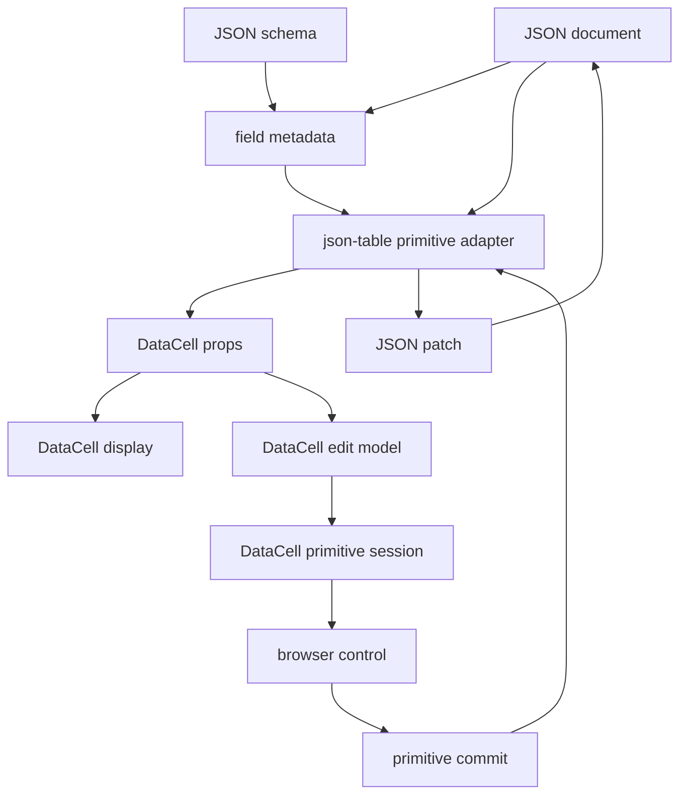
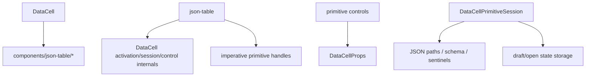
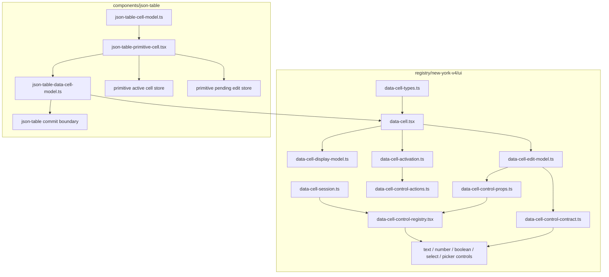

# DataCell JSON Table Bare-Metal Primitive Blueprint

## Verdict

Not yet.

The architecture is now pointed in the right direction:

- `DataCell` does not import `components/json-table/*`.
- json-table delegates enum, text, number, boolean, date, time, and date-time
  primitives to `DataCell`.
- the active primitive table path is
  `JsonTablePrimitiveCell -> createJsonTableDataCellProps -> DataCell`.
- `DataCell` owns the trompe-l'oeil display, activation, caret placement,
  popup lifecycle, blur policy, and primitive browser controls.
- json-table owns JSON projection, schema identity, active cell identity,
  optimistic primitive edits, and document commits.
- primitive controls receive a `DataCellPrimitiveSession`; they do not receive
  raw `onCommit` or `onEditingEnd`.
- public controlled state names are normalized at `createDataCellEditModel`;
  controls see internal `draft` and `openState` channels.
- public kind-specific commit handlers are normalized once into an internal
  `DataCellCommitHandler`; the registry no longer casts `model.onCommit`.

The remaining imperfection is surface area, not philosophy:

- json-table still has several primitive-adjacent files whose responsibilities
  are close enough that auditing the table side takes too long.
- `DataCellControlRegistry` still creates the session and renders controls in
  the same file. That is acceptable, but not crystalline.
- the public `DataCellProps` union is precise at the edge, but the internal
  commit boundary still needs runtime value-shape guards because one normalized
  session accepts the primitive commit union.

The target is not more abstraction. The target is fewer nouns.

```txt
json-table primitive adapter -> DataCell props
DataCell active primitive -> browser control session
```

Everything else must justify its existence.

## North Star

`DataCell` is the primitive illusion.

json-table is a JSON adapter.

There is no third system.

```txt
json-table:
  reads JSON and schema
  decides whether a field is primitive
  projects JSON/schema into DataCell props
  tracks which primitive cell is active
  commits DataCell values back into JSON

DataCell:
  displays an inert cell
  activates from pointer and keyboard
  mounts exactly one browser control when active
  owns draft/open/caret/popup/blur semantics
  emits primitive commits
  ends editing once
```

If a rule needs JSON path, schema identity, nullable enum identity, virtual row
identity, or document patching, it belongs to json-table.

If a rule would be expected from the same primitive outside a table, it belongs
to `DataCell`.

## Target Flow



Forbidden arrows:



## Pure Contracts

### Public DataCell Contract

The public contract is declarative props in, primitive events out.

```ts
type DataCellProps = {
  kind: DataCellKind
  value?: DataCellValue
  editable?: boolean
  active?: boolean
  disabled?: boolean
  name?: string
  autoFocus?: boolean
  className?: string
  onActiveChange?: (active: boolean) => void
  onCommit?: (value: DataCellCommitValue, meta: DataCellValueMeta) => void
  onEditingEnd?: () => void
}
```

Kind-specific props are allowed only when they describe primitive behavior:

- text, number, integer: placeholder, optional controlled draft.
- select: options, placeholder, formatter, optional controlled open.
- date, time, date-time: timezone, picker icon, formatter, optional controlled
  draft and open.
- boolean: checked value and commit.

The public contract must never expose:

- JSON paths.
- schemas.
- table row identity.
- activation requests.
- imperative handles.
- mode aliases.
- table-specific sentinel values.
- virtualization details.

### Internal DataCell Contract

The internal control contract is smaller than the public prop contract.

```ts
type DataCellPrimitiveControlProps = {
  shell: DataCellPrimitiveShell
  state?: DataCellPrimitiveState
  session: DataCellPrimitiveSession
}
```

The only allowed internal state channels are:

```ts
type DataCellPrimitiveState = {
  draft?: {
    value?: string
    onChange?: (value: string, meta: DataCellValueMeta) => void
  }
  open?: {
    value?: boolean
    onChange?: (open: boolean) => void
  }
}
```

Controls should never see public names like `draftValue`,
`onDraftValueChange`, `open`, or `onOpenChange`. Those names are edge
ergonomics, not internal architecture.

### Primitive Session Contract

The session owns lifecycle only.

```ts
type DataCellPrimitiveSession = {
  commit(
    value: DataCellCommitValue,
    meta: DataCellValueMeta,
    options?: {
      endEditing?: boolean
      markFinished?: boolean
      shouldCommit?: () => boolean
    }
  ): void
  cancel(): void
  end(options?: { markFinished?: boolean }): void
  reset(): void
}
```

The session must not own:

- draft value storage.
- select open state.
- date picker open state.
- display formatting.
- JSON conversion.
- active cell identity.

Lifecycle and browser state are adjacent, not identical.

### json-table Primitive Contract

json-table has one primitive adapter surface:

```ts
type JsonTablePrimitiveAdapterInput = {
  jsonValue: unknown
  fieldMetadata: FieldMetadata
  isActive: boolean
  isEditable: boolean
}

type JsonTablePrimitiveAdapterOutput = {
  dataCellProps: DataCellProps
  commitJsonValue(value: DataCellCommitValue, meta: DataCellValueMeta): void
}
```

The adapter owns:

- JSON value to primitive value.
- primitive kind selection.
- enum option construction.
- nullable enum display and commit identity.
- primitive commit value to JSON value.
- table class names for cell fit.
- active identity wiring.

The adapter must not own:

- select opening.
- popup dismissal.
- checkbox toggling mechanics.
- text caret placement.
- date input formatting while active.
- blur commit rules.
- first-key editing.

## Target Module Map



The dependency law:

```txt
json-table may import public DataCell and DataCell public types
DataCell may import no json-table code
primitive controls may import internal DataCell contracts only
```

## Remaining Blueprint

### 1. Compress json-table primitive files

Goal: one easy-to-audit table boundary.

Keep:

```txt
json-table-primitive-cell.tsx
  renders the primitive cell

json-table-data-cell-model.ts
  converts JSON/schema/table state into DataCell props

json-table-primitive-active-cell-store.ts
  owns active primitive identity

json-table-primitive-edit-store.ts
  owns optimistic primitive values
```

Merge or delete any helper that only forwards data between those modules
without changing ownership. The table side should read like a single sentence:

```txt
cell model chooses primitive -> primitive cell builds DataCell props ->
DataCell commits primitive value -> adapter writes JSON patch
```

### 2. Keep `DataCellControlRegistry` on probation

Current split:

```txt
data-cell-control-actions.ts
  display event + control state -> edit / command / none

data-cell-control-props.ts
  edit model -> internal control props

data-cell-control-registry.tsx
  create session and render selected control
```

This is acceptable now. It becomes ideal only if the registry remains tiny.

Allowed in the registry:

- create one `DataCellPrimitiveSession`.
- select the control by kind.
- pass already-built control props.

Forbidden in the registry:

- public prop normalization.
- action policy.
- JSON conversion.
- kind-specific behavior beyond choosing the control.
- `as` casts around `onCommit`.

If the registry grows again, split rendering into `data-cell-control.tsx` and
make `data-cell-control-registry.tsx` a pure map.

### 3. Keep commit normalization at the edit-model edge

The right compromise is:

```txt
public typed props -> createDataCellEditModel -> internal commit handler
```

The internal session is intentionally not generic. A generic session would
spread type plumbing into every control while adding no runtime behavior.

The edit-model edge must therefore keep the narrow runtime guards:

- text accepts `string | null`.
- number and integer accept `number | null`.
- boolean accepts `boolean`.
- select accepts `string | null`.
- date, time, and date-time accept `string | null`.

That is the only place where the primitive commit union may be narrowed.

### 4. Preserve trompe-l'oeil activation

Inactive `DataCell` is display only.

Hover should never mount a browser control. Hover can show affordance, but
mounting on hover would make accidental pointer movement mutate focus,
composition, popup state, and virtualized cell work.

The first intentional activation must carry intent:

- pointer activation gives text controls a caret coordinate.
- printable keyboard activation gives text controls first-key intent.
- checkbox activation toggles once.
- select activation opens once and does not close during the same gesture.
- picker activation opens once with display and active value identity aligned.

### 5. Delete compatibility vocabulary

No legacy aliases.

No table-specific enum editor.

No old primitive handoff module.

No wrapper component unless it owns a real behavior.

No prop name that means the same concept as another prop name.

## Interaction Invariants

These are the behaviors the architecture must make obvious:

- inactive cell renders display only.
- hover does not mount a browser control.
- first text click activates and places the caret at the clicked grapheme.
- first printable text key edits without replacing the whole value unless the
  key policy explicitly selects replacement.
- dirty text blur commits once.
- unchanged text blur ends once without a commit.
- Enter commits once.
- Escape cancels once.
- parent value echoes do not overwrite an active dirty draft.
- checkbox first click toggles once.
- checkbox keyboard Space toggles once.
- select first click opens the popup.
- select opening click does not immediately close the popup.
- select option click commits once.
- nullable enum commits the JSON value represented by the option, not just the
  label.
- date first click opens the picker and shows the same value identity as the
  display state.
- picker outside click follows the primitive end rule once.
- switching from dirty text to another primitive commits old text and preserves
  the new primitive's pointer intent.
- stale `onEditingEnd` from an old active cell cannot clear a newer active
  cell.
- virtualized unmount finishes the active primitive once.

## Architecture Guards

Tests should reject:

- `registry/new-york-v4/ui/data-cell*` importing `components/json-table/*`.
- `components/json-table/*` importing `data-cell-activation`,
  `data-cell-session`, `data-cell-control-*`, or primitive control files.
- primitive controls importing `DataCellProps`.
- primitive controls extending broad native React prop bags.
- internal control props containing `draftValue`, `onDraftValueChange`, `open`,
  or `onOpenChange`.
- primitive controls receiving raw `onCommit` or `onEditingEnd`.
- the registry casting `model.onCommit`.
- session types becoming generic again.
- text control containing local pointer blur timers.
- json-table primitive render files containing select, picker, caret, or blur
  mechanics.

Focused tests should also prove:

- `createDataCellEditModel` accepts correct commit values for each primitive
  kind.
- `createDataCellEditModel` rejects wrong-kind commit drift before public
  callbacks run.
- enum/select commits preserve JSON identity through the table adapter.

## Verification Gates

The blueprint is implemented only when these pass:

```bash
pnpm exec vitest --run tests/json-table-architecture.test.ts --reporter=dot
pnpm exec vitest --run tests/data-cell-edit-model.test.ts --reporter=dot
pnpm exec vitest --run tests/data-cell-control-lifecycle.test.tsx tests/data-cell-select-activation.test.tsx tests/data-cell-select-state.test.tsx tests/data-cell.test.tsx tests/json-table-data-cell-model.test.ts --reporter=dot
pnpm exec vitest run $(rg --files tests | rg 'json-table.*\.test\.(ts|tsx)$|data-cell.*\.test\.(ts|tsx)$') --reporter=dot
pnpm exec tsc --noEmit --pretty false --skipLibCheck --incremental false
node scripts/build-registry-items.mjs data-cell
pnpm verify:data-cell-registry
pnpm verify:data-cell
```

Current evidence from this worktree:

- `pnpm exec vitest --run tests/data-cell-edit-model.test.ts tests/json-table-architecture.test.ts --reporter=dot`
  passes: 2 files, 33 tests.
- `pnpm exec vitest --run tests/data-cell-edit-model.test.ts tests/data-cell-control-lifecycle.test.tsx tests/data-cell-select-activation.test.tsx tests/data-cell-select-state.test.tsx tests/data-cell.test.tsx tests/json-table-data-cell-model.test.ts --reporter=dot`
  passes: 6 files, 87 tests.
- `pnpm test:json-table -- --reporter=dot` passes: 20 files, 276 tests.
- `pnpm exec tsc --noEmit --pretty false --skipLibCheck --incremental false`
  passes.
- `node scripts/build-registry-items.mjs data-cell` passes.
- `pnpm verify:data-cell-registry` passes and proves
  `public/r/data-cell.json` is deterministic across scoped builds.
- `pnpm verify:data-cell` passes against
  `http://localhost:3100/docs/components/data-cell` for 8 demo rows.

## Definition Of Done

The component reaches the intended shape when a new reader can answer every
question from one boundary:

- "Why did this primitive display this value?" -> `DataCell`.
- "Why did this JSON value become this primitive value?" ->
  `json-table-data-cell-model.ts`.
- "Why did this commit become this patch?" -> json-table commit boundary.
- "Why did this click edit, command, or do nothing?" ->
  `data-cell-control-actions.ts`.
- "Why did this control receive these props?" -> `data-cell-control-props.ts`.
- "Why did editing end exactly once?" -> `DataCellPrimitiveSession`.

If a question needs two boundaries, the design is still too bloated.
