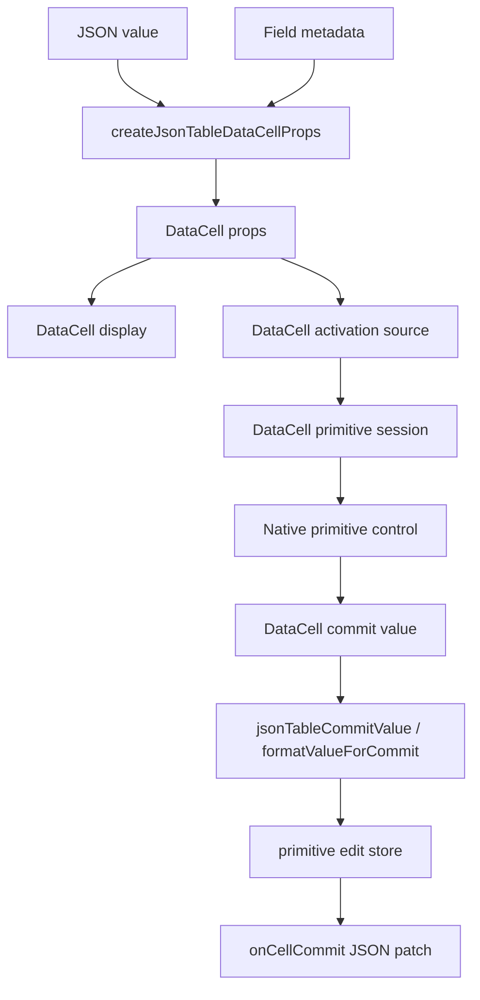
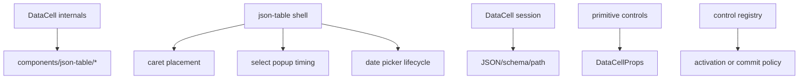

# DataCell JSON Table Bare-Metal Primitive Blueprint

## Verdict

Not yet.

The architecture is close to the right shape, but not at the platonic ideal.
The direction is correct:

- `DataCell` is the primitive trompe-l'oeil.
- json-table is the JSON/schema adapter.
- primitive browser behavior belongs to `DataCell`.
- JSON identity, table identity, optimistic table commits, and document patches
  belong to json-table.
- enum values now go through `DataCell` instead of a special table editor.
- `DataCell` imports no `components/json-table/*`.
- json-table calls one public primitive boundary:
  `createJsonTableDataCellProps`.
- hover does not mount controls.
- activation is intentional and carries pointer or keyboard intent.

The remaining problem is not a missing feature. It is excess surface area.
There are still enough nouns around primitive table editing that a reader has
to reconstruct ownership from several modules. The ideal version should feel
inevitable from the file names alone.

## Principle

There are only two systems:

```txt
DataCell   = primitive illusion and browser-control lifecycle
json-table = JSON/schema projection and table commit lifecycle
```

There is no third primitive interaction system.

If a rule would be true for a primitive cell outside a table, it belongs to
`DataCell`.

If a rule needs JSON path, schema metadata, enum identity, row identity,
virtualization, optimistic document state, or patch emission, it belongs to
json-table.

## Ideal Flow



Forbidden arrows:



## Ownership

### DataCell Owns

- inert display rendering.
- hover affordance without mounting controls.
- activation from pointer, keyboard, and programmatic focus.
- pointer caret placement for text.
- first-key text editing.
- checkbox first-click toggle semantics.
- select open, close, keyboard navigation, option commit, and popup dismissal.
- date/time picker open, close, display identity, and commit semantics.
- dirty draft protection while active.
- blur, Enter, Escape, cancel, and editing-end lifecycle.
- exactly-once primitive session finish.
- primitive accessibility roles and focus behavior.

### json-table Owns

- field path and cell identity.
- whether the field is primitive or structured.
- schema kind to `DataCell` kind projection.
- JSON value to primitive value projection.
- enum option construction.
- nullable enum sentinel mapping.
- object enum identity preservation.
- table class names needed for cell fit.
- active primitive cell identity.
- active-cell replacement across rows.
- optimistic primitive pending values.
- normalization before document commit.
- JSON patch emission.
- virtualization cleanup.

### No One Else Owns Primitive Editing

There must be no adapter, enum editor, shell handoff, wrapper component, or
imperative handle that owns part of primitive editing between those two
systems.

## Public Contract

`DataCell` takes declarative primitive props and emits primitive events.

```ts
type DataCellProps = {
  kind: DataCellKind
  value?: DataCellValue
  editable?: boolean
  active?: boolean
  disabled?: boolean
  name?: string
  autoFocus?: boolean
  className?: string
  onActiveChange?: (active: boolean) => void
  onCommit?: (value: DataCellCommitValue, meta: DataCellValueMeta) => void
  onEditingEnd?: () => void
}
```

Kind-specific props may describe primitive behavior only:

- text, number, integer: value, placeholder, optional draft control.
- select: options, placeholder, formatter, optional open control.
- date, time, date-time: formatting, picker affordance, optional open control.
- boolean: value and commit.

The public contract must never expose:

- JSON paths.
- schemas.
- row IDs.
- table active-cell objects.
- nullable enum sentinel details.
- virtualizer state.
- imperative editor handles.
- compatibility mode aliases.

## Internal DataCell Contract

Primitive controls receive one shell, one optional controlled-state object, and
one session.

```ts
type DataCellPrimitiveControlProps = {
  shell: DataCellPrimitiveShell
  state?: DataCellPrimitiveState
  session: DataCellPrimitiveSession
}

type DataCellPrimitiveState = {
  draft?: {
    value?: string
    onChange?: (value: string, meta: DataCellValueMeta) => void
  }
  open?: {
    value?: boolean
    onChange?: (open: boolean) => void
  }
}
```

Primitive controls must not receive:

- `DataCellProps`.
- raw `onCommit`.
- raw `onEditingEnd`.
- JSON names.
- schema names.
- table names.
- public controlled prop names such as `draftValue`, `onDraftValueChange`,
  `open`, or `onOpenChange`.

Public ergonomics are normalized once at the edit-model edge.

## Session Contract

The session owns lifecycle, not value storage.

```ts
type DataCellPrimitiveSession = {
  commit(
    value: DataCellCommitValue,
    meta: DataCellValueMeta,
    options?: {
      endEditing?: boolean
      markFinished?: boolean
      shouldCommit?: () => boolean
    }
  ): void
  cancel(): void
  end(options?: { markFinished?: boolean }): void
  reset(): void
}
```

The session must not own:

- text draft state.
- popup open state.
- display formatting.
- JSON conversion.
- active table identity.
- table commit dispatch.

## json-table Primitive Contract

json-table has one projection function:

```ts
createJsonTableDataCellProps(input): DataCellProps
```

The input can include JSON value, field metadata, active state, editable state,
and table callbacks. The output is direct `DataCellProps`.

There should be no intermediate exported model:

```txt
createJsonTableDataCellModel
JsonTableDataCellModel
JsonTableSelectDataCellModel
JsonTableBooleanDataCellModel
JsonTableNumberDataCellModel
JsonTableTextDataCellModel
jsonTableDataCellPropsForModel
```

Those names describe an adapter layer that does not deserve independent life.
The table projects straight into `DataCell` props.

Required adapter names:

```txt
createJsonTableDataCellProps
jsonTableDataCellCommitHandler
jsonTableDataCellJsonCommitHandler
toJsonValue
```

Required primitive-control names:

```txt
effectiveValue
commitValue
setActive
commitValidatedValue
```

Forbidden local control aliases:

```txt
primitiveEffectiveValue
commitPrimitiveValue
commitPrimitiveValueChange
setPrimitiveActive
```

The table active-cell store may still use `setPrimitiveActiveCell`; that names
table identity, not the local DataCell control surface.

## Module Map


Dependency law:

```txt
json-table may import DataCell public entrypoints.
DataCell may import no json-table code.
primitive controls may import internal DataCell contracts only.
the control registry may only map kind -> control component.
```

## Current Shape To Preserve

Keep these hard-won simplifications:

- no `json-table-display-cell.tsx`.
- no `json-table-data-cell.tsx` wrapper.
- no `json-table-primitive-active-cell-replacement.ts`.
- no `use-json-table-primitive-cell-controller.ts`.
- no table-specific enum editor.
- no `JsonTablePrimitiveControl` type alias. The hook return shape is the
  contract.
- no `JsonTableEditableCellModel` or local disabled/primitive/structured/display
  cell-model union aliases.
- no `json-table-cell-model.ts`. `useJsonTableEditableCellModel` owns the
  disabled, primitive, structured-active, and display render model directly.
- no `JsonTablePrimitiveCellProps` or `JsonTableStructuredActiveCellProps`
  aliases. Component props are inline at the component boundary and inferred
  directly where child props are stored.
- `useJsonTableEditableCellModel` is the editable-cell model boundary.
- `json-table-data-cell-model.ts` branches directly from schema primitive kind
  to `DataCellProps`.
- `json-table-data-cell-model.ts` uses short local names for adapter-local
  ideas: `SharedDataCellProps`, `CommitJsonValue`, `JsonCommitValue`, and
  `TextDataCellKind`.
- `use-elevated-virtual-row.ts` accepts one table-owned boolean:
  `isElevated`. It does not know about input focus, select popup state, or
  picker popup state.
- select keeps nullable enum sentinel mapping inside json-table.
- date/time/date-time picker props are emitted only for picker cells.
- text cells do not receive picker-only props.

## Remaining Simplification Target

The next improvement is to make the json-table primitive side read as one
sentence:

```txt
cell field -> primitive control -> cell model -> DataCell props -> JSON commit
```

Every table primitive module must justify itself:

- `use-json-table-editable-cell-model.ts` composes hooks.
- `use-json-table-editable-cell-model.ts` chooses disabled, primitive,
  structured-active, or display rendering.
- `use-json-table-primitive-control.ts` owns effective value, commit, and active
  identity switching.
- `json-table-data-cell-model.ts` owns JSON/schema to `DataCellProps`.
- `json-table-primitive-active-cell-store.ts` owns active-cell replacement.
- `json-table-primitive-edit-store.ts` owns optimistic primitive values.

If a module only renames data, delete it.

If a type is only needed by one file, keep it local.

If a public export exists only to make another table file compile, prefer
inference or direct call-site types.

## Interaction Invariants

The architecture is only valid if these behaviors fall out naturally:

- inactive cell renders display only.
- hover never mounts a browser control.
- first text click activates and places the caret at the clicked grapheme.
- first printable text key edits according to explicit first-key policy.
- typing after pointer activation inserts at the caret, not by replacing the
  whole value.
- dirty text blur commits once.
- unchanged text blur ends once without commit.
- Enter commits once.
- Escape cancels once.
- parent value echoes do not overwrite an active dirty draft.
- checkbox first click toggles once.
- checkbox keyboard Space toggles once.
- select first click opens the popup.
- select opening click does not immediately close the popup.
- select option click commits once.
- nullable enum commits JSON `null`, not the sentinel label.
- object enum commits the original enum object identity.
- unknown enum values remain selectable/displayable without corrupting JSON.
- date display text and active picker value represent the same JSON identity.
- picker outside click follows the primitive end rule once.
- switching from dirty text to another primitive commits old text and preserves
  the new primitive's pointer intent.
- stale `onEditingEnd` from an old active cell cannot clear a newer active
  cell.
- virtualized unmount finishes the active primitive once.

## Architecture Guards

Tests must reject:

- `registry/new-york-v4/ui/data-cell*` importing `components/json-table/*`.
- primitive controls importing `DataCellProps`.
- primitive controls importing json-table modules.
- primitive controls extending broad native React prop bags.
- primitive controls receiving raw `onCommit` or `onEditingEnd`.
- internal control props containing public names:
  `draftValue`, `onDraftValueChange`, `open`, `onOpenChange`.
- `data-cell-control-registry.tsx` creating sessions or normalizing props.
- `data-cell-control-registry.tsx` casting commit handlers.
- generic `DataCellPrimitiveSession`.
- json-table shell files containing select, picker, caret, or blur mechanics.
- `json-table-data-cell-model.ts` exporting an intermediate model type.
- `use-json-table-primitive-control.ts` defining `JsonTablePrimitiveControl`.
- `json-table-cell-model.ts` returning as a separate single-use model module.
- `use-json-table-editable-cell-model.ts` defining `JsonTableEditableCellModel`
  or local variant aliases such as `PrimitiveJsonTableCellModel`.
- `JsonTablePrimitiveCellProps` or `JsonTableStructuredActiveCellProps`
  aliases returning in primitive render files or the cell model.
- `use-elevated-virtual-row.ts` accepting fake primitive lifecycle state such
  as `isInputFocused` or `isSelectOpen`.
- `json-table-data-cell-model.ts` keeping overqualified local adapter names
  such as `JsonTableDataCellSharedProps`,
  `JsonTableDataCellCommitHandler`, `JsonTableTextDataCellKind`, or
  `JsonTableDataCellJsonCommitValue`.

Tests must prove:

- each schema primitive projects to the exact `DataCell` kind.
- enum options preserve original JSON identity.
- nullable enum sentinel commits JSON `null`.
- date/time commits normalize back to JSON values.
- structured fallback values project through text without a special editor.
- wrong-kind DataCell commits are rejected before public callbacks.
- select activation opens once and does not close during the same gesture.
- text pointer activation preserves caret position through the first character.
- table primitive pending values survive parent document echoes while active.
- stale edit endings cannot clear a newer active primitive cell.

## Verification Gates

The blueprint is implemented only when these pass:

```bash
pnpm exec vitest --run tests/json-table-architecture.test.ts --reporter=dot
pnpm exec vitest --run tests/json-table-data-cell-model.test.ts --reporter=dot
pnpm exec vitest --run tests/data-cell-edit-model.test.ts tests/data-cell-control-lifecycle.test.tsx tests/data-cell-select-activation.test.tsx tests/data-cell-select-state.test.tsx tests/data-cell.test.tsx --reporter=dot
pnpm test:json-table -- --reporter=dot
node scripts/build-registry-items.mjs data-cell
pnpm verify:data-cell
pnpm verify:data-cell-registry
pnpm exec tsc --noEmit --pretty false --skipLibCheck --incremental false
```

Current worktree evidence:

- `pnpm exec vitest --run tests/json-table-architecture.test.ts tests/json-table-data-cell-model.test.ts --reporter=dot`
  passes: 2 files, 43 tests.
- `pnpm exec vitest --run tests/data-cell-edit-model.test.ts tests/data-cell-control-lifecycle.test.tsx tests/data-cell-select-activation.test.tsx tests/data-cell-select-state.test.tsx tests/data-cell.test.tsx --reporter=dot`
  passes: 5 files, 76 tests.
- `pnpm test:json-table -- --reporter=dot` passes: 23 files, 297 tests.
- `node scripts/build-registry-items.mjs data-cell` has passed.
- `pnpm verify:data-cell` has passed against
  `http://localhost:3100/docs/components/data-cell`.
- `pnpm exec tsc --noEmit --pretty false --skipLibCheck --incremental false`
  has no DataCell/json-table errors after this pass. It is still not a clean
  repo-wide signal because unrelated file-system worktree changes fail at
  `registry/new-york-v4/ui/file-system-controls.tsx`: `selection` is missing
  from `FileSystemBrowserState`.
- `pnpm verify:data-cell-registry` is currently blocked before DataCell
  determinism by an unrelated `file-system` registry preflight missing-file
  error.

## Definition Of Done

The ideal has been reached only when a new reader can answer each question from
one file boundary:

- "Why did this primitive display this value?" -> `DataCell`.
- "Why did this JSON value become this primitive value?" ->
  `json-table-data-cell-model.ts`.
- "Why did this primitive value become this JSON commit?" ->
  `json-table-data-cell-model.ts` plus the JSON commit boundary.
- "Why did this click edit, command, or do nothing?" ->
  `data-cell-control-actions.ts`.
- "Why did this control receive these props?" -> `data-cell-control-props.ts`.
- "Why did editing end exactly once?" -> `data-cell-session.ts`.
- "Why is this table cell active?" ->
  `json-table-primitive-active-cell-store.ts`.
- "Why does this cell show a pending value?" ->
  `json-table-primitive-edit-store.ts`.

If the answer needs two ownership systems for one primitive behavior, the
architecture is still bloated.

If a name must explain that it is "primitive", "cell", "data", and "table" all
at once, it probably belongs at a boundary. Inside a boundary, shorter names
should be enough.

The platonic version is not the version with the most tests or the most
helpers. It is the version where the tests feel unsurprising because the
ownership is too clear to accidentally violate.
