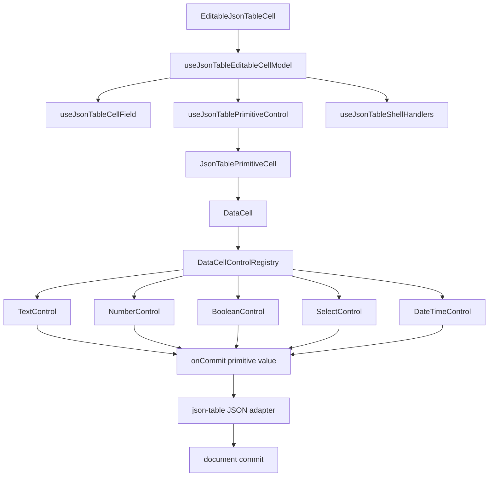

# DataCell and JSON Table Control Contract Blueprint

## Verdict

Not yet platonic.

The current architecture is materially cleaner than the old enum-specialized
table path:

- `json-table` no longer owns enum editing.
- `DataCell` is the primitive editing boundary.
- text caret placement is handled inside the primitive cell surface.
- enum values preserve JSON identity through the table adapter.
- date, select, boolean, text, and number interactions are covered by tests.

The remaining impurity is now smaller and sharper: `DataCell` still knows too
many control-specific lifecycle details, and select still relies on a tiny
timing compromise to survive browser event ordering.

This blueprint describes the next architecture: a minimal control contract that
keeps `DataCell` as the trompe-l'oeil while making each primitive control own
its own lifecycle completely.

## One-Sentence Target

`DataCell` should be a tiny shell that owns activation, display, focus framing,
and commit routing; each primitive control should own exactly one lifecycle
behind a shared contract.

## Bare-Bones Mandate

The next implementation must reduce code and reduce meanings.

Allowed:

- introduce one shared primitive control contract
- move kind-specific lifecycle code out of `data-cell.tsx`
- keep direct `DataCell` activation as the normal path
- keep one shell fallback in `json-table`
- keep JSON identity adaptation in `json-table`
- keep control-specific rendering in small control modules
- keep tests at the user-interaction level

Forbidden:

- add another table-owned enum path
- add table-owned select open state
- add table-owned date picker state
- add table-owned caret placement
- add feature flags for old and new paths
- add compatibility wrappers
- add activation retries
- add control-specific table branches
- add broad timers as lifecycle glue
- make `DataCell` know JSON paths, rows, columns, or schema traversal

The desired diff should make the system feel more obvious:

```txt
less branching in data-cell.tsx
less lifecycle code in json-table
one activation vocabulary
one control lifecycle vocabulary
one commit vocabulary
same public behavior
stronger interaction tests
```

## First Principles

### DataCell Is The Trompe-L'oeil

`DataCell` is not just an input wrapper. It is the illusion boundary.

It owns:

- the inert display surface
- the active editing frame
- first pointer activation
- keyboard activation
- focus framing
- editor handle registration
- commit/cancel/finish routing

It does not own:

- JSON identity
- table row identity
- schema traversal
- virtualization
- enum value normalization
- structured object/array editing

### Primitive Controls Own Primitive Semantics

Each control owns the browser mechanics that make it real:

- text owns drafts and caret placement
- number owns drafts and numeric parsing display
- boolean owns toggle command semantics
- select owns open, close, option focus, and option commit
- date/time owns picker open, close, and date/time commit

`DataCell` should not contain deep branches for these mechanics. It should
select the control and pass the same lifecycle hooks to it.

### JSON Table Owns JSON Meaning

`json-table` stays outside the illusion. It owns:

- document projection
- field identity
- active primitive identity
- structured edit identity
- schema metadata
- JSON value adaptation
- virtualization and row elevation
- table shell focus

The table should not know whether select opens on pointerdown, click, focus, or
keyboard. That is primitive control behavior.

## The Target Contract

Every primitive control should receive the same minimal contract:

```ts
type DataCellControlContext<Value> = {
  value: Value
  displayValue: string
  isActive: boolean
  isDisabled: boolean
  activationIntent: DataCellActivationIntent | undefined
  onCommit: (value: Value) => void
  onCancel: () => void
  onFinish: () => void
  registerEditor: (handle: DataCellEditorHandle | null) => void
}
```

Every control should implement the same lifecycle:

```ts
type DataCellControlAdapter<Value> = {
  renderDisplay: (context: DataCellControlContext<Value>) => React.ReactNode
  renderEditor: (context: DataCellControlContext<Value>) => React.ReactNode
  activate: (intent: DataCellActivationIntent) => DataCellActivationRequest
}
```

The exact TypeScript shape can be smaller if the implementation shows a more
direct path. The architectural requirement is the same: `DataCell` should call
one uniform control lifecycle and avoid knowing control internals.

## Desired Event Flow

### Text Click

```txt
pointerdown on DataCell text display
  -> DataCell captures the activation intent
  -> text control maps pointer x to grapheme offset
  -> DataCell renders text editor
  -> text control focuses input at that offset
  -> user types
  -> text control edits draft
  -> blur or Enter commits
  -> DataCell calls table commit adapter
```

No table code sees caret coordinates.

### Select Click

```txt
click on DataCell select display
  -> DataCell captures the activation intent
  -> select control opens itself
  -> option pointer/focus events stay inside select control
  -> option commit emits the original primitive value
  -> DataCell calls table commit adapter
  -> json-table writes JSON identity
```

No table code sees select open state.

### Boolean Click

```txt
pointerdown on DataCell boolean display
  -> boolean control treats activation as command
  -> boolean control commits toggled value
  -> no draft session is created
```

Boolean remains a command, not a fake editor.

### Date Click

```txt
pointerdown or click on DataCell date display
  -> date control opens picker
  -> date control owns overlay lifecycle
  -> picker selection commits typed primitive date value
  -> cancel closes without commit
```

No table code owns picker timing.

## Layer Diagram



## Module Shape

```txt
registry/new-york-v4/ui/
  data-cell.tsx
    shell, activation, focus frame, control selection, commit routing

  data-cell-control-contract.ts
    shared lifecycle types and editor handle vocabulary

  data-cell-control-registry.ts
    maps DataCell kind to one control adapter

  data-cell-text-control.tsx
    text display, editor, draft, caret, blur/Enter/Escape

  data-cell-number-control.tsx
    number display, editor, draft, parse/commit

  data-cell-boolean-control.tsx
    boolean display and command commit

  data-cell-select-control.tsx
    select display, open/close, option focus, option commit

  data-cell-date-control.tsx
    date display, picker lifecycle, date commit

  data-cell-text-hit-test.ts
    measured grapheme offset only

components/json-table/
  editable-json-table-cell.tsx
    table cell router only

  json-table-primitive-cell.tsx
    JSON field metadata to DataCell props

  use-json-table-primitive-control.ts
    active primitive identity and JSON commit adapter

  use-json-table-shell-handlers.ts
    shell-only fallback activation and grid keyboard handling
```

File count is not the goal. Responsibility count is the goal. If a proposed
file has no independent responsibility, it should not exist.

## DataCell Responsibilities After The Cut

`DataCell` owns:

- choosing the control adapter from `kind`
- deciding whether a direct pointer/key event activates the cell
- storing the current activation intent
- switching between display and editor
- passing a stable control context
- calling `onCommit`, `onCancel`, and `onFinish`
- exposing one editor handle to the parent
- rendering the shared focus/edit frame

`DataCell` does not own:

- select close timing
- date picker lifecycle
- text selection restoration
- number parsing details
- boolean toggle semantics
- JSON identity
- table active-cell routing

## JSON Table Responsibilities After The Cut

`json-table` owns:

- deciding whether a projected field is primitive or structured
- adapting JSON values into primitive `DataCell` values
- adapting committed primitive values back into JSON
- preserving enum option identity
- maintaining active primitive cell identity
- handling virtualization unmount finish/cancel
- forwarding shell fallback activation when a click misses `DataCell`

`json-table` does not own:

- Radix select event ordering
- text caret offsets
- input drafts
- overlay open state
- primitive control internals

## The Select Timing Problem

The current select implementation still has a small close delay. That delay is
not catastrophic, but it is the clearest proof that lifecycle causality is not
fully explicit.

The pure model should replace timer-based survival with ownership-based
survival:

```txt
activation click belongs to DataCell
select opens from that activation
the activation event is marked as owned
outside-dismiss logic ignores the owned activation event
subsequent outside events dismiss normally
```

The important difference is conceptual:

- bad: "stay open for 24ms because the browser event tail might close us"
- good: "this exact activation event opened the select, so it cannot also
  dismiss the select"

If the UI library makes exact event identity impossible, one tiny localized
delay may remain acceptable. But the blueprint target is explicit activation
ownership, not time-based repair.

## Interaction Checklist

The implementation is not done until these hold in browser tests:

- first click on text display mounts input and places caret at clicked grapheme
- first click in already mounted text input moves caret natively
- printable key on inactive text cell replaces the value by design
- typing after pointer activation inserts at the pointer caret
- blur commits dirty text once
- Enter commits dirty text once
- Escape cancels dirty text
- virtualization unmount commits dirty text to the original row only
- first click on enum opens options
- enum option click commits original JSON identity
- Escape closes enum without commit
- outside click closes enum without commit
- repeated enum open/close cycles do not leak active sessions
- boolean click toggles exactly once
- Space on boolean toggles exactly once
- date click opens picker on first interaction
- date selection commits once
- date Escape closes without commit
- switching from text to enum commits text before enum selection
- switching from enum to text closes enum and opens text editor
- shell click outside `DataCell` can activate generically
- direct click inside `DataCell` never needs the table shell to repair it

## Deletion Checklist

Before adding any new code, search for removable coordination:

- table enum editor code
- select-specific table activation branches
- table-owned select timers
- table-owned picker timers
- stale activation retry logic
- duplicate draft state outside controls
- control behavior inside `data-cell.tsx`
- comments explaining event-ordering mysteries that should be encoded as state

If a line exists only to compensate for unclear ownership, either move ownership
or delete the line.

## Implementation Plan

1. Introduce the shared control contract with the current behavior unchanged.
2. Move text lifecycle behind the contract first because it has the hardest
   caret behavior.
3. Move boolean behind the contract as a command adapter.
4. Move select behind the contract and remove any table-specific assumptions.
5. Move date/time behind the contract.
6. Compress `data-cell.tsx` until it reads as shell plus lifecycle router.
7. Replace timer-based select survival with activation-event ownership if the
   UI library allows it.
8. Keep the JSON-table adapter unchanged except for deleting any now-dead
   primitive lifecycle code.
9. Strengthen architecture tests so table-owned primitive behavior cannot
   return.
10. Run the focused DataCell tests, the full JSON-table suite, and browser
    caret/select interaction tests.

## Non-Goals

- no structured object/array rewrite
- no table virtualization rewrite
- no new public DataCell API unless the contract proves it is necessary
- no compatibility layer for old enum editing
- no generic plugin system for controls
- no abstraction for hypothetical future controls

This is not a framework. It is a tiny internal lifecycle vocabulary.

## Success Criteria

The architecture has reached the next level of purity when:

- `data-cell.tsx` contains no deep kind-specific lifecycle branches
- every primitive control has exactly one owner module
- `json-table` contains no primitive editor mechanics
- select opens on first click without table help
- text caret placement is stable without table help
- the only remaining shell path is generic grid fallback
- tests describe user behavior, not implementation timing
- deleting any module would remove exactly one coherent responsibility

At that point the component will still not be metaphysically perfect. But it
will be the cleanest defensible form: everything needed, nothing ornamental,
and no duplicated ownership.
