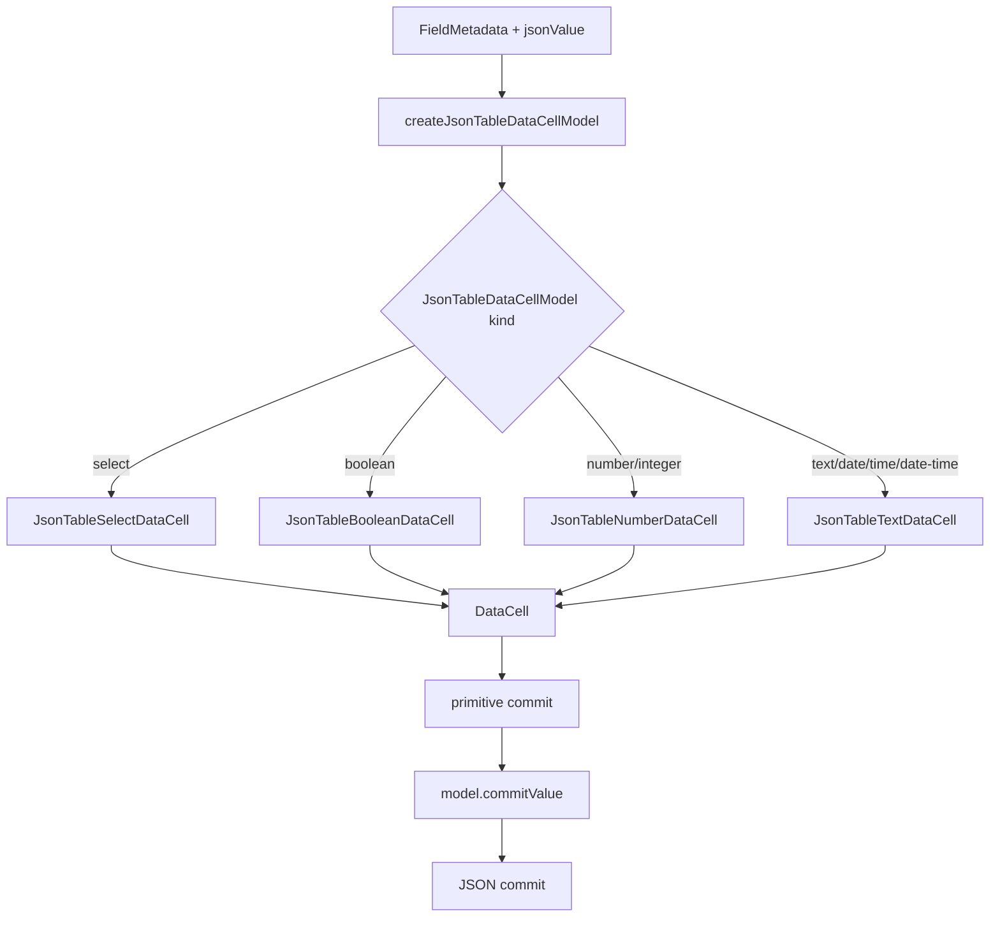
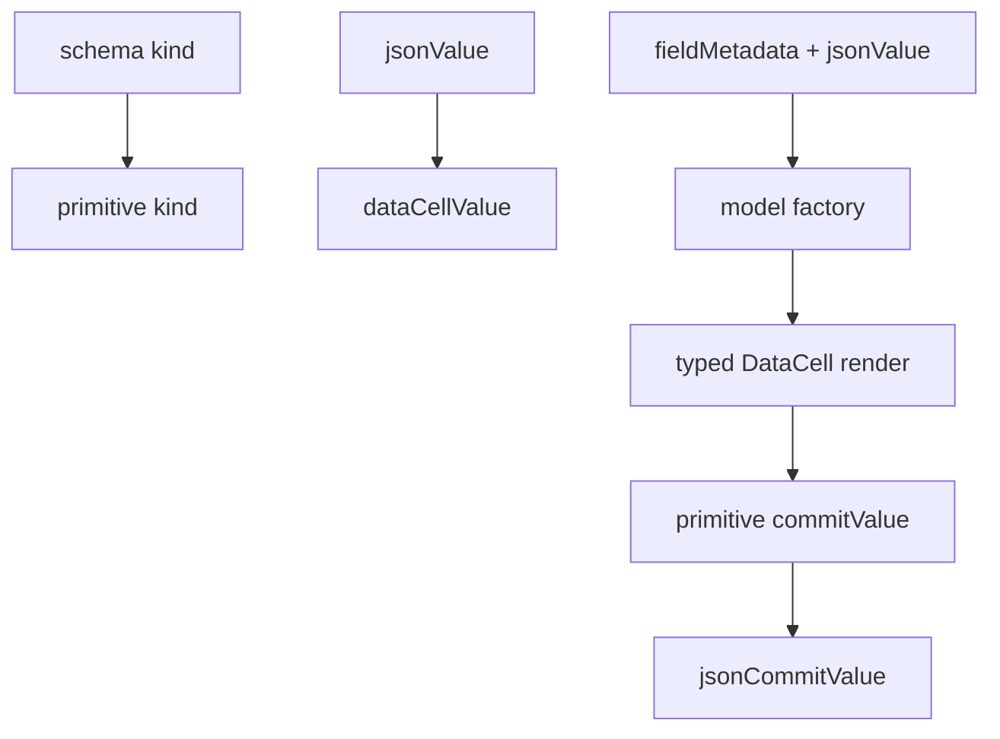

# DataCell and JSON Table Final Aesthetic Compression Blueprint

## Verdict

Not yet platonic.

The component is now strong in the ways that matter most:

- `DataCell` is the primitive trompe-l'oeil.
- `json-table` delegates primitive editing to `DataCell`.
- enum editing is just `DataCell` select with table-owned JSON identity.
- overlay opening policy is centralized in `data-cell-activation.ts`.
- the JSON-table adapter is a discriminated union aligned with `DataCellProps`.
- `JsonTableDataCell` renders without `as DataCellProps`.
- interaction, browser, parity, registry, and adapter tests cover the important
  behavior.

The remaining imperfection is aesthetic compression:

> the system is correct and modular, but a few files still require too much
> reading before their inevitability is obvious.

The next pass should not change behavior. It should make the current design
read like the only possible design.

## One-Sentence Target

Compress the DataCell/JSON-table boundary until each file reads as a short chain
of unavoidable transformations, with exact names and no low-information glue.

## What Is Already Ideal Enough

Do not reopen these decisions unless new evidence appears:

- `DataCell` owns primitive display/edit illusion.
- `json-table` owns schema and JSON value meaning.
- select/date/text/boolean behavior belongs inside primitive controls.
- enum JSON identity belongs in the table adapter.
- overlay event-tail survival belongs in `data-cell-activation.ts`.
- `JsonTableDataCellModel` should stay discriminated.
- browser interaction tests are the right proof for caret/select regressions.

This is not a rewrite blueprint. It is a compression blueprint.

## Current Shape



This shape is good. The imperfections are local:

- `json-table-data-cell-model.ts` is dense.
- names are improved, but not perfectly symmetrical.
- model factories return the right things, but the file does not yet visually
  separate projection, model construction, and commit reconstruction.
- `json-table-display-cell.tsx` has small branch components whose names repeat
  the model names but mostly differ only by commit type.
- read-only primitive rendering still lives next to editable `DataCell`
  rendering, even though it has a different responsibility.
- registry rebuild remains a manual discipline rather than a locally enforced
  invariant.

## Ideal Shape



Each transformation should be named after its domain:

- schema projection
- JSON value projection
- model construction
- primitive rendering
- JSON commit reconstruction

No file should make the reader infer which domain a generic `value` belongs to.

## Target File Shape

### `json-table-data-cell-model.ts`

This file should read in four blocks:

```txt
types
  JsonTableDataCellModel union
  branch model types
  format callback types

public projection
  primitiveKindForField
  getJsonTableCellDisplayValue
  createJsonTableDataCellModel

model factories
  selectDataCellModel
  numberDataCellModel
  booleanDataCellModel
  textDataCellModel
  fallbackTextDataCellModel

private value helpers
  jsonValueText
  selectOptionValue
  jsonValuesEqual
  dataCellNumberValue
  dataCellTextValue
  dateDisplayText
  jsonCommitValue
```

The order matters. A reader should see the contract before implementation
details.

### `json-table-display-cell.tsx`

This file should own rendering only:

- read-only primitive display rendering
- editable/display `DataCell` rendering
- typed commit bridging from model to table

It should not own:

- enum sentinels
- date/time normalization
- JSON value equality
- schema kind projection details

If read-only rendering keeps growing, extract:

```txt
json-table-read-only-primitive-cell.tsx
```

Do not extract it merely for tidiness. Extract only if it lowers the cognitive
load of `json-table-display-cell.tsx`.

### `data-cell-activation.ts`

This file is already the right home for browser event ugliness. The remaining
question is readability:

- exported types first
- source constructors second
- React hooks third
- token internals last
- browser event-tail helpers at the very bottom

Do not hide the event-tail rules behind clever names. The browser behavior is
ugly; the code should be explicit and contained.

## Naming Rules

Use these exact concept names:

- `fieldMetadata`: schema-derived metadata for one field
- `jsonValue`: original document value
- `dataCellValue`: value passed to `DataCell`
- `commitValue`: primitive value returned by `DataCell`
- `jsonCommitValue`: document value after table adaptation
- `selectOptionValue`: string value used by select
- `nullSelectOptionValue`: table-local nullable enum sentinel
- `dateDisplayText`: user-facing localized date label

Avoid:

- `value` inside helpers that touch both JSON and primitive domains
- `nextValue` unless it is local to a UI event handler
- `enumValue` for select option identities
- `dataCellKind` when the meaning is schema projection; use `primitiveKind`
- abbreviations that save characters but lose domain information

## Compression Rules

Compress only when the result is easier to prove.

Allowed:

- rename helpers for domain precision
- reorder functions into contract-first reading order
- merge helpers that only forward one parameter
- split helpers when they separate JSON projection from commit reconstruction
- replace repeated JSX wrappers with one typed helper only if TypeScript remains
  exact without casts

Forbidden:

- reintroduce `as DataCellProps`
- reintroduce `as never`
- add a generic renderer that erases the discriminated model
- move enum sentinel logic into rendering
- split files merely to make files shorter
- add compatibility aliases for old helper names
- change interaction behavior during this pass

## Candidate Refinements

### 1. Rename Adapter Helpers

Current names are serviceable. Better names would make the domains clearer:

- `enumModel` -> `selectDataCellModel`
- `numberModel` -> `numberDataCellModel`
- `booleanModel` -> `booleanDataCellModel`
- `stringModel` -> `textDataCellModel`
- `fallbackTextModel` -> `fallbackTextDataCellModel`
- `enumOptionValue` -> `selectOptionValue`
- `JSON_TABLE_NULL_SELECT_VALUE` -> `JSON_TABLE_NULL_SELECT_OPTION_VALUE`
- `dateDisplayValue` -> `dateDisplayText`
- `primitiveJsonValue` -> `jsonPrimitiveTextValue`

Do this only as a hard cutover. No aliases.

### 2. Make Display Projection Parallel To Edit Projection

`getJsonTableCellDisplayValue` and `createJsonTableDataCellModel` should feel
like siblings:

```txt
display:
  fieldMetadata + jsonValue -> display text

edit:
  fieldMetadata + jsonValue -> DataCell model
```

The two functions should share naming and branch order:

- select
- number/integer
- boolean
- text/date/time/date-time
- fallback text

This symmetry helps readers see that display and edit are two projections of
the same table meaning.

### 3. Reduce Renderer Repetition Without Losing Type Precision

The renderer currently has one component per model branch. That is acceptable.

Potential improvement:

```ts
function commitJsonTableDataCellValue(model, onCommit) {
  return (commitValue, meta) => onCommit?.(model.commitValue(commitValue), meta)
}
```

Only keep such a helper if TypeScript preserves the exact commit type per branch
without casts. If the helper needs `as never`, do not add it.

### 4. Strengthen Architecture Tests

The current architecture tests forbid the important old paths. Add final
readability invariants:

- `json-table-display-cell.tsx` contains no `JSON_TABLE_` sentinel names
- `json-table-display-cell.tsx` contains no `dateStringToFormat`
- `json-table-display-cell.tsx` contains no `parseDateStringAsLocal`
- `json-table-display-cell.tsx` contains no `areJsonValuesEqual`
- `json-table-data-cell-model.ts` contains the five branch factory names
- `json-table-data-cell-model.ts` contains no compatibility helper aliases

Architecture tests should enforce boundaries, not line-by-line taste.

## Tests

No new behavior tests should be necessary unless a behavior changes. This pass
should preserve the existing gates:

- adapter tests
- architecture tests
- focused DataCell/json-table interactions
- full JSON-table suite
- DataCell parity
- Playwright caret/select lab

Add test cases only if a rename or compression uncovers missing proof for a
specific domain transformation.

## Verification Gates

Required:

- `pnpm exec vitest run tests/json-table-data-cell-model.test.ts tests/json-table-architecture.test.ts --reporter=dot`
- focused DataCell/json-table interaction batch
- full JSON-table suite
- `pnpm exec tsc --noEmit --pretty false --skipLibCheck`
- `pnpm run verify:data-cell`
- `pnpm exec playwright test e2e/data-cell-caret.spec.ts`
- registry build and validation for `data-cell`
- `git diff --check`

If repo-wide TypeScript fails, the final answer must identify whether the
failure is inside or outside the DataCell/json-table boundary. Do not call the
repository platonic while TypeScript is red.

## Non-Goals

- no interaction rewrite
- no new component API
- no new DataCell mode
- no enum editor path
- no overlay lifecycle rewrite
- no virtualization rewrite
- no registry tooling rewrite
- no broad schema-editor cleanup unless it blocks TypeScript proof

## Completion Criteria

The pass is complete when:

- `json-table-data-cell-model.ts` reads contract-first and domain-first
- helper names distinguish JSON values, DataCell values, and commit values
- display projection and edit projection use symmetrical branch order
- `json-table-display-cell.tsx` contains rendering only
- architecture tests enforce the boundary without overfitting implementation
- all verification gates are green

At that point the DataCell/json-table boundary can reasonably be called
near-platonic. Absolute platonic status still depends on repo-wide green
TypeScript, generated artifact discipline, and continued resistance to adding
special table-owned primitive paths.
