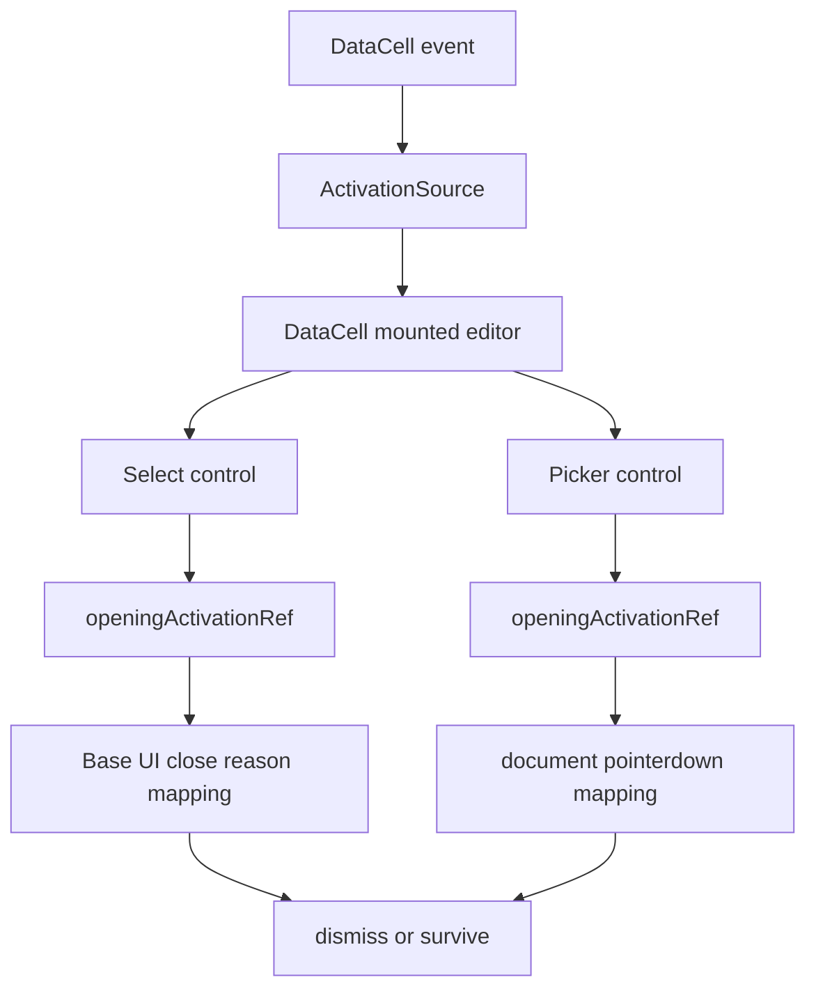
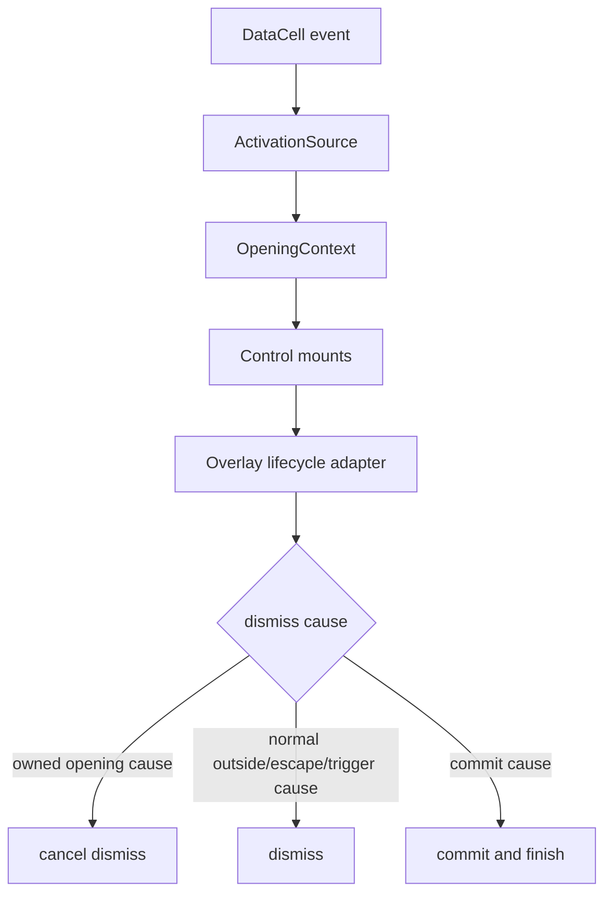

# DataCell and JSON Table Final Platonic Gap Blueprint

## Verdict

Not yet platonic.

The previous cut reached the main architectural goal:

- `DataCell` is the primitive trompe-l'oeil shell.
- `json-table` delegates primitive behavior to `DataCell`.
- primitive controls use `ActivationSource`, `ActivationToken`, and
  `ControlAction`.
- select and date/time no longer use select-specific or picker-specific
  timers.
- old primitive activation names are test-forbidden.

The remaining gap is smaller and more subtle. It is not "table owns too much"
anymore. It is:

> overlay controls still translate messy browser and library lifecycle details
> locally instead of receiving one perfectly normalized opening contract.

The current system is good. The ideal system would make the remaining ugly DOM
facts explicit once, then let controls consume a tiny, exact lifecycle API.

## One-Sentence Target

Compress activation ownership and overlay lifecycle into one normalized
`OpeningContext`, then make select and date/time differ only in rendering and
commit semantics.

## Current Shape



This is cleaner than before, but it still duplicates the same abstract idea:

- hold the opening activation
- let the opening event tail finish
- ignore only dismissals caused by that opening
- release as soon as the interaction becomes normal
- dismiss normally after that

Select and picker express that rule differently. That is the remaining impurity.

## Ideal Shape



The control should not reason about raw event tails. It should ask a small
domain object:

```ts
openingContext.shouldCancelDismiss(cause)
openingContext.release()
```

## Final Vocabulary

Keep:

- `ActivationSource`: where activation came from.
- `ActivationToken`: event ownership primitive.
- `ControlAction`: adapter result.
- `Commit`: value leaves a control.
- `Dismiss`: edit session ends without value commit.

Add:

- `OpeningContext`: mounted-editor opening lifecycle.
- `DismissCause`: normalized reason an editor is trying to close.

Remove from control code:

- direct `eventType` branching
- direct calls to `token.ownsEvent(undefined)`
- control-local opening survival policy
- duplicated `openingActivationRef` patterns
- select-only opening reason translation
- picker-only opening reason translation

`eventType` may remain inside the activation module if needed, but it should not
leak into select or picker.

## Target Types

```ts
type DataCellOpeningContext = {
  source: DataCellActivationSource | undefined
  isOpening: boolean
  shouldCancelDismiss: (cause: DataCellDismissCause) => boolean
  release: () => void
}

type DataCellDismissCause =
  | {
      kind: "outside-pointer"
      event: PointerEvent
    }
  | {
      kind: "trigger-press"
      event?: Event
    }
  | {
      kind: "focus-out"
      event?: Event
    }
  | {
      kind: "cancel-open"
      event?: Event
    }
  | {
      kind: "escape"
      event: KeyboardEvent
    }
  | {
      kind: "unknown"
      event?: Event
    }
```

The exact TypeScript can differ. The important point is that select and picker
use the same close vocabulary.

## Ownership Boundaries

### `data-cell-activation.ts`

Owns:

- token creation
- opening event tail ownership
- eventless opening dismissals
- shell click versus shell pointerdown release policy
- release on a new non-owned pointer
- normalized `OpeningContext`
- normalized `DismissCause`

Does not own:

- select options
- calendar rendering
- value commit
- popup positioning

### `DataCell`

Owns:

- creating activation sources
- applying control actions
- passing the activation source to mounted controls

Does not own:

- overlay close survival
- dismiss-cause translation
- select or date details

### Overlay Controls

Own:

- rendering trigger and popup
- committing selected values
- positioning if custom
- translating library callbacks into `DismissCause`

Do not own:

- deciding how long an opening event is protected
- knowing whether shell click should release after a microtask
- calling `token.ownsEvent(undefined)` directly
- duplicating opening refs

### `json-table`

No change.

It already has the right responsibility:

- active primitive identity
- shell activation source
- JSON value normalization
- structured editor sessions

It should remain blind to select, date, caret, and overlay mechanics.

## Ideal Select Control

Current select still has too much knowledge:

- Base UI close reasons are mapped inside select.
- shell-click microtask release is chosen inside select.
- eventless opening dismissal is checked inside select.

Target select:

```txt
mount
  -> opening = useDataCellOpeningContext(activationSource)
  -> focus trigger
  -> open popup

onOpenChange(false, details)
  -> cause = selectDismissCause(details)
  -> if opening.shouldCancelDismiss(cause): cancel
  -> else dismiss

onValueChange(value)
  -> opening.release()
  -> commit
  -> finish
```

Select is allowed to know Base UI reason names only in `selectDismissCause`.
It should not know token policy.

## Ideal Picker Control

Current picker is better, but it still mirrors select manually.

Target picker:

```txt
mount
  -> opening = useDataCellOpeningContext(activationSource)
  -> position popup
  -> open popup

document pointerdown
  -> cause = outsidePointerDismissCause(event)
  -> if opening.shouldCancelDismiss(cause): return
  -> if inside trigger or popup: return
  -> dismiss

trigger click
  -> cause = triggerPressDismissCause(event)
  -> if opening.shouldCancelDismiss(cause): return
  -> toggle popup

Escape
  -> dismiss
```

Picker can own geometry. It should not own activation survival semantics.

## Native Input Ideal

Text and number are already close.

The remaining ideal would be:

- one shared input lifecycle helper for initial draft, finish, cancel, and
  unmount commit
- text-only caret placement remains in text control
- number-only grammar remains in number adapter

Do not create this helper unless it reduces code. The current input path is
acceptable because it is direct and native.

## DataCell Shell Ideal

`DataCell` is close, but a final polish pass should make it read as a protocol:

```txt
display mode:
  direct event -> ControlAction -> command/edit/none

edit mode:
  render control with activation source

editing end:
  clear activation source
  deactivate
```

Potential final refinements:

- make `applyControlAction` accept `DataCellControlAction` directly, not
  `ReturnType<typeof getDataCellPointerControlAction>`
- rename `didActivateBeforeClickRef` to `openingClickTailRef` or move it into
  activation dispatch if that shortens the shell
- ensure no display component destructures ignored primitive props it does not
  need

These are polish items, not architecture blockers.

## Registry Ideal

The registry is acceptable, but not perfect because source and packed artifacts
must both be kept in sync.

Target:

- architecture test confirms every DataCell runtime file in the source manifest
  appears in the built registry artifact
- generated artifact includes `data-cell-activation.ts`
- generated artifact contains no forbidden old primitive vocabulary

## Type Gate Ideal

The component cannot be called perfectly integrated while repo-wide TypeScript is
red.

Current blocker:

- unrelated `email-viewer.tsx` errors for `normalizedMimeType`

Target:

- repo-wide `pnpm exec tsc --noEmit --pretty false --skipLibCheck` passes
- if unrelated areas are dirty, the final audit must still document them, but
  the ideal repository state is green

## Implementation Plan

1. Add `DataCellDismissCause` and `DataCellOpeningContext`.
   - place them in `data-cell-activation.ts`
   - keep all token ownership policy there
   - keep release policy there

2. Add a small hook or function for mounted controls.
   - likely `useDataCellOpeningContext(activationSource)`
   - no control-specific imports
   - no React state unless needed

3. Convert select.
   - keep Base UI reason translation local
   - remove direct token calls
   - remove direct `eventType` checks
   - replace `openingActivationRef` with opening context

4. Convert picker.
   - translate document pointer and trigger click to `DismissCause`
   - remove direct token calls
   - replace `openingActivationRef` with opening context

5. Tighten architecture tests.
   - forbid `token.ownsEvent` outside `data-cell-activation.ts`
   - forbid `eventType` outside `data-cell-activation.ts`
   - forbid `openingActivationRef` in select and picker
   - keep existing no-timer checks

6. Polish `DataCell`.
   - direct `DataCellControlAction` type in `applyControlAction`
   - consider renaming click-tail ref if it clarifies the protocol
   - do not add abstraction unless it shortens or clarifies the file

7. Verify.
   - focused DataCell tests
   - full JSON-table tests
   - browser caret/select tests
   - DataCell parity verification
   - one-item registry validation
   - repo-wide TypeScript once unrelated errors are fixed

## Interaction Checklist

Must remain true:

- first select click opens options
- complete browser click sequence keeps options open
- abandoned pointerdown outside does not leave dropdown open
- Escape closes select without commit
- outside pointer closes select without commit
- option click commits once
- repeated open/close cycles do not double commit
- shell click opens select without double click
- date click opens picker
- opening date click does not immediately close picker
- trigger click after opening toggles picker normally
- outside pointer closes picker
- Escape closes picker
- text pointer activation lands native caret at target offset
- typing after text pointer activation inserts at target offset
- printable key activation still replaces intentionally
- boolean pointer and Space toggle once

## Architecture Checklist

The final system should satisfy:

- no old primitive activation vocabulary in runtime code
- no close timers in select or picker
- no `token.ownsEvent` calls outside `data-cell-activation.ts`
- no `eventType` checks outside `data-cell-activation.ts`
- no `openingActivationRef` in select or picker
- no select/date/text-hit-test imports inside `json-table`
- no `props.kind ===` branches in `data-cell.tsx`
- DataCell registry artifact includes every runtime module

## Non-Goals

- no rewrite of Base UI select
- no replacement of the calendar component
- no table virtualization rewrite
- no structured JSON editor rewrite
- no generic plugin system
- no compatibility props
- no broad form library

## Completion Criteria

We can call the next pass complete when:

- select and picker consume the same `OpeningContext`
- token policy is centralized in `data-cell-activation.ts`
- controls translate dismiss causes but do not own opening survival policy
- architecture tests forbid the new leak points
- all current DataCell and JSON-table interaction tests pass
- browser caret/select tests pass
- DataCell parity passes
- registry validation passes
- repo-wide TypeScript is green or the only blocker is explicitly unrelated and
  already documented

Only then would the component be close to the platonic ideal. The final form is
not zero complexity; browser interactions are inherently complex. The ideal is
that every piece of complexity has exactly one name, one owner, and one reason
to exist.
