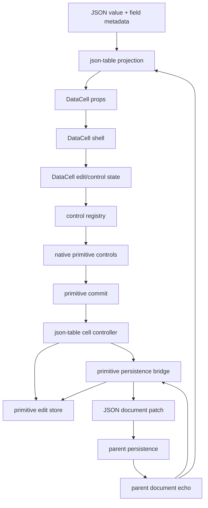
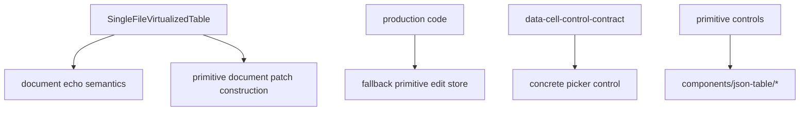

# DataCell JSON Table Final Primitive Ownership Blueprint

## Verdict

Implemented as the current ownership baseline.

The architecture is now close enough that the remaining question is no longer
"who owns primitive state?" but "can overlay browser work be reduced without
making the primitive less native?"

`DataCell` is now the right primitive: it owns the trompe-l'oeil surface, native
control activation, exact kind-specific controls, and primitive commits. The
table no longer needs a special enum editor path, and primitive controls no
longer import `components/json-table/*`.

The ownership impurity this blueprint targeted was primitive edit lifecycle
visibility across too many places:

- a mixed `useCellController` committed primitive values into the edit store
  and also had a structured document-data fallback.
- `SingleFileVirtualizedTable` also knows how to write primitive values into
  the edit store during document patching.
- `json-table-primitive-edit-store.ts` exposes a module-level fallback store.
- `SingleFileVirtualizedTable` still owns document echo bookkeeping.
- `DataCellControlContract` imports concrete control prop types from control
  implementations.

Those ownership issues are now removed. Primitive ownership is visible from file
boundaries alone.

## Implemented Evidence

- `components/json-table/use-cell-controller.ts` is deleted.
- `useJsonTablePrimitiveCellController` is the only primitive local commit
  writer.
- `useJsonTableStructuredCellController` owns structured object/array document
  commits and does not import primitive edit-store types.
- `SingleFileVirtualizedTable` contains no primitive echo, patch construction,
  `commitValue`, or `onUpdateDocument` vocabulary.
- `fallbackJsonTablePrimitiveEditStore` is deleted.
- `data-cell-control-contract.ts` owns the exact primitive control prop types
  and imports no concrete control implementation.
- `tests/json-table-architecture.test.ts` guards every ownership boundary above.

## One-Sentence Target

`DataCell` owns primitive interaction, `json-table` owns JSON projection and
document persistence, and exactly one bridge connects a primitive commit to a
JSON document patch.

## First Principles

### A Primitive Commit Is Not A Document Patch

A primitive commit is small:

```txt
field path + primitive value + previous primitive value
```

A document patch is larger:

```txt
table document + materialized path + JSON replacement + parent persistence
```

The architecture becomes muddy when one component handles both. The primitive
edit store should know primitive commit lifecycle. The persistence bridge should
know document patching. The virtualized table should know neither beyond
passing callbacks through rows.

### The Virtualized Table Is A Viewport

`SingleFileVirtualizedTable` should own:

- row and header rendering
- virtualization
- row height and sticky header mechanics
- structured edit session placement
- active primitive cell store wiring

It should not own:

- primitive edit-store fallback creation
- primitive document echo marking
- primitive reconciliation semantics
- document patch construction for scalar commits

When viewport code also owns persistence, every interaction bug becomes harder
to reason about because display, virtualization, local echo, and parent data
flow share one file.

### The Store Has One Owner

A module-level fallback store is convenient but structurally wrong. It means a
missing owner silently becomes shared mutable state.

The perfect system makes store ownership explicit:

```txt
SingleFileTableView
  creates PrimitiveEditStore
  creates PrimitivePersistenceBridge
  passes store + bridge down
```

Tests may create a store directly. Production code should not recover from a
missing store by using hidden global state.

### Control Contracts Should Be Type-Only Boundaries

`data-cell-control-contract.ts` should define the abstract primitive control
contract. It should not import prop types from concrete control components.

The current shape is workable but inverted:

```txt
contract -> imports DataCellPickerControlProps from picker control
```

The ideal shape is:

```txt
contract -> defines DataCellPickerControlProps
picker control -> imports DataCellPickerControlProps from contract
registry -> maps edit models to contract props
```

That keeps the contract as the stable center and the controls as leaves.

## Ideal Layer Graph



Forbidden edges:



## Target Responsibilities

### `DataCell`

Owns primitive illusion and native behavior:

- inactive display surface
- hover/click/focus activation
- caret hit testing for text
- checkbox toggle command
- select open command
- picker open command
- exact control mounting
- primitive commit callback

Does not own:

- JSON enum identity
- nullable sentinel values
- schema metadata
- document path patching
- table row identity

### `json-table-data-cell-model.ts`

Owns JSON-to-primitive projection:

- field metadata inspection
- primitive kind selection
- display value creation
- edit value creation
- enum option creation
- nullable enum sentinel handling
- JSON commit value reconstruction

Does not own:

- control activation
- overlay lifecycle
- table focus shell behavior
- virtualization

### `useCellController`

Owns the local primitive commit boundary:

- receives primitive value from `DataCell`
- validates and normalizes through table field logic
- commits exactly once to `JsonTablePrimitiveEditStore`
- sends a primitive commit object to the persistence bridge

Does not own:

- document echo reconciliation
- fallback store creation
- document patch construction details

### `JsonTablePrimitiveEditStore`

Owns local primitive lifecycle:

- `idle`
- `pending`
- `confirmed`
- `stale`
- subscription by field path
- reconciliation against authoritative document data

Does not own:

- hidden fallback instances
- React component placement
- document patching
- parent persistence callbacks

### Primitive Persistence Bridge

Owns document persistence for primitive commits:

- tracks latest parent document data
- builds one JSON patch for one primitive commit
- marks document echoes caused by primitive commits
- reconciles new parent data into the primitive edit store
- exposes a narrow `persistPrimitiveCommit` function

Does not own:

- virtual row rendering
- primitive activation
- field display formatting
- native input behavior

### `SingleFileVirtualizedTable`

Owns viewport mechanics only:

- headers
- rows
- virtualizer sizing
- row rendering props
- active structured editor placement
- passing explicit primitive dependencies to rows

Does not own:

- `recordDocumentEcho`
- `reconcileDocumentData`
- `commitValue`
- hidden primitive store fallback
- document patch construction for scalar cells

## Target Types

### Primitive Commit

```ts
type JsonTablePrimitiveCommit = {
  fieldPath: string
  value: unknown
  previousValue: unknown
}
```

This is not a document patch. It is the exact value leaving a primitive cell.

### Persistence Bridge

```ts
type JsonTablePrimitivePersistenceBridge = {
  persistPrimitiveCommit: (commit: JsonTablePrimitiveCommit) => void
  reconcilePrimitiveDocumentData: (data: Record<string, unknown>) => void
}
```

The bridge receives a commit that already entered local primitive state. It must
not call `commitValue`.

### Explicit Primitive Dependencies

```ts
type JsonTablePrimitiveRuntime = {
  activeCellStore: JsonTablePrimitiveActiveCellStore
  editStore: JsonTablePrimitiveEditStore
  persistPrimitiveCommit: (commit: JsonTablePrimitiveCommit) => void
}
```

Rows and cells should receive this explicit runtime object or its individual
fields. No production component should make one up.

### DataCell Control Contract

Control props should move into `data-cell-control-contract.ts`:

```txt
data-cell-control-contract.ts
  DataCellControlPropsByKind
  DataCellTextControlProps
  DataCellNumberControlProps
  DataCellBooleanControlProps
  DataCellSelectControlProps
  DataCellPickerControlProps
  DataCellControlAdapter
  DataCellControlAction
```

Concrete controls then become leaves:

```txt
data-cell-text-control.tsx
  imports DataCellTextControlProps

data-cell-picker-control.tsx
  imports DataCellPickerControlProps
```

The contract must not import a concrete control file.

## Implementation Plan

### Phase 1. Make Primitive Store Ownership Explicit

1. Delete `fallbackJsonTablePrimitiveEditStore`.
2. Make `JsonTablePrimitiveEditStore` required anywhere production code reads
   primitive snapshots.
3. Create stores explicitly in tests that mount isolated cells.
4. Add an architecture test forbidding the fallback name.

Success criteria:

```bash
rg "fallbackJsonTablePrimitiveEditStore" components registry tests
```

returns no matches.

### Phase 2. Make Primitive Commit Ownership Singular

1. Introduce `JsonTablePrimitiveCommit`.
2. Let `useJsonTablePrimitiveCellController` be the only production path that
   calls `editStore.commitValue` for primitive user commits.
3. Make document persistence accept an already-local primitive commit.
4. Remove `commitValue` calls from `SingleFileVirtualizedTable`.
5. Add a focused test proving one user commit causes one local store commit and
   one parent document update.

Success criteria:

```bash
rg "commitValue\\(" components/json-table
```

shows the store implementation, structured editors where appropriate, and one
primitive user-commit writer.

### Phase 3. Extract Primitive Persistence Bridge

1. Create `useJsonTablePrimitivePersistenceBridge`.
2. Move document-data refs, document echo marking, and primitive reconciliation
   out of `SingleFileVirtualizedTable`.
3. Pass `persistPrimitiveCommit` down through the cell runtime.
4. Keep row rendering unaware of whether parent persistence is immediate,
   delayed, or echoed.
5. Add an architecture test forbidding echo vocabulary in
   `single-file-virtualized-table.tsx`.

Success criteria:

```bash
rg "recordDocumentEcho|reconcileDocumentData|commitValue" components/json-table/single-file-virtualized-table.tsx
```

returns no matches.

### Phase 4. Invert The DataCell Control Contract Dependency

1. Move exact control prop types from concrete control files into
   `data-cell-control-contract.ts`.
2. Keep concrete controls as implementations of those contract types.
3. Keep `DataCellControlAdapter` in the contract file.
4. Keep `data-cell-control-registry.tsx` as the only runtime dispatcher.
5. Add an architecture test forbidding contract imports from concrete control
   files.

Success criteria:

```bash
rg "from .+data-cell-.+-control" registry/new-york-v4/ui/data-cell-control-contract.ts
```

returns no matches.

### Phase 5. Compress Dispatch Without Losing Type Proof

The current registry repeats kind narrowing for render, pointer, click, and key
activation. That repetition is acceptable if TypeScript needs it, but it should
be audited after the ownership fixes.

Only compress it if the result is both shorter and more type-exact. Do not add
casts or generic cleverness to remove visible branches.

Acceptable final states:

- one explicit branch per action, if that is the clearest type proof
- one typed adapter accessor, if it avoids casts and repetition

Forbidden final states:

- `as never`
- `as DataCellControlAdapter`
- broad `DataCellKind` casts that hide correlation
- adapter maps that make control props less exact

### Phase 6. Re-Prove Interaction And Performance

Run the existing interaction suite after every phase that touches DataCell or
primitive persistence:

```bash
pnpm exec vitest run tests/data-cell.test.tsx tests/json-table-boolean-enum-interactions.test.tsx tests/json-table-text-number-interactions.test.tsx tests/json-table-picker-interactions.test.tsx --reporter=dot
```

Run the architecture and generated registry checks before calling the pass done:

```bash
pnpm exec vitest run tests/json-table-architecture.test.ts --reporter=dot
pnpm exec shadcn build registry.json --output public/r
```

Run profiler checks after the ownership work, not before:

```bash
PROFILE_URL=http://localhost:3100/json-table-profile pnpm profile:json-table-primitives
```

Profiler invariants:

- hover does not rerender the table
- scalar commit renders only the target primitive path
- enum/select open does not trigger parent table churn
- browser overlay costs are measured separately from React render costs

## Architecture Tests To Add Or Keep

The architecture should be guarded by direct string-level tests because these
boundaries are structural:

- primitive controls do not import `components/json-table/*`
- `DataCell` does not import `components/json-table/*`
- `json-table` imports `DataCell`, not the other way around
- `data-cell-control-contract.ts` does not import concrete controls
- `single-file-virtualized-table.tsx` does not call primitive edit-store commit
- `single-file-virtualized-table.tsx` does not contain document echo vocabulary
- production code does not reference a primitive edit-store fallback
- generated `public/r/data-cell.json` includes every DataCell runtime file

## Naming Rules

Use these words exactly:

- `commit`: primitive value entered local edit state
- `persist`: primitive commit became a document patch request
- `documentEcho`: parent document data returning after persistence
- `reconcile`: compare authoritative parent data with local primitive state
- `snapshot`: path-scoped primitive edit-store state
- `patch`: JSON document mutation, never primitive local lifecycle
- `controlState`: inactive activation facts
- `editModel`: mounted primitive control facts
- `controlProps`: exact props passed to a native control

Avoid these words in new code:

- `optimistic` for primitive lifecycle
- `fallback` for production primitive stores
- `enum editor`
- `scalar cell`
- `data cell model` when the value is specifically JSON-table projection or
  DataCell primitive edit state

## Definition Of Done

The pass is complete only when these questions have one obvious answer:

1. Who owns native text caret placement?
2. Who owns select open and close timing?
3. Who owns JSON enum identity?
4. Who owns local primitive commit state?
5. Who turns a primitive commit into a document patch?
6. Who marks a parent document as a primitive document echo?
7. Who reconciles parent document data with pending primitive state?
8. Who renders virtual rows?

Target answers:

1. `DataCellTextControl`
2. `DataCellSelectControl`
3. `json-table-data-cell-model.ts`
4. `JsonTablePrimitiveEditStore`
5. `useJsonTablePrimitivePersistenceBridge`
6. `useJsonTablePrimitivePersistenceBridge`
7. `useJsonTablePrimitivePersistenceBridge` plus `JsonTablePrimitiveEditStore`
8. `SingleFileVirtualizedTable`

If any answer still includes "also `SingleFileVirtualizedTable`" for primitive
persistence, or "hidden fallback store", the component has not reached the
platonic ideal.

## Final Platonic Claim

After this blueprint is implemented, the architecture can plausibly be called
platonic only if the code reads as a chain of small, irreversible translations:

```txt
JSON value
  -> JSON-table primitive projection
  -> DataCell primitive props
  -> DataCell edit model
  -> exact native control props
  -> primitive commit
  -> primitive edit-store snapshot
  -> primitive persistence bridge
  -> JSON document patch
  -> parent document echo
  -> primitive reconciliation
```

Every arrow must have one owner. Every owner must have one reason to exist. No
owner should know facts from two non-adjacent arrows.
