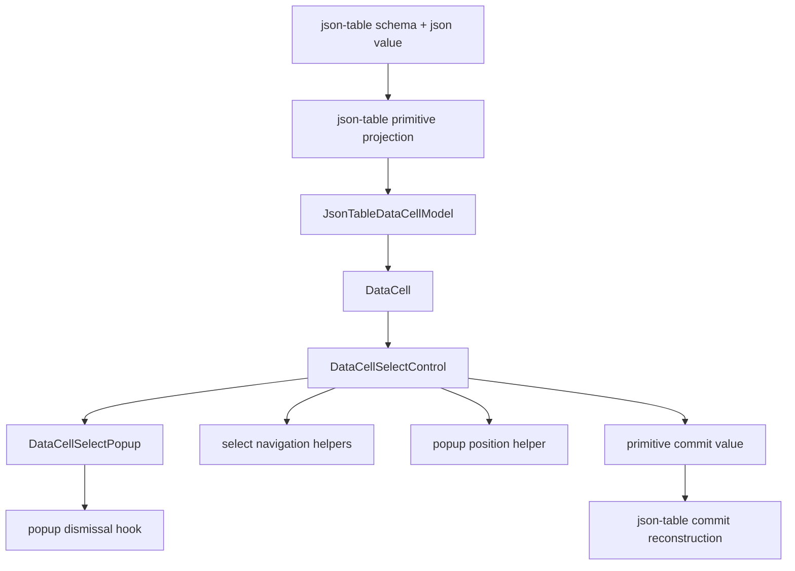
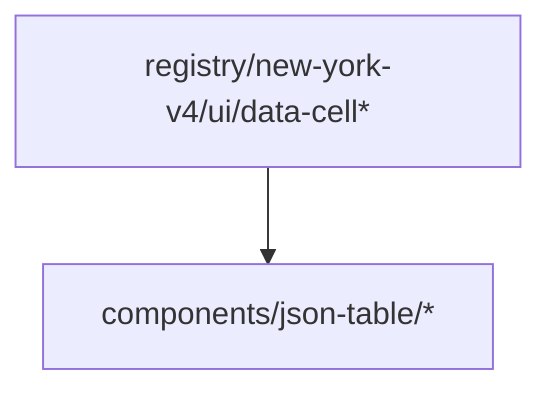

# DataCell and JSON Table Final Select Proof Blueprint

## Verdict

Not platonic yet.

The major dependency-direction bug has been fixed:

```txt
json-table -> DataCell
```

`DataCell` no longer depends on `components/json-table/*`. That is the right
direction. The primitive is no longer importing one of its consumers.

But that only proves ownership. It does not prove purity.

The remaining imperfection is that the DataCell select implementation still has
too many browser concerns compressed into the popup/control pair:

- opening state
- active option state
- selected option lookup
- popup positioning
- outside pointer dismissal
- resize and scroll dismissal
- listbox rendering
- keyboard navigation
- primitive commit
- activation-event survival

Some of that belongs in `DataCellSelectControl`. Some belongs in
`DataCellSelectPopup`. Some does not belong in either file.

The next pass should make the dependency graph correct and the internal shape
inevitable.

## Target

Reach this architecture:

```txt
DataCell is the trompe-l'oeil primitive.
JSON table is a projection and commit adapter.
Select popup mechanics are generic DataCell internals.
Every hard browser rule has one small owner.
Every owner is independently testable.
```

The target is not more abstraction. The target is fewer mixed responsibilities.
Split only where a rule becomes clearer, smaller, and easier to prove.

## Desired Dependency Graph



Forbidden graph:



## Layer Contracts

### DataCell Primitive

Owns the trompe-l'oeil.

Allowed responsibilities:

- render the visible cell surface
- activate from pointer and keyboard input
- mount the correct primitive control
- expose primitive values only
- commit primitive values only
- preserve native-feeling text caret behavior
- own generic picker/select popup mechanics

Forbidden responsibilities:

- JSON identity preservation
- nullable enum sentinel behavior
- schema inspection
- table row or column identity
- table virtualization
- table edit sessions
- imports from `components/json-table/*`

### JSON Table Adapter

Owns projection and reconstruction.

Allowed responsibilities:

- read schema metadata
- project JSON values into DataCell primitive values
- project enum values into primitive select options
- preserve JSON identity for enum commits
- handle nullable sentinel semantics
- reconstruct JSON commit values
- coordinate table selection, focus, and virtualization

Forbidden responsibilities:

- popup rendering
- popup positioning
- select keyboard navigation
- outside pointer listeners
- DataCell internal activation policy
- table-specific select popup components

### DataCell Select Control

Owns the combobox shell.

Allowed responsibilities:

- trigger button
- open and close state
- selected option lookup
- active descendant id
- keyboard event routing
- calling `onCommit`
- calling `onEditingEnd`
- connecting popup callbacks
- activation-event survival through the opening click

Should delegate:

- option index navigation
- popup position calculation
- outside pointer and viewport dismissal
- option list rendering

Forbidden responsibilities:

- JSON-table imports
- JSON/schema naming
- enum naming
- sentinel naming
- JSON value reconstruction

### DataCell Select Popup

Owns popup composition only.

Allowed responsibilities:

- portal
- listbox root
- option list rendering
- mouse hover active option update
- option click commit
- wiring dismissal hook

Should delegate:

- position math
- outside pointer listener setup
- resize/scroll listener setup
- option index navigation

Forbidden responsibilities:

- reading anchor geometry
- computing viewport placement inline
- owning keyboard policy
- knowing JSON-table, schema, enum, or sentinel concepts

## Proposed File Shape

### `registry/new-york-v4/ui/data-cell-select-control.tsx`

The combobox shell.

It should read as:

```txt
props -> selected option -> open state -> active option -> primitive commit
```

It may call:

- `selectedDataCellSelectOptionIndex`
- `nextEnabledDataCellSelectOptionIndex`
- `firstEnabledDataCellSelectOptionIndex`
- `lastEnabledDataCellSelectOptionIndex`
- `getDataCellSelectPopupPosition`
- `DataCellSelectPopup`

It should not define those mechanics inline.

### `registry/new-york-v4/ui/data-cell-select-popup.tsx`

The portal and listbox renderer.

It should contain JSX, not policy.

It receives a precomputed `position`. It does not call
`getBoundingClientRect()`. It does not read `window.innerWidth`. It does not
contain navigation helpers.

### `registry/new-york-v4/ui/data-cell-select-popup-position.ts`

Pure geometry.

Exports:

- `DataCellSelectPopupPosition`
- `getDataCellSelectPopupPosition`

Input:

```txt
anchor rect + viewport size
```

Output:

```txt
left + top + width + maxHeight
```

Rules:

- no React
- no `document`
- no direct DOM reads
- no JSON-table words
- pure function tests

### `registry/new-york-v4/ui/data-cell-select-popup-dismissal.ts`

Browser listener ownership.

Exports:

- `useDataCellSelectPopupDismissal`

Rules:

- outside pointer closes
- pointer inside anchor does not close
- pointer inside popup does not close
- resize closes
- scroll outside popup closes
- scroll inside popup does not close
- no option selection logic
- no JSON-table words

### `registry/new-york-v4/ui/data-cell-select-navigation.ts`

Pure option index navigation.

Exports:

- `firstEnabledDataCellSelectOptionIndex`
- `lastEnabledDataCellSelectOptionIndex`
- `nextEnabledDataCellSelectOptionIndex`
- `selectedDataCellSelectOptionIndex`

Rules:

- disabled options are skipped
- empty arrays return `-1`
- wraparound behavior is preserved
- selected disabled options fall back to the first enabled option
- no React
- no DOM
- pure function tests

### `components/json-table/json-table-select-options.ts`

JSON-table enum projection.

Allowed:

- enum option extraction
- nullable sentinel value
- JSON value equality
- primitive select option labels and values

Forbidden:

- popup
- position
- keyboard
- pointer events
- `document`
- `window`

This is the only place where table enum identity should exist.

### `components/json-table/json-table-commit-value.ts`

JSON-table primitive commit reconstruction.

Allowed:

- convert primitive values back into table commit values
- map select sentinel values back to JSON null
- preserve original enum JSON identity

Forbidden:

- popup
- keyboard
- pointer events
- DataCell rendering

## Naming Rules

Use one word per concept.

```txt
primitive value       DataCell value
json value            table source value
commit value          value emitted upward
option                primitive select option
active option index   keyboard/listbox focus index
selected value        current primitive select value
anchor                trigger element
popup                 portaled listbox
```

Avoid mixed names:

```txt
enum popup
json option
table select popup
schema option
cell enum control
```

If a file lives under `registry/new-york-v4/ui/data-cell*`, it should not need
the words `json`, `schema`, `enum`, `sentinel`, or `JsonTable`.

## Test Blueprint

### Architecture Tests

Strengthen `tests/json-table-architecture.test.ts` to enforce:

- no DataCell runtime file imports `components/json-table`
- no DataCell runtime file contains `JsonTable`
- no DataCell select primitive file contains `Enum`
- no DataCell select primitive file contains `jsonValue`
- no DataCell select primitive file contains `fieldMetadata`
- no DataCell select primitive file contains `sentinel`
- no JSON-table select projection file contains `document`
- no JSON-table select projection file contains `window`
- no JSON-table commit file contains popup/browser words

### Pure Function Tests

Add focused tests for:

- option navigation
- selected option fallback
- popup position below anchor
- popup position above anchor
- viewport clamping
- minimum popup height

These tests should not render React.

### Interaction Tests

Keep the current integration coverage, but make the expected contract explicit:

- click editable enum cell opens select
- click option commits once
- pressing Enter commits active option
- pressing Escape closes without commit
- ArrowUp and ArrowDown skip disabled options
- Home selects first enabled option
- End selects last enabled option
- outside pointer closes without stealing the opening click
- scroll inside popup does not close
- scroll outside popup closes
- virtualization does not erase the active cell during popup interaction

### Determinism Tests

The full JSON-table suite must pass in the broad command, not only as isolated
files.

Failure mode to eliminate:

```txt
test passes alone
test fails when batched
virtual rows render empty
editable cell selector is missing
```

Likely fixes:

- make DOM setup idempotent
- avoid replacing `window`/`document` when jsdom already exists
- restore geometry mocks
- clean portals between tests
- reset timers and queued tasks
- isolate virtualizer measurements per test file

## Implementation Plan

1. Move select navigation helpers out of `data-cell-select-popup.tsx`.

2. Move popup position math out of `data-cell-select-popup.tsx`.

3. Move popup dismissal listeners out of `data-cell-select-popup.tsx`.

4. Keep `data-cell-select-popup.tsx` as a thin portal/listbox renderer.

5. Keep `data-cell-select-control.tsx` as the only select state owner.

6. Register the new DataCell primitive files in `registry.json`.

7. Rebuild generated registry output.

8. Strengthen architecture tests.

9. Add pure tests for navigation and position.

10. Fix JSON-table test isolation until the broad suite is deterministic.

11. Run repo-wide TypeScript.

12. Run DataCell registry verification and caret e2e tests.

## Verification Gates

Required before claiming the component is near the ideal:

- `pnpm exec vitest run tests/json-table-architecture.test.ts --reporter=dot`
- focused DataCell/json-table interaction batch
- full JSON-table test suite in one broad command
- isolated session and virtualization regression files
- pure select navigation tests
- pure select popup position tests
- `pnpm exec tsc --noEmit --pretty false --skipLibCheck`
- `pnpm run verify:data-cell`
- `pnpm exec playwright test e2e/data-cell-caret.spec.ts`
- `pnpm exec shadcn build registry.json -o public/r`
- data-cell registry validation
- `git diff --check`

## Completion Criteria

The pass is complete when:

- `DataCell` has no source or generated dependency on JSON-table
- JSON-table owns all enum identity and nullable sentinel behavior
- DataCell owns all primitive select interaction behavior
- select popup rendering is generic and thin
- select navigation is pure and tested
- select popup positioning is pure and tested
- popup dismissal is isolated and readable
- JSON-table has no popup/browser behavior
- the full JSON-table suite is deterministic
- repo-wide TypeScript is green
- generated registry output is current

Only then can we make the honest claim:

```txt
The dependency direction is correct.
The responsibilities are minimal.
The select path is generic.
The table path is only projection and reconstruction.
The implementation is close to the pure shape.
```

That is still not metaphysical perfection. It is the strongest engineering
version of it: small pieces, one-way dependencies, explicit browser rules, and
tests that prove the shape cannot quietly regress.
