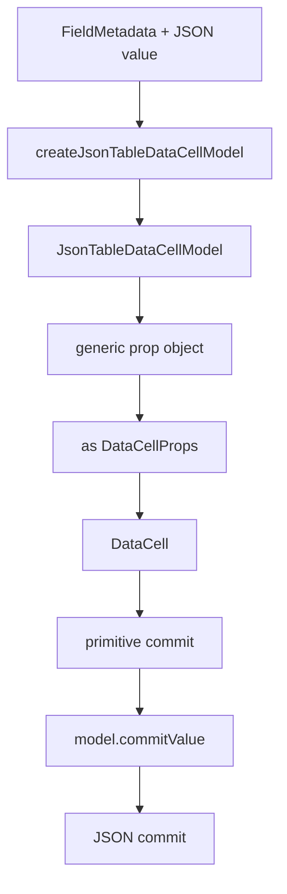
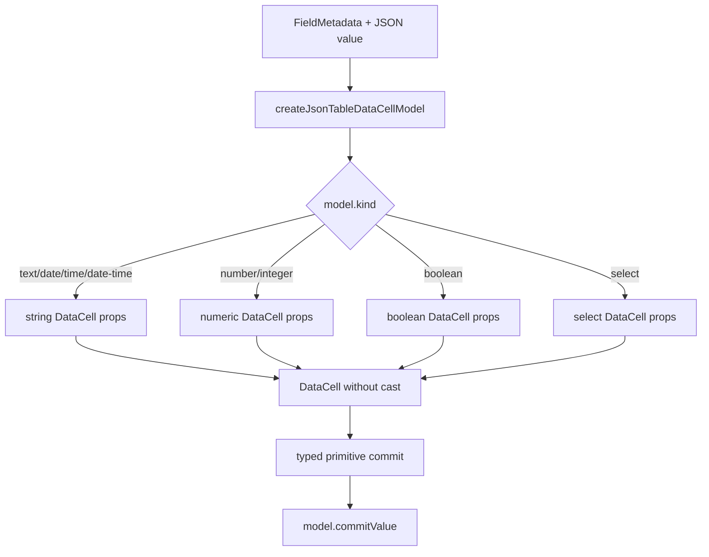

# DataCell and JSON Table Final Type Precision Blueprint

## Verdict

Not yet platonic.

The component has reached the right architecture:

- `DataCell` is the primitive trompe-l'oeil.
- `json-table` delegates primitive editing to `DataCell`.
- enum editing goes through select-flavored `DataCell`, not a table-owned enum
  editor.
- overlay opening policy lives in `data-cell-activation.ts`.
- text caret placement, select opening, picker opening, boolean toggling, and
  JSON enum identity are covered by interaction tests.

The remaining imperfection is not behavioral. It is type and shape precision.

The current system is correct, but it is not yet inevitable:

- `JsonTableDataCell` still casts a generic prop object to `DataCellProps`.
- `json-table-data-cell-model.ts` is pure but dense.
- display-value projection and edit-value projection share helpers, but their
  relationship is implicit.
- the adapter returns a render-ready model instead of a discriminated model that
  TypeScript can prove.
- repo-wide TypeScript is blocked by unrelated schema-editor dirty state, so the
  repository cannot yet make a total correctness claim.

This blueprint is the final precision pass. It should not change the user
interaction. It should make the existing architecture impossible to misuse.

## One-Sentence Target

Make the JSON-table adapter return an exact discriminated `DataCell` model so
`JsonTableDataCell` renders without casts, duplicated meaning, or hidden type
escape hatches.

## First Principles

### Correct Is Not Enough

The current implementation passes the important interaction tests. That means
the behavior is sound.

The platonic ideal asks for more:

- the type boundary should express the runtime boundary exactly
- every branch should carry domain meaning
- no cast should be needed at the final render point
- names should distinguish JSON meaning from primitive UI meaning
- tests should prove architecture, behavior, and generated artifacts

### The Adapter Is The Boundary

`json-table-data-cell-model.ts` is the most important remaining file.

It is the one place where JSON truth becomes primitive truth:

```txt
FieldMetadata + JSON value
  -> JsonTableDataCellModel
  -> DataCell props
  -> primitive commit
  -> JSON value
```

That file is allowed to know about enum sentinels, JSON value equality, date
normalization, and field metadata. No other primitive render layer should.

### The Renderer Should Be Boring

`JsonTableDataCell` should not reason about select, date, enum, number, or
boolean. It should:

```txt
model = createJsonTableDataCellModel(fieldMetadata, value)
renderDataCellModel(model)
onCommit -> model.commitValue(value)
```

If the renderer needs `as DataCellProps`, the model is not precise enough.

## Current Shape



The cast is the problem. It says the code knows something TypeScript does not.
The ideal system should teach TypeScript the same thing the code knows.

## Ideal Shape



The renderer may branch on `model.kind` only to satisfy TypeScript. That branch
is not business logic; it is type narrowing at the component boundary.

## Target Types

The adapter should return a discriminated union:

```ts
type JsonTableDataCellModel =
  | JsonTableTextDataCellModel
  | JsonTableNumberDataCellModel
  | JsonTableBooleanDataCellModel
  | JsonTableSelectDataCellModel

type JsonTableTextDataCellModel = {
  kind: "text" | "date" | "time" | "date-time"
  value: string | null
  className: string
  showPickerIcon?: boolean
  formatValue?: DataCellTextFormatValue
  commitValue: (value: string | null) => unknown
}

type JsonTableNumberDataCellModel = {
  kind: "number" | "integer"
  value: string | number | null
  className: string
  commitValue: (value: number | null) => unknown
}

type JsonTableBooleanDataCellModel = {
  kind: "boolean"
  value: boolean | null
  className: string
  commitValue: (value: boolean) => unknown
}

type JsonTableSelectDataCellModel = {
  kind: "select"
  value: string | null
  className: string
  placeholder: string
  selectOptions: DataCellSelectOption[]
  formatValue?: DataCellSelectFormatValue
  commitValue: (value: string | null) => unknown
}
```

The exact names can be smaller. The requirement is that each model branch
matches one legal `DataCellProps` branch.

## Rendering Contract

`JsonTableDataCell` should use a small render function:

```ts
function renderJsonTableDataCellModel(model, sharedProps) {
  if (model.kind === "select") {
    return <DataCell {...sharedProps} {...model} onCommit={...} />
  }
  if (model.kind === "boolean") {
    return <DataCell {...sharedProps} {...model} onCommit={...} />
  }
  if (model.kind === "number" || model.kind === "integer") {
    return <DataCell {...sharedProps} {...model} onCommit={...} />
  }
  return <DataCell {...sharedProps} {...model} onCommit={...} />
}
```

Forbidden:

- `as DataCellProps`
- `as never`
- generic `selectOptions: []` for non-select cells
- renderer-side enum sentinel logic
- renderer-side date normalization

Allowed:

- narrow branches that mirror the `DataCellProps` union
- adapter-local sentinel handling
- adapter-local JSON equality
- adapter-local date/time normalization

## Adapter Compression

`json-table-data-cell-model.ts` should stay one boundary module, but its internal
helpers can become sharper:

- `jsonValueText(value)` for nested/object display fallback
- `primitiveKindForField(fieldMetadata)` for schema kind projection
- `enumModel(fieldMetadata, value)` for select model construction
- `numberModel(fieldMetadata, value)` for numeric model construction
- `booleanModel(fieldMetadata, value)` for boolean model construction
- `stringModel(fieldMetadata, value)` for text/date/time model construction
- `jsonCommitValue(fieldMetadata, value)` for date/time normalization

Do not split into multiple files unless the single file becomes harder to scan.
The point is conceptual compression, not file proliferation.

## Naming Rules

Use one word per concept:

- `fieldMetadata`: schema-derived table metadata
- `jsonValue`: original document value
- `dataCellValue`: value passed to `DataCell`
- `commitValue`: primitive value returned by `DataCell`
- `jsonCommitValue`: document value after table adaptation
- `selectOptionValue`: internal string identity for select options
- `nullSelectValue`: internal sentinel for nullable enum null

Avoid:

- `nextValue` when the domain is ambiguous
- `value` inside helpers where both JSON and primitive values coexist
- `enumValue` for select option identities
- `displayValue` when the value is actually editable input state

## Tests

Add focused tests for the pure adapter:

- enum primitive string maps to select option and commits the original JSON value
- enum object maps to select option and commits the original object identity
- nullable enum null maps to the null sentinel and commits `null`
- unknown enum value falls back to string and commits string
- date display uses localized display text but commits normalized JSON date
- time commit adds seconds when needed
- number/integer models accept string or number input values
- structured/object fallback becomes text display and commits through table
  normalization

Architecture tests should require:

- `JsonTableDataCell` does not contain `as DataCellProps`
- `JsonTableDataCell` does not contain enum sentinel names
- `json-table-data-cell-model.ts` exports `createJsonTableDataCellModel`
- select-only props are present only on select model branches
- generated registry artifact remains clean of forbidden activation vocabulary

Interaction tests should remain unchanged. This pass should not need new user
behavior tests because it is a type and boundary pass.

## Verification Gates

Required:

- `pnpm exec vitest run tests/json-table-architecture.test.ts --reporter=dot`
- focused adapter tests
- focused DataCell/json-table interaction tests
- full JSON-table test suite
- `pnpm run verify:data-cell`
- `pnpm exec playwright test e2e/data-cell-caret.spec.ts`
- registry build and validation for `data-cell`
- `git diff --check`

Repo-wide TypeScript:

- target: `pnpm exec tsc --noEmit --pretty false --skipLibCheck` passes
- if unrelated schema-editor dirty state remains red, document the exact files
  and errors, but do not claim total repository perfection

## Non-Goals

- no interaction rewrite
- no new editor state machine
- no new enum editor path
- no generic form adapter
- no DataCell API expansion
- no compatibility layer
- no registry process redesign

## Completion Criteria

This pass is complete when:

- `JsonTableDataCell` renders without `as DataCellProps`
- the adapter model is a discriminated union aligned with `DataCellProps`
- JSON adapter tests cover enum identity, nullable enum, date/time normalization,
  number projection, and fallback text projection
- architecture tests forbid the cast and renderer-side JSON meaning
- all existing interaction and browser gates remain green
- generated registry artifacts are rebuilt and valid

Only after that can we say the component is near the platonic ideal at the code
level. Total perfection still requires the repo-wide TypeScript gate to be green
outside this component.
