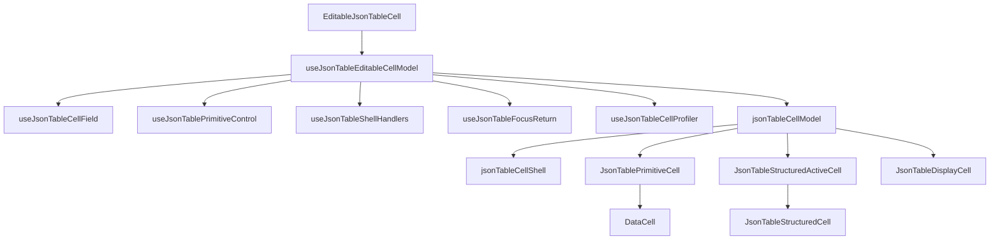

# DataCell and JSON Table Maximal Purity Blueprint

## Verdict

Not yet.

`EditableJsonTableCell` is close to ideal: it is a small render router and no
longer hides the interaction system in JSX. `DataCell` also owns the primitive
editing surface correctly.

The remaining impurity is the middle layer. `useJsonTableEditableCellModel` has
become the new concentrated coordinator. It is behaviorally useful, but it owns
too many meanings:

- field identity
- schema metadata lookup
- primitive edit control
- primitive activation requests
- previous-editor handoff
- shell pointer handling
- shell keyboard handling
- focus return
- profiling
- shell prop construction
- render model construction

That is the exact place where simplicity and speed can still improve. The next
architecture should keep the same runtime behavior while compressing the
coordinator into named, single-purpose modules.

## One-Sentence Target

`json-table` should be a thin JSON identity and shell layer around `DataCell`,
with every responsibility named once, owned once, and tested at the boundary
where it can fail.

## First Principles

### DataCell Owns Primitive Editing

`DataCell` owns:

- text input lifecycle
- number input lifecycle
- boolean control lifecycle
- select opening and selection
- date picker opening and selection
- caret placement
- activation intent interpretation
- draft value display
- commit on Enter
- commit on blur when the control semantics require it
- cancel on Escape
- editor handle registration

`json-table` must not duplicate these behaviors. It may only decide which JSON
field is being edited and pass the correct primitive value into `DataCell`.

### JSON Table Owns JSON Identity

`json-table` owns:

- document id
- materialized field path
- projected cell value
- schema metadata lookup
- JSON value normalization before commit
- primitive active cell identity
- structured edit session identity
- virtual row elevation
- table shell focus
- hover geometry for table affordances

`DataCell` must not know about document projection, materialized paths, virtual
rows, or structured JSON sessions.

### The Shell Is Not An Editor

The `<td>` shell is an activation bridge. It exists because a table cell must
participate in grid focus, hover, keyboard navigation, and pointer hit testing.

The shell may:

- receive focus
- expose `tabIndex`
- report hover geometry
- translate shell pointer events into `DataCellActivationIntent`
- translate shell keyboard events into `DataCellActivationIntent`
- start structured editing for object and array cells

The shell must not:

- store text drafts
- choose caret offsets itself
- format primitive display text
- own picker state
- know select option semantics
- know date picker semantics

## Target Architecture

```txt
EditableJsonTableCell
  render router only

useJsonTableEditableCellModel
  composition only

useJsonTableCellField
  field identity and schema facts

useJsonTablePrimitiveControl
  primitive value controller and DataCell contract

useJsonTableShellHandlers
  td pointer, click, key, and hover behavior

useJsonTableFocusReturn
  focus returns to the td after editing ends

useJsonTableCellProfiler
  render snapshot recording

jsonTableCellShell
  shell prop builders and width/class ownership

jsonTableCellModel
  render model union and model construction
```

## Layer Diagram



## Desired Composition Hook

The coordinator should read like a table of contents:

```ts
export function useJsonTableEditableCellModel(
  props: JsonTableCellProps
): JsonTableEditableCellModel {
  const shellRef = React.useRef<HTMLTableCellElement>(null)
  const cellField = useJsonTableCellField(props)
  const primitiveControl = useJsonTablePrimitiveControl({ props, cellField })
  const shellHandlers = useJsonTableShellHandlers({
    props,
    cellField,
    primitiveControl,
  })

  useJsonTableFocusReturn({
    shellRef,
    isCellEditing: cellField.isCellEditing,
    primitiveActiveCell: props.primitiveActiveCell,
    structuredEditSession: props.structuredEditSession,
  })

  useJsonTableCellProfiler({ props, cellField })

  return buildJsonTableEditableCellModel({
    props,
    shellRef,
    cellField,
    primitiveControl,
    shellHandlers,
  })
}
```

If the hook needs comments to explain its responsibilities, the split is not
complete enough.

## Module Contracts

### `use-json-table-cell-field.ts`

Owns only derived facts:

- `materializedFieldPath`
- `cellValue`
- `cellWidth`
- `fieldMetadata`
- `dataCellKind`
- `cellId`
- `isPrimitiveCell`
- `isPrimitiveActive`
- `isStructuredActive`
- `isCellEditing`
- `isJsonEditable`

It must not import React event types, controller hooks, shell style helpers, or
profiling helpers.

### `use-json-table-primitive-control.ts`

Owns the primitive `DataCell` contract:

- `primitiveEffectiveValue`
- `activationRequest`
- `setActivationRequest`
- `commitPrimitiveValue`
- `setPrimitiveActive`
- `setPrimitiveEditorHandle`

It may use `useCellController` and `formatValueForCommit`. No other module in
the primitive table path should need those APIs.

### `use-json-table-shell-handlers.ts`

Owns table shell behavior:

- pointer enter and move
- pointer down
- click tail after pointer activation
- pointer leave
- key down
- previous primitive handoff
- structured activation
- primitive activation request construction
- boolean command activation

It may call activation and command helpers. It must not own value control,
schema lookup, shell prop construction, or render model construction.

### `use-json-table-focus-return.ts`

Owns one rule:

When a cell was editing and now no primitive or structured edit remains active,
focus returns to the table cell without scrolling.

It must not know field kind, value, schema, commits, activation requests, or
hover behavior.

### `use-json-table-cell-profiler.ts`

Owns one event:

```ts
recordJsonTableRender("EditableJsonTableCell", ...)
```

It must be read-only and side-effect only into the profiler. It should not
mutate component state.

### `json-table-cell-shell.ts`

Owns shell prop shape:

- disabled shell props
- editable shell props
- `data-field-path`
- `data-active`
- `data-json-table-editable-cell`
- width styles
- shell classes
- `tabIndex`

It should be a pure TypeScript module: no hooks, no controller logic, no schema
lookup, no event decisions.

### `json-table-cell-model.ts`

Owns the render union:

```ts
type JsonTableEditableCellModel =
  | { kind: "disabled"; shellProps: EditableTableCellShellProps }
  | {
      kind: "primitive"
      shellRef: React.RefObject<HTMLTableCellElement | null>
      shellProps: EditableTableCellShellProps
      primitiveProps: JsonTablePrimitiveCellProps
    }
  | {
      kind: "structured-active"
      shellRef: React.RefObject<HTMLTableCellElement | null>
      shellProps: EditableTableCellShellProps
      structuredActiveProps: JsonTableStructuredActiveCellProps
    }
  | {
      kind: "display"
      shellRef: React.RefObject<HTMLTableCellElement | null>
      shellProps: EditableTableCellShellProps
      displayProps: JsonTableDisplayCellProps
    }
```

It should construct props, not decide event behavior.

## Naming Contract

Use these exact names everywhere:

- `cellField` for derived field identity and schema facts
- `cellValue` for the projected JSON value
- `cellWidth` for the column width in pixels
- `primitiveEffectiveValue` for controller-backed primitive value
- `activationRequest` for shell-to-`DataCell` activation
- `shellRef` for the table cell element ref
- `shellHandlers` for `<td>` event handlers
- `shellProps` for `<td>` props
- `primitiveProps` for `JsonTablePrimitiveCell`
- `structuredActiveProps` for `JsonTableStructuredActiveCell`
- `displayProps` for `JsonTableDisplayCell`

Avoid these names in the coordinator layer:

- `value`
- `effectiveValue`
- `isEditing`
- `handleClick`
- `handleKeyDown`
- `session`
- `activeCell`

Those names are either too generic or belong to a narrower module.

## Interaction Invariants

The architecture is only valid if these behaviors stay true:

- Clicking text where a character boundary appears activates text editing at
  that caret position.
- Typing a printable key into a focused text shell starts editing from the
  intended insertion point, not by replacing the whole value unless the user
  selected the whole value.
- Clicking a checkbox toggles on the first click.
- Pressing Space on a focused boolean cell toggles once.
- Clicking a select cell opens the select on the first click.
- Clicking a date cell opens the date picker on the first click.
- Date display text and date input text use a visually coherent format during
  the transition from display to edit.
- Pointer activation finishes the previous primitive editor before opening the
  next primitive editor.
- Enter commits the active primitive editor.
- Escape cancels the active primitive editor.
- Blur commits only according to the primitive control semantics owned by
  `DataCell`.
- Object and array cells start structured editing through the structured
  session path, not through `DataCell`.
- Virtual rows elevate while a primitive input, select, date picker, or
  structured overlay is active.
- The table shell regains focus after editing ends and no edit session remains.

## Performance Invariants

The split must not add runtime tax.

- The router must remain under 80 lines.
- The composition hook should remain under 180 lines.
- Each extracted hook or pure module should remain under 220 lines.
- Shell handlers should be memoized by the smallest stable dependency set.
- Shell prop builders should be pure and cheap.
- Field identity derivation should avoid duplicate schema lookup.
- Primitive controller work should run only for primitive-capable cells.
- Profiler recording should stay centralized and easy to disable or sample.

## Architecture Guards

Tests should prevent responsibility drift.

`editable-json-table-cell.tsx` must not contain:

- `flushSync`
- `canActivateDataCellFromKey`
- `DataCellEditorHandle`
- `structuredEditSessionId`
- `recordJsonTableRender("JsonTableStructuredActiveCell"`
- `event.getModifierState("AltGraph")`
- `fieldMetadata.kind === "boolean"`
- `activationRequest: {`

`use-json-table-editable-cell-model.ts` must not contain:

- `getFieldMetadata`
- `useCellController`
- `formatValueForCommit`
- `markJsonTableProfile`
- `recordJsonTableRender`
- `finishPreviousPrimitiveEditor`
- `commitPrimitiveCommand`
- `pointerActivationRequest`
- `keyboardActivationRequest`
- `getSelectableCellWidthStyle`
- `getCellWidthStyle`
- `onPointerDown:`
- `onKeyDown:`
- `React.useLayoutEffect`

Line-count guards should cover:

- `components/json-table/editable-json-table-cell.tsx`
- `components/json-table/use-json-table-editable-cell-model.ts`
- every extracted module listed in this blueprint

## Implementation Plan

1. Extract `useJsonTableCellField`.
2. Extract `useJsonTablePrimitiveControl`.
3. Extract `useJsonTableShellHandlers`.
4. Extract `useJsonTableFocusReturn`.
5. Extract `useJsonTableCellProfiler`.
6. Extract `jsonTableCellShell`.
7. Extract `jsonTableCellModel`.
8. Rewrite `useJsonTableEditableCellModel` as a composition hook.
9. Add architecture guard tests.
10. Run interaction tests and the JSON table profile script.

No compatibility shim is allowed. The cutover should update the runtime path
directly and delete duplicated ownership.

## Verification

Run:

```bash
pnpm exec prettier --write \
  components/json-table \
  tests/json-table-architecture.test.ts \
  design/data-cell-json-table-maximal-purity-blueprint.md
pnpm exec vitest run tests/json-table-architecture.test.ts
pnpm exec vitest run tests/json-table-*.test.tsx
pnpm exec vitest run \
  tests/json-table-*.test.ts \
  tests/data-cell-control-lifecycle.test.tsx \
  tests/data-cell-text-hit-test.test.ts \
  tests/data-cell.test.tsx
PROFILE_OUTPUT=/tmp/retab-json-table-maximal-purity-profile.json \
  node scripts/profile-json-table-interactions.mjs
pnpm exec tsc --noEmit --pretty false --incremental false
```

If the full typecheck fails because of unrelated dirty worktree files, record
the exact unrelated failure and keep the DataCell/JSON-table verification
separate.

## Definition Of Done

The blueprint is implemented only when:

- `EditableJsonTableCell` is still a pure router.
- `useJsonTableEditableCellModel` reads as composition, not orchestration.
- Every extracted module has one responsibility.
- Primitive cells delegate editing fully to `DataCell`.
- Structured cells remain table-owned without leaking into primitive control.
- The interaction checklist passes in integration tests.
- The profile script shows no regression from the pre-split behavior.
- Architecture tests prevent the same bloat from returning.
