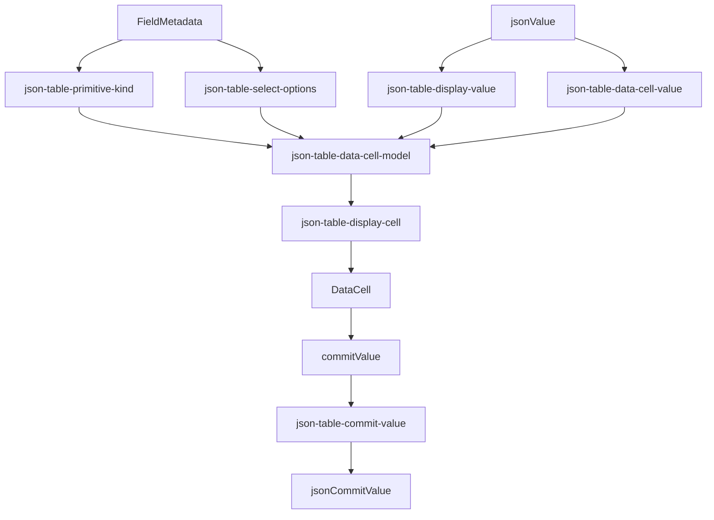

# DataCell and JSON Table Post-Aesthetic Platonic Gap Blueprint

## Verdict

Not platonic yet.

The current system is strong enough to trust:

- `DataCell` owns primitive trompe-l'oeil interaction.
- `json-table` delegates primitive editing to `DataCell`.
- enum editing flows through `DataCell` select.
- caret, select, picker, commit, architecture, TypeScript, and registry gates
  have passed.
- the adapter now reads contract-first and separates rendering from JSON value
  meaning.

The remaining gap is not a bug gap. It is an inevitability gap.

The system still asks the reader to hold too many domains in one file:

- schema projection
- display projection
- DataCell value projection
- enum option identity
- nullable select sentinel behavior
- JSON equality
- date/time normalization
- commit reconstruction

That is coherent, but not yet the purest possible architecture.

## Target

Make the DataCell/JSON-table boundary feel like a small set of pure
transformations:

```txt
fieldMetadata -> primitiveKind
jsonValue -> displayText
jsonValue -> dataCellValue
fieldMetadata -> dataCellOptions
commitValue -> jsonCommitValue
model -> DataCell
```

Every transformation should name its input and output domain explicitly.
No module should force the reader to infer whether `value` means JSON,
DataCell state, select option identity, or table commit value.

## First Principles

### `DataCell`

`DataCell` is the browser-facing primitive.

It owns:

- display/edit illusion
- native input mounting
- caret placement
- select popup interaction
- checkbox interaction
- picker affordances
- keyboard and blur semantics
- activation event-tail survival
- primitive commit values

It must not own:

- JSON schema meaning
- enum JSON identity
- nullable enum sentinel meaning
- table row/column ownership
- document commit semantics

### `json-table`

`json-table` is the document adapter.

It owns:

- field metadata
- JSON value meaning
- schema-to-primitive projection
- enum option identity
- nullable sentinel conversion
- date/time serialization
- table commit semantics

It must not own:

- native input behavior
- caret hit testing
- select popup lifecycle
- checkbox behavior
- primitive interaction policy

## Ideal Module Shape



The model file should become orchestration, not ownership of every detail.

## Proposed Files

### `json-table-primitive-kind.ts`

Owns one question:

```txt
fieldMetadata -> primitiveKind
```

Exports:

- `jsonTablePrimitiveKind(fieldMetadata)`

Rules:

- enum maps to select
- string/unknown maps to text
- number/integer/boolean/date/time/date-time map directly
- object/array/null unsupported schemas return null

No value conversion belongs here.

### `json-table-display-value.ts`

Owns one question:

```txt
fieldMetadata + jsonValue -> displayText
```

Exports:

- `jsonTableDisplayText({ fieldMetadata, jsonValue })`

Rules:

- uses the same branch order as edit projection
- select
- number/integer
- boolean
- text/date/time/date-time
- fallback JSON text

No commit logic belongs here.
No select option identity belongs here.

### `json-table-data-cell-value.ts`

Owns one question:

```txt
fieldMetadata + jsonValue -> dataCellValue
```

Exports:

- `jsonTableDataCellValue({ fieldMetadata, jsonValue })`
- `jsonTableJsonText(jsonValue)`

Rules:

- number/integer return `string | number | null`
- boolean returns `boolean | null`
- text/date/time/date-time return `string | null`
- fallback returns JSON text
- select delegates enum identity to `json-table-select-options`

No display formatting belongs here.
No commit reconstruction belongs here.

### `json-table-select-options.ts`

Owns enum select identity.

Exports:

- `jsonTableSelectOptions(fieldMetadata)`
- `jsonTableSelectValue({ fieldMetadata, jsonValue })`
- `jsonTableSelectCommitValue({ fieldMetadata, commitValue })`

Private:

- `nullSelectOptionValue`
- `selectOptionValue(optionIndex)`
- `jsonValuesEqual(leftJsonValue, rightJsonValue)`

Rules:

- JSON enum identity is preserved by option index, not string comparison
- nullable enum sentinel stays table-local
- empty string/null/undefined enum options keep the current filtering policy
- unknown select commit values round-trip as strings

No rendering belongs here.
No `DataCell` import belongs here except the select option type if unavoidable.

### `json-table-commit-value.ts`

Owns primitive commit reconstruction.

Exports:

- `jsonTableCommitValue({ fieldMetadata, commitValue })`

Rules:

- select delegates to `jsonTableSelectCommitValue`
- date/time/date-time normalize through existing date formatting helpers
- number/integer pass through primitive numeric commit values
- boolean passes through boolean commit values
- text/fallback pass through strings/null

No display formatting belongs here.
No model construction belongs here.

### `json-table-data-cell-model.ts`

Becomes the assembler.

Owns:

```txt
fieldMetadata + jsonValue -> JsonTableDataCellModel
```

Exports:

- model types
- `createJsonTableDataCellModel`

Private factories:

- `selectDataCellModel`
- `numberDataCellModel`
- `booleanDataCellModel`
- `textDataCellModel`
- `fallbackTextDataCellModel`

Rules:

- branch order remains select, number/integer, boolean, text/date/time/date-time,
  fallback
- factories call projection helpers instead of embedding projection details
- no JSON equality
- no date parsing
- no nullable sentinel constant
- no fallback JSON stringification implementation

This file should read like a typed switchboard.

### `json-table-display-cell.tsx`

Owns editable/display `DataCell` rendering only.

Allowed:

- `DataCell`
- typed model branch components
- typed commit bridging from `model.commitValue`

Forbidden:

- schema projection
- date parsing
- JSON equality
- select sentinel names
- read-only primitive rendering
- generic renderer requiring `as never`
- `as DataCellProps`

### `json-table-read-only-primitive-cell.tsx`

Owns read-only primitive rendering only.

Potential improvement:

- receive `primitiveKind` as a prop instead of importing schema projection

That would make read-only rendering fully rendering-only:

```tsx
<JsonTableReadOnlyPrimitiveDisplayCell
  primitiveKind={primitiveKind}
  displayValue={displayText}
/>
```

This is cleaner than importing `jsonTablePrimitiveKind` inside the renderer.

## Naming Standard

Use these names exactly:

- `fieldMetadata`: schema-derived metadata for one table field
- `jsonValue`: original document value
- `leftJsonValue` / `rightJsonValue`: compared JSON values
- `dataCellValue`: primitive value passed to `DataCell`
- `commitValue`: primitive value emitted by `DataCell`
- `jsonCommitValue`: document value after table adaptation
- `displayText`: user-facing read-only text
- `primitiveKind`: DataCell primitive kind
- `selectOptionValue`: string identity used by select
- `nullSelectOptionValue`: table-local nullable select sentinel
- `optionJsonValue`: JSON value represented by an enum option

Avoid:

- generic `value` in helpers crossing domain boundaries
- `enumValue` for select identity
- `dataCellKind` for schema projection
- `candidateJsonValue` if `optionJsonValue` is more precise
- aliases for old names

## Implementation Plan

1. Add the five projection modules:
   - `json-table-primitive-kind.ts`
   - `json-table-display-value.ts`
   - `json-table-data-cell-value.ts`
   - `json-table-select-options.ts`
   - `json-table-commit-value.ts`

2. Move logic out of `json-table-data-cell-model.ts` without changing behavior.

3. Keep all exports hard-cutover. Do not leave compatibility aliases.

4. Update imports at call sites:
   - read-only table cells import display projection directly
   - editable cells keep importing `createJsonTableDataCellModel`
   - read-only primitive renderer receives primitive kind as data, not schema

5. Strengthen architecture tests so the boundaries are enforced:
   - model file contains no date parsing helpers
   - model file contains no JSON equality
   - model file contains no select sentinel constant
   - renderer contains no schema projection
   - read-only primitive renderer contains no schema projection
   - select option module owns sentinel/equality/select commit
   - commit module owns date/time normalization

6. Run the full verification gates.

## Non-Goals

- no interaction behavior change
- no new `DataCell` API
- no new JSON-table feature
- no virtualization rewrite
- no enum behavior rewrite
- no picker lifecycle rewrite
- no compatibility layer
- no generated registry churn unless required by registry validation

## Verification Gates

Required:

- `pnpm exec vitest run tests/json-table-data-cell-model.test.ts tests/json-table-architecture.test.ts --reporter=dot`
- focused DataCell/json-table interaction batch
- full JSON-table suite
- `pnpm exec tsc --noEmit --pretty false --skipLibCheck`
- `pnpm run verify:data-cell`
- `pnpm exec playwright test e2e/data-cell-caret.spec.ts`
- data-cell registry build and validation into a temporary output directory
- `git diff --check`

If any repo-wide gate fails outside the DataCell/json-table boundary, identify it
explicitly. Do not call the system platonic while TypeScript is red.

## Completion Criteria

This pass is complete when:

- every domain transformation has one owning module
- `json-table-data-cell-model.ts` is a typed assembler only
- `json-table-display-cell.tsx` is rendering only
- `json-table-read-only-primitive-cell.tsx` is rendering only
- select identity is isolated in the select option module
- date/time commit normalization is isolated in the commit module
- display projection and edit projection stay branch-order symmetrical
- architecture tests enforce the boundaries
- all verification gates are green

At that point, the design would be closer to platonic than the current system:
not because it has fewer files, but because every file would have exactly one
reason to exist.
