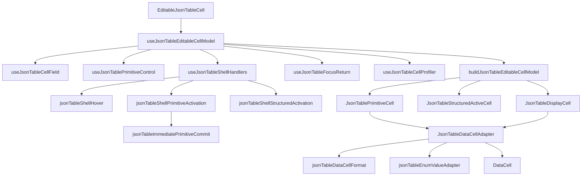

# DataCell and JSON Table Post-Compression Platonic Blueprint

## Verdict

We reached the coordinator-compression goal. We have not reached the platonic
ideal.

The system is now much cleaner:

- `EditableJsonTableCell` is a small router.
- `useJsonTableEditableCellModel` is a small composition hook.
- field facts, primitive control, shell handlers, focus return, profiling,
  shell props, and render model construction have separate owners.
- JSON-table/DataCell interaction tests pass.
- hover profiling still produces zero React renders.

The remaining imperfections are more subtle. They are no longer in the visible
router. They live in second-order boundaries: shell event density, adapter
naming, command semantics, and parent-driven rerender pressure.

## One-Sentence Target

Make JSON table a minimal identity shell around `DataCell`, where every module
name says exactly what it adapts, every event path has one reason to exist, and
no parent state change causes work in cells that cannot observe it.

## Current Shape

```txt
EditableJsonTableCell
  -> useJsonTableEditableCellModel
      -> useJsonTableCellField
      -> useJsonTablePrimitiveControl
      -> useJsonTableShellHandlers
      -> useJsonTableFocusReturn
      -> useJsonTableCellProfiler
      -> buildJsonTableEditableCellModel
```

This is the right macro-shape.

The remaining friction is inside these files:

```txt
use-json-table-shell-handlers.ts
  dense pointer/click/key behavior

json-table-display-cell.tsx
  display cell + DataCell adapter + enum identity + formatting

json-table-primitive-command.ts
  boolean command path is correct but still reads like an exception

table parent state
  checkbox/document updates still produce many same-props cell renders
```

## Remaining Imperfections

### 1. Shell Handlers Are Still Too Dense

`use-json-table-shell-handlers.ts` is at the line-count ceiling. That is not
wrong, but it is a warning.

The file currently owns the correct boundary: table shell events. But it still
contains too many local decisions:

- whether the shell event is eligible
- whether the target is already inside `DataCell`
- previous primitive handoff
- immediate primitive command commit
- primitive pointer activation
- primitive keyboard activation
- structured pointer activation
- structured keyboard activation
- hover profiling

The ideal shell hook should read as event wiring, not event reasoning.

### 2. The DataCell Adapter Is Misnamed

`json-table-display-cell.tsx` owns more than display.

It contains:

- `JsonTableDisplayCell`
- `JsonTableDataCell`
- enum option identity mapping
- null enum sentinel mapping
- primitive value conversion
- date display formatting
- commit normalization into JSON values

Those are valid responsibilities, but the module name is imprecise. The
platonic boundary is not "display". It is "JSON value to DataCell adapter".

### 3. Boolean Command Semantics Are Correct But Not Inevitable

Boolean cells are immediate commands:

```txt
click shell -> commit inverse boolean value
Space key   -> commit inverse boolean value
```

That should not become a fake editor just for uniformity. The imperfection is
not behavior. The imperfection is vocabulary.

`commitPrimitiveCommand` is too generic. It should say that this is an
immediate primitive commit path, and boolean is currently the only member of
that family.

### 4. Parent-Driven Same-Props Renders Still Exist

The profiler shows the important hover paths are ideal: zero React renders.

But checkbox/document mutation still produces many `same-props` cell renders.
Actual React duration is small, so this is not an urgent runtime defect. It is
an architectural impurity: the parent state update still asks many mounted
cells to prove they did not change.

The ideal is stricter:

```txt
state changes should notify only cells that can observe the changed fact
```

This may or may not justify a selector store. The rule is:

- do not add a store unless profiling proves meaningful cost
- do keep the option explicit in the architecture
- do not spread active identity and document mutation through broader props if a
  narrower subscription can express the same truth

## Target Module Shape

```txt
components/json-table/
  editable-json-table-cell.tsx
    render router only

  use-json-table-editable-cell-model.ts
    composition only

  use-json-table-cell-field.ts
    JSON identity, schema facts, active facts

  use-json-table-primitive-control.ts
    DataCell edit contract for primitive JSON values

  use-json-table-shell-handlers.ts
    stable td event wiring only

  json-table-shell-hover.ts
    hover reporting and hover profiling

  json-table-shell-primitive-activation.ts
    primitive shell activation actions

  json-table-shell-structured-activation.ts
    structured shell activation actions

  json-table-immediate-primitive-commit.ts
    immediate primitive command semantics

  json-table-data-cell-adapter.tsx
    FieldMetadata/value adapter into DataCell

  json-table-data-cell-format.ts
    display and commit value conversions

  json-table-enum-value-adapter.tsx
    enum option identity, nullable sentinel, labels

  json-table-display-cell.tsx
    display-only wrapper over the adapter
```

This is a hard cutover. No compatibility shim, no duplicate adapter path.

## Layer Diagram



## Desired Shell Hook

The final shell hook should be boring:

```ts
export function useJsonTableShellHandlers(input: JsonTableShellHandlerInput) {
  const guard = useShellActivationGuard()
  const hover = useJsonTableShellHover(input)
  const primitive = useJsonTableShellPrimitiveActivation({ ...input, guard })
  const structured = useJsonTableShellStructuredActivation(input)

  return {
    onPointerEnter: hover.enter,
    onPointerMove: hover.enter,
    onPointerLeave: hover.leave,
    onPointerDown: (event) => {
      if (primitive.pointerDown(event)) return
      structured.pointerDown(event)
    },
    onClick: primitive.click,
    onKeyDown: (event) => {
      if (primitive.keyDown(event)) return
      structured.keyDown(event)
    },
  }
}
```

The hook wires. The action modules reason.

## Desired Adapter Boundary

Rename the primitive adapter by responsibility:

```txt
JsonTableDataCellAdapter
  Input:
    fieldMetadata
    value
    mode
    active
    editable
    activationIntent
    callbacks

  Output:
    DataCell with the correct kind, display value, picker options,
    commit normalization, and JSON identity preservation
```

Then keep:

```txt
JsonTablePrimitiveCell
  virtual row elevation + active DataCell adapter

JsonTableDisplayCell
  passive DataCell adapter
```

Neither should know enum sentinel details, date formatting details, or primitive
normalization details.

## Naming Contract

Use these names:

- `JsonTableDataCellAdapter` for the JSON-to-`DataCell` adapter component
- `jsonTableDataCellFormat` for primitive value formatting and normalization
- `jsonTableEnumValueAdapter` for enum option identity and nullable sentinel
- `commitImmediatePrimitiveValue` for command-style primitive commits
- `shellPrimitiveActivation` for primitive shell actions
- `shellStructuredActivation` for structured shell actions
- `shellHover` for hover reporting

Avoid:

- `display` for modules that also commit or edit
- `command` when the operation is specifically immediate commit
- `handler` for pure action functions
- `value` when the distinction is `cellValue`, `dataCellValue`, or
  `commitValue`

## Performance Contract

Do not make the code prettier at the cost of runtime pressure.

Keep:

- hover date cell: zero React renders
- hover first mounted cells: zero React renders
- primitive draft changes: no inactive row rerenders
- date picker first click: opens on first click
- enum first click: opens on first click
- checkbox click: toggles once

Investigate:

- checkbox mutation `same-props` render count
- whether active identity can move behind a selector boundary
- whether document patches can notify only affected visible cells

Do not implement a selector store unless profiler data shows the same-props
render path is materially expensive.

## Architecture Guards

Extend `tests/json-table-architecture.test.ts` after implementation.

`json-table-display-cell.tsx` should not contain:

- enum sentinel constants
- enum option identity mapping
- date parse/display helpers
- commit normalization helpers
- direct `DataCell` rendering

`use-json-table-shell-handlers.ts` should not contain:

- `commitPrimitiveCommand`
- `commitImmediatePrimitiveValue`
- `pointerActivationRequest`
- `keyboardActivationRequest`
- `structuredPointerActivationIntent`
- `structuredKeyboardActivationIntent`
- `markJsonTableProfile`
- `finishPreviousPrimitiveEditor`

Line-count targets:

- `use-json-table-shell-handlers.ts` <= 140 lines
- `json-table-data-cell-adapter.tsx` <= 180 lines
- `json-table-data-cell-format.ts` <= 180 lines
- `json-table-enum-value-adapter.tsx` <= 180 lines
- shell action modules <= 160 lines each

## Implementation Plan

1. Rename and split the DataCell adapter boundary.
2. Move enum identity and nullable sentinel behavior into its own adapter.
3. Move date/text/number/boolean formatting and commit normalization into a
   format module.
4. Rename primitive command semantics to immediate primitive commit semantics.
5. Split shell hover, primitive activation, and structured activation from
   `use-json-table-shell-handlers.ts`.
6. Shrink the shell hook to event wiring.
7. Add architecture guards for the new boundaries.
8. Re-run the full JSON-table/DataCell interaction suite.
9. Re-run the profiler and compare checkbox mutation render pressure.
10. Decide whether parent render pressure justifies a selector-store blueprint.

## Verification

Run:

```bash
pnpm exec prettier --check components/json-table tests/json-table-architecture.test.ts
pnpm exec vitest run tests/json-table-architecture.test.ts
pnpm exec vitest run tests/json-table-*.test.tsx
pnpm exec vitest run \
  tests/json-table-*.test.ts \
  tests/data-cell-control-lifecycle.test.tsx \
  tests/data-cell-text-hit-test.test.ts \
  tests/data-cell.test.tsx
PROFILE_OUTPUT=/tmp/retab-json-table-post-compression-platonic-profile.json \
  node scripts/profile-json-table-interactions.mjs
pnpm exec tsc --noEmit --pretty false --incremental false
```

## Definition Of Done

The next step toward the platonic ideal is complete when:

- the shell hook is event wiring, not event reasoning
- the DataCell adapter is named by what it actually does
- enum identity is isolated and testable
- primitive formatting and commit normalization are isolated and testable
- immediate primitive commit semantics are named precisely
- architecture tests enforce the new boundaries
- no first-click or caret interaction regresses
- hover remains zero-render
- any remaining same-props render pressure is either reduced or explicitly
  accepted with profiler evidence
