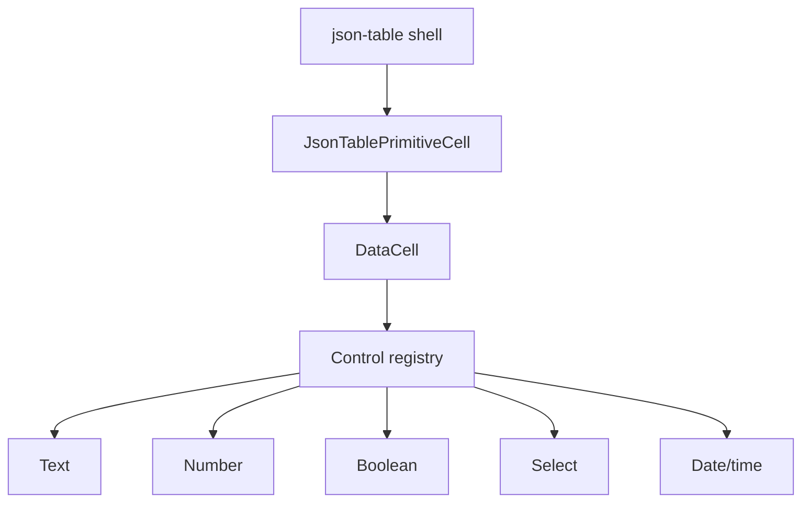
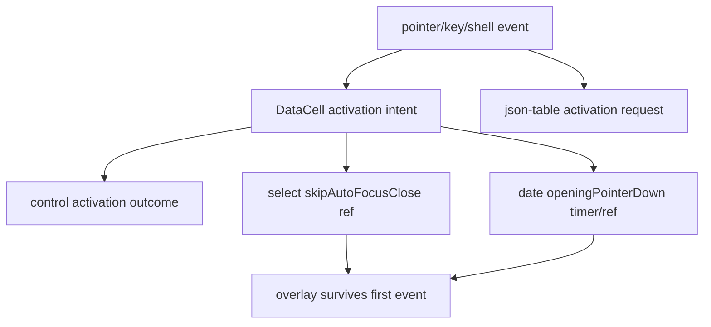
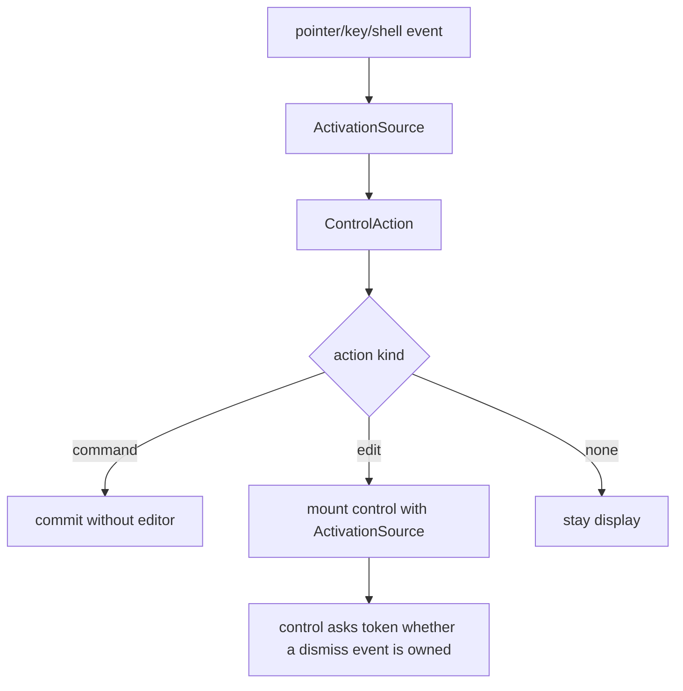

# DataCell and JSON Table Post-Contract Platonic Blueprint

## Verdict

Not yet platonic.

The component is now close in the important way: `json-table` mostly delegates
primitive editing to `DataCell`, and `DataCell` mostly delegates primitive
behavior to controls. The remaining impurity is not a missing feature. It is a
conceptual leak:

- activation is called intent, request, outcome, shell request, and
  programmatic activation depending on the file
- select owns one event-tail workaround
- date/time owns another event-tail workaround
- `DataCell` still reads like event plumbing rather than a tiny lifecycle shell
- `json-table` still passes a table-shaped activation request into a primitive
  component instead of a first-class `DataCell` activation source

The next pass should compress all of that into one primitive idea:

> A cell enters editing because one activation source opened it. Any browser
> event owned by that activation source is allowed to finish opening, but is not
> allowed to immediately dismiss the editor it just opened.

Everything else should fall out of that.

## One-Sentence Target

Make `DataCell` the trompe-l'oeil primitive everywhere: a display surface until
activation, then the real native/control editor, with one activation token shared
by every control and no table-owned primitive behavior.

## Non-Negotiable Direction

This is a compression pass, not an expansion pass.

Allowed:

- hard rename imprecise activation vocabulary
- delete compatibility aliases
- move all opening-event survival logic into one token primitive
- make select and date/time use the same opening-event rule
- keep `json-table` primitive-blind except for value, schema metadata, active
  identity, and generic shell activation
- strengthen architecture tests so the old vocabulary cannot grow back

Forbidden:

- enum-specific table paths
- select/date/text control imports inside `json-table`
- timers used as close guards
- compatibility shims for `activationIntent` or `activationRequest`
- a second lifecycle API for overlay controls
- table knowledge of combobox, calendar, caret, option, or picker internals
- wrappers whose only purpose is to obscure event ordering

If a proposed change adds another concept, it is probably going the wrong way.

## Current Fault Line

The layer shape is broadly correct:



The leak is the activation protocol:



This is too many words for one behavior. The ideal shape is:



## Final Vocabulary

There should be exactly one word per concept:

- `ActivationSource`: where editing or a command came from
- `ActivationToken`: ownership of the opening browser event and its immediate
  click tail
- `ControlAction`: what a control adapter asks `DataCell` to do
- `EditSession`: the mounted editor lifetime
- `Commit`: value leaves the primitive control
- `Dismiss`: editing ends without a value commit
- `Shell`: generic table chrome activation outside the displayed DataCell

These words should disappear from runtime code:

- `activationIntent`
- `activationRequest`
- `activationOutcome`
- `programmatic`
- `skipAutoFocusClose`
- `skipAutoFocusClick`
- `openingPointerDown`
- `closeDelay`
- `closeTimer`

Structured JSON editing may keep its own pointer/keyboard session vocabulary
because it is not a `DataCell` primitive editor. Primitive editing should not.

## Target Contract

```ts
type DataCellActivationSource =
  | {
      kind: "pointer"
      token: DataCellActivationToken
      clientX: number
      clientY: number
      detail: number
      selectionOffset?: number
    }
  | {
      kind: "keyboard"
      key: string
    }
  | {
      kind: "shell"
      token: DataCellActivationToken
    }

type DataCellActivationToken = {
  id: string
  ownsEvent: (event: Event | undefined) => boolean
  release: () => void
}

type DataCellControlAction =
  | { kind: "none" }
  | {
      kind: "command"
      shouldPreventDefault: boolean
      commit: (onCommit: DataCellCommitHandler | undefined) => void
    }
  | {
      kind: "edit"
      shouldPreventDefault: boolean
      activationSource: DataCellActivationSource
    }
```

The important part is not the exact syntax. The important part is that
activation ownership is data, not a boolean ref, a timer, or a select-only
exception.

## Ownership Boundaries

### `DataCell`

Owns:

- display/editor switch
- controlled and uncontrolled active state
- direct pointer/click/key activation dispatch
- storing the current `ActivationSource`
- invoking `ControlAction`
- edit-session end callbacks
- editor handle forwarding

Does not own:

- text caret math
- boolean toggling semantics
- select close reasons
- date/time outside-click exceptions
- JSON identity
- table focus policy

### Control Registry

Owns:

- `kind -> adapter`
- pointer/click/key activation policy per primitive kind
- deciding whether activation is `none`, `command`, or `edit`

Does not own:

- React state
- DOM survival refs
- table state
- JSON normalization

### Primitive Controls

Own:

- display/editor rendering for their primitive
- native focus behavior
- draft value
- commit/dismiss semantics
- overlay open/close behavior when they have an overlay
- asking `ActivationToken` whether an opening event should be ignored as a
  dismiss event

Do not own:

- creating activation sources
- table shell activation
- active primitive identity

### `json-table`

Owns:

- field path
- document id
- schema metadata
- JSON value normalization on commit
- active primitive identity
- generic shell activation source
- structured JSON editor sessions

Does not own:

- select opening
- option commit timing
- date/time popup rules
- caret placement
- boolean checkbox timing
- DataCell event-tail survival

## Activation Rules

### Text Pointer

```txt
pointerdown/click on DataCell display
  -> DataCell creates ActivationSource(pointer)
  -> text adapter adds caret offset
  -> DataCell mounts text editor
  -> text editor focuses native input at offset
```

The click should feel as if the input had always been there.

### Text Printable Key

```txt
printable key on display
  -> DataCell creates ActivationSource(keyboard)
  -> text editor mounts with replacement draft
  -> native caret is visible after inserted character
```

Printable-key activation intentionally replaces the value. Pointer activation
does not.

### Boolean Pointer Or Space

```txt
pointer or Space
  -> control adapter returns ControlAction(command)
  -> DataCell commits toggled value
  -> no editor mounts
```

Enter and F2 may mount the checkbox editor because that is accessibility
navigation, not toggle intent.

### Select Click

```txt
click on select display
  -> DataCell creates ActivationSource(pointer)
  -> select editor mounts
  -> select popup opens
  -> close event asks activation.token.ownsEvent(event)
  -> owned event is ignored
  -> later outside click/Escape dismisses normally
```

No `skipAutoFocusClose`. No timer. No table help.

### Date/Time Click

```txt
pointer/click on date display
  -> DataCell creates ActivationSource(pointer)
  -> picker editor mounts
  -> picker popup opens
  -> outside pointer asks activation.token.ownsEvent(event)
  -> owned event is ignored
  -> later outside pointer/Escape dismisses normally
```

The picker can remain custom. Its activation vocabulary cannot.

### Shell Click

```txt
click on table chrome outside DataCell but inside the primitive cell
  -> json-table creates ActivationSource(shell)
  -> DataCell mounts the relevant primitive editor
  -> control performs its normal default focus/open behavior
```

Shell activation is generic. It must not say select, date, text, caret, or
option.

## Module Target

```txt
registry/new-york-v4/ui/
  data-cell.tsx
    tiny shell, lifecycle dispatch, direct event capture

  data-cell-activation.ts
    ActivationSource creation, ActivationToken ownership, release policy

  data-cell-control-contract.ts
    ControlAction and adapter types only

  data-cell-control-registry.tsx
    kind -> adapter map, no overlay survival state

  data-cell-text-control.tsx
    native text input, draft, caret/hit-test, commit/dismiss

  data-cell-number-control.tsx
    native numeric input, draft grammar, commit/dismiss

  data-cell-boolean-control.tsx
    native checkbox editor and toggle command helper

  data-cell-select-control.tsx
    select editor, option commit, token-owned dismiss

  data-cell-picker-control.tsx
    date/time editor, popup positioning, token-owned dismiss

components/json-table/
  json-table-primitive-activation.ts
    shell ActivationSource helpers and key eligibility only

  use-json-table-primitive-control.ts
    active primitive identity and JSON commit adapter

  use-json-table-shell-handlers.ts
    shell focus/hover/key/pointer bridge

  json-table-primitive-cell.tsx
    passes value, active state, activation source, and commit callback
```

## Implementation Blueprint

1. Finish `data-cell-activation.ts`.
   - token owns the original event
   - token owns the immediate pointer/click tail when coordinates match
   - token can be released explicitly
   - release policy is named in domain terms, not delay terms

2. Replace `DataCellActivationIntent` with `DataCellActivationSource`.
   - prop becomes `activationSource`
   - no compatibility `activationIntent` prop
   - no `programmatic` source
   - shell activation becomes `kind: "shell"`

3. Replace `DataCellControlActivationOutcome` with `DataCellControlAction`.
   - action kinds are `none`, `command`, and `edit`
   - edit action carries `activationSource`
   - helper names use `ControlAction`, not activation outcome

4. Compress `DataCell`.
   - one `applyControlAction` function
   - one stored activation source
   - no kind branches
   - no text/select/date imports beyond controls and registry

5. Convert select to token-owned dismiss.
   - replace skip refs with `openingActivation`
   - close path asks `ownsDismissEvent`
   - commit and dismiss both release opening activation
   - no timer, no delay, no workaround vocabulary

6. Convert date/time to the same token-owned dismiss.
   - remove coordinate refs from the picker itself
   - remove opening pointer timers
   - outside pointer uses `ActivationToken`
   - trigger click uses the same token release rule

7. Convert `json-table` primitive bridge.
   - `activationRequest` becomes `activationSource`
   - shell helper returns `DataCellActivationSource`
   - primitive cells pass `activationSource` directly to `DataCell`
   - structured JSON edit-session vocabulary remains separate

8. Update registry artifacts.
   - include `data-cell-activation.ts`
   - include `data-cell-control-contract.ts`
   - include `data-cell-control-registry.tsx`
   - validate the one-item `data-cell` registry output

9. Add architecture tests.
   - fail on forbidden old activation names in primitive runtime files
   - fail on select/date timers used as close guards
   - fail on `json-table` importing primitive control internals
   - fail if `data-cell.tsx` contains `props.kind ===`

10. Run interaction verification.
    - focused unit tests
    - full JSON-table tests
    - browser caret tests
    - enum dropdown browser or integration tests
    - date/time picker tests
    - DataCell parity verification
    - registry validation

## Interaction Checklist

The cut is not done until these behaviors are true:

- click text at a glyph boundary opens editor with caret at that boundary
- typing after pointer activation inserts at the caret
- typing after printable-key activation intentionally replaces the old value
- clicking an already mounted text editor moves the native caret normally
- dirty text blur commits once
- Escape in text dismisses without an extra commit
- Enter in text commits once
- boolean pointer toggles once
- boolean Space toggles once
- boolean Enter/F2 mounts editor without toggling
- first select click opens the list
- select option click commits JSON identity once
- select Escape dismisses without commit
- select outside click dismisses without commit
- select shell click opens without a double click
- date click opens calendar
- time click opens time input
- date-time click opens calendar and time input
- the opening date/time click does not immediately close the popup
- later outside click closes date/time popup
- virtualization unmount ends only the originally active primitive editor
- switching cells finishes the previous primitive editor before activating the
  next one

## Architecture Tests

The tests should protect boundaries, not incidental formatting.

Required forbidden checks:

- `registry/new-york-v4/ui/data-cell.tsx` must not contain `props.kind ===`
- `data-cell.tsx` must not import text hit-test, select internals, picker
  internals beyond the public control component, or JSON-table code
- primitive runtime files must not contain `activationIntent`,
  `activationRequest`, `ActivationOutcome`, or `programmatic`
- `data-cell-select-control.tsx` must not contain `skipAutoFocus`,
  `closeTimer`, `closeDelay`, or `setTimeout`
- `data-cell-picker-control.tsx` must not contain `skipAutoFocus`,
  `openingPointerDown`, close timers, or close delays
- `components/json-table` primitive bridge must not import select, picker,
  text-hit-test, or Base UI select/calendar internals
- DataCell registry output must include every DataCell runtime module

## Completion Criteria

We can claim this pass is complete when:

- primitive activation has one public name: `ActivationSource`
- opening event ownership has one mechanism: `ActivationToken`
- control adapters return `ControlAction`
- select and date/time share the same opening-event ownership rule
- `DataCell` is a shell and lifecycle dispatcher, not a kind-aware component
- `json-table` is primitive-control blind
- old activation vocabulary is gone from primitive runtime code
- focused tests, full JSON-table tests, browser tests, parity verification, and
  registry validation pass

Only then is the system close to its platonic form: simple because there is one
activation concept, fast because editors mount only when needed, complete
because every primitive behavior has an owner, and modular because `json-table`
never needs to understand the controls it hosts.
