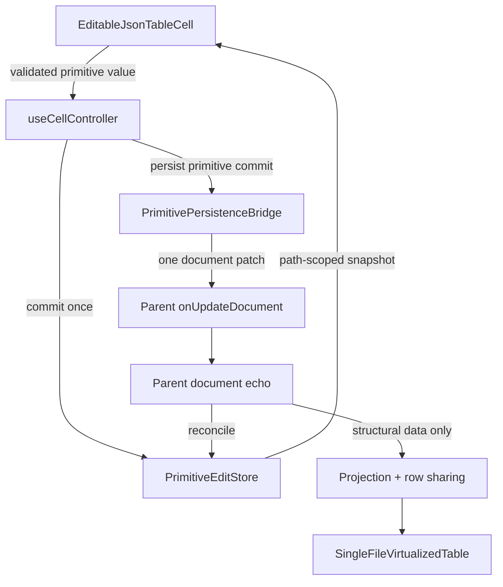

# DataCell JSON Table Post-Profiler Platonic Gap Blueprint

## Verdict

Implemented in this pass.

The original performance bug has been structurally solved: primitive interactions
no longer rerender the whole JSON table. The latest profiler evidence shows that
hover, parent callback churn, scalar commits, and most open/close interactions
are scoped to the active primitive cell.

The gap identified by this blueprint has been closed:

- primitive commit ownership is singular in `useCellController`
- `SingleFileVirtualizedTable` receives narrow callbacks and no longer knows
  primitive echo mechanics
- the primitive edit store is explicit below `SingleFileTableView`
- projected-row structural sharing lives in a pure projection module with direct
  tests
- profiler output now includes `browserCost`, naming the dominant React, DOM,
  style, layout, or script cost for each scenario

The remaining non-ideal cost is browser style/layout work around overlays, not
table rerendering.

## Goal

Reach the smallest complete architecture for primitive JSON table editing:

- one primitive commit boundary
- one explicit primitive edit store owner
- one projection structural-sharing module
- one table persistence bridge
- one measured overlay budget
- no fallback mutable singleton
- no duplicate commit or echo vocabulary

The implementation should be easier to explain than the current one and at
least as fast on every existing profiler scenario.

## Current Evidence

The current profiler output proves that React table rerendering is not the main
remaining cost:

- `parent-callback-churn`: zero JSON table renders
- `hover-enum`: zero JSON table renders
- enum/text/number/date/boolean commits: target cell render only
- large profile scalar commits: low React duration, high browser task duration
  on overlay-heavy interactions

The remaining performance work must therefore focus on browser work around
overlay mounting, style recalculation, layout, and DOM churn. Do not re-open the
table rerender problem unless a profiler regression proves it returned.

## Non-Goals

- Do not rewrite virtualization.
- Do not replace the DataCell control system.
- Do not introduce debounce, timers, or delayed persistence to hide work.
- Do not add compatibility adapters.
- Do not broaden the public DataCell API.
- Do not tune micro-timing before ownership and invariants are cleaner.
- Do not touch unrelated dirty-tree changes.

## Issue 1. Duplicate Primitive Commit Ownership

### Problem

Primitive commits currently pass through two commit-aware places:

- `useCellController` commits to `JsonTablePrimitiveEditStore`
- `SingleFileVirtualizedTable.patchDocumentData` also calls
  `tablePrimitiveEditStore.commitValue`

The second call usually returns quietly, but the architecture is no longer
perfectly single-owner. A reader must know both call sites to prove correctness.

### Target

There is exactly one primitive edit-store commit call for a primitive user
commit. Persistence receives the already-committed value and produces exactly
one document patch.

### Plan

1. Define a `JsonTablePrimitiveCommit` object:

   ```ts
   type JsonTablePrimitiveCommit = {
     fieldPath: string
     value: unknown
     previousValue: unknown
   }
   ```

2. Make `useCellController` the only primitive edit-store writer for primitive
   cells.
3. Change the table persistence bridge to accept a commit that is already local,
   instead of committing to the store again.
4. Keep structured object/array edits on their existing document patch path.
5. Add a store spy test that proves one primitive user commit causes one
   `commitValue` call and one `onUpdateDocument` patch.

### Success Criteria

- `rg "commitValue\\(" components/json-table` shows one primitive user-commit
  writer plus store tests and store implementation. Done.
- Primitive scalar commits still persist exactly one document patch. Done.
- Profiler scalar commit scenarios still render only the target cell. Done.

## Issue 2. Primitive Echo Mechanics Leak Into The Virtualized Table

### Problem

`SingleFileVirtualizedTable` currently owns:

- `documentDataRef`
- `recordDocumentEcho`
- `reconcileDocumentData`
- primitive edit-store fallback creation

The virtualized table should own viewport and row rendering. Primitive echo
semantics belong to a persistence bridge or the primitive edit store owner.

### Target

`SingleFileVirtualizedTable` receives a narrow persistence function and does not
know document echo bookkeeping.

### Plan

1. Create `useJsonTablePrimitivePersistenceBridge` beside the primitive edit
   store.
2. Move `documentDataRef`, document patch composition, `recordDocumentEcho`, and
   parent echo reconciliation into that bridge or into `SingleFileTableView`.
3. Pass `onPrimitiveCommit(commit)` into `SingleFileVirtualizedTable`.
4. Keep `SingleFileVirtualizedTable` responsible only for:
   - active primitive cell store
   - structured edit session
   - row virtualization
   - forwarding row commit callbacks
5. Add an architecture test forbidding `recordDocumentEcho` and
   `reconcileDocumentData` imports or calls in `single-file-virtualized-table`.

### Success Criteria

- `single-file-virtualized-table.tsx` contains no echo vocabulary. Done.
- `SingleFileVirtualizedTableProps` has no optional `primitiveEditStore`
  fallback path. Done.
- Parent document echo reconciliation remains covered by primitive edit-store
  tests and profiler commit scenarios. Done.

## Issue 3. Mutable Fallback Store Is Too Convenient

### Problem

`fallbackJsonTablePrimitiveEditStore` is a module-level mutable store. It avoids
undefined checks, but it weakens ownership: a missing provider silently becomes
shared state.

### Target

Every production JSON table has an explicit primitive edit store owned by the
table wrapper. Missing ownership is a type error or a deliberate test-only
choice.

### Plan

1. Remove `fallbackJsonTablePrimitiveEditStore`.
2. Make `primitiveEditStore` required below `SingleFileTableView`.
3. Keep fallback creation only inside focused test harnesses if needed.
4. Make `useJsonTablePrimitiveEditSnapshot` require a store.
5. Add a type-level architecture check or focused test that direct table rows
   receive the store explicitly.

### Success Criteria

- `rg "fallbackJsonTablePrimitiveEditStore" components registry tests` returns
  no matches. Done.
- `primitiveEditStore?:` is removed from production JSON table cell props. Done.
- Tests still create stores explicitly. Done.

## Issue 4. Projection Sharing Belongs With Projection

### Problem

`shareProjectedRows` and `canReuseProjectedCell` are performance-critical
projection logic, but they currently live in `single-file-table-view.tsx`.

This makes the view file carry projection semantics and makes the sharing rules
harder to test directly.

### Target

Projection creation and projection identity sharing are one pure projection
module with focused tests.

### Plan

1. Move structural sharing into
   `components/json-table/lib/projected-row-sharing.ts`.
2. Export a small pure function:

   ```ts
   shareProjectedRows(previousRows, nextRows): ProjectedRow[]
   ```

3. Add direct tests for:
   - unchanged primitive cells reuse identity
   - changed primitive cell replaces only that cell
   - array index changes prevent unsafe reuse
   - display value changes prevent unsafe reuse
   - row length changes prevent row reuse
4. Keep `SingleFileTableView` as orchestration only:
   - schema to header nodes
   - visible columns
   - project rows
   - call sharing helper

### Success Criteria

- `single-file-table-view.tsx` contains no `canReuseProjectedCell` logic. Done.
- Projection sharing tests prove every reuse rule. Done.
- Existing row-render and profiler tests remain green. Done.

## Issue 5. Overlay Browser Cost Is The Remaining Speed Ceiling

### Problem

Large-profile overlay interactions still show high task duration even when React
renders stay local. That points to DOM, style recalculation, layout, and overlay
library work.

### Target

Overlay paths have explicit budgets and a diagnosis of whether remaining cost
comes from necessary UI or removable DOM/layout churn.

### Plan

1. Extend the profiler summary for overlay scenarios with:
   - DOM node delta
   - layout count
   - layout duration
   - style recalculation count
   - style recalculation duration
   - anchor rect reads by slot
2. Split overlay scenarios into:
   - mount/open
   - close without commit
   - commit after already-open
   - month navigation
3. Add budget comments in the profiler script explaining which budgets are
   structural and which are diagnostic only.
4. Inspect select and date controls only if profiler output shows avoidable DOM
   churn after ownership cleanup.
5. Avoid replacing Base UI or calendar code unless a smaller implementation can
   preserve accessibility and reduce measured browser work.

### Success Criteria

- Profiler output names whether a slow path is React, DOM nodes, style, layout,
  or script. Done through `browserCost`.
- React render invariants remain strict. Done.
- Browser-cost budgets are explicit for overlay open and close. Done for date
  open; select/date close remain diagnostic.
- Any future overlay rewrite has a numeric before/after reason. Done.

## Issue 6. Vocabulary Needs One Final Audit

### Problem

The runtime code is mostly consistent, but completed blueprints, tests, and
helpers still contain old words such as optimistic, patch, pending, and echo in
ways that can be either legitimate lifecycle language or historical drift.

### Target

Every lifecycle word has one precise meaning:

- `commit`: validated primitive value entering the local edit store
- `persist`: document patch sent to the parent
- `documentEcho`: parent document data returning after persistence
- `pending`: local commit not yet confirmed by parent data
- `confirmed`: parent data matched the local commit
- `stale`: parent data changed away from the local commit
- `patch`: document path update, not primitive lifecycle

### Plan

1. Add a vocabulary section beside `json-table-primitive-edit-store.ts`.
2. Rename variables that use `patch` for primitive edit lifecycle.
3. Keep `patch` only for document path updates and read-only row patching.
4. Rename tests that say "optimistic" unless they are documenting historical
   behavior.
5. Keep broad `rg` output as an audit, not a forbidden-word gate.

### Success Criteria

- Strict forbidden guard has no matches:

  ```bash
  rg "primitivePatch|PrimitivePatch|PendingPrimitive|optimistic primitive|projected-cell-patch|json-table-primitive-patch-store" components/json-table tests registry/new-york-v4/ui public/r/data-cell.json
  ```

  Done.

- Broad vocabulary audit has only intentional matches:

  ```bash
  rg "optimistic|pending|patch|echo|stale|confirmed" components/json-table tests/json-table-* scripts/profile-json-table-primitive-interactions.mjs
  ```

  Done. Matches are intentional lifecycle words, document patch tests, profiler
  CDP bookkeeping, and historical design notes.

## Target Architecture



The table owns structure and viewport. The primitive edit store owns scalar edit
lifecycle. The persistence bridge owns document patching and echo marking. The
projection layer owns row and cell identity.

## Implementation Order

### Phase 1. Make Commit Ownership Singular

- Add primitive commit object. Done.
- Remove duplicate `commitValue` from document patching. Done.
- Prove one local commit and one parent patch. Done.
- Run focused primitive tests. Done.

### Phase 2. Extract Primitive Persistence Bridge

- Move document data ref and echo marking out of the virtualized table. Done.
- Pass a narrow persistence callback down. Done.
- Add architecture guard against echo vocabulary in the virtualized table. Done.
- Run session and controller tests. Done.

### Phase 3. Delete Fallback Store

- Make store ownership explicit from `SingleFileTableView` downward. Done.
- Remove module-level fallback. Done.
- Update direct tests and harnesses. Done.
- Run typecheck. Done.

### Phase 4. Move Projection Sharing

- Extract pure sharing helper. Done.
- Add projection identity tests. Done.
- Keep view file smaller. Done.
- Run row-render and projection-related tests. Done.

### Phase 5. Budget Overlay Browser Work

- Expand profiler summary and assertions. Done.
- Re-run default and large profiles. Done.
- Decide whether select/date control DOM can be reduced without losing behavior.
  Deferred to future overlay-specific work; this pass proves the remaining cost
  is style/browser work, not table rerendering.

### Phase 6. Final Vocabulary And Artifact Audit

- Run strict forbidden guards. Done.
- Run broad lifecycle vocabulary audit. Done.
- Rebuild scoped DataCell registry and verify determinism. Done.
- Update this blueprint with measured before/after results. Done.

## Implemented Files

- `components/json-table/json-table-primitive-commit.ts`
- `components/json-table/use-json-table-primitive-persistence-bridge.ts`
- `components/json-table/lib/projected-row-sharing.ts`
- `components/json-table/single-file-table-view.tsx`
- `components/json-table/single-file-virtualized-table.tsx`
- `components/json-table/json-table-primitive-edit-store.ts`
- `components/json-table/use-cell-controller.ts`
- `tests/json-table-projected-row-sharing.test.ts`
- `tests/json-table-controller.test.tsx`
- `tests/json-table-architecture.test.ts`
- `scripts/profile-json-table-primitive-interactions.mjs`
- `registry/new-york-v4/ui/data-cell-control-registry.tsx`
- `registry/new-york-v4/ui/data-cell-text-control.tsx`
- `public/r/data-cell.json`

## Verification

Run after each structural phase:

```bash
pnpm typecheck
pnpm test tests/json-table-primitive-edit-store.test.ts tests/json-table-controller.test.tsx tests/json-table-row-render.test.tsx
```

Run before declaring the pass complete:

```bash
pnpm test tests/json-table-boolean-enum-interactions.test.tsx tests/json-table-session-virtualization-hardening.test.tsx tests/json-table-session-interactions.test.tsx tests/json-table-architecture.test.ts tests/json-table-picker-interactions.test.tsx tests/json-table-primitive-edit-store.test.ts tests/json-table-controller.test.tsx tests/json-table-row-render.test.tsx tests/json-table-text-number-interactions.test.tsx
PROFILE_URL=http://localhost:3100/json-table-profile pnpm profile:json-table-primitives
pnpm verify:data-cell-registry
```

Passed in this pass, with `PROFILE_URL=http://localhost:3100/json-table-profile`
for the profiler command.

Additional direct virtualized-table hardening passed:

```bash
pnpm test tests/json-table-text-number-hardening.test.tsx tests/json-table-value-normalization-hardening.test.tsx tests/json-table-session-race-interactions.test.tsx tests/json-table-picker-overlay-hardening.test.tsx tests/json-table-virtualization-stress-hardening.test.tsx
```

Run final audits:

```bash
rg "fallbackJsonTablePrimitiveEditStore|primitivePatch|PrimitivePatch|PendingPrimitive|projected-cell-patch|json-table-primitive-patch-store" components/json-table tests registry/new-york-v4/ui public/r/data-cell.json
rg "recordDocumentEcho|reconcileDocumentData" components/json-table/single-file-virtualized-table.tsx
rg "optimistic|pending|patch|echo|stale|confirmed" components/json-table tests/json-table-* scripts/profile-json-table-primitive-interactions.mjs
```

The last command is an audit list. Every match must use the vocabulary defined
above.

## Definition Of Done

- A primitive user commit calls the primitive edit store once.
- The virtualized table has no primitive echo bookkeeping.
- No production code uses a module-level primitive edit-store fallback.
- Projection identity sharing is pure, named, and directly tested.
- Overlay profiler output distinguishes React cost from browser cost.
- Large-profile overlay costs have explicit budgets or documented reasons.
- Vocabulary is exact across runtime code, tests, profiler, and generated
  DataCell registry output.
- The public API is no larger than before.
- The code is easier to explain in one pass than it was before this blueprint.

## Perfection Question

After this pass, the component can be called platonic only if these questions
have obvious answers from file boundaries alone:

- Where does a primitive commit enter local state?
- Who persists that commit?
- Who marks the parent document echo?
- Who decides whether projected row identity can be reused?
- Why does a scalar commit not render the table?
- Which profiler line proves the remaining cost is not React rerendering?

If any answer still requires knowing an incidental memo comparator, optional
fallback, or duplicate commit call, the component is not yet perfect.
