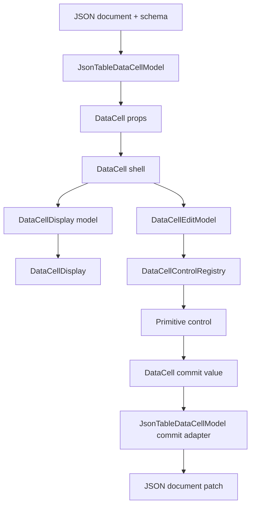
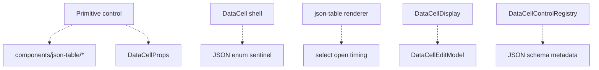

# DataCell and JSON Table Primitive Boundary Completion Blueprint

## Verdict

Not yet platonic.

The direction is now correct: `DataCell` is the primitive trompe-l'oeil, and
`json-table` is the JSON projection layer that feeds it. The remaining work is
not about adding capability. It is about deleting the last ownership ambiguity
until every module owns exactly one fact.

The final form should be boring in the best sense:

```txt
JSON value + field metadata
  -> JSON-table primitive projection
  -> DataCell primitive props
  -> DataCell display or control
  -> primitive commit
  -> JSON-table commit projection
  -> document patch
```

Any code that mixes two adjacent arrows is suspect. Any code that sits outside
this chain should be deleted.

## Current State

Already clean:

- `DataCell` imports no `components/json-table/*` code.
- enum cells route through `DataCell` select behavior, not a table-owned enum
  editor.
- `json-table` owns enum identity, nullable sentinel handling, schema mapping,
  and JSON commit values.
- `DataCell` owns text caret placement, checkbox toggling, select opening,
  picker opening, primitive draft state, and edit lifecycle.
- `DataCellDisplay` has its own discriminated display prop type.
- `DataCellControl` receives `DataCellEditModel`, not public `DataCellProps`.
- edit models no longer carry a broad `nativeProps` remainder.
- primitive controls do not import public `DataCellProps`.
- `DataCell` no longer imports leaf controls just to re-export them; runtime
  shell imports are closer to the code it actually executes.
- generated registry output includes the primitive runtime files.

Still not perfect:

- `DataCellControl` still has explicit kind branches for render/action
  dispatch. They are type-safe, but the adapter map is not the single visible
  source of all control ownership.
- `DataCellEditModel` still derives from public `DataCellProps`; that is
  acceptable at the shell boundary, but the projection should become visually
  smaller and easier to audit.
- dynamic `aria-*` and `data-*` editor forwarding still requires runtime
  projection. That may be inevitable because the attribute names are open-ended,
  but it must remain quarantined.
- the tests prove many boundaries, but they do not yet prove the whole
  interaction contract as one end-to-end matrix.

## Definition Of The Ideal

### Simplicity

The reader should be able to answer these questions without jumping across many
files:

- How does a JSON value become a primitive value?
- How does a pointer click become an edit session?
- How does a primitive commit become a JSON patch?
- Which module owns select open timing?
- Which module owns enum object identity?

If the answer is "several places", the architecture is still bloated.

### Speed

The fast path must do almost nothing:

- inactive cells render a cheap display surface
- hover does not mount editors
- activation mounts exactly one primitive control
- command controls such as boolean can commit without mounting a long-lived
  editor
- table rows do not allocate editor-only state for read-only cells
- schema and JSON projection work is memoized or branch-local where useful

### Completeness

The primitive must cover the real interaction surface:

- text first-click caret placement
- type-to-edit text activation
- number and integer keyboard activation
- checkbox click and keyboard toggle
- select click, keyboard open, option commit, blur behavior
- date, time, and date-time popup lifecycle
- nullable enum null selection
- object enum identity preservation
- blur commit where the primitive's native control semantics require it
- Escape cancel where the primitive supports a draft
- Enter commit where the primitive supports a draft
- focus return to the table shell
- virtualization survival while an overlay is open

### Nothing More

Forbidden:

- legacy enum editor paths
- compatibility adapters
- duplicate select implementations
- table-specific primitive control props
- broad prop bags under names like `nativeProps`
- `as never` to silence adapter mismatches
- `as DataCellProps` at render sites
- JSON sentinel names inside primitive UI files
- primitive interaction policy inside `json-table`

## Ownership Model

### `json-table`

Owns:

- JSON document structure
- schema traversal
- field metadata
- primitive-capable versus structured-cell decision
- JSON value to primitive value projection
- enum option identity
- nullable enum null handling
- date/time JSON normalization
- active table cell identity
- document patch construction
- virtualization and row elevation

Does not own:

- primitive editor rendering
- select popup timing
- checkbox toggle mechanics
- text caret placement
- picker open/close behavior
- primitive draft state

### `JsonTableDataCellModel`

Owns the only bridge between JSON meaning and primitive meaning.

Target shape:

```ts
type JsonTableDataCellModel = {
  primitiveKind: DataCellKind
  primitiveValue: DataCellValue
  primitiveProps: JsonTableDataCellPrimitiveProps
  commitPrimitiveValue: (value: DataCellCommitValue) => unknown
}
```

Rules:

- use `jsonValue` for JSON-domain values
- use `primitiveValue` for DataCell-domain values
- use `commitValue` only for values leaving a primitive control
- never use plain `value` in helpers that touch both domains
- never preserve enum identity below this layer
- never normalize JSON dates below this layer

### `DataCell`

Owns:

- public primitive API
- inactive trompe-l'oeil display
- active edit session
- activation source capture
- controlled and uncontrolled active state
- command actions that commit without long-lived editor mount
- primitive commit forwarding

Does not own:

- schema meaning
- JSON identity
- table active-cell identity
- document mutation

The runtime `DataCell` component should eventually import only:

- activation helpers
- display projection
- edit-model projection
- control registry
- formatting helpers that are part of the primitive contract

Primitive controls may be exported from a barrel, but the shell should not need
to import them merely to make them available to consumers.

### `DataCellDisplay`

Owns:

- inert visual surface
- display formatting
- placeholder rendering
- picker icon display
- shell accessibility state

Does not own:

- edit model state
- native editor props
- table classes
- JSON values

### `DataCellEditModel`

Owns:

- exact active-control state
- kind-specific primitive value
- explicit editor props
- activation source
- primitive lifecycle callbacks
- primitive commit callback

Does not own:

- public `DataCellProps` after projection
- broad DOM prop leftovers
- table props
- display-only props

Dynamic editor attributes are allowed only here:

```txt
DataCellProps
  -> explicit editor props
  -> guarded aria-* / data-* projection
  -> DataCellEditorProps
```

This is an acceptable impurity if it remains named, tested, and limited to
primitive attribute values.

### `DataCellControlRegistry`

Owns:

- `kind -> control adapter`
- edit-model to primitive-control prop projection
- pointer activation action
- click activation action
- keyboard activation action
- keyboard activation capability

Does not own:

- JSON-table projection
- public `DataCellProps`
- primitive control internals
- duplicate interaction policy outside adapters

The ideal registry has one conceptual map:

```txt
kind -> adapter -> render / pointer / click / key / canActivate
```

If TypeScript requires explicit branches for exact narrowing, the branches must
remain small and adapter-directed. The goal is not clever generic code. The
goal is no duplicated policy.

### Primitive Controls

Own:

- native input/select/button/picker behavior
- draft state
- focused DOM node
- popup open/close mechanics
- concrete ARIA roles
- commit/cancel/finish lifecycle

Do not own:

- table schema meaning
- document mutation
- public `DataCellProps`
- external active-cell identity

## Target Layer Diagram



Forbidden edges:



## Interaction Contract To Prove

The architecture is not complete until these are integration-tested at the
DataCell and json-table boundary.

### Text

- Single click activates the cell.
- The caret lands at the clicked grapheme boundary.
- Typing after pointer activation inserts at the caret, not replacing the whole
  value unless the activation explicitly selected all text.
- Typing into an inactive editable text cell starts editing.
- Enter commits.
- Escape cancels draft edits.
- Blur commits only according to the text control contract.
- Focus returns to the shell after editing ends.

### Number And Integer

- Single click activates the cell.
- Typing a digit into an inactive cell starts editing with the typed digit.
- Invalid draft text does not commit a broken JSON value.
- Enter commits a valid value.
- Escape cancels.
- Integer cells do not commit fractional values.
- Empty nullable numeric cells can commit null only when the schema permits it.

### Boolean

- Single click toggles without requiring a second click.
- Space toggles.
- Enter and F2 activate consistently with the primitive contract.
- The command path does not mount a long-lived editor unnecessarily.
- Disabled boolean cells do nothing.

### Select

- Single click opens the select when editable.
- The activation click does not immediately close the popup.
- Arrow keys navigate options.
- Enter commits the highlighted option.
- Escape closes without commit.
- Outside click closes according to the select primitive contract.
- Nullable enum null commits `null`.
- Object enum options commit the original JSON identity chosen by
  `json-table`.

### Date, Time, Date-Time

- Single click opens the picker.
- The displayed trompe-l'oeil text matches the inactive formatting.
- The active control text does not switch to an unexpected internal format.
- Picker navigation does not end table editing prematurely.
- Commit emits the primitive value expected by the table projection.
- JSON date normalization is owned by `json-table`, not the picker.

### Table Integration

- Moving from one primitive cell to another ends the previous edit session.
- Virtualized rows remain mounted or elevated while a primitive overlay needs
  them.
- Table focus returns after commit/cancel.
- Structured object and array cells never route through primitive DataCell
  editing.
- Read-only cells render display only.

## Implementation Blueprint

### Phase 1: Make The Boundary Tests Stricter

Add architecture tests that forbid these strings in primitive runtime files:

- `components/json-table`
- `DataCellProps` in primitive control files
- `as DataCellProps`
- `as never`
- `nativeProps`
- enum sentinel constants
- date JSON normalization helpers

Add positive tests that require:

- `DataCellEditorProps`
- `DataCellDisplayProps`
- `DataCellEditModel`
- `DataCellControlAdapter`
- `canActivateDataCellFromKeyByKind`
- table-only enum identity tests

### Phase 2: Split Public Exports From Runtime Shell

Current status: the worst version of this issue is fixed. `data-cell.tsx` no
longer imports primitive controls into local bindings just to re-export them.
The remaining question is whether the public barrel should be physically split
from the runtime shell.

Target:

```txt
data-cell.tsx
  DataCell runtime shell only

data-cell-exports.ts
  public exports for controls, types, helpers
```

or a similarly named public barrel, if the registry system allows it cleanly.
The runtime shell should import the registry, not every leaf control.

Do not do this if it creates compatibility shims. The public import path may be
hard-cut if needed.

### Phase 3: Collapse Control Dispatch To One Visible Adapter Map

Keep exact TypeScript narrowing. Do not introduce unsafe casts.

Desired direction:

```ts
const dataCellControlAdapters = {
  text: textControlAdapter,
  number: numberControlAdapter,
  integer: integerControlAdapter,
  boolean: booleanControlAdapter,
  select: selectControlAdapter,
  date: pickerControlAdapter,
  time: pickerControlAdapter,
  "date-time": pickerControlAdapter,
}
```

All behavior should point at this map:

- render
- pointer activation
- click activation
- key activation
- key capability

If render dispatch still needs branches for discriminated narrowing, each branch
must be a one-line adapter call. The branch is allowed; duplicated policy is
not.

### Phase 4: Shrink Edit Model Projection

Keep the current explicit constructors, but make them easier to audit:

- one constructor per semantic control family
- no unknown remainder
- no field copied unless a primitive control uses it
- names match control prop names exactly

The file should read as a list of facts, not a prop-spreading machine.

### Phase 5: Prove Total DataCell Delegation In JSON Table

`json-table` should have exactly one primitive rendering path:

```txt
JsonTableDataCellModel
  -> <DataCell ...primitiveProps />
```

Table code may branch to create the model. It should not branch to recreate
primitive control behavior.

Architecture tests should prove:

- no `EnumEditor`
- no select control import in `components/json-table`
- no picker control import in `components/json-table`
- no checkbox behavior in `components/json-table`
- no text caret behavior in `components/json-table`
- no enum sentinel names in renderer files

### Phase 6: Interaction Matrix Tests

Build the integration test matrix from the interaction contract above.

Minimum required slices:

- `tests/data-cell.test.tsx`
- `tests/data-cell-control-lifecycle.test.tsx`
- `tests/json-table-data-cell-model.test.ts`
- `tests/json-table-interactions.test.tsx`
- `tests/json-table-architecture.test.ts`

Use real user events where possible. Avoid implementation-mock tests for the
activation bugs; they miss browser ordering issues.

### Phase 7: Registry And Performance Verification

Every DataCell source change must be followed by:

```bash
pnpm exec shadcn build tmp/data-cell-registry.json --output public/r
pnpm exec vitest run tests/json-table-architecture.test.ts tests/data-cell.test.tsx tests/data-cell-control-lifecycle.test.tsx
pnpm exec vitest run $(rg --files tests | rg 'json-table.*\.test\.(ts|tsx)$|data-cell.*\.test\.(ts|tsx)$')
git diff --check -- registry/new-york-v4/ui components/json-table tests design public/r/data-cell.json
```

If repo-wide `tsc` is red because of unrelated files, record the unrelated
paths and run a focused grep over DataCell/json-table paths before claiming the
primitive work is clean.

## Naming Rules

Use these names consistently:

- `jsonValue`: value from the JSON document
- `primitiveValue`: value passed into `DataCell`
- `draftValue`: temporary value inside a primitive control
- `commitValue`: value emitted by a primitive control
- `jsonCommitValue`: value that will be patched into the JSON document
- `fieldMetadata`: schema-derived table field facts
- `primitiveKind`: `DataCellKind` chosen by table projection
- `activationSource`: remembered source of primitive activation
- `editorProps`: explicit props forwarded to the active native editor

Avoid:

- `value` in bridge helpers
- `cellValue` when crossing JSON and primitive domains
- `enumValue` outside the table projection layer
- `nativeProps`
- `controlState` for anything that is not the activation-time control state

## Done Means

We can call this component near-platonic when:

- the dependency graph has one direction: `json-table -> DataCell -> controls`
- `DataCell` has no table imports or table names
- primitive controls have no table imports and no public `DataCellProps`
- `json-table` has no primitive interaction behavior
- enum, date, nullable, and object identity decisions live only in the table
  projection model
- active primitive controls receive exact props, not broad leftovers
- the adapter registry is the only place that maps kind to control behavior
- integration tests cover the interaction matrix
- registry output is regenerated
- focused DataCell/json-table tests pass

Absolute platonic status requires one more bar: repo-wide typecheck and test
health must be green or every failure must be proven unrelated. A component can
be architecturally clean in isolation, but it is not Flaubertian perfection
while the surrounding system cannot verify it without caveats.
