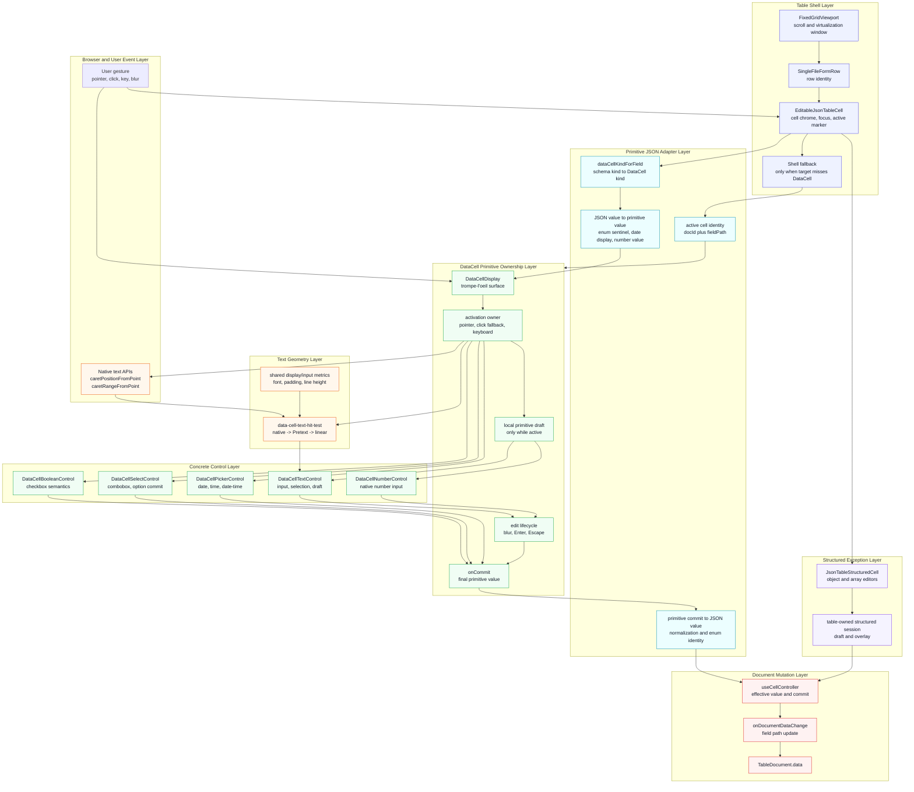
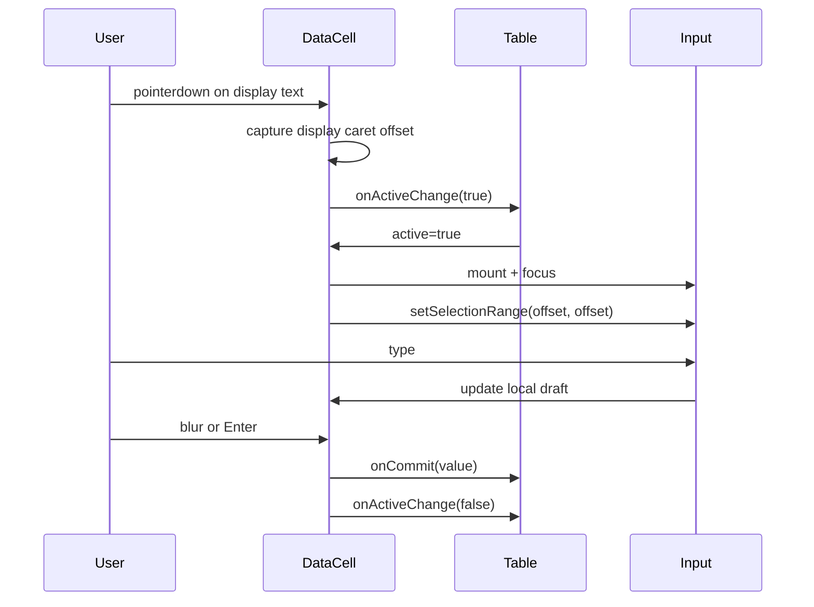
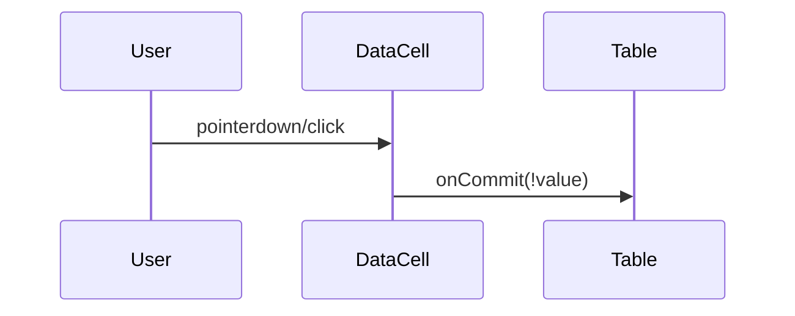
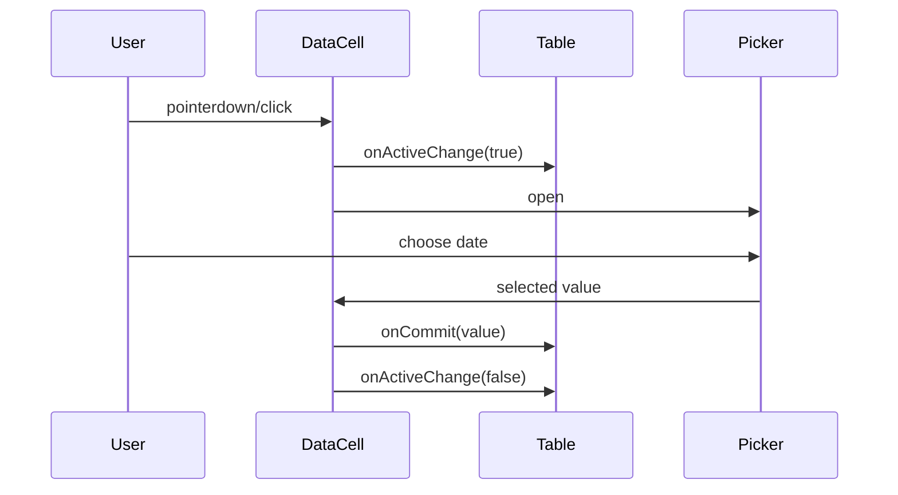

# DataCell and JSON Table Pure Gesture Blueprint

## Purpose

This blueprint replaces the current split activation model with a simpler
model: `DataCell` owns the whole primitive-cell gesture. `json-table` owns only
table state, schema meaning, virtualization, and document commits.

The target interaction is:

```txt
click text where the user wants the caret
  -> the same DataCell becomes editable
  -> caret appears at that visual point
  -> typing inserts at that point
```

No table-layer caret math. No table-layer event-tail repair. No display/edit
geometry drift. A table shell may activate the cell only when the event target
misses the `DataCell` itself, such as a click on empty cell chrome.

## Verdict

The current implementation has not reached the platonic ideal.

The reason is precise: primitive interaction is still divided between table
session code and `DataCell` control code. That split forces repair logic. A
perfect primitive cell should not need the table to own pointer coordinates,
own text drafts, or reopen overlays.

The platonic shape is:

```txt
json-table
  -> render a primitive DataCell
  -> track which field is active
  -> commit final JSON values

DataCell
  -> own primitive display
  -> own primitive activation
  -> own primitive draft
  -> own primitive overlay
  -> emit final primitive values
```

Anything else is bloat unless it is required for non-primitive structured
editing.

## Diagnosis

The current architecture is conceptually bloated because one user gesture is
split across too many owners:

```txt
table cell pointerdown
  -> json-table starts edit session
  -> React replaces display DataCell with edit DataCell
  -> DataCell focuses input
  -> DataCell estimates caret from stored coordinates
  -> browser finishes mouseup/click against a changing target
  -> json-table owns draft
  -> DataCell owns blur commit
  -> json-table closes session
```

That is why the bug is hard to see cleanly. The native browser text interaction
cannot happen naturally because the real input is not the pointer target when
the gesture begins. We then emulate the native behavior after the fact.

The bloat is not file count. The bloat is ownership ambiguity:

- `json-table` starts primitive editing.
- `DataCell` tries to place the caret.
- CSS owns the trompe-l'oeil.
- draft lives above the input.
- the activation event is split between old and new DOM.

The pure architecture removes that ambiguity.

## Layer Diagram



The green layer is the primitive owner. The blue table layer may identify a
cell and request activation, but it must not own primitive draft, caret,
overlay, or activation-tail behavior. The purple layer is the explicit
exception for structured object and array editors.

## First Principle

A primitive cell is not a table concern.

For primitive values, `json-table` should render a `DataCell` and provide:

- value
- kind
- editability
- active identity
- commit callback
- lifecycle callback

`json-table` should not know how a text caret is placed, how a checkbox toggles,
how a select opens, or how a date picker survives the pointer gesture.

`DataCell` is the trompe-l'oeil. If that is true, then `DataCell` must own both
the visual display and the edit control that replaces it.

## Non-Negotiables

- There is one primitive gesture owner: `DataCell`.
- There is one primitive draft owner: the active `DataCell`.
- There is one primitive overlay owner: the active `DataCell`.
- There is one text geometry contract shared by display and edit surfaces.
- `json-table` never passes pointer coordinates to primitive controls.
- If a pointer/click lands on table chrome instead of the `DataCell`,
  `json-table` may request `active=true`; it must not calculate text geometry.
- `json-table` never stores primitive text drafts.
- `json-table` never stores primitive overlay-open state.
- `json-table` never special-cases primitive click tails.
- Native browser behavior is preferred over synthetic reconstruction.
- Pretext is a fallback for text geometry, not an architectural crutch.

## Pure Ownership

### `json-table` Owns

- row and column projection
- schema metadata
- field identity
- virtualization
- active cell identity
- document mutation
- commit normalization at the JSON boundary
- keyboard navigation between cells

### `json-table` Does Not Own

- primitive pointer activation
- primitive caret placement
- primitive draft text
- primitive display/edit geometry
- checkbox toggling mechanics
- select opening mechanics
- date/time picker gesture mechanics

### `DataCell` Owns

- display rendering
- edit rendering
- display-to-edit transition
- pointer activation for primitive controls
- keyboard activation inside a focused primitive cell
- text draft while editing
- first-click caret placement
- browser activation-tail protection
- checkbox semantics
- select/picker opening semantics
- blur/enter/escape edit lifecycle

### `DataCell` Does Not Own

- JSON paths
- schema traversal
- table navigation
- row virtualization
- document mutation
- cross-cell session policy

## New Mental Model

There is no separate display component and active component for primitive cells.
There is one primitive component:

```tsx
<DataCell
  kind="text"
  value={value}
  editable
  active={activeCellId === cellId}
  onActiveChange={(active) => setActiveCell(active ? cellId : null)}
  onCommit={(value) => commitField(fieldPath, value)}
/>
```

`DataCell` is always the same owner before and after activation. It may render
a display span, an input, a checkbox, a trigger, or a popover internally, but
the parent does not orchestrate primitive activation.

## State Shape

### Table State

The table active state should be identity-only:

```ts
type JsonTableActiveCell = {
  docId: string
  fieldPath: string
} | null
```

The table should not store primitive draft value, pointer coordinates, overlay
open state, or activation intent for DataCell-backed fields.

Structured cells may still need richer table-owned state because object and
array editors are table-specific. That state should not leak into primitive
cells.

Structured cells represent that state explicitly:

```ts
type JsonTableActiveCell =
  | JsonTablePrimitiveActiveCell
  | JsonTableStructuredEditSession

type JsonTablePrimitiveActiveCell = {
  cellId: JsonTableCellId
  docId: string
  fieldPath: string
}

type JsonTableStructuredEditSession = {
  id: number
  cellId: JsonTableCellId
  docId: string
  fieldPath: string
  intent: JsonTableActivationIntent
  isOverlayOpen: boolean
}
```

Primitive and structured editing should not share a bloated session type.

### DataCell State

Each active primitive `DataCell` owns:

```ts
type DataCellEditState = {
  draftValue: string
  isOverlayOpen: boolean
  activation: DataCellActivation | null
}
```

This state exists only while the cell is active. Inactive cells are display-only
and cheap.

`activation` is internal to `DataCell` for normal display-surface gestures. It
is a short-lived record captured from the actual display surface:

```ts
type DataCellActivation =
  | {
      type: "pointer"
      caretOffset?: number
    }
  | {
      type: "keyboard"
      initialDraft?: string
    }
```

## Gesture Contract

### Pointer Activation

`DataCell` receives pointer events on its own display surface.

For text:

1. `DataCell` handles `pointerdown`.
2. It records the display text node and pointer coordinates while the display
   DOM still exists.
3. It asks the browser for native caret placement when possible.
4. It activates itself through `onActiveChange(true)`.
5. When the input mounts, it focuses and applies the captured caret.
6. It protects the caret through the gesture tail if needed.

The table only sees:

```txt
onActiveChange(true)
```

The table must not observe, transform, or replay the pointer event for primitive
editing. The event belongs to the primitive component.

### Click Fallback

`DataCell` also handles `click` as a fallback activation event. This is not a
second architecture; it is the same gesture owner accepting a less specific
browser event. A short-lived guard prevents the normal `pointerdown -> click`
sequence from toggling booleans twice or opening overlays twice.

`json-table` has one allowed fallback: if the target is the table-cell shell and
not `[data-slot="data-cell"]` or `[data-slot="input-control"]`, it may request
primitive activation. That covers cell chrome, accessibility test drivers, and
synthetic click-only environments. It must not calculate text caret geometry
for DataCell-owned clicks.

For boolean:

1. `DataCell` handles pointer activation.
2. It commits the toggled boolean.
3. It does not need a long-lived edit session.

For select/date/time:

1. `DataCell` handles pointer activation.
2. It becomes active.
3. It opens its overlay.
4. It owns overlay close and commit semantics.

### Keyboard Activation

The table may move focus between cells. Once a primitive `DataCell` has focus,
`DataCell` owns primitive keyboard behavior:

- `Enter` or `F2` activates text/number editing.
- printable text starts text editing with replacement semantics.
- printable number starts number editing when valid.
- `Space` toggles boolean or opens select/date controls.
- `Escape` cancels active draft or closes overlay.

The table may still own grid-level keyboard navigation when no cell is active.

Printable-key replacement semantics belong to `DataCell`, not table sessions.
The table can focus a cell; the cell decides whether the key starts a local
draft.

## Text Caret Strategy

The pure strategy is not "estimate from the mounted input." It is "capture the
display text hit while the display text still exists."

Fallback chain:

```txt
native caretPositionFromPoint / caretRangeFromPoint on display text
  -> Pretext measured grapheme hit-test on display geometry
  -> linear fallback
```

The important difference from the current architecture is that this logic lives
inside `DataCell`, next to the display DOM it is measuring.

`json-table` never passes `clientX` to `DataCell`.

If the browser can place the caret natively, use that. The best possible
implementation is not the cleverest text measurement algorithm. It is avoiding
measurement because the browser already knows the rendered text.

Pretext remains valuable for cases where native caret APIs are unavailable or
unreliable. It should be isolated behind a tiny helper that returns a UTF-16
offset for `setSelectionRange`.

## Geometry Contract

Display and edit must share one text box contract.

There should be one internal element or style recipe that defines:

- height
- padding
- font
- line height
- letter spacing
- text alignment
- overflow behavior
- placeholder behavior

Display text and input text must use that same contract.

Current drift:

```txt
display: div > span > span.truncate
edit:    Input wrapper > input
```

Target:

```txt
DataCellTextBox
  -> display text surface
  -> input surface
```

Both surfaces share the same metrics. If the display is truncated, hit-testing
must clamp to visible text. If the input scrolls, the input owns that after
activation.

The geometry contract is part of correctness, not styling polish. If display
and edit have different padding, line height, font, truncation, or text
alignment, first-click caret placement is already compromised.

## Component Boundaries

### `DataCell`

Public primitive API:

```ts
type DataCellProps = {
  kind: DataCellKind
  value: DataCellValue
  editable?: boolean
  active?: boolean
  onActiveChange?: (active: boolean) => void
  onCommit?: (value: DataCellCommitValue, meta: DataCellValueMeta) => void
}
```

The table-facing API deliberately has no `draftValue` and no `isPickerOpen` for
primitive table use. Those concepts are internal primitive state.

`activationIntent` is an implementation escape hatch for controlled activation
from table chrome or keyboard focus. It is not a table draft channel, and it
must not be used for ordinary DataCell display clicks.

Implementation modules:

```txt
data-cell.tsx                 public router
data-cell-types.ts            public types
data-cell-text.tsx            text display/edit gesture
data-cell-number.tsx          number display/edit gesture
data-cell-boolean.tsx         checkbox display/edit gesture
data-cell-select.tsx          select display/edit gesture
data-cell-picker.tsx          date/time display/edit gesture
data-cell-text-hit-test.ts    native/pretext/linear caret placement
data-cell-metrics.ts          shared display/input geometry classes
data-cell-format.ts           primitive formatting/parsing
```

### `JsonTablePrimitiveCell`

The table primitive wrapper should be thin:

```tsx
function JsonTablePrimitiveCell(props) {
  return (
    <DataCell
      kind={dataCellKind}
      value={dataCellValue}
      editable={isEditable}
      active={isActive}
      onActiveChange={setThisCellActive}
      onCommit={commitThisField}
    />
  )
}
```

It may adapt schema values to DataCell values, but it may not own primitive
draft or activation events.

Allowed responsibilities:

- derive `DataCellKind` from field metadata
- adapt JSON values into primitive values
- adapt primitive commits into JSON commits
- pass active identity down
- request table active identity changes

Forbidden responsibilities:

- handling primitive `pointerdown` inside `DataCell`
- calculating text caret offsets
- storing primitive draft values
- storing primitive overlay-open state
- stopping primitive activation-tail events

### `JsonTableStructuredCell`

Structured object/array editing remains table-owned. It is not a primitive
DataCell concern.

## Event Flow

### Text Pointer Edit



### Boolean Pointer Toggle



No table edit session is needed.

### Date Pointer Open



## Performance Contract

Inactive cells remain cheap:

- no input
- no select list
- no calendar
- no draft state
- no layout measurement

Only the interacted `DataCell` performs gesture work.

The expensive path is bounded to one active cell:

- native caret hit-test once per pointer activation
- Pretext fallback only when needed
- one mounted input
- one local draft
- one overlay at most

Virtualized rows should receive only `active` identity changes. They should not
rerender because a primitive draft changes; draft is local to the active
DataCell.

## What This Deletes

The pure cutover should remove:

- table-owned primitive `draftValue`
- table-owned primitive `isOverlayOpen`
- table-owned primitive `activationIntent` for normal DataCell display clicks
- primitive fields in a shared table edit session
- `flushSync` as the normal pointer activation mechanism; it may still be used
  narrowly to finish a previous mounted primitive editor before a different
  cell handles the same user gesture
- table pointer handlers that intercept events inside `DataCell`
- table repair logic for primitive activation tails
- duplicated display/edit text geometry
- primitive draft/parsing branches in `EditableJsonTableCell`
- primitive draft commit parsing in the virtualized table

The table may keep richer edit state only for structured cells.

Deletion is the proof. If the old concepts still exist under new names, the
architecture has not changed.

## Migration Plan

1. Split table active state into primitive identity and structured editor state.
2. Introduce controlled `active` / `onActiveChange` to `DataCell`.
3. Move text pointer activation and caret capture into `DataCell`.
4. Move primitive draft state from `json-table` into active `DataCell`.
5. Move select/date overlay-open state into `DataCell`.
6. Create one shared `DataCellTextBox` geometry contract for display and input.
7. Replace primitive `JsonTableActiveCell` with a thin
   `JsonTablePrimitiveCell`.
8. Keep structured object/array editor on the table-owned path.
9. Delete primitive activation intent from the shared table session.
10. Delete table primitive pointer handlers for events inside `DataCell`; keep
    only a shell fallback for table chrome.
11. Delete table primitive draft parsing.
12. Add browser integration tests for first-click caret on real mounted table
    cells.

No backward compatibility layer. The old split gesture model should disappear.

## Implementation Order

Build the cutover from the inside out:

1. Make standalone `DataCell` perfect for text pointer activation.
2. Make standalone `DataCell` own primitive draft and overlays.
3. Prove standalone `DataCell` interactions in browser tests.
4. Thin `JsonTablePrimitiveCell` until it is only an adapter.
5. Delete primitive session fields from the table.
6. Run table browser interaction tests against the real docs/demo surface.

Do not start by adding more table repair code. That is the path that created
the current ambiguity.

## Regression Checklist

Text:

- first click activates text edit
- caret lands at clicked visual character boundary
- typing inserts at caret
- typing does not replace the whole value unless activation came from a
  printable keyboard key
- blur commits once
- `Enter` commits once
- `Escape` cancels draft and closes edit
- rapid same-cell clicks keep the draft
- clicking another cell commits the current draft before switching

Number:

- first click activates number edit
- typing edits the existing value when pointer-activated
- printable numeric key activation starts replacement draft
- invalid browser number states do not commit garbage
- blur commits once

Boolean:

- first click toggles exactly once
- no persistent edit session is created
- keyboard space toggles exactly once

Select and date/time:

- first click opens overlay
- activation click tail does not close overlay
- choosing an option commits once
- outside click closes correctly
- escape closes correctly

Table:

- only one active primitive cell at a time
- active primitive draft does not rerender inactive rows
- virtualized active cell survives normal scroll bounds
- unmounting active row commits or cancels according to explicit policy

Architecture:

- no primitive `activationIntent` prop in `JsonTablePrimitiveCell`
- no primitive `activationIntent` prop for normal DataCell display clicks
- no primitive `draftValue` stored in table state
- no primitive `isOverlayOpen` stored in table state
- no table `pointerdown` branch that steals events from nested DataCells
- no `flushSync` needed for normal primitive activation
- synchronous previous-editor finish exists only for cross-cell handoff
- no table-level primitive activation-tail handler
- display and edit text share one geometry module
- primitive DataCell tests pass outside json-table
- json-table primitive tests assert behavior, not implementation details

## Success Criteria

The design is successful when a text cell can be understood in one sentence:

> The table renders a DataCell; the DataCell handles the click, edits locally,
> and tells the table when a JSON value has changed.

That is the pure boundary.

The implementation has reached the platonic ideal only when the answer to each
question is "no":

- Does the table know a primitive pointer coordinate?
- Does the table know a primitive text draft?
- Does the table know whether a primitive picker is open?
- Does a normal primitive text click need `flushSync` to feel native?
- Does first-click caret placement depend on table code?
- Do display and edit text have separate metric definitions?
- Is there more than one path for primitive commit semantics?

Until then, the component is still carrying bloat.
