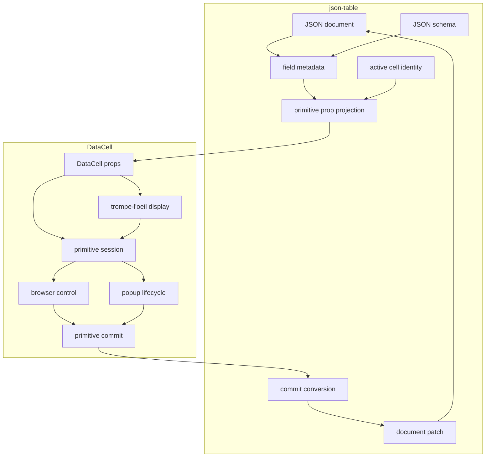
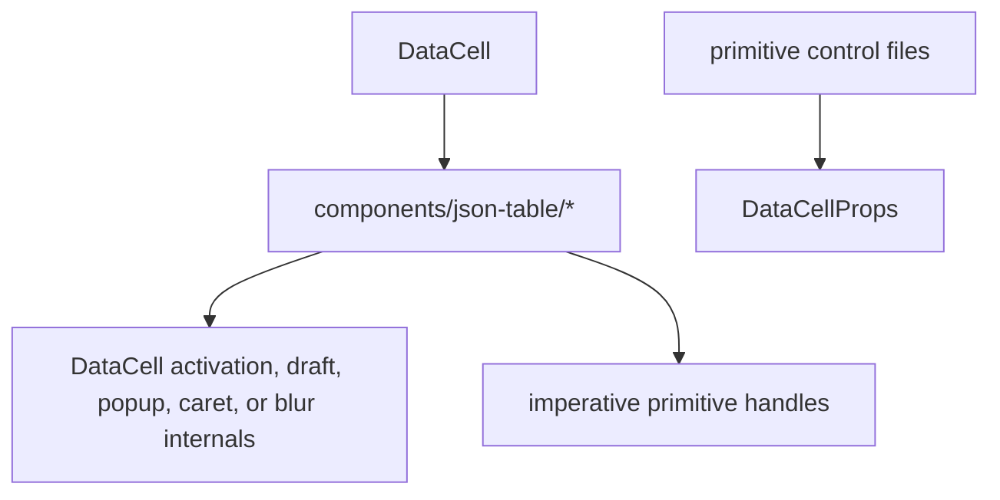
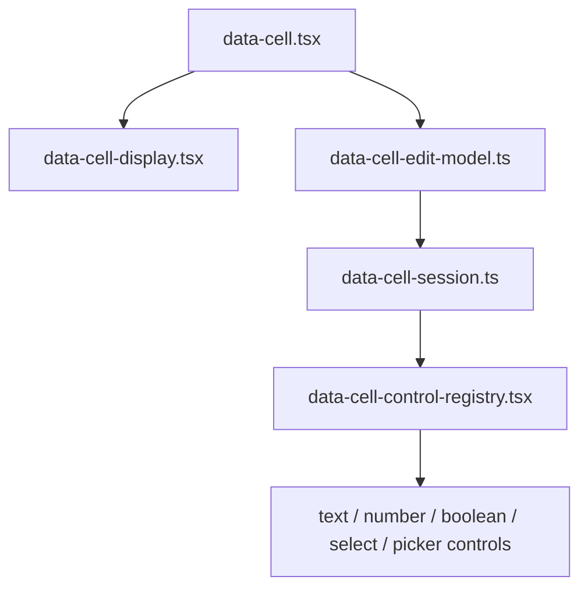

# DataCell JSON Table Pure Primitive Contract Blueprint

## Verdict

Not yet.

The architecture is much cleaner than the earlier versions:

- `DataCell` no longer imports json-table code.
- json-table no longer calls imperative primitive editor handles.
- `DataCellEditorHandle`, `onEditorHandleChange`, and
  `json-table-primitive-handoff.ts` are gone.
- enum now flows through the same `DataCell` select primitive as other scalar
  values.
- internal control props no longer extend broad native React input, button, or
  div prop bags; controls receive the normalized `DataCellEditorProps` surface.

But the platonic version is stricter than "works well". It has one boundary, one
session concept, one identity model, and no timing folklore. The current design
is close, but still has one clear imperfection:

- draft and open are still partly exposed as public controlled-state callbacks,
  which is probably correct, but it means the public API still distinguishes
  lifecycle commands from controlled browser state notifications.

The next step is not another compatibility layer. It is compression.

## North Star

`DataCell` is the trompe-l'oeil primitive.

json-table is a JSON projection and persistence adapter.

That is the whole architecture.

```txt
json-table owns:
  JSON document
  JSON schema
  field metadata
  visible rows and columns
  active cell identity
  primitive prop projection
  primitive commit to document patch

DataCell owns:
  inert display illusion
  activation from pointer and keyboard
  draft state
  browser control focus
  caret placement
  checkbox/select/picker behavior
  popup lifecycle
  commit/cancel/blur semantics
  editing end notification
```

A behavior belongs to `DataCell` if the same behavior is expected when the
component is rendered outside a table.

A behavior belongs to json-table only if it needs JSON identity, schema identity,
row identity, virtualization state, or document patching.

## Ideal Data Flow

There should be exactly one primitive path.

```txt
JSON document + JSON schema
  -> field metadata
  -> primitive props
  -> DataCell session
  -> primitive commit value
  -> JSON commit conversion
  -> document patch
```



Forbidden arrows:



## Public Primitive Contract

The public `DataCell` contract should stay small and declarative:

```ts
type DataCellBaseProps<Kind extends DataCellKind> = {
  kind: Kind
  value?: DataCellValueForKind<Kind>
  editable?: boolean
  active?: boolean
  disabled?: boolean
  name?: string
  autoFocus?: boolean
  onActiveChange?: (active: boolean) => void
  onCommit?: (
    value: DataCellCommitValueForKind<Kind>,
    meta: DataCellValueMeta
  ) => void
  onEditingEnd?: () => void
}
```

Kind-specific props are allowed only when they are primitive facts:

- text, number, integer: placeholder and optional controlled draft;
- select: options, placeholder, display formatter, optional controlled open;
- date, time, date-time: timezone, picker icon, display formatter, optional
  controlled draft/open;
- displayable kinds except boolean: `formatValue`.

The public contract must not expose:

- JSON paths;
- schema objects;
- row or table identity;
- activation requests;
- imperative editor handles;
- mode aliases;
- lifecycle methods that normal consumers should never call.

## json-table Primitive Contract

json-table should pass one small model into primitive cells:

```ts
type JsonTablePrimitiveCellProps = {
  effectiveValue: unknown
  fieldMetadata: FieldMetadata
  isActive: boolean
  isEditable: boolean
  onActiveChange: (active: boolean) => void
  onCommit: (value: unknown, meta: DataCellValueMeta) => void
  onEditingEnd: () => void
}
```

Everything else is projection before `DataCell`:

- choose `DataCellKind` from field metadata;
- convert JSON values to primitive values;
- build enum options;
- preserve nullable enum sentinel semantics;
- format display labels;
- convert primitive commit values back to JSON values.

json-table must not know:

- how text caret hit testing works;
- how first-key editing works;
- how checkbox toggling works;
- how select or picker opening is timed;
- how primitive draft state is stored;
- whether blur commits, cancels, or just ends editing.

## Internal DataCell Layers

The ideal internal stack is five layers with one-way dependencies.



Responsibilities:

- `data-cell.tsx`: public active/editable state, activation routing, display vs
  control switch;
- `data-cell-display.tsx`: inert visual illusion only;
- `data-cell-edit-model.ts`: normalize public props into internal primitive
  model fields;
- `data-cell-session.ts`: draft, dirty check, commit-once, cancel-once,
  finish-once, editing-end semantics;
- `data-cell-control-registry.tsx`: kind dispatch and activation policy;
- control files: render one browser primitive and call session verbs.

Control files should not import `DataCellProps`.

Control files should not extend broad native prop bags.

Control files should receive only:

```txt
kind
value
draftValue
disabled
name
placeholder
className
autoFocus
activationSource
editorProps
kind-specific primitive props
session verbs
```

## Primitive Session Contract

The central simplification is a single named primitive session.

```ts
type DataCellSession<Value, CommitValue> = {
  kind: DataCellKind
  initialValue: Value
  draftValue: Value
  activationSource?: DataCellActivationSource
  isDirty: boolean
  isFinished: boolean
  setDraftValue(value: Value, meta: DataCellValueMeta): void
  commit(value: CommitValue, meta: DataCellValueMeta): void
  cancel(): void
  finish(): void
  end(): void
}
```

The verbs must mean the same thing for every primitive:

- `setDraftValue`: update the primitive draft without ending editing;
- `commit`: persist one primitive value once;
- `cancel`: discard the draft once;
- `finish`: apply the primitive's end rule once, then end;
- `end`: notify the owner that editing is over.

Controls should not each invent their own lifecycle vocabulary.

Current status: complete at the primitive-control layer.
`data-cell-session.ts` exists and owns the commit/cancel/end/reset invariant for
text, number, integer, boolean, select, and picker controls. `DataCellControl`
creates the session at the registry boundary and passes a small command surface
to primitive controls. Controls still own their browser mechanics and local
draft/open state, but the internal contract names those surfaces explicitly as
`draft` and `openState`. Controls no longer receive raw `onCommit` or
`onEditingEnd`, keep separate `didFinishEditingRef` state, call `onEditingEnd`
directly, carry a generic session type parameter, or receive loose
`draftValue`/`onDraftValueChange` pairs.

## Active Identity Semantics

`active` must be enough to control editing.

```txt
active false -> true:
  mount one primitive session
  preserve activation source
  focus the browser control when appropriate

active true -> false:
  finish or cancel according to the primitive rule
  unmount the primitive session
  never require the table to call a primitive method
```

Same-event switching is solved by identity, not handles:

```txt
new cell becomes active
old cell later emits onEditingEnd
table clears active identity only if old identity is still current
```

This keeps json-table responsible for identity and `DataCell` responsible for
primitive lifecycle.

## Blur Policy

Blur is a primitive end signal, not a timing escape hatch.

Correct behavior:

- dirty text blur commits once;
- unchanged text blur ends once without a duplicate commit;
- Enter commits once;
- Escape cancels once;
- old-cell blur after a new cell activates cannot deactivate the new cell;
- select and picker popups own their own outside-click dismissal;
- a pointer-opened input cannot lose the opening interaction to its own click
  tail.

The old text-control-only pointer blur timeout has been removed. Text now uses
the same centralized opening context as select and picker:

```txt
if pointer activation mounted the input
and the same opening click sequence blurs that input
and the draft still equals the initial value
then the centralized opening context classifies the blur as opening-tail
and the text control ignores it
```

Current status:

- no local `setTimeout` in the text control;
- no local `isOpeningPointerBlurRef`;
- unchanged opening blur is ignored;
- dirty opening blur still commits once;
- opening policy is centralized in `data-cell-activation.ts`.
- text releases opening classification after the opening microtask; select and
  picker retain click-tail protection for popup opening.

The final theoretical replacement is pure session identity:

```txt
blur event carries session identity
finish applies only if that session is still current
opening click tail cannot finish a newer session
```

No control should need a standalone timeout to remain correct.

## Implementation Order

### 1. Freeze Architecture Guards

Architecture tests should reject:

- `registry/new-york-v4/ui/data-cell*` importing `components/json-table/*`;
- json-table importing DataCell activation internals;
- public `DataCellProps` containing `mode`;
- public `DataCellProps` containing `activationRequest`;
- public `DataCellProps` containing editor handles;
- primitive controls importing `DataCellProps`;
- primitive controls extending broad native React prop bags;
- primitive controls containing JSON, schema, row, path, sentinel, or patch
  vocabulary.

### 2. Extract `data-cell-session.ts`

Move lifecycle invariants into one internal module:

- initial value capture;
- draft updates;
- dirty calculation;
- commit-once guard;
- cancel-once guard;
- finish-once guard;
- unmount/deactivation finish behavior;
- editing-end notification.

The controls should become thin renderers.

Current status: complete. Text, number, integer, boolean, select, and picker all
route their editing lifecycle through the session created by `DataCellControl`.

### 3. Replace Click-Tail Blur Timing With Session Identity

Remove the local text-control timing guard only after tests prove:

- first pointer click activates and places caret;
- same opening pointer sequence cannot immediately end the new session;
- dirty blur still commits once;
- same-event cell switching preserves the next cell's interaction.

Current status: complete for local timing removal. The text control now delegates
opening-tail classification to `useDataCellOpeningContext`, and architecture
tests reject `setTimeout`, `document.addEventListener`, and
`isOpeningPointerBlurRef` in the text control.

### 4. Compress Control Props Again

After session extraction, control props should stop receiving lifecycle callbacks
directly. They should receive a session object or a tiny session command surface.

Target:

```txt
current:
  public props expose controlled draft/open callbacks where needed; the internal
  control props receive `draft`, `openState`, and session verbs

ideal:
  public controlled state remains public only when it is necessary; internal
  controls receive named state surfaces and session verbs
```

Current status: lifecycle compression complete. Raw lifecycle callbacks are no
longer part of primitive control props. The session command surface is exact,
not generic. Draft/open callbacks remain outside the session because they are
controlled browser-state notifications, not lifecycle commands, but the internal
control boundary now receives them as `draft` and `openState` objects rather
than loose callback props.

### 5. Keep json-table As Projection And Commit

json-table primitive files should contain only:

- active identity;
- effective value lookup;
- schema-to-primitive projection;
- primitive-to-JSON commit conversion;
- document patch boundary;
- virtualization elevation for focused rows.

No primitive browser mechanics belong there.

## Interaction Checklist

The final tests should prove:

- hover mounts no browser control;
- first click on text activates and places the caret at the clicked grapheme;
- first printable key starts text editing with the expected insertion contract;
- same-cell click does not discard draft state;
- dirty text blur commits once;
- unchanged text blur ends once;
- Enter commits once;
- Escape cancels once;
- parent echoes do not overwrite active dirty drafts;
- checkbox first click toggles once;
- checkbox remains keyboard accessible;
- enum first click opens the select;
- enum option click commits once;
- enum nullable sentinel commits the correct JSON value;
- select opening click does not immediately close the popup;
- date first click opens the picker;
- active date input and inactive date display use visually compatible formats;
- picker outside click commits or cancels according to the primitive contract;
- switching dirty text to text commits old draft and preserves new click intent;
- switching dirty text to select commits old draft and opens new select;
- switching select to text closes old select and places new caret;
- virtualized unmount finishes dirty primitives once;
- table active identity is not cleared by stale `onEditingEnd` from an old cell.

## Performance Checklist

The pure architecture is also the fast one:

- inactive cells render display only;
- hover does not mount controls;
- exactly one active primitive mounts a browser control;
- select and picker popups mount only when open;
- projection allocates only visible-cell primitive props;
- active identity changes do not force table-wide rerenders;
- commit conversion does not reproject the whole document;
- tests and profiles lock the interaction budget.

Required verification:

```bash
pnpm verify:data-cell
pnpm verify:data-cell-registry
pnpm exec vitest run $(rg --files tests | rg 'json-table.*\.test\.(ts|tsx)$|data-cell.*\.test\.(ts|tsx)$') --reporter=dot
pnpm exec tsc --noEmit --pretty false --skipLibCheck --incremental false
PROFILE_URL=http://localhost:3100/json-table-profile pnpm profile:json-table-primitives
```

Latest known clean checks for this architecture slice:

```bash
pnpm exec vitest --run tests/data-cell-control-lifecycle.test.tsx tests/data-cell-select-activation.test.tsx tests/data-cell-select-state.test.tsx tests/data-cell.test.tsx tests/json-table-architecture.test.ts --reporter=dot
# 5 files, 95 tests passed

pnpm exec vitest run $(rg --files tests | rg 'json-table.*\.test\.(ts|tsx)$|data-cell.*\.test\.(ts|tsx)$') --reporter=dot
# 34 files, 444 tests passed

pnpm verify:data-cell
# passed

pnpm exec tsc --noEmit --pretty false --skipLibCheck --incremental false
# passed

node scripts/build-registry-items.mjs data-cell
# passed

pnpm verify:data-cell-registry
# passed
```

## Completion Definition

The component reaches the ideal when this statement is true:

```txt
DataCell can be rendered anywhere as a standalone primitive trompe-l'oeil, and
json-table can use it only by projecting JSON into props and persisting commits,
without knowing primitive implementation details beyond active identity and
commit callbacks.
```

The architecture is still not ideal if:

- `DataCell` imports json-table code;
- json-table imports DataCell internals;
- json-table owns enum, select, picker, checkbox, caret, blur, or draft behavior;
- controls import public `DataCellProps`;
- controls receive broad native prop bags;
- lifecycle correctness depends on local timing guards;
- the public primitive API exposes implementation handles.

The final shape is:

```txt
one primitive component
one projection boundary
one active identity
one primitive session
one commit boundary
zero handles
zero table-owned primitive mechanics
zero timing folklore
```
