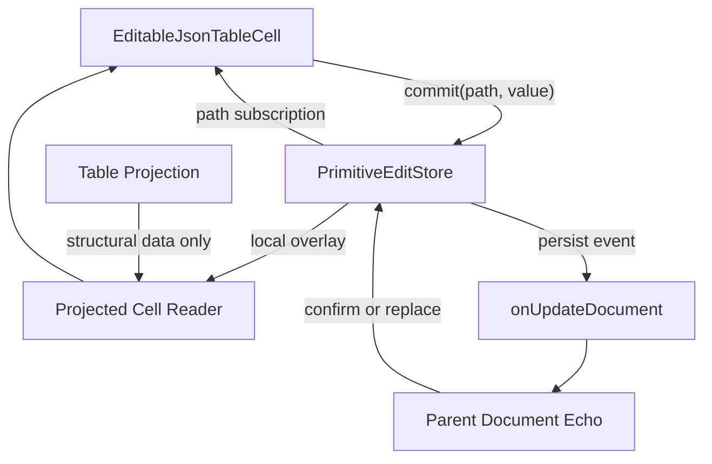

# DataCell JSON Table Remaining Platonic Perfection Blueprint

## Current State

The primitive JSON table path is now measured and materially faster.

- Primitive commits for enum, text, number, date, and boolean persist exactly one document patch.
- Primitive commits render only the target `EditableJsonTableCell`; table, row, and virtualizer render work stays out of the commit path.
- Hover, open, date month navigation, and checkbox interactions are covered by the profiler gate.
- The DataCell control registry is cleaner, with exact control state and kind-specific props.
- Registry output can be rebuilt through a scoped `data-cell` path.

The remaining coordination gap has now been cut down substantially:

- `JsonTablePrimitiveEditStore` owns scalar edit lifecycle with explicit `idle`, `pending`, `confirmed`, and `stale` states.
- Parent document echo reconciliation lives behind that store contract.
- `SingleFileTableView` no longer imports scalar document registration helpers or knows about registered scalar data.
- The expensive projection subtree receives stable callback wrappers, so unrelated parent callback identity churn does not render JSON table components.
- `DataCellKindModel` is the canonical kind/value/commit map for public props, display props, control state, and edit-model base state.
- The profiler now covers cancel, blur commit, select close, date outside close, repeated text commit, parent document echo through real commits, keyboard activation, pointer activation, and parent callback churn.
- Scoped DataCell registry output has a two-run determinism verifier.

This is much closer to the ideal. Any remaining work should be justified by fresh profiler evidence or a smaller public API.

## Goal

Reach the simplest complete primitive editing architecture:

- One commit pipeline.
- One external-store contract.
- One echo-reconciliation rule.
- One naming system for editor state.
- One typed boundary between DataCell, JSON table cells, and persistence.
- One profiler gate that proves every important interaction invariant.

The final result should feel obvious in hindsight: every module owns one job, every state value has one source, every name maps to exactly one concept, and every performance promise is executable.

## Non-Goals

- Do not rewrite virtualization.
- Do not add compatibility aliases.
- Do not preserve old vocabulary through adapters.
- Do not add a second optimistic update system.
- Do not broaden the public DataCell API.
- Do not chase micro-timing thresholds before structural invariants are perfect.
- Do not solve unrelated dirty-tree changes.

## Remaining Problems

### 1. Commit Coordination Still Has Too Many Moving Parts

Current commit flow uses:

- `primitiveEditStore`
- `documentDataRef`
- parent `onUpdateDocument`

Each piece has a reason, but the reader has to understand all of them to prove why one scalar commit does not rerender the table.

Ideal:

- A scalar commit writes to one authoritative primitive edit store.
- Persistence observes or receives the same commit event.
- Parent document echoes are reconciled by the store, not by table-view memo special cases.
- The projected cell reads from one canonical local overlay.

Success criteria:

- Remove table-view scalar echo suppression or move it behind the primitive store contract. Done.
- `SingleFileTableView` does not need to know about registered scalar document data. Done.
- There is one place to read the rule: "a parent data echo that matches a pending scalar edit confirms it and does not invalidate table projection." Done.
- The commit flow can be explained in three steps. Done: cell commits to the store, the virtualized table persists one document patch, the table wrapper reconciles the parent echo through the store.

### 2. Memo Discipline Is Still A Hidden Contract

Current behavior depends on stable parent callbacks and exact memo comparators.

Ideal:

- The primitive edit path does not depend on parent callback identity for render isolation.
- Memo comparators enforce structural boundaries, not business rules.
- A changed parent prop cannot accidentally break scalar commit isolation unless it truly changes table structure.

Success criteria:

- Add tests that intentionally change unrelated parent callback identities and prove scalar commits remain target-scoped. Done through the profiler `parent-callback-churn` scenario.
- Move any business-specific skip logic out of React memo comparators. Done for scalar document echo handling.
- Keep memo comparators shallow, boring, and structural. Done for the projection subtree comparator.

### 3. DataCell Types Are Cleaner But Not Yet Inevitable

The current DataCell API still has grouped union shapes for related primitive kinds, especially date/time/date-time and number/integer.

Ideal:

- Public props, display props, edit model, and control props share one canonical kind-to-value map.
- Unions are derived from that map instead of manually shaped in each file.
- Adding a primitive kind requires editing the canonical map and one implementation module.

Success criteria:

- Introduce a single `DataCellKindModel` type map. Done.
- Derive `DataCellProps`, `DataCellDisplayProps`, `DataCellControlState`, and edit-model base values from it. Done.
- Remove repeated hand-written kind/value unions. Done on the public, display, and control-state boundaries.
- Keep runtime code just as direct as today. Done.

### 4. The External Store Boundary Needs A Formal Contract

The primitive patch store works, but the architectural contract is still implicit.

Ideal:

- The store has a small typed API with explicit lifecycle states.
- It owns pending patch, committed echo, stale echo, and rollback semantics.
- It exposes only path-scoped subscriptions to cells.
- It has no React-specific behavior except a tiny hook wrapper.

Success criteria:

- Define store states: `idle`, `pending`, `confirmed`, `stale`. Done.
- Add unit tests for same-value commit, rapid repeated commit, echo confirm, echo mismatch, document replacement, and unmount. Done in `tests/json-table-primitive-edit-store.test.ts`.
- Ensure subscriptions notify only the affected path. Done.
- Ensure no table-level listener exists for scalar edit changes. Done.

### 5. Profiler Coverage Proves Key Paths, Not The Full Surface

The profiler covers the important default and large cases, but not enough edge cases to call the component perfect.

Ideal:

- The profiler covers scalar commit, cancel, blur commit, keyboard activation, pointer activation, repeated edits, and parent echo.
- It distinguishes structural failures from timing variance.
- It emits a compact summary that is easy to review in CI.

Success criteria:

- Add scenarios:
  - text edit then Escape cancel
  - number edit then blur commit
  - select open then Escape close
  - date open then outside click close
  - two rapid commits to the same field
  - parent document echo after commit
  - unrelated parent callback identity churn
  - scalar commit after unrelated parent callback identity churn
- Done in `scripts/profile-json-table-primitive-interactions.mjs`.
- Structural assertions stay strict: target cell only, one patch when committing, zero patches when canceling.
- Timing assertions remain coarse and budgeted only where the DOM/layout cost matters.

### 6. Naming Is Better, But Needs A Final Audit

Known vocabulary goals:

- Use `open` only for primitive editor popups.
- Use `active` only for edit-session ownership.
- Use `commit` only for validated value persistence.
- Use `patch` only for local path-scoped overlays.
- Use `document echo` only for parent data returning after persistence.

Ideal:

- Same concept, same name everywhere.
- Different concept, different name everywhere.
- No historic names remain in tests, profiler, registry output, or helper files.

Success criteria:

- Add a design vocabulary section to the DataCell/JSON table blueprint.
- Run explicit `rg` guards for banned names and ambiguous names.
- Rename any remaining `pending`, `optimistic`, or `patch` variables that do not match their exact lifecycle.

### 7. Generated Artifacts Are Scoped But Not Fully Quiet

Scoped `data-cell` registry build exists, but the surrounding worktree still shows broad generated churn from unrelated components.

Ideal:

- A DataCell-only source change produces a DataCell-only generated diff.
- Generated output is deterministic over repeated runs.
- Registry commands make accidental broad rebuilds difficult.

Success criteria:

- Add a verification command that runs `pnpm registry:build:items data-cell` twice and checks for no second diff.
- Document when broad `registry:build` is allowed.
- Keep DataCell changes out of unrelated generated registry files.

## Target Architecture



The table owns structure. The primitive store owns scalar edit lifecycle. The cell owns interaction. Persistence owns durable document updates. No layer borrows another layer's job.

## Implementation Phases

### Phase 1. Name The Contract

- Rename `JsonTablePrimitivePatchStore` to `JsonTablePrimitiveEditStore` if the store owns lifecycle beyond patches. Done.
- Define the exact store API before changing callers. Done.
- Document the lifecycle states beside the store implementation. Done through exported snapshot states.
- Add store-only unit tests. Done.

### Phase 2. Pull Echo Logic Into The Store

- Move scalar document echo registration out of `SingleFileTableView`. Done.
- Let the store reconcile parent document data by path and value. Done.
- Remove table-view awareness of scalar patch registration. Done.
- Keep parent table memo comparators structural only. Done for the projection subtree.

### Phase 3. Derive DataCell Types From One Map

- Add one canonical kind model. Done.
- Derive display, control, edit, and public prop types from it. Done for the public props, display props, control state, and edit-model base.
- Remove repeated manual union definitions. Done on the main kind/value surfaces.
- Keep control modules small and kind-specific. Preserved.

### Phase 4. Harden Parent-Churn Isolation

- Add a profile/test harness that changes unrelated parent callback identities during scalar commit. Done through the profile-only callback churn trigger.
- Assert the scalar commit still renders only the target cell. Existing scalar commit assertions remain strict.
- Remove any accidental dependency on callback identity for performance correctness. Done for `onUpdateDocument`, hover callbacks, and `setSchema` through stable wrappers.

### Phase 5. Expand Profiler Scenarios

- Add cancel, blur, close, repeated commit, and parent echo scenarios. Done.
- Keep the JSON report compact. Preserved.
- Fail on structural invariant regressions. Done.
- Avoid narrow timing failures except for explicit DOM/layout budgets. Preserved.

### Phase 6. Final Naming And Artifact Audit

- Run vocabulary guards over `components`, `registry`, `tests`, `scripts`, and `public/r/data-cell.json`.
- Run scoped registry build twice and confirm deterministic output. Done through `pnpm verify:data-cell-registry`.
- Update the blueprint with final measured results. Done after implementation.

## Verification

Baseline gates:

```bash
pnpm typecheck
pnpm test tests/json-table-boolean-enum-interactions.test.tsx tests/json-table-session-virtualization-hardening.test.tsx tests/json-table-session-interactions.test.tsx tests/json-table-architecture.test.ts tests/json-table-picker-interactions.test.tsx tests/json-table-primitive-edit-store.test.ts tests/json-table-controller.test.tsx tests/json-table-row-render.test.tsx tests/json-table-text-number-interactions.test.tsx
pnpm profile:json-table-primitives
pnpm registry:build:items data-cell
pnpm verify:data-cell-registry
```

Additional gates to add:

```bash
rg "onPickerOpenChange|isPickerOpen|pickerOpen|activationModel|DataCellControlActivationModel|as DataCell.*ControlProps" components registry/new-york-v4/ui tests scripts public/r/data-cell.json
rg "optimistic|pending|patch|echo" components/json-table registry/new-york-v4/ui/data-cell* tests/json-table-* scripts/profile-json-table-primitive-interactions.mjs
```

The second command is not a forbidden-word gate. It is an audit list: every match must use the exact lifecycle vocabulary defined by the store contract.

## Definition Of Done

- One primitive edit store owns scalar edit lifecycle.
- Parent document echo reconciliation lives behind that store contract.
- Table memo comparators are structural and boring.
- DataCell kind/value/control/display types derive from one canonical model.
- Profiler covers commit, cancel, close, repeated edit, parent echo, keyboard activation, and pointer activation.
- Scalar interaction performance is independent of unrelated parent callback identity churn.
- Vocabulary is exact across components, tests, scripts, and generated DataCell registry output.
- Scoped registry output is deterministic over repeated runs.
- The component is smaller or equal in public API size, easier to explain, and at least as fast on every measured path.

## Perfection Test

A new engineer should be able to answer these questions by reading one file per layer:

- Where does a primitive scalar edit live before persistence confirms it?
- What clears that edit?
- Why does the table not rerender?
- Which value type belongs to each DataCell kind?
- Which profiler assertion would fail if the invariant regressed?

If any answer requires tracing through incidental memo logic or historic naming, the component has not reached the platonic ideal.
