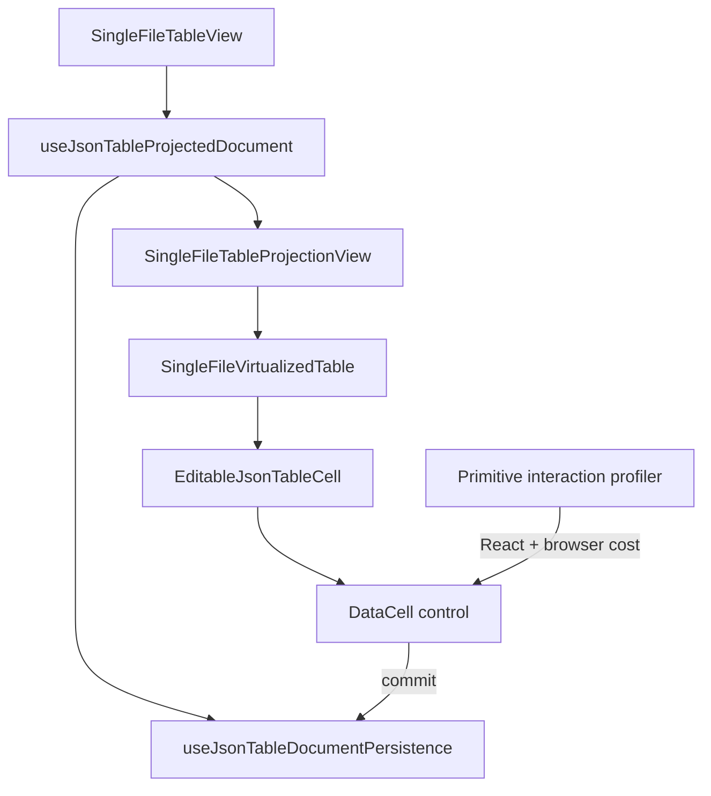

# DataCell JSON Table Terminal Platonic Perfection Blueprint

## Verdict

Not yet platonic.

The component is now architecturally strong:

- primitive commits enter one local edit-store boundary
- `SingleFileVirtualizedTable` no longer owns primitive echo bookkeeping
- projected row sharing is pure and directly tested
- parent callback churn renders zero JSON table components
- scalar commits render only the target `EditableJsonTableCell`

The remaining gap is no longer the original whole-table rerender bug. It is the
last layer of perfection:

- overlay interactions are still dominated by browser style recalculation
- the wrapper/projection/echo boundary is correct but still mentally dense
- the persistence bridge exists because parent document state is asynchronous
  and echo-based
- editor open/close still produces local `EditableJsonTableCell.same-props`
  renders
- the surrounding worktree is noisy enough that the component's final diff does
  not yet look calm

This blueprint is about terminal polish: fewer reasons to think, fewer local
renders, clearer names, and a profiler story that explains every remaining
millisecond.

## Current Evidence

Latest profiler evidence from `tmp/json-table-primitive-interactions-profile.json`:

Default profile:

- `parent-callback-churn`: `0` renders
- `open-enum`: `4` renders, dominant cost `style`, about `90ms` style
- `close-select-with-escape`: `6` renders, dominant cost `style`, about `135ms`
  style
- `open-date-picker`: `2` renders, dominant cost `style`, about `92ms` style
- `open-and-commit-date`: `8` renders, dominant cost `style`, about `182ms`
  style

Large profile:

- `parent-callback-churn`: `0` renders
- `open-enum`: `4` renders, dominant cost `style`, about `372ms` style
- `close-select-with-escape`: `6` renders, dominant cost `style`, about `566ms`
  style
- `open-date-picker`: `2` renders, dominant cost `style`, about `382ms` style
- `open-and-commit-date`: `8` renders, dominant cost `style`, about `750ms`
  style

The conclusion is precise: React table rerendering is not the bottleneck.
Browser style recalculation is.

## Goal

Reach the final form of the component:

- primitive interactions stay target-scoped
- overlay open/close does less browser work
- wrapper ownership reads linearly
- persistence semantics are explicit without cleverness
- local same-props editor renders are either eliminated or proven necessary
- every name maps to exactly one concept
- the final diff is small, calm, and reviewable

The result should be simpler than today. A solution that adds a second state
machine, compatibility path, or generic framework is disqualified.

## Non-Goals

- Do not rewrite virtualization.
- Do not replace the whole DataCell system.
- Do not add feature flags.
- Do not delay commits or hide work behind timers.
- Do not broaden public props.
- Do not optimize by weakening accessibility.
- Do not touch unrelated dirty files except to separate or protect this work.

## Issue 1. Overlay Style Recalculation Is The Remaining Speed Ceiling

### Problem

The profiler says overlay paths are style dominated. This is true even when
React work is small and table/row renders are zero.

Likely sources:

- popup portal mount/unmount invalidates broad style scope
- table hover/focus styles are being recalculated with overlay state changes
- calendar/select DOM insertion causes global selector matching
- focus transitions trigger additional style work
- CSS selectors may be broader than the mounted primitive needs

### Target

Overlay open/close should have bounded style recalculation and DOM churn.

The target is not "zero" browser work. The target is proportional browser work:
opening a select or date picker should not scale with the size of the table.

### Plan

1. Add profiler fields for style scope diagnosis:
   - active stylesheet count
   - popup subtree node count
   - table subtree node count
   - focused element before/after
   - hover/active cell count before/after
2. Add a scenario that opens the same primitive after scrolling far into the
   large table. Compare style cost with top-of-table open.
3. Add a scenario that opens an inert overlay shell with no options/calendar.
   This isolates portal/focus cost from control DOM cost.
4. Inspect selectors used by DataCell display, popup, calendar, table row hover,
   and fixed-grid viewport.
5. Replace broad or inherited selectors with tighter slot-local classes where
   measurable.
6. Keep accessibility intact:
   - focus moves correctly
   - Escape dismisses
   - outside pointer dismisses
   - calendar/select roles remain correct

### Success Criteria

- Large `open-enum` style duration drops materially or is proven to be browser
  baseline with an inert overlay.
- Large `open-date-picker` style duration drops materially or is attributed to
  calendar DOM with a numeric comparison.
- Overlay open/close cost no longer scales with table size if the overlay DOM is
  constant.
- Profiler report includes enough data to explain the remaining style cost
  without manually inspecting Chrome DevTools.

## Issue 2. Wrapper Boundary Is Correct But Too Dense

### Problem

`SingleFileTableView` owns too many adjacent concepts:

- stable parent callbacks
- primitive edit store creation
- persistence bridge creation
- parent document echo reconciliation
- projected document preservation
- header/projection orchestration in the memoized child

This is correct, but a reader still has to hold several moving parts in their
head to prove why a parent echo does not invalidate projection.

### Target

The wrapper reads as three named operations:

1. own primitive state
2. reconcile document input
3. render projected table

### Plan

1. Extract a hook:

   ```ts
   useJsonTableProjectedDocument({
     document,
     primitiveEditStore,
     persistenceBridge,
   })
   ```

   It returns:

   ```ts
   {
     projectedDocument,
     primitiveEditStore,
     persistence
   }
   ```

2. Move document-id reset and echo suppression into that hook.
3. Keep `SingleFileTableView` as a declarative shell:
   - create stable callbacks
   - call the hook
   - render `SingleFileTableProjectionView`
4. Add unit tests for the hook or an architecture test proving:
   - same-document primitive echo preserves projected document
   - same-document authoritative data replaces projected document
   - document-id change resets primitive edit state

### Success Criteria

- `SingleFileTableView` has no inline `if (previousDocumentIdRef...)` block.
- The document echo rule has one named owner.
- A reader can explain projection preservation by reading one hook.

## Issue 3. Persistence Bridge Needs A Sharper Name And Contract

### Problem

`useJsonTablePrimitivePersistenceBridge` owns both primitive persistence and
generic structured document data changes. That is accurate but slightly
misnamed: it is not only primitive persistence.

### Target

Name the module after its actual job: table document persistence with primitive
echo marking.

### Plan

1. Rename the hook to `useJsonTableDocumentPersistence`.
2. Rename returned callbacks:
   - `persistPrimitiveCommit`
   - `persistStructuredValueChange`
   - `reconcilePrimitiveDocumentEcho`
   - `resetDocumentData`
3. Keep `recordDocumentEcho` private to the hook.
4. Keep `SingleFileVirtualizedTable` unaware of echo vocabulary.
5. Update tests and architecture guards to use the new vocabulary.

### Success Criteria

- No production file uses the vague word `Bridge` for document persistence.
- `primitive` appears only where echo semantics are primitive-specific.
- Structured value changes do not mark primitive document echoes.
- The virtualized table still has no echo vocabulary.

## Issue 4. Local Same-Props Renders Need A Verdict

### Problem

Profiler output still reports local `EditableJsonTableCell.same-props` renders
during editor open/close. They are target-scoped, but they are aesthetically
suspect.

Possible explanations:

- internal state changes inside the active cell are recorded as same-props
  renders
- activation source changes are not captured by changed-prop labeling
- editor handle changes trigger active-cell-local renders
- focus/open transitions intentionally render the same cell multiple times

### Target

Either eliminate same-props renders or make them named and intentional.

### Plan

1. Improve render profiler attribution for `EditableJsonTableCell`:
   - include active-cell store snapshot version
   - include primitive edit snapshot version
   - include local activation source state changes
   - include control open state changes
2. Add a focused scenario for open-only, close-only, commit-only after already
   open, and cancel-only after already open.
3. For each same-props render, classify it as:
   - active cell ownership
   - control state
   - focus handoff
   - external store snapshot
   - unknown
4. Remove any unknown render source.
5. If a render is necessary, rename the profiler bucket from `same-props` to the
   real local cause.

### Success Criteria

- No profiler output says `EditableJsonTableCell.same-props` unless it is truly
  impossible to attribute.
- Open/close render counts do not increase.
- Any remaining repeated target-cell render has a named cause.

## Issue 5. The Final Diff Must Be Quiet

### Problem

The surrounding worktree contains many unrelated modifications. That does not
make the component wrong, but it prevents a clean judgment of finality.

Platonic code should be reviewable as a calm diff: source, tests, generated
artifact, profiler output, blueprint.

### Target

Separate the DataCell/JSON table perfection diff from unrelated dirty files.

### Plan

1. Produce a scoped status list for this component:
   - `components/json-table/**`
   - `registry/new-york-v4/ui/data-cell*`
   - `public/r/data-cell.json`
   - `scripts/profile-json-table-primitive-interactions.mjs`
   - `tests/json-table-*`
   - relevant `design/data-cell-json-table-*`
2. Identify unrelated dirty files and leave them untouched.
3. If committing, stage only the component-scoped files unless the user asks for
   the whole tree.
4. Add a final diff summary grouped by:
   - runtime architecture
   - tests
   - profiler
   - generated registry
   - blueprint

### Success Criteria

- The component diff is explainable in under one minute.
- No unrelated schema-editor, viewer, or docs changes are needed to justify this
  component's state.
- Generated registry output corresponds to source changes.

## Target Architecture



The wrapper owns document projection policy. Persistence owns document writes
and primitive echo marking. The virtualized table owns viewport work. The cell
owns local interaction. The profiler explains both React and browser cost.

## Implementation Phases

### Phase 1. Profiler Attribution

- Add same-props cause attribution.
- Add inert overlay shell scenario.
- Add scrolled-large overlay scenario.
- Keep all existing profiler assertions strict.

### Phase 2. Overlay Style Audit

- Inspect CSS selectors and popup/calendar DOM.
- Tighten selectors where measurable.
- Compare inert overlay, select overlay, and date overlay.
- Preserve accessibility behavior.

### Phase 3. Wrapper Compression

- Extract `useJsonTableProjectedDocument`.
- Rename persistence bridge to document persistence.
- Add hook-level or architecture tests for echo/projection rules.
- Keep `SingleFileVirtualizedTable` echo-blind.

### Phase 4. Same-Props Render Elimination

- Use attribution from Phase 1.
- Remove unknown same-props renders.
- Rename necessary local causes in profiler output.
- Assert no unexplained local renders.

### Phase 5. Quiet Diff Audit

- Run scoped status.
- Separate unrelated work.
- Rebuild scoped registry.
- Update final blueprint with measured before/after numbers.

## Verification

Baseline correctness:

```bash
pnpm typecheck
pnpm test tests/json-table-boolean-enum-interactions.test.tsx tests/json-table-session-virtualization-hardening.test.tsx tests/json-table-session-interactions.test.tsx tests/json-table-architecture.test.ts tests/json-table-picker-interactions.test.tsx tests/json-table-primitive-edit-store.test.ts tests/json-table-projected-row-sharing.test.ts tests/json-table-controller.test.tsx tests/json-table-row-render.test.tsx tests/json-table-text-number-interactions.test.tsx
pnpm test tests/json-table-text-number-hardening.test.tsx tests/json-table-value-normalization-hardening.test.tsx tests/json-table-session-race-interactions.test.tsx tests/json-table-picker-overlay-hardening.test.tsx tests/json-table-virtualization-stress-hardening.test.tsx
pnpm verify:data-cell-registry
```

Profiler gate:

```bash
PROFILE_URL=http://localhost:3100/json-table-profile pnpm profile:json-table-primitives
```

Architecture guards:

```bash
rg "recordDocumentEcho|reconcileDocumentData|primitivePersistenceBridge|setValueAtMaterializedPath|onUpdateDocument" components/json-table/single-file-virtualized-table.tsx
rg "fallbackJsonTablePrimitiveEditStore|primitiveEditStore\\?:|primitivePatch|PrimitivePatch|PendingPrimitive|projected-cell-patch|json-table-primitive-patch-store" components/json-table tests registry/new-york-v4/ui public/r/data-cell.json
rg "EditableJsonTableCell.same-props" tmp/json-table-primitive-interactions-profile.json
```

The first two should return no runtime violations. The last should eventually
return no unexplained matches.

## Definition Of Done

- Large-profile overlay style cost is reduced or explained by an inert-overlay
  baseline.
- `SingleFileTableView` delegates document echo/projection policy to one named
  hook.
- Document persistence naming exactly matches its responsibility.
- `SingleFileVirtualizedTable` remains echo-blind.
- No unexplained `EditableJsonTableCell.same-props` render bucket remains.
- Profiler output explains React cost and browser cost without manual DevTools
  work.
- The final component diff is scoped and reviewable.
- All correctness, architecture, registry, and profiler gates pass.

## Perfection Question

The component reaches the platonic ideal only when these answers are immediate:

- Why did this interaction render?
- Why did this interaction spend browser time?
- Which module owns the parent document echo?
- Which module owns projected document preservation?
- Which module owns overlay DOM and focus behavior?
- Which files changed, and why exactly those files?

If any answer requires tracing incidental refs, generic bridge names, or
unexplained same-props render buckets, the component is still excellent but not
perfect.
