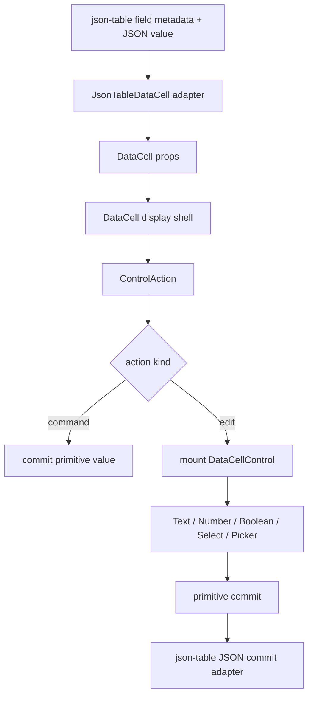
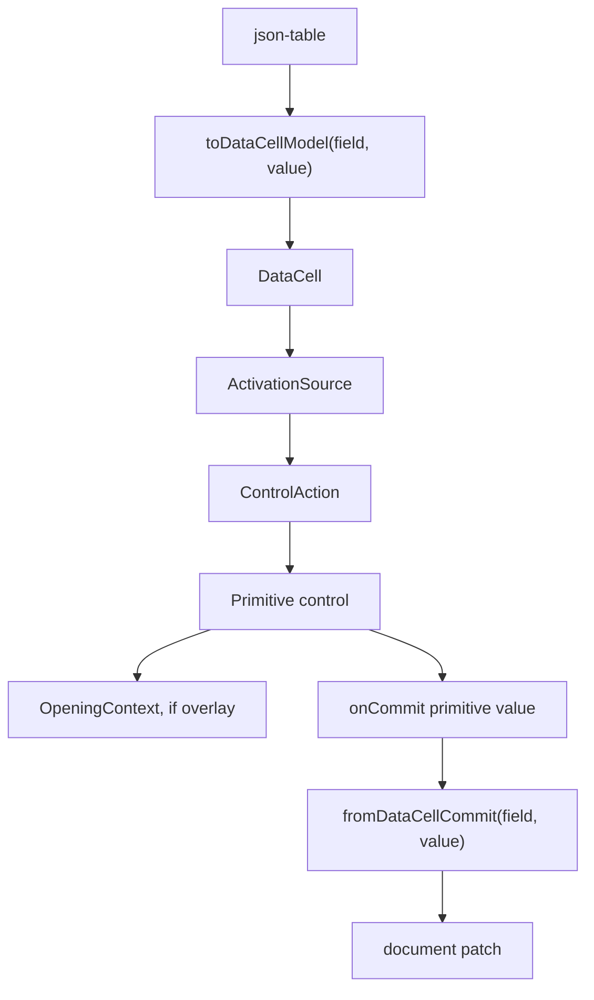

# DataCell and JSON Table Terminal Purity Blueprint

## Verdict

Not yet platonic.

The architecture has crossed the important threshold:

- `DataCell` is the primitive trompe-l'oeil.
- `json-table` no longer owns enum editor behavior.
- select, date/time, text, number, and boolean route through the primitive cell
  system.
- overlay opening survival is centralized behind `OpeningContext`.
- table code preserves JSON meaning without owning primitive UI mechanics.

The remaining gap is no longer a broken delegation. It is terminal cleanup:

> the system has the right layers, but a few layers still carry more vocabulary
> and surface area than their responsibilities require.

The final architecture should feel almost mechanical. `json-table` should adapt
schema/value meaning into one `DataCell` call. `DataCell` should activate a
display illusion into one control. Each control should own only native behavior.
The activation primitive should explain browser event ordering once.

## One-Sentence Target

Make `json-table -> DataCell -> control` a single, narrow pipeline where every
piece of complexity has one owner, one name, and one reason to exist.

## First Principles

### DataCell Is The Trompe-l'oeil

`DataCell` should be usable everywhere without the caller caring whether the
currently visible thing is display chrome or a mounted editor.

It owns:

- inert display surface
- editable focus frame
- direct pointer, click, and keyboard activation
- active/display transition
- activation source creation
- edit-session lifetime
- primitive control selection
- commit/cancel/finish routing

It does not own:

- JSON schema
- JSON path identity
- enum identity preservation
- table focus policy
- structured object or array editing
- data normalization rules that only exist because the caller is JSON

### JSON Table Owns JSON Meaning

`json-table` should be primitive-blind after adaptation.

It owns:

- field metadata interpretation
- mapping schema kinds to `DataCell` kinds
- JSON value projection into primitive values
- JSON value reconstruction on commit
- active primitive identity
- table shell activation
- structured object and array editing

It does not own:

- select open state
- option focus timing
- date picker lifecycle
- caret placement
- checkbox timing
- overlay dismissal survival

### Controls Own Native Reality

Controls own the browser mechanics that cannot be abstracted away honestly:

- text owns caret placement and drafts
- number/integer own numeric drafts and validity
- boolean owns command semantics
- select owns option rendering and option commit
- date/time owns picker geometry and date/time commit

Controls may translate DOM or library events into domain vocabulary. They should
not decide global activation survival policy.

## Current Shape



This is fundamentally correct. The remaining problem is that some boxes are too
wide:

- `JsonTableDataCell` mixes display formatting, JSON enum identity, commit
  reconstruction, and component rendering.
- `DataCellActivationSource` exposes `eventType`, a raw browser detail, through
  the public activation type.
- `DataCell` still has a `didActivateBeforeClickRef` click-tail guard separate
  from the activation module.
- source and registry artifact parity still depends on generated output staying
  synchronized.
- some names still describe implementation mechanics instead of domain roles.

## Ideal Shape



In the ideal shape:

- the table adapter is pure and testable
- `JsonTableDataCell` renders one model, not many branches of meaning
- `DataCell` does not leak browser event names through public types
- click-tail suppression and opening-event ownership are one activation concept
- controls never call token internals directly
- generated registry artifacts are verified as part of the architecture contract

## Final Vocabulary

Keep exactly these primitive words:

- `DataCellModel`: the caller-side value/control description for one cell
- `ActivationSource`: why a cell became active
- `ActivationToken`: ownership of the opening browser event and its tail
- `OpeningContext`: mounted overlay survival policy
- `ControlAction`: what activation asks the primitive to do
- `EditSession`: mounted editor lifetime
- `Commit`: primitive value leaves the control
- `Dismiss`: editing ends without a value commit

Avoid these words in primitive runtime code:

- `intent`
- `request`
- `outcome`
- `programmatic`
- `skip`
- `delay`
- `timer`
- raw browser event names in exported activation data

Structured JSON editing may keep separate activation vocabulary because it is a
different domain. Primitive editing should have one vocabulary.

## Target Module Boundaries

```txt
registry/new-york-v4/ui/
  data-cell.tsx
    DataCell shell, display/edit switch, activation dispatch, commit routing

  data-cell-activation.ts
    ActivationSource, ActivationToken, OpeningContext, click-tail ownership

  data-cell-control-contract.ts
    ControlAction and control adapter types

  data-cell-control-registry.tsx
    kind -> control adapter

  data-cell-display.tsx
    inert display trompe-l'oeil only

  data-cell-text-control.tsx
    native text input, caret, text draft lifecycle

  data-cell-number-control.tsx
    number/integer activation grammar

  data-cell-boolean-control.tsx
    checkbox display and toggle command

  data-cell-select-control.tsx
    select trigger, option popup, option commit

  data-cell-picker-control.tsx
    date/time trigger, popup lifecycle, picker commit

components/json-table/
  json-table-data-cell-model.ts
    pure schema/value -> DataCell props model
    pure DataCell commit -> JSON value

  json-table-display-cell.tsx
    render the model, no JSON identity algorithms inline

  json-table-primitive-activation.ts
    table shell -> DataCell ActivationSource only
```

## Target JSON Table Adapter

`json-table` should have one pure adapter that turns JSON meaning into
`DataCell` meaning.

```ts
type JsonTableDataCellModel = {
  kind: DataCellKind
  value: DataCellValue
  displayValue?: string
  selectOptions?: DataCellSelectOption[]
  className: string
  commit: (value: DataCellCommitValue) => unknown
}
```

The exact type can be smaller. The requirement is that enum identity, nullable
sentinels, date normalization, number normalization, and display text live in
one table-owned adapter, not interleaved with rendering.

This keeps the boundary precise:

- table adapter knows JSON
- `DataCell` knows primitive editing
- select control knows select UI

## Target Activation Primitive

The activation module should own both event-tail survival and click-tail
suppression.

Current impurity:

- `ActivationToken` owns the opening event tail
- `OpeningContext` owns overlay dismissal survival
- `DataCell` separately keeps `didActivateBeforeClickRef`
- shell activation exposes `eventType`

Target:

```ts
type DataCellActivationSource =
  | { kind: "pointer"; token: DataCellActivationToken; point: DataCellPoint }
  | { kind: "keyboard"; key: string }
  | { kind: "shell"; token: DataCellActivationToken; release: "microtask" | "click-tail" }
```

The exact shape can differ. The important change is semantic:

- no exported `eventType`
- no local click-tail guard in `DataCell`
- one activation function answers whether a follow-up click should be ignored
- one opening context answers whether a dismiss should be cancelled

## Target DataCell Shell

`DataCell` should read as a three-state protocol:

```txt
display
  -> receive pointer/click/key
  -> ask control registry for ControlAction
  -> command commits immediately
  -> edit stores ActivationSource and enters edit

edit
  -> render selected control
  -> pass ActivationSource

finish
  -> clear ActivationSource
  -> leave edit
```

Anything that does not fit those three steps belongs in the control registry,
activation module, or a control.

## Target Control Contract

The control contract should remain small:

```ts
type DataCellControlAction =
  | { kind: "none" }
  | { kind: "command"; shouldPreventDefault: boolean; commit: CommitFn }
  | { kind: "edit"; shouldPreventDefault: boolean; activationSource: ActivationSource }
```

Do not add a generic state machine. The browser already supplies the state
machine for native inputs, select widgets, focus, blur, and keyboard events.
The architecture should name the few events that cross component boundaries,
not abstract every local behavior.

## Interaction Contract

These behaviors define correctness:

- first click on a text cell mounts an input and places the caret at the clicked
  grapheme offset
- typing after pointer activation inserts at the caret, not as replacement
- printable key activation intentionally starts a replacement draft
- blur after text/number editing commits the current draft once
- Enter commits text/number and exits edit
- Escape cancels text/number without committing
- first click on a select cell opens the popup
- option click commits the original primitive value once
- nullable enum option commits JSON `null`
- object/array enum options preserve JSON identity through the table adapter
- select outside pointer dismisses without commit
- select Escape dismisses without commit
- opening click does not immediately close select
- date click opens the picker with display text matching the trigger state
- opening click does not immediately close the picker
- date selection commits normalized JSON date format
- time editing commits normalized JSON time format
- picker outside pointer dismisses without commit
- boolean pointer toggles exactly once
- Space on boolean toggles exactly once
- shell activation never requires double click for primitive controls

## Architecture Contract

The final architecture must satisfy:

- no enum-specific editor component in `json-table`
- no select/date/text control imports inside `json-table`
- no `token.ownsEvent` outside `data-cell-activation.ts`
- no `OpeningContext` implementation outside `data-cell-activation.ts`
- no raw `event.type` exported through `DataCellActivationSource`
- no close timers or delay guards in select or picker
- no `didActivateBeforeClickRef`-style click-tail state inside `data-cell.tsx`
- no `props.kind === ...` branches inside `data-cell.tsx`
- all kind branching in `DataCell` goes through the control registry
- JSON enum sentinels stay table-local
- registry artifact contains every DataCell runtime source file
- registry artifact contains no forbidden legacy vocabulary

## Implementation Plan

1. Extract a pure JSON-table DataCell adapter.
   - Move enum option value mapping out of `json-table-display-cell.tsx`.
   - Move date/time/number commit normalization into pure functions.
   - Make `JsonTableDataCell` render a model instead of owning every branch.

2. Compress activation one final time.
   - Replace shell `eventType` with semantic release policy.
   - Move click-tail suppression out of `data-cell.tsx`.
   - Keep event ownership private to `data-cell-activation.ts`.

3. Keep controls direct.
   - Do not introduce a generic overlay framework.
   - Select and picker should keep local rendering and commit behavior.
   - Both should consume only `OpeningContext` for opening dismissal survival.

4. Tighten architecture tests.
   - Forbid exported `eventType` in activation sources.
   - Forbid click-tail refs in `data-cell.tsx`.
   - Require JSON-table adapter purity with focused tests.
   - Keep registry completeness validation.

5. Verify behavior through user interactions.
   - Run focused DataCell tests.
   - Run the full JSON-table test set.
   - Run caret and select Playwright flows against a healthy dev server.
   - Run DataCell parity and registry validation.
   - Run TypeScript once unrelated dirty-state blockers are removed.

## Non-Goals

- no rewrite of the calendar
- no rewrite of Base UI select
- no table virtualization rewrite
- no structured object/array editor rewrite
- no compatibility adapter
- no feature flag
- no alternative enum editor
- no generic form system

## Completion Criteria

We can call the component platonic only when:

- `json-table` contains one pure DataCell adapter and one rendering path
- `DataCell` contains no primitive-specific rendering or close policy
- activation and opening survival are one private primitive module
- select and picker differ only in UI rendering and commit semantics
- every interaction in this blueprint is integration-tested
- architecture tests forbid the old shapes
- generated registry artifacts are complete and validated
- repo-wide TypeScript is green, or any blocker is explicitly unrelated and
  documented with file-level evidence

The ideal is not zero code. The ideal is irreducible code: no duplicate paths,
no hidden policy, no decorative abstraction, and no second name for the same
thing.
