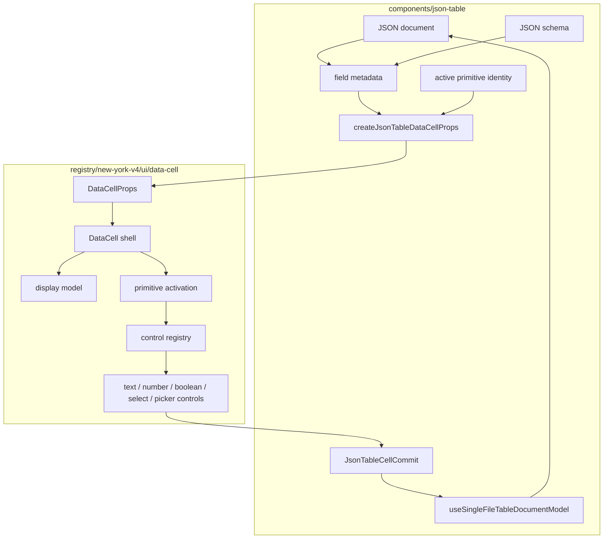
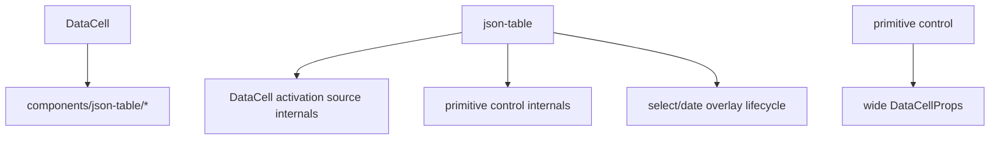

# DataCell JSON Table Total Primitive Boundary Blueprint

## Verdict

Not yet.

The architecture is much cleaner than where it started:

- `DataCell` no longer depends on `components/json-table/*`.
- enum cells now delegate to the primitive select control.
- `JsonTableDataCell` is close to a pure props projection.
- primitive commits cross one table commit boundary.
- activation source constructors are no longer part of the json-table runtime.

But the design is not yet the platonic ideal because the primitive interaction
contract still leaks upward.

The remaining impurity is not JSON projection. JSON projection correctly belongs
to the table. The remaining impurity is control ownership:

```txt
json-table still helps decide when and how a primitive DataCell starts editing.
```

That is the wrong pressure point. If `DataCell` is the trompe-l'oeil, consumers
should be able to place it anywhere and trust it to own primitive interaction.
The table should project JSON into primitive props, track active identity, and
persist commits. It should not understand caret activation, select opening,
picker opening, primitive key activation, or overlay timing.

## First Principles

`DataCell` is the primitive. `json-table` is a document adapter.

The split is exact:

```txt
DataCell owns primitive perception and primitive interaction.
json-table owns JSON identity and document mutation.
```

If a behavior is true for text, number, boolean, select, date, time, or
date-time cells outside a JSON table, it belongs in `DataCell`.

If a behavior requires schema, row identity, materialized paths, nullable enum
sentinels, document patches, virtualization, or pending echo reconciliation, it
belongs in `json-table`.

Everything else is bloat.

## Desired Shape

The terminal architecture is:

```txt
JSON document + schema
  -> field metadata
  -> createJsonTableDataCellProps
  -> <DataCell />
  -> primitive commit value
  -> JsonTableCellCommit
  -> document model
  -> onUpdateDocument
```

There are only two runtime conversations between the table and `DataCell`:

```txt
table -> DataCell: projected primitive props + controlled active identity
DataCell -> table: active change + primitive commit
```

No third conversation should exist unless it can be proven unavoidable by event
ordering.

## Layer Diagram



Forbidden arrows:



## The Remaining Imperfections

### 1. Activation Is Still A Table Concern

The current cut is already better because the table passes a
`DataCellActivationRequest` instead of constructing internal activation sources.
But the request still exposes a primitive concept to the table.

That means the table still knows that:

- a key can activate a primitive editor
- pointer coordinates may matter for text caret placement
- shell-origin activation differs from native DataCell-origin activation

The pure target is different:

```txt
DataCell receives the event on its own surface
DataCell derives activation internally
table only records which cell is active
```

The table may still handle keyboard navigation and structured object/array
sessions, but it should not ask primitive-specific activation questions.

### 2. Previous Editor Handoff Is Still Imperative

`DataCellEditorHandle` exists because React event ordering is real: switching
from one active primitive cell to another may require the previous editor to
finish before the next cell consumes the same user action.

The handle is acceptable only if it remains the only imperative bridge and does
not contain primitive-kind knowledge.

The better target is:

```txt
controlled active true -> false
  -> DataCell finishes synchronously
  -> table does not call a primitive handle
```

This replacement is only valid if it preserves:

- text blur commit ordering
- Escape cancellation
- select option commit
- date picker commit
- first-click activation of the next cell
- no duplicate commit on cell switch

A tiny handle is better than fake declarative purity that breaks ordering.

### 3. The Table Still Imports Primitive Key Policy

The table still needs to know whether a shell key should activate a primitive
cell. If it imports `canActivateDataCellFromKey`, it is depending on primitive
key policy.

The pure target is one of these:

```txt
Option A:
  table focuses the cell
  DataCell handles the key on the DataCell surface

Option B:
  DataCell exposes one generic event classifier
  table asks no kind-specific questions
```

Option A is purer. Option B is acceptable only if virtualization or roving
table focus makes Option A impossible without losing accessibility.

### 4. Public Barrel Still Needs Discipline

The main `@/components/ui/data-cell` path should feel like a primitive
component API, not a toolbox of internals.

The default public surface should be limited to:

```txt
DataCell
DataCellDisplay
DataCellProps
DataCellKind
DataCellValue
DataCellCommitValue
DataCellSelectOption
DataCellEditorHandle
formatDataCellDisplayValue
parseDataCellNumberInput
```

Anything below that line belongs in explicit internal files:

```txt
data-cell-activation
data-cell-control-contract
data-cell-control-registry
data-cell-*-control
```

The table should not import from those internal files.

## Terminal Design

### DataCell Owns

- inactive trompe-l'oeil display
- hover visual state
- pointer activation
- click activation
- keyboard activation when focus is on the DataCell
- text caret placement
- text selection
- boolean toggling
- select opening, navigation, commit, and dismissal
- date/time/date-time picker opening, commit, and dismissal
- popup positioning
- draft state
- blur commit
- Escape cancellation
- no-op primitive commit suppression
- editor lifecycle

### DataCell Exposes

- exact discriminated props by primitive kind
- controlled `active`
- `onActiveChange`
- `onCommit`
- optional `editorHandle` only if controlled deactivation cannot be made exact

### DataCell Does Not Expose

- activation source constructors
- activation tokens
- overlay-open internals
- control registry internals
- concrete controls through the main barrel
- schema, JSON, field path, row id, or sentinel vocabulary

### json-table Owns

- schema traversal
- field metadata
- primitive kind selection
- JSON value to primitive value projection
- nullable enum sentinel projection
- primitive commit value to JSON value reconstruction
- active primitive cell identity
- structured object/array edit sessions
- virtualization
- primitive edit-store pending/confirmed/stale state
- document patching
- parent echo reconciliation

### json-table Does Not Own

- primitive activation source construction
- primitive key policy
- primitive hover behavior
- primitive draft state
- select open/close timing
- picker open/close timing
- text caret hit-testing
- checkbox semantics

## Hard-Cutover Plan

### 1. Make Projection The Only Table-to-Primitive Adapter

`JsonTableDataCell` should remain a one-render component:

```txt
createJsonTableDataCellProps(...)
  -> exact DataCellProps

JsonTableDataCell
  -> <DataCell {...dataCellProps} />
```

Success criteria:

- `json-table-display-cell.tsx` renders one `DataCell`.
- kind branches live in the pure projection model.
- every primitive kind is covered by projection tests.
- enum/null identity reconstruction is covered by tests.

### 2. Eliminate Activation Requests If Event Routing Allows It

Target:

```txt
pointer event lands on DataCell
  -> DataCell activates itself
  -> onActiveChange(true)
  -> table records active identity
```

Keyboard target:

```txt
key event lands on focused DataCell display
  -> DataCell activates itself if the key belongs to the primitive
  -> onActiveChange(true)
  -> table records active identity
```

Success criteria:

- no `DataCellActivationRequest` in `components/json-table/*`
- no primitive key classifier import in `components/json-table/*`
- first-click text caret placement still works
- first-click select open still works
- first-click checkbox toggle still works
- first-key text edit still works
- roving table focus and accessibility still work

If event routing cannot satisfy this, keep the current request API as the one
explicit compromise and guard it as the only activation leak.

### 3. Audit And Either Prove Or Delete `DataCellEditorHandle`

Two acceptable final states exist.

Keep it:

```ts
type DataCellEditorHandle = {
  finish: () => void
  cancel: () => void
}
```

Delete it:

```txt
active true -> false
  -> DataCell finalizes internally before unmount-sensitive state disappears
```

Success criteria:

- no kind-specific table finish logic
- no table-owned primitive draft
- no table-owned primitive overlay state
- switching cells commits previous text exactly once
- switching cells does not swallow the next cell's first click

### 4. Compress The Primitive Control Contract

Primitive controls should not receive wide `DataCellProps`. They should receive
only the kind-specific state they need:

```txt
value
draft
activation
commit
cancel
finish
control refs
```

Success criteria:

- control files import no `DataCellProps`
- control files contain no schema, JSON, table, sentinel, or field vocabulary
- each control file owns exactly one primitive family
- shared control state lives in one small control contract file

### 5. Keep Overlay Performance Primitive-Local

Overlay cost belongs to `DataCell`, not `json-table`.

Measure:

- select popup DOM count
- date picker DOM count
- popup positioning reads
- focus transfer
- dismissal listeners
- portal mount/unmount cost

Success criteria:

- `profile:json-table-primitives` passes
- large-profile date open and commit remain stable
- select and picker interaction tests cover open, commit, Escape, outside
  click, blur, and switching cells

## Test Contract

### Primitive Tests

- first pointer click activates text and places the caret at the clicked
  grapheme
- first printable key starts text editing without replacing the whole value
  incorrectly
- blur commits text once
- Escape cancels text
- checkbox pointer click toggles once
- checkbox Space toggles once
- select first click opens
- select option click commits and closes
- select Escape closes without commit
- date first click opens
- date day click commits and closes
- picker outside click closes according to the primitive contract
- active-to-inactive transition finishes exactly once

### Projection Tests

- string schema projects to text props
- number schema projects to number props
- integer schema projects to integer props
- boolean schema projects to boolean props
- enum schema projects to select props
- nullable enum preserves null identity through the sentinel option
- date/time/date-time values format and commit correctly
- no-op commits are suppressed before document persistence

### Integration Tests

- editable table text first-click caret placement
- editable table typing after first click edits in place
- enum select opens on first click
- enum option commit preserves JSON identity
- checkbox toggles on first click
- date picker opens and commits without display-format mismatch
- clicking another cell commits or cancels according to the primitive contract
- scrolling with an active overlay preserves row identity

### Architecture Tests

- `registry/new-york-v4/ui/data-cell*` imports no `components/json-table/*`
- primitive controls import no `DataCellProps`
- primitive controls contain no JSON, schema, sentinel, or table vocabulary
- `components/json-table/*` imports no DataCell activation source internals
- `components/json-table/*` imports no primitive control internals
- `json-table-display-cell.tsx` renders `DataCell` through one props object
- compatibility files stay deleted

## Completion Definition

The goal is reached only when this sentence is true:

```txt
DataCell can be dropped anywhere as a standalone primitive trompe-l'oeil, and
json-table can consume it by projecting JSON into props and persisting commits,
without knowing any primitive implementation detail beyond active identity and
commit.
```

If `json-table` still knows how a select opens, how a caret lands, how a picker
opens, or how a primitive activation source is constructed, the architecture is
not finished.

If `DataCell` knows JSON, schema, field paths, rows, sentinels, or document
patching, the architecture is inverted.

The platonic version has no hidden third path.
