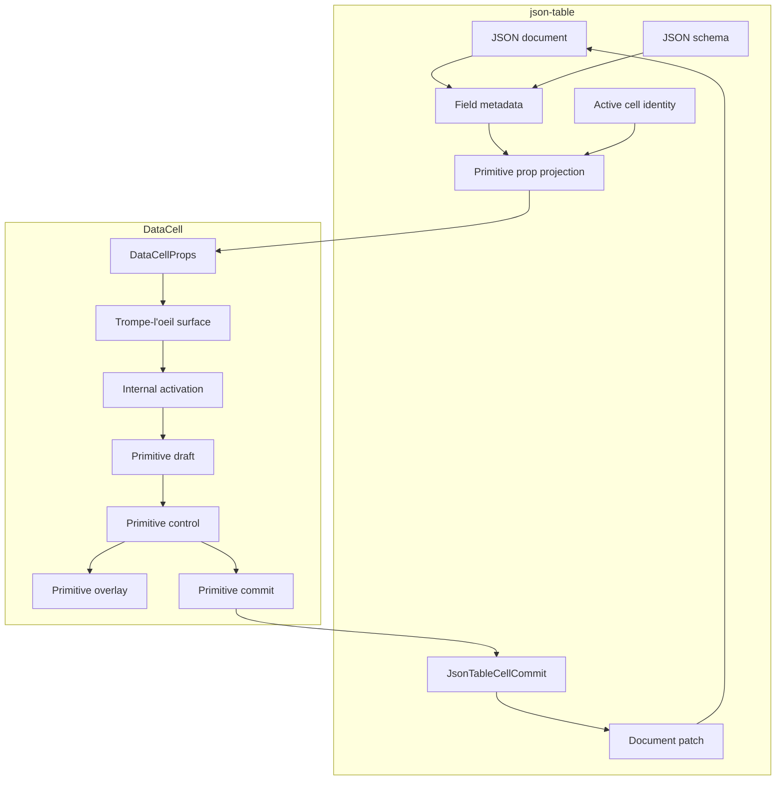
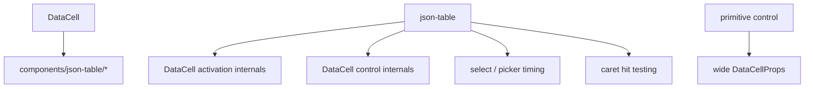

# DataCell JSON Table Total Primitive Boundary Blueprint

## Verdict

Not yet.

The dependency direction is now substantially cleaner:

- `DataCell` does not import `components/json-table/*`.
- json-table enum values go through the same primitive `select` path as scalar
  cells.
- json-table no longer creates or passes `DataCellActivationRequest` values.
- primitive pointer, keyboard, caret, checkbox, select, picker, and overlay
  behavior live inside `DataCell`.
- json-table primitive cells focus the inner `DataCell` surface instead of
  treating the table shell as the primitive control.

That removed the largest architectural inversion.

The remaining imperfection is narrower:

```txt
DataCell still exposes primitive lifecycle implementation details:
DataCellEditorHandle, mode, and active are all public control axes.
```

That means the primitive is close to the right shape, but the public API still
leaks how the illusion is maintained.

## First Principles

`DataCell` is the primitive trompe-l'oeil.

json-table is a document adapter.

The split is strict:

```txt
DataCell owns:
  primitive display
  primitive activation
  primitive draft state
  primitive commit and cancel timing
  primitive blur and outside-click policy
  primitive overlays
  primitive caret placement
  primitive accessibility semantics

json-table owns:
  JSON document identity
  schema interpretation
  field metadata
  active table cell identity
  row and column navigation
  virtualization
  structured object and array editing
  document patching
```

A behavior belongs to `DataCell` when it would still be expected if the same
cell were rendered outside a JSON table.

A behavior belongs to json-table only when it requires JSON paths, schema,
document patches, row identity, structured values, or virtualized table context.

Everything else is excess.

## Terminal Shape

The ideal runtime path is one projection and one commit:

```txt
JSON document + schema
  -> field metadata
  -> createJsonTableDataCellProps
  -> <DataCell />
  -> primitive commit value
  -> JsonTableCellCommit
  -> document patch
  -> JSON document
```

The table has only three conversations with a primitive cell:

```txt
table -> DataCell: primitive props
table -> DataCell: active identity
DataCell -> table: active changes and commits
```

There is no separate conversation for activation source, select timing, picker
timing, checkbox semantics, caret hit testing, blur policy, or overlay lifetime.

## Architecture Diagram



Forbidden arrows:



## Current State

### Already Correct

- `DataCellActivationRequest` is not part of the public primitive API.
- `activationRequest` is not a public `DataCellProps` field.
- json-table does not construct DataCell activation objects.
- enum cells are primitive `select` cells, not a special table-owned editor.
- primitive events target the `DataCell` surface.
- pointer-opened select and picker controls do not immediately close because the
  opening source survives through the document click tail.

### Still Not Ideal

#### 1. `DataCellEditorHandle` Is Public

json-table still imports `DataCellEditorHandle` so it can finish the previous
primitive before activating the next one.

Current reason:

```txt
Same-event cell switching can otherwise reorder blur, active identity changes,
React commits, and unmounts in a way that drops a dirty draft.
```

This is a real browser and React ordering problem, but the public handle is
still an impurity. It lets the table call primitive lifecycle methods directly.

Target:

```txt
active true -> false is enough.
DataCell finishes or cancels itself from controlled active changes.
json-table never holds a primitive editor handle.
```

Fallback if event ordering proves irreducible:

```ts
type DataCellEditorHandle = {
  finish: () => void
  cancel: () => void
}
```

The fallback handle must remain the single documented compromise. It must never
grow kind-specific methods, table-specific methods, schema methods, row methods,
or overlay methods.

#### 2. `mode` And `active` Duplicate State

`DataCell` currently accepts both:

```txt
mode: "display" | "edit"
active: boolean
```

That is two public ways to express one concept.

Target:

```txt
editable: may self-activate
active: is currently editing
disabled: cannot interact
```

`mode` should disappear from the public API unless a concrete non-editing display
mode remains that cannot be expressed by `editable`, `active`, and `disabled`.

Ideal base props:

```ts
type DataCellBaseProps<Kind extends DataCellKind> = {
  kind: Kind
  value?: DataCellValueForKind<Kind>
  editable?: boolean
  active?: boolean
  disabled?: boolean
  name?: string
  autoFocus?: boolean
  onActiveChange?: (active: boolean) => void
  onEditingEnd?: () => void
}
```

#### 3. Control Contracts Are Still Wider Than Necessary

Primitive controls should receive the smallest possible model, not the public
component props.

Target control input vocabulary:

```txt
value
draft
activationSource
disabled
autoFocus
refs
setDraft
commit
cancel
finish
```

Forbidden in primitive control files:

```txt
DataCellProps
JSON
schema
field path
row
table
sentinel
document patch
```

The primitive control layer should be boring. Each control renders one browser
primitive and calls the same lifecycle verbs.

#### 4. json-table Still Has A Primitive Handoff Module

`json-table-primitive-handoff.ts` exists only because the table must finish the
old primitive before the next interaction proceeds.

Target:

```txt
No handoff module.
No primitive editor handle ref.
No flushSync primitive finish call.
```

The table may set active identity. It should not tell a primitive when to finish.

If the handoff stays, the blueprint must say clearly that this is the one known
departure from the ideal and the reason must be preserved in a regression test.

## Hard Cutover Plan

### 1. Prove Or Retire `DataCellEditorHandle`

Create a temporary implementation where controlled `active={false}` causes the
currently active `DataCell` to finish itself before it leaves edit mode.

The experiment must cover:

- text to text cell switching commits the first dirty draft once.
- text to select switching preserves the opening click on the select.
- select to text switching closes the select and activates text exactly once.
- date picker to another primitive closes without duplicate commits.
- Escape cancellation wins over blur commit.
- virtualized unmount finishes or cancels according to the primitive contract.
- parent value echo during edit does not overwrite the local dirty draft.

If the matrix passes, delete:

```txt
DataCellEditorHandle
onEditorHandleChange
json-table-primitive-handoff.ts
primitiveEditorHandleRef
```

If it fails for unavoidable event ordering, keep the tiny handle and add a static
architecture test that enforces its exact shape.

### 2. Collapse `mode` Into `active`

Remove public `DataCellMode`.

Use:

```txt
editable=false active=false: read-only display
editable=true active=false: inactive trompe-l'oeil
editable=true active=true: mounted editor
disabled=true: inert display
```

Update json-table projection so it passes only `editable`, `active`, and
`autoFocus`.

Success criteria:

- no `mode` in public `DataCellProps`.
- no `mode` in json-table primitive projection.
- display-only cells stay cheap.
- inactive editable cells stay focusable.
- active cells preserve current edit behavior.

### 3. Shrink Primitive Control Contracts

Keep public props at the `DataCell` boundary.

Inside `DataCell`, translate public props into kind-specific control contracts:

```txt
TextControlModel
NumberControlModel
BooleanControlModel
SelectControlModel
PickerControlModel
```

Each model should contain only the fields the control reads.

Success criteria:

- control files do not import `DataCellProps`.
- control files do not know json-table vocabulary.
- shared lifecycle verbs have identical names across controls.
- kind-specific fields are local and explicit.

### 4. Reduce json-table To Projection, Identity, Commit

Keep this as the full primitive table contract:

```txt
fieldMetadata
effectiveValue
isEditable
isActive
onActiveChange
onCommit
onEditingEnd
```

Remove or isolate anything else.

Allowed table primitive code:

- choose primitive kind from schema metadata.
- normalize JSON value into a primitive value.
- construct select options.
- map nullable enum sentinel values.
- format primitive display strings when schema requires it.
- reconstruct JSON commit values.
- track which cell is active.
- patch the document.

Forbidden table primitive code:

- activation request construction.
- caret placement.
- first-key text insertion.
- select open or close timing.
- picker open or close timing.
- checkbox toggle semantics.
- primitive overlay dismissal.
- primitive editor lifecycle methods, unless the handle is kept as the documented
  compromise.

### 5. Make Tests Encode The Boundary

Architecture tests must reject regressions:

- `registry/new-york-v4/ui/data-cell*` imports no `components/json-table/*`.
- `components/json-table/*` imports no DataCell activation internals.
- public `@/components/ui/data-cell` exports no activation request type.
- public `DataCellProps` has no `activationRequest`.
- public `DataCellProps` has no `mode` after the cutover.
- json-table files contain no primitive control vocabulary beyond `DataCell`
  props, active identity, and commit.
- primitive control files contain no JSON, schema, row, field path, sentinel, or
  document patch vocabulary.
- if `DataCellEditorHandle` remains, its public type is exactly `finish` and
  `cancel`.

Interaction tests must cover the user-facing contract:

- first click edits text in place and places the caret at the clicked grapheme.
- first printable key edits the current value without replacing it by accident.
- blur commits once.
- Enter commits once.
- Escape cancels once.
- checkbox first click toggles once.
- select first click opens.
- select option click commits once.
- pointer-opened select does not immediately close.
- picker first click opens.
- inactive date display and active date input do not visibly contradict each
  other.
- switching between primitive cells preserves the first interaction on the next
  cell.
- virtualization does not lose active draft state.

## Performance Contract

The ideal architecture should be faster because each layer does less.

Required properties:

- inactive primitive cells render only the trompe-l'oeil display surface.
- editors mount only for active primitive cells.
- popups mount only when open.
- hover does not mount editors.
- json-table does not allocate primitive activation objects.
- json-table does not attach primitive-specific behavior to every cell.
- projection is pure and memoizable by metadata plus value.
- handoff work is absent, or limited to the one documented `finish` call.

Verification commands:

```bash
pnpm verify:data-cell
pnpm verify:data-cell-registry
pnpm exec vitest run $(rg --files tests | rg 'json-table.*\.test\.(ts|tsx)$|data-cell.*\.test\.(ts|tsx)$') --reporter=dot
pnpm exec tsc --noEmit --pretty false --skipLibCheck --incremental false
PROFILE_URL=http://localhost:3100/json-table-profile pnpm profile:json-table-primitives
```

The profiler must pass both default and large data targets. A missing profiler
fixture cell is not a component success; it is an observability gap to fix.

## Completion Definition

The goal is reached only when this sentence is true:

```txt
DataCell can be dropped anywhere as a standalone primitive trompe-l'oeil, and
json-table can consume it by projecting JSON into props and persisting commits,
without knowing any primitive implementation detail beyond active identity,
focus handoff, and commit.
```

The architecture is not ideal if:

- `DataCell` knows JSON, schema, field paths, rows, sentinels, or document
  patches.
- json-table knows how a select opens.
- json-table knows how a picker opens.
- json-table knows how a caret lands.
- json-table knows how a checkbox toggles.
- json-table constructs primitive activation sources.
- the public primitive API exposes lifecycle machinery normal consumers should
  never construct.

The final shape has one primitive path, one projection boundary, one commit
boundary, and no hidden interaction path.
