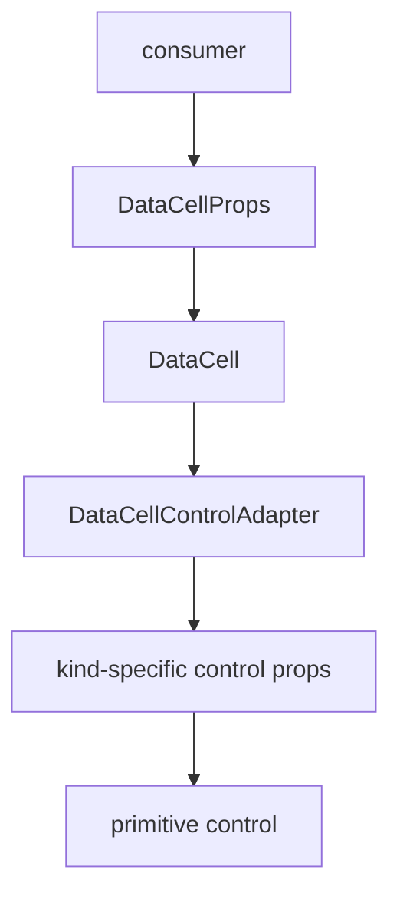
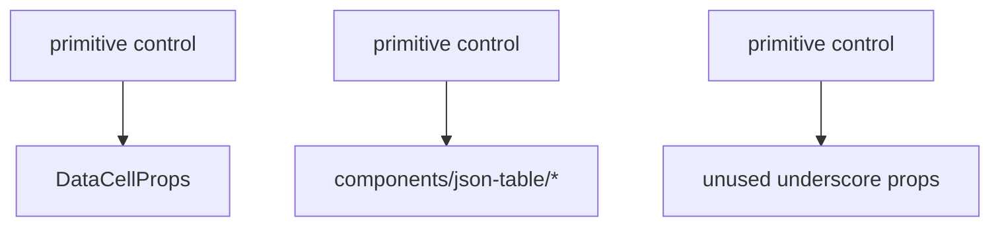

# DataCell Primitive Control Contract Blueprint

## Verdict

Not platonic yet.

The dependency direction is now fundamentally right:

```txt
json-table -> DataCell -> primitive controls
```

`DataCell` no longer needs table-specific code to render enum/select behavior.
That is the important architectural threshold.

The remaining impurity is inside the primitive layer:

```txt
DataCell public props are still being used as the internal control contract.
```

That is too wide. `DataCellProps` is a consumer-facing API. A primitive control
should not receive fields it cannot use, then ignore them through underscore
aliases. That makes each control harder to audit, makes dependency mistakes
easier, and lets table-adapter vocabulary leak into places that should be pure
native interaction code.

The next architecture should make the control boundary exact.

## Target

Make `DataCell` read as one narrow pipeline:

```txt
public DataCell props
  -> display model
  -> control adapter
  -> kind-specific control props
  -> primitive control
  -> primitive commit
```

The public component can stay convenient. The internals should be precise.

## Principle

There are three different contracts, and they must not collapse into one:

1. `DataCellProps`: the public consumer API.
2. `DataCellControlModel`: the minimal internal facts shared by all controls.
3. `DataCell*ControlProps`: the exact props each kind-specific control needs.

The current smell comes from using contract 1 where contract 3 belongs.

## Dependency Rule

Allowed:



Forbidden:



`DataCellProps` should stop at the registry boundary.

## Final Vocabulary

Keep these names:

- `DataCellProps`: public component props.
- `DataCellControlModel`: internal normalized state for the active cell.
- `DataCellControlAdapter`: kind-specific activation and prop projection.
- `DataCellControlPropsByKind`: type map from kind to exact control props.
- `DataCellControlAction`: activation result.
- `DataCellActivationSource`: why an editor mounted.
- `DataCellEditorHandle`: finish/cancel handle exposed to parent coordination.

Avoid these names inside primitive controls:

- `JsonTable`
- `Enum`
- `schema`
- `fieldMetadata`
- `jsonValue`
- `sentinel`
- `_editable`
- `_active`
- `_mode`
- `_showPickerIcon`
- `_onActiveChange`
- any ignored prop alias

## Target Module Shape

```txt
registry/new-york-v4/ui/
  data-cell.tsx
    public component, display/edit switch, commit routing

  data-cell-types.ts
    public API types and shared primitive value types

  data-cell-control-contract.ts
    internal control model, action, adapter, and kind prop map

  data-cell-control-registry.tsx
    kind -> adapter
    public props -> exact control props projection

  data-cell-text-control.tsx
    text-only native input control

  data-cell-number-control.tsx
    number/integer native input control

  data-cell-boolean-control.tsx
    checkbox command/edit control

  data-cell-select-control.tsx
    combobox trigger and popup composition

  data-cell-picker-control.tsx
    date/time trigger and picker composition
```

## Internal Control Model

The registry should normalize public props into a small shared model:

```ts
type DataCellControlModel<Kind extends DataCellKind> = {
  kind: Kind
  value: DataCellValueForKind<Kind>
  disabled: boolean
  className?: string
  autoFocus?: boolean
  activationSource?: DataCellActivationSource
  onCommit?: DataCellCommitHandlerForKind<Kind>
  onEditingEnd?: () => void
  onEditorHandleChange?: (handle: DataCellEditorHandle | null) => void
}
```

This model is not necessarily an exported public type. The important property is
that every field is genuinely shared by controls.

Kind-specific data stays outside the shared model.

## Kind-Specific Control Props

### Text

Text control receives only:

- `kind: "text"`
- `value`
- `disabled`
- `name`
- `placeholder`
- `className`
- `draftValue`
- `autoFocus`
- `activationSource`
- `onDraftValueChange`
- `onCommit`
- `onEditingEnd`
- `onEditorHandleChange`
- native input event handlers that are actually forwarded
- native input ARIA/id props that are actually rendered

Text does not receive:

- `selectOptions`
- `dateTimeZone`
- `showPickerIcon`
- `isPickerOpen`
- picker callbacks
- boolean-only state

### Number And Integer

Number/integer control receives only:

- text-input props needed for native input rendering
- `kind: "number" | "integer"`
- `dateTimeZone` never appears
- `selectOptions` never appears

Number parsing remains primitive-format logic, not table logic.

### Boolean

Boolean control receives only:

- `kind: "boolean"`
- `value`
- `disabled`
- `name`
- `className`
- `autoFocus`
- `onCommit`
- `onEditingEnd`
- `onEditorHandleChange`
- native button ARIA/id props that are actually rendered
- native button handlers that are actually forwarded

Boolean does not receive:

- `placeholder`
- `draftValue`
- `formatValue`
- `selectOptions`
- `dateTimeZone`
- `showPickerIcon`
- `isPickerOpen`
- picker callbacks

Boolean toggle command should accept a boolean value and a boolean commit
handler, not a broad public commit handler.

### Select

Select is already closest to the target.

Select receives only:

- `value`
- `disabled`
- `placeholder`
- `className`
- `formatValue`
- `autoFocus`
- `activationSource`
- `isPickerOpen`
- `selectOptions`
- `onCommit`
- `onEditingEnd`
- `onPickerOpenChange`
- `onEditorHandleChange`

This narrow shape should become the pattern, not the exception.

### Date, Time, And Date-Time

Picker control receives only:

- `kind: "date" | "time" | "date-time"`
- `value`
- `disabled`
- `placeholder`
- `dateTimeZone`
- `showPickerIcon`
- `className`
- `formatValue`
- `draftValue`
- `autoFocus`
- `activationSource`
- `isPickerOpen`
- `onDraftValueChange`
- `onCommit`
- `onPickerOpenChange`
- `onEditingEnd`
- `onEditorHandleChange`
- native trigger ARIA/id props that are actually rendered
- native trigger handlers that are actually forwarded

Picker should not receive select options or boolean-only props.

## Registry Contract

The registry should be the only place where public `DataCellProps` are split
into kind-specific internals.

Target shape:

```ts
type DataCellControlAdapter<Kind extends DataCellKind> = {
  Control: React.ComponentType<DataCellControlPropsByKind[Kind]>
  controlProps: (
    props: Extract<DataCellProps, { kind: Kind }>
  ) => DataCellControlPropsByKind[Kind]
  activatePointer: (
    args: DataCellControlPointerActionArgs<Kind>
  ) => DataCellControlAction
  activateClick: (
    args: DataCellControlPointerActionArgs<Kind>
  ) => DataCellControlAction
  activateKey: (
    args: DataCellControlKeyActionArgs<Kind>
  ) => DataCellControlAction
  canActivateFromKey: (key: string) => boolean
}
```

`DataCellControl` then becomes:

```tsx
const adapter = getDataCellControlAdapter(props.kind)
return <adapter.Control {...adapter.controlProps(props)} />
```

No control casts itself from `DataCellProps`.
No control destructures fields it does not own.

## Activation Contract

Activation should also stop receiving broad public props.

Current smell:

```txt
activatePointer(args) gets props: DataCellProps
```

Target:

```ts
type DataCellControlActivationModel<Kind extends DataCellKind> = {
  kind: Kind
  value: DataCellValueForKind<Kind>
  disabled: boolean
}
```

Pointer and keyboard activation should receive:

- activation model
- key or pointer geometry
- display element when hit testing needs it
- original event only when opening-token ownership needs it

That lets text activation use `value` for caret hit-testing without seeing
select options, date settings, or table-origin props.

## Public Props

Do not prematurely shrink the public API.

The public `DataCellProps` union can stay ergonomic and somewhat broad because
it is the component boundary consumed by app code and registry examples. The
platonic issue is not that consumers can pass convenient props. The issue is
that internal controls currently receive props they do not own.

Public compatibility is not the goal, but public API compression should be a
separate pass. This pass is about internal exactness.

## Tests

Add architecture tests that fail if the boundary widens again:

- primitive controls do not import `DataCellProps`
- primitive controls contain no ignored underscore props
- primitive controls contain no `components/json-table`
- primitive controls contain no `JsonTable`, `Enum`, `schema`, `jsonValue`,
  `fieldMetadata`, or `sentinel`
- `DataCellControlAdapter.Control` is not typed as
  `React.ComponentType<DataCellProps>`
- every adapter has a `controlProps` projector
- select, picker, text, number, and boolean receive only their exact prop types

Add interaction regression tests that prove the narrower contract did not alter
behavior:

- first click in text cell places the caret at the pointer position
- typing after first click inserts text instead of replacing the full value
- first click on select opens the popup
- option click commits once and closes
- opening click does not immediately dismiss select or picker popups
- boolean click toggles once
- number keyboard activation preserves numeric edit grammar
- date display text and mounted date input stay visually identical
- blur from a dirty text input commits according to the existing edit policy

## Implementation Steps

1. Define exact control prop types for every primitive control.
2. Move all `DataCellProps` casts and broad destructuring into
   `data-cell-control-registry.tsx`.
3. Add one `controlProps` projector per adapter.
4. Replace broad activation args with kind-specific activation models.
5. Remove ignored underscore prop aliases from controls.
6. Tighten boolean commit types so boolean toggle does not use a broad commit
   handler.
7. Run architecture tests before interaction tests so boundary regressions fail
   with clear errors.
8. Run the full DataCell/json-table interaction suite.
9. Rebuild and validate registry output.

## Non-Goals

- Do not reintroduce a table-owned enum editor.
- Do not make `DataCell` import JSON-table files.
- Do not rewrite Base UI, Calendar, or the popup primitives.
- Do not add a compatibility adapter that preserves the old broad internal
  contract.
- Do not move JSON value projection into DataCell.

## Completion Criteria

This pass is complete when:

- no primitive control imports `DataCellProps`
- no primitive control has ignored underscore props
- every control receives a kind-specific prop object
- activation receives a minimal activation model instead of public props
- `json-table` remains the only owner of JSON value projection
- `DataCell` remains the only owner of primitive interaction
- registry artifacts include the exact new files
- architecture tests prove the dependency direction
- interaction tests prove text, boolean, select, number, date, time, and
  date-time behavior did not regress

At that point the primitive layer will be meaningfully closer to the ideal:
convenient at the public boundary, exact at the internal boundary, and free of
consumer-specific vocabulary.
