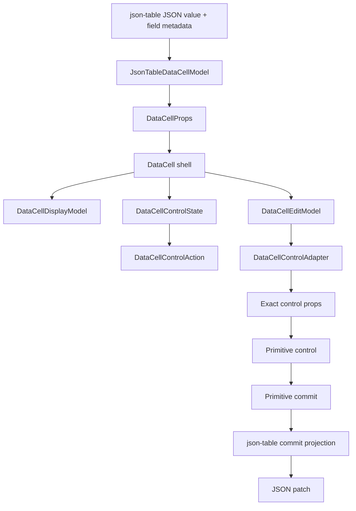
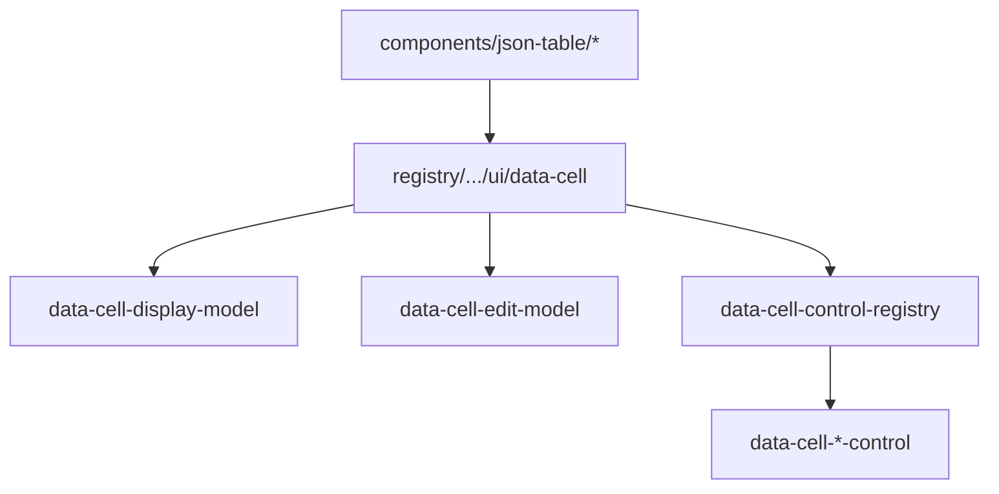
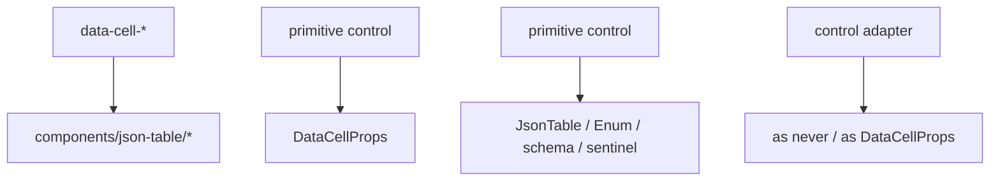

# DataCell Primitive Control Contract Blueprint

## Verdict

Not platonic yet.

The high-level dependency direction is now right:

```txt
json-table -> DataCell -> primitive controls
```

`DataCell` no longer depends on `components/json-table/*`, enum/select editing
is delegated to primitive select behavior, and primitive controls receive exact
control props from the registry. That crosses the important ownership line.

The remaining imperfection is subtler:

```txt
DataCellProps is still too close to the internal edit model.
```

`DataCellProps` is a public consumer API. It should be convenient. Internal
control state should be exact. Today the internals are cleaner than before, but
public props, edit models, activation state, editor attributes, and control
props still sit close enough that one wide prop can leak across several layers.

The next pass should separate the primitive into four narrow contracts:

```txt
public props -> display model
             -> edit model
             -> activation state
             -> control props
```

Each contract should contain only the facts needed by the next arrow.

## Target

Make `DataCell` a pure primitive shell:

```txt
consumer DataCellProps
  -> exact display projection
  -> exact edit projection
  -> exact activation decision
  -> exact primitive control props
  -> primitive commit
```

No table vocabulary. No compatibility shims. No broad internal prop bags. No
control receiving facts it cannot render.

## Architecture



The arrows matter:

- `json-table` owns JSON meaning.
- `DataCellProps` owns public primitive configuration.
- `DataCellDisplayModel` owns inert trompe-l'oeil display.
- `DataCellEditModel` owns mounted edit-session facts.
- `DataCellControlState` owns cheap activation facts for inactive cells.
- `DataCellControlAdapter` owns kind-specific behavior and prop projection.
- primitive controls own native interaction only.

## Dependency Rules

Allowed:



Forbidden:



`json-table` may adapt into `DataCell`. `DataCell` must never adapt back into
`json-table`.

## Contract Separation

### Public Props

`DataCellProps` should be exact at the public boundary.

The base props should contain only facts that genuinely apply to every kind:

- `kind`
- `value`
- `mode`
- `editable`
- `active`
- `disabled`
- `className`
- `activationSource`
- `autoFocus`
- `onEditingEnd`
- `onActiveChange`
- `onEditorHandleChange`
- safe shell HTML attributes

Kind-specific props should move to kind-specific branches:

- `placeholder`: text, number, integer, select, date, time, date-time
- `name`: controls that render a native named form control
- `draftValue`: text, number, integer, date, time, date-time
- `onDraftValueChange`: same as `draftValue`
- `open`: select, date, time, date-time
- `onOpenChange`: select, date, time, date-time
- `selectOptions`: select only
- `dateTimeZone`: date, time, date-time only
- `showPickerIcon`: date, time, date-time only
- `formatValue`: only branches that display formatted content
- `onCommit`: exact value type per branch

This is a hard cutover. Do not preserve a wide base for compatibility.

### Display Model

`DataCellDisplayModel` should be a discriminated union built from public props.

It should contain only inert display facts:

- kind
- formatted content
- empty state
- placeholder
- class name
- disabled state
- picker affordance where applicable
- shell attributes needed by the display element

It should not contain:

- draft state
- open state
- commit handlers
- editor handles
- JSON values
- select option arrays except when needed to derive displayed select content

### Edit Model

`DataCellEditModel` should be a discriminated union built from public props plus
shell edit state.

It should contain only facts needed after the editor is mounted:

- exact primitive value
- disabled state
- native control identity props
- draft state where the kind supports draft editing
- open state where the kind supports popup editing
- exact commit handler
- exact draft handler
- editor lifecycle hooks
- quarantined `aria-*` and `data-*` editor attributes

It should not be treated as public API. It is an internal normalized state
object.

### Activation State

`DataCellControlState` should be cheaper and narrower than `DataCellEditModel`.

Inactive cells need activation facts without constructing an editor model:

- kind
- current primitive value
- disabled
- boolean commit handler for command toggle

Text activation may use the current string for caret hit-testing. Boolean
activation may use the commit handler for single-click toggle. Select and
picker activation do not need option lists or popup props just to decide whether
activation is possible.

### Control Props

Primitive controls should receive exact props projected by the registry.

Allowed control imports:

- React
- local primitive helpers
- local primitive value types
- exact control prop types

Forbidden control imports:

- `DataCellProps`
- `components/json-table/*`
- JSON schema types
- table session types
- table utility functions

Forbidden control language:

- `JsonTable`
- `Enum`
- `schema`
- `fieldMetadata`
- `jsonValue`
- `sentinel`
- ignored underscore prop aliases

## Final Module Shape

```txt
registry/new-york-v4/ui/
  data-cell.tsx
    public shell, active/display switch, commit routing

  data-cell-types.ts
    exact public prop union and shared primitive value types

  data-cell-display-model.ts
    public props -> exact display model

  data-cell-display.tsx
    inert trompe-l'oeil display only

  data-cell-edit-model.ts
    public props + shell edit state -> exact edit model
    public props -> cheap activation state
    quarantined aria/data editor attribute projection

  data-cell-control-contract.ts
    control state, control action, adapter type, control prop map

  data-cell-control-registry.tsx
    kind -> adapter
    edit model -> exact control props
    activation state -> exact control action

  data-cell-text-control.tsx
    text input, caret placement, draft commit/cancel

  data-cell-number-control.tsx
    number/integer input grammar and commit parsing

  data-cell-boolean-control.tsx
    checkbox command/edit behavior

  data-cell-select-control.tsx
    primitive select trigger, popup lifecycle, option commit

  data-cell-select-popup.tsx
    generic listbox popup mechanics

  data-cell-picker-control.tsx
    date/time/date-time input and picker lifecycle
```

## Implementation Plan

1. Shrink `DataCellBaseProps` to truly shared public props.
2. Move every kind-specific public prop into the exact branch that owns it.
3. Keep `DataCellProps` as the only public component API; do not introduce a
   legacy alias.
4. Split `DataCellControlState` construction away from full edit-model
   construction if it is still coupled.
5. Ensure inactive activation reads only `DataCellControlState`, not
   `DataCellEditModel`.
6. Keep `DataCellEditModel` exact by kind and private to the primitive runtime.
7. Keep `DataCellControlAdapter.controlProps` as the only control prop
   projection point.
8. Remove any broad casts introduced to satisfy TypeScript. Prefer explicit
   discriminated branches over unsafe generic cleverness.
9. Regenerate registry output.
10. Add architecture ratchets before behavior changes are trusted.

## Type Rules

Forbidden:

- `as never`
- `as DataCellProps`
- `React.ComponentType<DataCellProps>` for primitive controls
- public grouped branches such as `"number" | "integer"` when exact branches
  are possible
- public grouped picker branches when exact branches are possible
- control props derived by spreading all public props
- model construction by re-kind-spreading `{ ...props, kind }`

Allowed:

- explicit `if (model.kind === "...")` branches for TypeScript correlation
- exact helper types like `Extract<DataCellProps, { kind: "select" }>`
- a quarantined editor-attribute projector for open-ended `aria-*` and
  `data-*`
- one adapter map checked with `satisfies`

The bias should be toward code that TypeScript can prove without casts, even if
that means a small explicit branch.

## Interaction Contract

The architectural cleanup must preserve the primitive behavior:

- first click in text places the caret at the pointer location
- typing after first click inserts text instead of replacing the whole value
- type-to-edit works for text, number, and integer
- Enter and F2 activate editable scalar cells
- Escape cancels draft edits where draft editing exists
- Enter commits draft edits where draft editing exists
- blur commits or finishes according to the native control policy
- boolean click toggles exactly once
- Space toggles boolean from keyboard
- select first click opens the popup
- select option click commits exactly once and closes
- select opening click does not immediately trigger outside-dismiss
- date, time, and date-time first click show matching display/editor text
- picker opening click does not immediately dismiss the popup
- controlled `open` and uncontrolled `open` both work for popup kinds
- controlled `active` and uncontrolled `active` both work for edit lifecycle
- table enum identity and nullable sentinel handling remain in `json-table`

## Tests

Architecture tests should fail if impurity returns:

- `DataCell` and primitive files do not import `components/json-table/*`
- primitive controls do not import `DataCellProps`
- primitive controls contain no ignored underscore prop aliases
- primitive controls contain no JSON-table vocabulary
- `DataCellBaseProps` does not contain select-only or picker-only props
- `selectOptions` appears only on the select public branch
- `dateTimeZone` and `showPickerIcon` appear only on picker public branches
- `open` and `onOpenChange` appear only on popup-capable branches
- no `as never` or `as DataCellProps` appears in DataCell runtime files
- no model construction uses `{ ...props, kind }`
- every adapter has a `controlProps` projector
- generated `public/r/data-cell.json` contains the same boundaries

Interaction tests should cover:

- text caret placement by pointer coordinate
- text type-to-edit and click-to-edit paths
- number and integer keyboard edit grammar
- boolean pointer and keyboard toggle
- select open, keyboard navigation, commit, cancel, outside click, and blur
- date, time, date-time display/editor parity
- popup controlled/uncontrolled state
- json-table enum object identity after select commit
- json-table nullable enum null commit
- virtualization survival while a popup is open

## Non-Goals

- Do not reintroduce a table-owned enum editor.
- Do not make `DataCell` import JSON-table files.
- Do not rewrite Base UI, Calendar, or third-party primitives.
- Do not add compatibility wrappers around the old broad public shape.
- Do not move JSON normalization into `DataCell`.
- Do not split files merely to make the tree look more modular.

## Completion Criteria

This pass is complete when:

- public props are exact by kind
- edit models are exact by kind
- activation state is minimal and separate from mounted edit state
- primitive controls receive only exact control props
- JSON projection exists only in `json-table`
- primitive interaction exists only in `DataCell`
- architecture tests lock the boundary
- integration tests prove the interaction matrix
- registry output is regenerated and checked

At that point the primitive layer would be close to the ideal: a convenient
public trompe-l'oeil API, a narrow internal state machine, and no consumer-owned
meaning inside primitive controls.
