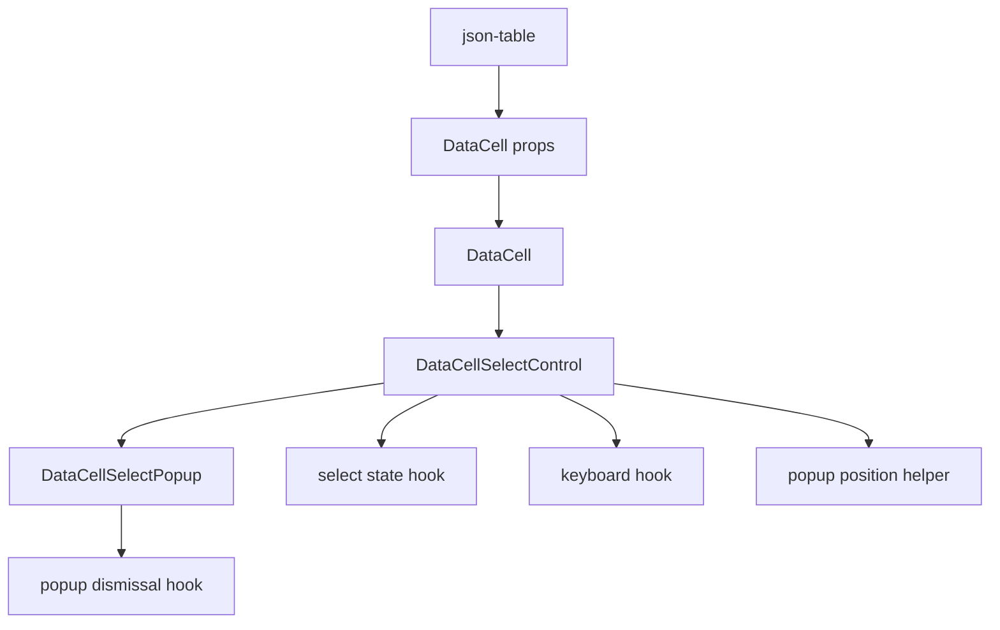
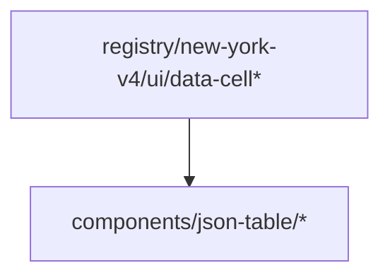

# DataCell Select Control Platonic Compression Blueprint

## Verdict

Not platonic yet.

The dependency graph is now correct:

```txt
json-table -> DataCell
```

`DataCell` no longer imports `components/json-table/*`, and the select popup is
owned by the DataCell primitive layer. That fixes the architectural inversion.

The remaining imperfection is inside the primitive itself:

```txt
DataCellSelectControl is still too large and too mixed.
```

It currently coordinates:

- activation handoff
- controlled and uncontrolled open state
- selected option lookup
- active option state
- popup measurement
- focus handling
- keyboard handling
- opening-click dismissal survival
- commit idempotence
- editing lifecycle
- ARIA wiring
- trigger rendering
- popup rendering

Those responsibilities are all primitive responsibilities, but they should not
all live in one component body.

The next pass is not about more abstraction. It is about giving each primitive
rule one exact owner.

## Target

Make the select control read as:

```txt
props
  -> select state
  -> activation/open/close policy
  -> keyboard policy
  -> trigger + popup rendering
```

The final component should be small enough that a reader can see the whole
combobox at once, while each rule remains directly testable.

## Non-Negotiable Architecture

The correct dependency direction remains:



Forbidden:



No DataCell runtime file may contain:

- `components/json-table`
- `JsonTable`
- `jsonValue`
- `fieldMetadata`
- `sentinel`

No DataCell select primitive file may contain:

- `Enum`
- `enum`
- `schema`

## Ideal File Shape

### `registry/new-york-v4/ui/data-cell-select-control.tsx`

The visible combobox shell.

Target size: under 180 lines.

Owns:

- trigger JSX
- popup JSX connection
- ARIA attributes
- class names
- calling the select hooks

Does not own inline:

- active option navigation algorithms
- popup position math
- dismissal listeners
- commit idempotence rules
- opening-click survival rules
- first/last/home/end option selection rules

The file should read like:

```tsx
const select = useDataCellSelectState(...)
const activation = useDataCellSelectActivation(...)
const keyboard = useDataCellSelectKeyboard(...)

return (
  <>
    <button ... />
    {select.open ? <DataCellSelectPopup ... /> : null}
  </>
)
```

### `registry/new-york-v4/ui/data-cell-select-state.ts`

Owns the primitive select state machine.

Exports:

- `useDataCellSelectState`
- `DataCellSelectState`

Owns:

- selected value
- selected option
- display value
- empty state
- open state
- active option index
- active descendant id
- popup position cache
- open/close transitions
- commit idempotence
- editing finish guard

Allowed inputs:

- primitive `value`
- primitive `selectOptions`
- primitive `formatValue`
- primitive `placeholder`
- `isPickerOpen`
- `onPickerOpenChange`
- `onCommit`
- `onEditingEnd`

Forbidden inputs:

- JSON metadata
- schema metadata
- table row identity
- table session state

### `registry/new-york-v4/ui/data-cell-select-activation.ts`

Owns opening-event survival and editor lifecycle handoff.

Exports:

- `useDataCellSelectActivation`

Owns:

- `useDataCellOpeningContext`
- dismiss-cause normalization
- `autoFocus` opening
- editor handle registration
- release on close/commit

This hook should make the current phrase
`cancelDismissDuringOpening` disappear from the component body.

### `registry/new-york-v4/ui/data-cell-select-keyboard.ts`

Owns keyboard policy.

Exports:

- `useDataCellSelectKeyboard`

Owns:

- Escape cancels
- ArrowDown opens or moves next
- ArrowUp opens or moves previous
- Home opens or moves first
- End opens or moves last
- Enter commits active option
- Space opens or commits active option

Uses:

- `firstEnabledDataCellSelectOptionIndex`
- `lastEnabledDataCellSelectOptionIndex`
- `nextEnabledDataCellSelectOptionIndex`

Forbidden:

- DOM reads
- popup positioning
- JSON-table terms

### Existing Primitive Helpers

Keep these files:

- `data-cell-select-navigation.ts`
- `data-cell-select-popup-position.ts`
- `data-cell-select-popup-dismissal.ts`
- `data-cell-select-popup.tsx`

Their current existence is good. The next pass should not merge them back into
the control.

## Control Contract Compression

The second remaining imperfection is the broad `DataCellProps` surface.

`DataCellSelectControl` currently receives many props irrelevant to selects,
then aliases them away:

- `_editable`
- `_active`
- `_mode`
- `_name`
- `_dateTimeZone`
- `_showPickerIcon`
- `_draftValue`
- `_onDraftValueChange`
- `_onFocus`
- `_onBlur`
- `_onKeyDown`
- `_onClick`
- `_onDoubleClick`

That is not ideal. It is evidence that the primitive control contract is too
wide at the implementation boundary.

Target:

```txt
DataCell public API may stay broad.
Each internal control receives only its kind-specific props.
```

Add a kind-specific projection layer:

```txt
DataCell props -> DataCellControlRegistry -> kind-specific control props
```

The select control should receive only:

- `value`
- `placeholder`
- `disabled`
- `className`
- `formatValue`
- `autoFocus`
- `activationSource`
- `isPickerOpen`
- `selectOptions`
- `onCommit`
- `onEditingEnd`
- `onPickerOpenChange`
- `onEditorHandleChange`

No ignored select props should remain.

## JSON-table Boundary

Do not change JSON-table behavior unless required by the control contract.

JSON-table remains responsible for:

- `jsonTableSelectOptions`
- `jsonTableSelectValue`
- `jsonTableSelectCommitValue`
- nullable sentinel handling
- JSON structural equality
- JSON identity reconstruction

JSON-table must not gain:

- select popup components
- select keyboard handlers
- outside pointer listeners
- DataCell activation logic

## Implementation Plan

1. Extract `useDataCellSelectState`.
2. Extract `useDataCellSelectActivation`.
3. Extract `useDataCellSelectKeyboard`.
4. Rewrite `DataCellSelectControl` as a thin composition shell.
5. Add kind-specific internal prop projection so select controls no longer
   destructure irrelevant props.
6. Update registry metadata and generated `public/r/data-cell.json`.
7. Strengthen architecture tests:
   - `DataCellSelectControl` must not contain ignored underscore props.
   - `DataCellSelectControl` must not contain inline keyboard algorithm names.
   - select state/activation/keyboard hooks must contain no JSON-table terms.
   - navigation and position helpers remain pure.
8. Run the full verification gate.

## Required Tests

Add or keep focused primitive tests:

- `tests/data-cell-select-navigation.test.ts`
- `tests/data-cell-select-popup-position.test.ts`
- new `tests/data-cell-select-state.test.tsx`
- new `tests/data-cell-select-keyboard.test.tsx`
- new `tests/data-cell-select-activation.test.tsx`

Interaction tests must prove:

- first click opens select
- opening click does not immediately close select
- Escape cancels
- outside pointer cancels
- Arrow keys skip disabled options
- Home and End choose first and last enabled options
- Enter commits active option
- Space opens and commits
- clicking the current option closes without duplicate commit
- nullable JSON enum still commits `null`
- object JSON enum still commits the original object identity

## Verification Gates

Required:

```sh
pnpm exec vitest run tests/data-cell-select-navigation.test.ts tests/data-cell-select-popup-position.test.ts --reporter=dot
pnpm exec vitest run tests/data-cell-control-lifecycle.test.tsx tests/data-cell.test.tsx tests/data-cell-text-hit-test.test.ts tests/json-table-browser-sequence-hardening.test.tsx tests/json-table-boolean-enum-interactions.test.tsx tests/json-table-enum-cell.test.tsx tests/json-table-enum-dropdown-hardening.test.tsx tests/json-table-picker-interactions.test.tsx tests/json-table-picker-overlay-hardening.test.tsx tests/json-table-data-cell-model.test.ts tests/json-table-architecture.test.ts --reporter=dot
pnpm exec vitest run $(rg --files tests | rg 'json-table.*\.test\.(ts|tsx)$' | tr '\n' ' ') --reporter=dot
pnpm exec tsc --noEmit --pretty false --skipLibCheck
pnpm run verify:data-cell
pnpm exec playwright test e2e/data-cell-caret.spec.ts
git diff --check
```

Registry gate:

```sh
tmp_registry=$(mktemp /tmp/data-cell-registry.XXXXXX)
tmp_output=$(mktemp -d /tmp/data-cell-registry-output.XXXXXX)
node - "$tmp_registry" <<'NODE'
const fs = require('fs')
const out = process.argv[2]
const registry = JSON.parse(fs.readFileSync('registry.json', 'utf8'))
const item = registry.items.find((entry) => entry.name === 'data-cell')
if (!item) throw new Error('data-cell registry item not found')
fs.writeFileSync(out, JSON.stringify({ ...registry, items: [item] }, null, 2))
NODE
pnpm exec shadcn build "$tmp_registry" -o "$tmp_output"
validate_dir=.registry/data-cell-validate
rm -rf "$validate_dir"
mkdir -p "$validate_dir"
cp "$tmp_registry" "$validate_dir/registry.json"
pnpm exec shadcn registry validate "$validate_dir/registry.json"
rm -rf "$validate_dir" "$tmp_registry" "$tmp_output"
```

Ownership proof:

```sh
rg -n "components/json-table|JsonTable|Enum|enum|schema|jsonValue|fieldMetadata|sentinel" registry/new-york-v4/ui/data-cell-select-*.ts registry/new-york-v4/ui/data-cell-select-*.tsx
```

The only acceptable matches are in test names or this blueprint, not runtime
select primitive files.

## Completion Criteria

This pass is complete when:

- `DataCellSelectControl` is a thin combobox shell.
- select state, activation, keyboard, navigation, position, dismissal, and
  popup rendering each have one owner.
- select controls no longer destructure irrelevant DataCell props.
- no DataCell runtime file imports or names JSON-table concepts.
- JSON-table remains a pure projection/commit adapter.
- registry artifacts include every new primitive file.
- all verification gates pass.

At that point, the component would be much closer to the platonic ideal:

```txt
simple enough to read
fast enough to trust
complete enough to use
modular enough to prove
```
