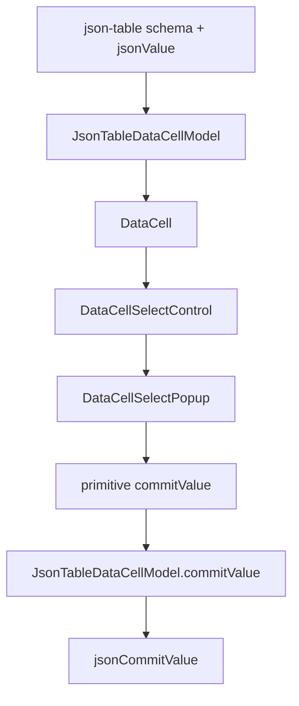
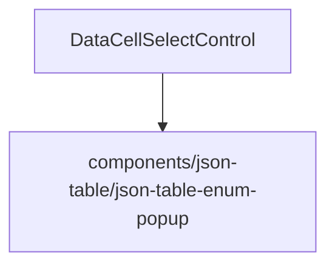

# DataCell Select Primitive Ownership Blueprint

## Verdict

Not platonic yet.

The JSON-table adapter is cleaner now, but the select primitive ownership is
still the weak point:

```txt
DataCellSelectControl -> components/json-table/*
```

That dependency direction is wrong.

`DataCell` is supposed to be the primitive trompe-l'oeil. A primitive cannot
import one of its consumers. Once `DataCellSelectControl` imports a JSON-table
popup, `DataCell` stops being universal and starts carrying table knowledge.

The correct dependency direction is:

```txt
json-table -> DataCell -> DataCellSelectControl -> DataCellSelectPopup
```

Never:

```txt
DataCell -> json-table
```

## Target

Make select popup behavior a DataCell-owned primitive.

JSON-table should supply:

- select options
- current primitive select value
- JSON commit reconstruction

DataCell should own:

- combobox trigger
- popup positioning
- listbox rendering
- active option tracking
- keyboard navigation
- outside pointer dismissal
- scroll/resize cancellation
- primitive option commit

The popup may have been motivated by JSON-table performance, but its API is
generic. Its home must be DataCell.

## Ideal Dependency Graph



Forbidden graph:



## File Ownership

### `registry/new-york-v4/ui/data-cell-select-popup.tsx`

Owns the generic popup/listbox mechanics.

Exports:

- `DataCellSelectPopup`
- `firstEnabledDataCellSelectOptionIndex`
- `nextEnabledDataCellSelectOptionIndex`
- `selectedDataCellSelectOptionIndex`

Allowed imports:

- React
- `createPortal`
- `cn`
- DataCell select option type

Forbidden imports:

- `components/json-table/*`
- JSON schema types
- table cell/session types
- JSON-table classes
- enum-specific helpers

Allowed language:

- select
- option
- listbox
- popup
- active option

Forbidden language:

- `JsonTable`
- `Enum`
- `jsonValue`
- `fieldMetadata`
- `schema`
- `sentinel`

The popup props should stay primitive-only:

```ts
type DataCellSelectPopupProps = {
  anchor: HTMLElement
  id: string
  activeDescendantId: string | undefined
  value: string | null
  activeIndex: number
  options: DataCellSelectOption[]
  onActiveIndexChange: (index: number) => void
  onCommit: (value: string) => void
  onCancel: () => void
  onOutsidePointerDown: (event: PointerEvent) => void
}
```

This API is acceptable because it knows only primitive select concepts.

### `registry/new-york-v4/ui/data-cell-select-control.tsx`

Owns the primitive select control.

Allowed:

- trigger rendering
- primitive display text
- `aria-activedescendant`
- open/close state
- keyboard navigation
- option commit as a string value
- activation event-tail survival
- import `DataCellSelectPopup`

Forbidden:

- importing from `components/json-table/*`
- using names containing `JsonTable`
- using names containing `Enum`
- knowing nullable sentinel semantics
- knowing JSON identity semantics
- knowing schema semantics

The control should be readable as:

```txt
props -> selected option -> popup open state -> primitive commit
```

No JSON-table concept should appear in the file.

### `components/json-table/json-table-select-options.ts`

Owns JSON-table select identity.

Allowed:

- nullable sentinel
- JSON equality
- option index identity
- JSON enum value commit reconstruction

Forbidden:

- popup behavior
- trigger behavior
- keyboard behavior
- positioning
- `document`
- `window`
- DOM events

This file may import `DataCellSelectOption` as a type only, because it projects
table enum values into primitive select options.

### `components/json-table/json-table-data-cell-model.ts`

Continues to assemble the model.

Allowed:

- `selectOptions: jsonTableSelectOptions(fieldMetadata)`
- `value: jsonTableSelectValue({ fieldMetadata, jsonValue })`
- `commitValue: jsonTableCommitValue(...)`

Forbidden:

- popup imports
- select DOM behavior
- JSON-table enum popup names
- direct select sentinel details

## Rename Map

Hard cutover. No aliases.

```txt
JsonTableEnumPopup -> DataCellSelectPopup
JsonTableEnumPopupProps -> DataCellSelectPopupProps
JsonTableEnumPopupPosition -> DataCellSelectPopupPosition
firstEnabledJsonTableEnumOptionIndex -> firstEnabledDataCellSelectOptionIndex
nextEnabledJsonTableEnumOptionIndex -> nextEnabledDataCellSelectOptionIndex
selectedJsonTableEnumOptionIndex -> selectedDataCellSelectOptionIndex
data-slot="json-table-enum-popup" -> data-slot="data-cell-select-popup"
```

Delete:

```txt
components/json-table/json-table-enum-popup.tsx
```

unless it already no longer exists in the current tree.

## Implementation Plan

1. Move the popup implementation into
   `registry/new-york-v4/ui/data-cell-select-popup.tsx`.

2. Rename every exported symbol from table/enum language to DataCell/select
   language.

3. Update `registry/new-york-v4/ui/data-cell-select-control.tsx` to import the
   new primitive popup.

4. Remove the JSON-table popup file and all references to it.

5. Strengthen architecture tests:

   - DataCell runtime files must not import `components/json-table`.
   - DataCell runtime files must not contain `JsonTableEnumPopup`.
   - DataCell runtime files must not contain `JsonTable`.
   - DataCell select popup must not contain `Enum`.
   - `components/json-table` must not contain popup implementation files.
   - `json-table-select-options.ts` may own sentinel/equality, but must not own
     DOM events.

6. Update tests from old Base UI select assumptions to generic combobox/listbox
   assertions where needed:

   - trigger has role `combobox`
   - popup has role `listbox`
   - options have role `option`
   - active option is proven through `aria-activedescendant`
   - commit still emits the primitive string option value

7. Run full verification.

## Non-Goals

- no JSON-table adapter rewrite
- no new `DataCell` public API
- no behavior change beyond restoring dependency ownership
- no nullable sentinel changes
- no enum identity changes
- no date/time changes
- no virtualization work
- no registry churn except generated `data-cell` artifacts if required

## Verification Gates

Required:

- `pnpm exec vitest run tests/json-table-data-cell-model.test.ts tests/json-table-architecture.test.ts --reporter=dot`
- focused DataCell/json-table interaction batch
- full JSON-table suite
- `pnpm exec tsc --noEmit --pretty false --skipLibCheck`
- `pnpm run verify:data-cell`
- `pnpm exec playwright test e2e/data-cell-caret.spec.ts`
- data-cell registry build and validation into a temporary output directory
- `git diff --check`

Additional ownership proof:

```sh
rg -n "components/json-table|JsonTable|Enum" registry/new-york-v4/ui/data-cell-select-control.tsx registry/new-york-v4/ui/data-cell-select-popup.tsx
```

The command should return no forbidden ownership leaks except allowed test
strings if the command is expanded to test files.

## Completion Criteria

This pass is complete when:

- no DataCell runtime file imports `components/json-table/*`
- no DataCell select primitive uses `JsonTable` or `Enum` names
- the custom popup is a DataCell-owned primitive
- JSON-table owns only JSON select identity and commit reconstruction
- DataCell owns only primitive select mechanics
- architecture tests enforce the dependency direction
- all verification gates are green

At that point, the component would have the correct ownership graph again:

```txt
json-table -> DataCell
```

and the select popup optimization would stop being an architectural smell.
