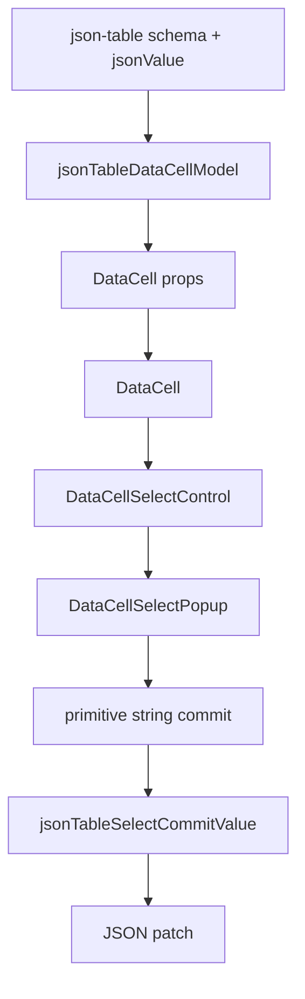
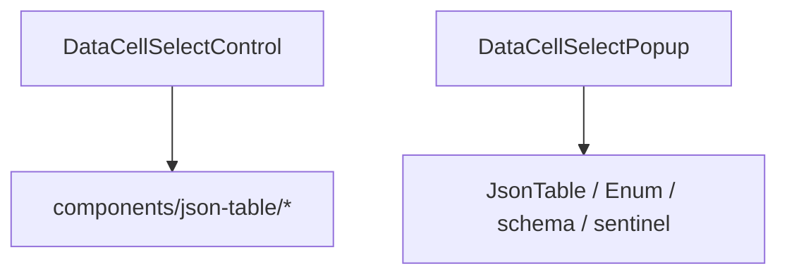

# DataCell Select Primitive Ownership Blueprint

## Verdict

The correct architecture is not "JSON-table has a special enum editor" and it
is not "DataCell imports a table-specific popup."

The correct architecture is:

```txt
json-table adapts JSON values into primitive DataCell props.
DataCell owns every primitive interaction.
```

`DataCell` is the trompe-l'oeil. Consumers should be able to place DataCells
everywhere without knowing when an editor is mounted, how a popup survives the
opening click, how keyboard focus is kept, or how a listbox is positioned.

If `DataCell` imports `components/json-table/*`, ownership is inverted. The
primitive now depends on one consumer, so the primitive is no longer pure.

## Principle

There are only two layers.

1. Primitive layer: `DataCell`
2. Adapter layer: `json-table`

The primitive layer owns interaction. The adapter layer owns meaning.

That distinction is the whole design.

## Dependency Rule

Allowed:



Forbidden:



`json-table` may depend on `DataCell`. `DataCell` must never depend on
`json-table`.

## Pure Responsibilities

### DataCell Owns Primitive Interaction

DataCell owns:

- activation
- mounted editor lifecycle
- focus
- pointer handoff
- keyboard handling
- popup open state
- popup positioning
- listbox rendering
- active option tracking
- outside pointer dismissal
- scroll and resize cancellation
- primitive value commit
- ARIA semantics

DataCell does not own:

- JSON equality
- enum identity
- nullable sentinels
- schema metadata
- table row identity
- virtual row lifetime
- document patches

The select control should read as:

```txt
props -> selected primitive option -> open state -> active option -> commit string
```

No JSON-table noun should be needed to understand it.

### JSON-table Owns Value Projection

JSON-table owns:

- reading schema metadata
- deciding a primitive cell kind
- projecting a JSON value into a primitive value
- projecting JSON enum values into primitive select options
- preserving JSON identity during commit
- preserving nullable semantics
- producing document patches
- coordinating table focus and virtualization

JSON-table does not own:

- listbox DOM
- popup position
- pointer event survival
- keyboard option navigation
- combobox ARIA
- DataCell mounted editor internals

The table path should read as:

```txt
schema + jsonValue -> DataCell props -> primitive commit -> JSON value -> patch
```

## Target Files

### `registry/new-york-v4/ui/data-cell-select-popup.tsx`

Owns the generic popup/listbox mechanics.

Exports:

- `DataCellSelectPopup`
- `getDataCellSelectPopupPosition`
- `firstEnabledDataCellSelectOptionIndex`
- `nextEnabledDataCellSelectOptionIndex`
- `selectedDataCellSelectOptionIndex`

Allowed imports:

- React
- `createPortal`
- `cn`
- DataCell select option type

Forbidden imports:

- `components/json-table/*`
- JSON schema types
- table cell/session types
- table utility functions

Allowed language:

- `DataCell`
- `Select`
- `Popup`
- `Option`
- `Listbox`
- `activeIndex`
- `value`

Forbidden language:

- `JsonTable`
- `Enum`
- `jsonValue`
- `fieldMetadata`
- `schema`
- `sentinel`

The popup props must stay primitive-only:

```ts
type DataCellSelectPopupProps = {
  anchor: HTMLElement
  id: string
  position: DataCellSelectPopupPosition
  activeDescendantId: string | undefined
  value: string | null
  activeIndex: number
  options: DataCellSelectOption[]
  onActiveIndexChange: (index: number) => void
  onCommit: (value: string) => void
  onCancel: () => void
  onOutsidePointerDown: (event: PointerEvent) => void
}
```

This API is clean because every field is primitive UI state.

### `registry/new-york-v4/ui/data-cell-select-control.tsx`

Owns the primitive combobox.

Allowed:

- trigger rendering
- display text
- placeholder state
- `aria-expanded`
- `aria-controls`
- `aria-activedescendant`
- open and close state
- measuring the trigger
- opening click survival
- primitive string commit
- editor finish/cancel handoff

Forbidden:

- importing from `components/json-table/*`
- names containing `JsonTable`
- names containing `Enum`
- nullable sentinel logic
- JSON equality
- schema field metadata
- table row/session knowledge

### `components/json-table/json-table-select-options.ts`

Owns JSON select projection.

Allowed:

- nullable sentinel value
- JSON value equality
- enum option identity
- conversion from JSON enum option to primitive select option
- conversion from primitive committed string back to JSON value

Forbidden:

- DOM
- React state
- popup state
- keyboard behavior
- pointer behavior
- focus behavior
- positioning
- `document`
- `window`
- browser event types

This file is the adapter. It can know that an enum option is really an object,
array, null, number, boolean, or string. It cannot know how the select opens.

### `components/json-table/json-table-data-cell-model.ts`

Owns DataCell model assembly.

Allowed:

- choose DataCell kind
- pass primitive value
- pass select options
- pass formatted display value
- translate primitive commit through JSON-table commit helpers

Forbidden:

- importing popup components
- implementing select behavior
- duplicating DataCell keyboard or focus logic
- using table-specific enum editor components

## Hard Cutover

No adapters. No aliases. No compatibility layer.

Rename table/enum popup language into primitive/select language:

```txt
JsonTableEnumPopup -> DataCellSelectPopup
JsonTableEnumPopupProps -> DataCellSelectPopupProps
JsonTableEnumPopupPosition -> DataCellSelectPopupPosition
firstEnabledJsonTableEnumOptionIndex -> firstEnabledDataCellSelectOptionIndex
nextEnabledJsonTableEnumOptionIndex -> nextEnabledDataCellSelectOptionIndex
selectedJsonTableEnumOptionIndex -> selectedDataCellSelectOptionIndex
data-slot="json-table-enum-popup" -> data-slot="data-cell-select-popup"
```

Delete:

```txt
components/json-table/json-table-enum-popup.tsx
```

The deleted file should not be replaced by another table-owned popup.

## Architecture Tests

Add tests that enforce the boundary directly.

DataCell runtime files must not contain:

- `@/components/json-table`
- `components/json-table`
- `JsonTable`

`data-cell-select-popup.tsx` must not contain:

- `Enum`
- `jsonValue`
- `fieldMetadata`
- `schema`
- `sentinel`

`json-table-select-options.ts` must not contain:

- `document.`
- `window.`
- `PointerEvent`
- `KeyboardEvent`
- `HTMLElement`
- `createPortal`

The old table popup file must not exist:

```txt
components/json-table/json-table-enum-popup.tsx
```

## Interaction Contract

The refactor must preserve these behaviors:

- click on a select cell opens the listbox on the first click
- the opening click does not immediately close the popup
- clicking an option commits that option
- clicking outside cancels without committing
- Escape cancels
- Enter commits the active option
- ArrowDown and ArrowUp move active option
- disabled options are skipped
- scroll and resize cancel the popup
- selected option is reflected through `aria-selected`
- active option is reflected through `aria-activedescendant`
- nullable enum values round-trip as `null`
- object and array enum values preserve JSON identity

## Implementation Plan

1. Make `DataCellSelectPopup` the only popup implementation.
2. Make `DataCellSelectControl` import only DataCell-owned popup utilities.
3. Keep JSON enum projection in `json-table-select-options.ts`.
4. Keep DataCell model assembly in `json-table-data-cell-model.ts`.
5. Delete every table-specific enum popup path.
6. Rename all leftover table/enum primitive symbols.
7. Add architecture tests that make dependency inversion impossible to reintroduce.
8. Run interaction tests before considering the cutover done.

## Verification Gates

Required:

```sh
pnpm exec vitest run tests/json-table-data-cell-model.test.ts tests/json-table-architecture.test.ts --reporter=dot
pnpm exec vitest run tests/data-cell-control-lifecycle.test.tsx tests/data-cell.test.tsx tests/data-cell-text-hit-test.test.ts tests/json-table-browser-sequence-hardening.test.tsx tests/json-table-boolean-enum-interactions.test.tsx tests/json-table-enum-cell.test.tsx tests/json-table-enum-dropdown-hardening.test.tsx tests/json-table-picker-interactions.test.tsx tests/json-table-picker-overlay-hardening.test.tsx tests/json-table-data-cell-model.test.ts tests/json-table-architecture.test.ts --reporter=dot
pnpm exec vitest run $(rg --files tests | rg 'json-table.*\.test\.(ts|tsx)$' | tr '\n' ' ') --reporter=dot
pnpm exec tsc --noEmit --pretty false --skipLibCheck
pnpm run verify:data-cell
pnpm exec playwright test e2e/data-cell-caret.spec.ts
git diff --check
```

Ownership proof:

```sh
rg -n "components/json-table|JsonTable|Enum" registry/new-york-v4/ui/data-cell-select-control.tsx registry/new-york-v4/ui/data-cell-select-popup.tsx
```

That command should return no matches.

## Completion Criteria

This blueprint is implemented when:

- `DataCell` has no runtime dependency on `components/json-table/*`
- DataCell select files contain no table or enum language
- the popup is a generic DataCell primitive
- JSON-table owns only JSON projection and commit reconstruction
- JSON-table select projection contains no DOM behavior
- architecture tests enforce the dependency direction
- interaction tests prove the first-click enum/select behavior
- all verification gates pass

Then the architecture is clean:

```txt
json-table -> DataCell
```

and never:

```txt
DataCell -> json-table
```
