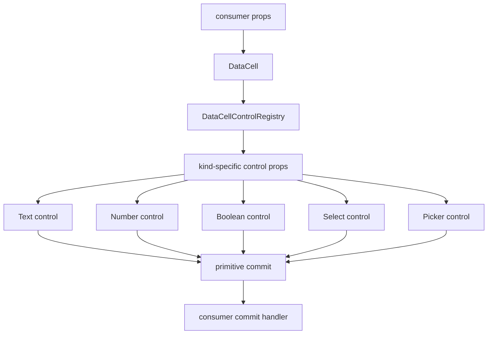
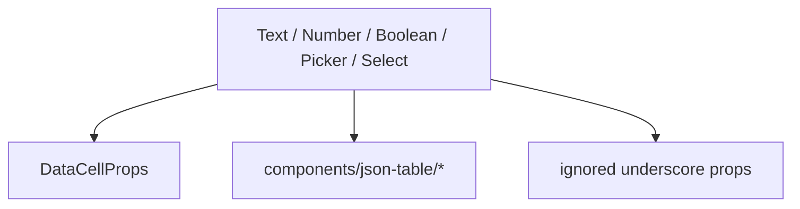

# DataCell Total Primitive Contract Blueprint

## Verdict

Not platonic yet.

The select path has reached the intended shape:

```txt
DataCell -> select shell -> select state / activation / keyboard / popup
```

The remaining impurity is that select is now cleaner than the rest of the
primitive family. A perfect `DataCell` cannot have one ideal control and several
older controls still carrying broad props, ignored aliases, and imprecise names.

The next pass should make the whole primitive layer uniformly exact.

## Target

Make every primitive control obey the same contract:

```txt
public DataCell props
  -> registry projection
  -> exact kind-specific control props
  -> primitive control
```

`DataCellProps` remains the public API. It must stop at the registry boundary.
No primitive control should receive props it does not own.

## Non-Negotiable Principles

1. `DataCell` owns primitive interaction.
2. Consumers own domain meaning.
3. The registry owns prop projection.
4. Controls own native browser behavior.
5. JSON-table owns JSON projection and commit reconstruction.
6. No primitive control imports or names JSON-table concepts.
7. No control destructures ignored props.
8. No compatibility adapters. Hard cutover.

## Ideal Dependency Graph



Forbidden:



## Current Remaining Gaps

### 1. Broad Control Props

Select is narrow. Other controls still use broad public props:

- `DataCellTextControlProps = DataCellProps & { kind: "text" }`
- `DataCellNumberControlProps = DataCellProps & { kind: "number" | "integer" }`
- `DataCellBooleanControlProps = DataCellProps & { kind: "boolean" }`
- `DataCellPickerControlProps = DataCellProps & { kind: "date" | "time" | "date-time" }`

This is not ideal because the public convenience API becomes the internal
implementation API.

### 2. Ignored Prop Aliases

The remaining controls still contain props such as:

- `_editable`
- `_active`
- `_mode`
- `_showPickerIcon`
- `_draftValue`
- `_onDraftValueChange`
- `_onActiveChange`
- `_onPickerOpenChange`

Each ignored alias is proof that the prop boundary is not exact.

### 3. Picker Naming Leaks Into Select

The public open-state props are still named:

- `isPickerOpen`
- `onPickerOpenChange`

Select uses these names even though it is not a picker. The perfect public API
should use a neutral name:

- `open`
- `onOpenChange`

This is a hard cutover. Update all call sites.

### 4. Adapter Type Is Still Too Wide

`DataCellControlAdapter.Control` still accepts `DataCellProps` at the type
level. Select narrows through a local adapter function, but the type system does
not require every primitive to do the same.

The ideal adapter type should be generic by kind.

## Final Vocabulary

Use these terms exactly:

- `DataCellProps`: public props.
- `DataCellControlPropsByKind`: internal prop map.
- `DataCellControlAdapter`: kind-specific adapter.
- `controlProps`: projection from public props to exact control props.
- `activationModel`: minimal value needed for activation.
- `open`: primitive overlay open state.
- `onOpenChange`: primitive overlay open callback.
- `commit`: value leaves the primitive.
- `finish`: editing ends.
- `cancel`: editing ends without commit.

Remove these terms from primitive control props:

- `isPickerOpen`
- `onPickerOpenChange`
- ignored underscore aliases

Keep `picker` only for date/time picker internals.

## Target Types

```ts
type DataCellControlPropsByKind = {
  text: DataCellTextControlProps
  number: DataCellNumberControlProps
  integer: DataCellNumberControlProps
  boolean: DataCellBooleanControlProps
  select: DataCellSelectControlProps
  date: DataCellPickerControlProps
  time: DataCellPickerControlProps
  "date-time": DataCellPickerControlProps
}
```

```ts
type DataCellControlAdapter<Kind extends DataCellKind> = {
  Control: React.ComponentType<DataCellControlPropsByKind[Kind]>
  controlProps: (
    props: Extract<DataCellProps, { kind: Kind }>
  ) => DataCellControlPropsByKind[Kind]
  activatePointer: (
    args: DataCellControlPointerActionArgs<Kind>
  ) => DataCellControlAction
  activateClick: (
    args: DataCellControlPointerActionArgs<Kind>
  ) => DataCellControlAction
  activateKey: (
    args: DataCellControlKeyActionArgs<Kind>
  ) => DataCellControlAction
  canActivateFromKey: (key: string) => boolean
}
```

The registry should render controls like this:

```tsx
const adapter = getDataCellControlAdapter(props.kind)
return <adapter.Control {...adapter.controlProps(props)} />
```

## Exact Control Props

### Text

Text receives:

- `kind`
- `value`
- `disabled`
- `name`
- `placeholder`
- `className`
- `draftValue`
- `autoFocus`
- `activationSource`
- `onDraftValueChange`
- `onCommit`
- `onEditingEnd`
- `onEditorHandleChange`
- actual input event handlers
- actual input ARIA/id props

Text does not receive select, boolean, or picker-only props.

### Number And Integer

Number/integer receive the same native input props as text, plus numeric kind.

They do not receive:

- `selectOptions`
- `showPickerIcon`
- `open`
- `onOpenChange`

### Boolean

Boolean receives:

- `kind`
- `value`
- `disabled`
- `name`
- `className`
- `autoFocus`
- `onCommit`
- `onEditingEnd`
- `onEditorHandleChange`
- actual button event handlers
- actual button ARIA/id props

Boolean does not receive drafts, placeholders, formatters, select options, or
overlay props.

### Select

Select keeps its current narrow shape, except open naming becomes neutral:

- `open`
- `onOpenChange`

not:

- `isPickerOpen`
- `onPickerOpenChange`

### Picker

Picker receives:

- `kind`
- `value`
- `disabled`
- `placeholder`
- `dateTimeZone`
- `showPickerIcon`
- `className`
- `formatValue`
- `draftValue`
- `autoFocus`
- `activationSource`
- `open`
- `onOpenChange`
- `onDraftValueChange`
- `onCommit`
- `onEditingEnd`
- `onEditorHandleChange`
- actual trigger event handlers
- actual trigger ARIA/id props

Picker does not receive select options.

## Activation Model

Activation should not receive public props either.

Target:

```ts
type DataCellControlActivationModel<Kind extends DataCellKind> = {
  kind: Kind
  value: DataCellValueForKind<Kind>
  disabled: boolean
}
```

Text can use `value` for caret hit-testing. Boolean can use `value` for command
toggle. No activation function should inspect broad public props.

## Implementation Plan

1. Rename public overlay props:
   - `isPickerOpen` -> `open`
   - `onPickerOpenChange` -> `onOpenChange`
2. Update every DataCell call site.
3. Define `DataCellControlPropsByKind`.
4. Make `DataCellControlAdapter` generic by kind.
5. Add `controlProps` projectors for text, number, integer, boolean, select,
   date, time, and date-time.
6. Rewrite `DataCellControl` to render projected props only.
7. Replace every broad control prop type with exact kind-specific props.
8. Remove every ignored underscore prop from primitive controls.
9. Replace broad activation args with `activationModel`.
10. Tighten architecture tests so the old shape cannot return.
11. Rebuild and validate registry output.

## Tests

Architecture tests must prove:

- no primitive control imports `DataCellProps`
- no primitive control destructures ignored underscore props
- no primitive control contains `components/json-table`
- no primitive control contains `JsonTable`, `schema`, `fieldMetadata`,
  `jsonValue`, or `sentinel`
- no primitive control prop type is `DataCellProps & ...`
- no primitive control prop includes `isPickerOpen` or `onPickerOpenChange`
- every adapter has `controlProps`
- `DataCellControl` does not spread public props directly into controls

Interaction tests must prove:

- text first click places caret exactly
- text typing inserts at caret
- text blur commits dirty draft
- printable key activation still intentionally replaces text
- number and integer activation grammar remains unchanged
- boolean click toggles exactly once
- select first click opens
- select current option closes without duplicate commit
- select option click commits once
- select Escape and outside pointer cancel
- date/time/date-time open, commit, blur, and display parity remain unchanged
- JSON-table nullable and object enum identity remain preserved

## Verification Gates

Required:

```sh
pnpm exec vitest run tests/data-cell-control-lifecycle.test.tsx tests/data-cell.test.tsx tests/data-cell-text-hit-test.test.ts tests/data-cell-select-navigation.test.ts tests/data-cell-select-popup-position.test.ts tests/data-cell-select-state.test.tsx tests/data-cell-select-keyboard.test.tsx tests/data-cell-select-activation.test.tsx tests/json-table-architecture.test.ts --reporter=dot
pnpm exec vitest run $(rg --files tests | rg 'json-table.*\.test\.(ts|tsx)$' | tr '\n' ' ') --reporter=dot
pnpm exec tsc --noEmit --pretty false --skipLibCheck
pnpm run verify:data-cell
pnpm exec playwright test e2e/data-cell-caret.spec.ts
pnpm exec shadcn build --output public/r
git diff --check
```

Registry validation must pass for the `data-cell` item alone.

## Completion Criteria

The component can claim this pass when:

- every primitive control has exact props
- no primitive control receives public `DataCellProps`
- no primitive control has ignored aliases
- open-state naming is neutral and consistent
- activation uses minimal models
- select remains compressed
- picker remains functionally identical
- JSON-table behavior is unchanged
- registry metadata and generated artifacts match source
- all verification gates pass

This is the next meaningful step toward the ideal:

```txt
public API convenient
internal contracts exact
control ownership uniform
domain meaning outside the primitive
no line without purpose
```
