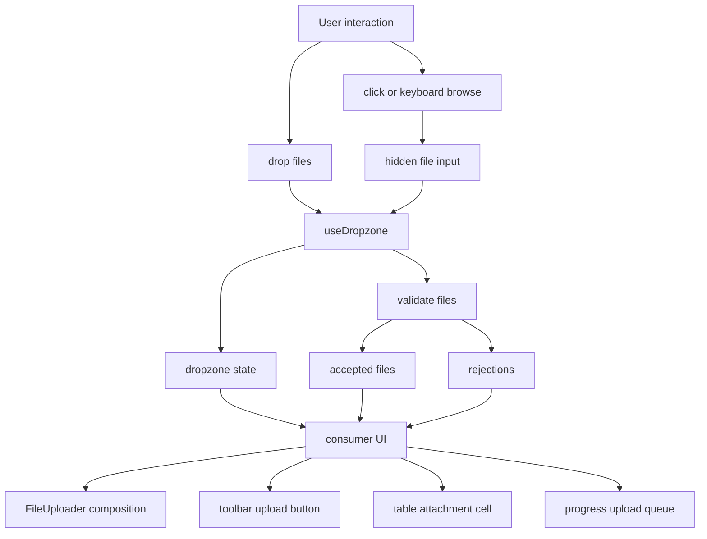

# Dropzone Primitive and File Uploader Blueprint

## Goal

Build the headless dropzone primitive, then rebuild the visual file uploader on
top of it.

The primitive owns upload interaction behavior. The file uploader owns product
UI.

The current `Dropzone` component proves the desired behavior, but it is not the
right primitive boundary. It combines drag/drop mechanics, file input wiring,
validation, internal file state, thumbnail rendering, rejection display, and one
specific layout. That makes it hard to build table attachments, compact upload
buttons, modal queues, progress uploaders, validation-only targets, or custom
file grids without forking behavior.

The platonic shape is:

```txt
useDropzone / DropzoneRoot
  -> owns behavior, validation, state contract, accessibility props

FileUploader
  -> owns the default Retab upload area, copy, icon cluster, file grid,
     FileThumbnail composition, and rejection presentation
```

## Ideal

A dropzone is not a rectangle.

A dropzone is a file-intake behavior primitive:

- it accepts files from drag/drop
- it accepts files from a hidden file input
- it exposes the same state for both paths
- it validates the same way for both paths
- it emits accepted files, rejected files, and the resulting file list
- it lets any UI render around that behavior

The visual upload area is a composition, not the primitive.

## First Principles

The browser owns file selection.

The primitive owns interaction normalization.

The consumer owns rendering.

The primitive must not know about icons, thumbnails, titles, descriptions,
cards, grids, buttons, or upload progress UI. Those are application decisions.

The primitive should make the accessible path hard to get wrong. Consumers
should receive prop getters or slots that carry keyboard activation, drag event
handling, disabled behavior, input attributes, and stable data attributes.

## Public Shape

### Hook

```ts
type DropzoneFileRejection = {
  file: File
  reason: "file-invalid-type" | "file-too-large" | "too-many-files"
  message: string
}

type DropzoneFileItem = {
  id: string
  file: File
}

type DropzoneState = {
  files: DropzoneFileItem[]
  acceptedFiles: File[]
  rejectedFiles: DropzoneFileRejection[]
  isDragging: boolean
  isFocused: boolean
  isDisabled: boolean
  hasFiles: boolean
}

type UseDropzoneProps = {
  accept?: string
  disabled?: boolean
  files?: DropzoneFileItem[]
  defaultFiles?: DropzoneFileItem[]
  maxFiles?: number
  maxSize?: number
  multiple?: boolean
  onFilesAccepted?: (files: File[]) => void
  onFilesChange?: (files: DropzoneFileItem[]) => void
  onFilesRejected?: (rejections: DropzoneFileRejection[]) => void
}

type UseDropzoneReturn = DropzoneState & {
  clearFiles: () => void
  openFileDialog: () => void
  removeFile: (fileId: string) => void
  getRootProps: <T extends HTMLElement>(
    props?: React.HTMLAttributes<T>
  ) => React.HTMLAttributes<T>
  getInputProps: (
    props?: React.InputHTMLAttributes<HTMLInputElement>
  ) => React.InputHTMLAttributes<HTMLInputElement>
  getTriggerProps: <T extends HTMLElement>(
    props?: React.HTMLAttributes<T>
  ) => React.HTMLAttributes<T>
}
```

### Components

```tsx
<DropzoneRoot>
  <DropzoneInput />
  <DropzoneTrigger />
</DropzoneRoot>
```

The component API should be a light wrapper over the hook, not a second
behavior implementation. If the hook ships first, components may be added only
when they remove real repeated code.

## Naming

The headless primitive should own the `dropzone` registry item.

The styled composition should be named `file-uploader`.

```txt
registry/new-york-v4/ui/dropzone.tsx        headless hook + optional root
registry/new-york-v4/ui/file-uploader.tsx   Retab styled uploader
components/ui/dropzone.tsx                  export wrapper
components/ui/file-uploader.tsx             export wrapper
```

This makes installation intent precise:

```txt
pnpm dlx shadcn@latest add @retab/dropzone
pnpm dlx shadcn@latest add @retab/file-uploader
```

`file-uploader` depends on `dropzone` and `file-thumbnail`.

## System Shape



## Module Plan

```txt
dropzone.tsx
  public hook and small headless component wrappers

dropzone-accept.ts
  accept string parsing and MIME/extension matching

dropzone-state.ts
  controlled/uncontrolled file item state

dropzone-events.ts
  drag depth, drag file detection, event composition helpers

file-uploader.tsx
  default Retab visual uploader built from useDropzone

file-uploader-file-list.tsx
  default file grid

file-uploader-file-item.tsx
  FileThumbnail + remove button
```

Keep helper modules only if they remove real complexity. If the first
implementation is small enough, keep accept/state/events inside `dropzone.tsx`
and split only when tests make the boundary obvious.

## Behavior Contract

### File Intake

Rules:

- Drag/drop and input selection share one commit path.
- `disabled` blocks drag, click, keyboard, input, and commit.
- `multiple={false}` keeps only the first accepted incoming file.
- `maxFiles` limits the resulting list, not only the incoming batch.
- Re-selecting the same file must work by clearing the input value after commit.
- The primitive emits `onFilesAccepted` with only the accepted incoming files.
- The primitive emits `onFilesRejected` with every rejected incoming file.
- The primitive emits `onFilesChange` when the stored file list changes.

### Validation

Validation is pure and exported:

```ts
matchesDropzoneAccept(file, accept)
validateDropzoneFile(file, { accept, maxSize })
validateDropzoneFiles(files, { accept, maxSize, maxFiles, currentCount })
```

Accept matching rules:

- empty `accept` accepts all files
- `.pdf` matches by filename extension
- `image/*` matches MIME prefix
- `application/pdf` matches exact MIME type
- comma-separated tokens are OR conditions
- unknown empty tokens are ignored

### Drag State

Rules:

- Use drag depth to avoid flicker across children.
- Only set dragging for actual file drags.
- Reset dragging on drop, escape paths, and disabled changes.
- Expose `data-dragging` from prop getters.
- Never call `preventDefault` for non-file drags.

### Accessibility

The primitive should provide correct default props:

- root gets `data-slot="dropzone"`
- trigger gets `role="button"` only when the element is not already a button
- trigger supports Enter and Space
- disabled maps to `aria-disabled`
- input gets `type="file"`, `accept`, `multiple`, `disabled`
- prop getters compose consumer handlers and respect `event.defaultPrevented`

The styled `FileUploader` may set labels, descriptions, and visible copy, but
the primitive must not require a specific text structure.

## Controlled State

The primitive supports both uncontrolled and controlled files.

```tsx
const dropzone = useDropzone({
  files,
  onFilesChange: setFiles,
})
```

Rules:

- Controlled mode never mutates internal file state.
- Uncontrolled mode owns `defaultFiles`.
- `removeFile` and `clearFiles` emit `onFilesChange`.
- File item IDs must be stable once created.
- Consumers may pass preloaded `DropzoneFileItem`s for persisted uploads.

## File Uploader Composition

`FileUploader` is the current visual component rebuilt from the primitive.

```tsx
<FileUploader
  accept=".pdf,.docx,.xlsx,.csv,.png,.jpg"
  maxSize={20 * 1024 * 1024}
  multiple
  title="Click to upload or drop files"
  description="PDF, DOCX, XLSX, CSV, PNG, or JPG"
/>
```

It owns:

- icon cluster
- title and description
- browse pill
- rejection message rendering
- file grid
- remove buttons
- `FileThumbnail` use

It should allow escape hatches:

```ts
type FileUploaderProps = UseDropzoneProps & {
  title?: React.ReactNode
  description?: React.ReactNode
  browseLabel?: React.ReactNode
  draggingLabel?: React.ReactNode
  renderFileItem?: (item: DropzoneFileItem) => React.ReactNode
  renderFileList?: (items: DropzoneFileItem[]) => React.ReactNode
}
```

Do not put upload progress into the primitive. Progress belongs to the consumer
or to a higher-level `UploadQueue` composition.

## Block Lab

The `/blocks` Dropzone tab should become the proving ground for the primitive,
not a gallery of one component repeated.

It should include:

- default `FileUploader`
- compact toolbar upload button built directly from `useDropzone`
- table attachment cell built directly from `useDropzone`
- modal upload queue using controlled files
- validation-only drop target with no stored files
- custom grid using `FileThumbnail`
- disabled uploader
- max-size rejection case
- single-file replacement case

Every variant should share the same headless primitive. That is the test.

## Migration Plan

1. Rename the current visual `Dropzone` implementation to `FileUploader`.
2. Create `useDropzone` with the current event/validation behavior.
3. Rebuild `FileUploader` from `useDropzone`.
4. Keep exported validation helpers.
5. Add controlled/uncontrolled tests.
6. Update the Dropzone block lab to include hook-level compositions.
7. Update docs:
   - `/docs/components/dropzone` documents the primitive
   - `/docs/components/file-uploader` documents the styled uploader
8. Update registry:
   - `dropzone` ships only headless behavior
   - `file-uploader` depends on `dropzone` and `file-thumbnail`

No compatibility shim. Make the cutover and update call sites.

## Tests

Primitive tests:

- MIME, wildcard MIME, extension matching
- multiple and single-file behavior
- max size rejection
- max files rejection
- controlled files do not mutate internally
- uncontrolled files update
- `removeFile` and `clearFiles`
- callback order and payloads
- input selection clears input value
- drag depth handles child enter/leave
- non-file drags do not activate the dropzone
- disabled blocks every intake path
- prop getters compose handlers

Uploader tests:

- renders default copy
- renders file grid inside the upload area
- uses `FileThumbnail`
- remove button does not reopen file dialog
- custom renderers replace default file list/item
- rejection message appears

Block tests:

- Dropzone tab renders all primitive compositions
- each composition has exactly one behavior source: `useDropzone`

## Non-Goals

- Upload transport
- server persistence
- progress state
- resumable uploads
- folder traversal
- image editing
- drag sorting selected files

Those are valid products, not the dropzone primitive.

## Success Criteria

- A consumer can build a file uploader without copying drag/drop logic.
- A consumer can build a toolbar upload button with no upload-area rectangle.
- A consumer can build a custom file grid with `FileThumbnail`.
- The default `FileUploader` looks like the current polished upload area.
- The primitive has no dependency on lucide icons or `FileThumbnail`.
- The registry split makes install intent obvious.
- The Dropzone block lab demonstrates multiple UIs sharing one behavior core.
