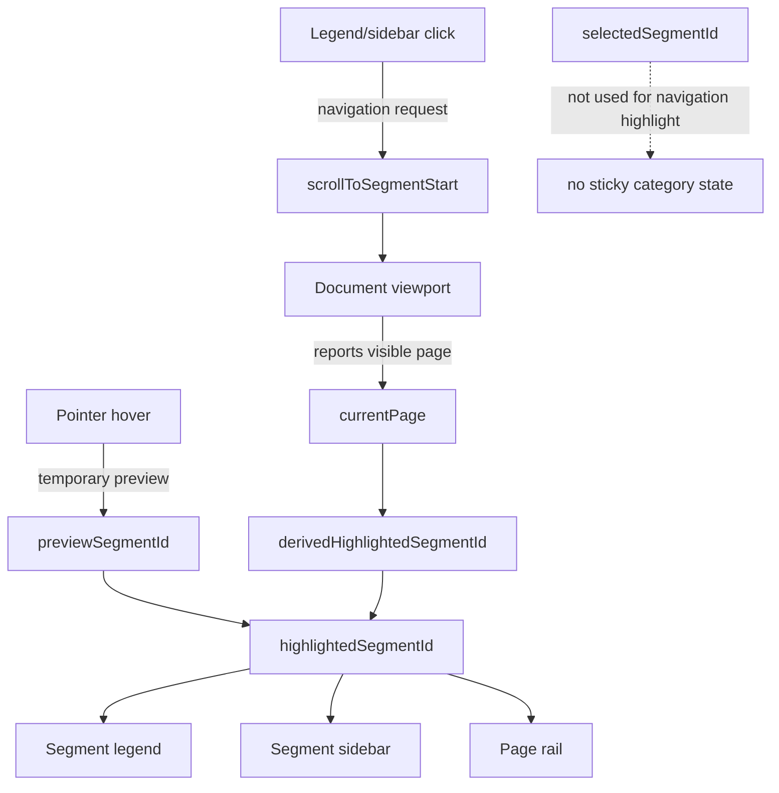
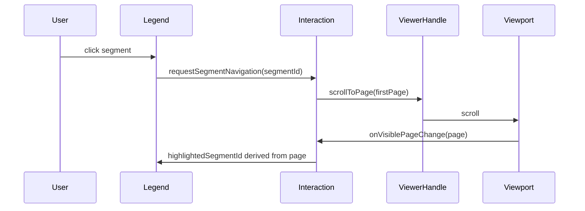
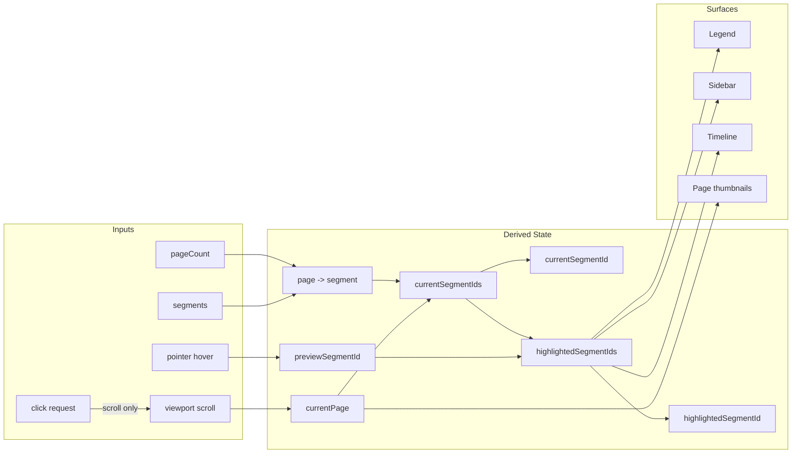

# Extend HQ Sidebar / PDF Viewer Blueprint

This blueprint distills the useful parts of `extend-hq/ui` into the viewer
architecture this repo should want. It is not a porting plan. It is a standard:
copy the ideas that make the system simpler, faster, and more coherent; reject
the parts that create sticky state, monoliths, or compatibility surface.

Source studied locally:

- `/tmp/extend-hq-ui/apps/v4/components/ui/document-viewer-sidebar.tsx`
- `/tmp/extend-hq-ui/apps/v4/components/ui/pdf-viewer.tsx`
- `/tmp/extend-hq-ui/apps/v4/components/pdf-thumbnail-utils.ts`
- `/tmp/extend-hq-ui/apps/v4/registry/new-york-v4/ui/document-splits.tsx`

## Judgment

`extend-hq/ui` gets the sidebar shell and thumbnail interaction model mostly
right. It gets the PDF capability checklist right. It does not get the PDF
viewer modularization right.

The useful lesson is not "use their PDF viewer." The useful lesson is:

- the sidebar shell should be layout-only
- the viewer should expose a tiny imperative scroll handle
- page thumbnails need real listbox semantics when they are selectable
- current, hover, selected, and operation-target state must be different names
- PDF edge cases belong behind hooks and resource modules, not in one component

## Implemented Contract

The local implementation now follows this contract:

- segment interaction has one transient field: `previewSegmentId`
- `highlighted` is derived as `previewSegmentId ?? currentSegmentId`
- overlap is explicit: the state also carries `currentSegmentIds` and
  `highlightedSegmentIds`
- click clears transient preview and delegates navigation to the host
- focus produces a focus ring only; it does not become category highlight state
- segment surfaces expose `data-previewed`, `data-current`, and
  `data-highlighted`
- PDF navigation exposes `scrollToPage(pageNumber, options)` for page jumps
- PDF area navigation exposes `scrollToPageArea({ pageNumber, top }, options)`
  for source/field geometry
- generated registry payloads are rebuilt from the current source

## Target Model

The sidebar and legend are navigation and preview surfaces. They do not own
selection.



Highlighting has exactly two inputs:

- `previewSegmentId`, set only while a pointer is over a segment surface
- `currentPage`, reported by the document viewport

Clicking a segment performs navigation. It does not persist a selected segment.
After the viewport lands on the destination page, the normal current-page path
causes the highlight.

## Adopt

### Layout-Only Sidebar Shell

Adopt the `DocumentViewerThumbnailSidebar` idea: a sidebar component should own
only:

- open or closed layout
- inline or overlay mode
- width measurement
- transition timing
- ARIA/container attributes
- rendering a child slot

It should not own:

- PDF state
- segment lookup
- page ownership
- current page
- hover state
- selected state
- document loading

The corresponding local component should read like:

```txt
document-sidebar-shell.tsx
  useContainerWidth
  useSidebarMode
  DocumentSidebarShell
```

The shell API should be small:

```ts
type DocumentSidebarShellProps = {
  isOpen: boolean
  minInlineWidth: number
  width: number
  children: React.ReactNode
}
```

Do not encode the width only in class names. Width and inline threshold are part
of the layout contract.

### Container Width, Not Viewport Width

Adopt container-based responsiveness. Embedded viewers should react to the space
they are given, not the browser window.

The measurement hook should:

- initialize from `clientWidth`
- update from `ResizeObserver`
- ignore transient zero-width reports from hidden preview pools
- expose only a number

The hook should not expose observer objects, DOM nodes beyond the ref setter, or
layout policy.

### Tiny Imperative Viewer Handle

Adopt this shape:

```ts
type DocumentViewerHandle = {
  scrollToPage: (pageNumber: number, options?: ScrollOptions) => void
  scrollToPageArea?: (target: PageAreaTarget, options?: ScrollOptions) => void
  getViewportElement: () => HTMLElement | null
}
```

This is the only sanctioned imperative bridge from sidebar/legend controls to
the document viewport.

Segment click flow:



### Semantic Page Thumbnails

Adopt listbox semantics only for page thumbnails that are genuinely selectable
operation targets.

Required behavior for selectable thumbnails:

- `role="listbox"` on the rail
- `role="option"` on every thumbnail
- `aria-activedescendant`
- `aria-current` for current visible page
- `aria-selected` for operation selection
- ArrowUp, ArrowDown, Home, End
- Space or Enter to select/toggle
- Shift range selection when range selection exists

This does not apply to the segment legend. A segment legend is closer to a
navigation list. Its persistent visual state should be `aria-current`, not
`aria-selected`.

### PDF Capability Checklist

Adopt the capability checklist from `extend-hq/ui`:

- document loading boundary
- page virtualization
- thumbnail virtualization
- current page reporting
- text selection layer
- search layer when search is supported
- overlay layer
- rotation-aware layout
- object URL cleanup
- download path
- skeleton, empty, error, and retry states

Do not adopt their file structure.

## Reject

### Monolithic PDF Viewer

Reject a single file that owns engine loading, document lifecycle, toolbar,
search, thumbnails, selection, rotation, downloads, upload, layout, render
layers, text selection, pointer hooks, and fallback UI.

The ideal PDF viewer is a composition of narrow modules:

```txt
pdf-viewer.tsx                 public facade and Suspense/error shell
pdf-viewer-types.ts            props, handle, targets, slots
pdf-viewer-resource.ts         load/cache/retain/release/reset document resources
pdf-viewer-layout.ts           page sizes, offsets, visible page math
pdf-viewer-scroll.ts           viewport state and imperative scrolling
pdf-viewer-scale.ts            scale state and fit-width logic
pdf-viewer-rotation.ts         document/page rotation state
pdf-viewer-page.tsx            one page render stack
pdf-viewer-page-layer.tsx      canvas/text/search/overlay layering
pdf-thumbnail-sidebar.tsx      page thumbnail rail
document-sidebar-shell.tsx     generic measured sidebar shell
pdf-viewer-toolbar.tsx         toolbar only
```

Each module gets one reason to change.

### Compatibility Props

Reject ignored props kept for compatibility. A public prop either works or does
not exist.

Bad:

```ts
pageWidth?: number // retained for API compatibility, ignored
```

Good:

```ts
defaultScale?: number
minScale?: number
maxScale?: number
```

### Sticky Navigation Selection

Reject using `selectedSegmentId` for category highlighting.

Use exact state names:

```txt
currentPage               visible document page
currentSegmentId          first segment derived from currentPage
currentSegmentIds         all segments containing currentPage
previewSegmentId          segment under pointer
highlightedSegmentId      first preview/current highlighted segment
highlightedSegmentIds     preview segment, otherwise all current segments
selectedPageNumbers       pages selected for an operation
```

Never use:

```txt
activeSegmentId
selectedSegmentId
focus-derived segment highlight state
```

unless the component is actually modeling focus or operation selection.

### Unbounded Thumbnail Object URLs

Reject blob URL caches without a lifecycle. Any thumbnail cache must either:

- revoke URLs when a document is released
- evict with an LRU policy and revoke on eviction
- keep thumbnails as canvas/image bitmap data without object URLs

Speed without memory discipline is not complete.

## State Architecture



The important invariant: visual highlight is derived. It is not remembered.

## Component Contracts

### Segment Interaction

The segment interaction controller owns hover and click coordination only.

```ts
type SegmentInteractionState = {
  currentPage: number | null
  currentSegmentId: string | null
  currentSegmentIds: readonly string[]
  previewSegmentId: string | null
  highlightedSegmentId: string | null
  highlightedSegmentIds: readonly string[]
}

type SegmentInteractionApi = SegmentInteractionState & {
  getSegmentSurfaceProps: (segmentId: string) => {
    onPointerEnter: () => void
    onPointerLeave: () => void
    onClick: () => void
    "aria-current": "true" | undefined
    "data-highlighted": boolean | undefined
  }
}
```

It does not expose a setter for `highlightedSegmentId`. Callers supply
`currentPage`; the controller derives the rest.

### Legend

The legend renders categories and delegates events.

It owns:

- label truncation
- color swatches
- item layout
- accessible names

It does not own:

- current page
- scroll commands
- page-to-segment mapping

### Sidebar

The sidebar renders the same segment model in a vertical surface.

It owns:

- segment rows
- collapsed/expanded density
- optional page range text

It does not own:

- layout mode
- document scrolling
- hover state

### Timeline

The timeline renders page occupancy.

It owns:

- page cells
- page labels
- current page marker
- segment color lookup

It does not own:

- selected category
- click-to-scroll policy beyond emitting a page or segment request

### PDF Viewer

The PDF viewer owns PDF reality:

- document loading
- page measurement
- scroll container
- visible page calculation
- canvas/text/search/overlay layers
- current page callback
- imperative scroll handle

It does not know about split categories.

## Implementation Sequence

1. Extract or keep a generic measured sidebar shell.
2. Ensure the viewer handle exposes `scrollToPage` and `getViewportElement`.
3. Make segment highlight derive from `previewSegmentId ?? currentSegmentId`.
4. Remove persistent selected-category state from legend/sidebar/timeline.
5. Rename any ambiguous state to the canonical names in this document.
6. Add tests that prove highlight follows current page after scrolling away.
7. Add tests that prove hover highlight clears on pointer leave.
8. Add tests that prove click scrolls but does not lock highlight.
9. Audit thumbnail caches for object URL revocation.
10. Keep PDF internals modular; never grow the facade into a behavior warehouse.

## Verification

Minimum local checks for segment/sidebar behavior:

```bash
pnpm test tests/segment-legend.test.tsx tests/segment-surfaces.test.tsx tests/sidebar.test.tsx tests/sidebar-edge-cases.test.tsx
```

Minimum local checks for PDF scroll/rail behavior:

```bash
pnpm test tests/pdf-viewer-scroll.test.tsx tests/pdf-viewer-rail.test.tsx tests/pdf-viewer-interactions.test.tsx tests/pdf-viewer-virtualization.test.tsx
```

Browser checks on `/blocks`:

- click every legend category and confirm the document scrolls to its first page
- scroll away and confirm the previous category is no longer highlighted
- hover a different legend item and confirm highlight moves immediately
- leave hover and confirm highlight returns to the current visible page
- repeat the same flow from the sidebar/timeline surface

## Definition Of Done

The system is done when:

- no category can remain highlighted after the viewport leaves it
- hover never persists after pointer leave
- click causes navigation only
- current-page highlight is identical across legend, sidebar, and timeline
- page thumbnails distinguish current page from selected operation targets
- sidebar layout is independent of document state
- PDF viewer exposes only a small imperative handle
- PDF implementation is split by responsibility
- no ignored compatibility props remain
- thumbnail object URLs have explicit cleanup
- tests encode the interaction model, not incidental DOM structure
