# File Viewer Platonic Blueprint

This blueprint starts from a blank repository.

It does not preserve legacy API shape, implementation shortcuts, or old module
boundaries. It uses the shadcn sidebar as the reference, but it copies the
principle, not the surface area by accident.

The goal is the universal file viewer: simple, fast, complete, exact, and hard
to misuse.

## Verdict

No, the previous blueprint was not quite reasonable.

It was right about the most important thing: the viewer needs one deterministic
geometry model. It was wrong to treat a very small public API as the shadcn
lesson.

The shadcn sidebar is excellent because it exposes a broad, coherent anatomy and
hides mechanics. It exports groups, labels, actions, menu items, badges,
skeletons, submenus, input, separator, rail, inset, provider, trigger, and one
hook. That is not a tiny API. It is a precise API.

The file viewer should follow that deeper pattern.

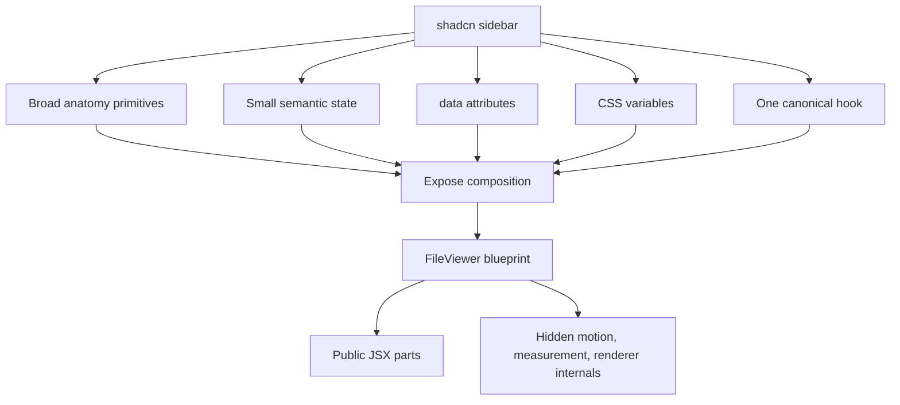

The target is not "fewer names." The target is "only the right names."

## North Star

The viewer should feel like Apple Preview:

- pressing the sidebar button starts motion immediately;
- sidebar and document move as one attached object;
- the document stays centered in the available space;
- the current reading position remains visually stable;
- no frame shows a blank document while toggling;
- raster quality can refine after motion, but geometry is continuous;
- PDF is one renderer, not the hidden owner of the viewer shell;
- every file family uses the same shell, state, and renderer contract.

The universal model is:

```txt
resource + semantic state + container + motion -> frame -> shell + renderer
```

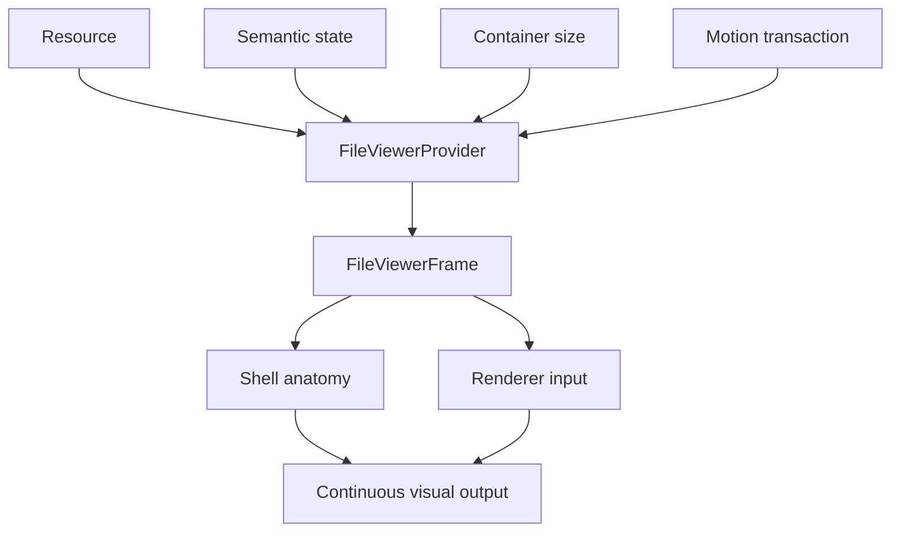

Anything that cannot be explained by this chain is suspect.

## Shadcn Sidebar Lessons

The shadcn sidebar gives four architectural lessons.

1. Public parts are real anatomy.
2. State is exposed through data attributes and CSS variables.
3. Controlled and uncontrolled usage share one state path.
4. The public hook exposes semantic intent, not layout internals.

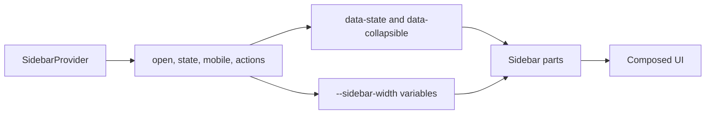

The file viewer should mirror this shape.

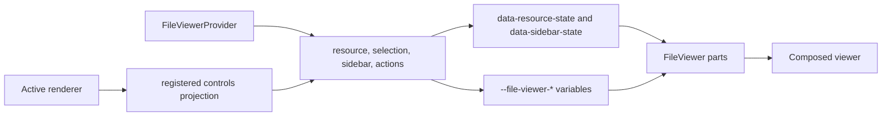

The lesson is not to export only provider, root, sidebar, and inset. The lesson
is to export the primitives people actually compose, while refusing to export
the machinery that makes them move.

## Design Laws

### One Fact, One Owner, One Name

| Fact | Owner | Forbidden owner |
| --- | --- | --- |
| file identity | resource model | renderer layout |
| selected source | viewer state | sidebar DOM |
| sidebar state | viewer state | renderer |
| shell geometry | frame model | PDF component |
| document visual size | frame model | canvas resolution |
| reading position | anchor model | virtualizer |
| mounted pages | renderer runtime | shell |
| raster quality | renderer runtime | shell motion |
| accessibility state | shell primitives | animation callbacks |

The same concept must have the same name everywhere. Different concepts must
not share a name.

### Public Anatomy, Private Mechanics

Public exports are JSX parts, semantic types, and one hook.

Private internals include motion kernels, resize observers, renderer-frame
subscriptions, raster caches, virtual windows, and scroll correction.

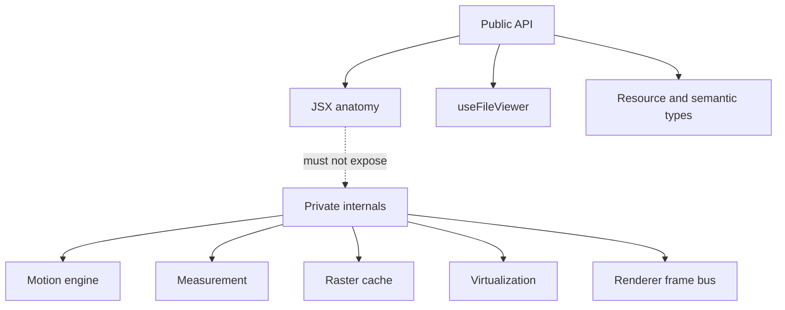

### Motion Is Geometry, Not Cleanup

Toggling the sidebar is not a React re-layout followed by scroll repair. It is a
single geometry transaction.

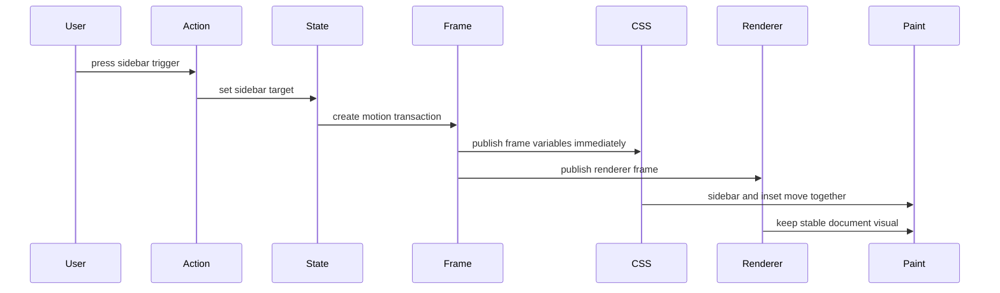

No ResizeObserver callback should be required for the first visible movement.
No PDF render should be required for the sidebar to start moving.

## Public Component Set

The target public API is broad, but not loose.

### Core Shell

```ts
export {
  FileViewerProvider,
  FileViewer,
  FileViewerHeader,
  FileViewerTitle,
  FileViewerMeta,
  FileViewerControls,
  FileViewerContent,
  FileViewerInset,
  FileViewerViewport,
  FileViewerDocument,
  useFileViewer,
}
```

Responsibilities:

| Primitive | Responsibility |
| --- | --- |
| `FileViewerProvider` | resource, semantic state, renderer registry, frame ownership |
| `FileViewer` | outer shell, CSS variables, data attributes |
| `FileViewerHeader` | top chrome |
| `FileViewerTitle` | current resource title |
| `FileViewerMeta` | current resource metadata |
| `FileViewerControls` | renderer and viewer controls |
| `FileViewerContent` | body row that contains sidebar and inset |
| `FileViewerInset` | main document side of the layout |
| `FileViewerViewport` | scrollable document viewport |
| `FileViewerDocument` | renderer outlet |
| `useFileViewer` | semantic state and actions |

### Sidebar Anatomy

```ts
export {
  FileViewerSidebar,
  FileViewerSidebarHeader,
  FileViewerSidebarContent,
  FileViewerSidebarFooter,
  FileViewerSidebarRail,
  FileViewerSidebarTrigger,
  FileViewerSidebarSection,
  FileViewerSidebarSectionHeader,
  FileViewerSidebarSectionTitle,
  FileViewerSidebarSectionContent,
  FileViewerSidebarSectionAction,
  FileViewerSidebarSeparator,
}
```

These are direct file-viewer equivalents of the shadcn sidebar anatomy. They are
not optional sugar. They make correct composition obvious.

### Source Anatomy

```ts
export {
  FileViewerSourceList,
  FileViewerSourceItem,
  FileViewerSourceTrigger,
  FileViewerSourceBadge,
  FileViewerSourceAction,
  FileViewerFieldSource,
  FileViewerFieldSourceLabel,
  FileViewerFieldSourceValue,
  FileViewerFieldSourceStatus,
}
```

These are public because file viewers often show source evidence, selected
files, pages, fields, citations, and generated artifacts in the sidebar.

They are the file-viewer analogue of `SidebarMenu`, `SidebarMenuItem`,
`SidebarMenuButton`, `SidebarMenuBadge`, and `SidebarGroup`.

### States

```ts
export {
  FileViewerEmptyState,
  FileViewerLoadingState,
  FileViewerErrorState,
  FileViewerUnsupportedState,
  FileViewerUnavailableState,
}
```

States are exported because consumers need to compose designed failures. Empty,
loading, unsupported, unavailable, and error states are part of the product
surface, not implementation details.

### Convenience API

`FileViewerPreview` may exist, but it is a recipe component, not the canonical
primitive model.

It must be implemented entirely with the public primitives above.

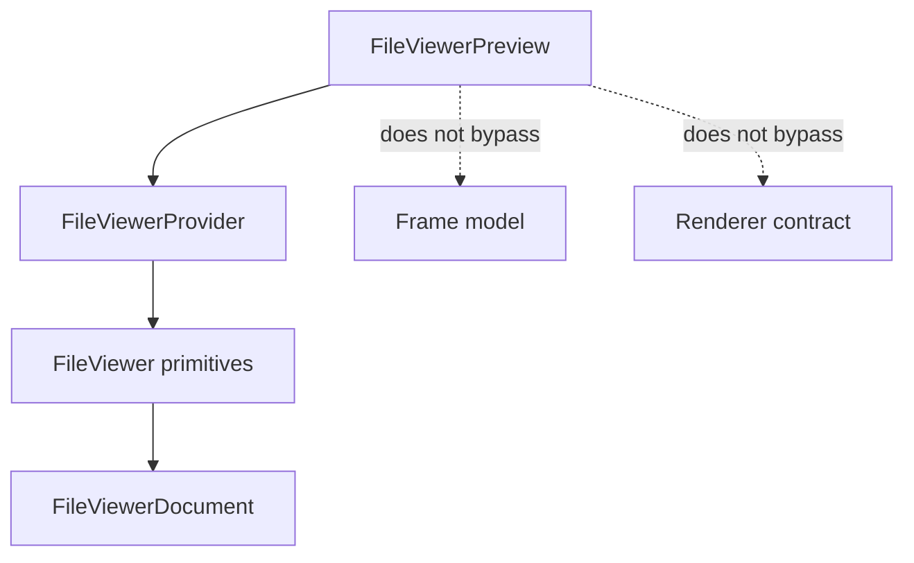

### Forbidden Main Exports

The main file-viewer entrypoint must not export:

- renderer-frame hooks;
- viewport measurement hooks;
- resize observer helpers;
- motion engine functions;
- raster cache types;
- virtualizer types;
- PDF layout internals;
- scroll correction internals;
- duplicate aliases for the same concept.

If custom renderer authoring becomes public, it gets a separate advanced
entrypoint. It does not pollute the shell anatomy entrypoint.

## Canonical Composition

```tsx
<FileViewerProvider resource={resource}>
  <FileViewer>
    <FileViewerHeader>
      <FileViewerSidebarTrigger />
      <FileViewerTitle />
      <FileViewerMeta />
      <FileViewerControls />
    </FileViewerHeader>

    <FileViewerContent>
      <FileViewerSidebar>
        <FileViewerSidebarHeader />
        <FileViewerSidebarContent>
          <FileViewerSourceList />
        </FileViewerSidebarContent>
        <FileViewerSidebarFooter />
        <FileViewerSidebarRail />
      </FileViewerSidebar>

      <FileViewerInset>
        <FileViewerViewport>
          <FileViewerDocument />
        </FileViewerViewport>
      </FileViewerInset>
    </FileViewerContent>
  </FileViewer>
</FileViewerProvider>
```

Correct composition should look inevitable. A user should not need to know
where resizing, scrolling, raster retention, or PDF layout happen.

## Semantic State

The provider owns semantic state. It does not own DOM details.

```ts
type FileViewerState = {
  resourceId: string | null
  status: FileViewerStatus
  sidebar: FileViewerSidebarState
  selection: FileViewerSelectionState
  anchor: FileViewerAnchor | null
}
```

```ts
type FileViewerSidebarState = {
  isOpen: boolean
}
```

Renderer state such as PDF page, slide index, zoom, search match, or rotation is
not provider state. The renderer owns the domain state and registers a projected
controls model for `FileViewerControls`.

The hook exposes semantic state and actions.

```ts
type FileViewerApi = {
  resource: FileViewerResource | null
  status: FileViewerStatus
  sidebar: FileViewerSidebarState
  selection: FileViewerSelectionState
  setSidebarOpen(isOpen: boolean): void
  toggleSidebar(): void
  retry(): void
}
```

It does not expose frame dimensions, scrollTop, motion progress, observed
viewport size, virtual ranges, or renderer caches.

## Resource Contract

The resource edge stays explicit.

```ts
type FileViewerResource = {
  id: string
  name: string
  mimeType: string
  source:
    | { kind: "url"; url: string }
    | { kind: "bytes"; bytes: Uint8Array }
    | { kind: "text"; text: string }
  fallbackSize?: FileViewerSize
}

type FileViewerSize = {
  inlineSize: number
  blockSize: number
}
```

The viewer must not infer identity from layout. It may inspect content safely,
but renderer selection starts from explicit metadata.

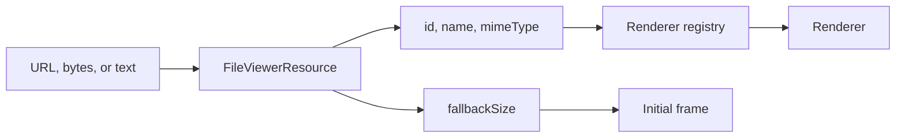

## Frame Model

The frame model is the core of the component.

It derives all geometry from semantic state, container size, and motion.

```txt
deriveFileViewerFrame(state, container, motion) -> FileViewerFrame
```

```ts
type FileViewerFrame = {
  containerInlineSize: number
  containerBlockSize: number
  headerBlockSize: number
  contentInlineSize: number
  contentBlockSize: number
  sidebarInlineSize: number
  insetInlineSize: number
  viewportInlineSize: number
  viewportBlockSize: number
  documentInlineSize: number
  documentBlockSize: number
  motion: FileViewerMotionState
}

type FileViewerMotionState = {
  isActive: boolean
  kind: "sidebar" | "zoom" | "resource" | null
  progress: number
  startedAt: number | null
  durationMs: number
}
```

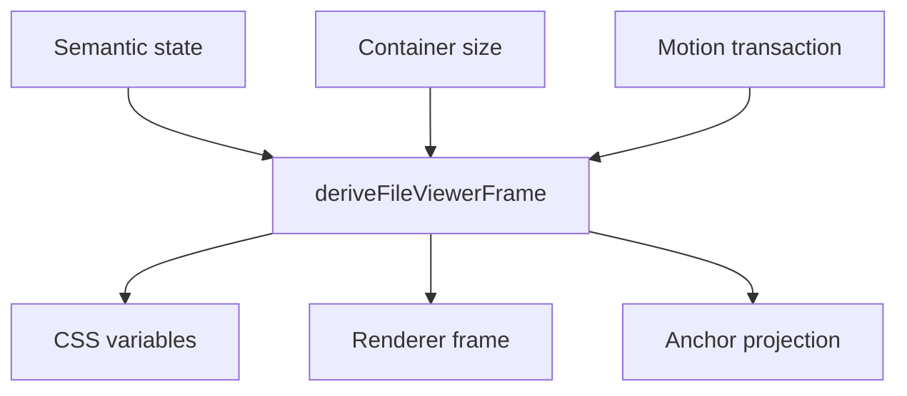

Names matter:

| Name | Meaning |
| --- | --- |
| `containerInlineSize` | outer measured host width |
| `contentInlineSize` | body width below header |
| `sidebarInlineSize` | current sidebar track width |
| `insetInlineSize` | area beside sidebar |
| `viewportInlineSize` | scrollable document viewport width |
| `documentInlineSize` | visual document width |
| `anchor` | semantic reading position |

There should be no generic `width` or `availableWidth` in core code.

## Shell Geometry

The sidebar and inset must be siblings in one layout model.

They cannot be two independent animations.

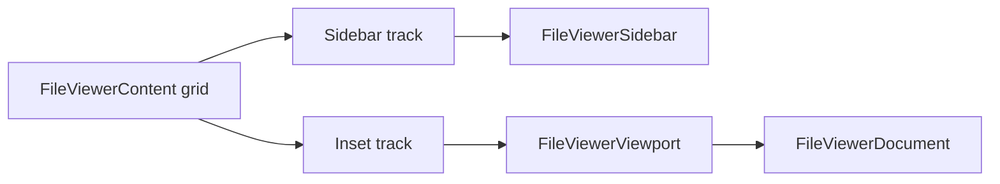

The shell publishes CSS variables:

```css
--file-viewer-sidebar-inline-size
--file-viewer-sidebar-open-inline-size
--file-viewer-sidebar-closed-inline-size
--file-viewer-inset-inline-size
--file-viewer-viewport-inline-size
--file-viewer-document-inline-size
--file-viewer-motion-progress
```

The DOM uses data attributes:

```txt
data-slot
data-sidebar-state
data-resource-state
data-motion
data-renderer
```

The shell can use CSS transitions and registered custom properties, but there
must be one owner for the scalar that sidebar and document use. If the sidebar
slides with one scalar and the document resizes from a later DOM measurement,
the design is wrong.

## Sidebar Motion

Sidebar motion must start immediately and stay attached to the document edge.

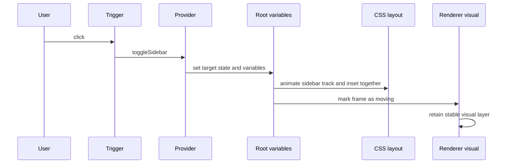

Required behavior:

- no input delay;
- no React render per animation frame;
- no ResizeObserver required for first motion;
- no scrollTop correction loop during the visible transition;
- no sidebar/document phase mismatch;
- no separate PDF-specific sidebar path.

The browser should do the continuous interpolation. JavaScript should start the
transaction and publish the settled semantic state.

## Renderer Contract

Every renderer receives the same contract.

```ts
type FileViewerRenderer = {
  id: string
  canRender(resource: FileViewerResource): boolean
  load(resource: FileViewerResource): Promise<FileViewerRendererDocument>
  getInitialAnchor(document: FileViewerRendererDocument): FileViewerAnchor
  render(input: FileViewerRendererInput): React.ReactNode
}

type FileViewerRendererInput = {
  resource: FileViewerResource
  document: FileViewerRendererDocument
  state: FileViewerState
  frame: FileViewerRendererFrame
  onAnchorChange(anchor: FileViewerAnchor): void
}
```

The renderer frame is not the public shell frame. It is the minimal renderer
view of geometry.

```ts
type FileViewerRendererFrame = {
  viewportInlineSize: number
  viewportBlockSize: number
  documentInlineSize: number
  documentBlockSize: number
  isMotionActive: boolean
}
```

Renderer rules:

- render a deterministic fallback before parsing completes;
- preserve semantic anchor across frame changes;
- keep the last coherent visual during motion;
- refine raster after motion or during idle budget;
- never mutate shell geometry;
- never own sidebar layout;
- never derive viewer state from DOM measurement.

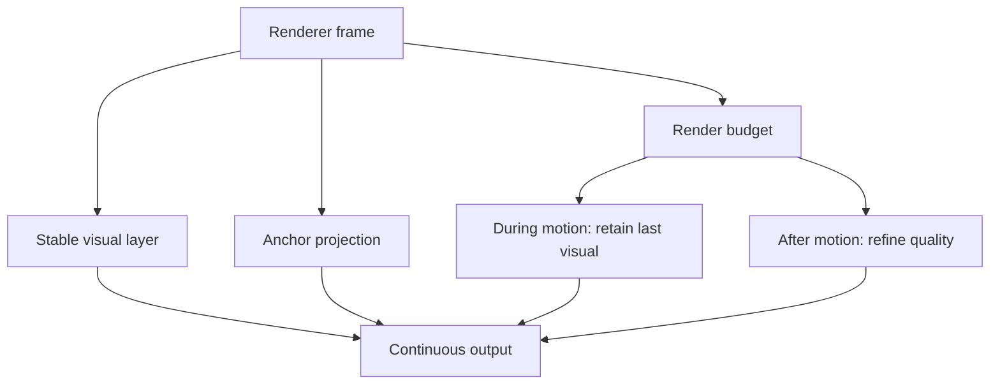

## PDF Renderer

PDF is the hardest renderer, so it must not special-case the shell.

PDF owns:

- pdf.js document loading;
- page metrics;
- page virtualization;
- canvas raster scheduling;
- text layer and annotations;
- PDF-specific anchors.

PDF does not own:

- sidebar state;
- shell sizing;
- header sizing;
- document centering;
- generic control placement;
- global scroll correction.

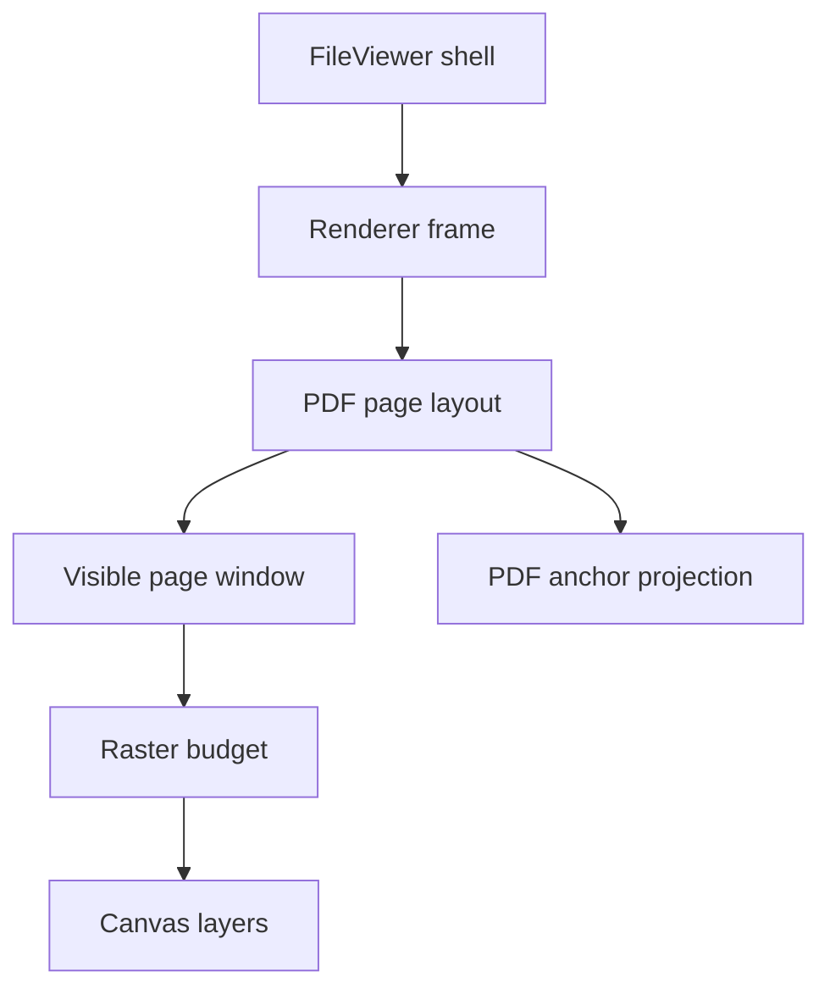

During sidebar motion, PDF should keep mounted pages and visual layers stable.
The page may be CSS-scaled temporarily. High-resolution canvas refinement can
land after motion without changing layout.

## Anchor Model

The viewer stores semantic anchors, not raw scroll positions.

```ts
type FileViewerAnchor = {
  itemId: string
  itemBlockOffset: number
  viewportBlockOffset: number
}
```

For PDF:

```txt
pageId + pageBlockOffset + viewportBlockOffset
```

For tables:

```txt
rowId + rowBlockOffset + viewportBlockOffset
```

For text and code:

```txt
blockId + blockOffset + viewportBlockOffset
```

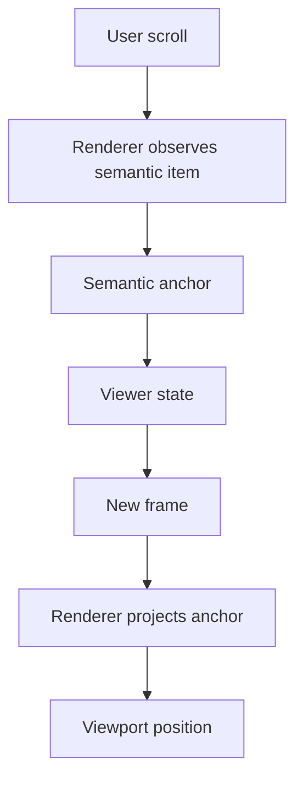

Virtualization may use scroll position, but it must not own the reading
position.

## Virtualization

Virtualization is a renderer optimization, not user-visible behavior.

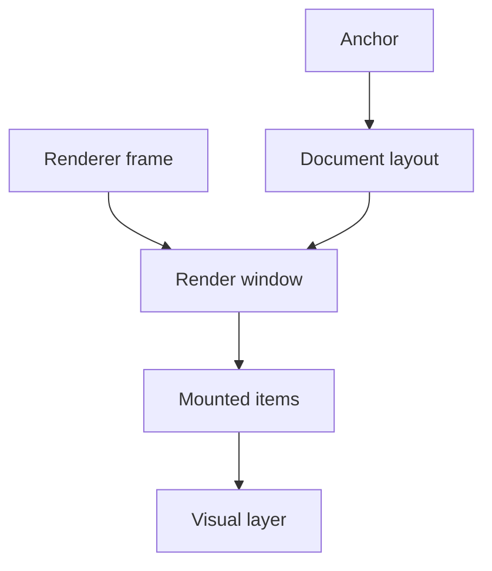

Rules:

- protect the anchor item during shell motion;
- increase overscan while motion is active;
- never unmount the currently visible page because the sidebar is toggling;
- placeholders must have stable intrinsic dimensions;
- canvas quality may lag, geometry may not.

## Module Boundaries

The implementation should have one module per concept.

```txt
file-viewer/
  index.ts
  file-viewer.tsx
  file-viewer-provider.tsx
  file-viewer-resource.ts
  file-viewer-state.ts
  file-viewer-frame.ts
  file-viewer-anchor.ts
  file-viewer-renderer.ts
  file-viewer-shell.tsx
  file-viewer-sidebar.tsx
  file-viewer-source.tsx
  file-viewer-controls.tsx
  file-viewer-state-view.tsx
  file-viewer-preview.tsx
  renderers/
    pdf/
      pdf-renderer.tsx
      pdf-document.ts
      pdf-layout.ts
      pdf-anchor.ts
      pdf-virtual-window.ts
      pdf-raster-cache.ts
    image/
      image-renderer.tsx
    text/
      text-renderer.tsx
    table/
      table-renderer.tsx
    office/
      office-renderer.tsx
```

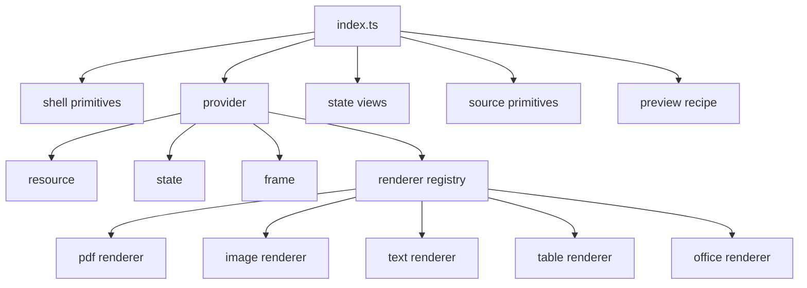

No module should own both shell geometry and renderer meaning.

## Accessibility

Accessibility is part of the ideal, not a finishing pass.

Required behavior:

- sidebar trigger has `aria-expanded`;
- sidebar panel has a stable accessible label;
- control buttons have names and keyboard focus;
- page and zoom controls expose current values;
- loading states announce without stealing focus;
- errors announce and provide retry when possible;
- focus remains predictable after sidebar open and close;
- reduced motion uses the same final frame without animation.

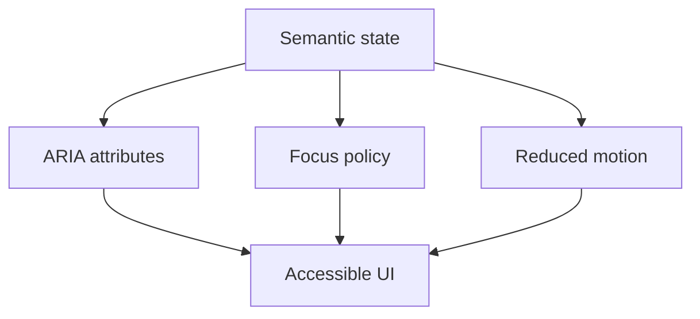

## Performance Budget

The input-to-motion path must be almost empty.

| Path | Budget |
| --- | --- |
| click to first visual movement | same frame when possible |
| per-frame hot path | browser interpolation, no React render |
| sidebar/document edge delta | zero by construction |
| visible blank frames during sidebar toggle | zero |
| scroll jump during toggle | zero visible jump |
| raster refinement | idle or after motion |
| renderer mount cost | cached or amortized |

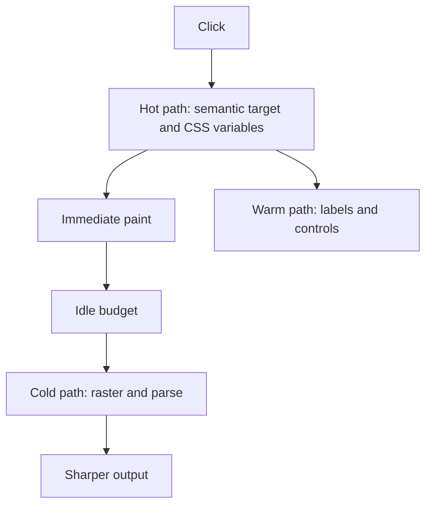

If a renderer is slow, it keeps showing the last coherent visual. It does not
block shell motion.

## Testing Contract

The test suite must sample the transition, not only the settled state.

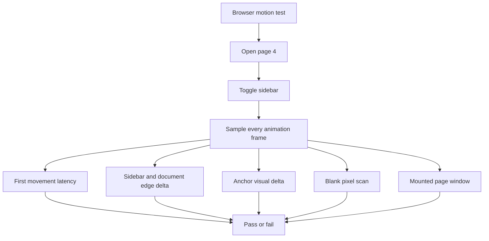

Required tests:

- resource normalization tests;
- state reducer tests;
- frame derivation tests;
- shell data-attribute tests;
- renderer contract tests;
- PDF anchor projection tests;
- PDF virtualization retention tests;
- browser first-frame sidebar tests;
- browser page-4 toggle tests;
- reduced-motion tests;
- unsupported-resource tests;
- docs examples compile tests.

The browser tests must fail if the viewer is wrong for 120 ms but correct after
settle.

## Documentation Contract

Docs should teach the production model.

Required docs:

- basic file viewer;
- PDF with sidebar;
- source list sidebar;
- controls composition;
- resource contract;
- renderer selection;
- loading, empty, unsupported, and error states;
- performance model;
- accessibility behavior;
- custom renderer contract if custom renderers are public.

Docs must not show alternate integration paths that bypass the provider, frame
model, or renderer contract.

## Cutover Policy

No compatibility shims.

No duplicate old and new paths in the runtime graph.

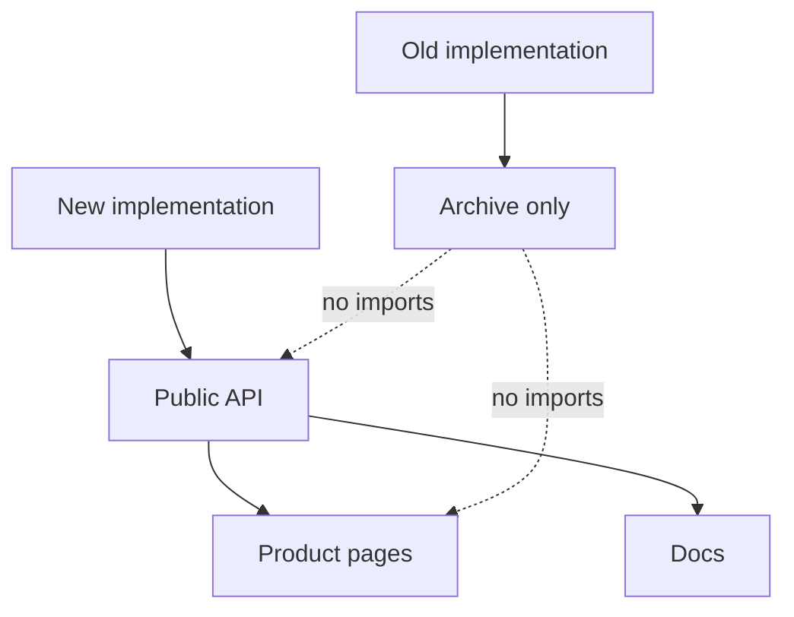

Old code can live in an archive folder for reference. It must not participate in
runtime behavior, public exports, tests, or docs examples.

## Decision Checklist

Before adding any public export, ask:

1. Does a consumer place this in JSX?
2. Is it a stable product concept?
3. Is it named with the same vocabulary as related parts?
4. Does shadcn sidebar expose an analogous anatomy primitive?
5. Can it be implemented without leaking motion, measurement, or renderer
   internals?

If the answer is no, it is private.

Before adding any internal module, ask:

1. Does it own exactly one concept?
2. Does another module already own that fact?
3. Does the name describe a product fact or an implementation tactic?
4. Can it be tested without mounting the whole viewer?
5. Could it block input-to-motion?

If it owns multiple concepts, split it. If it blocks motion, redesign it.

## Definition Of Done

The component reaches the target only when all of these are true:

- public exports are anatomy, semantic types, states, and one hook;
- no motion, measurement, raster, virtualizer, or renderer-frame hook leaks from
  the main API;
- sidebar and inset are one geometric system;
- PDF uses the same renderer contract as every other file family;
- toggling the sidebar on page 4 has no delayed start, no overshoot, no
  retraction, no visible blanking, and no abrupt scroll jump;
- reduced motion is instant and exact;
- homepage examples and docs examples use the production path;
- tests sample transitions frame by frame;
- docs describe the actual architecture;
- old code is not in the import graph.

## Final Target

The platonic file viewer is not a small component. It is a simple system.

It is simple because every fact has one owner. It is fast because the hot path
does almost nothing. It is complete because it includes anatomy, states,
accessibility, renderer contracts, and tests. It contains nothing extra because
mechanics do not leak into the public API.

That is the shadcn lesson applied to a universal file viewer.
