# File Viewer Apple Preview-Grade Motion Blueprint

## Purpose

This blueprint targets one specific failure:

```txt
Toggling the file viewer sidebar does not feel Apple Preview-grade.
```

The visible symptoms are:

- delay before motion starts;
- document overshoot;
- document retraction;
- sidebar and document not moving as one attached object;
- occasional blink from PDF virtualization or canvas replacement;
- small abrupt vertical correction when the current page is not near the top;
- behavior that feels different between open and close.

This is not a styling problem. It is not primarily an easing problem. It is an
architecture problem: the viewer has several independent correction systems
that react to each other after layout instead of being driven by one shared
motion model.

The goal is a motion system that is:

```txt
immediate
linear
monotonic
blink-free
renderer-agnostic
hard to misuse
cheap under PDF load
simple to reason about
```

The north star is not a prettier PDF viewer. The north star is a file viewer
where shell geometry is deterministic and renderers cannot accidentally fight
the shell.

## Clean-Slate Constraint

This blueprint does not treat legacy code as a constraint.

The target architecture may reuse correct names, public anatomy, and tests, but
it must not preserve a flawed mechanism for compatibility. If an existing path
creates a second clock, a second geometry authority, or a post-layout correction
loop, the ideal implementation deletes it.

The design target is:

```txt
one semantic owner
one geometry owner
one motion clock
one renderer contract
one scroll-anchor policy
one paint-fidelity policy
zero transition correction loops
zero compatibility shims
```

The public component grammar can remain shadcn-like because it is good. The
internal motion architecture should be rebuilt as if the old implementation did
not exist.

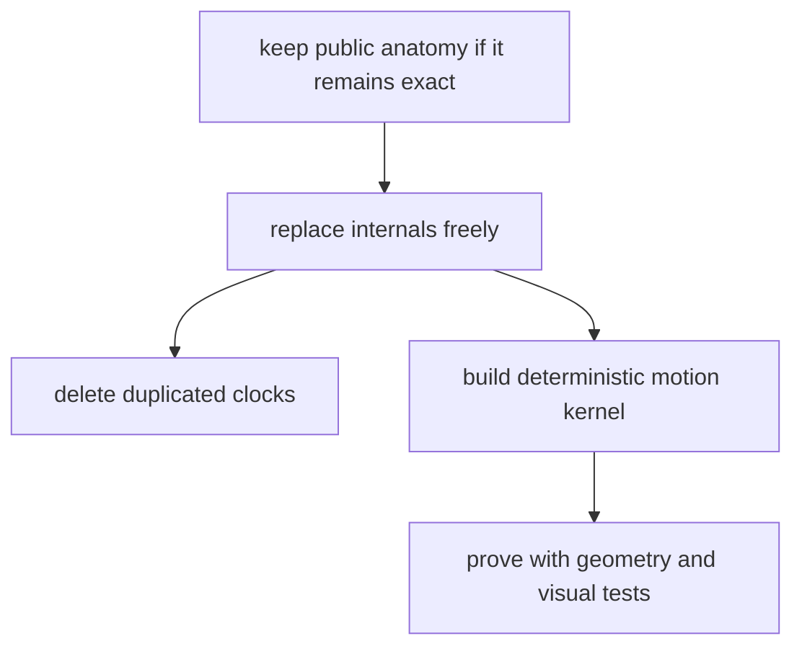
```mermaid
flowchart TD
  Keep["keep public anatomy if it remains exact"] --> Replace["replace internals freely"]
  Replace --> Delete["delete duplicated clocks"]
  Replace --> Rebuild["build deterministic motion kernel"]
  Rebuild --> Prove["prove with geometry and visual tests"]
```

## Verdict

The current component has improved modularity, but the motion model has not
reached the platonic ideal.

The reason is precise:

```txt
The sidebar transition, document frame width, PDF display scale, scroll anchor,
virtualization window, FLIP transform, and canvas render lifecycle are not
derived from one authoritative transition scalar.
```

They are coordinated through DOM measurement, layout effects, timers,
ResizeObserver callbacks, requestAnimationFrame, and pdf.js rendering. Each
piece is defensible in isolation. The combination is not Apple Preview-grade.

## Absolute Architecture Verdict

The platonic architecture is not:

```txt
CSS transition plus ResizeObserver plus FLIP plus scroll correction plus
virtualization compensation.
```

The platonic architecture is:

```txt
a deterministic viewer motion kernel that owns every visible geometry value for
the duration of the interaction.
```

Everything visible during sidebar motion must be derived from the same frame:

```txt
geometryFrame = f(transaction, time)
```

Not from:

```txt
DOM after layout
ResizeObserver after layout
React effects after commit
pdf.js after raster
FLIP after rect comparison
```

This is the architectural cut:

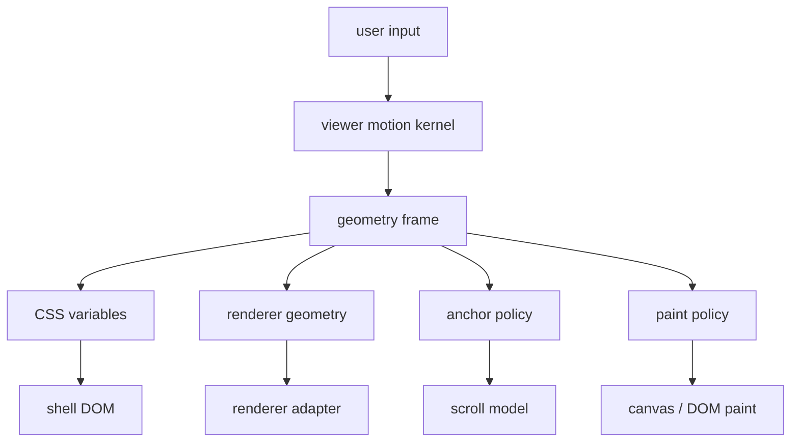
```mermaid
flowchart TD
  User["user input"] --> Kernel["viewer motion kernel"]
  Kernel --> Frame["geometry frame"]

  Frame --> CssVars["CSS variables"]
  Frame --> RendererGeometry["renderer geometry"]
  Frame --> AnchorPolicy["anchor policy"]
  Frame --> PaintPolicy["paint policy"]

  CssVars --> Shell["shell DOM"]
  RendererGeometry --> Renderer["renderer adapter"]
  AnchorPolicy --> Scroll["scroll model"]
  PaintPolicy --> Canvas["canvas / DOM paint"]
```

The motion kernel is not a renderer feature. It is a viewer primitive feature.
PDF, image, markdown, spreadsheet, and text renderers consume it. They do not
reconstruct it.

## Non-Negotiables

These are architectural laws, not preferences.

### One Motion Clock

There is exactly one clock during sidebar motion:

```txt
transitionProgress = clamp((now - startedAt) / durationMs, 0, 1)
```

Every visible value uses that frame. There are no independent CSS transitions
for geometry while the motion kernel is active.

### No Sidebar-Driven FLIP

Sidebar resize is not a layout surprise. The viewer knows the start width, end
width, sidebar width, body width, and duration. FLIP is the wrong tool for a
known deterministic transition.

FLIP may exist only for truly unknown layout jumps outside the shell-motion
path. It must not run for sidebar toggles.

### No Post-Layout Measurement Loop For Owned Motion

Owned motion must never be:

```txt
change layout -> measure layout -> infer transition -> correct renderer
```

It must be:

```txt
start transition -> derive frame -> write layout and renderer inputs
```

ResizeObserver is allowed for external events:

- root resize;
- container breakpoint changes;
- device orientation changes;
- first mount measurement.

ResizeObserver is not allowed to be the source of truth for a transition the
viewer itself started.

### React Must Not Render Every Motion Frame

The motion kernel can publish snapshots through an external store and write CSS
variables directly to the shell root. React may subscribe for coarse state, but
the PDF tree must not re-render on every animation frame.

Motion is too hot for ordinary React state.

### Renderer Layout And Raster Quality Are Different

The renderer contract must make it impossible to confuse:

- visual slot width;
- final settled width;
- canvas raster target width.

Those are different values with different lifetimes.

### Canvas Must Never Gate Shell Motion

pdf.js rendering is asynchronous and expensive. It must never decide whether the
sidebar/document motion can begin, continue, or finish.

Canvas improves fidelity after the motion. It does not own the motion.

### Virtualization Must Never Expose Motion

Virtualization may optimize work. It may not visibly remove the current reading
surface during a shell transition.

During motion, memory can be temporarily less optimal. Visual continuity wins.

## Browser Evidence

In the homepage viewer at `http://localhost:3100/`, the file viewer root was
about `701px` wide. The inline sidebar gap was about `420px`. With the sidebar
open, the PDF document frame was only about `281px` wide. With the sidebar
closed, the frame expands to about `701px`.

That is a large transition:

```txt
281px -> 701px
```

The width changes by about `2.5x`.

During a sampled sidebar-open transition, the browser showed:

```txt
sidebar gap: 420px
document frame: 281px
PDF visual layer: ~613px wide
PDF visual transform: matrix(2.18...)
```

That means the layout had already landed on the final open state while the PDF
visual layer was still visually large and being transformed down. This is the
overshoot/retraction the user sees.

The important part is not the exact number. The important part is the ordering:

```txt
CSS layout reaches final state
PDF visual layer is still animated from a different state
canvas/render state is yet another state
```

That proves the system is not moving as one physical object.

## Current Architecture

The current user-facing composition is good:

```tsx
<FileViewerProvider source={source} defaultSidebarOpen>
  <FileViewer sidebarMode="inline">
    <FileViewerHeader />
    <FileViewerBody>
      <FileViewerSidebar />
      <FileViewerInset>
        <FileViewerViewport>
          <FileViewerDocument />
        </FileViewerViewport>
      </FileViewerInset>
    </FileViewerBody>
  </FileViewer>
</FileViewerProvider>
```

The public anatomy is right. The motion internals are not yet right.

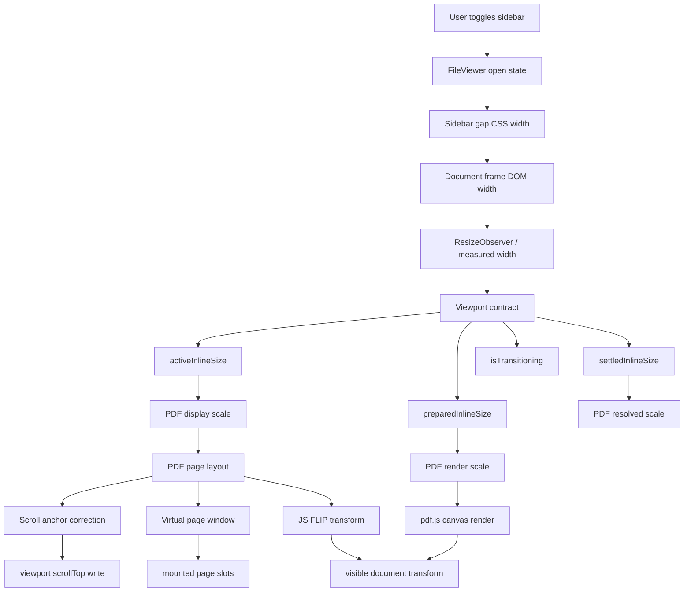
```mermaid
flowchart TD
  Toggle["User toggles sidebar"] --> ReactState["FileViewer open state"]
  ReactState --> Gap["Sidebar gap CSS width"]
  Gap --> Frame["Document frame DOM width"]
  Frame --> ResizeObserver["ResizeObserver / measured width"]

  ResizeObserver --> ViewportContract["Viewport contract"]
  ViewportContract --> ActiveSize["activeInlineSize"]
  ViewportContract --> SettledSize["settledInlineSize"]
  ViewportContract --> PreparedSize["preparedInlineSize"]
  ViewportContract --> TransitionFlag["isTransitioning"]

  ActiveSize --> DisplayScale["PDF display scale"]
  SettledSize --> ResolvedScale["PDF resolved scale"]
  PreparedSize --> RenderScale["PDF render scale"]

  DisplayScale --> PageLayout["PDF page layout"]
  PageLayout --> ScrollAnchor["Scroll anchor correction"]
  PageLayout --> VirtualWindow["Virtual page window"]
  PageLayout --> Flip["JS FLIP transform"]
  RenderScale --> Canvas["pdf.js canvas render"]

  ScrollAnchor --> ViewportScroll["viewport scrollTop write"]
  VirtualWindow --> PageSlots["mounted page slots"]
  Flip --> VisualLayer["visible document transform"]
  Canvas --> VisualLayer
```

This architecture uses several clocks:

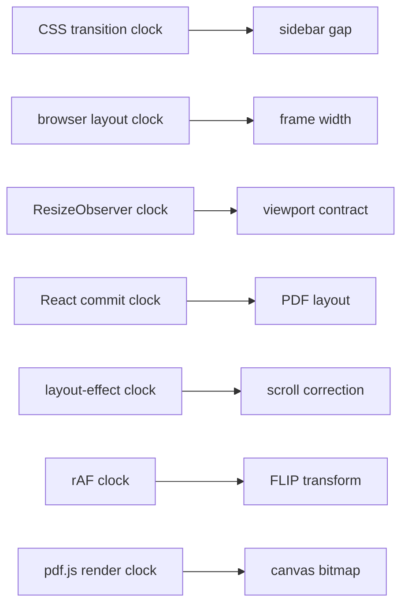
```mermaid
flowchart LR
  CssClock["CSS transition clock"] --> Gap["sidebar gap"]
  BrowserLayout["browser layout clock"] --> Frame["frame width"]
  ResizeClock["ResizeObserver clock"] --> Contract["viewport contract"]
  ReactClock["React commit clock"] --> Layout["PDF layout"]
  LayoutEffectClock["layout-effect clock"] --> Scroll["scroll correction"]
  RafClock["rAF clock"] --> Flip["FLIP transform"]
  PdfClock["pdf.js render clock"] --> Canvas["canvas bitmap"]
```

When the system is idle, this can look correct.

When the transition is large or the PDF is expensive, these clocks diverge. The
user sees the divergence as a physical defect.

## Current Good Parts

The current implementation has several correct ideas that should be preserved.

### Correct public grammar

The public component grammar is shadcn-like:

```txt
provider owns semantic state
root exposes data attributes
body owns layout
sidebar is a primitive
inset owns document frame
viewport contains renderer
renderer owns file semantics
```

This should not be thrown away.

### Correct sidebar anatomy

The sidebar gap and sidebar panel are separate DOM concerns.

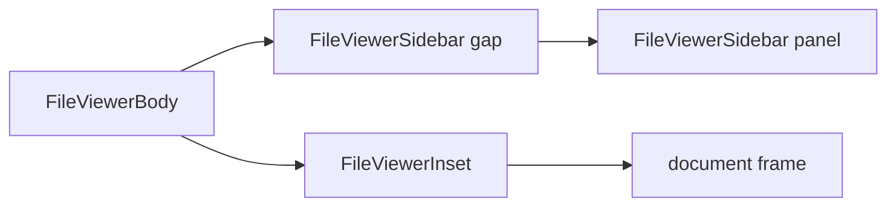
```mermaid
flowchart LR
  Body["FileViewerBody"] --> Gap["FileViewerSidebar gap"]
  Gap --> Panel["FileViewerSidebar panel"]
  Body --> Inset["FileViewerInset"]
  Inset --> Frame["document frame"]
```

That mirrors the best idea in shadcn sidebar: one element reserves layout space,
another element renders the panel.

### Correct renderer split

PDF internals are now more modular:

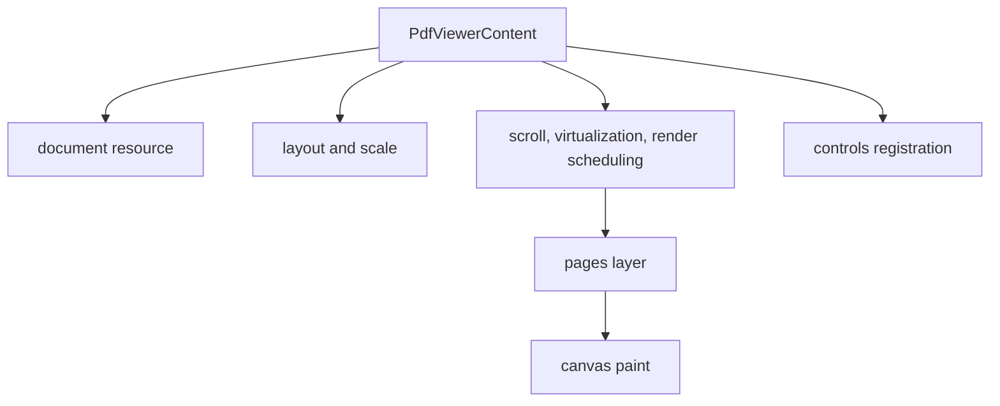
```mermaid
flowchart TD
  PdfContent["PdfViewerContent"] --> Resource["document resource"]
  PdfContent --> Layout["layout and scale"]
  PdfContent --> Runtime["scroll, virtualization, render scheduling"]
  PdfContent --> Controls["controls registration"]
  Runtime --> PagesLayer["pages layer"]
  PagesLayer --> PdfPage["canvas paint"]
```

This is a good boundary. The problem is not file count. The problem is that the
layout/scroll/runtime modules still react to shell geometry instead of sharing
a deterministic geometry source.

### Correct anchor intent

The viewer tries to preserve reading position while layout changes.

That is necessary.

The issue is only the mechanism: preserving the anchor by corrective scroll
writes after a measured layout change is inherently vulnerable to visible
intermediate frames.

## Current Design Smells

### Smell 1: Transition state is inferred from measured width

The document viewport contract currently receives a frame width and then derives
transition state from the difference between `activeInlineSize` and
`settledInlineSize`.

Conceptually:

```txt
width changed
therefore we are transitioning
wait transitionDurationMs
then call current width settled
```

That is backwards.

The ideal model is:

```txt
transition started
therefore progress is known
therefore active width is known
therefore document scale is known
```

The current model is reactive. The ideal model is generative.

### Smell 2: `preparedInlineSize` is not a physical width

The current contract prepares using the larger of active and settled width. This
is useful for render quality because it avoids under-rasterizing during growth.
But it is not the same as the visible width.

During transition there can be three widths:

```txt
activeInlineSize: measured current frame width
settledInlineSize: previous or final stable width
preparedInlineSize: max(active, settled)
```

Only one of those is the physical layout width. Another is a render-cache
strategy. Another is a semantic settled value.

When those concepts leak into animation, the document can visually represent
the wrong one.

### Smell 3: FLIP animates after layout has already changed

FLIP is useful when an element jumps between two layout states and we want to
hide that jump.

But in this viewer, the sidebar is already animating the layout gap. Adding FLIP
on the document creates a second animation on top of the layout animation.

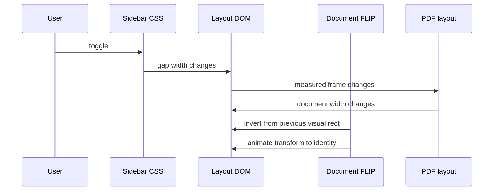
```mermaid
sequenceDiagram
  participant U as User
  participant CSS as Sidebar CSS
  participant DOM as Layout DOM
  participant FLIP as Document FLIP
  participant PDF as PDF layout

  U->>CSS: toggle
  CSS->>DOM: gap width changes
  DOM->>PDF: measured frame changes
  PDF->>DOM: document width changes
  FLIP->>DOM: invert from previous visual rect
  FLIP->>DOM: animate transform to identity
```

The FLIP layer is not attached to the same scalar as the sidebar. It is attached
to a before/after rectangle. That is why it can overshoot while the sidebar is
already done.

### Smell 4: Scroll correction is a side effect of layout

The scroll layer preserves a reading anchor by:

1. reading previous layout;
2. reading current physical scroll;
3. computing logical scroll;
4. computing anchor;
5. computing target scroll in the next layout;
6. writing `scrollTop`.

This is correct in a static resize. It is fragile during animation because
layout is changing repeatedly and the scroll write itself can schedule more
scroll work.

The ideal model keeps anchor identity stable and derives scroll from the same
transition model that derives width.

### Smell 5: Virtualization is allowed to react during motion

Virtualization currently receives layout and scroll metrics and updates the
render window. During a large scale transition, many pages can move in or out of
the computed window.

If virtualization changes the mounted page set during the same visible motion,
the user can see blanks, skeletons, or canvas replacements.

During shell motion, virtualization should be conservative:

```txt
keep previous mounted window
union with current needed window
avoid unmounting visible pages
release extra pages after motion settles
```

Some of this exists, but it is still downstream of inferred transition state.

### Smell 6: Canvas paint participates in perceived motion

Canvas rendering is expensive and asynchronous. It should improve fidelity
after the shell motion, not define the shell motion.

If the canvas is resized or replaced during the transition, it can blink. If it
stays as an old bitmap and CSS scales it, it can blur briefly, but the motion is
smooth. Apple Preview-grade motion should prefer temporary blur over structural
blink.

## Platonic Ideal

The ideal architecture has one source of geometry truth.

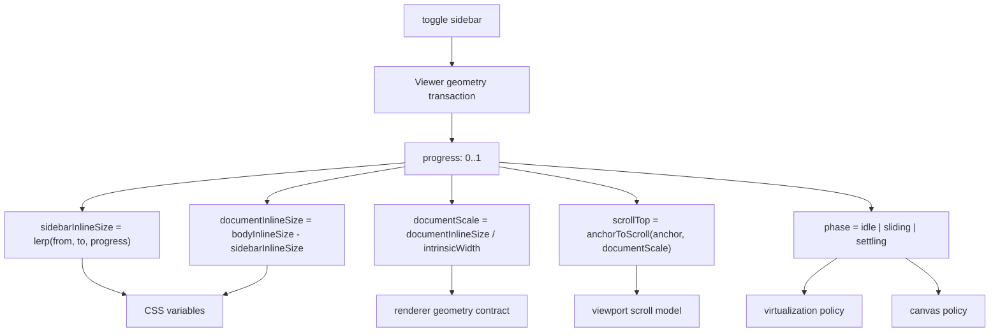
```mermaid
flowchart TD
  Toggle["toggle sidebar"] --> Transaction["Viewer geometry transaction"]
  Transaction --> Scalar["progress: 0..1"]

  Scalar --> SidebarWidth["sidebarInlineSize = lerp(from, to, progress)"]
  Scalar --> DocumentWidth["documentInlineSize = bodyInlineSize - sidebarInlineSize"]
  Scalar --> DocumentScale["documentScale = documentInlineSize / intrinsicWidth"]
  Scalar --> AnchorScroll["scrollTop = anchorToScroll(anchor, documentScale)"]
  Scalar --> TransitionPhase["phase = idle | sliding | settling"]

  SidebarWidth --> CSSVars["CSS variables"]
  DocumentWidth --> CSSVars
  DocumentScale --> RendererContract["renderer geometry contract"]
  AnchorScroll --> Viewport["viewport scroll model"]
  TransitionPhase --> Virtualization["virtualization policy"]
  TransitionPhase --> CanvasPolicy["canvas policy"]
```

The transition scalar is the clock. It drives everything visible.

The browser should not be asked:

```txt
What width did the sidebar happen to become after layout?
```

The browser should be told:

```txt
At progress 0.42, the sidebar width is 176.4px and the document width is 524.9px.
```

## Core Principle

The viewer must separate three kinds of size:

| Name | Meaning | Changes during transition | Used for |
| --- | --- | --- | --- |
| `layoutInlineSize` | The physical current document slot width | Yes, every frame | CSS vars, visual scale |
| `settledInlineSize` | The width after the transition completes | No, only at rest | control labels, fit-width baseline |
| `rasterInlineSize` | The width canvases should be rendered for | Rarely | canvas quality/cache |

These must not be conflated.

Today, `activeInlineSize`, `settledInlineSize`, and `preparedInlineSize` are
close to this model but not strict enough. The names allow render-preparation
strategy to leak into visual layout.

## Ideal Motion Pipeline

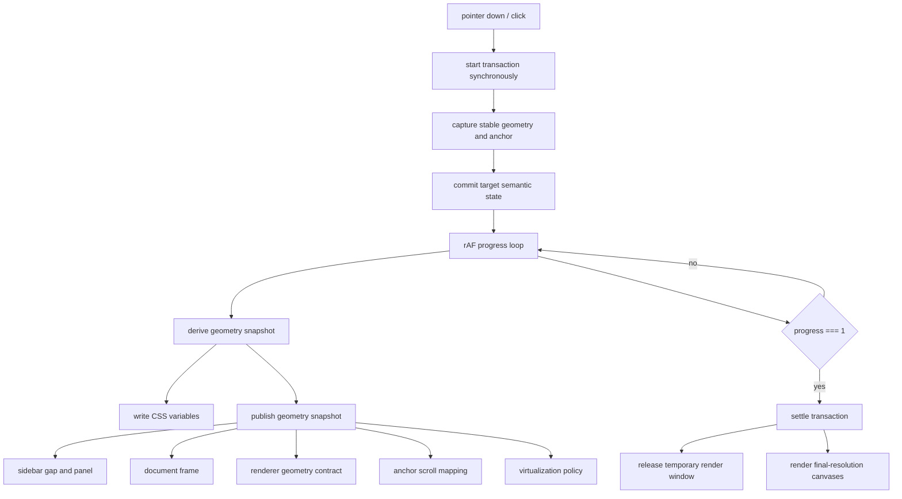
```mermaid
flowchart TD
  User["pointer down / click"] --> Start["start transaction synchronously"]
  Start --> Snapshot["capture stable geometry and anchor"]
  Snapshot --> Commit["commit target semantic state"]
  Commit --> Loop["rAF progress loop"]

  Loop --> Geometry["derive geometry snapshot"]
  Geometry --> CssVars["write CSS variables"]
  Geometry --> Store["publish geometry snapshot"]

  Store --> Shell["sidebar gap and panel"]
  Store --> Document["document frame"]
  Store --> Renderer["renderer geometry contract"]
  Store --> Scroll["anchor scroll mapping"]
  Store --> Virtual["virtualization policy"]

  Loop --> Done{"progress === 1"}
  Done -->|no| Loop
  Done -->|yes| Settle["settle transaction"]
  Settle --> Release["release temporary render window"]
  Settle --> Raster["render final-resolution canvases"]
```

Important ordering:

1. The click starts the transaction immediately.
2. The transaction captures current geometry and reading anchor before layout
   can drift.
3. The same transaction computes every frame.
4. The renderer receives geometry. It does not measure geometry.
5. Canvas quality can catch up after motion.

## Data Model

The ideal model has a small explicit transaction object.

```ts
type ViewerGeometryTransaction = {
  id: number
  cause: "sidebar-toggle" | "root-resize" | "orientation-change"
  startedAt: number
  durationMs: number
  from: ViewerGeometryRestState
  to: ViewerGeometryRestState
  anchor: ViewerReadingAnchor | null
}
```

Rest state:

```ts
type ViewerGeometryRestState = {
  bodyInlineSize: number
  sidebarInlineSize: number
  documentInlineSize: number
  state: "expanded" | "collapsed"
  mode: "inline" | "overlay"
  side: "left" | "right"
}
```

Frame state:

```ts
type ViewerGeometryFrame = {
  transactionId: number | null
  progress: number
  phase: "idle" | "sliding" | "settling"
  bodyInlineSize: number
  sidebarInlineSize: number
  documentInlineSize: number
  documentTranslateX: number
  sidebarTranslateX: number
  state: "expanded" | "collapsed"
  mode: "inline" | "overlay"
  side: "left" | "right"
}
```

Renderer geometry:

```ts
type ViewerRendererGeometry = {
  layoutInlineSize: number
  settledInlineSize: number
  rasterInlineSize: number
  isAnimatingShell: boolean
  transitionProgress: number
  transitionPhase: "idle" | "sliding" | "settling"
}
```

The renderer contract should be impossible to misread:

- `layoutInlineSize` is visual.
- `settledInlineSize` is semantic.
- `rasterInlineSize` is quality.

## CSS Ownership

CSS should still own actual visual application of the geometry. JavaScript
should not imperatively transform the PDF layer for normal sidebar transitions.

The shell should expose CSS variables:

```css
--viewer-body-inline-size
--viewer-sidebar-inline-size
--viewer-document-inline-size
--viewer-transition-progress
```

The layout should be direct:

```css
[data-slot="file-viewer-body"] {
  display: flex;
}

[data-slot="file-viewer-sidebar-gap"] {
  flex: 0 0 var(--viewer-sidebar-inline-size);
  width: var(--viewer-sidebar-inline-size);
}

[data-slot="file-viewer-document-frame"] {
  flex: 0 0 var(--viewer-document-inline-size);
  width: var(--viewer-document-inline-size);
}
```

There should be no separate CSS width transition on the gap when a JS geometry
transaction is active. Either:

- CSS owns the entire transition; or
- the geometry store owns the entire transition.

The mixed state is the smell.

For Apple Preview-grade document resize, the geometry store should own the
transition because the renderer, scroll anchor, and virtualization also need
progress.

## Why Not Pure CSS Only?

A pure CSS sidebar transition can be smooth for layout:

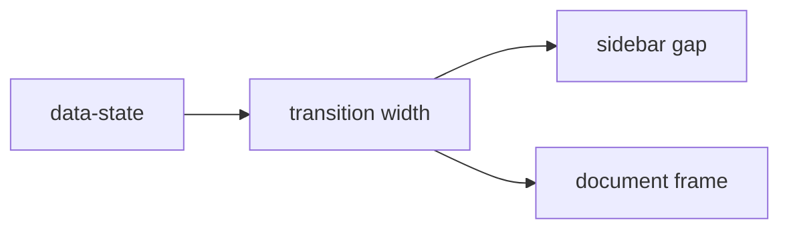
```mermaid
flowchart LR
  DataState["data-state"] --> CSS["transition width"]
  CSS --> Gap["sidebar gap"]
  CSS --> Frame["document frame"]
```

But PDF fit-width is not pure CSS. The PDF document model needs scale to compute:

- page slot width;
- page slot height;
- total document height;
- visible page;
- virtualized render window;
- scroll anchor target;
- canvas render size;
- overlay positions.

If CSS alone changes the frame width, JavaScript must later observe the width
and correct the PDF. That creates lag.

Pure CSS is acceptable only if the document is visually scaled with CSS and the
logical PDF layout stays frozen until the transition ends. That is a viable
variant, described below.

## Two Viable Designs

There are two clean designs. The current implementation is between them.

### Design A: Fully Derived Geometry

The geometry transaction emits every frame. The PDF logical layout updates every
frame from the derived document width.

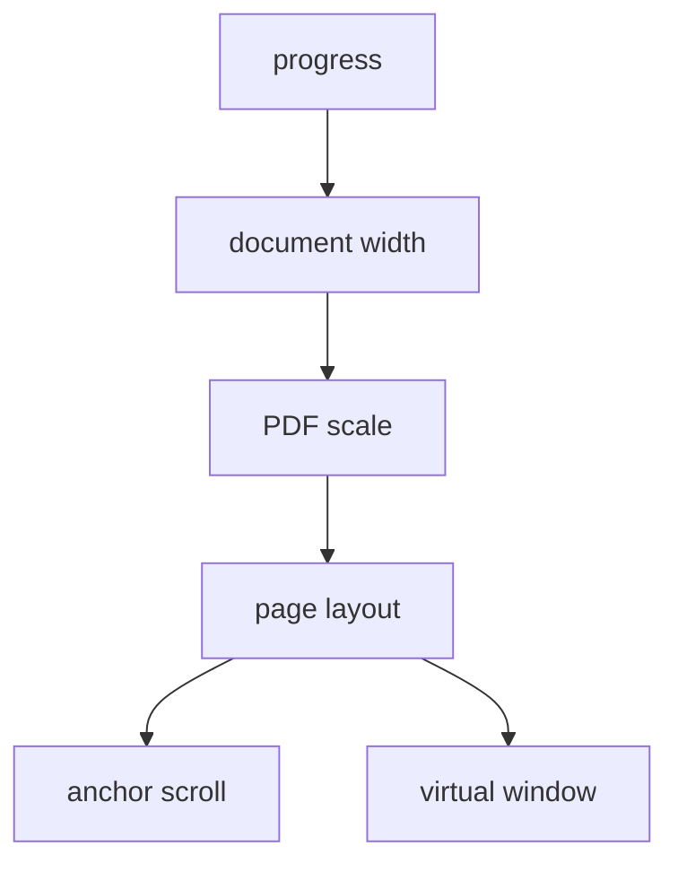
```mermaid
flowchart TD
  Scalar["progress"] --> Width["document width"]
  Width --> Scale["PDF scale"]
  Scale --> Layout["page layout"]
  Layout --> Scroll["anchor scroll"]
  Layout --> Virtual["virtual window"]
```

Pros:

- mathematically correct;
- scroll anchor can be exact every frame;
- no mismatch between shell width and PDF scale.

Cons:

- React may re-render expensive trees every frame unless carefully isolated;
- virtualization can churn unless frozen/unioned;
- page layout recomputation needs to be very cheap.

This is possible, but it requires a strict external geometry store and careful
subscriptions. It should not use ordinary React state for every frame.

### Design B: Frozen Logical Layout, Composited Visual Scale

The shell animates width. The PDF logical layout stays fixed during motion. The
PDF visual layer is scaled/composited to match the moving frame. When motion
ends, the logical layout commits once.

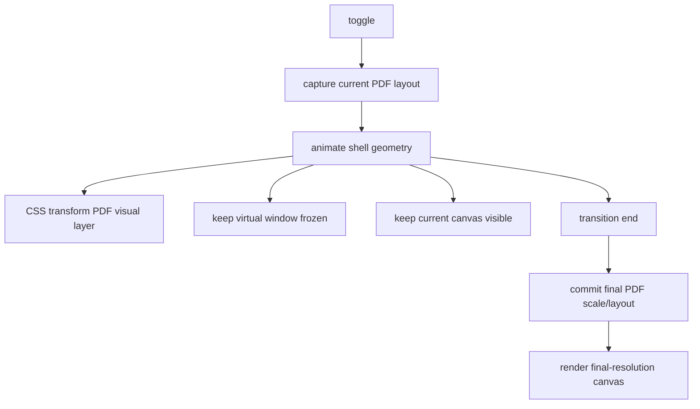
```mermaid
flowchart TD
  Toggle["toggle"] --> Capture["capture current PDF layout"]
  Capture --> Motion["animate shell geometry"]
  Motion --> VisualScale["CSS transform PDF visual layer"]
  Motion --> FrozenWindow["keep virtual window frozen"]
  Motion --> FrozenCanvas["keep current canvas visible"]
  Motion --> End["transition end"]
  End --> CommitLayout["commit final PDF scale/layout"]
  CommitLayout --> RenderFinal["render final-resolution canvas"]
```

Pros:

- very smooth;
- minimal React work during motion;
- avoids virtualization churn;
- canvas does not blink;
- closer to native preview behavior.

Cons:

- during motion, PDF text/canvas may be briefly scaled rather than re-laid out;
- after transition, there is one final layout correction;
- overlays must scale with the visual layer.

For this component, Design B is the better default. It prioritizes physical
smoothness under load. The user perceives a temporarily scaled page as smooth.
The user perceives unmounts, scroll jumps, and back-and-forth width correction
as broken.

## Clean-Slate Target Architecture

Use a deterministic motion kernel with Design B renderer behavior for heavy
paged renderers.

The target is not a "geometry store behind the current component." The target is
a viewer primitive whose normal way of moving is the geometry store.

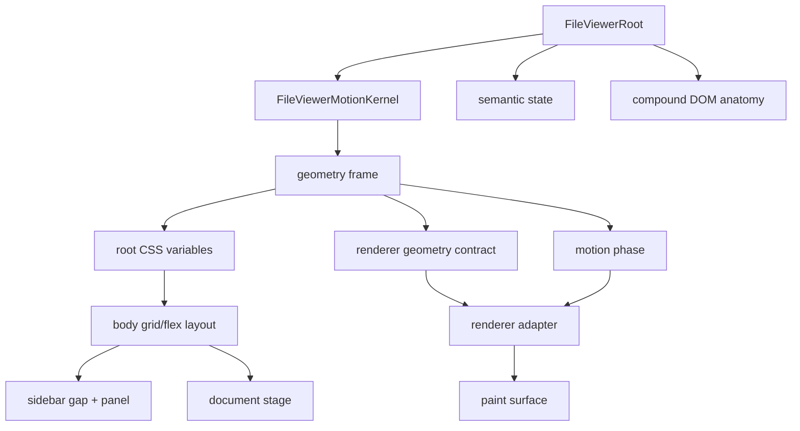
```mermaid
flowchart TD
  Root["FileViewerRoot"] --> Kernel["FileViewerMotionKernel"]
  Root --> Semantic["semantic state"]
  Root --> Anatomy["compound DOM anatomy"]

  Kernel --> GeometryFrame["geometry frame"]
  GeometryFrame --> RootVars["root CSS variables"]
  GeometryFrame --> RendererContract["renderer geometry contract"]
  GeometryFrame --> MotionPhase["motion phase"]

  RootVars --> Body["body grid/flex layout"]
  Body --> Sidebar["sidebar gap + panel"]
  Body --> Stage["document stage"]

  RendererContract --> Adapter["renderer adapter"]
  MotionPhase --> Adapter
  Adapter --> Paint["paint surface"]
```

The shell has one physical stage:

```txt
FileViewerBody
  FileViewerSidebarTrack
    FileViewerSidebarPanel
  FileViewerDocumentTrack
    FileViewerViewport
      RendererStage
```

The sidebar and document tracks are siblings. They are sized by the same
geometry frame. The renderer is a child of the document track and cannot change
the track width.

For PDF, do not recompute full logical layout on every transition frame.
Instead:

```txt
During shell motion:
  shell geometry changes every frame
  PDF visual layer follows via direct transform from the geometry frame
  PDF logical layout stays frozen
  scroll anchor stays frozen as a semantic anchor
  virtualization keeps a union window
  canvas stays visible

At settle:
  PDF commits final layout once
  scroll is corrected once from anchor
  virtualization releases extra pages
  canvas rerenders at final raster size
```

This is not a compromise with legacy. It is the ideal for expensive document
renderers because it protects physical continuity from renderer cost.

Lightweight renderers may choose live layout during motion if they can prove it
does not cause frame drops:

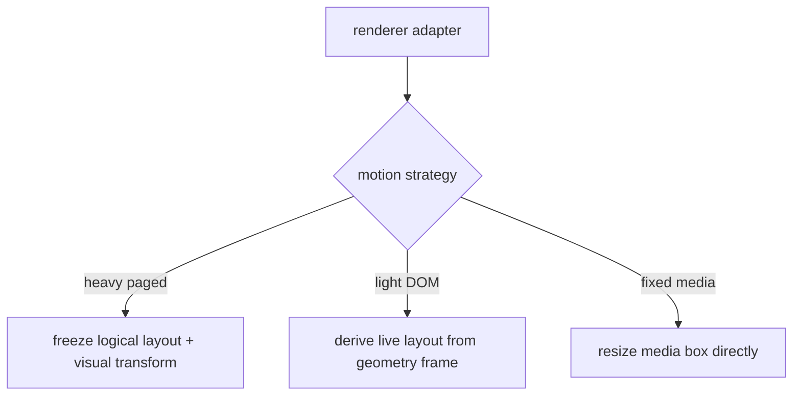
```mermaid
flowchart TD
  Renderer["renderer adapter"] --> Kind{"motion strategy"}
  Kind -->|"heavy paged"| Frozen["freeze logical layout + visual transform"]
  Kind -->|"light DOM"| Live["derive live layout from geometry frame"]
  Kind -->|"fixed media"| Media["resize media box directly"]
```

The shell does not care which strategy is chosen. The renderer contract makes
the strategy explicit.

This architecture gives:

- immediate click response;
- smooth physical resize;
- no "grow all at once";
- no "overshoot then retract";
- no virtualized blanking;
- no repeated expensive PDF layout work per frame.

## Platonic Layering

The clean architecture has five layers.

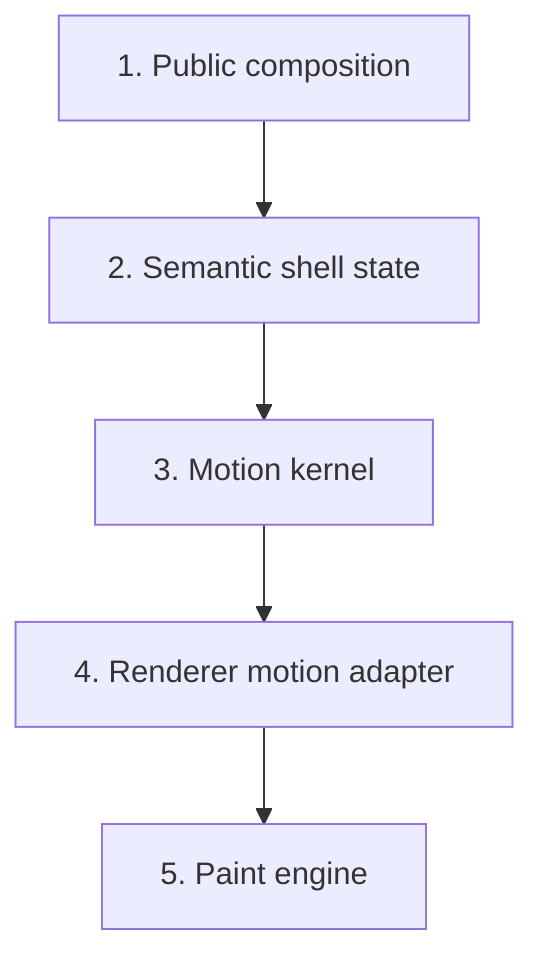
```mermaid
flowchart TD
  A["1. Public composition"] --> B["2. Semantic shell state"]
  B --> C["3. Motion kernel"]
  C --> D["4. Renderer motion adapter"]
  D --> E["5. Paint engine"]
```

| Layer | Owns | Must not own |
| --- | --- | --- |
| Public composition | slots, children, accessibility anatomy | transition math |
| Semantic shell state | open, side, mode, registered sidebar | frame-by-frame animation |
| Motion kernel | geometry transaction, progress, CSS vars, renderer geometry | file parsing, PDF layout |
| Renderer motion adapter | logical/visual/raster policy for a format | shell width, sidebar state |
| Paint engine | canvas/DOM/SVG rendering | shell geometry, scroll policy |

The dependency direction is one-way:

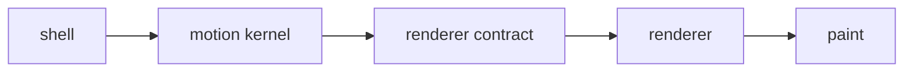
```mermaid
flowchart LR
  Shell["shell"] --> Kernel["motion kernel"]
  Kernel --> Contract["renderer contract"]
  Contract --> Renderer["renderer"]
  Renderer --> Paint["paint"]
```

Paint never informs shell motion.

## Ideal DOM Contract

The ideal DOM is deliberately boring.

```tsx
<div data-slot="file-viewer-root">
  <div data-slot="file-viewer-header" />
  <div data-slot="file-viewer-body">
    <div data-slot="file-viewer-sidebar-track">
      <aside data-slot="file-viewer-sidebar-panel" />
    </div>
    <div data-slot="file-viewer-document-track">
      <div data-slot="file-viewer-viewport">
        <div data-slot="file-viewer-renderer-stage" />
      </div>
    </div>
  </div>
</div>
```

The root owns variables:

```css
--file-viewer-body-inline-size
--file-viewer-sidebar-inline-size
--file-viewer-document-inline-size
--file-viewer-transition-progress
```

The body consumes them:

```css
[data-slot="file-viewer-body"] {
  display: grid;
  grid-template-columns:
    var(--file-viewer-sidebar-inline-size)
    var(--file-viewer-document-inline-size);
}
```

For a right sidebar, the column order changes. The math does not.

No component below the renderer stage writes those variables.

## Ideal Motion Kernel

The motion kernel is an imperative, tiny, external runtime owned by the root.
It is not a React component. It uses React only for lifecycle and subscription.

It owns:

- current rest state;
- active transaction;
- current frame;
- rAF loop;
- CSS variable writes;
- subscribers for renderer contracts;
- event timestamps for diagnostics.

It does not own:

- PDF documents;
- canvas caches;
- virtual page windows;
- toolbar controls;
- app state.

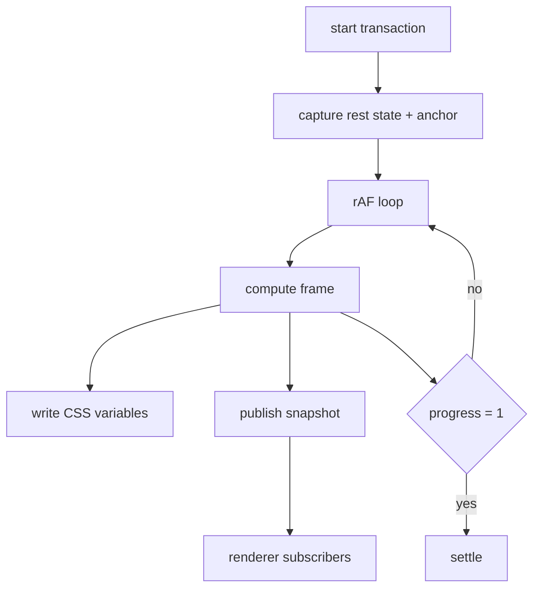
```mermaid
flowchart TD
  Start["start transaction"] --> Capture["capture rest state + anchor"]
  Capture --> Raf["rAF loop"]
  Raf --> Compute["compute frame"]
  Compute --> Css["write CSS variables"]
  Compute --> Publish["publish snapshot"]
  Publish --> Renderers["renderer subscribers"]
  Compute --> Done{"progress = 1"}
  Done -->|"no"| Raf
  Done -->|"yes"| Settle["settle"]
```

The kernel writes the first frame synchronously:

```txt
click
startTransaction()
writeFrame(progress = 0)
requestAnimationFrame(next)
```

No expensive renderer work is allowed before the first frame write.

## Ideal Renderer Contract

Every renderer receives the same motion contract.

```ts
type FileViewerRendererMotion = {
  phase: "idle" | "sliding" | "settling"
  progress: number
  layoutInlineSize: number
  settledInlineSize: number
  rasterInlineSize: number
  motionId: number | null
}
```

Every renderer chooses a strategy:

```ts
type FileViewerRendererMotionStrategy =
  | "live-layout"
  | "frozen-layout-visual-scale"
  | "fixed-media-scale"
```

PDF uses:

```txt
frozen-layout-visual-scale
```

Text/Markdown can use:

```txt
live-layout
```

Images can use:

```txt
fixed-media-scale
```

The strategy is an adapter decision. The shell still supplies one motion frame.

## Ideal PDF Motion Adapter

The PDF adapter should have a named state machine:

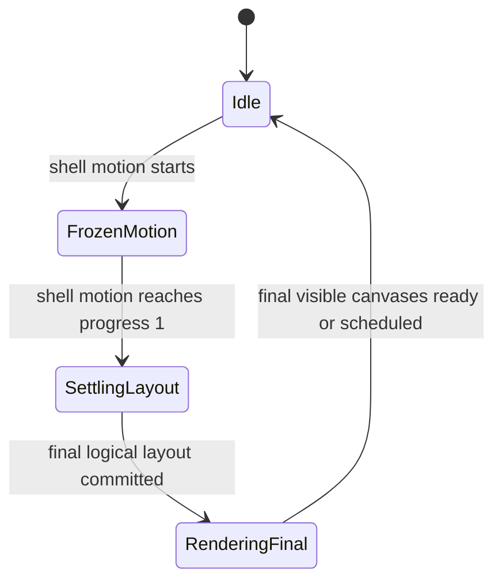
```mermaid
stateDiagram-v2
  [*] --> Idle
  Idle --> FrozenMotion: shell motion starts
  FrozenMotion --> SettlingLayout: shell motion reaches progress 1
  SettlingLayout --> RenderingFinal: final logical layout committed
  RenderingFinal --> Idle: final visible canvases ready or scheduled
```

In `FrozenMotion`:

```txt
logicalScale = scale at motion start
visualScale = motion.layoutInlineSize / frozen.layoutInlineSize
virtualWindow = union(startWindow, anchorWindow, coarseCurrentWindow)
canvasPolicy = keep visible bitmap
```

In `SettlingLayout`:

```txt
logicalScale = final fit-width scale
scrollTop = anchorToScrollTop(anchor, finalLayout)
virtualWindow = final window plus one-frame grace union
```

In `RenderingFinal`:

```txt
request final raster canvases
swap only when ready
release temporary pages after final window is painted
```

No PDF state in this adapter can mutate shell geometry.

## Ideal Scheduler

The viewer needs one tiny scheduler policy:

```txt
input and first geometry frame: highest priority
CSS variable writes: rAF
renderer visual transform: rAF-derived snapshot
scroll settle: layout effect at settle only
canvas rerender: idle/low priority after settle
virtual window release: idle after settle
```

Diagram:

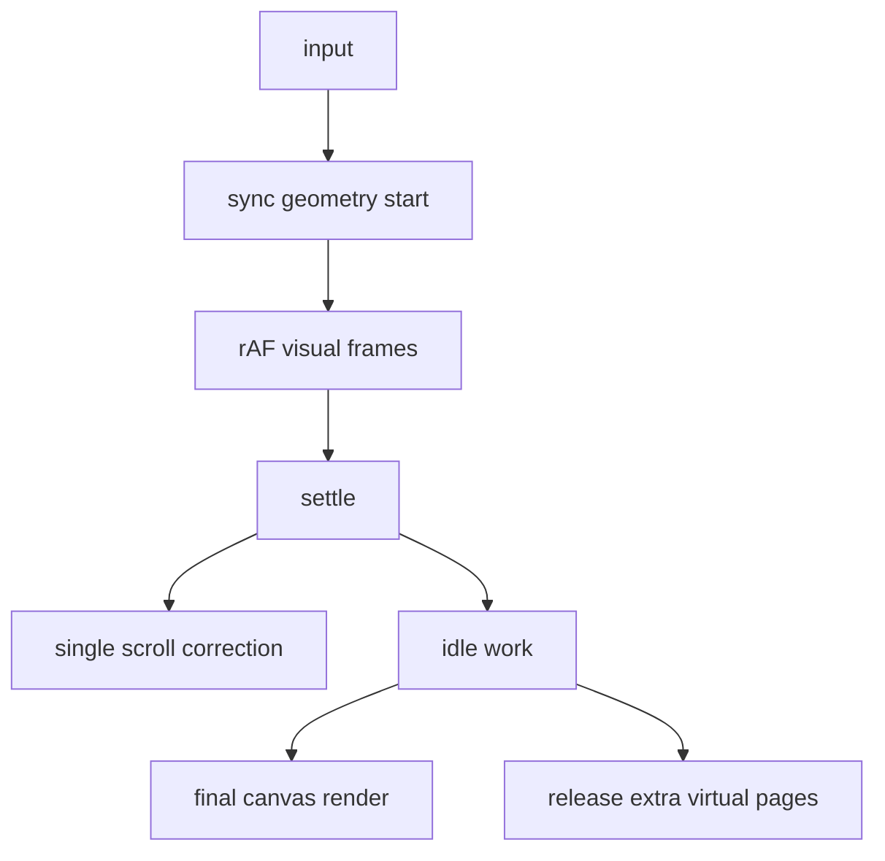
```mermaid
flowchart TD
  Input["input"] --> Immediate["sync geometry start"]
  Immediate --> Raf["rAF visual frames"]
  Raf --> Settle["settle"]
  Settle --> Scroll["single scroll correction"]
  Settle --> Idle["idle work"]
  Idle --> Canvas["final canvas render"]
  Idle --> Release["release extra virtual pages"]
```

The scheduler must make it structurally impossible for canvas work to delay the
start of motion.

## Recommended Motion State Machine

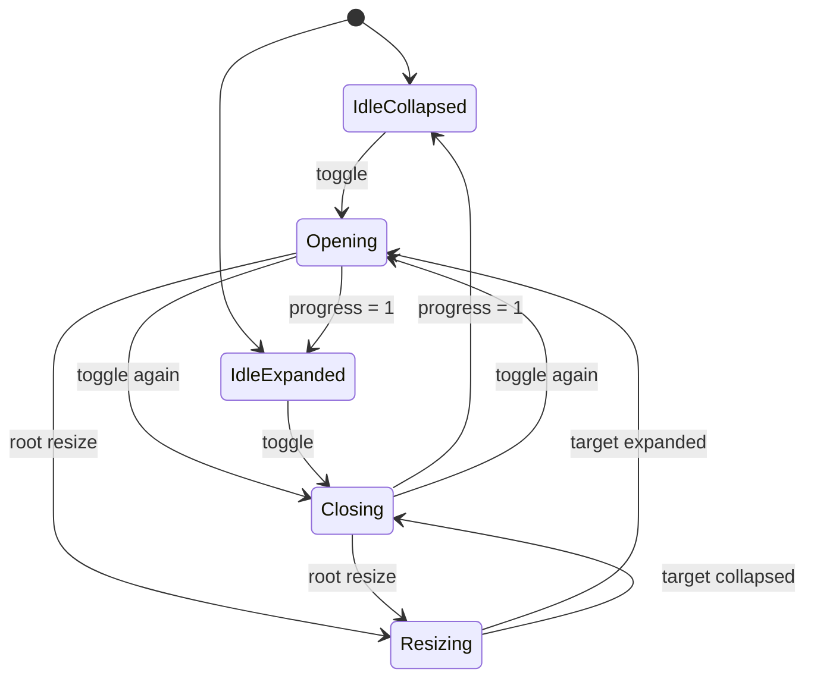
```mermaid
stateDiagram-v2
  [*] --> IdleCollapsed
  [*] --> IdleExpanded

  IdleCollapsed --> Opening: toggle
  Opening --> IdleExpanded: progress = 1
  Opening --> Closing: toggle again

  IdleExpanded --> Closing: toggle
  Closing --> IdleCollapsed: progress = 1
  Closing --> Opening: toggle again

  Opening --> Resizing: root resize
  Closing --> Resizing: root resize
  Resizing --> Opening: target expanded
  Resizing --> Closing: target collapsed
```

Rules:

- A toggle starts synchronously.
- A reverse toggle does not restart from stale rest states; it starts from the
  current interpolated frame.
- A root resize during motion retargets from the current interpolated frame.
- There is never more than one active geometry transaction.
- The active transaction owns the visible geometry.

## Reversal Model

Reversal is important because users often click quickly.

Bad model:

```txt
open -> close transition starts
user clicks open
system jumps back to last settled expanded width
new transition starts
```

Good model:

```txt
open -> close transition starts
user clicks open at progress 0.37
current interpolated frame becomes new "from"
expanded rest state becomes new "to"
motion continues from exactly what is visible
```

```mermaid
sequenceDiagram
  participant U as User
  participant G as Geometry store
  participant V as Visual frame

  U->>G: close
  G->>V: progress 0.00 to 0.37
  U->>G: open
  G->>G: capture current frame as from
  G->>V: progress 0.00 to 1.00 toward open
```

No backtracking. No stale anchor.

## Sidebar And Document Attachment

The sidebar should appear glued to the document edge.

For a left sidebar:

```txt
root.left
sidebar.left = root.left
sidebar.right = root.left + sidebarInlineSize
document.left = sidebar.right
document.width = root.width - sidebarInlineSize
```

For a right sidebar:

```txt
document.left = root.left
document.width = root.width - sidebarInlineSize
sidebar.left = document.right
sidebar.right = root.right
```

Diagram:

```mermaid
flowchart LR
  Root["root width"] --> Side["sidebarInlineSize"]
  Root --> Doc["documentInlineSize"]
  Side --> Edge["shared edge"]
  Doc --> Edge
  Edge --> Rule["sidebar edge == document edge every frame"]
```

Invariant:

```txt
abs(sidebarEdge - documentEdge) <= 0.5px
```

This should be testable.

## PDF Runtime During Motion

### Current problem

PDF currently reacts to changing layout:

```mermaid
flowchart TD
  FrameWidth["frame width changes"] --> DisplayScale["displayScale changes"]
  DisplayScale --> PageLayout["page layout changes"]
  PageLayout --> ScrollTop["scrollTop correction"]
  PageLayout --> VirtualWindow["virtual page window changes"]
  DisplayScale --> CanvasSize["canvas display size changes"]
```

During a large sidebar transition, this can do too much work.

### Ideal motion policy

```mermaid
flowchart TD
  MotionStart["motion start"] --> Freeze["freeze PDF logical layout"]
  Freeze --> CaptureVisual["capture visual scale ratio"]
  Freeze --> CaptureAnchor["capture reading anchor"]
  Freeze --> FreezeWindow["freeze or union virtual window"]
  Freeze --> KeepCanvas["keep current canvas visible"]

  Progress["geometry progress"] --> ShellWidth["shell width changes"]
  Progress --> VisualTransform["PDF visual transform follows shell"]

  MotionEnd["motion end"] --> CommitFinal["commit final logical layout"]
  CommitFinal --> CorrectScroll["single anchor scroll correction"]
  CommitFinal --> ReleaseWindow["release union window"]
  CommitFinal --> RenderFinal["render final canvases"]
```

### Visual scale formula

During motion, use the frozen layout width as the base:

```txt
visualScale = currentDocumentInlineSize / frozenDocumentInlineSize
```

Apply this to the document visual layer:

```txt
transform-origin: top left
transform: scale(visualScale)
```

But do not let this transform be a FLIP inversion based on DOM rects. It should
be a direct expression of the geometry frame.

### Logical scale

During motion:

```txt
logicalPdfScale = frozenPdfScale
```

At settle:

```txt
logicalPdfScale = finalDocumentInlineSize / intrinsicPageWidth
```

This prevents React/PDF layout churn during motion.

### Raster scale

During motion:

```txt
rasterScale = max(currentRasterScale, frozenRasterScale)
```

At settle:

```txt
rasterScale = finalLogicalScale * devicePixelRatio
```

Canvas quality can improve after motion. It should not block or define motion.

## Scroll Anchor Model

The viewer must preserve the user's reading position, but not with visible
per-frame scroll fights.

### Anchor definition

For paged documents, the anchor should be:

```ts
type PagedReadingAnchor = {
  pageNumber: number
  yPercent: number
  markerRatio: number
}
```

Where:

```txt
markerRatio = marker position inside viewport
```

For example, a marker ratio of `0.2` means "the point 20% down the viewport."

### Motion rule

During motion:

- capture the anchor once at start;
- do not repeatedly recapture from changing layout;
- keep the visual layer moving smoothly;
- suppress browser scroll anchoring;
- avoid repeated `scrollTop` writes unless the physical scroll container would
  expose blank space.

At settle:

- compute final scrollTop from the anchor and final layout;
- write scrollTop once;
- then resume normal scroll reporting.

```mermaid
sequenceDiagram
  participant U as User
  participant A as Anchor
  participant M as Motion
  participant S as Scroll

  U->>A: toggle captures page + yPercent
  A->>M: anchor fixed for transaction
  M->>S: no repeated recapture
  M->>S: no visible scroll fight
  M->>S: settle computes final scrollTop once
```

## Virtualization Policy

Virtualization must not be allowed to unmount the pages that make the transition
look continuous.

### Normal policy

At rest:

```txt
render visible pages + overscan
preload nearby pages
release far pages
```

### Motion policy

During shell motion:

```txt
render union(previousWindow, currentWindow, anchorPageWindow)
do not unmount pages that were visible at motion start
do not show skeletons over pages that already had a canvas
do not shift page slots based on partially settled measurements
```

At settle:

```txt
measure final layout
commit final window
release extras after one idle frame
```

Diagram:

```mermaid
flowchart TD
  Start["motion start"] --> Previous["previous render window"]
  Progress["motion progress"] --> Current["current estimated window"]
  Anchor["anchor page"] --> AnchorWindow["anchor protection window"]

  Previous --> Union["motion render window"]
  Current --> Union
  AnchorWindow --> Union

  Union --> Paint["mounted pages"]
  Settle["settle"] --> Final["final window"]
  Final --> Release["release extras"]
```

## Canvas Policy

Canvas should never make shell motion feel slow.

### Rule 1: Do not clear a visible canvas during shell motion

If a page already has a rendered bitmap, keep it visible. It is better to scale
an old bitmap for 150ms than to show an empty canvas or skeleton.

### Rule 2: Do not start high-cost rerenders because the sidebar is moving

During motion:

```txt
visible rendered pages remain visible
new pages can use cached previews
high-DPR final render waits until settle
```

### Rule 3: Render final fidelity after settle

After transition:

```txt
render final scale
swap canvas only after the replacement is ready
write cache
```

```mermaid
sequenceDiagram
  participant Motion as Motion
  participant Canvas as Canvas
  participant Pdf as pdf.js

  Motion->>Canvas: keep existing bitmap visible
  Motion->>Pdf: pause noncritical rerender
  Motion->>Canvas: apply visual scale
  Motion->>Pdf: settle final render request
  Pdf->>Canvas: replace when complete
```

## Timing

The target duration should stay short:

```txt
120ms to 180ms
```

The current `150ms` is reasonable.

The problem is not the duration. The problem is that several systems do not
share it.

Use linear easing for the geometry scalar:

```txt
progress = clamp((now - startedAt) / durationMs, 0, 1)
```

Do not use independent easing functions for sidebar, document, scroll, and
canvas.

If a visual easing is desired later, it must be applied once to the scalar:

```txt
visualProgress = ease(progress)
```

Then everything uses `visualProgress`.

## Immediate Start Requirement

The user specifically wants:

```txt
push the button -> it directly starts
```

This means the click handler must synchronously start the geometry transaction
before expensive React/PDF work.

Bad:

```txt
click
set React state
render tree
measure DOM
ResizeObserver fires
derive transition
start visual correction
```

Good:

```txt
click
geometryStore.startTransaction()
write first geometry frame
then React state follows
```

```mermaid
sequenceDiagram
  participant U as User
  participant Button as Trigger
  participant Store as Geometry store
  participant DOM as CSS variables
  participant React as React tree

  U->>Button: click
  Button->>Store: start transaction immediately
  Store->>DOM: publish first frame
  Button->>React: commit semantic open state
  Store->>DOM: rAF frames continue
```

The first visible frame should happen before PDF rerender scheduling.

## Shadcn Lesson Applied Correctly

The shadcn sidebar uses:

- semantic state;
- CSS variables;
- data attributes;
- a gap element;
- a panel element;
- one provider;
- no renderer-specific layout logic.

For FileViewer, the adaptation is:

```mermaid
flowchart TD
  Provider["FileViewerProvider"] --> Root["FileViewer"]
  Root --> Semantic["open / mode / side / width"]
  Root --> Geometry["geometry transaction store"]

  Semantic --> DataAttrs["data-state / data-mode / data-side"]
  Geometry --> CssVars["CSS variables"]

  Root --> Header["FileViewerHeader"]
  Root --> Body["FileViewerBody"]
  Body --> SidebarGap["FileViewerSidebar gap"]
  SidebarGap --> SidebarPanel["FileViewerSidebar panel"]
  Body --> Inset["FileViewerInset"]
  Inset --> Viewport["FileViewerViewport"]
  Viewport --> Renderer["renderer adapter"]
```

The shadcn lesson is not "CSS only." The lesson is:

```txt
one owner of semantic state
visible primitive anatomy
CSS variables for geometry
data attributes for state
no hidden correction loops at the public boundary
```

## Module Blueprint

### `file-viewer-geometry-store.ts`

Owns:

- rest geometry;
- active transaction;
- current geometry frame;
- subscriptions;
- start, reverse, retarget, settle;
- rAF loop.

Does not own:

- PDF scale;
- page layout;
- canvas rendering;
- file resource state.

API:

```ts
createFileViewerGeometryStore(): FileViewerGeometryStore
```

Store shape:

```ts
type FileViewerGeometryStore = {
  getSnapshot(): FileViewerGeometryFrame
  subscribe(listener: () => void): () => void
  setRestTarget(target: FileViewerGeometryTarget): void
  startSidebarTransition(targetOpen: boolean): void
  retargetForRootResize(size: FileViewerMeasuredSize): void
}
```

### `file-viewer-motion-context.tsx`

Owns React context for the geometry store.

Public hooks should be narrow:

```ts
useFileViewerGeometryFrame()
useFileViewerRendererGeometry()
```

Avoid broad hooks like:

```ts
useFileViewerEverything()
```

### `file-viewer-body.tsx`

Owns DOM anatomy:

- body;
- sidebar gap;
- sidebar panel;
- document inset;
- document frame.

Should consume geometry as CSS variables.

Should not infer transition from measured frame width.

### `file-viewer-sidebar.tsx`

Can remain part of `file-viewer-body.tsx` or split if readability improves.

Owns:

- registration;
- accessibility;
- panel DOM;
- gap DOM;
- side-specific classes.

Does not own:

- transition timing;
- rAF;
- document scale.

### `pdf-viewer-motion-policy.ts`

Owns PDF behavior during shell motion:

```ts
type PdfMotionPolicy = {
  logicalScale: number
  visualScale: number
  rasterScale: number
  shouldFreezeLayout: boolean
  shouldFreezeVirtualWindow: boolean
  shouldDeferHighQualityRender: boolean
}
```

This keeps motion policy explicit instead of spreading `isTransitioning` checks
across layout, runtime, page layer, and canvas.

### `pdf-viewer-document-layout.ts`

Should consume `ViewerRendererGeometry`:

```ts
usePdfDocumentLayout({
  geometry,
  document,
  controlledScale,
  defaultScale,
})
```

It should compute:

- frozen logical scale during motion;
- final logical scale at rest;
- visual scale for the layer;
- raster scale policy.

It should not call a generic measured-width hook for the main file-viewer path.

Measurement can remain as fallback only for bare standalone PDF usage outside
`FileViewer`.

### `pdf-viewer-document-runtime.ts`

Owns:

- scroll handle;
- visible page;
- virtual window;
- render scheduler.

During shell motion, it should receive a motion policy and freeze/union
accordingly.

### `pdf-viewer-pages-layer.tsx`

Owns DOM and paint.

During shell motion:

- apply direct visual transform from policy;
- keep rendered pages mounted;
- avoid FLIP inversion;
- avoid skeleton over already rendered canvas.

## Naming

Use precise names. Do not reuse old ambiguous names.

Recommended names:

| Concept | Name |
| --- | --- |
| visible current width | `layoutInlineSize` |
| final stable width | `settledInlineSize` |
| canvas target width | `rasterInlineSize` |
| sidebar reserved width | `sidebarInlineSize` |
| document slot width | `documentInlineSize` |
| transition 0..1 | `transitionProgress` |
| currently moving shell | `isShellTransitioning` |
| PDF logical scale | `logicalScale` |
| PDF CSS transform scale | `visualScale` |
| PDF canvas render scale | `rasterScale` |
| stable page anchor | `readingAnchor` |
| pages kept through motion | `motionPageWindow` |

Avoid:

| Avoid | Reason |
| --- | --- |
| `activeInlineSize` | active for what: layout, render, or state? |
| `preparedInlineSize` | prepared for what: display or raster? |
| `isTransitioning` alone | whose transition: shell, PDF, scroll, canvas? |
| `scale` alone | display, logical, visual, or raster? |

## Invariants

These invariants should be written as tests and used as design constraints.

### Geometry invariants

```txt
bodyInlineSize = sidebarInlineSize + documentInlineSize
```

For inline left sidebar:

```txt
sidebarLeft = bodyLeft
sidebarRight = documentLeft
documentRight = bodyRight
```

For inline right sidebar:

```txt
documentLeft = bodyLeft
documentRight = sidebarLeft
sidebarRight = bodyRight
```

During transition:

```txt
sidebarInlineSize is monotonic
documentInlineSize is monotonic in the opposite direction
transitionProgress is monotonic unless retargeted
```

### Motion invariants

```txt
only one active geometry transaction
toggle starts transaction synchronously
reverse toggle starts from current frame
root resize retargets from current frame
```

### Renderer invariants

```txt
renderer never measures sidebar width
renderer never owns shell transition duration
renderer receives layoutInlineSize
renderer can request rasterInlineSize
renderer does not mutate shell geometry
```

### PDF invariants

During shell motion:

```txt
logical layout is frozen
visual scale follows documentInlineSize
current visible pages remain mounted
rendered canvases remain visible
high-quality rerender waits until settle
```

At settle:

```txt
logical layout commits once
scroll anchor correction happens once
extra pages release after final window is known
```

## Tests

### Unit tests: geometry store

Cases:

- collapsed -> expanded is monotonic;
- expanded -> collapsed is monotonic;
- reverse mid-transition starts from current frame;
- root resize retargets without a jump;
- side left/right edge math is correct;
- overlay mode leaves document width unchanged;
- zero body width does not poison last valid geometry;
- duration zero produces immediate final state.

### Unit tests: renderer geometry

Cases:

- `layoutInlineSize`, `settledInlineSize`, and `rasterInlineSize` are distinct;
- shell transition sets `isShellTransitioning`;
- settled size updates only after transition settles;
- raster size can be larger than layout size without changing visual layout.

### Unit tests: PDF motion policy

Cases:

- shell motion freezes logical scale;
- visual scale derives from current/frozen document width;
- raster rerender is deferred while motion is active;
- final scale commits at settle;
- explicit user zoom disables fit-width shell scaling rules where needed.

### Integration tests: sidebar toggle

Measure in a browser:

- click-to-first-frame delay;
- sidebar/document shared edge delta;
- monotonic document width;
- no width overshoot;
- no document transform after settle;
- no visible page unmount during transition;
- no scrollTop oscillation on page 4.

### Visual/performance tests

Record a 300ms sampling around toggle:

```txt
t
transitionProgress
sidebarInlineSize
documentInlineSize
visualScale
scrollTop
mountedPageNumbers
canvasRenderStatuses
```

Acceptance:

```txt
first geometry update <= 16ms after click
shared edge delta <= 0.5px
documentInlineSize monotonic
scrollTop writes <= 1 during transition
no canvas blanking on visible pages
no page window shrink until settle
```

## Hard-Cut Implementation Plan

This plan assumes no legacy compatibility requirement. The goal is not to run
two architectures side by side. The goal is to replace the motion model and
delete the old correction paths.

### Phase 0: Freeze The Public Grammar

Keep only the public anatomy that remains correct:

```tsx
<FileViewerProvider>
  <FileViewer>
    <FileViewerHeader />
    <FileViewerBody>
      <FileViewerSidebar />
      <FileViewerInset>
        <FileViewerViewport>
          <FileViewerDocument />
        </FileViewerViewport>
      </FileViewerInset>
    </FileViewerBody>
  </FileViewer>
</FileViewerProvider>
```

Everything below that grammar can be replaced.

Do not preserve:

- measured-width transition inference;
- sidebar CSS width transition as a separate owner;
- sidebar-driven FLIP;
- renderer-specific transition timers;
- compatibility aliases for old geometry names;
- duplicate generic viewer stores if FileViewer becomes the real primitive.

### Phase 1: Build The Motion Kernel First

Create the motion kernel as the center of the new architecture.

It must support:

- synchronous transaction start;
- deterministic frame computation;
- reverse from current frame;
- retarget on root resize;
- CSS variable writes;
- renderer snapshot subscription;
- diagnostics.

This phase is successful only when the kernel can be tested without PDF.

### Phase 2: Replace Shell Layout With Kernel Variables

FileViewer shell layout should consume only kernel-owned variables for sidebar
and document geometry.

Delete independent geometry transitions from the shell path.

Acceptance:

```txt
sidebar edge and document edge are mathematically attached
motion begins immediately
open and close are monotonic
reverse toggle has no backtrack
```

### Phase 3: Replace Renderer Geometry Contract

Replace ambiguous measured width values with the precise renderer contract:

```txt
layoutInlineSize
settledInlineSize
rasterInlineSize
phase
progress
motionId
```

Renderers must receive geometry. They must not infer FileViewer transition
state from DOM width.

### Phase 4: Rebuild PDF Motion Adapter

Implement the PDF adapter as:

```txt
Idle
FrozenMotion
SettlingLayout
RenderingFinal
```

The adapter must:

- freeze logical scale during shell motion;
- apply direct visual scale from renderer geometry;
- keep the motion page window mounted;
- keep visible canvases alive;
- commit final layout once;
- perform one anchor scroll correction at settle;
- request final raster quality after settle.

### Phase 5: Delete Sidebar-Driven FLIP

Remove FLIP from the sidebar resize path.

If a generic FLIP utility remains for unrelated layout jumps, it must be
unreachable from normal FileViewer sidebar toggles and covered by an
architecture test.

### Phase 6: Delete The Measurement Transition Loop

Remove the path where FileViewer-owned motion is discovered through
ResizeObserver and converted into `isTransitioning`.

ResizeObserver remains only for external measurement:

- first mount;
- root resize;
- breakpoint mode changes.

### Phase 7: Make Virtualization Motion-Safe

Virtualization should have a named shell-motion mode:

```txt
motionWindow = union(startWindow, currentEstimate, anchorWindow)
```

Release extras only after:

```txt
phase === "idle"
final layout committed
final visible window known
```

### Phase 8: Make Canvas Motion-Safe

Canvas rendering should have a named shell-motion mode:

```txt
keep visible bitmap
defer high-quality rerender
swap final bitmap only when ready
```

No visible page may blank because the sidebar is moving.

### Phase 9: Add Hard Architecture Tests

Tests must fail if old debt returns.

Add assertions that:

- FileViewer shell does not use CSS transition as the geometry owner;
- FileViewer-owned motion does not infer transition state from measured frame
  width;
- PDF does not run sidebar-driven FLIP;
- renderers consume `FileViewerRendererMotion`;
- PDF has explicit motion phases;
- visible pages are not unmounted during shell motion;
- canvas clear is forbidden for visible rendered pages during shell motion.

### Phase 10: Update Docs And Registry As The New Truth

The docs should describe the new model directly, not as a workaround.

The registry should ship only the new architecture. No old motion files should
remain as public implementation dependencies.

## Hard-Cut Diagram

```mermaid
flowchart TD
  Public["freeze public anatomy"] --> Kernel["build motion kernel"]
  Kernel --> Shell["replace shell geometry"]
  Shell --> Contract["replace renderer contract"]
  Contract --> Pdf["rebuild PDF motion adapter"]
  Pdf --> DeleteFlip["delete sidebar FLIP"]
  DeleteFlip --> DeleteMeasure["delete measurement transition loop"]
  DeleteMeasure --> Virtual["motion-safe virtualization"]
  Virtual --> Canvas["motion-safe canvas"]
  Canvas --> Tests["hard architecture tests"]
  Tests --> Registry["docs and registry"]
```

## Failure Modes To Avoid

### Half geometry-store, half CSS transition

Do not let CSS transition width while the geometry store also interpolates
width. That recreates two clocks.

### Updating PDF logical layout every frame through React state

If every geometry frame causes a full React PDF rerender, the system will be
correct but slow.

Prefer frozen logical layout during shell motion.

### Keeping FLIP as a safety net

FLIP should not remain active for sidebar transitions "just in case." That would
leave two visual motion models in the system.

### Letting renderer measure the frame during shell motion

If the renderer uses ResizeObserver to rediscover the width that the shell
already knows, delay returns.

### Treating canvas resolution as document size

Canvas raster size is quality. It is not layout.

## Debt That Is Not Allowed

The following are not acceptable in the Apple Preview-grade architecture.

### Legacy adapters

Do not keep an old geometry contract and adapt it into the new one.

Bad:

```txt
old activeInlineSize -> new layoutInlineSize
old preparedInlineSize -> new rasterInlineSize
old isTransitioning -> new phase
```

That preserves ambiguous concepts under new names.

Good:

```txt
motion kernel emits layoutInlineSize, settledInlineSize, rasterInlineSize,
phase, progress directly
```

### Dual source of truth

Do not let both CSS and JavaScript interpolate geometry.

Allowed:

```txt
JS computes geometry frame
CSS applies variables
```

Not allowed:

```txt
JS computes geometry frame
CSS also transitions width
renderer also FLIPs from measured rects
```

### Renderer measurement of owned geometry

Renderers may measure their own content. They may not measure the shell to
rediscover the layout width during a FileViewer-owned transition.

### Best-effort smoothness

"Usually smooth" is not the bar.

The architecture must make the bad state difficult to express:

```txt
overshoot should have no variable path
retraction should have no variable path
blank visible canvas should have no policy path
scroll oscillation should have no transaction path
```

### Compatibility flags

Do not add flags such as:

```txt
legacyMotion
useOldGeometry
disableMotionKernel
experimentalSmoothSidebar
```

A platonic component has one correct behavior.

### Hidden fallback loops

Do not leave fallback loops that silently revive the old behavior when a value
is missing. Missing geometry should fail loudly in development and fall back to
a static, non-animated rest layout in production.

Fallback is allowed for unsupported environments. It is not allowed as a second
motion architecture.

## Acceptance Definition

The component reaches the motion target when this is true:

```txt
On a large PDF, on page 4, toggling the sidebar open and closed:

- begins immediately on click;
- sidebar and document shared edge stay attached;
- document width changes monotonically;
- no overshoot;
- no retraction;
- no visible canvas blank;
- no skeleton flashes over already rendered pages;
- no repeated scrollTop oscillation;
- final canvas sharpens after motion without layout shift.
```

Measured thresholds:

```txt
first visual movement <= 16ms after pointer/click
shared edge error <= 0.5px
width monotonic except explicit retarget
scrollTop writes during motion <= 1
visible mounted pages never drop to 0
no final correction larger than 1px horizontally
```

## Final Architecture

```mermaid
flowchart TD
  Trigger["FileViewerSidebarTrigger"] --> GeometryStore["FileViewerGeometryStore"]
  GeometryStore --> Frame["geometry frame"]
  Frame --> CssVars["CSS variables"]
  Frame --> RendererGeometry["renderer geometry"]

  CssVars --> Body["FileViewerBody"]
  Body --> SidebarGap["sidebar gap"]
  Body --> SidebarPanel["sidebar panel"]
  Body --> DocumentFrame["document frame"]

  RendererGeometry --> PdfPolicy["PDF motion policy"]
  PdfPolicy --> PdfLayout["PDF logical layout"]
  PdfPolicy --> PdfVisual["PDF visual transform"]
  PdfPolicy --> PdfVirtual["PDF virtual window"]
  PdfPolicy --> PdfCanvas["PDF canvas policy"]

  PdfLayout --> Anchor["reading anchor"]
  Anchor --> Scroll["settle scroll correction"]
  PdfVisual --> Paint["visible page"]
  PdfCanvas --> Paint
```

The key simplification:

```txt
Motion is a property of the viewer geometry transaction.
It is not rediscovered separately by the sidebar, PDF layout, scroll layer,
virtualizer, and canvas.
```

## One-Sentence Design Rule

If a value changes during sidebar toggle and the user can see its effect, it
must be derived from the same geometry transaction frame.

Everything else waits until settle.
