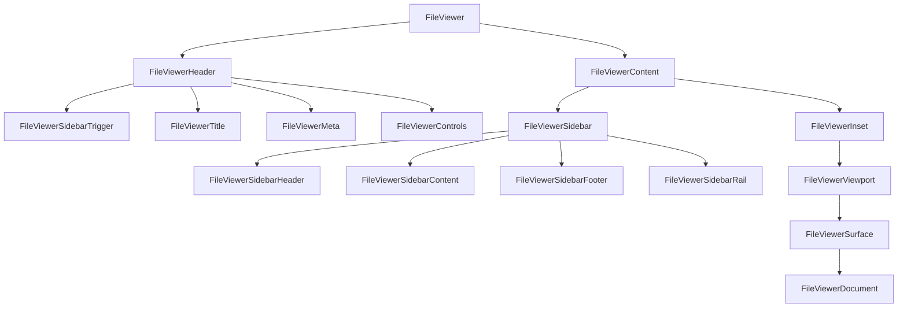
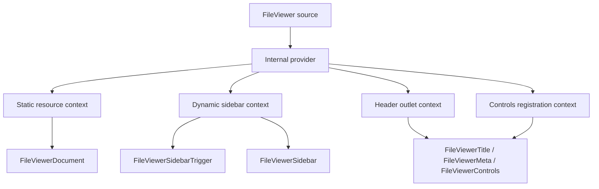
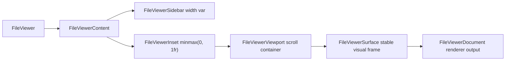
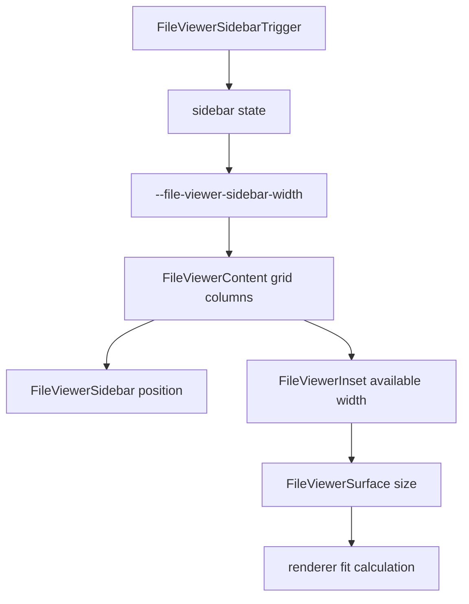
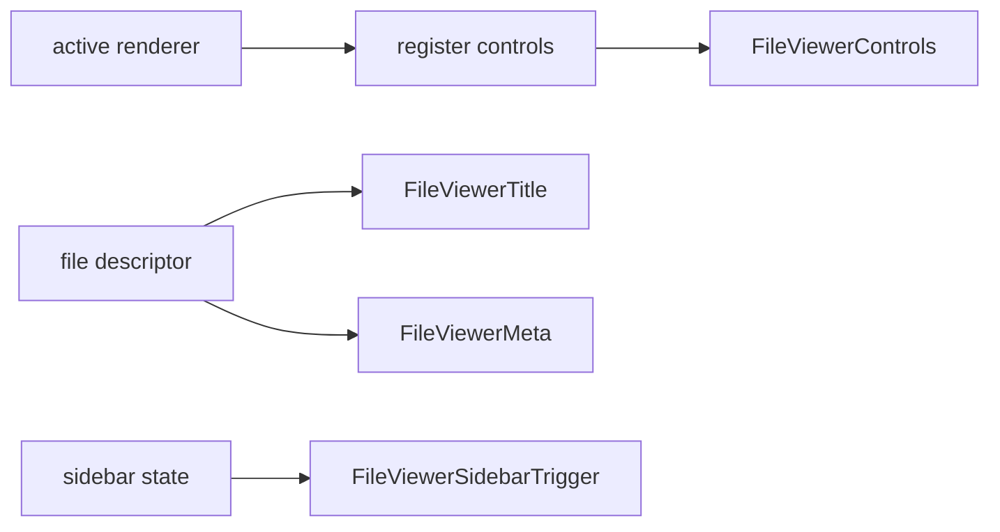
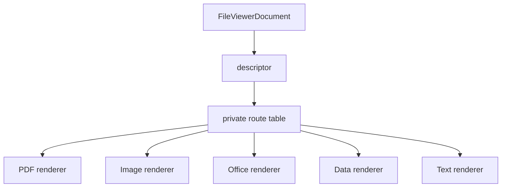

# File Viewer Platonic Blueprint

## Verdict

No, the public model is not allowed to become:

```tsx
<FileViewer.Root>
  <FileViewer.Header />
  <FileViewer.Sidebar />
  <FileViewer.Document />
</FileViewer.Root>
```

That is not the reference model.

The absolute reference is shadcn Sidebar. The important lesson is not only
visual taste. It is the API grammar:

```tsx
<SidebarProvider>
  <Sidebar>
    <SidebarHeader />
    <SidebarContent />
    <SidebarFooter />
    <SidebarRail />
  </Sidebar>
  <SidebarInset />
  <SidebarTrigger />
</SidebarProvider>
```

The names are flat exported components. The root name prefixes the anatomy. The
composition is explicit. Context exists, but the author sees ordinary JSX
primitives, not dotted namespace members.

FileViewer should follow that grammar exactly.

## Naming Law

### Forbidden

These names are forbidden:

```txt
FileViewer.Root
FileViewer.Provider
FileViewer.Header
FileViewer.Content
FileViewer.Sidebar
FileViewer.Document
FileViewer.Toolbar
FileViewer.Identity
```

They make the API look like a namespaced object. shadcn Sidebar does not do
that. It exports `SidebarHeader`, not `Sidebar.Header`.

These old names are also forbidden:

```txt
FileViewerBody
FileViewerIdentity
FileViewerControls
FileViewerHeaderStart
FileViewerHeaderEnd
```

They are either imprecise or too layout-specific.

### Required public names

The public authoring surface should be:

```txt
FileViewer
FileViewerHeader
FileViewerTitle
FileViewerMeta
FileViewerControls
FileViewerContent
FileViewerSidebar
FileViewerSidebarHeader
FileViewerSidebarContent
FileViewerSidebarFooter
FileViewerSidebarRail
FileViewerSidebarTrigger
FileViewerInset
FileViewerViewport
FileViewerSurface
FileViewerDocument
useFileViewerResource
```

This mirrors the shadcn Sidebar style:

| shadcn Sidebar   | FileViewer                                                                                       |
| ---------------- | ------------------------------------------------------------------------------------------------ |
| `Sidebar`        | `FileViewer`                                                                                     |
| `SidebarHeader`  | `FileViewerHeader`                                                                               |
| `SidebarContent` | `FileViewerSidebarContent` for sidebar internals, `FileViewerContent` for the viewer content row |
| `SidebarFooter`  | `FileViewerSidebarFooter`                                                                        |
| `SidebarRail`    | `FileViewerSidebarRail`                                                                          |
| `SidebarInset`   | `FileViewerInset`                                                                                |
| `SidebarTrigger` | `FileViewerSidebarTrigger`                                                                       |

`FileViewerContent` is the layout row below the header. It is the place where
the optional sidebar and the main inset live.

`FileViewerSidebarContent` is inside `FileViewerSidebar`, exactly like
`SidebarContent` is inside `Sidebar`.

That distinction must remain explicit. It prevents the component from confusing
viewer layout with sidebar layout.

## Canonical Authoring Model

### Easy API

The smallest correct usage is:

```tsx
<FileViewer source={source} />
```

This is allowed because shadcn components often provide sensible defaults. The
easy API must expand to the same anatomy as the composed API. It must not be a
second implementation path.

### Composed API

The canonical composed usage is:

```tsx
<FileViewer source={source}>
  <FileViewerHeader>
    <FileViewerSidebarTrigger />
    <FileViewerTitle />
    <FileViewerMeta />
    <FileViewerControls />
  </FileViewerHeader>

  <FileViewerContent>
    <FileViewerSidebar>
      <FileViewerSidebarHeader />
      <FileViewerSidebarContent />
      <FileViewerSidebarFooter />
      <FileViewerSidebarRail />
    </FileViewerSidebar>

    <FileViewerInset>
      <FileViewerViewport>
        <FileViewerSurface>
          <FileViewerDocument />
        </FileViewerSurface>
      </FileViewerViewport>
    </FileViewerInset>
  </FileViewerContent>
</FileViewer>
```

The shape is intentionally boring. It should feel like the only possible shape.

## Composition Diagram



## State Ownership

FileViewer owns file-scoped state only:

```txt
source
descriptor
resource
renderer selection
header outlets
registered controls
sidebar open state
document scroll state
```

It must not own product state:

```txt
upload queue
file-system tree selection
email MIME tree state
OCR workflow state
extraction schema state
approval workflow state
```

The file viewer is a universal file surface. Product shells may contain it, but
it must not contain product shells.

## Context Model

The shadcn Sidebar reference has a provider because sidebar state needs context.
FileViewer also needs context, but the public authoring root should still be
`FileViewer`.

The ideal implementation model is:



The public root hides the provider because a file viewer has a mandatory source
contract. Users should not be able to accidentally render a provider with no
viewer or a viewer with no resource contract.

This is the one deliberate difference from `SidebarProvider`: FileViewer is not
a global app shell primitive. It is a file-scoped compound component. The
provider exists to implement the root, not to be the root.

## Layout Model

The layout must be CSS-first and scalar-driven.



Rules:

- `FileViewerContent` owns the horizontal track.
- `FileViewerSidebar` owns sidebar width.
- `FileViewerInset` owns the available main column.
- `FileViewerViewport` owns scrolling.
- `FileViewerSurface` owns visual framing.
- `FileViewerDocument` owns renderer output only.

No renderer should measure the entire viewer shell to decide sidebar layout.
Renderers may measure their own surface.

## Sidebar Motion Model

Sidebar motion must come from one scalar.



The sidebar and document must never animate from different clocks. The trigger
sets state. State changes CSS variables. CSS variables drive both the sidebar
and the inset.

If a renderer needs to preserve scroll during resize, it should anchor to the
document viewport. It should not push layout corrections back into sidebar
motion.

## Header Contract

The header is not format-specific.



Rules:

- `FileViewerTitle` renders the file name.
- `FileViewerMeta` renders passive file facts.
- `FileViewerControls` renders registered operational controls.
- `FileViewerSidebarTrigger` toggles the nearest file viewer sidebar.
- No PDF-specific header component should be required.

## Renderer Contract

`FileViewerDocument` routes to renderers privately.



Public users should not import route internals.

Required invariant:

```txt
FileViewerDocument is public.
FileViewerRoute is private.
InternalFileViewerDocument is private.
renderer-specific providers are private unless a renderer has its own documented package surface.
```

## File Names And Module Boundaries

The source files should map to responsibilities:

```txt
file-viewer.tsx              public anatomy and exports
file-viewer-context.tsx      private contexts and hooks
file-viewer-header.tsx       header primitives
file-viewer-content.tsx      content, inset, surface, viewport, sidebar rail wiring
file-viewer-sidebar.tsx      sidebar primitives
file-viewer-document.tsx     public document shell
file-viewer-route.tsx        private renderer route table
file-viewer-core.ts          source and descriptor utilities
```

No file should export both public anatomy and renderer routing machinery.

## Export Policy

`file-viewer.tsx` should export the public grammar and only the public grammar:

```ts
export {
  FileViewer,
  FileViewerHeader,
  FileViewerTitle,
  FileViewerMeta,
  FileViewerControls,
  FileViewerContent,
  FileViewerSidebar,
  FileViewerSidebarHeader,
  FileViewerSidebarContent,
  FileViewerSidebarFooter,
  FileViewerSidebarRail,
  FileViewerSidebarTrigger,
  FileViewerInset,
  FileViewerViewport,
  FileViewerSurface,
  FileViewerDocument,
  useFileViewerResource,
};
```

It should not export:

```ts
FileViewerProvider;
FileViewerRoute;
FileViewerDocumentRenderer;
InternalFileViewerDocument;
useFileViewerContext;
useOptionalFileViewerResource;
```

No aliases. No compatibility shims. No duplicate vocabulary.

## Documentation Policy

Docs should teach the shadcn-like grammar first:

```tsx
import {
  FileViewer,
  FileViewerHeader,
  FileViewerTitle,
  FileViewerMeta,
  FileViewerControls,
  FileViewerContent,
  FileViewerSidebar,
  FileViewerSidebarContent,
  FileViewerSidebarTrigger,
  FileViewerInset,
  FileViewerViewport,
  FileViewerSurface,
  FileViewerDocument,
} from "@/components/ui/file-viewer";
```

Docs should not teach:

```tsx
FileViewer.Header;
FileViewer.Body;
FileViewer.Provider;
FileViewerIdentity;
FileViewerControls;
```

The first docs page should show:

```tsx
<FileViewer source={source} />
```

The anatomy page should show:

```tsx
<FileViewer source={source}>
  <FileViewerHeader>
    <FileViewerSidebarTrigger />
    <FileViewerTitle />
    <FileViewerMeta />
    <FileViewerControls />
  </FileViewerHeader>
  <FileViewerContent>
    <FileViewerSidebar>
      <FileViewerSidebarContent />
      <FileViewerSidebarRail />
    </FileViewerSidebar>
    <FileViewerInset>
      <FileViewerViewport>
        <FileViewerSurface>
          <FileViewerDocument />
        </FileViewerSurface>
      </FileViewerViewport>
    </FileViewerInset>
  </FileViewerContent>
</FileViewer>
```

## Test Invariants

Architecture tests should assert these positive exports:

```txt
FileViewer
FileViewerHeader
FileViewerTitle
FileViewerMeta
FileViewerControls
FileViewerContent
FileViewerSidebar
FileViewerSidebarHeader
FileViewerSidebarContent
FileViewerSidebarFooter
FileViewerSidebarRail
FileViewerSidebarTrigger
FileViewerInset
FileViewerViewport
FileViewerSurface
FileViewerDocument
useFileViewerResource
```

Architecture tests should reject:

```txt
FileViewer.Header
FileViewer.Body
FileViewer.Sidebar
FileViewer.Document
FileViewerBody
FileViewerIdentity
FileViewerControls
FileViewerProvider from public export
FileViewerRoute from public export
FileViewerDocumentRenderer from public export
```

## Implementation Order

1. Lock the public export list to the required flat shadcn-style names.
2. Replace old docs and examples with `FileViewerContent`, not `FileViewerBody`.
3. Keep provider and route internals out of public docs.
4. Keep sidebar anatomy parallel to shadcn Sidebar: header, content, footer,
   rail, trigger, inset.
5. Make every old name fail tests instead of silently working.
6. Rebuild registry payloads.
7. Run typecheck and targeted FileViewer architecture tests.

## Acceptance Definition

The component reaches the naming ideal when:

- no docs mention `FileViewer.Header`;
- no docs mention `FileViewerBody`, `FileViewerIdentity`, or
  `FileViewerControls`;
- users can scan the export list and understand the anatomy without reading
  internals;
- the API looks like a shadcn component copied into a codebase;
- every public name is flat, explicit, and composable;
- every private name stays private.
