# FileViewer Geometry Contract Blueprint

## North Star

A good component does not merely allow the correct design. It makes the wrong
design awkward.

The platonic `FileViewer` should have the same quality as shadcn's sidebar:

- a small public grammar;
- one state owner;
- named slots instead of clever props;
- CSS variables for dimensions;
- data attributes for state;
- paired layout primitives that make invalid composition visibly wrong;
- leaf-level escape hatches only where they do not corrupt the layout model.

The old file viewer grammar had the right parts, but it permitted an error:

```tsx
<FileViewerSurface>
  <FileViewerViewport>
    <PdfViewerPages />
  </FileViewerViewport>
</FileViewerSurface>
```

This is too easy to write and too hard to detect visually until resize starts.
The PDF renderer is then forced to infer its geometry from DOM width after
layout. That is the design flaw.

The ideal grammar makes that composition non-canonical:

```tsx
<FileViewer>
  <FileViewerSidebar />
  <FileViewerInset>
    <FileViewerHeader />
    <FileViewerViewport>
      <FileViewerDocument />
    </FileViewerViewport>
  </FileViewerInset>
</FileViewer>
```

The important object is not a `Surface`. The important object is the inset: the
content peer of the sidebar, with a stable geometry contract.

## 2026-06-28 Revision: The Shared Edge Is the Contract

The latest sidebar experiment exposed the core invariant more sharply:

```text
The sidebar edge and the document edge are the same edge.
```

If those edges are driven by different clocks, the component is architecturally
wrong, even if each individual transition is smooth.

The failed model split the interaction into phases:

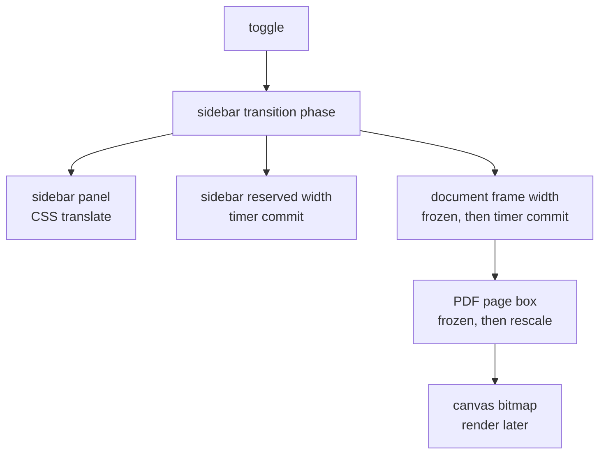
```mermaid
flowchart TD
  Toggle["toggle"]
  Phase["sidebar transition phase"]
  SidebarPanel["sidebar panel<br/>CSS translate"]
  SidebarGap["sidebar reserved width<br/>timer commit"]
  DocumentFrame["document frame width<br/>frozen, then timer commit"]
  PdfBox["PDF page box<br/>frozen, then rescale"]
  Bitmap["canvas bitmap<br/>render later"]

  Toggle --> Phase
  Phase --> SidebarPanel
  Phase --> SidebarGap
  Phase --> DocumentFrame
  DocumentFrame --> PdfBox
  PdfBox --> Bitmap
```

That model is not repairable by tuning durations. The sidebar panel moves while
the document frame intentionally stays still. The visual edge detaches by
design.

The platonic model has one scalar:

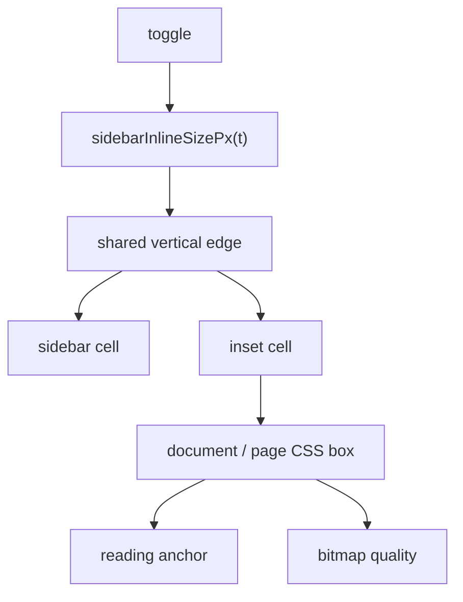
```mermaid
flowchart TD
  Toggle["toggle"]
  Motion["sidebarInlineSizePx(t)"]
  Edge["shared vertical edge"]
  Sidebar["sidebar cell"]
  Inset["inset cell"]
  PageBox["document / page CSS box"]
  Anchor["reading anchor"]
  Bitmap["bitmap quality"]

  Toggle --> Motion
  Motion --> Edge
  Edge --> Sidebar
  Edge --> Inset
  Inset --> PageBox
  PageBox --> Anchor
  PageBox --> Bitmap
```

Everything visible reads the same scalar. Nothing visible waits for PDF.js,
React timers, canvas cache, or virtualization.

### Wrong Split

This is the design smell to avoid:

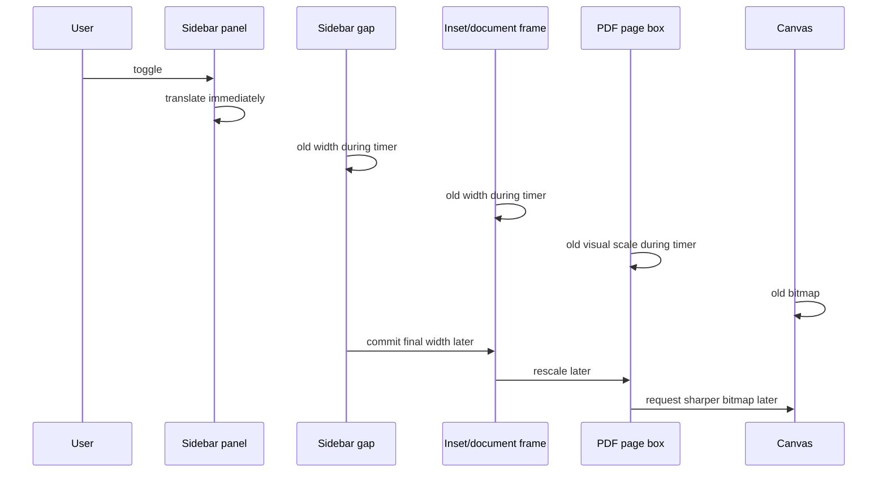
```mermaid
sequenceDiagram
  participant User
  participant Sidebar as Sidebar panel
  participant Gap as Sidebar gap
  participant Inset as Inset/document frame
  participant Pdf as PDF page box
  participant Canvas

  User->>Sidebar: toggle
  Sidebar->>Sidebar: translate immediately
  Gap->>Gap: old width during timer
  Inset->>Inset: old width during timer
  Pdf->>Pdf: old visual scale during timer
  Canvas->>Canvas: old bitmap
  Gap->>Inset: commit final width later
  Inset->>Pdf: rescale later
  Pdf->>Canvas: request sharper bitmap later
```

That produces a sidebar that is not stuck to the image edge.

### Correct Split

The correct split is not "sidebar first, document later". It is "geometry now,
quality later".

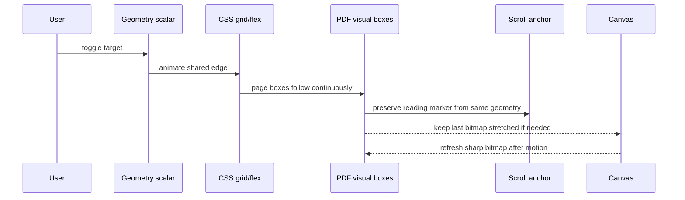
```mermaid
sequenceDiagram
  participant User
  participant Geometry as Geometry scalar
  participant Grid as CSS grid/flex
  participant Pdf as PDF visual boxes
  participant Anchor as Scroll anchor
  participant Canvas

  User->>Geometry: toggle target
  Geometry->>Grid: animate shared edge
  Grid->>Pdf: page boxes follow continuously
  Pdf->>Anchor: preserve reading marker from same geometry
  Pdf-->>Canvas: keep last bitmap stretched if needed
  Canvas-->>Pdf: refresh sharp bitmap after motion
```

The page may be slightly soft during motion. It must never be geometrically late.

### The Non-Negotiable Invariant

At every animation sample:

```text
sidebarInlineEndPx === documentInlineStartPx
```

For right-side sidebars, that means:

```text
documentRightPx === sidebarLeftPx
```

For left-side sidebars:

```text
sidebarRightPx === documentLeftPx
```

The test should measure the edge directly, not infer it from final state:

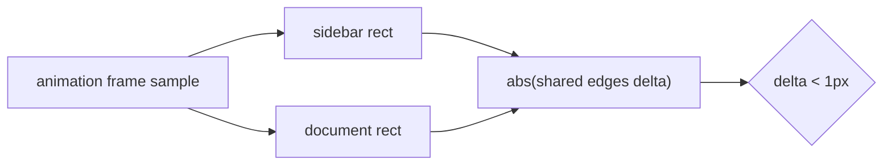
```mermaid
flowchart LR
  Sample["animation frame sample"]
  SidebarRect["sidebar rect"]
  DocumentRect["document rect"]
  Delta["abs(shared edges delta)"]
  Pass{"delta < 1px"}

  Sample --> SidebarRect
  Sample --> DocumentRect
  SidebarRect --> Delta
  DocumentRect --> Delta
  Delta --> Pass
```

If that assertion fails, the implementation is not the platonic model.

### Ideal Runtime Ownership

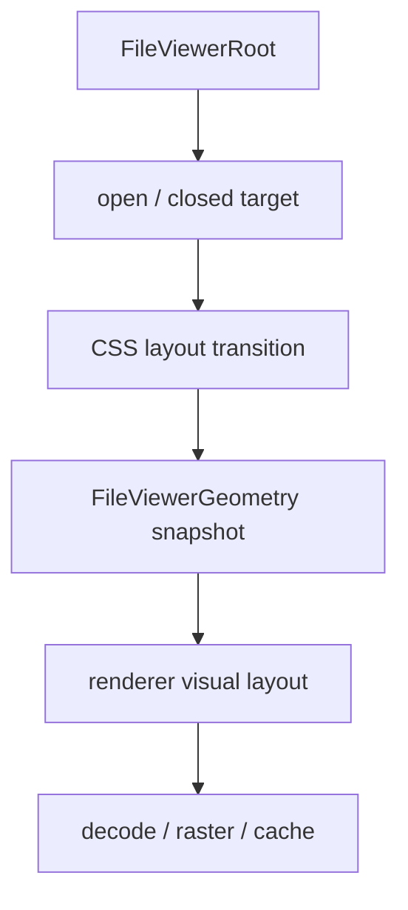
```mermaid
flowchart TB
  Root["FileViewerRoot"]
  State["open / closed target"]
  CSS["CSS layout transition"]
  Geometry["FileViewerGeometry snapshot"]
  Renderer["renderer visual layout"]
  Work["decode / raster / cache"]

  Root --> State
  State --> CSS
  CSS --> Geometry
  Geometry --> Renderer
  Renderer --> Work
```

The renderer may subscribe to geometry, but it must not own geometry. PDF.js may
own bitmap work, but it must not decide visible page size.

### Ideal Data Shape

The public geometry vocabulary should be small and unit-explicit:

```ts
type FileViewerGeometry = {
  rootInlineSizePx: number
  sidebarInlineSizePx: number
  insetInlineSizePx: number
  documentInlineSizePx: number
  documentMaxInlineSizePx: number | null
  sidebarSide: "left" | "right"
  sidebarMode: "inline" | "overlay"
  sidebarState: "expanded" | "collapsed"
  isGeometryTransitioning: boolean
}
```

No `progress` is needed in renderer code. Progress is an implementation detail of
the layout transition. Renderers need the current geometry, not the reason it has
that geometry.

### Ideal Layer Boundaries

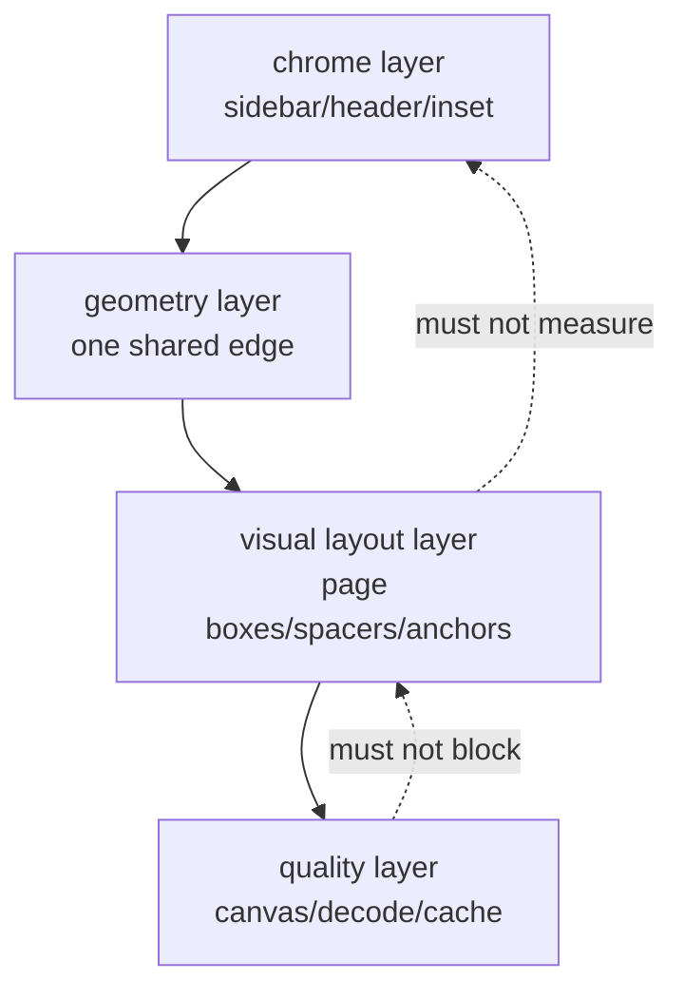
```mermaid
flowchart TD
  Chrome["chrome layer<br/>sidebar/header/inset"]
  Geometry["geometry layer<br/>one shared edge"]
  Visual["visual layout layer<br/>page boxes/spacers/anchors"]
  Quality["quality layer<br/>canvas/decode/cache"]

  Chrome --> Geometry
  Geometry --> Visual
  Visual --> Quality

  Quality -. must not block .-> Visual
  Visual -. must not measure .-> Chrome
```

This is the Flaubertian boundary:

- chrome owns the edge;
- geometry names the edge;
- visual layout follows the edge;
- render quality catches up after the edge moves.

### Implementation Consequences

The ideal implementation should prefer:

- a single inline layout primitive where sidebar and inset are siblings;
- CSS-driven shared edge movement;
- document/page boxes sized from the inset every frame;
- scroll anchor math derived from the same page-box geometry;
- low-priority bitmap refresh after the movement has started or settled.

It should avoid:

- freezing document width while the sidebar moves;
- separate sidebar panel and document timers;
- post-layout "correction" loops as the primary model;
- ResizeObserver as the only source of visible geometry;
- tying canvas render scale to visible page box updates.

The final system should be judged visually and mechanically by the same rule:

```text
The edge never splits.
```

## Shadcn Sidebar Lessons

Studied reference:

- `https://ui.shadcn.com/docs/components/sidebar`
- `https://github.com/shadcn-ui/ui/blob/main/apps/v4/registry/new-york-v4/ui/sidebar.tsx`

The relevant design lessons are structural.

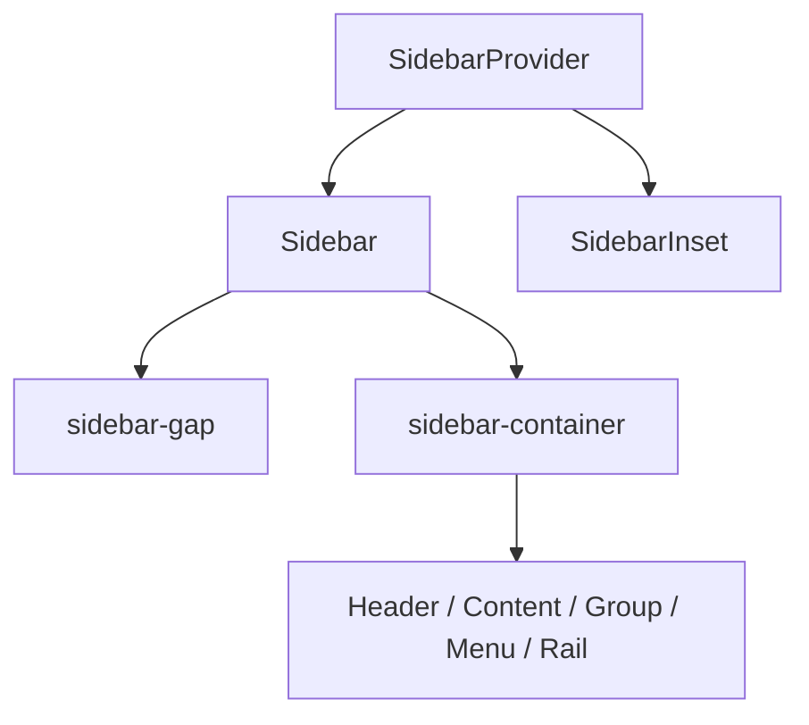
```mermaid
flowchart TD
  Provider["SidebarProvider"]
  Sidebar["Sidebar"]
  Gap["sidebar-gap"]
  Container["sidebar-container"]
  Inset["SidebarInset"]
  Slots["Header / Content / Group / Menu / Rail"]

  Provider --> Sidebar
  Provider --> Inset
  Sidebar --> Gap
  Sidebar --> Container
  Container --> Slots
```

### Lesson 1: One State Owner

Shadcn sidebar owns state in `SidebarProvider`:

```text
state: expanded | collapsed
open: boolean
openMobile: boolean
isMobile: boolean
toggleSidebar()
```

Everything else consumes that state. Leaf components do not invent their own
sidebar state.

For `FileViewer`, the equivalent state owner must own:

```text
sidebarState: expanded | collapsed
sidebarOpen: boolean
sidebarMode: inline | overlay
sidebarSide: left | right
resource identity
document geometry
```

### Lesson 2: State Is Exposed as Attributes

Shadcn sidebar styles through data attributes:

```text
data-state
data-collapsible
data-variant
data-side
data-slot
data-sidebar
```

That is superior to prop threading because CSS, tests, and composition all see
the same state.

`FileViewer` should use one consistent vocabulary:

```text
data-slot="file-viewer"
data-file-viewer-state="expanded | collapsed"
data-file-viewer-sidebar-mode="inline | overlay"
data-file-viewer-sidebar-side="left | right"
data-file-viewer-sidebar-state="expanded | collapsed"
data-file-viewer-renderer="pdf | image | docx | ..."
```

No second vocabulary like `viewer-*` should leak into public examples.

### Lesson 3: Dimensions Are CSS Variables

Shadcn sidebar exposes:

```text
--sidebar-width
--sidebar-width-icon
```

The layout reads those variables directly. The gap and container do not wait for
component-local measurements.

`FileViewer` needs the same discipline:

```text
--file-viewer-sidebar-width
--file-viewer-sidebar-collapsed-width
--file-viewer-inset-inline-size
--file-viewer-document-max-inline-size
--file-viewer-page-gap
```

The names are long on purpose. Geometry variables must be unambiguous.

### Lesson 4: The Inset Is a First-Class Primitive

The shadcn sidebar does not say:

```tsx
<main className="flex-1" />
```

It says:

```tsx
<SidebarInset />
```

That single primitive carries the layout contract for "the thing next to the
sidebar".

`FileViewer` should have the same shape. `FileViewerInset` is not decorative.
It is the required content peer of `FileViewerSidebar`.

## Previous Failure

Measured page:

```text
http://localhost:3100/
```

Previous composition in the sources viewer:

```tsx
<FileViewer sidebarMode="inline" sidebarSide="right">
  <FileViewerHeader />
  <FileViewerBody>
    <FileViewerSurface>
      <FileViewerViewport>
        <PdfViewerPages />
      </FileViewerViewport>
    </FileViewerSurface>
    <FileViewerSidebar width="420px" />
  </FileViewerBody>
</FileViewer>
```

Measured collapse sequence at a `1600px` viewport:

```text
open:
  sidebar width: 420px
  pdf pane:      858px
  pdf page:      826px

after sidebar closes:
  sidebar width:   0px
  pdf pane:     1278px
  pdf page:      826px

later:
  sidebar width:   0px
  pdf pane:     1278px
  pdf page:     1246px
```

The pane grows first. The PDF page grows later.

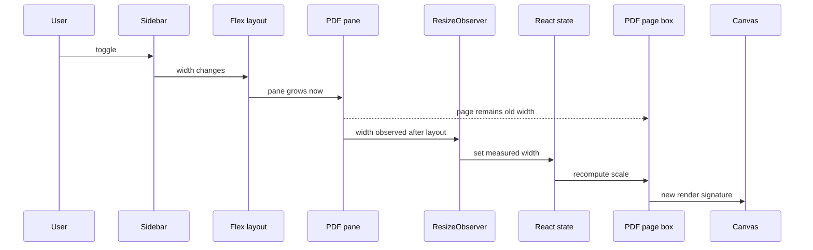
```mermaid
sequenceDiagram
  participant User
  participant Sidebar as Sidebar
  participant Flex as Flex layout
  participant Pane as PDF pane
  participant Observer as ResizeObserver
  participant React as React state
  participant Page as PDF page box
  participant Canvas

  User->>Sidebar: toggle
  Sidebar->>Flex: width changes
  Flex->>Pane: pane grows now
  Pane-->>Page: page remains old width
  Pane->>Observer: width observed after layout
  Observer->>React: set measured width
  React->>Page: recompute scale
  Page->>Canvas: new render signature
```

This is not a rendering bug. It is a grammar bug. The renderer was allowed to
stand outside the geometry contract.

## Platonic Public Grammar

The public grammar should be as small as shadcn sidebar:

```tsx
<FileViewerProvider source={source}>
  <FileViewer>
    <FileViewerSidebar />
    <FileViewerInset>
      <FileViewerHeader />
      <FileViewerViewport>
        <FileViewerDocument />
      </FileViewerViewport>
    </FileViewerInset>
  </FileViewer>
</FileViewerProvider>
```

The common path remains smaller:

```tsx
<FileViewer source={source} />
```

That renders the complete canonical grammar internally.

### Public Parts

```text
FileViewerProvider
FileViewer
FileViewerSidebar
FileViewerSidebarTrigger
FileViewerInset
FileViewerHeader
FileViewerIdentity
FileViewerToolbar
FileViewerViewport
FileViewerDocument
```

That is enough.

### Non-Public Plumbing

These may exist internally, but should not be the visible teaching grammar:

```text
ViewerRoot
ViewerBody
ViewerSurface
FileViewerSurface
FileViewerDocumentFrame
PdfViewerPages
PdfViewerProvider
pdf fit-width measure nodes
```

They are implementation seams, not the public language.

## Error-Proofing Rules

### Rule 1: Geometry-Aware Renderers Require an Inset

PDF, image, TIFF, DOCX page preview, PPTX, and any canvas/paginated renderer
must be inside `FileViewerInset`.

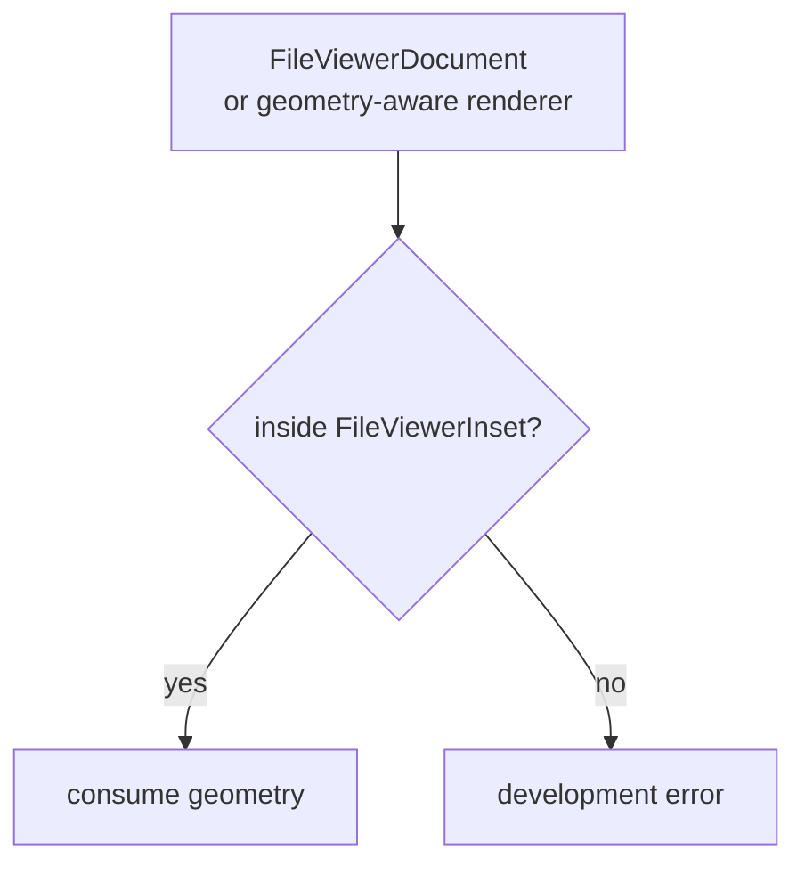
```mermaid
flowchart TD
  Renderer["FileViewerDocument<br/>or geometry-aware renderer"]
  HasInset{"inside FileViewerInset?"}
  OK["consume geometry"]
  DevError["development error"]

  Renderer --> HasInset
  HasInset -->|yes| OK
  HasInset -->|no| DevError
```

Runtime error text should be direct:

```text
PdfViewerPages must be rendered inside FileViewerInset. Use
<FileViewer><FileViewerInset><FileViewerViewport><FileViewerDocument /></FileViewerViewport></FileViewerInset></FileViewer>.
```

Do not silently fall back to measured width for this path in development.

### Rule 2: The Public Renderer Is `FileViewerDocument`

Most users should not manually choose `PdfViewerPages`.

```tsx
<FileViewerViewport>
  <FileViewerDocument />
</FileViewerViewport>
```

`FileViewerDocument` selects the correct renderer from the file resource and
passes it the geometry contract.

Low-level renderer exports can remain, but examples should treat them as
advanced primitives.

### Rule 3: `FileViewerInset` Owns the Document Frame

There should not be a separate public step:

```tsx
<FileViewerSurface>
  <FileViewerDocumentFrame>
    <FileViewerViewport />
  </FileViewerDocumentFrame>
</FileViewerSurface>
```

That is too many nouns for one responsibility.

The inset owns:

- the content area next to the sidebar;
- the document frame;
- alignment;
- max inline size;
- geometry CSS variables;
- renderer geometry context.

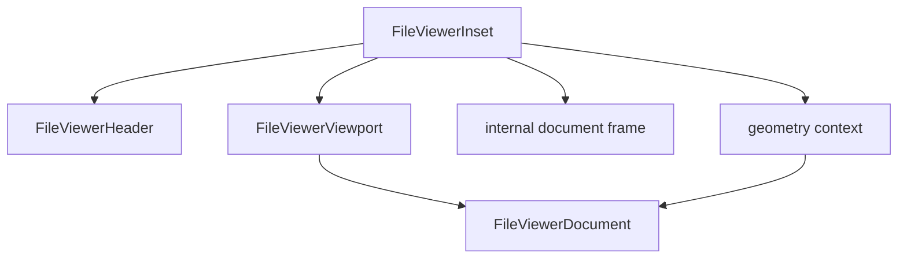
```mermaid
flowchart TD
  Inset["FileViewerInset"]
  Header["FileViewerHeader"]
  Viewport["FileViewerViewport"]
  Frame["internal document frame"]
  Geometry["geometry context"]
  Document["FileViewerDocument"]

  Inset --> Header
  Inset --> Viewport
  Inset --> Frame
  Inset --> Geometry
  Viewport --> Document
  Geometry --> Document
```

### Rule 4: Visible Geometry Is CSS-First

During sidebar motion, the page box cannot wait for React, PDF.js, or canvas
rendering.

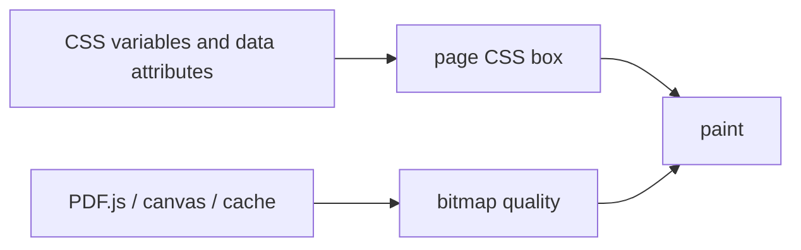
```mermaid
flowchart LR
  CSS["CSS variables and data attributes"] --> PageBox["page CSS box"]
  PageBox --> Paint["paint"]
  JS["PDF.js / canvas / cache"] --> Bitmap["bitmap quality"]
  Bitmap --> Paint
```

If JS is late, the canvas bitmap may temporarily stretch. The page box must not
freeze and jump.

## Geometry Model

The internal model should have one owner and one vocabulary.

```ts
type FileViewerGeometry = {
  rootInlineSizePx: number | null
  insetInlineSizePx: number | null
  sidebarWidthPx: number
  sidebarProgress: number
  sidebarState: "expanded" | "collapsed"
  sidebarMode: "inline" | "overlay"
  sidebarSide: "left" | "right"
  isSidebarTransitioning: boolean
}
```

Variable names carry units. Avoid generic `width`, `scale`, `layout`, and
`size` in shared code.

Derived values:

```text
activeSidebarWidthPx =
  sidebarMode === "inline" ? sidebarWidthPx * sidebarProgress : 0

insetInlineSizePx =
  rootInlineSizePx - activeSidebarWidthPx
```

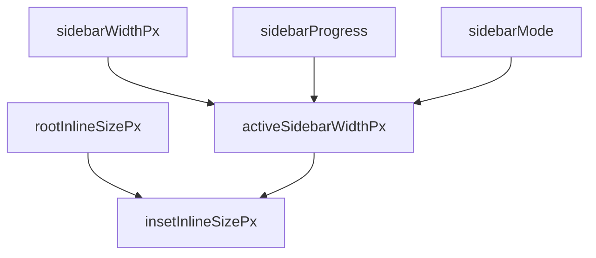
```mermaid
flowchart TD
  Root["rootInlineSizePx"]
  SidebarWidth["sidebarWidthPx"]
  Progress["sidebarProgress"]
  Mode["sidebarMode"]
  Active["activeSidebarWidthPx"]
  Inset["insetInlineSizePx"]

  SidebarWidth --> Active
  Progress --> Active
  Mode --> Active
  Root --> Inset
  Active --> Inset
```

## Ideal DOM Shape

The DOM shape should mirror the public grammar.

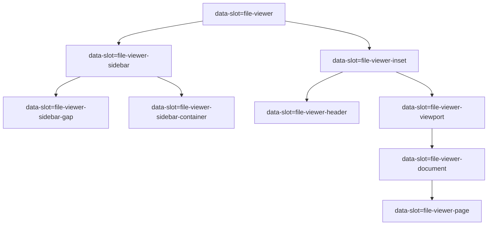
```mermaid
flowchart TB
  Root["data-slot=file-viewer"]
  Sidebar["data-slot=file-viewer-sidebar"]
  Gap["data-slot=file-viewer-sidebar-gap"]
  Container["data-slot=file-viewer-sidebar-container"]
  Inset["data-slot=file-viewer-inset"]
  Header["data-slot=file-viewer-header"]
  Viewport["data-slot=file-viewer-viewport"]
  Document["data-slot=file-viewer-document"]
  Page["data-slot=file-viewer-page"]

  Root --> Sidebar
  Sidebar --> Gap
  Sidebar --> Container
  Root --> Inset
  Inset --> Header
  Inset --> Viewport
  Viewport --> Document
  Document --> Page
```

The sidebar and inset are siblings. This matches the shadcn mental model.

## CSS Contract

Root variables:

```css
--file-viewer-sidebar-width
--file-viewer-sidebar-collapsed-width
--file-viewer-page-gap
--file-viewer-document-max-inline-size
```

State attributes:

```text
data-file-viewer-sidebar-state
data-file-viewer-sidebar-mode
data-file-viewer-sidebar-side
```

Expected layout:

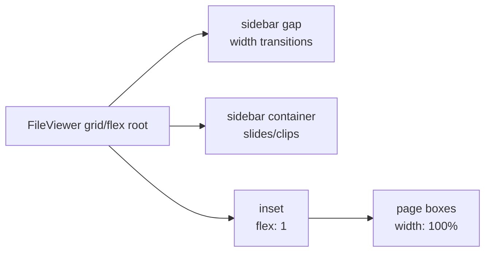
```mermaid
flowchart LR
  Root["FileViewer grid/flex root"]
  SidebarGap["sidebar gap<br/>width transitions"]
  SidebarContainer["sidebar container<br/>slides/clips"]
  Inset["inset<br/>flex: 1"]
  PageBox["page boxes<br/>width: 100%"]

  Root --> SidebarGap
  Root --> SidebarContainer
  Root --> Inset
  Inset --> PageBox
```

The page boxes must be sized by the inset/frame with CSS. Renderer state should
not set visible width every animation frame.

## PDF Renderer Contract

PDF has two scales.

```text
visual scale: the CSS page box size the user sees
render scale: the bitmap resolution PDF.js prepares
```

They must be allowed to differ during motion.

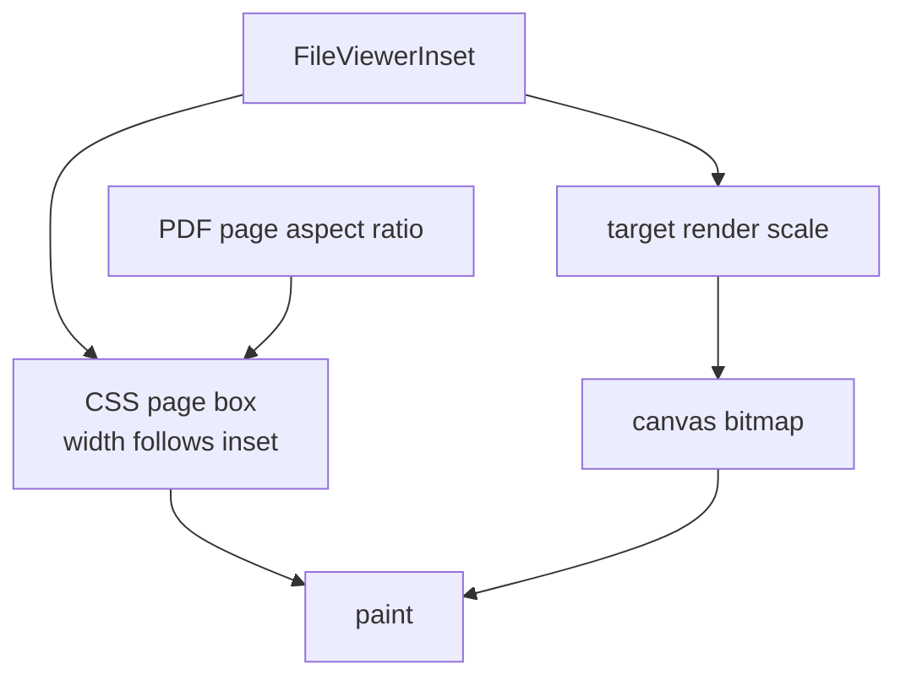
```mermaid
flowchart TD
  Inset["FileViewerInset"]
  PageRatio["PDF page aspect ratio"]
  PageBox["CSS page box<br/>width follows inset"]
  RenderTarget["target render scale"]
  Canvas["canvas bitmap"]
  Paint["paint"]

  Inset --> PageBox
  PageRatio --> PageBox
  Inset --> RenderTarget
  RenderTarget --> Canvas
  PageBox --> Paint
  Canvas --> Paint
```

Rules:

- the page CSS box follows inset geometry continuously;
- the canvas element fills the page CSS box;
- the canvas pixel buffer can lag;
- render cache warms to the target scale;
- no visible geometry waits for canvas completion.

## Virtualization Contract

Virtualization must also consume the same geometry.

Bad:

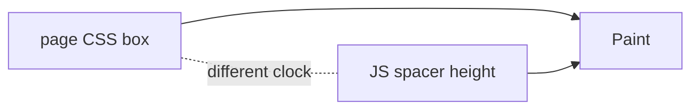
```mermaid
flowchart LR
  PageBox["page CSS box"] --> Paint
  Virtualizer["JS spacer height"] --> Paint
  PageBox -. different clock .- Virtualizer
```

Good:

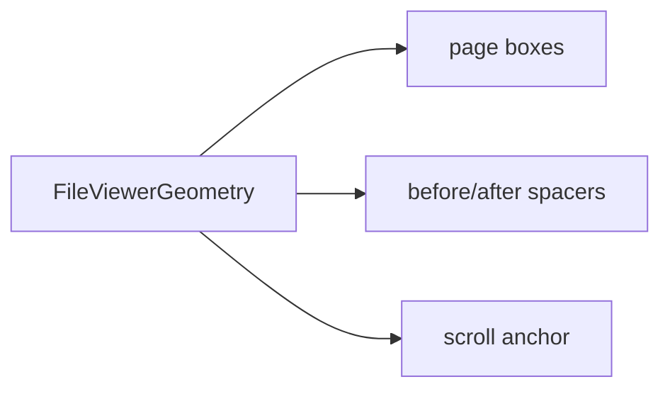
```mermaid
flowchart LR
  Geometry["FileViewerGeometry"]
  PageBox["page boxes"]
  Spacer["before/after spacers"]
  Anchor["scroll anchor"]

  Geometry --> PageBox
  Geometry --> Spacer
  Geometry --> Anchor
```

The scroll model cannot be patched after paint if the goal is perfection.
Spacers, page boxes, and anchor math all derive from the same geometry sample.

## Modularity

Perfect modularization means each layer has one reason to exist.

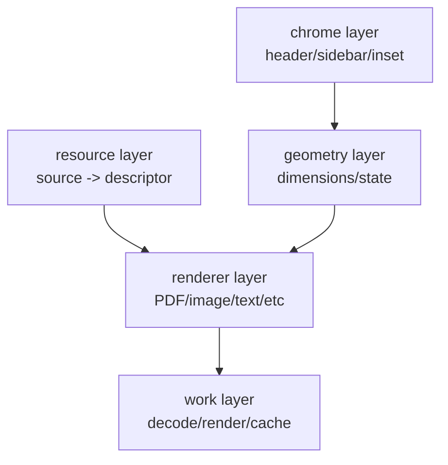
```mermaid
flowchart TB
  Resource["resource layer<br/>source -> descriptor"]
  Chrome["chrome layer<br/>header/sidebar/inset"]
  Geometry["geometry layer<br/>dimensions/state"]
  Renderer["renderer layer<br/>PDF/image/text/etc"]
  Work["work layer<br/>decode/render/cache"]

  Resource --> Renderer
  Chrome --> Geometry
  Geometry --> Renderer
  Renderer --> Work
```

Forbidden crossings:

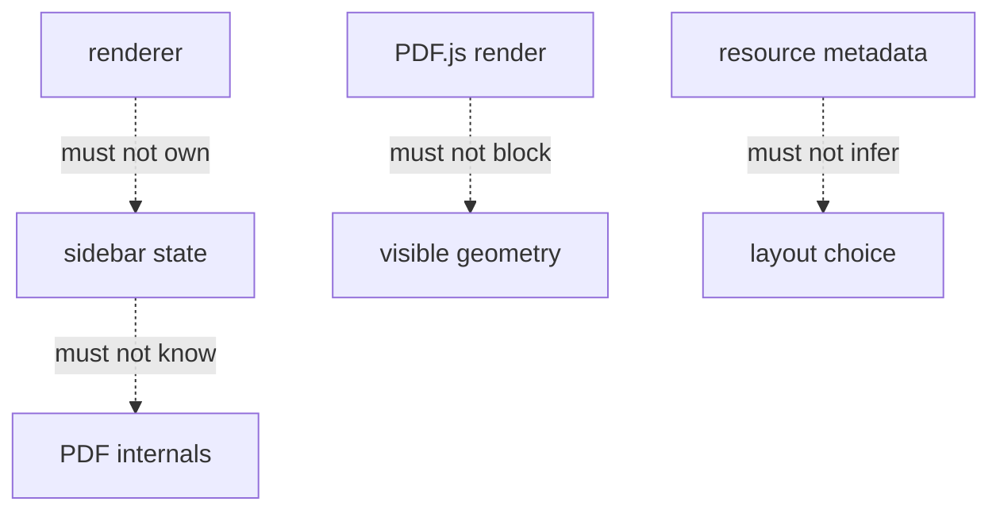
```mermaid
flowchart TD
  Renderer["renderer"] -. must not own .-> Sidebar["sidebar state"]
  Work["PDF.js render"] -. must not block .-> Geometry["visible geometry"]
  Resource["resource metadata"] -. must not infer .-> Layout["layout choice"]
  Sidebar -. must not know .-> Pdf["PDF internals"]
```

## Naming Standard

Public names:

```text
FileViewer
FileViewerProvider
FileViewerSidebar
FileViewerSidebarTrigger
FileViewerInset
FileViewerHeader
FileViewerIdentity
FileViewerToolbar
FileViewerViewport
FileViewerDocument
```

Internal shared variable names:

```text
rootInlineSizePx
insetInlineSizePx
sidebarWidthPx
sidebarProgress
sidebarState
sidebarMode
sidebarSide
isSidebarTransitioning
documentMaxInlineSizePx
pageAspectRatio
pageGapPx
```

Avoid:

```text
width
size
layout
scale
frame
surface
pane
content
```

Those words are only acceptable when scoped:

```text
pdfRenderScale
pageVisualScale
documentFrameElement
sidebarLayoutStore
```

## Migration Plan

### Phase 1: Canonical Composition

- Add `FileViewerInset`.
- Make `FileViewer source={source}` render the canonical grammar.
- Update examples and blocks to use `FileViewerInset`.
- Keep `FileViewerSurface` as an internal/deprecated alias.

```mermaid
flowchart LR
  Old["Surface + optional DocumentFrame"]
  New["Inset with built-in document geometry"]
  Old --> New
```

### Phase 2: Development Errors

- Geometry-aware renderers throw in development if mounted outside
  `FileViewerInset`.
- Add tests scanning examples for `PdfViewerPages` mounted directly in
  `FileViewerViewport`.
- Error messages show the canonical grammar.

### Phase 3: CSS-First PDF Geometry

- PDF page boxes resize with CSS from inset geometry.
- Canvas bitmap resolution catches up asynchronously.
- Fit-width measurement is retained only for legacy fallback and diagnostics.

### Phase 4: Remove Legacy Teaching Surface

- Docs stop teaching `FileViewerSurface` and `FileViewerDocumentFrame`.
- Low-level parts remain available only where they are genuinely needed.
- Registry examples converge on the same grammar.

## Acceptance Criteria

The sidebar toggle on `/` and `/files` with a PDF away from page 1:

- page width changes during the sidebar transition, not after it;
- page width is monotonic;
- no horizontal overshoot;
- no late "grow all at once" frame;
- no abrupt vertical scroll correction;
- no blank canvas;
- canvas sharpness may improve after motion, but geometry is already correct.

Frame samples should look like this:

```text
t=0ms:
  sidebar: 420
  inset:    858
  page:     826

t=100ms:
  sidebar: 210
  inset:   1068
  page:    1036

t=200ms:
  sidebar:   0
  inset:   1278
  page:    1246
```

Never this:

```text
t=0ms:
  sidebar: 420
  inset:    858
  page:     826

t=200ms:
  sidebar:   0
  inset:   1278
  page:     826

t=360ms:
  sidebar:   0
  inset:   1278
  page:    1246
```

## Final Architecture

```mermaid
flowchart TD
  Provider["FileViewerProvider"]
  Root["FileViewer"]
  Sidebar["FileViewerSidebar"]
  Inset["FileViewerInset"]
  Header["FileViewerHeader"]
  Viewport["FileViewerViewport"]
  Document["FileViewerDocument"]
  Geometry["FileViewerGeometry"]
  Renderer["renderer adapter"]
  Work["decode/render/cache"]
  Paint["paint"]

  Provider --> Root
  Root --> Sidebar
  Root --> Inset
  Root --> Geometry
  Inset --> Header
  Inset --> Viewport
  Viewport --> Document
  Geometry --> Inset
  Geometry --> Document
  Document --> Renderer
  Renderer --> Work
  Inset --> Paint
  Renderer --> Paint
  Work --> Paint
```

The Flaubertian test is simple:

```text
Every public noun must correspond to one visible part.
Every visible part must have one owner.
Every dimension must have one source.
Every renderer must receive geometry, not infer it.
Everything else is private.
```
