# FileViewer Geometry Contract Blueprint

## Verdict

Yes, the current behavior exposes a design-contract flaw in `FileViewer`.

The primitive has the right ingredients: a root, a body, a sidebar, a surface,
a viewport, a document frame, and renderer parts. The flaw is that the geometry
contract is optional. A renderer can be mounted directly in `FileViewerViewport`
and then discover its available width after layout with `ResizeObserver`.

That creates two layout authorities:

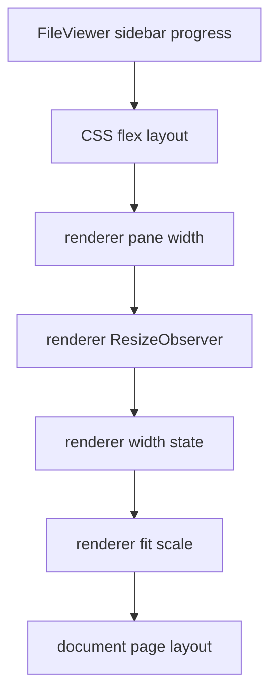

For static layout this is acceptable. For animated layout it is not. The
sidebar and the document resize on different clocks, so the viewer can appear to
grow late, jump, or blink.

## Measured Failure

Measured page:

```text
http://localhost:3100/
```

Measured composition:

```tsx
<FileViewer sidebarMode="inline" sidebarSide="right">
  <FileViewerHeader />
  <FileViewerBody>
    <FileViewerSurface>
      <FileViewerViewport>
        <PdfViewerPages />
      </FileViewerViewport>
    </FileViewerSurface>
    <FileViewerSidebar width="420px" />
  </FileViewerBody>
</FileViewer>
```

The PDF renderer is not inside a document frame here.

Measured collapse sequence at a `1600px` viewport:

```text
open:
  sidebar width: 420px
  pdf pane:      858px
  pdf page:      826px

after sidebar closes:
  sidebar width:   0px
  pdf pane:     1278px
  pdf page:      826px

later:
  sidebar width:   0px
  pdf pane:     1278px
  pdf page:     1246px
```

The pane expands first. The document page grows later. That is the visible
"all at once" growth.

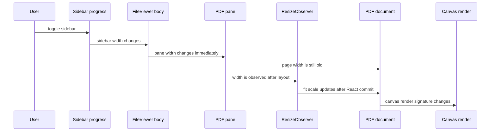

## Root Cause

The current system has three clocks:

1. Sidebar progress.
2. Browser layout plus `ResizeObserver`.
3. Renderer scale, page layout, virtualization, and canvas redraw.

```mermaid
flowchart LR
  Toggle["toggle"] --> Progress["sidebar progress rAF"]
  Progress --> CSSVar["--viewer-sidebar-progress"]
  CSSVar --> SidebarWidth["sidebar width"]
  SidebarWidth --> BrowserLayout["browser flex layout"]
  BrowserLayout --> PaneWidth["pane width visible now"]
  PaneWidth --> RO["ResizeObserver callback"]
  RO --> Raf["observer requestAnimationFrame"]
  Raf --> State["React setState"]
  State --> Scale["fit-width scale"]
  Scale --> Pages["page layout"]
  Pages --> Canvas["canvas redraw/cache"]
```

The bug is not that `ResizeObserver` exists. The bug is that
`ResizeObserver` is allowed to drive visible geometry during a known chrome
transition.

## Design Principle

During a chrome transition, every visible geometric quantity must be derived
from one deterministic source of truth.

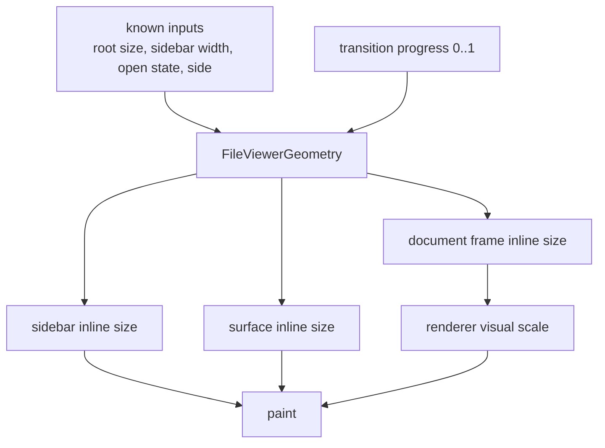

The renderer may measure for fallback, diagnostics, and steady-state
correction. It must not measure to decide the next visible frame of an active
sidebar resize.

## Target Contract

`FileViewer` should own a geometry model and expose it to document renderers.

```ts
type FileViewerGeometry = {
  rootInlineSize: number | null
  bodyInlineSize: number | null
  sidebarInlineSize: number
  sidebarProgress: number
  sidebarTargetProgress: number
  sidebarIsTransitioning: boolean
  surfaceInlineSize: number | null
  documentFrameInlineSize: number | null
  documentFrameTargetInlineSize: number | null
  documentFrameMaxInlineSize: number | null
}
```

The important invariant:

```text
documentFrameInlineSize =
  bodyInlineSize - sidebarInlineSize * sidebarProgress
```

with side, max width, and alignment applied afterward.

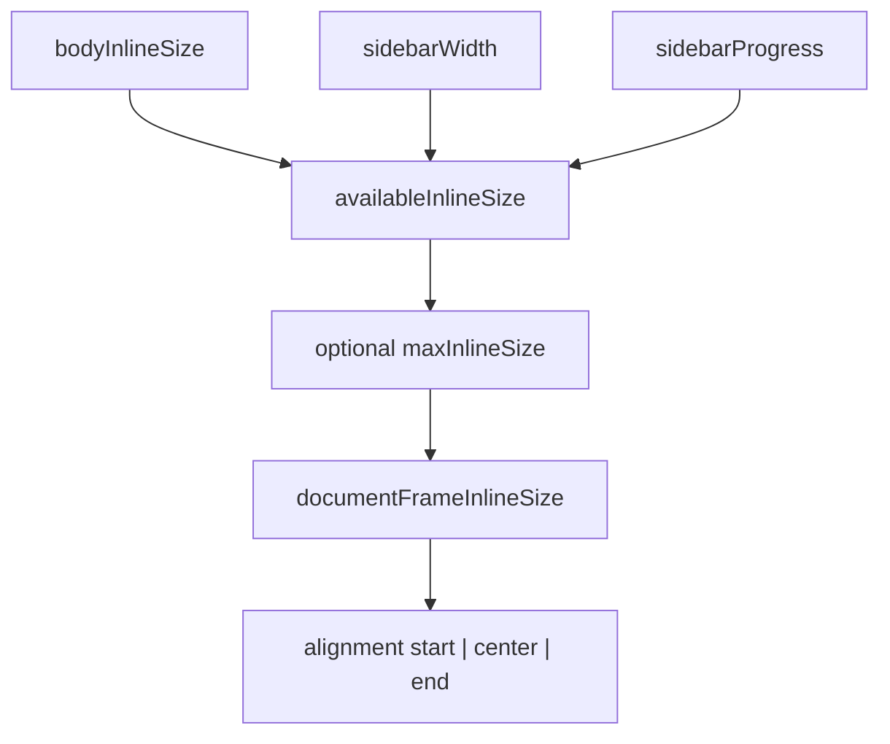

## Public Composition Rule

The first-class document surface must be explicit.

Preferred grammar:

```tsx
<FileViewer source={source} defaultSidebarOpen>
  <FileViewerHeader>
    <FileViewerSidebarTrigger />
    <FileViewerIdentity />
    <FileViewerToolbar />
  </FileViewerHeader>

  <FileViewerBody>
    <FileViewerSurface>
      <FileViewerDocumentFrame align="center">
        <FileViewerViewport>
          <PdfViewerPages />
        </FileViewerViewport>
      </FileViewerDocumentFrame>
    </FileViewerSurface>

    <FileViewerSidebar width="420px" />
  </FileViewerBody>
</FileViewer>
```

Bad grammar for fit-to-width renderers:

```tsx
<FileViewerSurface>
  <FileViewerViewport>
    <PdfViewerPages />
  </FileViewerViewport>
</FileViewerSurface>
```

That grammar leaves the renderer to infer its frame from DOM width.

## Renderer Contract

Renderers fall into two groups.

### Geometry-aware renderers

These require `FileViewerDocumentFrame`:

- PDF
- image
- TIFF
- DOCX page preview
- PPTX slide preview
- any paginated or canvas-backed renderer

They consume `documentFrameInlineSize` for visible layout.

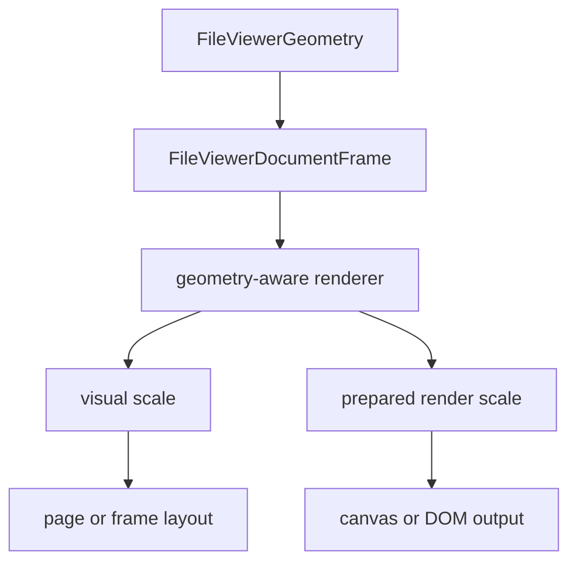

### Flow renderers

These can use ordinary layout:

- plain text
- code
- markdown
- CSV tables
- HTML when rendered as flow content

They may still use the frame if they need stable max width, but they do not
need it for correctness.

## PDF-Specific Use

PDF should separate visual scale from render preparation.

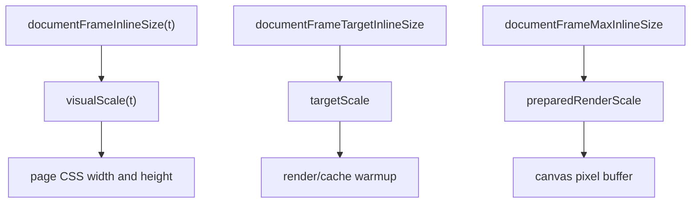

Rules:

- `visualScale` follows transition progress.
- `preparedRenderScale` is allowed to be larger than the current visual scale.
- canvas can temporarily stretch from an existing bitmap during the transition.
- high quality rendering catches up behind the visible geometry.
- visible geometry never waits for canvas rendering.

This avoids both failure modes:

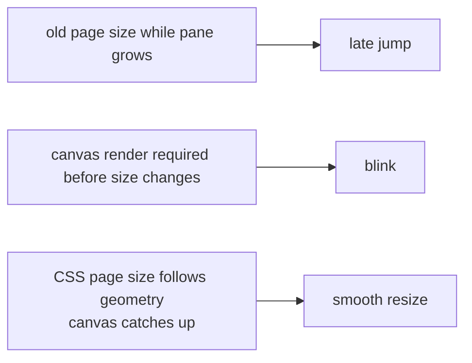

## Required Internal Ownership

The ownership should be:

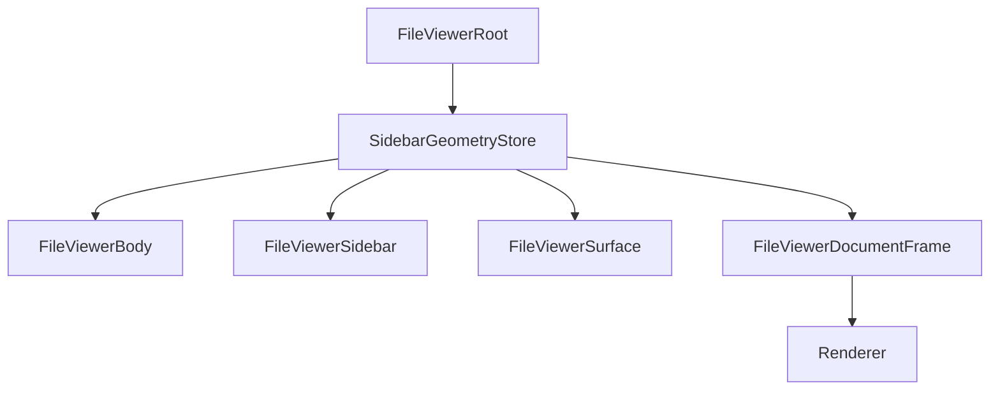

Not this:

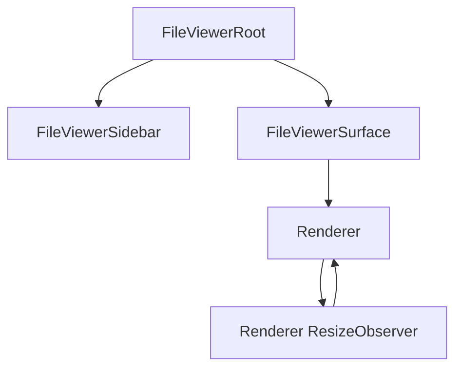

## CSS and JS Boundary

The pure HTML/CSS goal is correct, but the boundary must be precise.

CSS should own visible geometry:

- sidebar frame width;
- surface available width;
- document frame width;
- document alignment;
- clipping and overflow;
- page CSS width and height when possible.

JS should own non-visual or renderer-specific work:

- PDF.js page fetching;
- canvas bitmap resolution;
- virtualization window;
- cache warming;
- scroll anchor preservation;
- diagnostics.

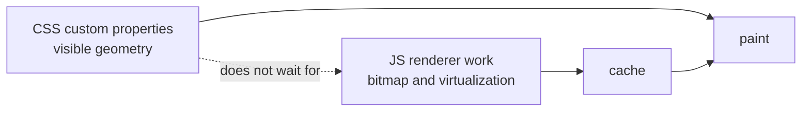

If JS is slow, geometry should still move smoothly. The worst case should be a
temporarily stretched bitmap, not a frozen page followed by a jump.

## Migration Plan

### Phase 1: Make the contract visible

- Add a development warning when a geometry-aware renderer is mounted without
  `FileViewerDocumentFrame`.
- Document that fit-to-width renderers require the frame.
- Update the `/` source viewer to wrap `PdfViewerPages` in
  `FileViewerDocumentFrame`.

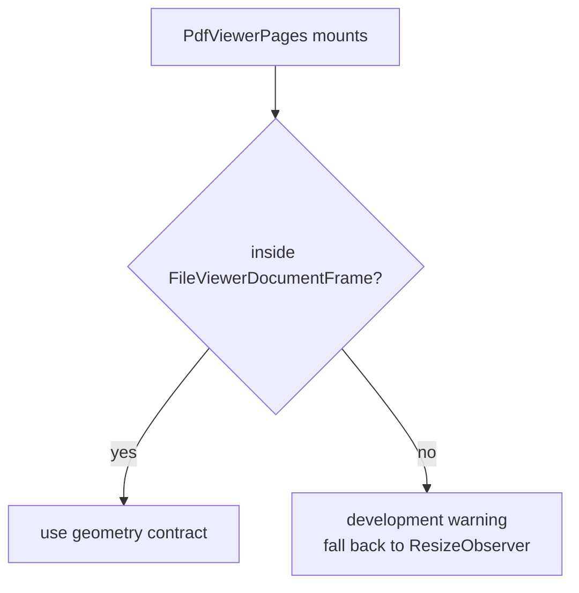

### Phase 2: Make frame geometry canonical

- Promote the existing sidebar layout store into a named geometry store.
- Compute `documentFrameInlineSize` from root/body size and sidebar progress.
- Expose the geometry via context.
- Keep `ResizeObserver` only as a source of root/body size, not renderer-local
  fit width.

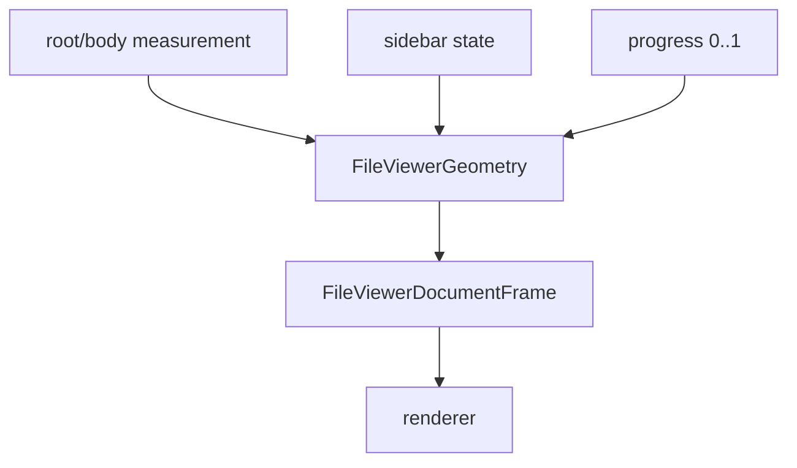

### Phase 3: Make PDF visually deterministic

- Drive PDF visual page width from frame geometry during transitions.
- Render/canvas quality may lag, but page box geometry must not.
- Use target/max frame width to prepare render scale.
- Preserve scroll anchor from geometry math, not post-paint correction.

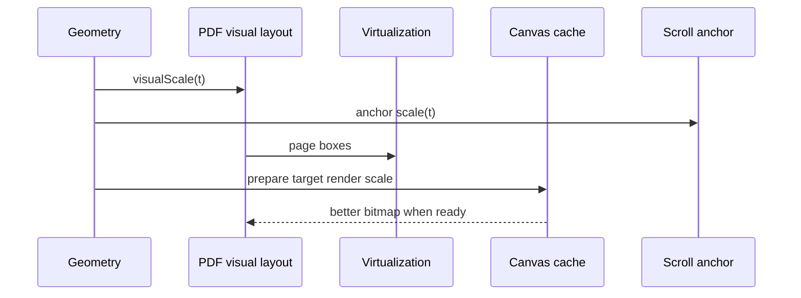

### Phase 4: Make the bad path hard to use

- Add a default frame in the easy `FileViewer source={...}` path.
- Make renderer docs show the frame in composed examples.
- Consider making `FileViewerViewport` assert a frame for geometry-aware
  renderers in development.

## Acceptance Criteria

Sidebar toggle with a PDF not on page 1:

- no horizontal overshoot;
- no late page growth after the sidebar has finished;
- no page-width freeze while the pane grows;
- no abrupt vertical scroll correction;
- no canvas blanking during the transition;
- canvas quality may improve after the transition, but geometry must already be
  correct.

Measured frame sequence should look like this:

```text
t=0ms:
  sidebar: 420
  pane:     858
  page:     826

t=100ms:
  sidebar: 210
  pane:    1068
  page:    1036

t=200ms:
  sidebar:   0
  pane:    1278
  page:    1246
```

Not this:

```text
t=0ms:
  sidebar: 420
  pane:     858
  page:     826

t=200ms:
  sidebar:   0
  pane:    1278
  page:     826

t=360ms:
  sidebar:   0
  pane:    1278
  page:    1246
```

## Test Plan

### Unit tests

- geometry math for left and right sidebars;
- collapsed, expanded, and mid-progress widths;
- max inline size and alignment;
- controlled and uncontrolled sidebar state;
- overlay mode does not subtract inline width.

### Browser tests

Use frame sampling around the sidebar toggle:

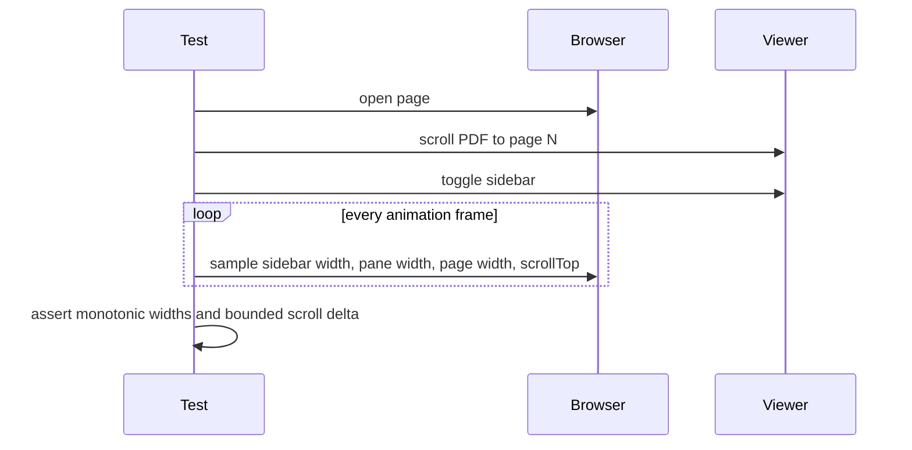

Assertions:

- page width is monotonic during collapse and expand;
- page width changes before the sidebar transition ends;
- final page width is reached within one frame of the final sidebar progress;
- scrollTop correction is monotonic or bounded to less than one visual frame;
- no sampled frame has a blank visible page canvas.

## Final Architecture

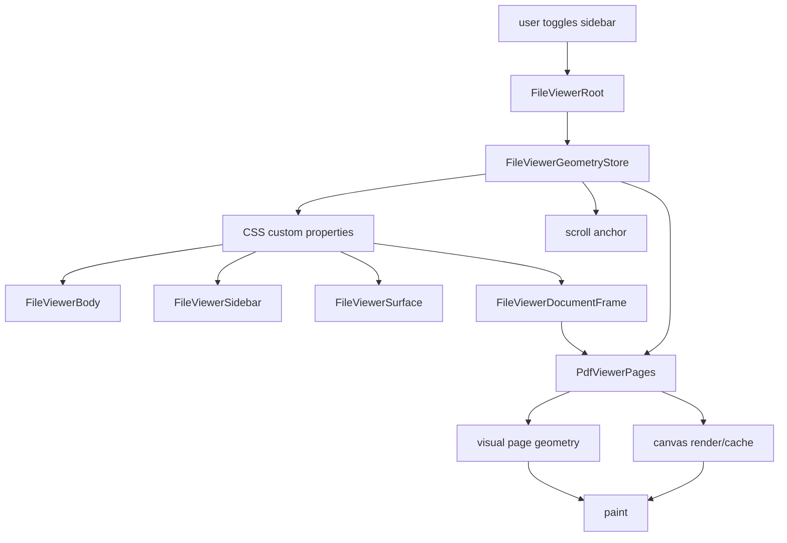

The key property is that `Paint` receives one coherent geometry state per
frame. Rendering quality can lag. Layout cannot.
