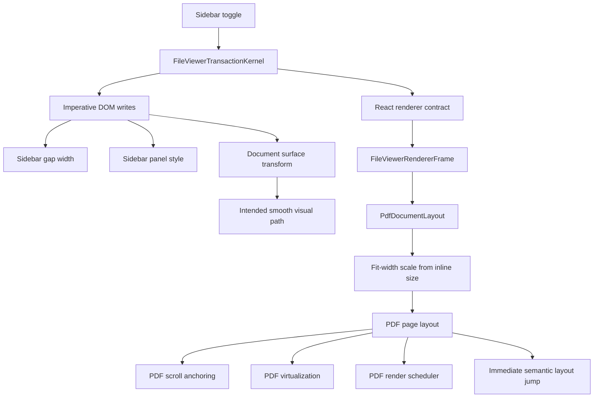
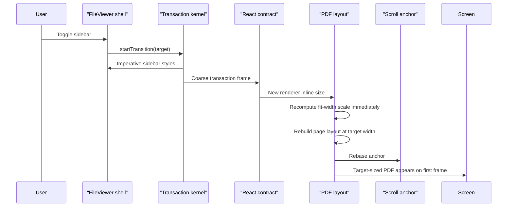
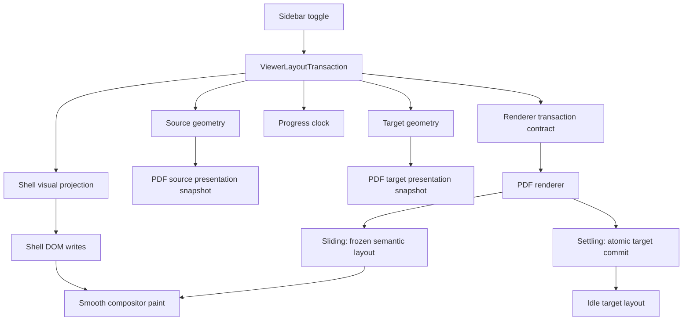
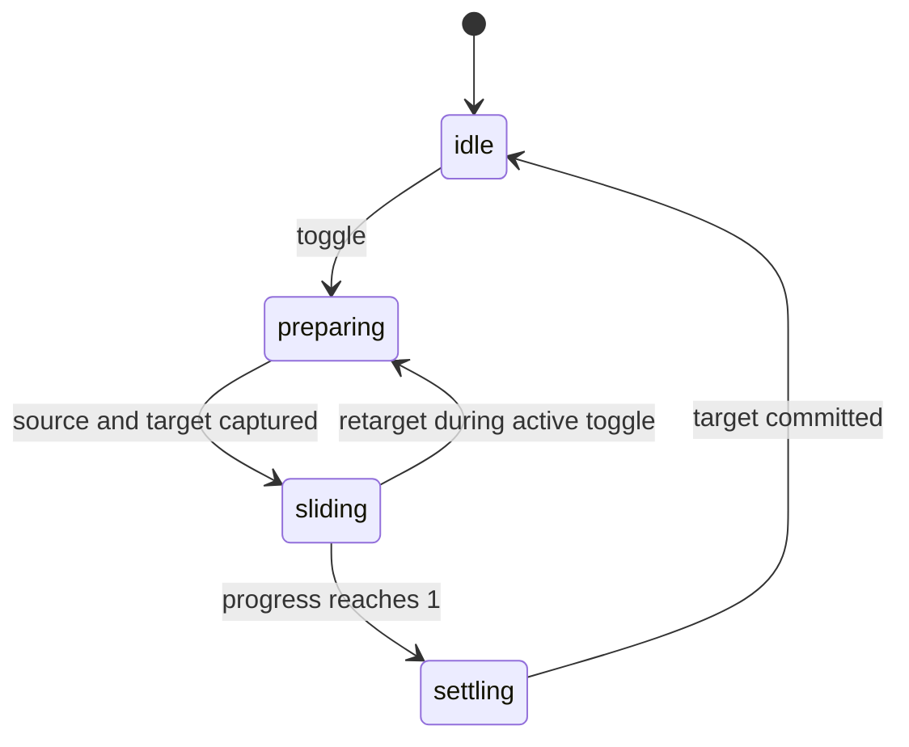
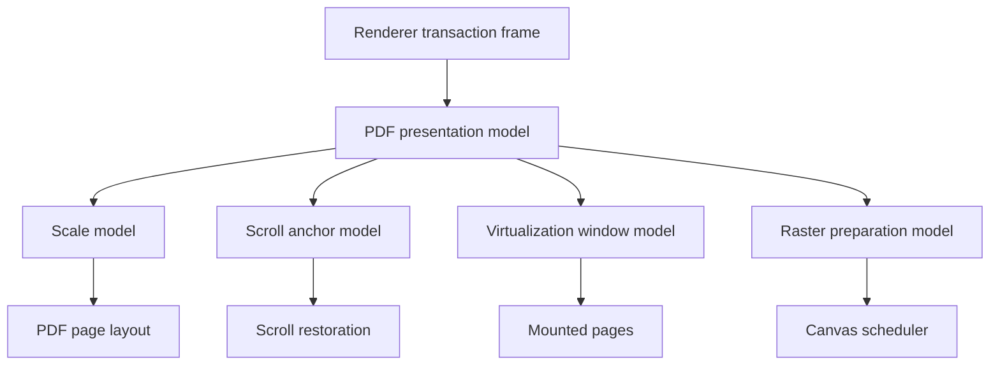
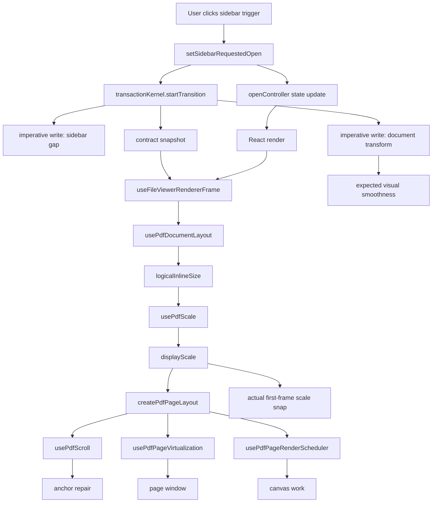
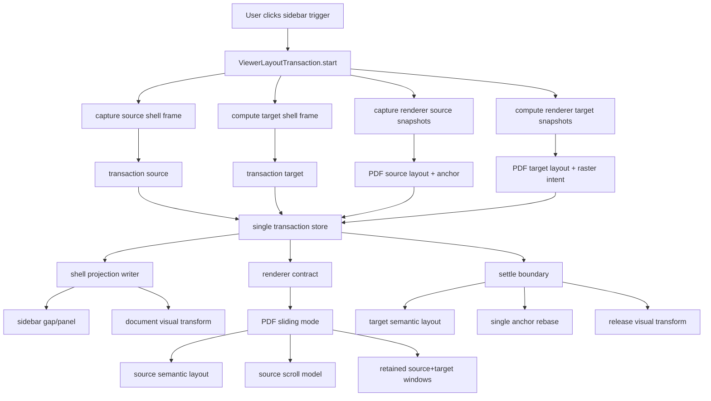
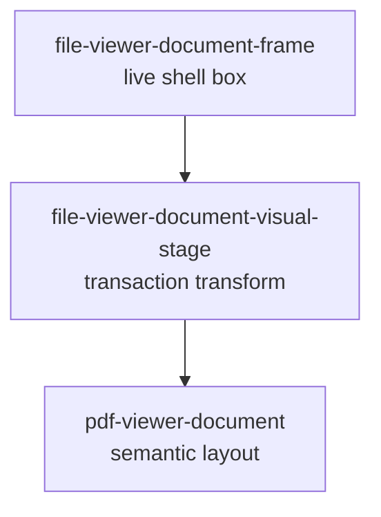
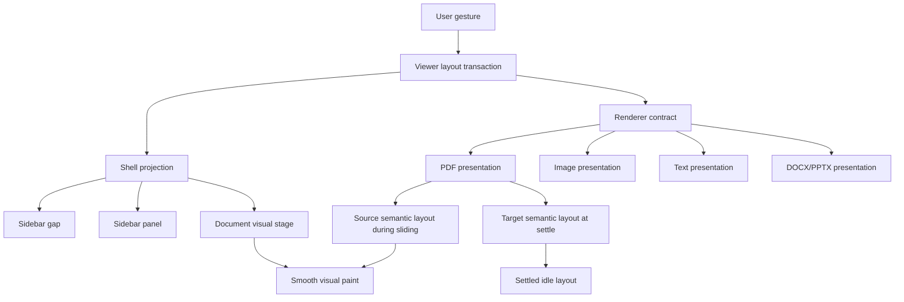

# FileViewer PDF Sidebar Toggle Single-Transaction Blueprint

## Status

Draft.

This blueprint is the next architecture cut for the remaining non-smooth PDF
movement when toggling the FileViewer sidebar.

The goal is not another local PDF anchor patch. The goal is to remove the
design condition that makes local patches necessary.

## Executive Summary

The remaining sidebar-toggle problem is not primarily virtualization, scroll
anchoring, or page overscan.

The measured browser behavior is:

```txt
Before toggle:
  PDF viewport width: 590.67
  PDF page width: 591
  PDF zoom label: 99%
  page 4 top in viewport: 19
  document transform: none

First sampled frame after toggle:
  PDF viewport width: 718.67
  PDF page width: 719
  PDF zoom label: 121%
  page 4 top in viewport: 18.67
  document transform: none
```

The page is anchored reasonably well after the recent fixes. The visible
problem is that the PDF layout and fit-width scale jump to the target size on
the first frame. There is no smooth document transaction.

The root issue:

```txt
Sidebar motion is modeled as a shell visual transition.
PDF fit-width is modeled as live responsive layout.
Both observe the same gesture at the same time.
No single owner decides when semantic PDF layout may change.
```

The right design:

```txt
One sidebar toggle creates one viewer layout transaction.
The transaction captures source and target geometry before motion.
During sliding, PDF semantic layout is frozen.
During sliding, the document is resized visually by transform/clip only.
At settle, target PDF layout and scroll anchor commit atomically once.
```

## Root Cause

The current architecture has three owners for one visual movement.



The shell writes some visual styles imperatively, but the PDF derives scale from
the current renderer inline size. When the sidebar closes, the PDF sees the
larger inline size and immediately recomputes fit-width from `99%` to `121%`.

The scroll layer then repairs position. That is useful, but it is too late for
motion quality. The user already saw the document jump to the new scale.

## Current Timing Failure



The important part is not that scroll changes. The important part is that PDF
scale changes before there is a visible document animation.

## Design Smells

### 1. Fit-Width Is Coupled To Live Shell Width

Fit-width is correct in idle layout. It is wrong as the animation driver.

During a sidebar transition, live shell width is not semantic document width.
It is a moving visual container.

### 2. The Shell Contract Is Not The Only Geometry Contract

The shell has a transaction frame, but PDF still independently infers geometry
from measured inline size and previous inline size.

This creates two truths:

```txt
Shell truth: "we are sliding from source to target"
PDF truth: "my container is target width, so I am target scale"
```

### 3. The Current Transaction Mixes Public Contract And Private Paint

The kernel has:

- a contract snapshot for React subscribers;
- an interactive snapshot for imperative DOM writes;
- delayed settle publication;
- direct style writes.

That split can work only if renderers never need smooth transaction state.
PDF does need it, because fit-width scale affects page geometry.

### 4. Scroll Anchoring Is Being Asked To Hide Layout Mutation

Scroll anchoring should preserve reading location when layout commits.

It should not be the mechanism that makes an animated resize look smooth.

### 5. Virtualization Is Downstream

Virtualization can blink if layout changes mid-transition, but it is not the
first cause. It reacts to page layout and scroll window changes. Fixing
virtualization without fixing transaction ownership only reduces secondary
artifacts.

## Platonic Invariants

These invariants should become architecture tests.

### Transaction Invariants

```txt
One user gesture creates one transaction id.
One transaction id owns source geometry, target geometry, phase, and progress.
No renderer infers sidebar transition state from DOM width changes.
No document renderer mutates semantic layout during sliding.
No scroll write is performed during sliding unless the user scrolls.
Settle performs at most one semantic layout commit and one anchor rebase.
```

### PDF Invariants

```txt
In fit-width mode, PDF may change scale at idle.
In fit-width mode, PDF must not change semantic scale during shell sliding.
During shell sliding, the visible PDF can resize only through visual projection.
At settle, the PDF commits target scale once.
The reading anchor is captured from source layout and restored in target layout.
Virtualization retains the source and target page windows until settle completes.
```

### DOM Invariants

```txt
FileViewer shell may read and write FileViewer shell DOM.
PDF may read and write PDF viewport/document DOM.
PDF may not query sidebar DOM.
FileViewer shell may not query PDF page DOM.
Cross-sibling DOM contracts are forbidden.
```

### Naming Invariants

Use one vocabulary:

```txt
transaction
phase
source
target
progress
layoutInlineSize
visualInlineSize
rasterInlineSize
scrollAnchor
settle
```

Avoid mixing:

```txt
motion vs transaction
frame vs snapshot vs target when they mean the same thing
chrome vs shell vs surface for the same geometry owner
```

## Target Architecture

### High-Level Shape



### Phase Model



### Phase Responsibilities

| Phase | Shell Layout | PDF Layout | PDF Scroll | PDF Raster | User Perception |
| --- | --- | --- | --- | --- | --- |
| `idle` | settled DOM | live | preserve normally | settled | stable |
| `preparing` | measure source and target | capture source snapshot | capture anchor | compute target render size | no paint gap |
| `sliding` | animate sidebar/clip/transform | frozen source layout | defer anchor writes | retain + warm target | smooth resize |
| `settling` | stop transform | commit target layout | rebase once | promote target | no hybrid frame |
| `idle` | target DOM | live target layout | preserve normally | settled target | stable |

## Core Data Model

The shell transaction should be the only source of geometry truth.

```ts
type ViewerLayoutTransactionPhase =
  | "idle"
  | "preparing"
  | "sliding"
  | "settling";

type ViewerLayoutTransactionFrame = {
  id: number | null;
  phase: ViewerLayoutTransactionPhase;
  progress: number;
  durationMs: number;
  source: ViewerLayoutFrame;
  target: ViewerLayoutFrame;
  visual: ViewerVisualFrame;
  renderer: ViewerRendererTransactionFrame;
};

type ViewerLayoutFrame = {
  shellInlineSize: number;
  sidebarInlineSize: number;
  contentInlineSize: number;
  documentInlineSize: number;
  sidebarOpen: boolean;
  sidebarMode: "inline" | "overlay";
  sidebarSide: "left" | "right";
};

type ViewerVisualFrame = {
  contentClipInlineSize: number;
  documentTranslateX: number;
  documentScaleX: number;
  documentScaleY: number;
};

type ViewerRendererTransactionFrame = {
  layoutPolicy: "live" | "frozen" | "target";
  scrollPolicy: "preserve" | "defer" | "rebase";
  visualPolicy: "none" | "shell-transform";
  rasterPolicy: "settled" | "prepare-target" | "promote-target";
  sourceInlineSize: number;
  targetInlineSize: number;
  visualInlineSize: number;
  transactionId: number | null;
};
```

The important distinction:

```txt
layoutInlineSize: semantic size used to build document layout.
visualInlineSize: painted size seen by the user during transition.
rasterInlineSize: maximum size needed so transform does not blur or blank.
```

Today these concepts are too easy to conflate.

## PDF Presentation Model

PDF should split presentation into three explicit layers.



### Scale Model

```ts
type PdfScaleMode = "fit-width" | "fixed";

type PdfScaleSnapshot = {
  mode: PdfScaleMode;
  resolvedScale: number;
  fitWidthInlineSize: number;
};
```

Rules:

```txt
Idle + fit-width:
  resolvedScale = fitWidth(containerInlineSize)

Sliding + fit-width:
  semantic resolvedScale = source resolvedScale
  visual scale = target/current projection from transaction
  target resolvedScale may be computed for raster preparation only

Settling + fit-width:
  semantic resolvedScale = target resolvedScale
  scroll anchor rebase happens before paint

Fixed scale:
  semantic resolvedScale does not change on sidebar width changes
```

### Anchor Model

PDF should keep the existing reading-marker idea, but it belongs to the commit
boundary, not every animation frame.

```ts
type PdfReadingAnchor =
  | {
      kind: "top";
    }
  | {
      kind: "page-boundary";
      pageNumber: number;
      topInViewport: number;
    }
  | {
      kind: "page";
      pageNumber: number;
      yPercent: number;
    };
```

Rules:

```txt
preparing:
  capture anchor from source layout

sliding:
  do not restore anchor
  do not chase moving geometry with scrollTop writes

settling:
  compute target scrollTop from source anchor and target layout
  write scrollTop once
```

### Virtualization Model

Virtualization should receive an explicit transaction policy.

```txt
idle:
  render current window

sliding:
  retain source visible/render window
  include target visible/render window if available
  do not drop pages only because target scrollTop/layout differs

settling:
  switch to target window after scroll rebase
  release retained pages after one stable frame
```

### Raster Model

Target raster preparation is allowed during sliding, but it must not mutate
semantic layout.

```txt
source layout:
  visible DOM uses source page layout

target raster:
  render/cached canvases may be prepared for target scale
  prepared target output is promoted only at settle
```

This keeps motion smooth without making the final target blurry.

## Current Architecture Diagram



## Target Architecture Diagram



## Implementation Blueprint

### Step 1: Rename And Compress Transaction Ownership

Replace the current `file-viewer-motion-kernel.ts` conceptually with:

```txt
file-viewer-transaction-store.ts
file-viewer-transaction-dom.ts
file-viewer-transaction-types.ts
```

Responsibilities:

```txt
transaction-store:
  owns transaction state, source/target frames, phase, progress, subscriptions

transaction-dom:
  writes shell projection styles only
  no renderer logic

transaction-types:
  shared internal transaction vocabulary
```

Delete or absorb ambiguous concepts:

```txt
interactive snapshot
contract snapshot
visual hold frame
settling contract frame
motion kernel naming
```

The store may still avoid React rerenders per animation frame, but it must
publish the renderer contract before PDF computes target layout. Renderers need
an explicit `sliding/frozen` contract at the beginning of motion.

### Step 2: Make Transaction Preparation Synchronous

Before changing `open` state, the shell must compute a complete transaction.

Required preparation order:

```txt
1. read current shell frame
2. compute target shell frame from requested open state
3. notify renderers: prepareTransaction(source, target)
4. renderers capture source anchors and source presentation snapshots
5. renderers compute target presentation snapshots without committing them
6. publish sliding contract
7. allow sidebar state/interactivity update
8. start compositor projection
```

This is the key cut. Today the sidebar state update and PDF responsive layout
can race the transaction.

### Step 3: Introduce Renderer Transaction Registration

The shell should not know PDF internals. It should support a generic internal
renderer transaction participant.

```ts
type FileViewerRendererTransactionParticipant = {
  prepareTransaction: (input: {
    transactionId: number;
    sourceInlineSize: number;
    targetInlineSize: number;
  }) => void;
  commitTransaction: (input: { transactionId: number }) => void;
  cancelTransaction: (input: { transactionId: number }) => void;
};
```

PDF implements this privately.

FileViewer exposes none of this publicly.

### Step 4: Split PDF Layout Into Source, Target, Active

`usePdfDocumentLayout` should stop deriving everything from a single live
`logicalInlineSize`.

Target shape:

```txt
sourcePresentation:
  scale
  pageLayout
  scrollAnchor
  virtualWindow

targetPresentation:
  scale
  pageLayout
  scrollTarget
  rasterInlineSize

activePresentation:
  source during sliding
  target after commit
```

During sliding:

```txt
layout.pageLayout = sourcePresentation.pageLayout
layout.displayScale = sourcePresentation.scale
layout.renderScale = max(source, target) or prepared target
layout.visualScale = transaction visual scale
```

At settle:

```txt
layout.pageLayout = targetPresentation.pageLayout
layout.displayScale = targetPresentation.scale
restore scroll from source anchor into target layout
clear transaction snapshots
```

### Step 5: Move Visual Projection To A Stable Wrapper

The transform must be applied to a stable document visual wrapper, not to a
node whose own width is recomputed by PDF fit-width during the same frame.

Target DOM distinction:

```txt
file-viewer-document-frame
  owns available shell space

file-viewer-document-visual-stage
  owns transform/clip during shell transaction

pdf-viewer-document
  owns semantic PDF layout
```

Diagram:



During sliding:

```txt
Frame width may change with sidebar.
Stage projects source PDF layout into the current visual width.
Pdf semantic width remains source width.
```

At settle:

```txt
Stage transform is cleared.
Pdf semantic width becomes target width.
```

### Step 6: Remove Width-Change Inference From PDF

Delete the fallback logic that says:

```txt
if renderer inline size changed and fit-width is active,
pretend this is a viewer-shell target transition
```

That was useful as a defensive patch, but it is not the ideal architecture.
PDF should know about a shell transaction only through the transaction contract,
not through width-delta inference.

### Step 7: Make Settle Atomic

Settle must not create a visible hybrid frame.

Atomic settle sequence:

```txt
1. transaction enters settling
2. PDF computes target scrollTop from captured source anchor
3. React commits target PDF layout
4. DOM scrollTop is written
5. shell transform is cleared
6. virtualization releases retained pages after next stable frame
```

If the browser can paint between steps 3 and 4, the design is still wrong.

Use `useLayoutEffect` or `flushSync` only at this boundary, not as a general
motion strategy.

### Step 8: Retargeting

If the user toggles again mid-transition:

```txt
current visual frame becomes new source visual frame
current semantic PDF layout remains frozen until new settle
new target is computed from the latest requested open state
source anchor remains the original semantic reading anchor unless user scrolled
```

Do not commit an intermediate PDF layout just because the user reversed the
toggle.

## What To Delete

The ideal implementation should delete or remove the need for:

```txt
PDF detecting shell transaction from width deltas
PDF scroll repair during sliding
renderer-specific sidebar timing branches
multiple rest-frame types for the same geometry
interactive vs contract snapshot ambiguity
document transform writes that may target the semantic PDF layout node
virtualization special cases based only on layoutPolicy without transaction id
```

Some helpers may survive, but only under clearer names and single ownership.

## What Not To Do

Do not solve this by:

```txt
Increasing overscan.
Adding more timeouts.
Adding more requestAnimationFrame delays.
Making PDF query sidebar DOM.
Making FileViewer query PDF page DOM.
Preserving raw scrollTop as the transition anchor.
Updating PDF scale on every sidebar animation frame through React.
Making all sidebars overlay-only.
Adding public props such as sidebarAwareFitWidth.
```

Updating PDF scale every animation frame through React is especially tempting,
but it is the wrong center of gravity. It makes the renderer do expensive
semantic work on the visual clock. The visual clock should be compositor-level;
semantic layout should commit once.

## Tests

### Unit Tests

Transaction store:

```txt
startTransition publishes a sliding renderer contract before target layout is visible.
sliding contract has layoutPolicy frozen and scrollPolicy defer.
settling contract has layoutPolicy target and scrollPolicy rebase.
retarget does not publish an idle target frame between two active toggles.
settle publishes target once.
```

Renderer contract:

```txt
resolve layout inline size returns source inline size during frozen phase.
resolve layout inline size returns target inline size during target phase.
raster inline size is max(source, target).
visual scale is derived from source -> current visual size.
```

PDF presentation:

```txt
fit-width source scale remains active during sliding.
target fit-width scale is computed but not committed during sliding.
source anchor is captured during preparing.
scrollTop is not written during sliding.
target scrollTop is written once during settling.
virtualization includes source and target windows during sliding.
```

### Browser Tests

Frame-sampled sidebar toggle test:

```txt
1. Open /files.
2. Select PDF.
3. Scroll to page 4.
4. Capture page 4 rect, zoom label, scrollTop.
5. Toggle sidebar.
6. Sample at 0, 16, 33, 50, 83, 116, 150, 200, 260ms.
```

Assertions:

```txt
page bounding width must not snap from source to target on the first frame
document visual transform or visual stage projection must be active during sliding
zoom label may remain source until settle, or display target only after commit
page top in viewport changes monotonically within subpixel tolerance
window.scrollY remains 0
current page remains page 4
rendered page window does not drop page 4
no console errors after reload
```

Settled assertions:

```txt
after collapse, target width and target zoom are correct
after reopen, source width and source zoom are restored
repeating 10 toggles does not accumulate page-top drift
```

### Negative Architecture Tests

```txt
PDF modules do not import sidebar DOM modules.
FileViewer shell modules do not import PDF page modules.
Public registry exports do not include transaction internals.
No code path uses ResizeObserver as the visible transition driver.
No renderer hook infers shell transaction solely from width delta.
```

## Migration Plan

### Pass 1: Prove The Contract

Implement the transaction contract and tests without changing visual behavior.

Expected result:

```txt
Tests can observe a correct sliding/frozen renderer contract.
PDF may still snap visually.
No public API changes.
```

### Pass 2: Freeze PDF Semantic Layout During Sliding

Make PDF use source presentation while the transaction is sliding.

Expected result:

```txt
PDF zoom label no longer jumps on first frame.
Page layout no longer rebuilds on first frame.
ScrollTop no longer rebases during sliding.
The document may temporarily not fill the target frame unless visual projection is complete.
```

### Pass 3: Add Visual Stage Projection

Add a stable visual wrapper and make shell transaction projection resize the
frozen document visually.

Expected result:

```txt
The PDF appears to resize smoothly.
Semantic PDF layout remains frozen.
No React animation-frame loop is needed.
```

### Pass 4: Atomic Settle

Commit target PDF layout and scroll anchor at the settle boundary.

Expected result:

```txt
No hybrid frame.
No back-and-forth at settle.
No page window blink.
```

### Pass 5: Delete Patches

Remove defensive width-delta inference and timer-based compensation that became
unnecessary.

Expected result:

```txt
The implementation is smaller than the patched version.
The remaining modules map directly to the blueprint.
```

## Acceptance Criteria

The design is complete only when all are true:

```txt
Toggling sidebar on page 4 of a fit-width PDF has no first-frame scale snap.
The PDF visibly resizes smoothly on the same clock as the sidebar.
The PDF semantic layout changes exactly once, at settle.
Scroll anchor restoration happens exactly once, at settle.
Virtualization does not blink or drop the active page during sliding.
The same transaction model works for PDF, image, text, DOCX, and PPTX.
No renderer reads FileViewer sidebar DOM.
No FileViewer shell code reads renderer internals.
Public API remains shadcn-like anatomy, not transaction machinery.
```

## Final Architecture



The ideal form is simple:

```txt
The shell owns the visual transaction.
The renderer owns document semantics.
The transaction contract decides when semantics are allowed to change.
```

That is the missing boundary.

