# FileViewer Sidebar Toggle Motion Diagrams

## Question

Have we reached the perfect design for `FileViewer` sidebar toggle motion with
fit-width PDF rendering?

The answer is: the current implementation now has the right runtime behavior
and the right ownership direction. The remaining perfection question is whether
the contracts should be compressed into fewer named internal modules.

The browser failure that forced the final design was precise:

- page 4 was the reading location before close;
- close preserved page 4;
- reopen computed the correct page-4 target;
- the browser clamped that target because the virtualized DOM scroll range was
  temporarily too short;
- once the PDF scaffold expanded, no second restore happened.

That means the root issue was not only virtualization, not only anchor math, and
not only component hierarchy. It was a missing contract between anchor
restoration and temporary physical scroll range.

## Current Final Model

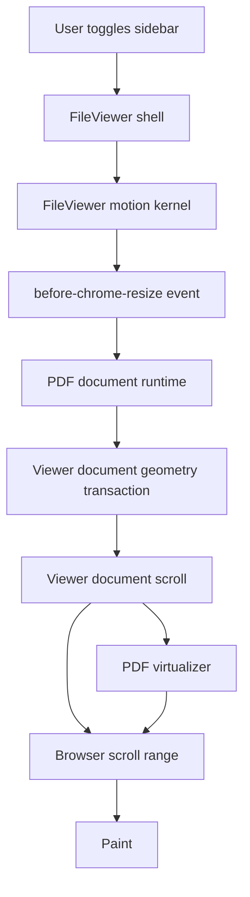

The contract is intentionally layered:

- `FileViewer` owns chrome geometry and the animation clock.
- Renderer runtime owns reading-anchor capture.
- Geometry transaction owns which anchor should survive a layout change.
- Scroll owns physical/logical scroll restoration.
- Virtualization owns mounted boxes only.

## Iteration 1: More Overscan

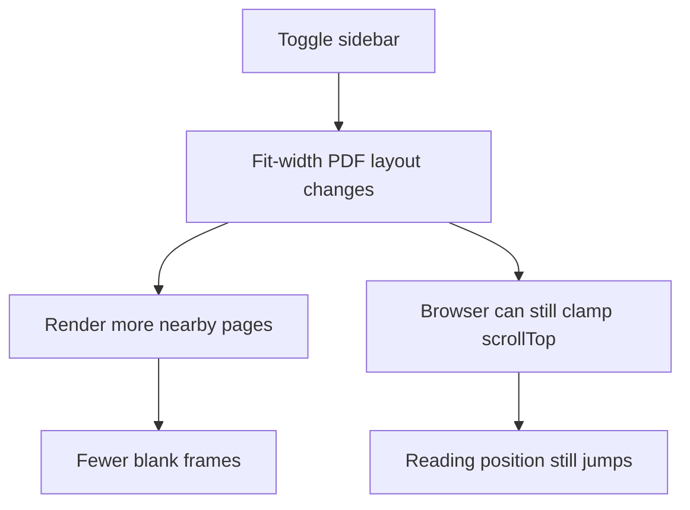

Verdict: rejected as the primary fix.

Overscan improves visual availability, but it cannot preserve continuity. It
does not own scroll, and it cannot make an invalid physical `scrollTop` valid.

## Iteration 2: Semantic Anchor Preservation

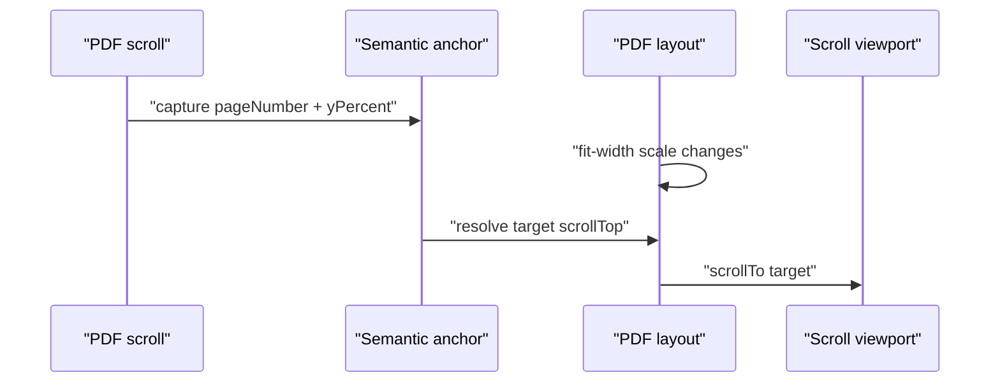

Verdict: necessary, but incomplete.

This preserves meaning, not necessarily pixels. If the DOM scroll range is
temporarily shorter than the semantic target, the browser clamps the write.

## Iteration 3: Chrome Resize Preflight

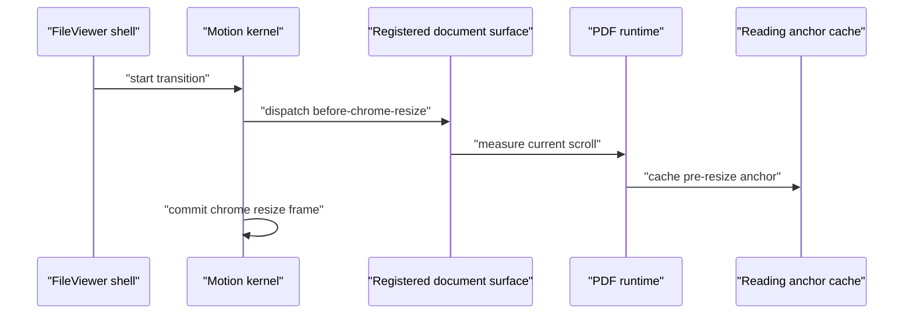

Verdict: correct, but still incomplete.

This fixed the timing bug where anchor capture could happen after browser
clamp. The later browser proof showed the preflight fired with the correct
values, yet reopen still jumped. That proved the target was correct but applied
too early for the virtualized scroll range.

## Iteration 4: Chrome Settle Uses Cached Anchor

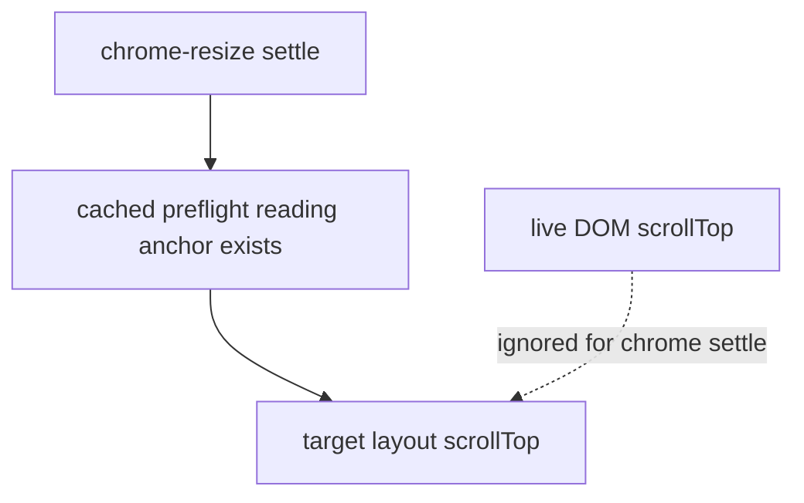

Verdict: correct anchor choice.

During chrome settle, live DOM scroll is not authoritative. It may be the
browser's temporary clamp value. The cached semantic anchor is the truth.

## Iteration 5: Deferred Scroll Restore

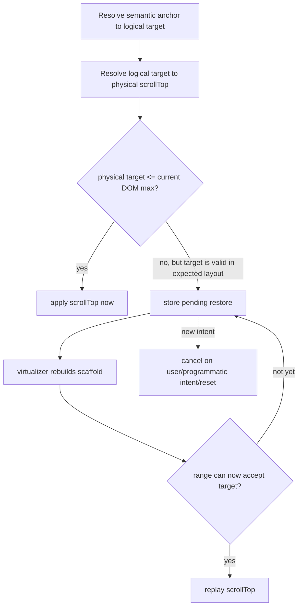

Verdict: accepted.

This is the missing contract. Scroll restoration is not complete when
`scrollTo` is called. It is complete when the physical DOM range can represent
the logical target.

## Final Runtime Sequence

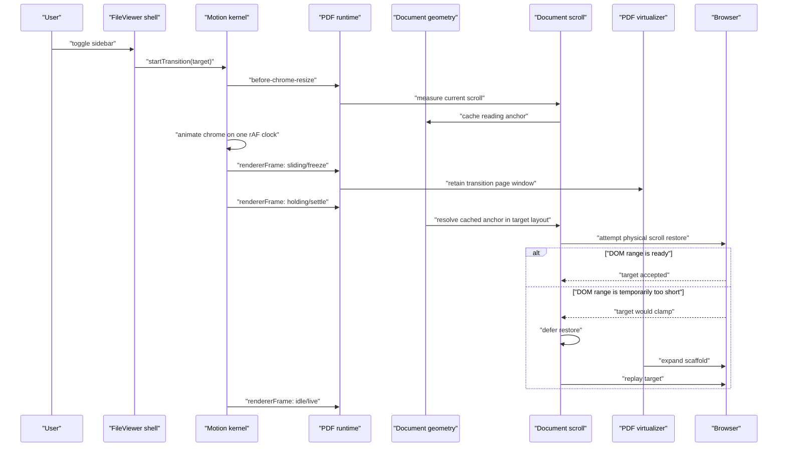

## Final State Machine

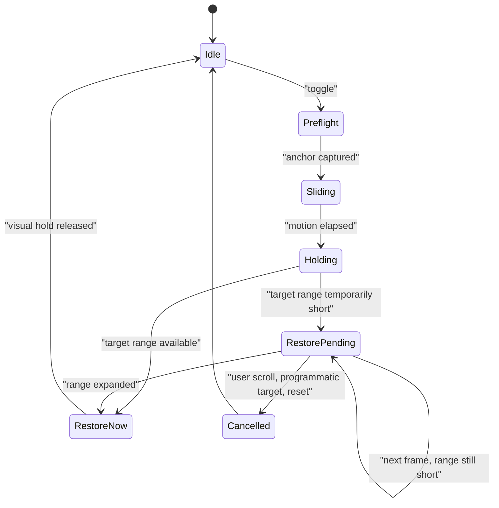

## Ownership Graph

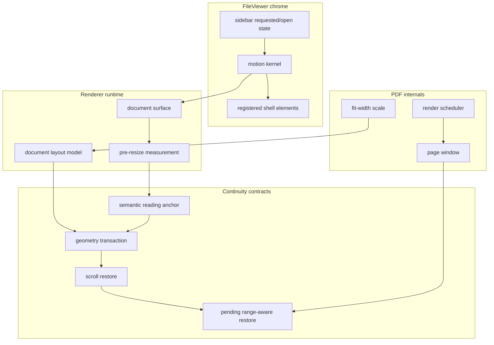

## Perfect Design Invariants

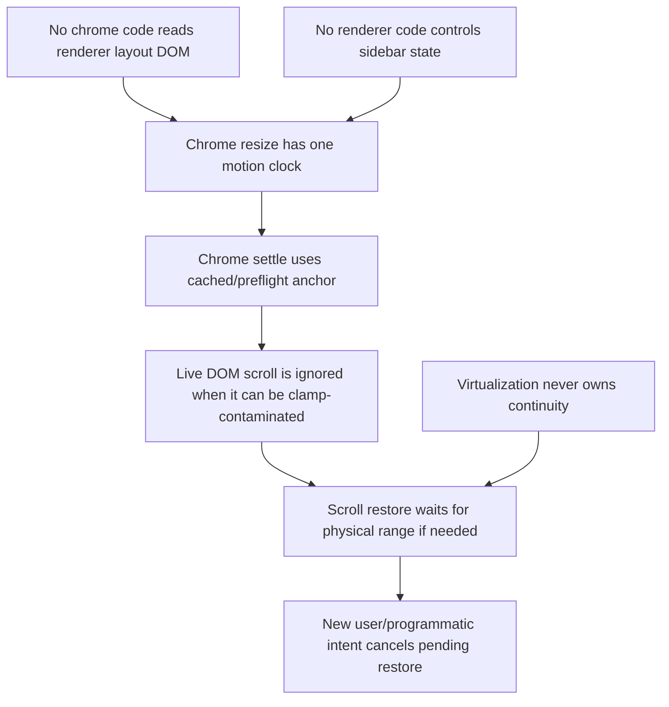

These are the non-negotiable contracts. If a future refactor violates one, the
toggle can regress even if the ordinary page-4 case still works.

## Are We At Perfection?

For the observed bug path, yes: the design now matches the problem.

For the component as a whole, the final compression target is this:

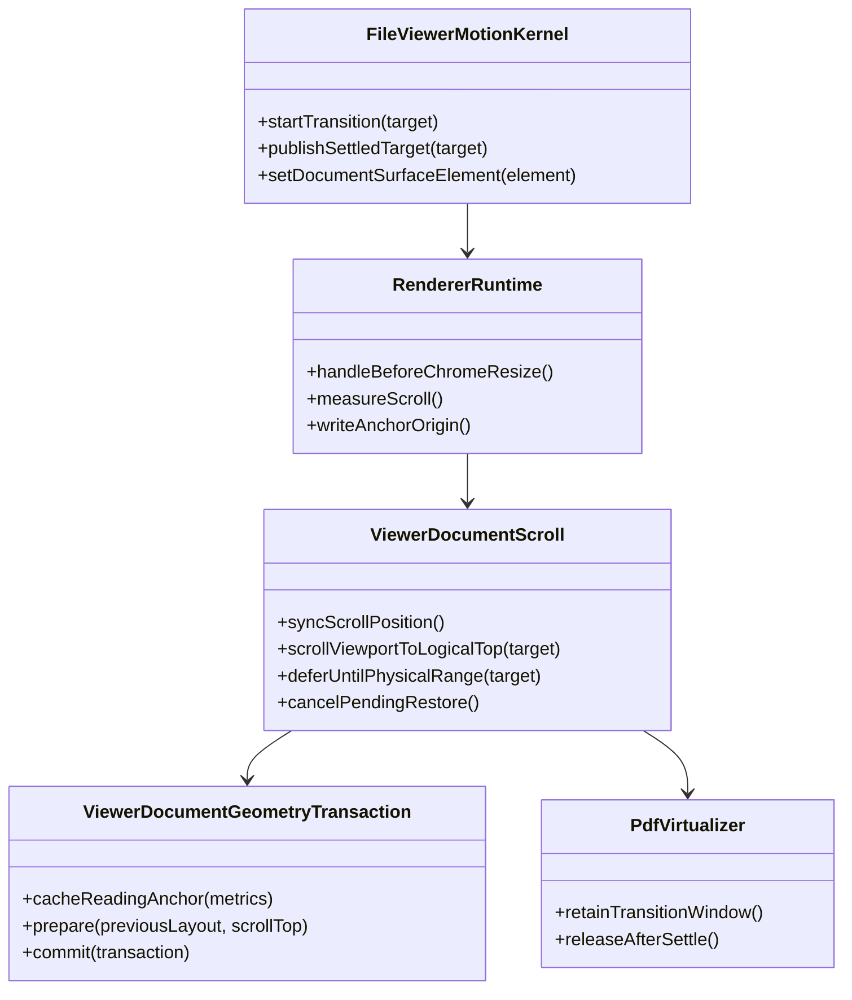

The current implementation already has these responsibilities, but they are
spread across hooks. The only possible next perfection pass would be
compression: make the names and module boundaries line up exactly with this
class diagram.

## Final Sentence

Sidebar toggle is not a PDF resize. It is a chrome viewport transition that
preserves a semantic reading anchor, then commits the renderer resize only when
the scroll range can represent the target.
