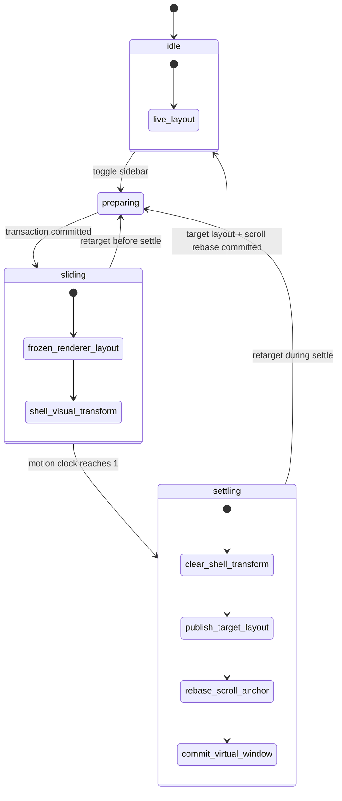
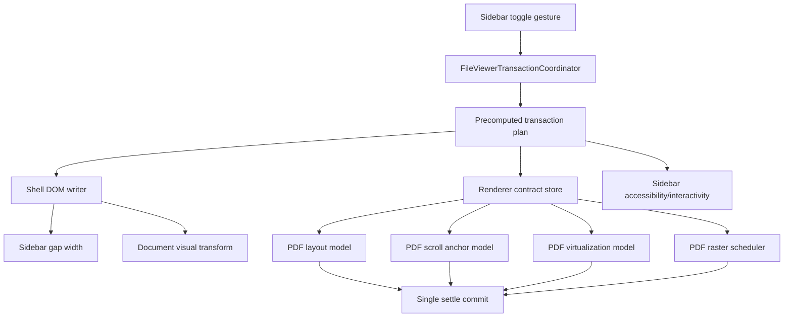
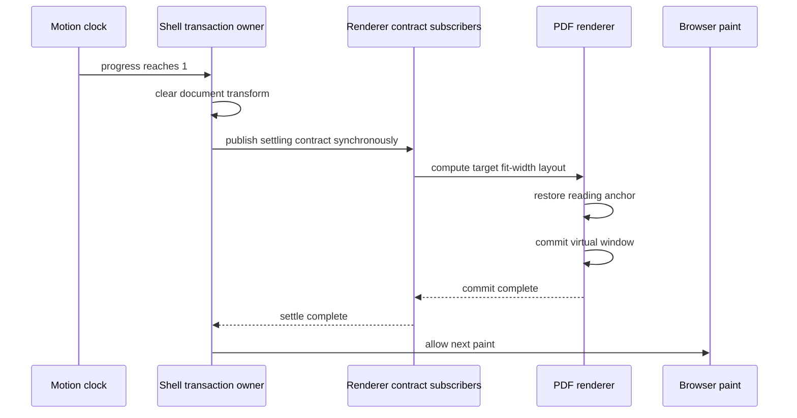
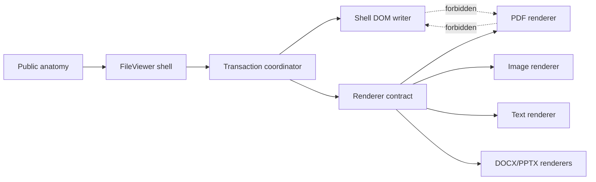
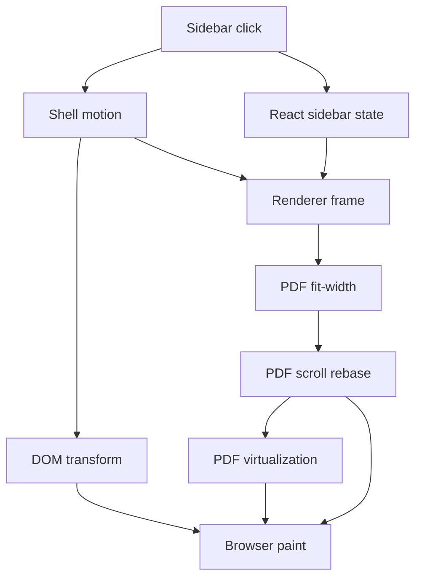
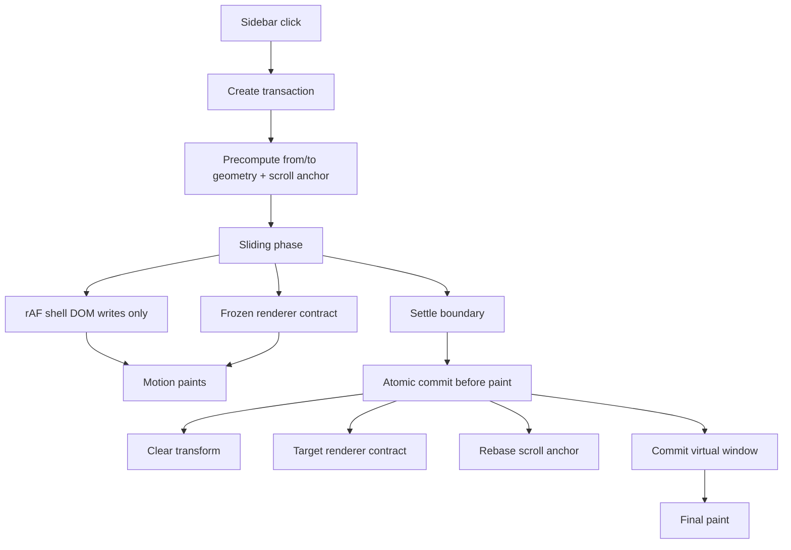

# FileViewer Single-Transaction Motion Blueprint

## Status

Draft for the next FileViewer architecture cut.

This blueprint exists because repeated small fixes to the PDF sidebar toggle have improved symptoms without eliminating the underlying instability. That pattern is itself evidence: the current design makes a single user gesture travel through too many semi-independent systems.

## Thesis

The sidebar toggle must be modeled as one transaction.

Today it is not. One click changes sidebar geometry, document frame size, visual transforms, PDF fit-width scale, scroll anchoring, virtualization, raster preparation, and header metadata through separate owners. The browser can observe intermediate combinations of those states. That is the root issue.

The platonic design is:

> One gesture creates one transition transaction, owned by one coordinator, with one coordinate system, one renderer contract, and one paint boundary.

Everything else follows from that sentence.

## Current Failure Mode

When the FileViewer sidebar toggles on a fit-width PDF, these effects happen close together:

- The inline sidebar gap animates.
- The document frame width changes.
- The shell applies a visual scale so the document appears to resize smoothly.
- The PDF renderer recomputes fit-width scale at the settled width.
- The PDF scroll contract rebases physical `scrollTop` to preserve the reading anchor.
- The virtualized page window changes mounted pages.
- The PDF canvases catch up to the new raster size.
- The header changes zoom text and page metadata.

These are individually reasonable. The bug is that they are not committed as one state machine.

### Observable Symptoms

- Page content appears to move backward/forward at settle.
- `scrollTop` changes at the same time as page scale changes.
- The PDF page can briefly render at the new fit-width scale while the shell still carries the old visual transform.
- Virtualization can swap mounted pages during a visual transition, creating a blink.
- Tests pass for individual subsystems but fail under browser frame sampling.

### Root Cause

The current system mixes two transition models:

1. Shell-owned visual motion:
   The FileViewer shell freezes renderer layout and visually transforms the document.

2. Renderer-owned document layout:
   The PDF recomputes fit-width, scroll anchoring, page virtualization, and raster state from layout measurements.

The design smell is not that both models exist. The smell is that both are active during one gesture without one explicit owner deciding when each model is allowed to observe new geometry.

## Non-Goals

This blueprint does not add features.

It does not try to:

- Add new viewer chrome.
- Add more public components.
- Add more renderer options.
- Tune overscan as the primary fix.
- Hide the issue with longer animation durations.
- Preserve backward compatibility for legacy internal APIs.
- Keep old motion adapters alive.

Overscan can reduce blink after the architecture is correct. It cannot be the foundation.

## Design Principles

### 1. One Gesture, One Transaction

Every sidebar toggle creates a `ViewerLayoutTransaction`.

That transaction owns:

- source geometry
- target geometry
- motion progress
- renderer layout policy
- visual policy
- scroll policy
- virtualization policy
- settle boundary

No renderer infers transition state from ad hoc DOM size changes.

### 2. One Coordinate System Per Phase

During a phase, every subsystem must agree which coordinate system is authoritative.

- `idle`: physical DOM layout is authoritative.
- `sliding`: frozen logical document layout is authoritative; shell visual transform is presentation only.
- `settling`: target logical layout is authoritative; scroll rebase happens before paint.

There should never be a frame where PDF layout is target-sized while shell transform still represents the old-to-new scale.

### 3. Shell Owns Chrome Motion

FileViewer shell owns:

- sidebar gap width
- sidebar panel visibility/interactivity
- document visual transform
- transition clock
- settle publish

Renderers do not animate the sidebar. Renderers consume a contract.

### 4. Renderers Own Documents

Document renderers own:

- fit-width math
- page layout
- scroll anchor capture
- virtualization window
- raster preparation
- renderer-specific controls

Renderers must not read sidebar DOM. They must not infer chrome state from parent DOM transitions.

### 5. No Public DOM Contract

DOM reads and writes are allowed only inside internal shell contracts.

Allowed:

- FileViewer shell measuring its own root.
- FileViewer shell writing sidebar gap and visual transform styles.
- Renderer measuring its own viewport or page surfaces.

Forbidden:

- PDF querying FileViewer sidebar nodes.
- FileViewer querying PDF internals to decide motion.
- Cross-sibling effects where controls placement depends on another component's DOM after render.

### 6. Precompute Before Motion

Before motion starts, compute:

- from inline size
- to inline size
- sidebar from/to width
- visual scale range
- renderer frozen logical size
- renderer target logical size
- raster preparation size
- scroll anchor snapshot
- virtualization retention window

Motion should read a precomputed transaction, not discover facts mid-flight.

### 7. Paintless Settle

Settle must be an atomic boundary:

1. Clear shell visual transform.
2. Publish target renderer layout.
3. Restore/rebase scroll anchor.
4. Commit virtualization window.
5. Paint once.

If React is involved, this boundary must be synchronous enough that the browser cannot paint an invalid hybrid frame.

### 8. High-Entropy Internal Names

The same concept gets one name:

- `transaction`
- `phase`
- `fromInlineSize`
- `toInlineSize`
- `layoutInlineSize`
- `visualScale`
- `rasterInlineSize`
- `scrollAnchor`
- `settle`

Avoid synonyms like `frame`, `surface`, `snapshot`, `target`, and `geometry` referring to the same thing in different modules. If a name remains, it must mean one precise thing.

## Target Architecture

### Public Surface

Public exports should remain shadcn-like anatomy plus resource helpers.

Keep:

- `FileViewer`
- `FileViewerProvider`
- `FileViewerHeader`
- `FileViewerTitle`
- `FileViewerMeta`
- `FileViewerControls`
- `FileViewerContent`
- `FileViewerInset`
- `FileViewerSidebar`
- `FileViewerSidebarTrigger`
- `FileViewerSidebarContent`
- `FileViewerSourceList`
- renderer components such as `PdfViewer`, `ImageViewer`, `TextViewer`
- resource helpers
- one public sidebar hook if needed for composition

Do not expose:

- motion kernel
- renderer frame hooks
- viewport measurement hooks
- DOM registration APIs
- geometry stores
- transition plans

The public API should read like shadcn Sidebar: anatomy outside, state coordination inside.

### Internal Modules

The ideal module split:

```txt
file-viewer/
  public anatomy
    file-viewer.tsx
    file-viewer-provider.tsx
    file-viewer-header.tsx
    file-viewer-content.tsx
    file-viewer-sidebar.tsx

  shell transaction
    file-viewer-transaction.ts
    file-viewer-transaction-store.ts
    file-viewer-transaction-dom.ts
    file-viewer-transaction-provider.tsx

  renderer contract
    file-viewer-renderer-contract.ts
    file-viewer-renderer-provider.tsx

  accessibility and commands
    file-viewer-accessibility.ts
    file-viewer-command-bus.ts
    file-viewer-keyboard.ts
```

Renderer-specific files consume only `file-viewer-renderer-contract.ts`.

## Core Contract

The renderer should receive a single immutable transaction frame:

```ts
type FileViewerTransactionPhase = "idle" | "sliding" | "settling";

type FileViewerRendererLayoutPolicy = "live" | "frozen" | "target";
type FileViewerRendererScrollPolicy = "preserve" | "defer" | "rebase";
type FileViewerRendererVisualPolicy = "none" | "shell-transform";

type FileViewerRendererContract = {
  phase: FileViewerTransactionPhase;
  transactionId: number | null;

  layoutPolicy: FileViewerRendererLayoutPolicy;
  scrollPolicy: FileViewerRendererScrollPolicy;
  visualPolicy: FileViewerRendererVisualPolicy;

  layoutInlineSize: number;
  fromInlineSize: number;
  toInlineSize: number;
  rasterInlineSize: number;
  visualScale: number;

  motionProgress: number;
  motionDurationMs: number;
};
```

Important rule:

`visualScale` is a shell presentation value. Renderers may use it for diagnostics, but must not use it to compute logical document layout.

## State Machine



## Data Flow



No arrow should go from `PdfLayout` back to `ShellDom`. No arrow should go from `PdfVirtual` to sidebar state.

## Phase Semantics

### Idle

The renderer contract says:

- `phase: "idle"`
- `layoutPolicy: "live"`
- `scrollPolicy: "preserve"`
- `visualPolicy: "none"`
- `layoutInlineSize = current frame width`
- `fromInlineSize = layoutInlineSize`
- `toInlineSize = layoutInlineSize`
- `visualScale = 1`

Renderers may measure normally.

### Preparing

Preparing is internal. It should not be observable by renderers.

Coordinator computes:

- current shell inline size
- current sidebar inline size
- target sidebar inline size
- current document inline size
- target document inline size
- retained scroll anchor
- retained virtual window
- raster target inline size

If any required measurement is missing, the transaction does not start. The shell stays idle.

### Sliding

The renderer contract says:

- `phase: "sliding"`
- `layoutPolicy: "frozen"`
- `scrollPolicy: "defer"`
- `visualPolicy: "shell-transform"`
- `layoutInlineSize = fromInlineSize`
- `rasterInlineSize = max(fromInlineSize, toInlineSize)`
- `visualScale = currentVisualInlineSize / fromInlineSize`

The shell writes:

- sidebar gap width each rAF
- document surface transform each rAF

React subscribers should not receive every rAF.

The renderer must not:

- recompute fit-width from transient visual width
- rebase scroll
- shrink the virtual window
- remount visible pages because of shell animation

The renderer may:

- prepare raster work for `rasterInlineSize`
- keep extra overscan mounted
- update non-layout UI that does not affect document geometry

### Settling

The renderer contract says:

- `phase: "settling"`
- `layoutPolicy: "target"`
- `scrollPolicy: "rebase"`
- `visualPolicy: "none"`
- `layoutInlineSize = toInlineSize`
- `visualScale = 1`

This phase must commit before paint.

The order is mandatory:



If the browser can paint between `clear document transform` and `restore reading anchor`, the design has failed.

## PDF Renderer Contract

PDF must interpret the FileViewer contract like this:

| Phase      | Fit-width input         | Scroll behavior            | Virtualization behavior   | Raster behavior            |
| ---------- | ----------------------- | -------------------------- | ------------------------- | -------------------------- |
| `idle`     | live frame width        | normal preserve            | normal window             | normal                     |
| `sliding`  | frozen `fromInlineSize` | do not rebase              | retain current + overscan | prepare `rasterInlineSize` |
| `settling` | target `toInlineSize`   | rebase anchor before paint | commit target window      | promote prepared raster    |

PDF-specific invariants:

- Fit-width scale derives from `layoutInlineSize`, never from transformed DOM rects.
- Scroll anchor is logical, not physical.
- Physical `scrollTop` may change at settle, but the reading marker must remain visually stable.
- Virtualization must not drop the currently visible page family during `sliding`.
- Canvas bitmap size may lead visual size, never lag enough to blur after settle.

## Virtualization Model

Virtualization should be driven by logical document layout, not visual transform.

During `sliding`:

- Use the frozen logical layout.
- Keep the previous visible window.
- Add directional hover-scan / overscan for the target layout.
- Do not remove pages that were visible at transaction start.

During `settling`:

- Compute target visible window from the rebased logical scroll top.
- Swap to target window in the same commit as scroll rebase.

After `idle`:

- Normal pruning may resume.

### Retention Window

The transaction should capture:

```ts
type RendererRetentionWindow = {
  transactionId: number;
  frozenPageNumbers: readonly number[];
  targetPageNumbers: readonly number[];
};
```

The rendered page set during `sliding` is:

```txt
visible pages = frozenPageNumbers union targetPageNumbers union overscan
```

That prevents blink without turning virtualization off.

## Scroll Model

The scroll model should never be a side effect of arbitrary layout changes.

It should be explicit:

```ts
type DocumentScrollAnchor =
  | { kind: "top" }
  | {
      kind: "page-marker";
      pageNumber: number;
      yPercent: number;
      markerRatio: number;
    };
```

At transaction start:

- Capture anchor from frozen layout and current logical scroll top.

During sliding:

- Do not restore scroll.
- Keep physical scroll stable.

At settle:

- Resolve anchor in target layout.
- Write physical scroll position before paint.
- Publish current page from the resolved logical anchor, not from an intermediate scroll event.

## DOM Ownership Rules

### FileViewer Shell May Read

- root inline size
- sidebar declared width
- document frame inline size

### FileViewer Shell May Write

- sidebar gap width
- sidebar panel accessibility / inert / pointer events
- document surface transform
- root data attributes

### Renderer May Read

- renderer viewport size
- renderer document/page measurements
- renderer scroll container

### Renderer May Write

- renderer scroll position
- renderer canvas styles
- renderer virtual spacer sizes

### Forbidden

- Renderer reads sidebar gap.
- Renderer reads FileViewer root width during motion.
- Shell reads PDF page rect to decide sidebar animation.
- Public API exposes internal DOM registration.

## Public API Shape

The public surface should feel like this:

```tsx
<FileViewerProvider source={source}>
  <FileViewer>
    <FileViewerHeader>
      <FileViewerSidebarTrigger />
      <FileViewerTitle />
      <FileViewerMeta />
      <FileViewerControls />
    </FileViewerHeader>
    <FileViewerContent>
      <FileViewerSidebar>
        <FileViewerSidebarContent />
      </FileViewerSidebar>
      <FileViewerInset>
        <PdfViewer />
      </FileViewerInset>
    </FileViewerContent>
  </FileViewer>
</FileViewerProvider>
```

No `FileViewer.Surface`.

No `FileViewer.Header`.

No public `useFileViewerGeometry`.

No public `useFileViewerRendererFrame`.

Internals may use providers and stores, but the public grammar is anatomy.

## Implementation Plan

### Step 1: Name the Transaction

Create an internal `file-viewer-transaction.ts`.

Move transaction types out of generic geometry naming:

- `FileViewerTransaction`
- `FileViewerTransactionPhase`
- `FileViewerTransactionPlan`
- `FileViewerRendererContract`

Delete or quarantine vague aliases that make the same state look like separate concepts.

### Step 2: Replace Motion Kernel With Transaction Coordinator

The current motion kernel should become a coordinator with three responsibilities:

- start transaction
- write hot DOM motion
- publish synchronous settle contract

It should not be a general geometry store.

Expected API:

```ts
type FileViewerTransactionCoordinator = {
  getContractSnapshot(): FileViewerRendererContract;
  subscribe(listener: () => void): () => void;
  registerShellElements(elements: ShellElements): void;
  start(input: StartFileViewerTransactionInput): void;
  retarget(input: StartFileViewerTransactionInput): void;
  settleNow(): void;
};
```

### Step 3: Make Renderer Contract the Only Renderer Input

Renderers should receive:

- `layoutInlineSize`
- `rasterInlineSize`
- `phase`
- `transactionId`
- policies

They should not receive:

- sidebar open state
- sidebar width
- shell inline size
- raw motion progress unless needed for diagnostics

### Step 4: Move PDF Transition Logic Behind One Adapter

Create a small internal PDF adapter:

```ts
function createPdfLayoutInputFromFileViewerContract(
  contract: FileViewerRendererContract,
  measuredInlineSize: number | null,
): PdfLayoutInput;
```

This function decides fit-width input. That decision should not be repeated in hooks.

### Step 5: Make Scroll Restore Transaction-Aware

`viewer-document-scroll.ts` should stop classifying generic geometry changes and instead receive explicit policies:

- `preserve`: normal layout change
- `defer`: capture but do not write
- `rebase`: write target scroll before paint

The generic hook should not infer chrome-resize semantics from stringly transition metadata.

### Step 6: Make Virtualization Transaction-Aware

PDF virtualization should accept:

- current logical layout
- target logical layout if settling
- retained page set
- overscan policy

During `sliding`, it should not prune the retained set.

### Step 7: Delete Transitional Concepts

After the new transaction path exists, delete:

- old geometry naming where it duplicates transaction state
- old compatibility adapters
- old renderer frame concepts that leak shell internals
- any timer that exists only to compensate for unsynchronized settle

No shim layer.

## Required Tests

### Unit Tests

Transaction coordinator:

- creates frozen contract on sidebar close
- creates frozen contract on sidebar open
- retargets mid-flight without publishing impossible geometry
- publishes settle contract once
- clears visual transform before subscriber notification
- flushes settle subscribers synchronously
- never notifies React on rAF hot path

Renderer contract:

- `sliding` resolves layout from `fromInlineSize`
- `settling` resolves layout from `toInlineSize`
- `idle` resolves layout from measured inline size
- raster size is max of from/to during motion

Scroll:

- captures page-marker anchor at transaction start
- does not write scroll during `defer`
- writes target scroll during `rebase`
- emits current page from target logical anchor

Virtualization:

- retains visible pages during `sliding`
- unions frozen and target windows
- prunes only after `idle`

### E2E Tests

Browser frame-sampling tests are mandatory.

For PDF:

- scroll to page 4
- close sidebar
- sample every animation frame
- assert no page width overshoot
- assert physical scroll is stable during `sliding`
- assert physical scroll rebases at `settling`
- assert the reading marker page top remains visually stable
- assert mounted page set does not blink during `sliding`
- assert header zoom changes only at settle

For image:

- canvas identity is stable during toggle
- no blank frame

For text/markdown:

- scrollTop is stable during sliding
- virtual canvas width is frozen during sliding
- target width commits once

For DOCX/PPTX:

- zoom/slide scale frozen during sliding
- target scale commits once
- mounted pages/slides stable during sliding

### Visual Invariant Test

The most important E2E assertion:

```txt
For every sampled frame:
  visualReadingMarkerDelta <= 1px
```

Do not only assert `scrollTop`. Physical scroll can legitimately change at settle. The user sees visual reading position, not raw scrollTop.

## Acceptance Criteria

The component reaches the target design when all are true:

- A sidebar toggle is represented by exactly one transaction object.
- Renderers consume one renderer contract and no FileViewer DOM.
- Sliding never causes renderer logical layout recomputation.
- Settling cannot paint a hybrid frame.
- Physical scroll changes only at explicit rebase boundaries.
- Virtualization never removes the active reading window during motion.
- PDF, image, text, markdown, DOCX, and PPTX share the same shell contract.
- Public API stays anatomical and shadcn-like.
- Internal names are consistent across shell, renderer, scroll, and virtualization.
- There are no legacy compatibility paths.

## Mermaid: Desired Ownership



## Mermaid: Bad Current Shape



Problem: many arrows reach paint independently.

## Mermaid: Good Target Shape



## Final Judgment

The current architecture is close in surface shape but not in transaction semantics.

The next cut should not add more patches around individual renderers. It should replace the hidden distributed transaction with an explicit single transaction coordinator and force every renderer to consume that one contract.

That is the smallest design that can be fast, simple, complete, and stable.
